# 2. Installing m2eclipse

* Introduction to m2eclipse
* Downloading Eclipse
* Installing and launching Eclipse
   * Methods to install m2eclipse
      * Using Eclipse Marketplace
      * Using Update Site
* Setting up Maven for use
* Summary

Iniciamos nuestro viaje dando el primer paso en el capítulo anterior; aquí daremos un paso más. En este capítulo, comenzaremos con la instalación de un IDE, es decir, Eclipse, y luego entraremos en los detalles de la instalación de la integración de Maven en el complemento Eclipse, es decir, **m2eclipse**. Los temas cubiertos en este capítulo son:

* Introducción a m2eclipse
* Descargando Eclipse
* Instalación y ejecución de Eclipse
* Métodos para instalar m2eclipse
* Configuración de Maven para su uso

## Introducción a m2eclipse

m2eclipse es un complemento que proporciona integración de Maven con Eclipse. Tiene la intención de cerrar la brecha entre Eclipse y Maven, ayudar a crear proyectos usando interfaces simples e intuitivas de Maven Archetypes, y lanzar y administrar la construcción de proyectos usando un editor simple. Hace que el uso de Maven directamente desde el IDE sea mucho más fácil. Algunas de las características proporcionadas por m2eclipse son las siguientes:

* Crear e importar proyectos de Maven
* Lanzamiento de la compilación de Maven desde Eclipse
* Gestión de dependencias para la ruta de compilación de Eclipse
* Descargas y actualizaciones automáticas de dependencias
* Materializando un proyecto
* Navegar y buscar repositorios Maven remotos
* Proporcionar soporte para proyectos Maven de varios módulos

Además de las características anteriores, junto con diferentes conectores m2e y el complemento Mylyn, proporciona la capacidad de comunicarse con repositorios de versiones de código e interfaces basadas en tareas.

m2eclipse existe desde 2006 y se le atribuye a Eugene Kuleshov. Fue desarrollado bajo la comunidad de Codehaus durante 2 años antes de ser trasladado a la Fundación Eclipse en 2008.

## Descargando Eclipse

Si tiene Eclipse instalado, puede omitir esta sección y la siguiente y pasar de inmediato a la sección Instalación de m2eclipse.

Para descargar Eclipse, visite la siguiente URL:

https://www.eclipse.org/downloads/

Se puede visualizar la siguiente captura de pantalla. En el momento de escribir este libro, la última versión de Eclipse es Eclipse Kepler 4.3.2 SR2, y la descargaremos y usaremos durante el resto del libro.

Elija un sistema operativo apropiado del menú desplegable y descargue el paquete **Eclipse IDE for Java Developers** para la arquitectura correspondiente, es decir, 32 o 64 bits (que se muestra en la siguiente captura de pantalla). Elija **32 bits** para Java de 32 bits o 64 bits para Java de **64 bits** instalado en el sistema.

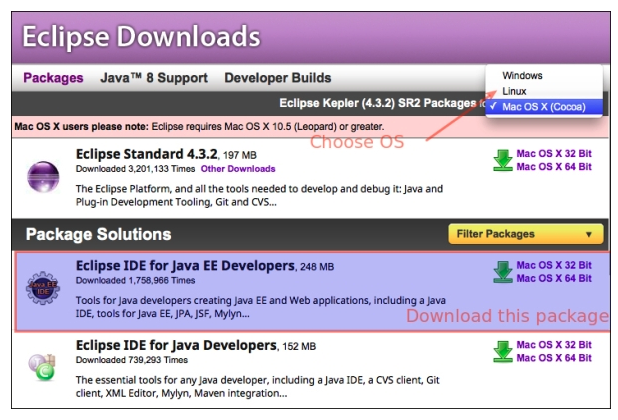

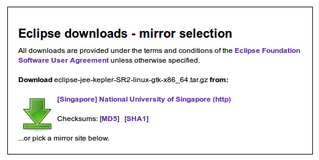

## Installing and launching Eclipse

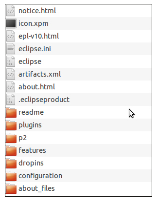

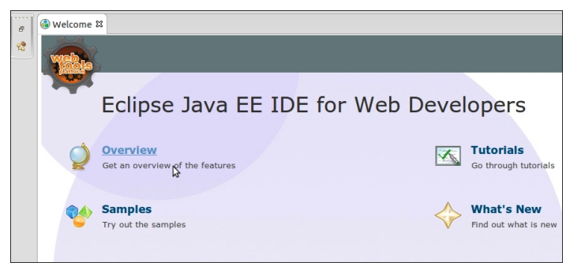

### Methods to install m2eclipse
#### Using Eclipse Marketplace

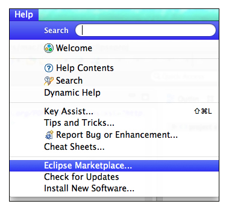

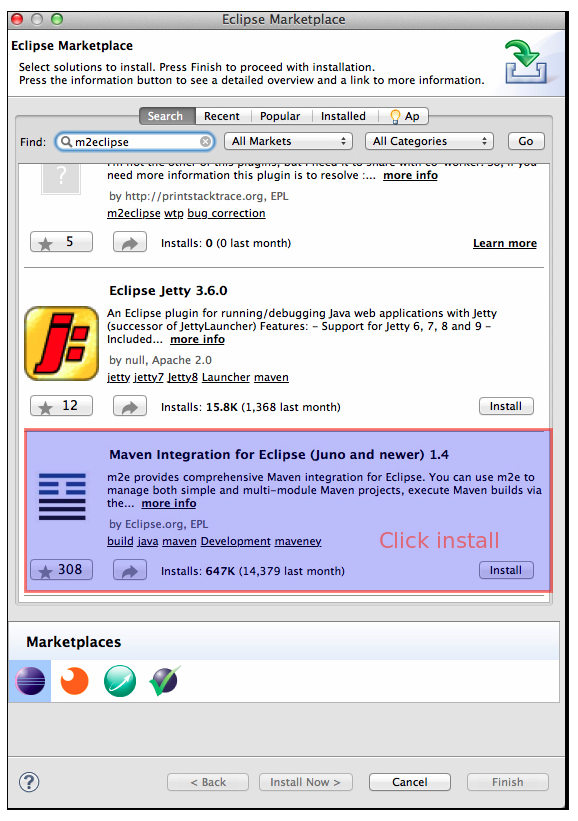

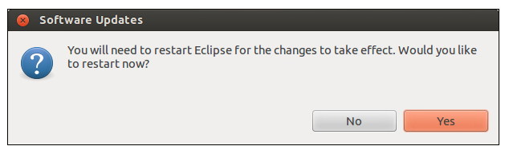

#### Using Update Site

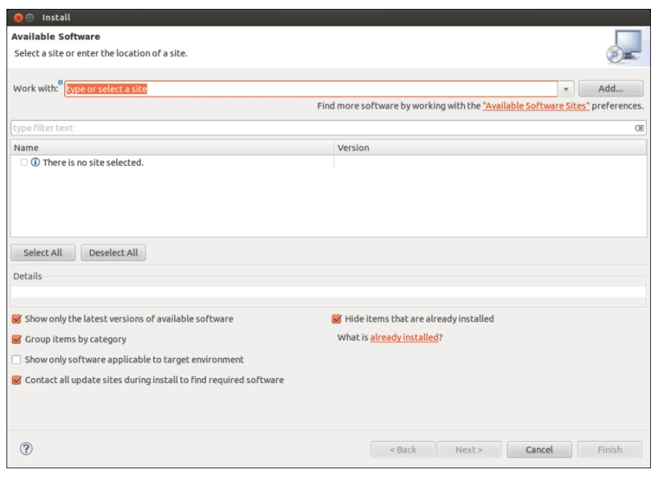

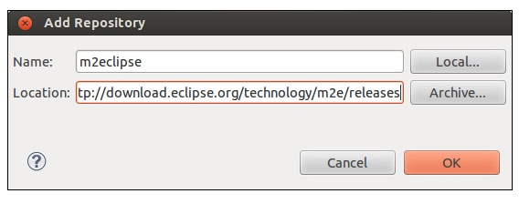
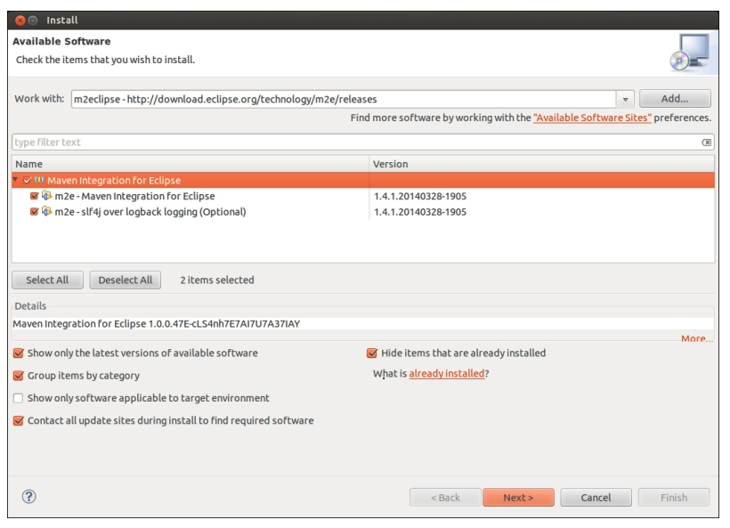
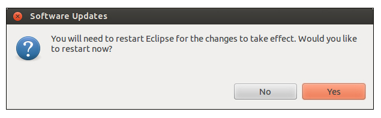
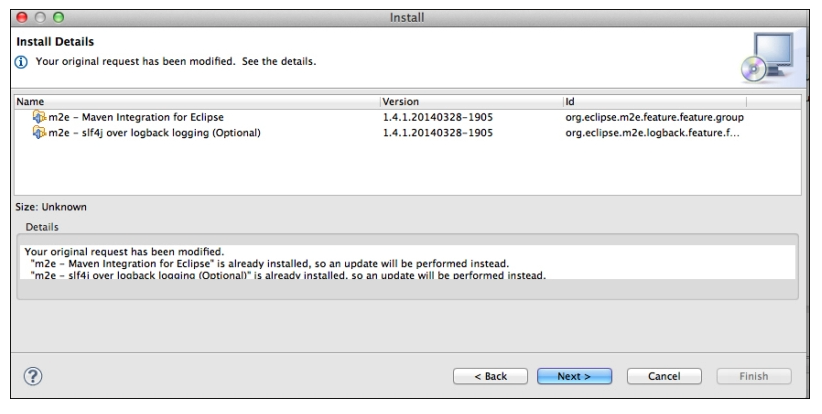

## Setting up Maven for use

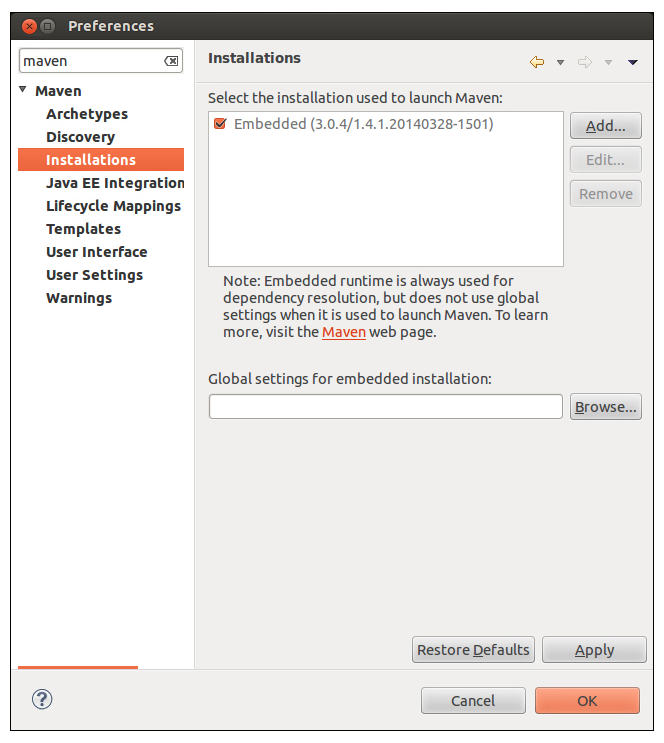
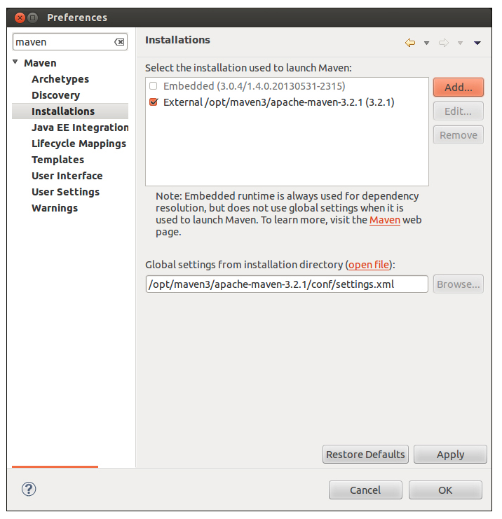

## Summary
