# 3. Creating and Importing Projects

* The Maven project structure
* POM (Project Object Model)
   * Maven coordinates
   * POM relationships
   * A simple POM
   * A super POM
* The Maven project build architecture
* Other essential concepts
   * Repository
      * The local repository
      * The central repository
      * The remote repository
      * Search sequence in repositories
   * Project dependencies
      * Dependency scopes
      * Transitive dependencies
   * Plugins and goals
   * Site generation and reporting
* Creating a Maven project
   * Using an archetype
   * Using no archetypes
   * Checking out a Maven project
* Importing a Maven project
* Summary

Sigamos con nuestro viaje. En este capítulo, comenzaremos con la estructura del proyecto Maven seguida de la build architecture(arquitectura de compilación), luego cubriremos algunos conceptos esenciales y finalmente aprenderemos cómo crear proyectos Maven simples. El capítulo se divide en las siguientes secciones:

* La estructura del proyecto Maven
* **POM (Project Object Model)**
   * Maven coordinates (Coordenadas de Maven)
   * Relaciones POM
   * POM simple
   * Super POM
* La build architecture del proyecto Maven
* Otros conceptos esenciales
   * Repository
   * Dependencias del proyecto
   * Plugins y goals
   * Site generation y reporting
* Creando un proyecto Maven
   * Usando un archetype
   * Sin archetype
   * Checking un proyecto de Maven
* Importación de proyectos de Maven

## La Estructura del Proyecto Maven

Maven, como se indicó en capítulos anteriores, sigue la convención sobre la configuración. Esto nos hace creer que existe un diseño estándar de la estructura del proyecto Maven. Antes de comenzar a crear y jugar con proyectos de Maven, primero comprendamos el diseño común básico de los proyectos de Maven, de la siguiente manera:

Folder/Files         | Descripción
---------------------|------------
`src/main/java`      | Contiene los archivos fuente de Java de una aplicación.
`src/main/resources` | Contiene archivos de los recursos de una aplicación, como imágenes, sonidos, plantillas, etc.
`src/main/filters`   | Contiene los archivos de filtro del recurso.
`src/main/config`    | Este contiene los archivos de configuración de la aplicación.
`src/main/scripts`   | Esto tiene archivos de scripts específicos de la aplicación.
`src/main/webapp`    | Tiene archivos de origen para aplicaciones web.
`src/test/java`      | Contiene archivos de prueba unitaria de Java
`src/test/resources` | Esto tiene recursos específicos de pruebas unitarias que se utilizan en una aplicación.
`src/filters`        | Esto tiene archivos del filtro específico de prueba para recursos.
`src/it`             | Esto tiene archivos de pruebas de integración (principalmente para plugins)
`src/assembly`       | Contiene archivos de descriptores de ensamblado.
`src/site`           | Esto contiene artefactos del sitio
`LICENSE.txt`        | Esto denota la licencia de proyectos
`NOTICE.txt`         | Esto incluye el aviso y las atribuciones de las que depende el proyecto.
`README.txt`         | Esto denota la información readme del proyecto.
`target`             | Esto alberga toda la salida de la construcción.
`pom.xml`            | Este es el archivo `pom` del proyecto (que se discutirá en detalle en las próximas secciones)

Aunque el diseño mencionado anteriormente es la convención estándar recomendada, esto siempre se puede anular en el archivo descriptor del proyecto (archivo `pom`).

## POM (Project Object Model)

**POM** son las siglas de **Project Object Model**. Es principalmente una representación XML de un proyecto en un archivo llamado `pom.xml`. POM es la identidad de un proyecto de Maven y sin él, el proyecto no tiene existencia. Es análogo a un archivo **Make** o un archivo `build.xml` de Ant.

Un proyecto en un sentido amplio debe contener más que simples archivos de código y debe actuar como una ventanilla única para todas las cosas que le conciernen. Maven satisface esta necesidad utilizando el archivo `pom`. POM tiende a responder preguntas como: ¿Dónde está el código fuente? ¿Dónde están los recursos? ¿Cómo se hace el empaque? ¿Dónde están las pruebas unitarias? ¿Dónde están los artefactos? ¿Cómo es el entorno de construcción? ¿Quiénes son los actores del proyecto? y así.

En pocas palabras, el contenido de POM se clasifica en las siguientes cuatro categorías:

* **Información del proyecto**: proporciona información general del proyecto, como el nombre del proyecto, la URL, la organización, la lista de desarrolladores y contribuyentes, la licencia, etc.

* **Relaciones de POM**: en casos excepcionales, un proyecto puede ser una entidad única y no depende de otros proyectos. Esta sección proporciona información sobre su dependencia, herencia del proyecto principal, sus submódulos, etc.

* **Build settings**: esta configuración proporciona información sobre la configuración de compilación de Maven. Por lo general, se realiza la personalización del comportamiento, como la ubicación de la fuente, las pruebas, la generación de informes, la compilación de complementos, etc.

* **Build environment**: especifica y activa la configuración de compilación para diferentes entornos. También utiliza perfiles para diferenciar entre entornos de desarrollo, pruebas y producción.

Un archivo POM con todas las categorías discutidas se muestra a continuación:

```xml
<project>
   <!-- The Basics Project Information-->
   <groupId>...</groupId>
   <artifactId>...</artifactId>
   <version>...</version>
   <packaging>...</packaging>
   <dependencies>...</dependencies>
   <parent>...</parent>
   <dependencyManagement>...</dependencyManagement>
   <modules>...</modules>
   <properties>...</properties>

   <!-- Build Settings -->
   <build>...</build>
   <reporting>...</reporting>
   <properties>...</properties>
   <packaging>...</packaging>

   <!-- More Project Information -->
   <name>...</name>
   <description>...</description>
   <url>...</url>
   <inceptionYear>...</inceptionYear>
   <licenses>...</licenses>
   <organization>...</organization>
   <developers>...</developers>
   <contributors>...</contributors>

   <!-- POM Relationships -->
   <groupId>...</groupId>
   <artifactId>...</artifactId>
   <version>...</version>
   <parent>...</parent>

   <dependencyManagement>...</dependencyManagement>
   <dependencies>...</dependencies>

   <modules>...</modules>

<!-- Environment Settings -->
   <issueManagement>...</issueManagement>
   <ciManagement>...</ciManagement>
   <mailingLists>...</mailingLists>
   <scm>...</scm>
   <prerequisites>...</prerequisites>
   <repositories>...</repositories>
   <pluginRepositories>...</pluginRepositories>
   <distributionManagement>...</distributionManagement>
   <profiles>...</profiles>
</project>
```

### Maven coordinates

Las coordenadas de Maven definen un conjunto de identificadores que se pueden usar para identificar de forma única un proyecto, una dependencia o un complemento en un POM de Maven. De manera análoga al álgebra, donde un punto se identifica por su coordenada en el espacio, las coordenadas de Maven marcan un lugar específico en un repositorio, actuando como un sistema de coordenadas para los proyectos de Maven. Los componentes de las coordenadas de Maven son los siguientes:

* **groupId**: Representa un grupo, empresa, equipo, organización o proyecto. Una convención general para un ID de grupo es que comienza con un nombre de dominio inverso de la organización que crea el proyecto. Sin embargo, es posible que no utilice necesariamente la notación de puntos como lo hace en el proyecto [junit](). El grupo forma la base para el almacenamiento en el repositorio y actúa de forma muy similar a como lo hace una estructura de empaquetado de Java en el sistema operativo. Los puntos correspondientes se reemplazan con separadores de directorios específicos del sistema operativo (como / en Unix), que forman la estructura de directorios relativa del repositorio base. Por ejemplo, si [groupId]() es [com.packt.mvneclipse](), reside en el directorio [$M2_REPO/com/packt/mvneclipse]().

* **artifactId**: Este es un identificador único bajo [groupId]() que representa un solo proyecto/el proyecto conocido por. Junto con la coordenada [groupId](), la coordenada [artifactId]() define completamente las living quarters(habitaciones) del artefacto dentro del repositorio. Por ejemplo, continuando con el ejemplo anterior, el ID de artefacto con [hello-project]() reside en la ruta [$M2_REPO/com/packt/mvneclipse/hello-project]().

* **project version**: Esto denota una versión específica de un proyecto. También se utiliza dentro del repositorio de un artefacto para separar versiones entre sí. Por ejemplo, [hello-project]() con la versión 1.0 reside en el directorio [$M2_REPO/com/packt/mvneclipse/hello-project/1.0/]().

* **packaging**: Describe la salida empaquetada producida por un proyecto. Si no se declara ningún paquete, Maven asume que el artefacto es el archivo [jar]() predeterminado. Los valores de empaquetado principales disponibles en Maven son: [pom](), [jar](), [maven-plugin](), [ejb](), [war](), [ear](), [rar]() y [par](). La siguiente figura ilustra un ejemplo de coordenadas de Maven:

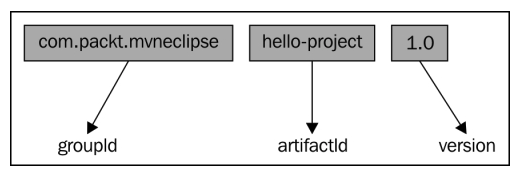

> **NOTA**
>
> Como repositorio local, [$M2_REPO]() significa el directorio [%USER_HOME% /.m2]() en la máquina del usuario.

### POM relationships

Las relaciones POM identifican la relación que poseen con respecto a otros módulos, proyectos y otros POM. Esta relación podría adoptar la forma de dependencias, proyectos de varios módulos, padre-hijo, también conocida como herencia y agregación. Los elementos de las relaciones POM se representan gráficamente como se muestra en la siguiente figura:

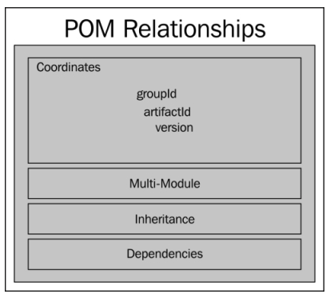

De manera similar, los elementos de las relaciones POM en el archivo XML se pueden especificar como se muestra en el siguiente código:

```xml
   <!-- POM Relationships -->
   <groupId>...</groupId>
   <artifactId>...</artifactId>
   <version>...</version>
   <parent>...</parent>
   <dependencyManagement>...</dependencyManagement>
   <dependencies>...</dependencies>
   <modules>...</modules>
```

### A simple POM

El POM más básico consta solo de las coordenadas de Maven y es suficiente para construir y generar un archivo [jar]() para el proyecto. Un archivo POM simple puede verse como el siguiente código:

```xml
<project xmlns="http://maven.apache.org/POM/4.0.0"
  xmlns:xsi="http://www.w3.org/2001/XMLSchema-instance"
  xsi:schemaLocation="http://maven.apache.org/POM/4.0.0
  http://maven.apache.org/xsd/maven-4.0.0.xsd">
  <modelVersion>4.0.0</modelVersion>

  <groupId>com.packt.mvneclipse</groupId>
  <artifactId>hello-project</artifactId>
  <version>1.0</version>

</project>
```

Los siguientes puntos explicarán estos elementos:

* El valor [modelVersion]() es [4.0.0](). Maven es compatible con esta versión del modelo POM.
* Hay un solo archivo POM para cada proyecto.
* Todos los archivos POM requieren el elemento [project]() y tres campos obligatorios: [groupId](), [artifactId]() y [version]().
* El elemento root de [pom.xml]() es [project]() y tiene tres subnodos principales.

Un POM simple (como se muestra en el fragmento de código anterior) no es suficiente en proyectos del mundo real.

### A super POM

Como Java, donde cada objeto hereda de [java.lang.Object](), cada POM hereda de un POM base conocido como **Super POM**. Implícitamente, cada POM hereda el valor predeterminado del POM base. Facilita el esfuerzo del desarrollador hacia una configuración mínima en su archivo `pom.xml`. Sin embargo, los valores predeterminados se pueden anular fácilmente cuando se especifican en el archivo `pom` correspondiente del proyecto. La configuración predeterminada del super POM puede estar disponible emitiendo el siguiente comando dentro del proyecto respectivo:

```sh
mvn help:effective-pom
```

El super POM es parte de la instalación de Maven y se puede encontrar en el archivo [maven-x.y.z-uber.jar]() o [maven-model-builder-x.y.z.jar]() en [$M2_HOME/lib](), donde [x.y.z]() denota la versión. En el archivo JAR correspondiente, hay un archivo llamado [pom-4.0.0.xml]() en el paquete [org.apache.maven.model]().

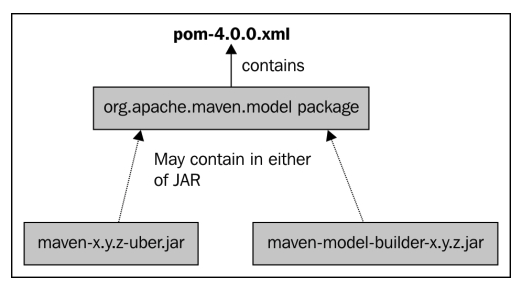

La configuración predeterminada del super POM heredado en un proyecto de muestra se proporciona de la siguiente manera; En aras de la brevedad, solo se muestran algunos aspectos importantes:

```xml
<!--General project Information -->
   <modelVersion>4.0.0</modelVersion>
   <groupId>com.packt.mvneclipse</groupId>
   <artifactId>hello-project</artifactId>
   <version>0.0.1-SNAPSHOT</version>
   <name>hello-project</name>
   <url>http://maven.apache.org</url>
   <properties>1
      <project.build.sourceEncoding>UTF8</project.build.sourceEncoding>
   </properties>

   <repositories>
      <repository>
         <snapshots>
            <enabled>false</enabled>
         </snapshots>
         <id>central</id>
         <name>Maven Repository Switchboard</name>
         <url>http://repo1.maven.org/maven2</url>
      </repository>
   </repositories>
   <pluginRepositories>
      <pluginRepository>
         <releases>
            <updatePolicy>never</updatePolicy>
         </releases>
         <snapshots>
            <enabled>false</enabled>
         </snapshots>
         <id>central</id>
         <name>Maven Plugin Repository</name>
         <url>http://repo1.maven.org/maven2</url>
      </pluginRepository>
   </pluginRepositories>

<!-- Build source directory and details -->
   <build>
…
   <sourceDirectory> ...</sourceDirectory>
   <scriptSourceDirectory>..</scriptSourceDirectory>
   <testOutputDirectory>..</testOutputDirectory>
   <outputDirectory>...<outputDirectory>
…


<finalName>hello-project-0.0.1-SNAPSHOT</finalName>
   <pluginManagement>
      <plugins>
         <plugin>
            <artifactId>maven-antrun-plugin</artifactId>
            <version>1.3</version>
         </plugin>
         <plugin>
            <artifactId>maven-assembly-plugin</artifactId>
            <version>2.2-beta-5</version>
         </plugin>
         <plugin>
            <artifactId>maven-dependency-plugin</artifactId>
            <version>2.1</version>
         </plugin>
         <plugin>
            <artifactId>maven-release-plugin</artifactId>
            <version>2.0</version>
         </plugin>
      </plugins>
   </pluginManagement>
   <plugins>


<!-- Plugins, phases and goals -->
   <plugin>
      <artifactId>maven-clean-plugin</artifactId>
      <version>2.4.1</version>
      <executions>
         <execution>
            <id>default-clean</id>
            <phase>clean</phase>
            <goals>
               <goal>clean</goal>
            </goals>
         </execution>
      </executions>
   </plugin>
   <plugin>
      <artifactId>maven-surefire-plugin</artifactId>
      <version>2.7.2</version>
      <executions>
         <execution>
            <id>default-test</id>
            <phase>test</phase>
            <goals>
               <goal>test</goal>
            </goals>
         </execution>
      </executions>
   </plugin>
   <plugin>
      <artifactId>maven-compiler-plugin</artifactId>
      <version>2.3.2</version>
      <executions>
         <execution>
            <id>default-testCompile</id>
            <phase>test-compile</phase>
            <goals>
               <goal>testCompile</goal>
            </goals>
         </execution>
         <execution>
            <id>default-compile</id>
            <phase>compile</phase>
            <goals>
               <goal>compile</goal>
            </goals>
         </execution>
      </executions>
   </plugin>
   <plugin>
      <artifactId>maven-jar-plugin</artifactId>
      <version>2.3.1</version>
      <executions>
         <execution>
            <id>default-jar</id>
            <phase>package</phase>
            <goals>
               <goal>jar</goal>
            </goals>
         </execution>
      </executions>
   </plugin>
   <plugin>
      <artifactId>maven-deploy-plugin</artifactId>
      <version>2.5</version>
      <executions>
         <execution>
            <id>default-deploy</id>
            <phase>deploy</phase>
            <goals>
               <goal>deploy</goal>
            </goals>
         </execution>
      </executions>
   </plugin>
   <plugin>
      <artifactId>maven-site-plugin</artifactId>
      <version>2.0.1</version>
      <executions>
         <execution>
            <id>default-site</id>
            <phase>site</phase>
            <goals>
               <goal>site</goal>
            </goals>
            <configuration>
   </project>
```

## La arquitectura de construcción del proyecto Maven

La siguiente figura muestra la arquitectura de compilación común para proyectos de Maven. Esencialmente, cada proyecto de Maven contiene un archivo POM que define todos los aspectos de los elementos esenciales del proyecto. Maven usa los detalles de POM para decidir sobre diferentes acciones y generación de artefactos. Las dependencias especificadas se buscan primero en el repositorio local y luego en el repositorio central. También existe la noción de que se busca en el repositorio remoto si se especifica en el POM. Hablaremos de repositorios en la siguiente sección. Además, POM define los detalles que se incluirán durante la generación del sitio.

Eche un vistazo al siguiente diagrama:

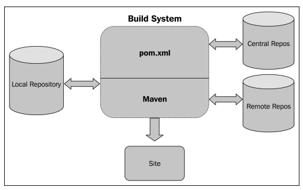

## Other essential concepts
### Repository
#### The local repository
#### The central repository
#### The remote repository
#### Search sequence in repositories

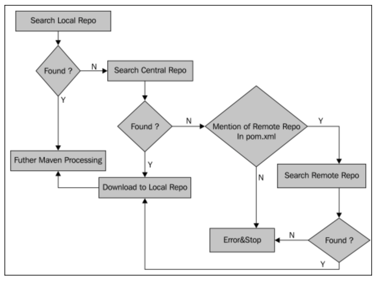

### Project dependencies
#### Dependency scopes
#### Transitive dependencies

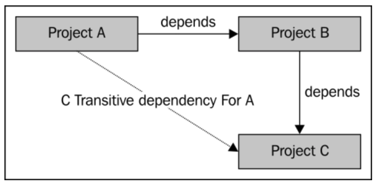

### Plugins and goals

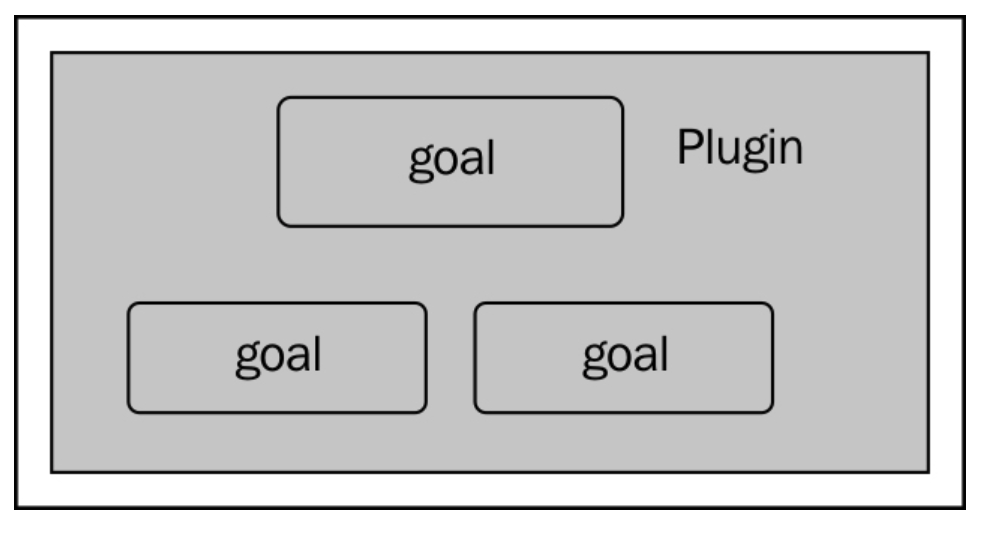

### Site generation and reporting
## Creating a Maven project
### Using an archetype

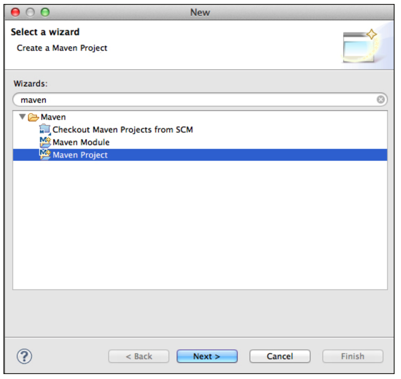


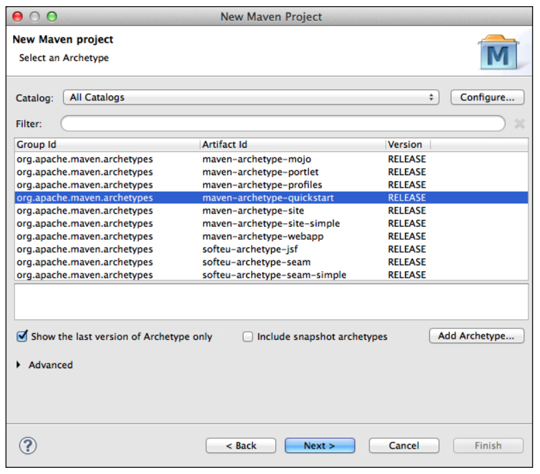

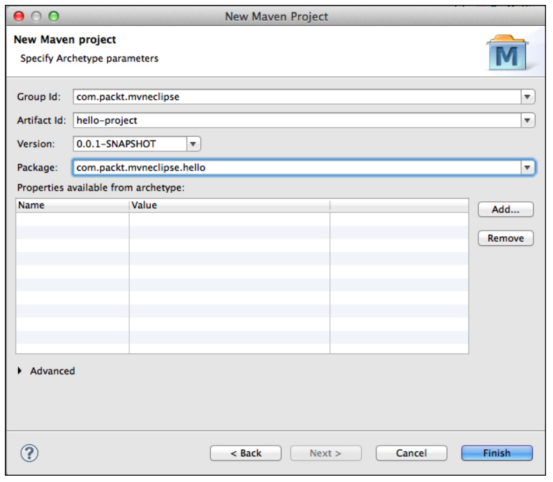

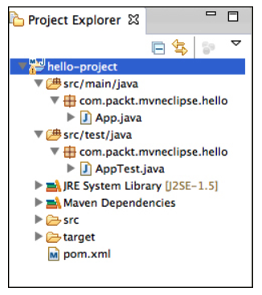

### Using no archetypes

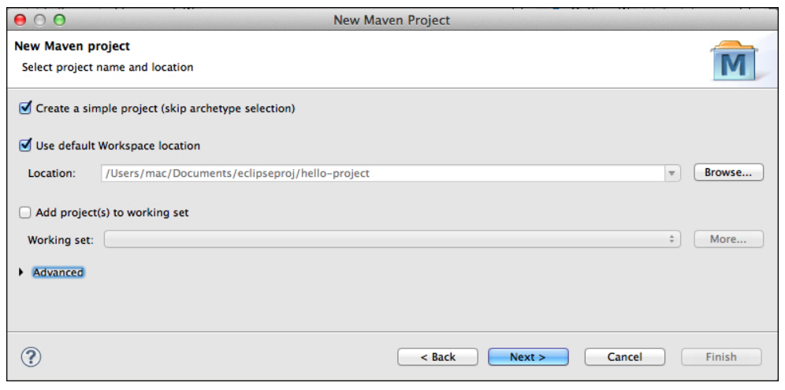

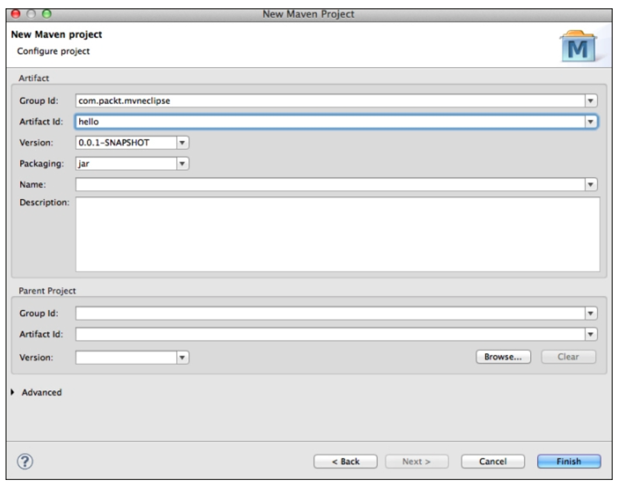

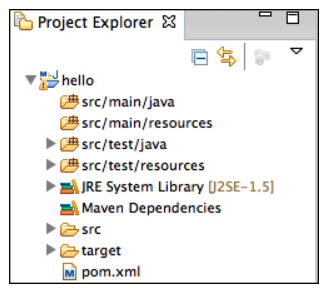

### Checking out a Maven project

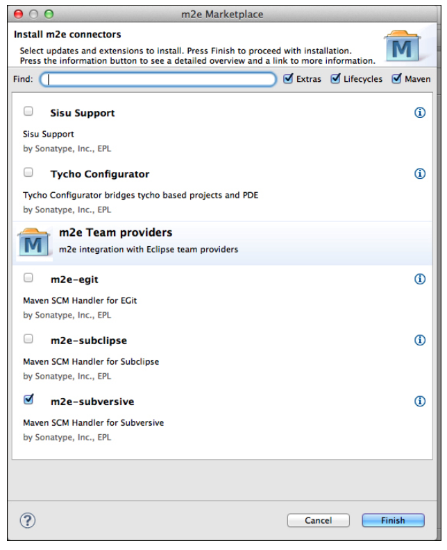

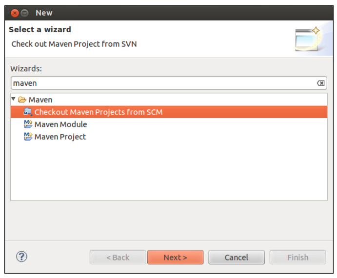

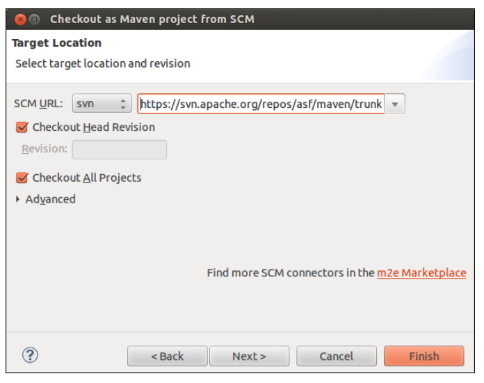

## Importing a Maven project

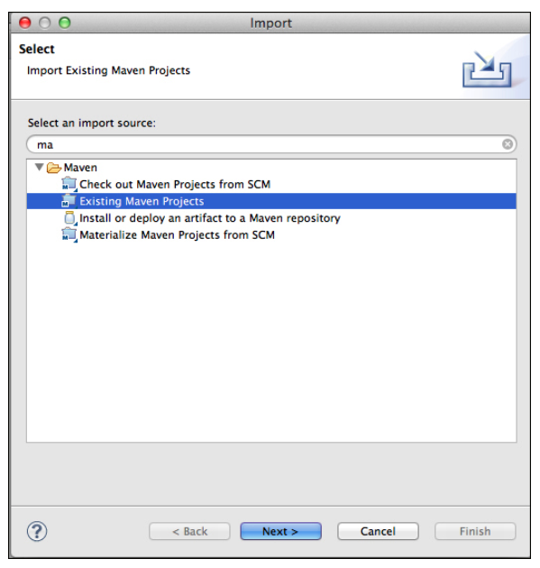

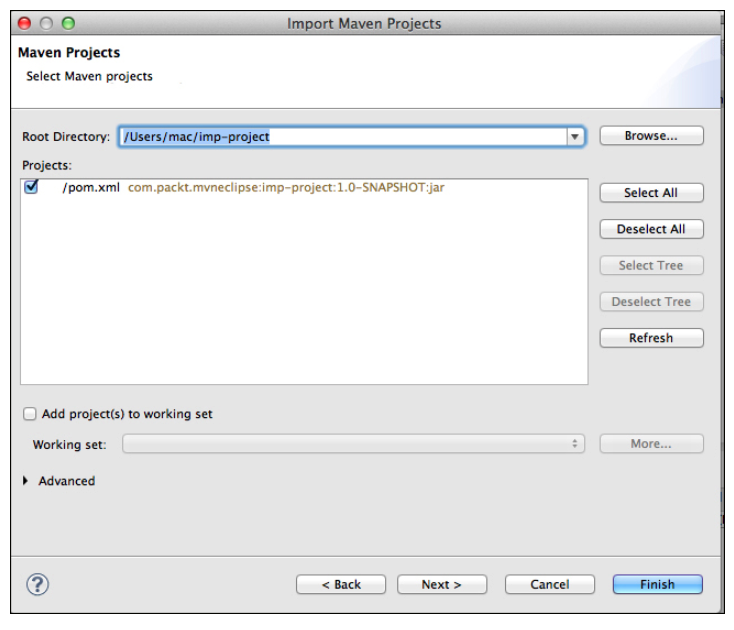

## Summary
