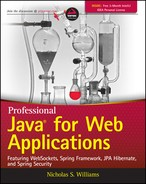

# 950 Professional Java for Web Applications

Publisher: Wrox

Release Date: March 2014

ISBN: 9781118656464

Topic: Java

### Descripción del libro

#### La guía completa de Wrox para crear aplicaciones web Java para empresas

Esta guía muestra a los desarrolladores de software e ingenieros de software de **Java** cómo crear aplicaciones web complejas en un entorno empresarial. Comenzará con una introducción a **Java Enterprise Edition** y la aplicación web básica, luego configurará un entorno de servidor de aplicaciones de desarrollo, aprenderá sobre las herramientas utilizadas en el proceso de desarrollo y explorará numerosas tecnologías y prácticas de **Java**. El libro cubre herramientas y tecnologías estándar de la industria, tecnologías específicas y conceptos de programación subyacentes.

* **Java** es un lenguaje de programación esencial que se utiliza en todo el mundo tanto para el desarrollo de aplicaciones de **Android** como para las soluciones corporativas de nivel empresarial.

* Como guía paso a paso o referencia general, este libro proporciona una solución de desarrollo **Java** todo en uno.

* Explica **Java Enterprise Edition 7** y la aplicación web básica, cómo configurar un entorno de servidor de aplicaciones de desarrollo, qué herramientas se necesitan durante el proceso de desarrollo y cómo aplicar varias tecnologías **Java**.

* Cubre nuevas funciones de lenguaje en **Java 8**, como **Lambda Expressions**, y el nuevo **Java 8 Date &amp; Time API** introducida como parte de **JSR 310**, reemplazando las legacy Date and Calendar APIs

* Demuestra la nueva tecnología de **conexión WebSocket web** totalmente dúplex y su compatibilidad con **Java EE 7**, lo que permite al lector crear aplicaciones web enriquecidas y verdaderamente interactivas que pueden enviar datos actualizados al cliente automáticamente.

* Instruye al lector sobre la configuración y el uso de **Log4j 2.0**, **Spring Framework 4** (incluido **Spring Web MVC**), **Hibernate Validator**, **RabbitMQ**, **Hibernate ORM**, **Spring Data**, **Hibernate Search** y **Spring Security**.

* Cubre el registro de aplicaciones, **JSR 340 Servlet API 3.1**, **JSR 245 JavaServer Pages (JSP) 2.3** (incluidas las bibliotecas de etiquetas personalizadas), **JSR 341 Expression Language 3.0, JSR 356 WebSocket API 1.0**, **JSR 303/349 Bean Validation 1.1**, **JSR 317/338 Java API de persistencia (JPA) 2.1**, búsqueda de texto completo con **JPA**, **RESTful** y **SOAP web services**, **Advanced Message Queuing Protocol (AMQP)** y **OAuth**.

**Professional Java for Web Applications** es la guía completa de Wrox para desarrolladores de software que están familiarizados con **Java** y que están preparados para crear aplicaciones web empresariales **Java** de alto nivel.

## Table of Contents

### Part I: [Creating Enterprise Applications](950_Professional_Java_for_Web_Applications/Parte_01.md)

#### Chapter 1: [Introducing Java Platform, Enterprise Edition](950_Professional_Java_for_Web_Applications/01_Introducing_Java_Platform_Enterprise_Edition.md)

* A Timeline of Java Platforms
* Understanding the Basic Web Application Structure
* Summary

#### Chapter 2: [Using Web Containers](950_Professional_Java_for_Web_Applications/02_Using_Web_Containers.md)

* Choosing a Web Container
* Installing Tomcat on Your Machine
* Deploying and Undeploying Applications in Tomcat
* Debugging Tomcat from Your IDE
* Summary

#### Chapter 3:[Writing Your First Servlet](950_Professional_Java_for_Web_Applications/03_Writing_Your_First_Servlet.md)

* Creating a Servlet Class
* Configuring a Servlet for Deployment
* Understanding `doGet()`, `doPost()`, and Other Methods
* Using Parameters and Accepting Form Submissions
* Configuring your Application Using Init Parameters
* Uploading Files from a Form
* Making Your Application Safe for Multithreading
* Summary

#### Chapter 4: [Using JSPs to Display Content](950_Professional_Java_for_Web_Applications/04_Using_JSPs_to_Display_Content.md)

* ` ` Is Easier Than output.println("` `")
* Creating Your First JSP
* Using Java within a JSP (and Why You Shouldn't!)
* Combining Servlets and JSPs
* A Note about JSP Documents (JSPX)
* Summary

#### Chapter 5: [Maintaining State Using Sessions](https://github.com/adolfodelarosades/Java/blob/master/temarios/950_Professional_Java_for_Web_Applications/05_Maintaining_State_Using_Sessions.md)

* Understanding Why Sessions Are Necessary
* Using Session Cookies and URL Rewriting
* Storing Data in a Session
* Applying Sessions Usefully
* Clustering an Application That Uses Sessions
* Summary

#### Chapter 6: Using the Expression Language in JSPs

* Understanding Expression Language
* Writing with the EL Syntax
* Using Scoped Variables in EL Expressions
* Accessing Collections with the Stream API
* Replacing Java Code with Expression Language
* Summary

#### Chapter 7: Using the Java Standard Tag Library

* Introducing JSP Tags and the JSTL
* Using the Core Tag Library (C Namespace)
* Using the Internationalization and Formatting Tag Library (FMT Namespace)
* Using the Database Access Tag Library (SQL Namespace)
* Using the XML Processing Tag Library (X Namespace)
* Replacing Java Code with JSP Tags
* Summary

#### Chapter 8: Writing Custom Tag and Function Libraries

* Understanding TLDs, Tag Files, and Tag Handlers
* Creating Your First Tag File to Serve as an HTML Template
* Creating a More Useful Date Formatting Tag Handler
* Creating an EL Function to Abbreviate Strings
* Replacing Java Code with Custom JSP Tags
* Summary

#### Chapter 9: [Improving Your Application Using Filters](https://github.com/adolfodelarosades/Java/blob/master/temarios/950_Professional_Java_for_Web_Applications/09_Improving_Your_Application_Using_Filters.md)

* Understanding the Purpose of Filters
* Creating, Declaring, and Mapping Filters
* Ordering Your Filters Properly
* Investigating Practical Uses for Filters
* Simplifying Authentication with a Filter
* Summary

#### Chapter 10: Making Your Application Interactive with WebSockets

* Evolution: From Ajax to WebSockets
* Understanding the WebSocket APIs
* Creating Multiplayer Games with WebSockets
* Using WebSockets to Communicate in a Cluster
* Adding "Chat with Support" to the Customer Support Application
* Summary

#### Chapter 11: Using Logging to Monitor Your Application

* Understanding the Concepts of Logging
* Using Logging Levels and Categories
* Choosing a Logging Framework
* Integrating Logging into Your Application
* Summary

### Part II: Adding Spring Framework Into the Mix

#### Chapter 12: Introducing Spring Framework

* What Is Spring Framework?
* Why Spring Framework?
* Understanding Application Contexts
* Bootstrapping Spring Framework
* Configuring Spring Framework
* Utilizing Bean Definition Profiles
* Summary

#### Chapter 13: Replacing Your Servlets with Controllers

* Understanding `@RequestMapping`
* Using Spring Framework’s Model and View Pattern
* Making Your Life Easier with Form Objects
* Updating the Customer Support Application
* Summary

#### Chapter 14: Using Services and Repositories to Support Your Controllers

* Understanding Model-View-Controller Plus Controller-Service-Repository
* Using the Root Application Context Instead of a Web Application Context
* Improving Services with Asynchronous and Scheduled Execution
* Applying Logic Layer Separation to WebSockets
* Summary

#### Chapter 15: Internationalizing Your Application with Spring Framework i18n

* Why Do You Need Spring Framework i18n?
* Using the Basic Internationalization and Localization APIs
* Configuring Internationalization in Spring Framework
* Internationalizing Your Code
* Summary

#### Chapter 16: Using JSR 349, Spring Framework, and Hibernate Validator for Bean Validation

* What Is Bean Validation?
* Configuring Validation in the Spring Framework Container
* Adding Constraint Validation Annotations to Your Beans
* Configuring Spring Beans for Method Validation
* Writing Your Own Validation Constraints
* Integrating Validation in the Customer Support Application
* Summary

#### Chapter 17: Creating RESTful and SOAP Web Services

* Understanding Web Services
* Configuring RESTful Web Services with Spring MVC
* Testing Your Web Service Endpoints
* Using Spring Web Services for SOAP
* Summary

#### Chapter 18: Using Messaging and Clustering for Flexibility and Reliability

* Recognizing When You Need Messaging and Clustering
* Adding Messaging Support to your Application
* Making your Messaging Distributable Across a Cluster
* Distributing Events with AMQP
* Summary

### Part III: Persisting Data with JPA and Hibernate ORM

#### Chapter 19: Introducing Java Persistence API and Hibernate ORM

* What Is Data Persistence?
* What Is an Object-Relational Mapper?
* A Brief Look at Hibernate ORM
* Preparing a Relational Database
* A Note About Maven Dependencies
* Summary

#### Chapter 20: Mapping Entities to Tables with JPA Annotations

* Getting Started with Simple Entities
* Creating and Using a Persistence Unit
* Mapping Complex Data Types
* Summary

#### Chapter 21: Using JPA in Spring Framework Repositories

* Using Spring Repositories and Transactions
* Configuring Persistence in Spring Framework
* Creating and Using JPA Repositories
* Converting data with DTOs and Entities
* Summary

#### Chapter 22: Eliminating Boilerplate Repositories with Spring Data JPA

* Understanding Spring Data’s Unified Data Access
* Configuring and Creating Spring Data JPA Repositories
* Refactoring the Customer Support Application
* Summary

#### Chapter 23: Searching for Data with JPA and Hibernate Search

* An Introduction to Searching
* Using Advanced Criteria to Locate Objects
* Taking Advantage of Full-Text Indexes with JPA
* Indexing Any Data with Apache Lucene and Hibernate Search
* Summary

#### Chapter 24: Creating Advanced Mappings and Custom Data Types

* What’s Left?
* Converting Nonstandard Data Types
* Embedding POJOs within Entities
* Defining Relationships between Entities
* Addressing Other Common Situations
* Creating Programmatic Triggers
* Refining the Customer Support Application
* Summary

### Part IV: Securing Your Application with Spring Security

#### Chapter 25: Introducing Spring Security

* What Is Authentication?
* Why Spring Security?
* Summary

#### Chapter 26: Authenticating Users with Spring Security

* Choosing and Configuring an Authentication Provider
* Writing Your Own Authentication Provider
* Summary

#### Chapter 27: Using Authorization Tags and Annotations

* Authorizing by Declaration
* Understanding Authorization Decisions
* Creating Access Control Lists for Object Security
* Adding Authorization to Customer Support
* Summary

#### Chapter 28: Securing RESTful Web Services with OAuth

* Understanding Web Service Security
* Introducing OAuth
* Using Spring Security OAuth
* Finishing the Customer Support Application
* Creating an OAuth Client Application
* Summary
