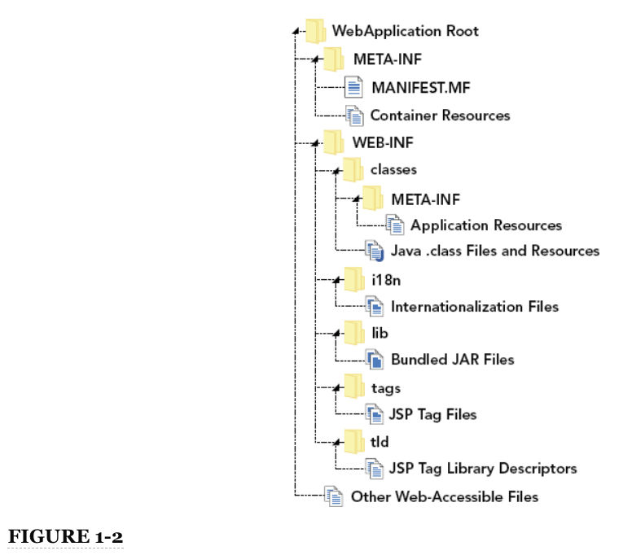
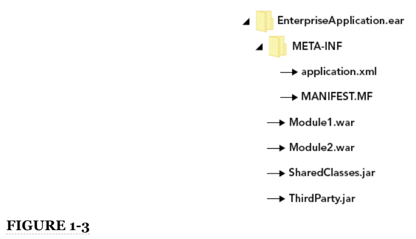

# Capítulo 1 Presentación de Java Platform, Enterprise Edition

**EN ESTE CAPÍTULO**

* Cronología de la versión de **Java SE** y **Java EE**
* Presentación de **Servlets**, **filters**, **listeners** y **JSPs**
* Comprensión de los archivos **WAR** y **EAR** y la jerarquía del cargador de clases

**DESCARGAS DE CÓDIGO PARA ESTE CAPÍTULO**

No hay descargas de código para este capítulo.

**NUEVAS DEPENDENCIAS DE MAVEN PARA ESTE CAPÍTULO**

No hay dependencias de Maven para este capítulo.

## CRONOLOGÍA DE LAS PLATAFORMAS DE JAVA

El lenguaje **Java** y sus plataformas han tenido una larga historia. Desde su ***invención a mediados de la década de 1990*** hasta una ***sequía evolutiva desde 2007 hasta casi 2012***, **Java** ha pasado por muchos cambios y ha encontrado su parte de controversia. En los primeros días, **Java**, conocido como **Java Development Kit** o **JDK**, era un lenguaje estrechamente acoplado a una plataforma compuesta por un pequeño conjunto de interfaces de programación de aplicaciones (**API**) esenciales. ***Sun Microsystems dio a conocer las primeras versiones alfa y beta en 1995***, y aunque **Java** era extremadamente lento y primitivo para los estándares actuales, inició una revolución en el desarrollo de software.

### AL PRINCIPIO

La historia de **Java** se resume en la ***Figura 1-1***, una línea de tiempo de **las plataformas Java**. En el momento de la publicación de este libro, el ***lenguaje Java*** y ***la plataforma Java SE*** siempre han evolucionado juntos: las nuevas versiones de cada uno siempre se lanzan al mismo tiempo y están estrechamente acopladas entre sí. La plataforma se llamó **JDK hasta la versión 1.1 en 1997**, pero en ***la versión 1.2 estaba claro que el JDK y la plataforma no eran sinónimos***. A partir de ***la versión 1.2 a finales de 1998***, la pila de tecnología **Java** se dividió en los siguientes componentes clave:


***FIGURA 1-1**: Línea de tiempo que muestra la correlación de la evolución de **Java Platform, Standard Edition** y **Java Platform, Enterprise Edition**. Los eventos en **la parte superior** de la línea de tiempo representan los hitos de **Java SE**, mientras que los eventos en **la parte inferior** representan los hitos de **Java EE***.

* ***Java*** es el lenguaje e incluye una sintaxis estricta y fuertemente tipada con la que ya debería estar muy familiarizado.

* **Java 2 Platform, Standard Edition**, también conocida como J2SE, se refería a la plataforma e incluía las clases en los paquetes **`java.lang`** y **`java.io`**, entre otros. Fue el componente básico sobre el que se construyeron las aplicaciones Java.

* Una ***Java Virtual Machine***, o ***JVM***, *es una máquina virtual de software que ejecuta **código Java compilado***. Debido a que *el código Java compilado es simplemente un código de bytes*, ***la JVM es responsable de compilar ese código de bytes en código de máquina antes de ejecutarlo***. (Esto a menudo se denomina compilador ***Just In Time o compilador JIT***). *La JVM también se encarga de la gestión de la memoria* para que el código de la aplicación no tenga que hacerlo.

* El ***Java Development Kit***, o ***JDK***, fue y sigue siendo la pieza de software que los desarrolladores de Java utilizan para crear aplicaciones Java. ***Contiene un compilador de lenguaje Java, un generador de documentación, herramientas para trabajar con código nativo y (normalmente) el código fuente de Java para la plataforma para habilitar la depuración de clases de plataforma***.

* ***Java Runtime Environment***, o ***JRE***, fue y sigue siendo el ***software*** que los usuarios finales descargan ***para ejecutar aplicaciones Java compiladas***. *Incluye una JVM pero no contiene ninguna de las herramientas de desarrollo incluidas en el JDK. Sin embargo, el JDK contiene un JRE*.

***Estos cinco componentes históricamente han sido especificaciones, no implementaciones***. Cualquier empresa puede crear su propia implementación de esta pila de tecnología Java, y muchas empresas lo han hecho. Aunque ***Sun ofreció una implementación estándar de Java, J2SE, JVM, JDK y JRE, IBM, Oracle y Apple también crearon implementaciones competidoras que ofrecían diferentes características***.

***La implementación de IBM nació por necesidad***: Sun no ofrecía binarios capaces de ejecutarse en sistemas operativos de IBM, por lo que IBM creó los suyos propios. ***La situación fue similar para el sistema operativo Apple Mac OS***, por lo que Apple también lanzó su propia implementación. ***Aunque las implementaciones ofrecidas por estas empresas eran todas gratuitas como en cerveza, no eran gratuitas como en libertad***, *por lo que no se consideraban software de código abierto. Como tal, la comunidad de código abierto formó rápidamente **el proyecto OpenJDK**, que proporcionó una implementación de código abierto del Java stack*.

Aún más empresas crearon implementaciones menos populares, algunas de las cuales compilaron su aplicación en código de máquina para una arquitectura de destino para mejorar el rendimiento al evitar la compilación JIT. ***Para la gran mayoría de usuarios y desarrolladores, la implementación de Sun Java fue suficiente y preferida***. *Después de la compra de Sun por parte de Oracle, las implementaciones de Sun y Oracle se volvieron una y la misma*.

En la ***Figura 1-1*** no se muestra el desarrollo de *otros lenguajes capaces de utilizar J2SE y ejecutarse en la JVM*. A lo largo de los años, ***aparecieron docenas de lenguajes que pueden compilarse en código de bytes Java*** (o código de máquina, en algunos casos) y ejecutarse en la JVM. Los más destacados son **Clojure** (*un dialecto **Lisp***), **Groovy**, **JRuby** (*una implementación de **Ruby** basada en Java*), **Jython** (*una implementación de **Python** basada en Java*), **Rhino** y **Scala**.

#### EL NACIMIENTO DE ENTERPRISE JAVA

Esta breve lección de historia puede parecer innecesaria; como desarrollador de Java existente, es probable que haya escuchado la mayor parte de esto antes. Sin embargo, es importante incluir el contexto de la historia de **Java Platform, Standard Edition**, porque está estrechamente entretejido con el nacimiento y la evolución de **Java Platform, Enterprise Edition**. Sun ya era consciente de la necesidad de ***herramientas más avanzadas para el desarrollo de aplicaciones, particularmente en el campo de la creciente Internet y la popularidad de las aplicaciones web***. En ***1998***, poco antes del lanzamiento de J2SE 1.2, Sun anunció que estaba trabajando en un producto llamado ***Java Professional Edition, o JPE***. El trabajo ya había comenzado en ***una tecnología conocida como Servlets, que son aplicaciones en miniatura capaces de responder a las solicitudes HTTP***. ***En 1997, Java Servlets 1.0 se lanzó junto con Java Web Server*** con poca fanfarria porque carecía de muchas características que la comunidad de Java quería.

Después de varias iteraciones internas de Servlets y JPE, ***Sun lanzó Java 2 Platform, Enterprise Edition (o J2EE) versión 1.2 el 12 de diciembre de 1999***. El número de versión correspondía con la versión actual de Java y J2SE en ese momento, y ***la especificación incluía***:

* **Servlets 2.2**
* **JDBC Extension API 2.0**
* **Java Naming and Directory Interface (JNDI) 1.0**
* **JavaServer Pages (JSP) 1.2**
* **Enterprise JavaBeans (EJB) 1.1**
* **Java Message Service (JMS) 1.0**
* **Java Transaction API (JTA) 1.0**
* **JavaMail API 1.1**
* **JavaBeans Activation Framework (JAF) 1.0.**

***Como J2SE, J2EE era una mera especificación***. ***Sun proporcionó una implementación de referencia de los componentes de la especificación***, pero las empresas también fueron libres de crear las suyas propias. Muchas implementaciones evolucionaron y aprenderá sobre algunas de ellas en el siguiente capítulo. Estas implementaciones incluyeron y aún incluyen soluciones comerciales y de código abierto. El ***J2EE se convirtió rápidamente en un complemento exitoso del J2SE y, a lo largo de los años, algunos componentes se consideraron tan indispensables que han migrado de J2EE a J2SE***.

#### JAVA SE Y JAVA EE EVOLUCIONANDO JUNTOS

***J2EE 1.3 lanzado en septiembre de 2001, un poco más de un año después de Java y J2SE 1.3 y antes de Java/J2SE 1.4***. La mayoría de sus componentes recibieron actualizaciones menores y se agregaron nuevas funciones. Lo siguiente se unió a la especificación J2EE y el conjunto de implementaciones se expandió y actualizó:

* **Java API for XML Processing (JAXP) 1.1**
* **JavaServer Pages Standard Tag Library (JSTL) 1.0**
* **J2EE Connector Architecture 1.0**
* **Java Authentication and Authorization Service (JAAS) 1.0**

En este punto, la tecnología estaba madurando considerablemente, pero aún tenía mucho margen de mejora.

***J2EE 1.4 representó un gran salto en la evolución de Java Platform, Enterprise Edition. Lanzado en noviembre de 2003*** (aproximadamente ***un año antes de Java/J2SE 5.0 y 2 años después de Java/J2SE 1.4***), incluía **Servlet 2.4** y **JSP 2.0**. Fue en esta versión que ***se eliminaron las especificaciones JDBC Extension API, JNDI y JAAS porque se consideraron esenciales para Java y se trasladaron a Java/J2SE 1.4.*** Esta versión también representó el punto en el que los componentes J2EE se dividieron en varias categorías de nivel superior:

* **Web Services Technologies:** incluye **JAXP 1.2** y los nuevos **Web Services for J2EE 1.1**, **Java API for XML-based RPC (JAX-RPC) 1.1** y **Java API for XML Registries (JAXR) 1.0**

* **Web Application Technologies:** Incluyó **Servlet**, **JSP** y **JSTL 1.1 components**, así como las nuevas **Java Server Faces (JSF) 1.1**

* **Enterprise Application Technologies:** Incluidas **EJB 2.1**, **Connector Architecture 1.5**, **JMS 1.1**, **JTA**, **JavaMail 1.3** y **JAF**.

* **Management and Security Technologies:** Incluye **Java Authorization Service Provider Contract for Containers (JACC) 1.0**, **Java Management Extensions (JMX) 1.2**, **Enterprise Edition Management API 1.0** y **Enterprise Edition Deployment API 1.1**

##### La Era de los Cambios de Nombre

Ingrese a la era de los cambios de nombre, que a menudo son una fuente de confusión para los desarrolladores de Java. Se destacan aquí para que comprenda completamente las convenciones de nomenclatura utilizadas en este libro y cómo se relacionan con las convenciones de nomenclatura anteriores con las que quizás ya esté familiarizado. ***Java y J2SE 5.0 se lanzaron en septiembre de 2004 e incluían genéricos, anotaciones y enumeraciones, tres de los cambios de sintaxis de lenguaje más radicales en la historia de Java***. *Este número de versión fue una desviación de los patrones anteriores, hecho más confuso por el hecho de que las API de J2SE y la herramienta de línea de comandos de Java informaron que el número de versión era 1.5. Sun había tomado la decisión de eliminar el 1 del número de versión publicado y, en su lugar, utilizar la versión secundaria. Rápidamente reconoció que el "dot-oh" al final del número de versión era una fuente de confusión y rápidamente comenzó a referirse a él simplemente como la versión 5*.

***Casi al mismo tiempo, se tomó la decisión de retirar el nombre Java 2 Platform, Standard Edition a favor de Java Platform, Standard Edition y abreviar este nuevo nombre Java SE. Los cambios se hicieron formales con Java SE 6, lanzado en diciembre de 2006, y hasta el día de hoy el nombre y la convención de la versión no han cambiado***. Java SE 6 es internamente 1.6, Java SE 7 es internamente 1.7 y Java SE 8 es internamente 1.8.

***Se aplicaron las mismas decisiones de cambio de nombre y número a J2EE, pero debido a que J2EE 1.5 se configuró para su lanzamiento entre J2SE 5.0 y Java SE 6, los cambios se aplicaron en una versión anterior***. *Java Platform, Enterprise Edition 5 o Java EE 5 se lanzó en mayo de 2006, aproximadamente 18 meses después de J2SE 5.0 y 7 meses antes de Java SE 6. Internamente, Java EE 5 es 1.5, Java EE 6 es 1.6 y Java EE 7 es 1.7. Siempre que vea los términos J2SE o Java SE, son intercambiables y el nombre preferido y aceptado hoy en día es Java EE. Asimismo, J2EE y Java EE son intercambiables, pero hoy en día se prefiere Java EE. El resto de este libro se refiere exclusivamente a ellos como **Java SE** y **Java EE***.

**Java EE 5** creció e incluyó numerosos cambios y mejoras nuevamente, y hoy sigue siendo una de las versiones de Java EE más ampliamente implementadas. ***Incluyó los siguientes cambios y adiciones***:

* ***JAXP y JMX se trasladaron a J2SE 5.0 y no se incluyeron en Java EE 5***.

* **Java API for XML-based Web Services (JAX-WS) 2.0**, **Java Architecture for XML Binding (JAXB) 2.0**, **Web Service Metadata for the Java Platform 2.0**, **SOAP with Attachments API for Java (SAAJ) 1.2**, y **Streaming API for XML (StAX) 1.0** se agregaron a la tecnología de Web Services.

* **Java Persistence API (JPA) 1.0** y **Common Annotations API 1.0** se agregaron a la ***Enterprise Applications Technology***.

##### Las sequías de Java SE y EE

El ***lanzamiento de Java SE 6 en diciembre de 2006*** marcó el comienzo de ***una sequía de versiones*** de Java SE que ***duró aproximadamente 5 años***. Esta vez fue un período de frustración e incluso enojo para muchos en la comunidad de Java. Sun continuó prometiendo nuevas funciones de lenguaje y API para Java SE 7, pero el calendario continuó deslizándose año tras año sin un final a la vista. Mientras tanto, ***otras tecnologías, como el lenguaje C # y la plataforma .NET, alcanzaron y superaron a Java en características de lenguaje y API de plataforma***, lo que provocó que algunos especularan si Java había llegado al final de su vida útil. Para empeorar las cosas, ***Java EE entró en su propio período de sequía y en 2009, habían pasado más de 3 años desde que se lanzó Java EE 5***. Sin embargo, no todo estaba perdido. ***El desarrollo de Java EE 6 se recuperó a principios de 2009 y se lanzó en diciembre de 2009, 3 años y 7 meses después de Java EE 5, y casi 3 años después de Java SE 6***.

En ese momento, ***Java Enterprise Edition se volvió enorme***:

* **SAAJ**, **StAX** y **JAF** se trasladaron a Java SE 6.

* Las especificaciones de la **Java API for RESTful Web Services (JAX-RS) 1.1** y **Java APIs for XML Messaging (JAXM) 1.3** se agregaron a las tecnologías de los Web Services.

* El **Java Unified Expression Language 2.0** (**JUEL** o simplemente **EL**) se agregó a las tecnologías de aplicaciones web.

* Las tecnologías de gestión y seguridad vieron la incorporación de **Java Authentication Service Provider Interface for Containers (JASPIC) 1.0.**.

* **Enterprise Application Technologies** logró el aumento más dramático en características, incluyendo **Contexts and Dependency Injection para Java (CDI) 1.0**, **Dependency Injection para Java 1.0**, **Bean Validation 1.0**, **Managed Beans 1.0** e **Interceptors 1.1**, además de actualizaciones para todos sus otros componentes.

**Java EE 6** también representó un importante punto de inflexión en la arquitectura de Java EE en dos frentes:

* ***Esta versión introdujo una configuración de aplicación programática y basada en anotaciones para complementar la configuración XML tradicional utilizada durante más de una década***.

* ***Esta versión marcó la introducción del Java EE Web Profile***.

Para tener en cuenta el hecho de que Java EE se había vuelto tan grande (y mantener y actualizar las implementaciones certificadas se estaba volviendo cada vez más difícil), el programa de certificación Web Profile ofreció la oportunidad de certificar las implementaciones de Java EE que incluían solo un subconjunto de toda la plataforma Java EE. Este subconjunto incluyó las características consideradas más críticas para un gran número de aplicaciones y excluyó especificaciones que son utilizadas solo por una pequeña minoría de aplicaciones. ***A partir de Java EE 6***:

* ***Ninguno de los Web Services o Management y Security forma parte del Java EE Web Profile***.

* ***El Web Profile incluye todo, desde Web Application Technologies y todo desde Enterprise Application Technologies, excepto Java EE Connector Architecture, JMS y JavaMail***.

**Fue durante la sequía de Java de 5 años que Oracle Corporation compró Sun Microsystems en enero de 2010***. Junto con la sequía de Java SE, esto trajo un conjunto completamente nuevo de preocupaciones para la comunidad de Java. Oracle nunca fue conocido por su agilidad o voluntad de cooperar con proyectos de código abierto, y mucha gente temía que Oracle hubiera comprado Sun para cerrar Java. Sin embargo, este resultó no ser el caso.

Al principio, ***Oracle comenzó a reorganizar el equipo de Java***, creando canales de comunicación con la comunidad de código abierto y lanzando hojas de ruta para futuras versiones de Java SE y Java EE que eran más realistas de lo que Sun había prometido. ***El trabajo comenzó de nuevo en Java SE 7, que se publicó según el programa (de Oracle) en junio de 2011, casi 5 años después de Java SE 6***. ***Una segunda sequía de Java EE terminó con el ***lanzamiento de Java EE 7 en junio de 2013, 3 años y 7 meses después de Java EE 6***. ***Oracle ahora dice que está en camino de comenzar a lanzar nuevas versiones de ambas plataformas cada 2 años, en años alternos***. Queda por ver si eso sucederá.

### ENTENDIENDO LAS CARACTERÍSTICAS MÁS RECIENTES DE LA PLATAFORMA

***Java SE 7 y 8 y Java EE 7 han introducido cambios importantes en el lenguaje y las API de soporte y han dado como resultado un rejuvenecimiento de las tecnologías Java***. Utiliza estas nuevas funciones a lo largo de este libro, por lo que esta sección proporciona una descripción general de ellas.

#### Java SE 7

*Originalmente, Java SE 7 tenía una lista de funciones muy ambiciosa, pero después de adquirir Sun, Oracle admitió rápidamente que lograr los objetivos de Java SE 7 llevaría muchos, muchos años. Cada característica era la característica más importante para algún grupo de usuarios, por lo que se tomó la decisión de posponer algunas de ellas a versiones futuras*. ***La alternativa era retrasar el lanzamiento de Java SE 7 hasta 2015 o más tarde, una opción que no era aceptable***.

Java SE 7 incluía soporte para lenguajes dinámicos, así como punteros comprimidos de 64 bits (para mejorar el rendimiento en JVM de 64 bits). También agregó varias características de lenguaje que hicieron que el desarrollo de aplicaciones Java fuera más productivo. ***Quizás uno de los cambios más útiles fueron los diamonds, un atajo para la creación de instancias genéricas***. *Antes de Java 7, tanto la declaración de variable como la asignación de variable para tipos genéricos tenían que incluir los argumentos de tipo genérico*. Por ejemplo, aquí hay una declaración y asignación para una variable **`java.util.Map`** muy compleja:

```java
Map<String, Map<String, Map<Integer, List<MyBean>>>> map = new Hashtable<String, Map<String, Map<Integer, List<MyBean>>>>();
```

Por supuesto, esta declaración contiene mucha información redundante. Asignar cualquier cosa que no sea **`Map<String, Map<String, Map<Integer, List<MyBean>>>>`** a esta variable sería ilegal, entonces, ¿por qué debería tener que especificar todos esos argumentos de tipo nuevamente? ***Usando diamonds de Java 7***, esta declaración y asignación se vuelve mucho más simple. El compilador infiere los argumentos de tipo para el **`java.util.Hashtable`** instanciado.

```java
Map<String, Map<String, Map<Integer, List<MyBean>>>> map = new Hashtable<>();
```

Otra queja común sobre Java anterior a Java 7 es la *gestión de recursos que se pueden cerrar en lo que respecta a los bloques* **`try-catch-finally`**. En particular, *considere este fragmento desagradable de código JDBC*:

```java
    Connection connection = null;
    PreparedStatement statement = null;
    ResultSet resultSet = null;
    try {
        connection = dataSource.getConnection();
        statement = connection.prepareStatement(...);
        // set up statement
        resultSet = statement.executeQuery();
        // do something with result set
    } catch(SQLException e) {
        // do something with exception
    } finally {
        if(resultSet != null) {
            try {
                resultSet.close();
            } catch(SQLException ignore) { }
        }
 
        if(statement != null) {
            try {
                statement.close();
            } catch(SQLException ignore) { }
        }
 
        if(connection != null && !connection.isClosed()) {
            try {
                connection.close();
            } catch(SQLException ignore) { }
        }
    }
```

**try-with-resources de Java 7*** ha simplificado drásticamente esta tarea. ***Cualquier clase que implemente `java.lang.AutoCloseable` es elegible para su uso en una construcción try-with-resources***. Las interfaces JDBC **`Connection`**, **`PreparedStatement`** y **`ResultSet`** amplían esta interfaz. Cuando usa ***try-with-resources*** como se muestra en el siguiente ejemplo, ***los recursos que declara dentro del paréntesis de la palabra clave `try` se cierran automáticamente en un bloque `finally` implícito***. Cualquier excepción lanzada durante esta limpieza se agrega a las excepciones suprimidas de una excepción existente o, si no existe ninguna excepción, se lanza después de que se hayan cerrado todos los recursos.

```java
    try(Connection connection = dataSource.getConnection();
        PreparedStatement statement = connection.prepareStatement(...)) {
        
        // set up statement
        try(ResultSet resultSet = statement.executeQuery()) {
            // do something with result set
        }
    } catch(SQLException e) {
        // do something with exception
    }
```

***Otra mejora realizada en try-catch-finally es la adición de multi-catch***. A partir de Java 7, ahora ***puede detectar varias excepciones dentro de un solo bloque `catch`, separando los tipos de excepción con un single pipe (`|`)***. Por ejemplo:

```java
    try {
        // do something
    } catch(MyException | YourException e) {
        // handle these exceptions the same way
    }
```

***Una advertencia a tener en cuenta es que no se pueden capturar dos o más excepciones de forma que una herede de otra***. Por ejemplo, lo siguiente está prohibido porque **`FileNotFoundException`** extiende de **`IOException`***:

```java
    try {
        // do something
    } catch(IOException | FileNotFoundException e) {
        // handle these exceptions the same way
    }
```

Por supuesto, esto puede considerarse fácilmente una cuestión de sentido común. ***En este caso, simplemente capturaría `IOException`, que capturaría ambos tipos de excepciones***.

Algunas otras características de lenguaje misceláneas en Java 7 incluyen ***literales binarios*** para bytes e integers (puede escribir el literal 1928 como 0b11110001000) y ***guiones bajos en literales numéricos*** (puede escribir los mismos literales como 1_928 y 0b111_1000_1000, si lo desea). Además, finalmente ***puede usar `Strings` como argumentos de un `switch`***.

#### Java EE 7

***Java EE 7, lanzado el 12 de junio de 2013***, contiene una serie de cambios y nuevas funciones. Cubrirá muchas de estas nuevas funciones a lo largo de este libro, por lo que no se detallan aquí. En resumen, ***los cambios en Java EE 7 son los siguientes***:

* ***JAXB se agregó a Java SE 7 y ya no se incluye en Java EE***.

* **Batch Applications** para **Java Platform 1.0 and Concurrency Utilities for Java EE 1.0** fueron añadidos para el **Enterprise Application Technologies**.

* **Web Application Technologies** eligió la **Java API for WebSockets 1.0** (sobre la cual aprenderá en el Capítulo 10) y la **Java API for JSON Processing 1.0.**

* El **Java Unified Expression Language** se ha ampliado significativamente para incluir expresiones lambda y un análogo de **Java SE 8 Collections Stream API**. (Aprenderá más sobre esto en el Capítulo 6.)

* El **Web Profile** se amplió ligeramente para incluir especificaciones que es más probable que sean necesarias en aplicaciones web comunes: **JAX-RS**, **Java API for WebSockets** y **Java API for JSON Processing**.

#### Java SE 8

Las nuevas funciones de Java SE 8 pueden resultar muy útiles a medida que trabaja con los ejemplos de este libro. Quizás lo más visible es la adición de ***expresiones lambda*** (conocidas extraoficialmente como ***closures***). ***Las expresiones lambda son funciones anónimas que se definen, y posiblemente se llaman, sin que se les asigne un nombre de tipo o estén vinculadas a un identificador***. Las expresiones Lambda son particularmente útiles para implementar de forma anónima las interfaces de un método que son tan comunes en las aplicaciones Java. Por ejemplo, un **`Thread`** que se creó previamente con un **`Runnable`** anónimo como este:

```java
    public String doSomethingInThread(String someArgument) {
        ...
        Thread thread = new Thread(new Runnable() {
            @Override
            public void run() {
                // do something
            }
        });
        ...
    }
```

ahora se puede simplificar con una expresión lambda:

```java
    public String doSomethingInThread(String someArgument) {
        ...
        Thread thread = new Thread(() -> {
            // do something
        });
        ...
    }
```

***Las expresiones lambda pueden tener argumentos, tipos de retorno y genéricos***. Y donde lo desee, puede usar una referencia de método en lugar de una expresión lambda para pasar una referencia a un método de coincidencia de interfaz. El siguiente código también es equivalente a las dos instancias anteriores de Thread. También puede asignar referencias de métodos y expresiones lambda a variables.


```java
    public String doSomethingInThread(String someArgument) {
        ...
        Thread thread = new Thread(this::doSomething);
        ...
    }
 
    public void doSomething() {
        // do something
    }
```

*Una de las mayores quejas entre los usuarios de Java desde sus inicios es la falta de una API de fecha y hora decente*. **`java.util.Date`** siempre ha estado plagado de problemas, y la adición de **`java.util.Calendar`** solo empeoró muchos problemas. Java SE 8 finalmente aborda eso con **JSR 310**, una nueva API de fecha y hora. Esta API se basa en gran medida en **Joda Time**, pero con mejoras en la arquitectura subyacente para solucionar problemas que señaló el inventor de **Joda Time**. Esta API es una adición revolucionaria a las **Java SE platform APIs** y finalmente trae una API de fecha y hora poderosa y bien diseñada para Java.

### UNA EVOLUCIÓN CONTINUA

Como puede ver, las plataformas Java SE y EE nacieron juntas y han evolucionado de la mano durante casi dos décadas. Es probable que sigan evolucionando juntos durante muchos años o décadas por venir. Debería estar bastante familiarizado con Java SE, pero es posible que no sepa absolutamente nada sobre el uso de Java EE. También es posible que esté familiarizado con versiones anteriores de Java EE, pero desee obtener más información sobre las nuevas funciones de Java EE.

La Parte I de este libro le enseña las características más importantes de Java EE, que incluyen:

* ***Servidores de aplicaciones y contenedores web*** (Capítulo 2)
* ***Servlets*** (Capítulo 3)
* ***JSPs*** (Capítulo 4, 6, 7, and 8)
* ***HTTP sessions*** (Capítulo 5)
* ***Filters*** (Capítulo 9)
* ***WebSockets*** (Capítulo 10).

## ENTENDIENDO LA ESTRUCTURA BÁSICA DE LA APLICACIÓN WEB

Se utilizan muchos componentes para crear una **Java EE web application**. Primero, tiene su código y las libraries de terceros de las que depende. Luego tiene el deployment descriptor, que incluye instrucciones para implementar e iniciar su aplicación. También tiene los **`ClassLoaders`** responsables de aislar su aplicación de otras aplicaciones web en el mismo servidor. Finalmente, debe empaquetar su aplicación de alguna manera, y para eso tiene los archivos **WAR** y **EAR**.

### SERVLETS, FILTERS, LISTENERS Y JSPs

***Los servlets*** son un componente clave de cualquier aplicación web Java EE. Los servlets, sobre los que aprenderá en el Capítulo 3, ***son clases de Java responsables de aceptar y responder a las solicitudes HTTP***. *Casi todas las solicitudes a su aplicación pasan por un Servlet de algún tipo, excepto aquellas solicitudes que son erróneas o interceptadas por algún otro componente*. ***Un filtro es uno de esos componentes que puede interceptar solicitudes a sus Servlets. Puede utilizar filtros para satisfacer una variedad de necesidades, desde formato de datos hasta compresión de respuestas, autenticación y autorización***. Explorará los diversos usos de los filtros en el Capítulo 9.

Como ocurre con muchos otros tipos diferentes de aplicaciones, ***las aplicaciones web tienen un ciclo de vida. Hay procesos de inicio y cierre, y suceden muchas cosas diferentes durante estas etapas***. Las **Java EE web applications** admiten varios tipos de ***listeners***, que conocerá en las Partes I y II. ***Estos listeners pueden notificar a su código de varios eventos, como el inicio de la aplicación, el cierre de la aplicación, la creación de sesiones HTTP y la destrucción de sesiones***.

Quizás ***una de las herramientas Java EE más poderosas a su disposición es la tecnología JavaServer Pages, o JSP***. ***Las JSP le proporcionan los medios para crear fácilmente interfaces de usuario gráficas dinámicas basadas en HTML*** para sus aplicaciones web sin tener que escribir manualmente **`String`**s de HTML en un **`OutputStream`** o **`PrintWriter`**. El tema de las JSP abarca muchas facetas diferentes, incluida la **JavaServer Pages Standard Tag Library**, el **Java Unified Expression Language**, las **custom tags** y la **internationalization** y **localization**. Dedicará mucho tiempo a estas funciones en el Capítulo 4 y los Capítulos 6 al 9.

Por supuesto, hay muchas más funciones en Java EE tal como **Servlets**, **filters**, **listeners** y **JSPs**. Cubrirá muchos de estos en este libro, pero no todos.

### ESTRUCTURA DEL DIRECTORIO Y ARCHIVOS WAR
AQUUIIIIIIIII
Las aplicaciones web estándar de Java EE se implementan como archivos WAR o directorios de aplicaciones web "exploded" (no archivados). Ya debería estar familiarizado con los archivos ***JAR*** o ***Java Archive***. Recuerde que un archivo JAR es simplemente un archivo con formato ZIP con una estructura de directorio estándar reconocida por las JVM. No hay nada de propiedad sobre el formato de archivo JAR, y cualquier aplicación de archivo ZIP puede crear y leer archivos JAR. Un archivo ***Web Application Archive***, o ***WAR***, es el archivo equivalente para aplicaciones web Java EE.

Todos los servidores de aplicaciones web Java EE admiten archivos de aplicaciones de archivos WAR. La mayoría también admite directorios de aplicaciones ampliados. Ya sea archivado o descompuesto, la convención de estructura de directorios, como se muestra en la Figura 1-2, es la misma. Como un archivo JAR, esta estructura contiene clases y otros recursos de la aplicación, pero esas clases no se almacenan en relación con la raíz de la aplicación como en un archivo JAR. En cambio, los archivos de clase viven en `/WEB-INF/classes`. El directorio `WEB-INF` almacena archivos informativos e instructivos que los servidores de aplicaciones web Java EE utilizan para determinar cómo implementar y ejecutar la aplicación. Su directorio de clases actúa como raíz del paquete. Todos los archivos de clases de aplicaciones compilados y otros recursos se encuentran dentro de este directorio.



A diferencia de los archivos JAR estándar, los archivos WAR pueden contener archivos JAR empaquetados, que se encuentran en `/WEB-INF/lib`. Todas las clases de los archivos JAR de este directorio también están disponibles para la aplicación en la ruta de clases de la aplicación. Los directorios `/WEB-INF/tags` y `/WEB-INF/tld` están reservados para contener archivos de etiquetas JSP y descriptores de bibliotecas de etiquetas, respectivamente. Explorará el tema de los archivos de etiquetas y las bibliotecas de etiquetas a fondo en el Capítulo 8. El directorio `i18n` no forma parte de las especificaciones de Java EE, pero es una convención que la mayoría de los desarrolladores de aplicaciones siguen para almacenar archivos de internacionalización(i18n) y localización(L10n ).

Probablemente también haya notado la presencia de dos directorios `META-INF` diferentes. Esto puede ser una fuente de confusión para algunos desarrolladores, pero si recuerda las reglas simples de classpath, puede diferenciarlas fácilmente. Al igual que los directorios `META-INF` del archivo JAR, el directorio de nivel raíz `/META-INF` contiene el archivo de manifiesto de la aplicación. También puede contener recursos para contenedores web o servidores de aplicaciones específicos. Por ejemplo, Apache Tomcat (sobre el que aprenderá en el Capítulo 2) busca y usa un archivo `context.xml` en este directorio para ayudar a personalizar cómo se implementa la aplicación en Tomcat. Ninguno de estos archivos forma parte de la especificación Java EE y los archivos admitidos pueden variar de un servidor de aplicaciones o contenedor web a otro.

A diferencia de los archivos JAR, el root-level `/META-INF` no está en la ruta de clases de la aplicación. No puede utilizar `ClassLoader` para obtener recursos en este directorio. `/WEB-INF/classes/META-INF`, sin embargo, está en la ruta de clases. Puede colocar los recursos de la aplicación que desee en este directorio y se podrá acceder a ellos a través de `ClassLoader`. Algunos componentes de Java EE especifican archivos que pertenecen a este directorio. Por ejemplo, la API de persistencia de Java (sobre la que aprenderá en la Parte III de este libro) especifica dos archivos, uno llamado `persistence.xml` y otro `orm.xml`, que se encuentran en `/WEB-INF/classes/META-INF`.

La mayoría de los archivos contenidos en un archivo WAR o un directorio de aplicación web ampliado son recursos a los que se puede acceder directamente a través de una URL. Por ejemplo, se puede acceder al archivo `/bar.html` relativo a la raíz(root) de una aplicación implementada en `http://example.org/foo` desde `http://example.org/foo/bar.html`. En ausencia de filtros o reglas de seguridad que indiquen lo contrario, esto es válido para todos los recursos de su aplicación, excepto los recursos de los directorios `/WEB-INF` y `/META-INF`. Los archivos de estos directorios son recursos protegidos a los que no se puede acceder mediante URL.

### EL DEPLOYMENT DESCRIPTOR

El deployment descriptor son los metadatos que describen la aplicación web y proporcionan instrucciones al servidor de aplicaciones web Java EE para implementar y ejecutar la aplicación web. Tradicionalmente, todos estos metadatos provenían del archivo deployment descriptor, `/WEB-INF/web.xml`. Este archivo contiene definiciones para Servlets, listeners y filters, y opciones de configuración para sesiones HTTP, JSP y la aplicación en general. Servlet 3.0 en Java EE 6 agregó la capacidad de configurar aplicaciones web mediante anotaciones y una API de configuración de Java. También agregó la noción de fragmentos web: los archivos JAR dentro de su aplicación pueden contener Servlets, filters y listeners configurados en los deployment descriptors en `/META-INF/web-fragment.xml` dentro de los archivos JAR necesarios. Los fragmentos web también pueden utilizar anotaciones y la API de configuración de Java.

Este cambio en la implementación de aplicaciones web en Java EE 6 agregó una complejidad significativa a la tarea de organizar este proceso. Para aliviar esta complejidad, puede configurar el orden de sus fragmentos web para que sean escaneados y activados en una secuencia específica. Esto sucede de dos formas:

* El archivo `web-fragment.xml` de cada fragmento web puede contener un elemento `<ordering>` que usa etiquetas `<before>` y `<after>` anidadas para controlar si el fragmento web se activa antes o después de otros fragmentos web. Estas etiquetas contienen elementos `<name>` anidados para especificar el nombre de otro fragmento relativo al que se debe ordenar el fragmento actual. `<before>` y `<after>` pueden contener alternativamente elementos `<others>` anidados para indicar que el fragmento debe activarse antes o después de cualquier otro fragmento que no tenga un nombre específico.

* Si no creó un fragmento web en particular y no tiene control sobre su contenido, aún puede controlar el orden de sus fragmentos web dentro del deployment descriptor de su aplicación. El elemento `<absolute-ordering>` en `/WEB-INF/web.xml`, junto con sus elementos `<name>` y `<others>` anidados, configura un orden absoluto para los fragmentos web empaquetados que anula las instrucciones de pedido que vienen con los fragmentos web.

De forma predeterminada, Servlet 3.0 y los entornos más nuevos escanean aplicaciones web y fragmentos web en busca de anotaciones de aplicaciones web Java EE para configurar Servlets, listeners, filters y más. Puede deshabilitar este escaneo y deshabilitar la configuración de anotaciones agregando el atributo `metadata-complete="true"` a la root `<web-app>` o `<web-fragment>` elementos según sea necesario. También puede deshabilitar todos los fragmentos web en su aplicación agregando `<absolute-ordering />` (sin ningún elemento anidado) a su descriptor de implementación.

Aprenderá más sobre el deployment descriptor de la aplicación web y la configuración de anotaciones en la Parte I del libro. En la Parte II, explorará el container initializer y programmatic configuration con la API de Java, y verá cómo puede hacer que el arranque de Spring Framework sea más fácil y comprobable.

### ARQUITECTURA CLASS LOADER

Cuando se trabaja con aplicaciones web Java EE, es fundamental comprender la arquitectura `ClassLoader` porque difiere de la arquitectura a la que está acostumbrado en las aplicaciones Java SE estándar. En una aplicación típica, las clases `java.*` Que vienen con la plataforma Java SE se cargan en un root `ClassLoader` especial que no se puede anular. Ésta es una medida de seguridad que evita que el código malintencionado, por ejemplo, reemplace la clase `String` o redefina `Boolean.TRUE` y `Boolean.FALSE`.

Después de este `ClassLoader` viene la extensión `ClassLoader`, que carga las clases de las extensiones JAR en el directorio de instalación de JRE. Finalmente, la aplicación `ClassLoader` carga todas las demás clases en la aplicación. Esto forma una jerarquía de `ClassLoaders`, con la raíz como el antepasado más antiguo de todos los `ClassLoaders`. Cuando se le pide a un `ClassLoader` de nivel inferior que cargue una clase, siempre delega primero en su `ClassLoader` padre. Esto continúa hasta que se comprueba el `ClassLoader` raíz. Con la excepción del root `ClassLoader`, un `ClassLoader` carga una clase de su colección de JAR y directorios ***solo*** si su `ClassLoader` padre primero no encuentra la clase.

Este método de carga de clases se denomina ***parent-first class loader delegation model***, y aunque funciona muy bien para muchos tipos de aplicaciones, no es ideal para la mayoría de las aplicaciones web Java EE. Un servidor que ejecuta aplicaciones web Java EE suele ser extraordinariamente complejo y varios proveedores podrían proporcionar su implementación. El servidor podría usar algunas de las mismas bibliotecas de terceros que usa su aplicación, pero pueden ser de versiones conflictivas. Además, diferentes aplicaciones web también podrían proporcionar versiones conflictivas de las mismas bibliotecas de terceros, lo que generaría aún más problemas. Para resolver estos problemas, necesita un ***parent-last class loader delegation model***.

En los servidores de aplicaciones web Java EE, a cada aplicación web se le asigna su propio `ClassLoader` aislado que hereda del `ClassLoader` del servidor común. Al aislar las aplicaciones entre sí, no pueden acceder a las clases de los demás. Esto no solo elimina el riesgo de clases conflictivas, sino que también sirve como una medida de seguridad que evita que las aplicaciones web interfieran o dañen otras aplicaciones web. Además, una aplicación web `ClassLoader` (normalmente) le pide a su padre que cargue una clase solo si no puede cargar la clase primero. De esta manera, la carga de clases se delega al padre en último lugar en lugar de al padre primero, y se prefieren las bibliotecas y clases de aplicaciones web sobre las que proporciona el servidor. Para mantener el estado protegido de las clases Java SE empaquetadas, los `ClassLoaders` de la aplicación web aún verifican el root ClassLoader antes de intentar cargar cualquier clase. Aunque este modelo de delegación es más preferible para aplicaciones web en casi todos los casos, todavía existen raras circunstancias en las que no es apropiado. Por esta razón, los servidores compatibles con Java EE ofrecen la capacidad de cambiar el modelo de delegación de padre último a padre primero.

### ENTERPRISE ARCHIVES

Ha aprendido sobre los archivos WAR, pero hay otro tipo de archivo Java EE que debe conocer: los archivos EAR. Un archivo empresarial es una colección de archivos JAR, WAR y archivos de configuración comprimidos en un solo archivo desplegable (en formato ZIP, como JAR y WAR).

La Figura 1-3 muestra un archivo EAR de muestra. Al igual que con un archivo WAR, el directorio root `/META-INF` contiene el archivo de  manifiesto y no está disponible para la ruta de clases de la aplicación. El archivo `/META-INF/application.xml` es un deployment descriptor especial que describe cómo implementar los diversos componentes incluidos en el archivo EAR. En el nivel raíz de un archivo EAR están todos los módulos de la aplicación web incluidos en él: un archivo WAR para cada módulo. No hay nada especial en estos archivos WAR; pueden tener los mismos contenidos y características que un archivo WAR normal e independiente. El archivo EAR también puede contener bibliotecas JAR, que pueden servir para muchos propósitos. Los archivos JAR pueden contener Enterprise JavaBeans declarados en el descriptor de implementación `/META-INF/application.xml`, o pueden ser bibliotecas simples de terceros que comparten dos o más módulos WAR dentro del archivo empresarial.



Como habrá imaginado, los archivos empresariales también vienen con su propia arquitectura `ClassLoader`. Normalmente, se inserta un `ClassLoader` adicional en la jerarquía entre el `ClassLoader` del servidor y los `ClassLoaders` de la aplicación web asignados a cada módulo. Este `ClassLoader` aísla la aplicación empresarial de otras aplicaciones empresariales, pero permite que varios módulos en un solo EAR compartan bibliotecas comunes contenidas en el EAR. Este nuevo `ClassLoader` puede usar los modelos de delegación parent-last (predeterminado) o parent-first. La aplicación web `ClassLoaders` puede entonces delegar a los padres primero (permitiendo que las clases de la biblioteca EAR tengan prioridad) o al padre último (permitiendo que las clases WAR tengan prioridad).

Si bien es útil comprender los archivos empresariales, son una característica de la especificación Java EE completa y la mayoría de los servidores de contenedores web (como Apache Tomcat) no los admiten. Como tales, no se tratan más a fondo en este libro.

**ADVERTENCIA** *Los ejemplos de `ClassLoader` descritos en esta sección son solo eso: ejemplos. Aunque las especificaciones de Java EE describen la carga de clases parent-first y parent-last, diferentes implementaciones logran estos modelos de diferentes maneras, y cada servidor podría tener ciertos matices que podrían causar problemas según sus necesidades. Siempre debe leer la documentación del servidor que elija para poder determinar si la arquitectura `ClassLoader` de ese servidor en particular es adecuada para usted*.

### RESUMEN

En este capítulo, exploró las historias de Java Platform, Standard Edition y Java Platform, Enterprise Edition y aprendió cómo las dos plataformas evolucionaron juntas durante los últimos 19 años. Se le presentó brevemente algunos de los temas tratados en este libro (Servlets, filters, listeners, JSPs y más) y vio cómo se estructuran las aplicaciones Java EE, tanto internamente como en el sistema de archivos. Luego aprendió sobre los archivos de aplicaciones web y los archivos empresariales y cómo sirven como recipientes para transportar e implementar aplicaciones Java EE.

El resto del libro explora estos temas con mucho más detalle, respondiendo a las muchas preguntas que probablemente tenga después de leer las últimas páginas. En el Capítulo 2, analiza más de cerca los servidores de aplicaciones y los contenedores web, qué son y cómo elegir uno para sus propósitos. También aprenderá a instalar y utilizar Tomcat para los ejemplos de este libro.
