# Capítulo 2: Uso de Web Containers

* Elección de un Web Containers
* Instalación de Tomcat en su máquina
* Deploying y Undeploying Aplicaciones en Tomcat
* Debugging Tomcat desde su IDE
* Resumen 

#### EN ESTE CAPÍTULO

* ***Elegir un contenedor web***
* ***Instalación de Tomcat en su máquina***
* ***Implementar y anular la implementación de aplicaciones en Tomcat***
* ***Depurando Tomcat desde IntelliJ IDEA***
* ***Depurando Tomcat desde Eclipse***

#### DESCARGAS PARA ESTE CAPÍTULO

El código de este capítulo se divide en los siguientes ejemplos principales:

* Sample-deployment WAR Application File
* Sample-Debug-IntelliJ Project
* Sample-Debug-Eclipse Project

#### DEPENDENCIAS DE NEW MAVEN PARA ESTE CAPÍTULO

No hay dependencias de Maven para este capítulo.

## ELEGIR UN WEB CONTAINER

En el capítulo anterior, se le presentó **Java Platform, Enterprise Edition** y los conceptos de **Servlets**, **filters** y otros componentes Java EE. También aprendió sobre algunas de las nuevas características de Java 7 y 8. ***Las aplicaciones web Java EE se ejecutan dentro de los servidores de aplicaciones y contenedores web Java EE*** (también conocidos como ***contenedores Servlet***, y este libro usa los términos indistintamente).

Aunque la especificación Java EE está llena de muchas subespecificaciones más pequeñas, ***la mayoría de los contenedores web implementan solo las especificaciones de Servlet, JSP y JSTL***. *Esto es diferente de los **servidores de aplicaciones Java EE** en toda regla, que implementan toda la especificación Java EE*. ***Cada servidor de aplicaciones contiene un contenedor web***, que es responsable de administrar el ciclo de vida de los Servlets, asignar las URL de solicitud al código de Servlet, aceptar y responder a las solicitudes **HTTP** y administrar la cadena de filtros, cuando corresponda. Sin embargo, *los contenedores web independientes suelen ser más livianos y más fáciles de usar cuando no necesita todo el conjunto de funciones de Java EE*.

Elegir un **contenedor web** (o un **servidor de aplicaciones**, para el caso) es una tarea que requiere una cuidadosa investigación y consideración de los requisitos de su proyecto. Tiene muchas opciones para elegir un contenedor web, y cada una tiene sus ventajas y desafíos. *Puede utilizar una variedad de contenedores web*. Por ejemplo, puede decidir usar **Apache Tomcat** para pruebas locales en las máquinas de sus desarrolladores mientras usa **GlassFish** para su entorno de producción. O puede escribir una aplicación que sus clientes implementen en sus propios servidores, en cuyo caso probablemente desee probar en muchos servidores de aplicaciones y contenedores web diferentes.

En esta sección, aprenderá sobre algunos contenedores web y servidores de aplicaciones comunes, y en las secciones restantes, verá más de cerca el que usa para el resto de este libro.

### APACHE TOMCAT

***Apache Tomcat es el contenedor web más común y popular disponible en la actualidad***. *Los ingenieros de software de Sun Microsystems crearon originalmente este contenedor web como **Sun Java Web Server**, y era la implementación de referencia original de la especificación Java EE Servlet*. Más tarde, ***Sun lo donó a la Apache Software Foundation en 1999***, y en ese momento se convirtió en **Jakarta Tomcat** y, finalmente, en **Apache Tomcat**. También es interesante notar que la evolución de Apache de Tomcat llevó al desarrollo de ***la herramienta de compilación Apache Ant***, que miles de proyectos comerciales y de código abierto utilizan en la actualidad.
AQUIIIIIIIIII
***Las principales ventajas de Tomcat son su tamaño reducido, su configuración simple y su larga trayectoria de participación comunitaria***. Por lo general, los desarrolladores pueden estar listos y en ejecución con una instalación funcional de Tomcat en 5 a 10 minutos, incluido el tiempo de descarga. Tomcat requiere muy poca configuración lista para funcionar para funcionar bien en una máquina de desarrollo, pero también se puede ajustar significativamente para que funcione bien en entornos de producción de alta carga y alta disponibilidad. Puede crear grandes clústeres de Tomcat para manejar grandes volúmenes de tráfico de manera confiable. Tomcat se utiliza a menudo en entornos de producción comercial debido a su simplicidad y perfil ligero. Sin embargo, Tomcat carece de la sofisticada interfaz de administración web que ofrecen muchos de sus competidores para configurar el servidor. En cambio, Tomcat proporciona solo una interfaz simple para tareas básicas, como implementar y cancelar la implementación de aplicaciones. Para una mayor configuración, los administradores deben manipular una colección de archivos de propiedades XML y Java. Además, debido a que no es un servidor de aplicaciones completo, carece de muchos componentes Java EE, como la Java Persistence API, el Bean Validation API, y el Java Message Service.

Como puede imaginar, esto hace que Tomcat sea ideal para muchas tareas, pero hace que la implementación de aplicaciones empresariales más complejas sea un desafío y, a veces, imposible. Si le gusta Tomcat pero necesita un servidor de aplicaciones Java EE completo, puede recurrir a **Apache TomEE**, que se basa en Tomcat pero ofrece una implementación completa de todos los componentes de Java EE. Al estar construido sobre Tomcat, tiene toda la fuerza de la comunidad Tomcat y más de una década de pruebas detrás de ella. Apache también ofrece **Geronimo**, otro servidor de aplicaciones Java EE completo de código abierto.

**NOTA** ***TomEE** y **Geronimo** son servidores de aplicaciones Java EE certificados por Oracle, lo que significa que se ha verificado que cumplen con todos los aspectos de la especificación Java EE. Como Tomcat es solo un contenedor web, no tiene dicha certificación. Sin embargo, su enorme base de usuarios y su comunidad activa garantizan que implemente con precisión los componentes Java EE que proporciona*.

Tomcat proporciona implementaciones de las especificaciones de Servlet, Java Server Pages (JSP), Java Unified Expression Language (EL) y WebSocket. La Tabla 2-1 enumera varias versiones de Tomcat y las especificaciones que implementan. Solo se admiten Tomcat 6, 7 y 8. Las versiones 3.3, 4.1 y 5.5 llegaron al final de su vida útil hace años. Puede leer más sobre Apache Tomcat en el [sitio web de Tomcat](http://tomcat.apache.org/).

TABLA 2-1: Versiones de Tomcat y sus especificaciones

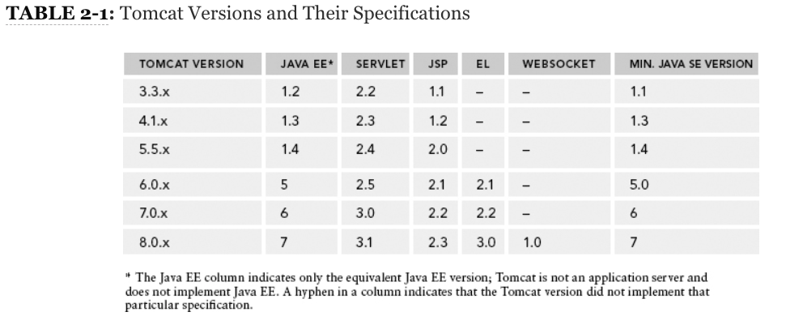

### GLASSFISH

GlassFish Server es una implementación de servidor de aplicaciones Java EE completo comercial y de código abierto. Proporciona todas las funciones de la especificación Java EE, incluido un contenedor web, y actualmente es la implementación de referencia para la especificación Java EE. Su contenedor web es en realidad un derivado de Apache Tomcat; sin embargo, ha evolucionado considerablemente desde que se bifurcó el núcleo de Tomcat para crear GlassFish, y el código apenas se reconoce hoy. La edición de código abierto de GlassFish ofrece soporte a la comunidad, mientras que Oracle GlassFish Server comercial brinda soporte comercial pagado a través de Oracle Corporation. Oracle solo ofrece soporte comercial a través de Java EE 7. A partir de Java EE 8, GlassFish no incluirá una opción de soporte comercial.

Uno de los puntos fuertes de GlassFish es su interfaz de administración, que proporciona una interfaz de usuario web gráfica, una interfaz de línea de comandos y archivos de configuración para configurar cualquier cosa dentro del servidor. Los administradores del servidor pueden incluso usar la interfaz de administración para implementar nuevas instancias de GlassFish dentro de un clúster de GlassFish. Como implementación de referencia, también es siempre el primer servidor en implementar una nueva versión cada vez que se actualiza la especificación. **La primera versión de GlassFish se lanzó en mayo de 2006** e implementó la especificación Java EE 5. En septiembre de 2007, la versión 2.0 agregó soporte para capacidades completas de agrupamiento. La versión 3.0, la implementación de referencia para Java EE 6, lanzada en diciembre de 2009, incluía varias mejoras empresariales. Esta versión representó un punto de inflexión en la popularidad de GlassFish y se volvió extremadamente sencillo administrar un entorno de GlassFish agrupado empresarial. En julio de 2011, la versión 3.1.1 mejoró varias características empresariales y agregó soporte para Java SE 7, aunque Java SE 6 seguía siendo la versión mínima requerida. GlassFish 4.0 lanzado en junio de 2013 como la implementación de referencia de Java EE 7 y requiere un mínimo de Java SE 7.

Puede leer más sobre GlassFish y descargarlo si lo desea en el sitio web de GlassFish.

### JBOSS Y WILDFLY

Red Hat’s JavaBeans Open Source Software Application Server (JBoss AS) fue el segundo servidor Java EE más popular, después de Tomcat, a principios de 2013. Históricamente, JBoss AS ha sido un contenedor web con soporte Enterprise JavaBeans y algunas otras características de Java EE. . Finalmente, obtuvo la certificación Web Profile y, en 2012, se certificó como un servidor de aplicaciones Java EE completo. Con el tiempo, el nombre JBoss también se convirtió en sinónimo de una comunidad de desarrollo (como Apache) que proporcionaba varios productos, así como la plataforma comercial de aplicaciones empresariales JBoss. El servidor de aplicaciones retuvo el nombre JBoss AS hasta la versión 7.1.x, pero en 2012, la comunidad decidió que el nombre era la fuente de demasiada confusión debido a otros proyectos de JBoss. **El servidor de aplicaciones pasó a llamarse WildFly a partir de la versión 8.0, lanzada a principios de 2014**.

Similar a GlassFish, WildFly es de código abierto con soporte gratuito proporcionado por la Comunidad JBoss y soporte comercial pagado proporcionado por Red Hat. Tiene un conjunto completo de herramientas de administración y proporciona capacidades de alta disponibilidad y agrupación en clústeres como Tomcat y GlassFish. Las versiones 4.0.xa 4.2.x de JBoss AS se crearon sobre Tomcat 5.5 y admitían funciones de Java EE 1.4. La versión 5.0 introdujo compatibilidad con Java EE 5 y un nuevo contenedor web, y la 5.1 contenía implementaciones tempranas de algunas características de Java EE 6 (aunque todavía era un servidor de aplicaciones Java EE 5). JBoss AS 6.0 implementó Java EE 6 Web Profile, pero no buscó ni obtuvo una certificación de servidor de aplicaciones Java EE 6. JBoss AS 7.0 representó una reescritura completa del producto para disminuir drásticamente su huella y aumentar su rendimiento, y también admitió solo el perfil web Java EE 6. No fue hasta JBoss AS 7.1 que nuevamente se convirtió en un servidor de aplicaciones completo, logrando la certificación Java EE 6 más de 2 años después del lanzamiento de Java EE 6. **WildFly 8.0 es un servidor de aplicaciones Java EE 7 completo y requiere un mínimo de Java SE 7**. (En realidad, todos los servidores de aplicaciones Java EE 7 y contenedores web requieren un mínimo de Java SE 7.)

Puede obtener más información y descargar JBoss AS 7.1 y versiones anteriores en el [sitio web de JBoss](https://jbossas.jboss.org/), mientras que puede encontrar WildFly 8.0 en el [sitio web de WildFly](https://www.wildfly.org/).

### OTROS CONTENEDORES Y SERVIDORES DE APLICACIONES

***Hay muchos otros contenedores web, como Jetty y Tiny, y servidores de aplicaciones Java EE completos de código abierto, como JOnAS, Resin, Caucho y Enhydra. También ***hay varios servidores comerciales de aplicaciones completas, de los cuales Oracle WebLogic e IBM WebSphere son los más populares***. La Tabla 2-2 muestra algunos de estos servidores y las versiones que admitían varias especificaciones de Java EE.

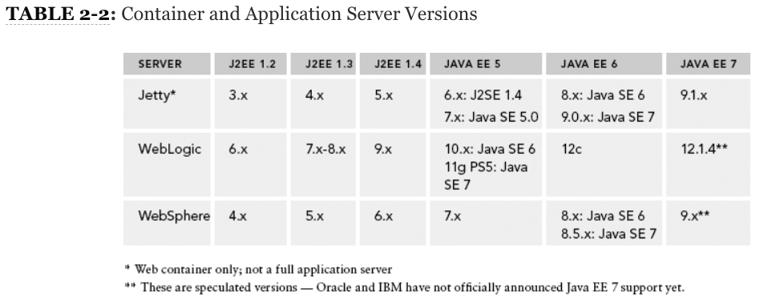

Cada contenedor web o servidor de aplicaciones tiene sus propias ventajas y desventajas. La tarea de elegir un servidor de aplicaciones no se puede cubrir en un solo capítulo y está fuera del alcance de este libro. Se deben comprender las necesidades del proyecto de su organización y se debe elegir el contenedor web o el servidor de aplicaciones adecuado que satisfaga esas necesidades. Se deben considerar los presupuestos operativos porque los servidores de aplicaciones comerciales tienden a tener un costo de licencia extremadamente alto. Todos estos factores afectarán su decisión, y puede elegir un servidor que ni siquiera figura en este libro.

### POR QUÉ USARÁ TOMCAT EN ESTE LIBRO

Muchas de las ventajas de Apache Tomcat (que se denomina simplemente Tomcat en el resto de este libro) ya se han descrito. Quizás lo más importante de este libro es la facilidad con la que los desarrolladores pueden empezar a utilizar Tomcat. Con mucho, Tomcat es más fácil de ejecutar rápidamente que cualquier otro contenedor web y proporciona todas las funciones que necesita para completar los ejemplos de este libro. Además, todos los principales IDE de Java proporcionan herramientas para ejecutar, implementar y depurar Tomcat, lo que le facilita el desarrollo de su aplicación.

Aunque algunos desarrolladores prefieren utilizar otros contenedores web, y con el conocimiento adecuado, casi cualquier contenedor web puede servirte bien en una máquina de desarrollo, es difícil defender el uso de Tomcat. Al usar Tomcat para este libro, puede concentrarse en el código y las prácticas de desarrollo, prestando poca o ninguna atención a la administración de su contenedor. El resto de este capítulo le ayuda a instalar y configurar Tomcat en su máquina. También le presenta la implementación y anulación de la implementación de aplicaciones con el administrador de Tomcat y la depuración de Tomcat en su IDE de Java.

## INSTALACIÓN DE TOMCAT EN SU MÁQUINA

Antes de poder instalar Tomcat en su máquina, debe descargarlo del sitio del proyecto Tomcat. Vaya a la [página de descargas de Tomcat 8.0](http://tomcat.apache.org/download-80.cgi) y desplácese hacia abajo hasta la sección "Binary Distributions". Hay muchas descargas en esta página, y las únicas que necesita para este libro se encuentran bajo el título "Core". Como usuario de Windows, las dos descargas que le preocupan son el "32-bit/64-bit Windows Service Installer" (funciona para cualquier arquitectura de sistema) y el "32-bit Windows zip" o el "64-bit Windows zip". (dependiendo de la arquitectura de su máquina). Si ejecuta Linux, Mac OS X o algún otro sistema operativo, necesita el archivo zip que no sea de Windows, que simplemente se llama "zip".

### INSTALACIÓN COMO SERVICIO DE WINDOWS

Muchos desarrolladores quieren instalar Tomcat como un servicio de Windows. Esto tiene varias ventajas, especialmente en un entorno de producción o garantía de calidad. Facilita la administración de la memoria JVM y otros recursos, y simplifica enormemente el inicio automático de Tomcat cuando se inicia Windows. Sin embargo, en un entorno de desarrollo, la instalación de Tomcat como servicio puede tener algunos inconvenientes. Esta técnica instala solo el servicio y no instala los scripts de línea de comandos que ejecutan Tomcat desde la línea de comandos. La mayoría de los IDE utilizan estos scripts de línea de comandos para ejecutar y depurar Tomcat desde el IDE. Puede instalar Tomcat como un servicio descargando el "32-bit/64-bit Windows Service Installer", pero también necesita descargar el "Windows zip" para ejecutar Tomcat desde su IDE.

Este libro no cubre la instalación de Tomcat como un servicio de Windows porque normalmente lo haría solo para entornos de producción o de control de calidad. La documentación en el sitio web de Tomcat es muy útil si desea explorar esto más a fondo. Por supuesto, si no está utilizando Windows, el instalador de Windows no le será de utilidad. Hay formas de iniciar Tomcat automáticamente en otros sistemas operativos, pero también están fuera del alcance de este libro.

#### INSTALACIÓN COMO APLICACIÓN DE LÍNEA DE COMANDOS

La mayoría de los desarrolladores de aplicaciones necesitan ejecutar Tomcat solo como una aplicación de línea de comandos y, por lo general, solo desde su IDE. Para hacer esto, siga estos pasos:

1. Descargue el zip de Windows apropiado para la arquitectura (si usa Windows) o el zip que no es de Windows (si usa cualquier otro) desde la página de descarga de Tomcat 8.0 y descomprima el directorio.

2. Coloque el contenido del directorio Tomcat en este archivo zip en la carpeta `C:\Program Files\Apache Software Foundation\Tomcat 8.0` en su máquina local (o en el directorio apropiado para un servidor en su sistema operativo). Por ejemplo, el directorio de aplicaciones web ahora debería estar ubicado en `C:\Program Files\Apache Software Foundation\Tomcat 8.0\webapps`.

3. Si usa Windows 7 o una versión posterior, debe cambiar algunos permisos para que Tomcat sea accesible desde su IDE. Haga clic con el botón derecho en el directorio `Apache Software Foundation` en `C:\Program Files` y haga clic en Properties. En la pestaña Seguridad, haga clic en el botón Editar. Agregue su usuario o el grupo Usuarios y déle a esa entrada control total sobre el directorio.

4. Para configurar Tomcat para su primer uso, comience abriendo el archivo `conf/tomcat-users.xml` en su editor de texto favorito. Coloque la siguiente etiqueta entre las etiquetas XML `<tomcat-users></tomcat-users>`:

```html
  <user username="admin" password="admin" roles="manager-gui,admin-gui" />
```

**ADVERTENCIA** *Esto configura un usuario administrador que puede utilizar para iniciar sesión en la interfaz de administración web de Tomcat. Por supuesto, esta combinación de nombre de usuario y contraseña es muy insegura y nunca debe usarse para servidores de producción o de cara al público. Sin embargo, para probar en su máquina local es suficiente*.

5. Abra el archivo `conf/web.xml`. Busque en el archivo el texto `org.apache.jasper.servlet.JspServlet`. Debajo de la etiqueta que contiene este texto hay dos etiquetas `<init-param>`. Aprenderá sobre los parámetros de inicio de Servlet en el siguiente capítulo, pero por ahora agregue los siguientes parámetros de inicio debajo de los parámetros de inicio existentes:

```html
  <init-param>            
    <param-name>compilerSourceVM</param-name>            
    <param-value>1.8</param-value>        
  </init-param>        
  <init-param>            
    <param-name>compilerTargetVM</param-name>            
    <param-value>1.8</param-value>        
  </init-param>
```

De forma predeterminada, Tomcat 8.0 compila archivos JavaServer Pages con compatibilidad con el lenguaje Java SE 6 incluso si se ejecuta en Java SE 8. Estos nuevos parámetros de inicio de Servlet indican a Tomcat que compile archivos JSP con características del lenguaje Java SE 8, en su lugar.

6. Después de realizar estos cambios y guardar estos archivos, ahora debería estar listo para iniciar Tomcat y asegurarse de que se ejecute correctamente. Abra un símbolo del sistema y cambie su directorio al directorio de inicio de Tomcat (`C:\Program Files\Apache Software Foundation\Tomcat 8.0`).

7. Escriba el comando `echo %JAVA_HOME%` (o `echo $JAVA_HOME` en un sistema operativo que no sea Windows) y presione Entrar para verificar si la variable de entorno `JAVA_HOME` está configurada correctamente en su directorio de inicio de Java Development Kit (JDK). Si no es así, configure la variable de entorno y luego cierre la sesión y vuelva a iniciarla antes de continuar (consulte la Nota que sigue). Tomcat no se puede ejecutar sin esta variable configurada correctamente.

8. Escriba el comando `bin\startup.bat` (o `bin/startup.sh` si no usa Windows) y presione Entrar. Debería abrirse una ventana de la consola Java mostrando la salida del proceso Tomcat en ejecución. Después de unos segundos, debería ver el mensaje “INFO [main] org.apache.catalina.startup.Catalina.start Server startup in 1827 ms” o algo similar en la ventana de la consola. Esto significa que Tomcat se ha iniciado correctamente.

**NOTA** *Al iniciar, Tomcat busca inicialmente la variable de entorno `JRE_HOME` y la usa si está configurada. Si no es así, busca la variable `JAVA_HOME`. Si no se establece ninguno, Tomcat no se inicia. Sin embargo, para depurar Tomcat debe tener configurado `JAVA_HOME`, por lo que es mejor simplemente seguir adelante y configurarlo*.

9. Abra su navegador web favorito y navegue hasta http://localhost:8080/. Debería ver una página que se parece a la Figura 2-1. Esto significa que Tomcat se está ejecutando y las JSP se están compilando correctamente con Java SE 8. Si esta pantalla no aparece o si observa un error en la consola de Java, debe verificar los pasos anteriores y posiblemente consultar la documentación de Tomcat.

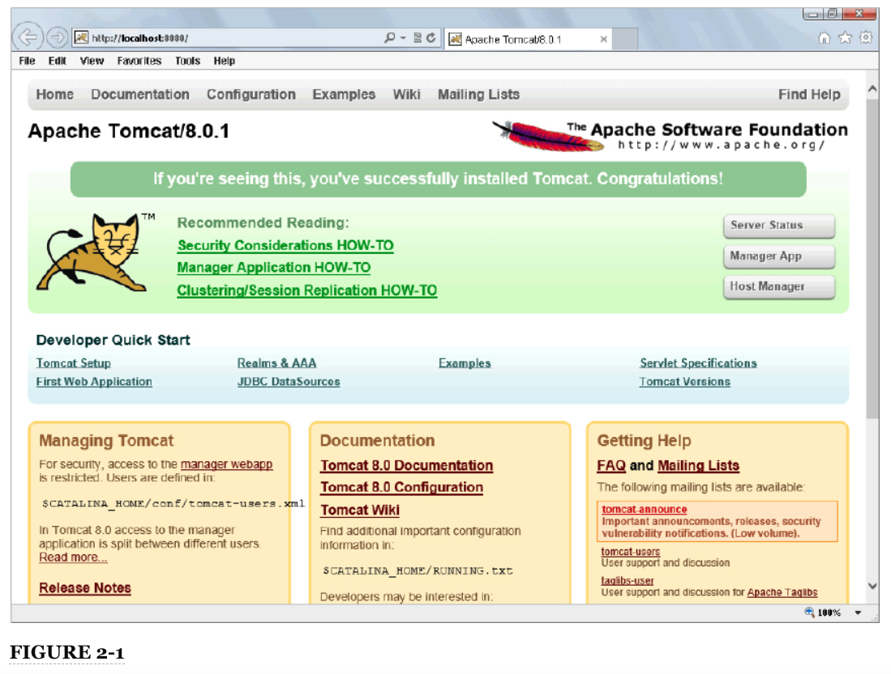

Cuando termine de usar Tomcat, puede detenerlo ejecutando el comando `bin\shutdown.bat` (o `bin/shutdown.sh`) en el símbolo del sistema en el directorio de inicio de Tomcat 8.0. La ventana de la consola de Java debería cerrarse y Tomcat se detendrá. Sin embargo, no hagas esto todavía; En la siguiente sección, explorará la implementación y la cancelación de la implementación de aplicaciones en Tomcat. (Si ya cerró Tomcat, no se preocupe. Es fácil volver a iniciarlo).

**ADVERTENCIA** *Las primeras versiones de Tomcat 8.0 no admiten la compilación de JSP para Java 8. Sabrá que este es el caso de su versión si ve "WARNING: Unknown source VM 1.8 ignored" o similar en la consola de Java. Si es así, debe completar los siguientes pasos para "Configurar un compilador JSP personalizado"*.

#### CONFIGURAR UN COMPILADOR JSP PERSONALIZADO

Tomcat incluye y utiliza el compilador Eclipse JDT para compilar archivos JavaServer Pages en aplicaciones web. (Aprenderá más sobre los archivos JSP y cómo se compilan en el Capítulo 4). Esto permite que Tomcat se ejecute correctamente sin requerir una instalación de JDK. Con el compilador de Eclipse, todo lo que necesita es una instalación simple de Java Runtime Edition (JRE). Debido a que las JSP suelen ser muy simples, el compilador de Eclipse suele ser bastante adecuado para cualquier entorno Tomcat. Sin embargo, existen circunstancias en las que no desea utilizar el compilador de Eclipse. Quizás encuentre un error en el compilador de Eclipse que impide que se compile una de sus JSP. O si aparece una nueva versión de Java con características de lenguaje que desea usar en sus JSP, podría pasar algún tiempo antes de que Eclipse tenga un compilador compatible. Cualquiera sea la razón que pueda tener, puede configurar fácilmente Tomcat para usar el compilador JDK en lugar de Eclipse.

1. Abra la copia de seguridad del archivo `conf/web.xml` de Tomcat y busque el `JspServlet` nuevamente.

2. Agregue el siguiente parámetro init, que le dice al Servlet que use Apache Ant con el compilador JDK para compilar JSP en lugar del compilador Eclipse.

```html
  <init-param>
    <param-name>compiler</param-name>
    <param-value>modern</param-value>
  </init-param>
```
        
3. Tomcat no tiene una forma de usar el compilador JDK directamente, por lo que debe tener la última versión de Ant instalada en su sistema. También necesita agregar el archivo `tools.jar` del JDK y los archivos `ant.jar` y `ant-launcher.jar` de Ant a su classpath. La forma más fácil de hacer esto es crear un archivo `bin\setenv.bat` y agregarle la siguiente línea de código (ignore las nuevas líneas aquí), reemplazando las rutas de archivo según sea necesario para su sistema.

```html
  set "CLASSPATH=C:\path\to\jdk8\lib\tools.jar;C:\path\to\ant\lib\ant.jar;
  C:\path\to\ant\lib\ant-launcher.jar"
```

Por supuesto, esto se aplica solo a las máquinas con Windows. Para entornos que no sean de Windows, debe crear un archivo `bin/setenv.sh` con el siguiente contenido, reemplazando las rutas de archivo según sea necesario para su sistema:

```html
  export CLASSPATH=/path/to/jdk8/lib/tools.jar:/path/to/ant/lib/ant.jar:
  /path/to/ant/lib/ant-launcher.jar
```

Al ejecutar Tomcat con una configuración de compilación JSP personalizada de este tipo, asegúrese de observar detenidamente la salida en los registros de Tomcat. Si Tomcat no puede encontrar Ant o Ant no puede encontrar el compilador JDK, Tomcat recurre automáticamente al compilador Eclipse y genera solo una advertencia en los registros.

## DEPLOYING Y UNDEPLOYING APPLICATIONS EN TOMCAT

En esta sección aprenderá a deploy y undeploy la implementación de aplicaciones web Java EE en Tomcat. Tiene dos opciones para lograr esto:

* Manualmente colocando la aplicación en el directorio `webapps`

* Usando la aplicación del administrador de Tomcat

Si aún no lo ha hecho, debe descargar la aplicación de muestra `sample-deployment.war` de la sección del Capítulo 2. Esto es lo que debe utilizar para practicar la deployment y undeployment.

### REALIZAR MANUALMENTE UN DEPLOY Y UNDEPLOY

Deploying una aplicación manualmente en Tomcat es simple: simplemente coloque el archivo `sample-deployment.war` en el directorio de aplicaciones web de Tomcat. Si Tomcat se está ejecutando, en unos momentos Tomcat debería descomprimir automáticamente el archivo de la aplicación en un directorio con el mismo nombre sin la extensión `.war`. Si Tomcat no se está ejecutando, puede iniciarlo y el archivo de la aplicación se descomprimirá cuando se inicie Tomcat. Cuando la aplicación se haya descomprimido, abra su navegador y navegue hasta http://localhost:8080/sample-deployment/. Debería ver una página que se parece a la Figura 2-2. Esto significa que la aplicación de muestra se ha implementado correctamente.

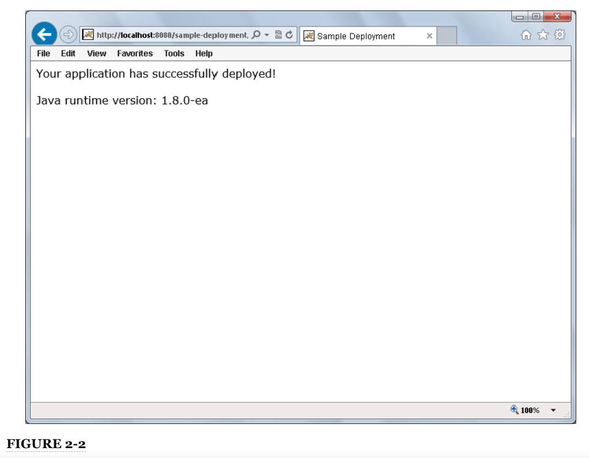

Undeploying la aplicación es tan simple como revertir el proceso. Elimine el archivo `sample-deployment.war` y espere unos momentos. Cuando Tomcat detecta que el archivo fue eliminado, anula la implementación de la aplicación y elimina el directorio descomprimido, y la aplicación ya no será accesible desde su navegador. No es necesario apagar Tomcat para realizar esta tarea.

#### USO DEL TOMCAT MANAGER

También puede implementar una aplicación Java EE mediante la interfaz web del administrador de Tomcat. Para hacerlo, siga estos pasos:

1. Abra su navegador y navegue hasta http://localhost:8080/manager/html.

2. Cuando se le solicite un nombre de usuario y contraseña, ingrese **admin** como nombre de usuario y **admin** como contraseña (o lo que haya configurado en `conf/tomcat-users.xml`). La página que se le presenta debe parecerse a la Figura 2-3.

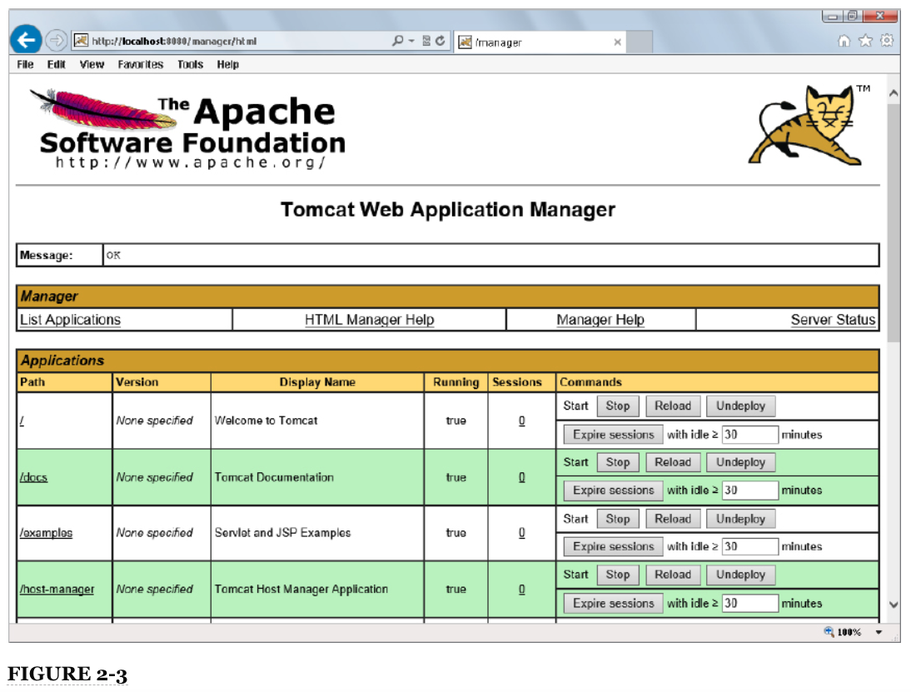

3. Desplácese hacia abajo hasta la sección Deploy y busque el formulario "WAR file to deploy". En el campo "Select WAR file to upload", elija el archivo ` sample-deployment.war` de su sistema de archivos, como se muestra en la Figura 2-4, y luego haga clic en el botón Implementar. El archivo WAR se carga en Tomcat, que implementa la aplicación. El directorio `sample-deployment` se crea nuevamente en el directorio `webapps` de Tomcat. Cuando termine, Tomcat lo regresa a la lista de aplicaciones donde puede ver que la aplicación de muestra se ha implementado, como se muestra en la Figura 2-5.

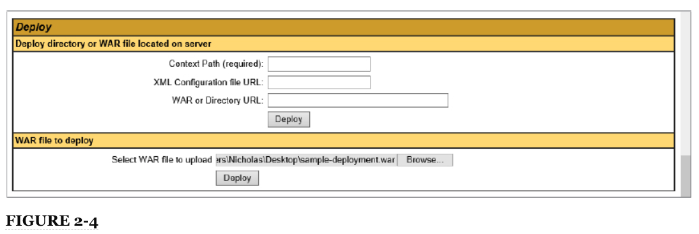

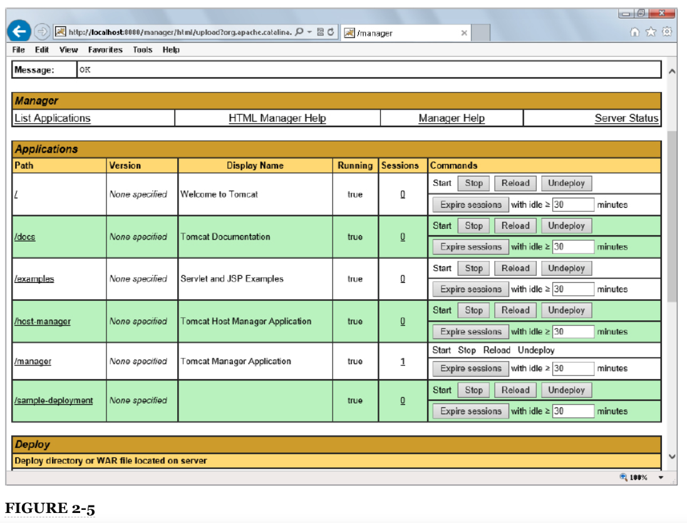

4. Como antes, puede ir a http://localhost:8080/sample-deployment/ y ver la página de muestra en la aplicación de muestra.

Ahora ha implementado la aplicación utilizando el administrador de Tomcat.

Undeploying es igual de fácil de lograr. En la página del administrador de Tomcat que vio anteriormente, debería notar un botón Undeploy junto a la aplicación de muestra (consulte la Figura 2-5). Haga clic en este botón y la aplicación de muestra se undeployed y se eliminará del directorio de aplicaciones web. Cuando termine, ya no podrá acceder a la aplicación en http://localhost:8080/sample-deployment/.

## DEBUGGING TOMCAT DESDE EL IDE

Como desarrollador de Java EE, una de las habilidades más importantes que puede tener es la capacidad de implementar y depurar aplicaciones en Tomcat desde su IDE de Java. Esto le proporciona inconmensurables habilidades de resolución de problemas para determinar por qué una aplicación no se ejecuta o averiguar por qué ocurre el error que informó su cliente. Esta sección cubre la configuración, ejecución y depuración de aplicaciones web en Tomcat utilizando IntelliJ IDEA y Eclipse. Puede leer ambos conjuntos de instrucciones o simplemente el conjunto que pertenece al IDE que ha elegido; esa elección depende de usted.

En el resto de este libro hay muy pocas instrucciones para hacer esto. Esto mantiene el texto desacoplado de cualquier IDE en particular. Tampoco verá capturas de pantalla específicas de IDE después de este capítulo. Asegúrese de estar familiarizado y cómodo con la implementación y depuración de aplicaciones en Tomcat utilizando su IDE antes de continuar, incluso si eso significa repasar esta sección varias veces.

### UTILIZANDO INTELLIJ IDEA

Si usa IntelliJ IDEA 13 o más reciente, solo tiene que seguir unos simples pasos para comenzar a usar sus aplicaciones web. Lo primero que debe hacer es configurar IntelliJ para que reconozca su Tomcat local u otra instalación de contenedor. Este es un paso que se realiza una sola vez: lo configura una vez en la configuración global de IDE y luego puede usar el servidor de aplicaciones para cualquier proyecto de aplicación web. A continuación, configure cada proyecto de aplicación web para usar su contenedor configurado. Finalmente, solo necesita iniciar su aplicación desde IntelliJ y colocar puntos de interrupción donde le gustaría depurar su aplicación.

#### Configuración de Tomcat 8.0 en IntelliJ

Para comenzar, debe configurar Tomcat en la lista de servidores de aplicaciones de IntelliJ.

1 . Abre el diálogo de configuración IDE de IntelliJ. Con un proyecto abierto, puede ir a File ⇒ Settings, o hacer clic en el icono de Configuración en la barra de herramientas (que se muestra aquí en el margen), o presionar Ctrl + Alt + S. Si no tiene un proyecto abierto, puede hacer clic en el Botón Configurar y luego el botón Configuración.

2. En el panel izquierdo del cuadro de diálogo Configuración, haga clic en Application Servers under IDE Settings. Inicialmente, no tiene ningún servidor de aplicaciones configurado.

3. Haga clic en el ícono verde más para agregar un nuevo servidor de aplicaciones. Haga clic en el botón de exploración junto al campo de inicio de Tomcat para buscar y seleccionar el directorio de inicio de Tomcat (por ejemplo, `C:\Program Files\Apache Software Foundation\Tomcat 8.0`). Luego haga clic en Aceptar. IntelliJ debería detectar automáticamente su versión de Tomcat y el cuadro de diálogo debería verse como en la Figura 2-6.

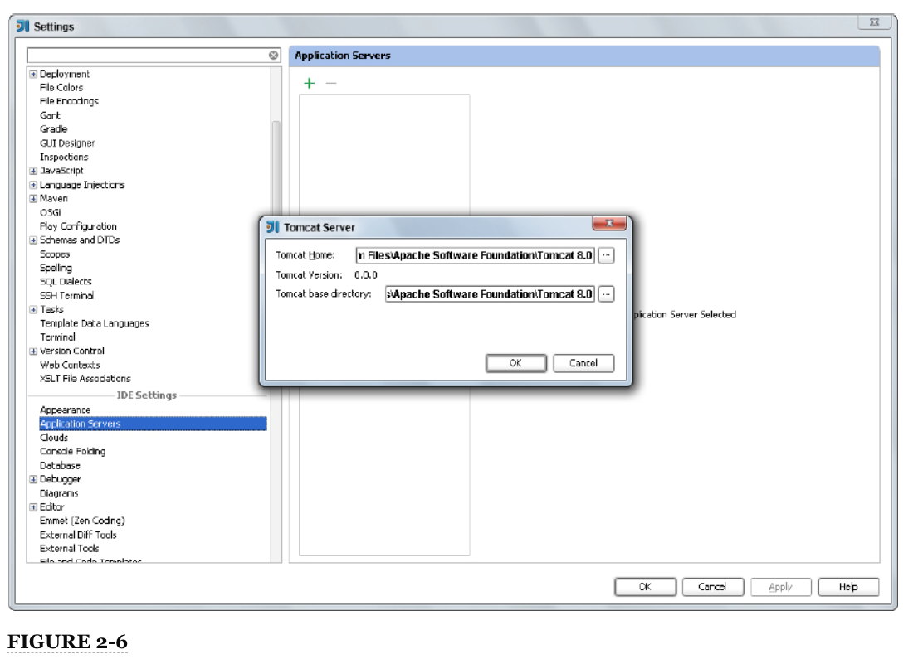

4. Haga clic en Aceptar nuevamente para completar la adición de Tomcat a su lista de servidores de aplicaciones y cambie el nombre si lo desea. Todas las muestras de código IntelliJ que puede descargar para este libro asumen un nombre de servidor de aplicaciones de **Tomcat 8.0**, por lo que para mayor facilidad, debe cambiarle el nombre a Tomcat 8.0 si se llama de otra manera.

5. Haga clic en save para guardar los cambios y OK para cerrar el cuadro de diálogo Configuración.

##### Agregar una Configuración de Tomcat a un Proyecto

Después de crear un proyecto y estar listo para implementarlo en Tomcat desde IntelliJ, debe agregar una configuración de run/debug  de Tomcat a su proyecto.

1. Haga clic en el icono de run/debug configuraciones (una flecha hacia abajo) en la barra de herramientas, luego haga clic en Editar configuraciones.

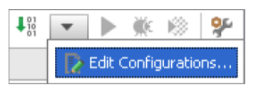

2. En el cuadro de diálogo que aparece, haga clic en el ícono más verde, desplácese hasta la parte inferior del menú Add New Configuration, coloque el cursor sobre Tomcat Server y haga clic en Local. Esto crea una configuración de run/debug para ejecutar su proyecto en un Tomcat local, como se muestra en la Figura 2-7.

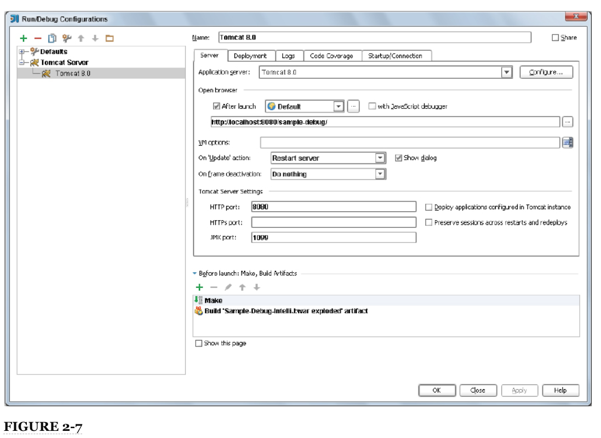

3. Si Tomcat 8.0 es el único servidor de aplicaciones que ha agregado a IntelliJ, se selecciona automáticamente como el servidor de aplicaciones que utilizará esta configuración de run/debug. Si tiene otros servidores de aplicaciones configurados, se puede seleccionar uno de ellos, en cuyo caso debe hacer clic en el menú desplegable "Application server" y seleccionar Tomcat 8.0 en su lugar.

4. Nombre la configuración de ejecución con algo significativo. En la Figura 2-7 y en todos los proyectos de ejemplo de IntelliJ que descarga para este libro, la configuración de ejecución se denomina Tomcat 8.0 como el servidor de aplicaciones que utiliza.

5. Probablemente verá una advertencia de que no hay artefactos marcados para su implementación. Corregir esto es simple. Haga clic en la pestaña Implementación y luego en el ícono verde más bajo el encabezado "Deploy at the server startup". Haga clic en Artefacto y luego en el artefacto del archivo war artifact. Haga clic en OK. Cambie el nombre del “Application context” para la implementación del artefacto a la URL relativa al servidor en la que desea implementarlo, como se muestra en la Figura 2-8.

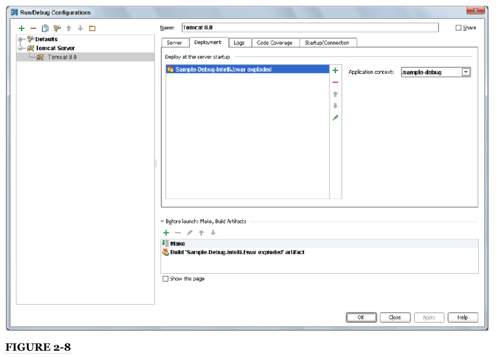

6. Haga clic en Apply y luego en OK para guardar la configuración de run/debug y cerrar el cuadro de diálogo.

   Puede descargar el proyecto Sample-Debug-IntelliJ desde el sitio de descarga de código wrox.com para ver una aplicación web de muestra ya configurada para ejecutarse en su servidor de aplicaciones Tomcat 8.0 local. (Sin embargo, aún debe configurar su instalación de Tomcat 8.0 en la configuración IDE de IntelliJ).

##### Iniciar una aplicación y alcanzar Hitting Breakpoints

Ahora que ha configurado Tomcat en IntelliJ y configurado un proyecto de IntelliJ para que se ejecute en Tomcat, está listo para iniciar la aplicación y depurarla dentro de su IDE.

1. Descargue el proyecto Sample-Debug-IntelliJ del sitio de descarga de código wrox.com y ábralo con IntelliJ IDEA.

2. Asegúrese de que su configuración de run/debug esté configurada correctamente para utilizar su servidor de aplicaciones local Tomcat 8.0. Debe realizar esta verificación para cada proyecto de muestra que descargue para este libro antes de intentar iniciarlo.

3. Cuando se abre, debería ver una pantalla como la Figura 2-9, con dos puntos de interrupción para `index.jsp`.

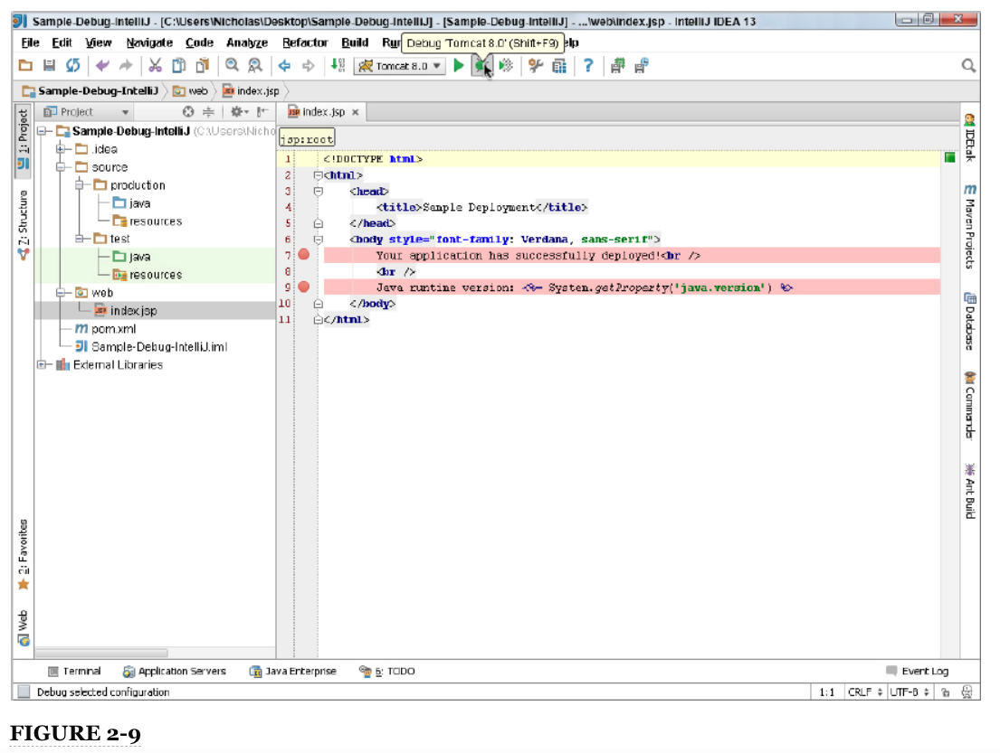

4. Haga clic en el icono Debug en la barra de herramientas (resaltado por el puntero del mouse en la Figura 2-9) o presione Shift + F9 para compilar e iniciar su aplicación en modo de depuración. IntelliJ debería iniciar su navegador predeterminado y debería llegar inmediatamente a los puntos de interrupción en `index.jsp`.

Debería volver a ver la página web de la Figura 2-2 para indicar que su aplicación se implementó correctamente.

**NOTA** *IntelliJ realmente puede acceder a http://localhost:8080/sample-debug/ antes de iniciar su navegador. Hace esto para garantizar que su aplicación se haya implementado correctamente. Si este es el caso, alcanzará los puntos de interrupción dos veces: una cuando IntelliJ acceda a la aplicación y otra cuando su navegador se abra y acceda a la aplicación*.

### USANDO ECLIPSE

El uso de Tomcat en Eclipse tiene algunas similitudes con el uso de Tomcat en IntelliJ IDEA, pero también tiene muchas diferencias y las pantallas se ven muy diferentes. El mismo proceso básico aún se aplica: debe configurar Tomcat en la configuración global de Eclipse, configurarlo para un proyecto e iniciar y depurar el proyecto. En esta última parte de esta sección. aprenderá a usar Tomcat de Eclipse en caso de que lo haya elegido como su IDE para este libro.

**ADVERTENCIA** *Como se discutió en la introducción, a la fecha de publicación de este libro, Eclipse aún no es compatible con Java SE 8, Java EE 7 o Tomcat 8.0. Debe esperar hasta que se lance Eclipse 4.4 Luna en junio de 2014 para obtener soporte para estas tecnologías. Como tal, las instrucciones y figuras de Eclipse en esta sección pueden no ser completamente precisas, y debe responder según sea necesario a los cambios realizados en la versión de lanzamiento de Eclipse Luna*.

#### Configuración de Tomcat 8.0 en Eclipse

Para comenzar, debe configurar Tomcat 8.0 como un entorno de ejecución en las preferencias globales de Eclipse. Para hacerlo, siga estos pasos:

1. Abra su Eclipse IDE para desarrolladores Java EE y vaya a Windows ⇒ Preferencias.

2. En el cuadro de diálogo Preferencias que aparece, expanda Servidor y luego haga clic en Entornos de tiempo de ejecución. Aparece un panel Entornos de tiempo de ejecución del servidor donde puede gestionar los servidores de aplicaciones y los contenedores web disponibles para todos sus proyectos de Eclipse.

3. Haga clic en el botón Agregar para abrir el cuadro de diálogo Nuevo entorno de ejecución del servidor.

4. Expanda la carpeta Apache y seleccione Apache Tomcat v8.0, asegurándose de seleccionar la casilla de verificación "Crear un nuevo servidor local". Luego haga clic en el botón Siguiente.

5. En la siguiente pantalla, haga clic en el botón Examinar y busque el directorio de inicio de Tomcat 8.0 (por ejemplo, `C:\Program Files\Apache Software Foundation\Tomcat 8.0`). Luego haga clic en Aceptar.

6. En el menú desplegable de JRE, seleccione su instalación local de Java SE 8 JRE. Nombra el servidor como quieras. Los proyectos de muestra de Eclipse que descarga a lo largo de este libro asumen que el servidor se llama Apache Tomcat v8.0, que es el valor predeterminado de Eclipse. En este punto, debería ver una pantalla como la de la Figura 2-10.


7. Haga clic en el botón Finalizar para completar la adición de su servidor Tomcat local a Eclipse y luego haga clic en Aceptar para cerrar el cuadro de diálogo de preferencias.

Ahora está listo para utilizar Tomcat 8.0 en sus proyectos de Eclipse.

Otra cosa a tener en cuenta es que, de forma predeterminada, Eclipse utiliza un navegador integrado para abrir sus aplicaciones web. Debe deshabilitar esta función y usar un navegador convencional, como Google Chrome, Mozilla Firefox o Microsoft Internet Explorer. Para cambiar esta configuración, vaya al menú Window ⇒ Web Browser y seleccione algo que no sea "0 Internal Web Browser". La opción "1 Default System Web Browser" debería ser suficiente en la mayoría de los casos, pero es fácil cambiar esta configuración con frecuencia para satisfacer sus necesidades en un momento dado.

##### Usar el servidor Tomcat en un proyecto

Al crear un nuevo proyecto en Eclipse, debe seleccionar el servidor de tiempo de ejecución configurado que va a usar para ese proyecto en el primer cuadro de diálogo, como se muestra en la Figura 2-11. Sin embargo, esto configura solo las bibliotecas para su aplicación. No selecciona el servidor Tomcat 8.0 que creó. Para eso, siga estos pasos:

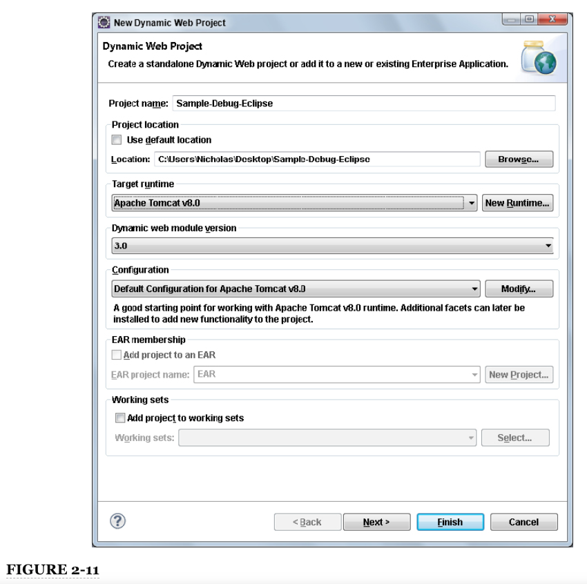

1. Después de crear o abrir el proyecto, vaya a Project ⇒ Properties y haga clic en el elemento del menú Server en el lado izquierdo del cuadro de diálogo Propiedades del proyecto que aparece.

2. De forma predeterminada, el servidor seleccionado es "<None>", por lo que debería cambiarlo a "Tomcat v8.0 Server en localhost", como se muestra en la Figura 2-12.

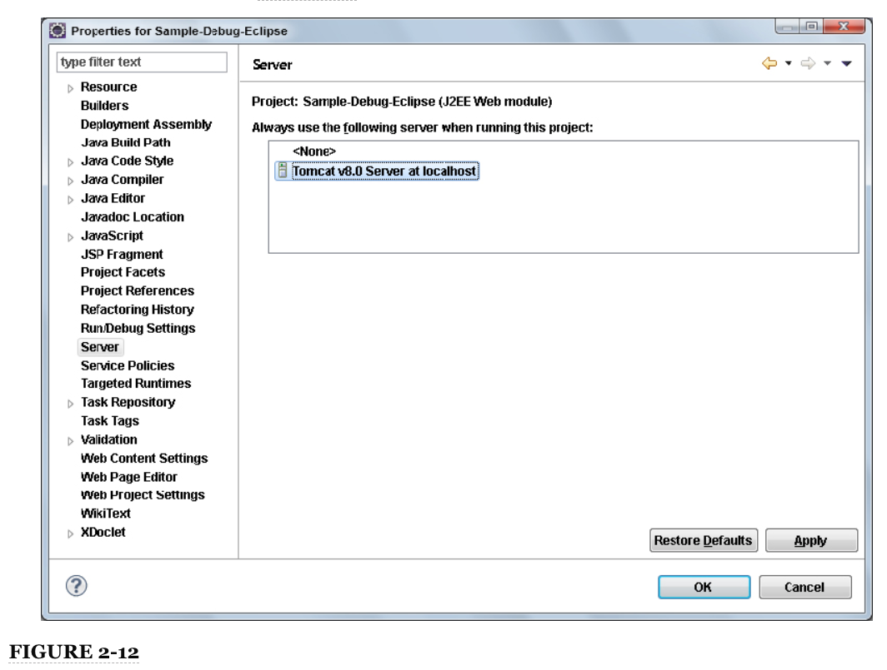

3. Haga clic en Apply para guardar los cambios.

4. Cambie la URL de contexto de la aplicación en la que se implementa la aplicación en Tomcat (asumiendo que no la configuró cuando creó el proyecto). En el cuadro de diálogo Propiedades del proyecto, puede hacer clic en el elemento de menú Configuración del proyecto web y actualizar el campo "Raíz de contexto" para cambiar esta configuración.

5. Después de hacer clic en Aplicar para guardar los cambios, haga clic en OK para cerrar el cuadro de diálogo.

   Puede descargar el proyecto Sample-Debug-Eclipse desde el sitio de descarga de código de wrox.com para ver una aplicación web de muestra ya configurada para ejecutarse en su servidor de aplicaciones Tomcat 8.0 local. (Sin embargo, aún debe configurar su instalación de Tomcat 8.0 en las preferencias de IDE de Eclipse).

##### Iniciar una aplicación y alcanzar Breakpoints

Ahora está listo para iniciar su aplicación y depurarla desde Eclipse.

1. Descargue el proyecto Sample-Debug-Eclipse del sitio de descarga de código wrox.com y ábralo con Eclipse IDE para desarrolladores de Java EE.

2. Asegúrese de que la configuración del servidor esté configurada correctamente para utilizar su servidor de aplicaciones local Tomcat 8.0. Debe realizar esta verificación para cada proyecto de muestra que descargue para este libro antes de intentar iniciarlo.

3. Cuando se abra, debería ver una pantalla como la Figura 2-13, con un punto de interrupción ya establecido para `index.jsp`.

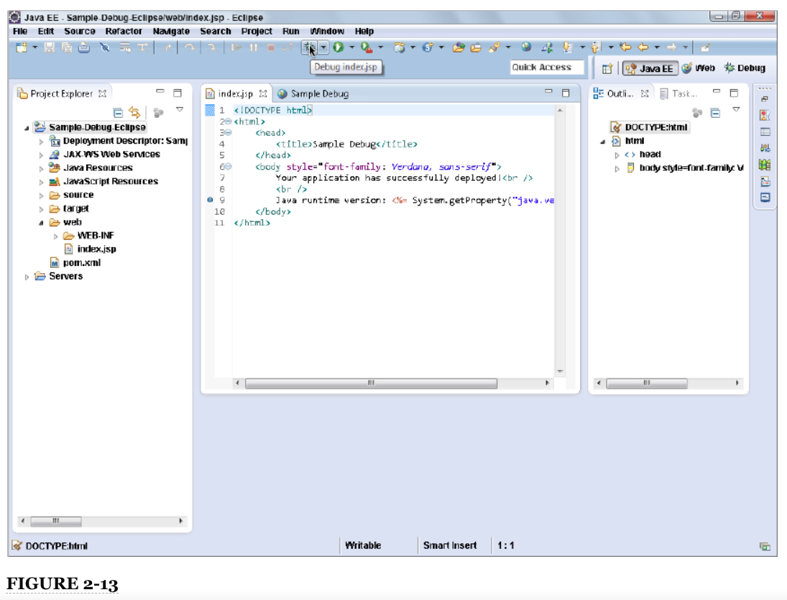

4. Haga clic en el icono Depurar en la barra de herramientas (resaltado por el puntero del mouse en la Figura 2-13) para compilar e iniciar su aplicación en modo de depuración. Eclipse debería iniciar el navegador configurado y debería llegar inmediatamente al punto de interrupción en `index.jsp`. Puede volver a ver la página web de la Figura 2-2 para indicar que su aplicación se implementó correctamente.

5. Para continuar desde el punto de interrupción, haga clic en el icono de continuar (que se muestra aquí en el margen) en la barra de herramientas de Eclipse.

**ADVERTENCIA** *Cuando ejecuta Tomcat desde Eclipse, Eclipse anula cualquier archivo `conf\setenv.bat` o `conf/setenv.sh` personalizado que cree para configurar la compilación JSP avanzada. Si no desea utilizar el compilador Eclipse JDT para compilar sus JSP, debe agregar la configuración CLASSPATH en este archivo a algún otro archivo de configuración de Tomcat. Consulte la documentación de Tomcat para determinar el archivo apropiado para colocarlo*.

**NOTA** *Es probable que haya notado que JSP en Eclipse solo tiene un punto de interrupción, mientras que JSP en IntelliJ IDEA tiene dos puntos de interrupción. El depurador JSP de Eclipse es mucho más limitado que el depurador JSP de IDEA, por lo que colocar un punto de interrupción en la línea 7 en esta JSP no es posible en Eclipse*.

## RESUMEN

En este capítulo, aprendió sobre los servidores de aplicaciones Java EE y los contenedores web y exploró varias implementaciones populares de ambos. Instaló Tomcat 8.0 en su máquina local, configuró la compilación JSP, la inició desde la línea de comandos y experimentó con la implementación y anulación de la implementación de aplicaciones en Tomcat. Finalmente, aprendió cómo configurar y ejecutar Tomcat 8.0 y depurar sus aplicaciones utilizando IntelliJ IDEA y Eclipse IDE para desarrolladores de Java EE.

En el siguiente capítulo, creará Servlets y aprenderá cómo funcionan las aplicaciones web Java EE.
