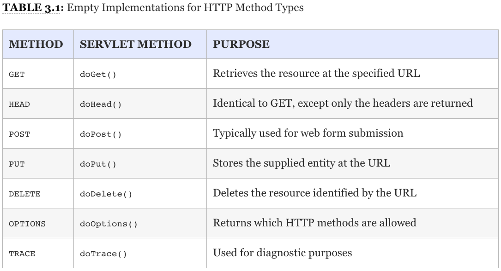
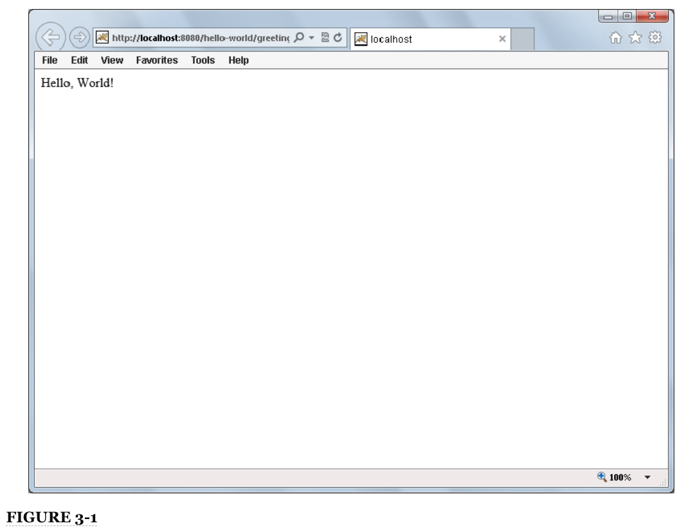

# Capítulo 3: Escribiendo su Primer Servlet

* Creando una clase de Servlet
* Configuración de un Servlet para Deployment
* Entendiendo `doGet()`, `doPost()` y otros métodos
* Uso de parámetros y Accepting Form Submissions
* Configuración de su aplicación usando parámetros de inicialización
* Carga de archivos desde un formulario
* Hacer que su aplicación sea segura para Multithreading
* Resumen

### EN ESTE CAPÍTULO

* Creando una clase de Servlet
* Configuración de un Servlet para su deployment
* Comprensión de `doGet()`, `doPost()` y otros métodos
* Usar parámetros y aceptar envíos de formularios
* Configurando su aplicación usando init parameters
* Subir archivos desde un formulario
* Hacer que su aplicación sea segura para múltiples subprocesos (multithreading)

### DESCARGAS DEL CÓDIGO PARA ESTE CAPÍTULO

El código de este capítulo se divide en los siguientes ejemplos principales:

* Proyecto **Hello-World**
* Proyecto **Hello-User**
* Proyecto **Customer-Support-v1**

### DEPENDENCIAS DE NEW MAVEN PARA ESTE CAPÍTULO

En este capítulo, necesitará su primera dependencia de Maven, que se muestra en el siguiente código. Utilizará esta dependencia para cada capítulo a lo largo del resto del libro.

```html
  <dependency>
    <groupId>javax.servlet</groupId>
    <artifactId>javax.servlet-api</artifactId>
    <version>3.1.0</version>
    <scope>provided</scope>
  </dependency>
```

En el último capítulo, se familiarizó con los servidores de aplicaciones y los contenedores web y aprendió a ejecutar, implementar y depurar **Apache Tomcat 8.5** desde su IDE de Java. En este capítulo, comenzará a crear aplicaciones web explorando primero el mundo de los servlets. A lo largo de este capítulo y el resto del libro, cambiará y mejorará continuamente estas aplicaciones, implementándolas en Tomcat para probarlas y depurarlas.

## CREANDO UNA CLASE SERVLET

En Java Platform, Enterprise Edition, un **`Servlet`** es lo que recibe y responde a las solicitudes(requests) del usuario final. La especificación de la **API de Java EE** define un servlet de la siguiente manera:

***Un Servlet es un pequeño programa Java que se ejecuta dentro de un servidor Web. Los servlets reciben y responden a solicitudes de clientes web, generalmente a través de HTTP HyperText Transfer Protocol - Protocolo de transferencia de hipertexto***.

http://docs.oracle.com/javaee/7/api/javax/servlet/Servlet.html

***Los Servlets son las clases centrales en cualquier aplicación web, las únicas clases que realizan el trabajo de responder a los requests o delegan ese trabajo a alguna otra parte de la aplicación***. A menos que algún filter termine prematuramente un request (discutida en el Capítulo 9), cada request a su aplicación pasa por algún Servlet. El contenedor web en el que ejecuta su aplicación tendrá uno o más Servlets integrados. Estos servlets manejan el servicio de **JavaServer Pages**, mostrando listados de directorios (si los tiene habilitados) y accediendo a recursos estáticos, como páginas HTML y gráficos. No tendrá que preocuparse por estos Servlets todavía (en algunos casos, nunca). En este capítulo, aprenderá a escribir y configurar los Servlets personalizados que componen su aplicación.

Cada Servlet implementa la interfaz **`javax.servlet.Servlet`**, pero generalmente no directamente. **`Servlet`** es una interfaz simple, que contiene métodos para inicializar y destruir el Servlet y atender los requests. Sin embargo, se llamará al método **`service`** para cualquier request de cualquier tipo, incluso si no es un request HTTP (en teoría, suponiendo que su contenedor web admita dicha solicitud). Como ejemplo, en el futuro es posible que se agreguen nuevos Servlets a Java EE para admitir el **File Transfer Protocol (FTP)**. Por esa razón, existen varias clases de Servlet que puede ampliar en su lugar. ***A partir de Java EE 7, el único protocolo Servlet admitido actualmente es HTTP***.

### QUE EXTENDER

En casi todos los casos, los Servlets heredan de **`javax.servlet.GenericServlet. GenericServlet`** sigue siendo un Servlet independiente del protocolo con el método **`service`** abstracto y solitario, pero contiene varios métodos auxiliares para registrar y obtener información sobre la aplicación y la configuración del Servlet (más sobre esto más adelante en la sección **"Configuración de un Servlet para la implementación(Deployment)"**).

Para responder a requests específicas de HTTP, **`javax.servlet.http.HttpServlet`** extiende **`GenericServlet`** e implementa el método **`service`** para aceptar solo solicitudes HTTP. Luego, proporciona implementaciones vacías para los métodos correspondientes a cada tipo de método HTTP, como se ilustra en la Tabla 3-1.

**TABLA 3.1: Implementaciones vacías para HTTP Method Types**




**NOTA** *La mayoría de los programadores web están familiarizados con los métodos **`GET`** y **`POST`** y los utilizan la mayor parte del tiempo. Si no está familiarizado con los distintos métodos HTTP o le gustaría obtener más información, ahora es el momento de hacer clic en http://www.w3.org/Protocols/rfc2616/rfc2616-sec9.html para ver la sección de especificaciones RFC-2616 sobre definiciones de métodos*.

Sin excepciones en este libro, sus Servlets siempre extenderán **`HttpServlet`**. Proporciona todas las herramientas que necesita para aceptar y responder selectivamente a diferentes tipos de solicitudes HTTP, y sus métodos aceptan los argumentos **`javax.servlet.http.HttpServletRequest`** y **`javax.servlet.http.HttpServletResponse`** en lugar de **`javax.servlet.ServletRequest`** y **`javax.servlet.ServletResponse`** para que tenga fácil acceso a los atributos específicos de HTTP de las solicitudes de sus servicios de Servlet. Debe comenzar por crear un Servlet nuevo y vacío que amplíe **`HttpServlet`**:

```java
package com.wrox;
 
import javax.servlet.http.HttpServlet;
 
public class HelloServlet extends HttpServlet {
 
}
```

**NOTA** *Para que este código se compile, debe tener la **Java EE Servlet API library** en su ruta de clase de compilación. Aquí es donde entra en juego **Maven artifact listed** en la primera página de este capítulo. En cada capítulo, necesitará los **listed Maven artifacts** para compilar los ejemplos de ese capítulo*.

En este form, su Servlet ya está preparado para aceptar cualquier solicitud HTTP y responder a ella con un error **405 Method Not Allowed**. Así es como puede controlar a qué métodos HTTP responde su Servlet: Cualquier método de Servlet HTTP que no override(anule) será respondido con **HTTP `status 405`**. Un Servlet que no maneja ninguna requests, por supuesto, no es muy útil, así que sobreescriba(override) el método **`doGet`** para agregar soporte para el método **HTTP `GET`**:

```java
package com.wrox;
 
import javax.servlet.ServletException;
import javax.servlet.http.HttpServlet;
import javax.servlet.http.HttpServletRequest;
import javax.servlet.http.HttpServletResponse;
import java.io.IOException;
 
public class HelloServlet extends HttpServlet {
    @Override
    protected void doGet(HttpServletRequest request, HttpServletResponse response)
            throws ServletException, IOException {
        response.getWriter().println("Hello, World!");
    }
}
```

Ahora su servlet está listo para responder a los requests **`GET`** y devolver la response de texto plano(sin formato) **"`Hello, World!`"** en el response body. El código de este ejemplo es bastante sencillo. Llamar a **`getWriter`** en el parámetro **`response`** devuelve un **`java.io.PrintWriter`**, ***una clase Java común que se utiliza para escribir texto en un flujo de salida***. A continuación, el código llama al método **`println`** de **`PrintWriter`** para escribir el texto **"`Hello, World!`"** al flujo de salida. Tenga en cuenta que no tiene que preocuparse por ninguno de los detalles de la HTTP request o response sin procesar. El contenedor web se encarga de interpretar el request y leer los headers y parameters del socket. Después de que su método retorne, se encarga de formatear los headers y el body de la response y escribirlos en el socket.

**NOTA** *Observe que no llamó al método **`close`** de **`PrintWriter`** que obtuvo de **`response`**. En términos generales, **en Java solo necesita cerrar los recursos que cree**. El contenedor web creó este recurso, por lo que es responsable de cerrarlo. Incluso si hubiera asignado la instancia a una variable local y hubiera llamado a varios métodos en ella, este sería el caso*.

Obviamente, podría hacer mucho más con este método **`doGet`**, como usar request parameters, y aún no ha echado un vistazo a los otros métodos. Tenga la seguridad de que pronto llegará a ambos.

### UTILIZAR EL INITIALIZER Y DESTROYER

Mientras obtiene su primer Servlet en funcionamiento, probablemente debería conocer los métodos `init` y `destroy`. Cuando un contenedor web inicia por primera vez un Servlet, llama al método `init` de ese Servlet. Esto es a veces, aunque no siempre, cuando se implementa la aplicación. (Aprenderá a controlar esto en la siguiente sección). Más adelante, cuando el contenedor web cierra el Servlet, llama al método de destrucción del Servlet. Estos métodos no son los mismos que los del constructor y finalizer de Java, y no se llaman al mismo tiempo que el constructor y finalizer. Normalmente, estos métodos no hacen nada, pero puede anularlos para realizar alguna acción:

```java
    @Override
    public void init() throws ServletException
    {
        System.out.println("Servlet " + this.getServletName() + " has started.");
    }
 
    @Override
    public void destroy()
    {
        System.out.println("Servlet " + this.getServletName() + " has stopped.");
    }
```

**NOTA** *Debe saber que otro método `init` acepta un único argumento de tipo `javax.servlet.ServletConfig`. Este método se especifica en la interfaz de `Servlet`, pero `GenericServlet` se encarga de implementar este método por usted y luego llama a la sobrecarga sin argumentos de `init` overridden en el ejemplo de código anterior. De esta manera, no tiene que llamar a `super.init` (servletConig) desde su propia implementación del método `init`*.

*Aunque puede override el método original, no debería hacerlo porque si olvidó llamar al súper método, es posible que el servlet no se inicialice correctamente. Si necesita acceder a `ServletConfig`, es mucho más fácil simplemente llamar al método `getServletConfig`. Aprenderá más sobre la clase `ServletConfig` en las Partes I y II de este libro*.

Puede hacer muchas cosas con estos dos métodos. Más importante aún, **`init` se llama después de que se construye el Servlet pero antes de que pueda responder a la primera solicitud**. A diferencia de cuando se llama al constructor, cuando se llama a `init`, todas las propiedades se han establecido en el Servlet, lo que le da acceso a los objetos `ServletConfig` y `javax.servlet.ServletContext`. (Aprenderá qué hacer con estos en la sección “Configuración de su aplicación usando parámetros de inicialización”). Por lo tanto, *puede usar este método para leer un archivo de propiedades o conectarse a una base de datos usando JDBC, por ejemplo*. El método `init` se llama cuando se inicia el Servlet. Si el Servlet está configurado para iniciarse automáticamente cuando se implementa e inicia la aplicación web, es entonces cuando se llama. De lo contrario, no se llama hasta que se recibe la primera solicitud de ese Servlet.

Del mismo modo, se llama a `destroy` inmediatamente después de que el servlet ya no pueda aceptar ninguna solicitud. Esto suele ocurrir cuando la aplicación web se detiene o anula su implementación o cuando el contenedor web se cierra. Debido a que se solicita inmediatamente después de la cancelación de la implementación o el cierre, no tiene que esperar a que el garage collection active el finalizador antes de limpiar recursos como archivos temporales o desconectarse de bases de datos que ya no están en uso. Esto es particularmente importante porque si su aplicación está anulada pero el servidor continúa ejecutándose, pueden pasar varios minutos o incluso horas antes de que se ejecute garage collection. Si limpia sus recursos en el finalizer en lugar del método `destroy`, esto podría resultar en que su aplicación se cancele parcialmente o no se cancele. Por lo tanto, siempre debe usar el método `destroy` para limpiar los recursos que tiene su Servlet entre solicitudes.

El ejemplo de código anterior utiliza los métodos `init` y `destroy` para registrar cuándo se inicia y se detiene el servlet, respectivamente. Cuando ejecuta su aplicación en la siguiente sección, estos mensajes de registro aparecen en la ventana de salida del depurador de su IDE. Más adelante en este capítulo, utilizará mejor estos métodos.

## CONFIGURACIÓN DE UN SERVLET PARA DESPLIEGUE

Ahora que ha creado su Servlet, es hora de ponerlo en acción. Aunque tiene una clase trabajadora que puede responder a las solicitudes HTTP `GET` con un saludo inteligente, no ha escrito instrucciones para que el contenedor web implemente el Servlet con la aplicación. El Capítulo 1 le presentó el deployment descriptor (`web.xml`) y la estructura de una aplicación web, y en el Capítulo 2 aprendió cómo implementar y depurar una aplicación usando su IDE. En esta sección, crea el archivo `web.xml` en su directorio `WEB-INF` y configura su Servlet para la implementación. Luego, implementa la aplicación usando su IDE y ve ese saludo en su navegador. Finalmente, pones algunos puntos de interrupción en tu código y examinas cuándo se llaman a ciertos métodos.

### AÑADIR EL SERVLET AL DESCRIPTOR

Como ha aprendido, el deployment descriptor indica al contenedor web cómo se debe implementar la aplicación. Específicamente, define todos los listeners, Servlets y filtros que deben implementarse con la aplicación y la configuración que la aplicación debe usar para hacer esto. Primero, eche un vistazo a un archivo `web.xml` (en su mayoría) vacío:

```html
<?xml version="1.0" encoding="UTF-8"?>
<web-app xmlns="http://xmlns.jcp.org/xml/ns/javaee"
         xmlns:xsi="http://www.w3.org/2001/XMLSchema-instance"
         xsi:schemaLocation="http://xmlns.jcp.org/xml/ns/javaee
                             http://xmlns.jcp.org/xml/ns/javaee/web-app_3_1.xsd"
         version="3.1">
    <display-name>Hello World Application</display-name>
</web-app>
```

**ADVERTENCIA** *Si ha trabajado con deployment descriptors  en versiones anteriores de Java EE, esto puede parecerle un poco desconocido. Esto se debe a que los URI del esquema XML para `web.xml` y otros archivos de configuración han cambiado desde Java EE 6. Debe utilizar los nuevos URI para que su aplicación sea compatible con Java EE 7*.

En el ejemplo anterior, el código en negrita indica al servidor de aplicaciones cuál es el nombre de la aplicación. En la pantalla del administrador de Tomcat que enumera todas las aplicaciones instaladas, el nombre entre las etiquetas `<display-name>` aparece al lado de su aplicación. El atributo `version` en la etiqueta de apertura `<web-app>` indica para qué versión de API de Servlet está escrita la aplicación, en este caso, la versión 3.1.

Ahora debe decirle al contenedor web que cree una instancia del Servlet que escribió anteriormente, por lo que debe agregar una etiqueta de Servlet al archivo descriptor entre las etiquetas `<web-app>` inicial y final:

```html
    <servlet>
        <servlet-name>helloServlet</servlet-name>
        <servlet-class>com.wrox.HelloServlet</servlet-class>
    </servlet>
```

Anteriormente en el capítulo, aprendió sobre el método `init` de Servlet y cuándo se llamaría normalmente. En este ejemplo, se llama al método `init` cuando llega la primera solicitud del Servlet después de que se inicia la aplicación web. Normalmente, esto es suficiente para la mayoría de usos. Sin embargo, si el método init hace muchas cosas, el inicio de Servlet puede convertirse en un proceso que requiere mucho tiempo, y esto podría hacer que la primera solicitud a ese Servlet demore varios segundos o incluso varios minutos. Evidentemente, esto no es deseable. Un simple ajuste a la configuración del servlet puede hacer que el servlet se inicie inmediatamente cuando se inicia la aplicación web:

```java
    <servlet>
        <servlet-name>helloServlet</servlet-name>
        <servlet-class>com.wrox.HelloServlet</servlet-class>
        <load-on-startup>1</load-on-startup>
    </servlet>
```

El código envalentonado(emboldened) indica al contenedor web que inicie el Servlet tan pronto como se inicie la aplicación web. Si varias configuraciones de Servlet contienen esta etiqueta, se inician en el orden de los valores dentro de las etiquetas, con el valor "1" utilizado anteriormente en primer lugar y los números más altos después. Si dos o más Servlets tienen el mismo valor en la etiqueta `<load-on-startup>`, esos Servlets en conflicto comienzan en el orden en que aparecen en el archivo descriptor, aún después de otros Servlets con números más bajos y antes de otros Servlets con números más altos.

### MAPPING EL SERVLET A UN URL

Ha indicado al servidor de aplicaciones que inicie el Servlet, pero aún no le ha dicho a qué solicitudes de URL debe responder el Servlet. Este es un asunto simple:

```html
    <servlet-mapping>
        <servlet-name>helloServlet</servlet-name>
        <url-pattern>/greeting</url-pattern>
    </servlet-mapping>
```

Con esta configuración, todas las solicitudes a la URL `/greeting` relativo a la aplicación son manejadas por `helloServlet`. (Observe que las etiquetas `<servlet-name>` dentro de las etiquetas `<servlet>` y `<servlet-mapping>` coinciden. Así es como el contenedor web asocia las dos). Si la aplicación se implementa en http://www.example.net, el Servlet responde a las solicitudes dirigidas a la URL http://www.example.net/greeting. Por supuesto, no está limitado a este mapeo. Puede asignar varias URL al mismo servlet:

```html
    <servlet-mapping>
        <servlet-name>helloServlet</servlet-name>
        <url-pattern>/greeting</url-pattern>
        <url-pattern>/salutation</url-pattern>
        <url-pattern>/wazzup</url-pattern>
    </servlet-mapping>
```

En este caso, las tres URL actúan como alias para el mismo endpoint lógico: `helloServlet`. ¿Por qué, podría preguntar, necesita dar un nombre a una instancia de Servlet y luego asignar una solicitud al nombre de esa instancia? ¿Por qué no puede simplemente asignar la URL directamente a la clase Servlet? Bueno, ¿qué pasa si tienes dos Servlets de tienda diferentes en una aplicación de compras en línea, por ejemplo? Esas tiendas pueden tener una lógica idéntica pero conectarse a diferentes bases de datos. Esto se puede lograr simplemente:

```html
    <servlet>
        <servlet-name>oddsStore</servlet-name>
        <servlet-class>com.wrox.StoreServlet</servlet-class>
    </servlet>
    <servlet>
        <servlet-name>endsStore</servlet-name>
        <servlet-class>com.wrox.StoreServlet</servlet-class>
    </servlet>
    
    <servlet-mapping>
        <servlet-name>oddsStore</servlet-name>
        <url-pattern>/odds</url-pattern>
    </servlet-mapping>
    <servlet-mapping>
        <servlet-name>endsStore</servlet-name>
        <url-pattern>/ends</url-pattern>
    </servlet-mapping>
```

Ahora tiene dos instancias de la misma clase de Servlet, pero tienen diferentes nombres y están asignadas a diferentes URL. Hace dos ejemplos, tenía tres URL que apuntaban a la *misma instancia de Servlet*. Sin embargo, en este ejemplo tiene *dos instancias de Servlet diferentes*. Quizás se pregunte cómo las dos instancias diferentes saben qué tiendas son. Una llamada rápida a `this.getServletName()` desde cualquier lugar del código del servlet devuelve "oddsStore" o "endsStore" dependiendo de la instancia que sea. Recuerde que utilizó este método anteriormente cuando registraba llamadas al initializer y al destroyer.

Retrocediendo un poco, ahora tiene el archivo descriptor `web.xml` simple y completo:

```html
<?xml version="1.0" encoding="UTF-8"?>
<web-app xmlns="http://xmlns.jcp.org/xml/ns/javaee"
         xmlns:xsi="http://www.w3.org/2001/XMLSchema-instance"
         xsi:schemaLocation="http://xmlns.jcp.org/xml/ns/javaee
                             http://xmlns.jcp.org/xml/ns/javaee/web-app_3_1.xsd"
         version="3.1">
 
    <display-name>Hello World Application</display-name>
 
    <servlet>
        <servlet-name>helloServlet</servlet-name>
        <servlet-class>com.wrox.HelloServlet</servlet-class>
    </servlet>
 
    <servlet-mapping>
        <servlet-name>helloServlet</servlet-name>
        <url-pattern>/greeting</url-pattern>
    </servlet-mapping>
 
</web-app>
```

### EJECUTANDO Y DEPURANDO SU SERVLET

Una vez guardada, compile su aplicación y verifique que tenga una configuración de ejecución IDE configurada para ejecutar su proyecto en su instancia local de Tomcat 8.0. (Si no recuerda cómo hacer esto, consulte el Capítulo 2). La aplicación debería implementarse en `/hello-world`. También puede descargar el proyecto **950-03-01-hello-world** IDE; ya está configurado para implementarse correctamente. Una vez hecho esto, siga estos pasos:

1. Haga clic en el icono de depuración en su IDE para iniciar el contenedor web en modo de depuración. Su IDE implementa su aplicación en el contenedor web después de que se inicia.

2. Abra su navegador web favorito y navegue hasta http://localhost:8080/hello-world/greeting. Ahora debería ver la pantalla de la Figura 3-1.



3. Una buena forma de entender lo que sucedió es colocar algunos breakpoints en `HelloServlet` y ejecutar este experimento nuevamente. Debe detener su depurador (que apaga Tomcat) para que también pueda alcanzar un punto de interrupción en el initializer. Coloque puntos de interrupción en las líneas individuales de código en los métodos `doGet`, `init` y `destroy` de su Servlet; luego reinicie su depurador. Después de que se inicie Tomcat y se implemente su aplicación, notará que aún no alcanzó ningún punto de interrupción (porque `<load-on-startup>` no está presente en el deployment descriptor).

4. Actualice la página greeting en su navegador y debería llegar al punto de interrupción en el método `init` de su IDE. Esto significa que Tomcat ha activado la inicialización just-in-time de su Servlet: no se inicializó hasta que llegó la primera solicitud.

5. Al igual que si el método `init` tardara mucho en completarse, la solicitud de su navegador permanece en espera hasta que continúe con el depurador, así que hágalo ahora. Debería llegar inmediatamente al punto de interrupción en el método `doGet`. Ahora, el servlet atiende la solicitud, pero su navegador aún espera una respuesta.

6. Continúe con el depurador por segunda vez y ahora la respuesta se envía a su navegador.

En este punto, puede presionar el botón Refresh en su navegador tantas veces como desee, y llegará al punto de interrupción solo en el método `doGet`. El método `init` no se vuelve a llamar hasta que alguna acción destruye el Servlet (por ejemplo, Tomcat se apaga) y luego comienza de nuevo. Hasta este punto, todavía no ha alcanzado el punto de interrupción en el método destroy. Desea hacer eso ahora, pero ***desafortunadamente, si detiene Tomcat de su IDE, desconecta el depurador antes de que se alcance el punto de interrupción, por lo que debe detener Tomcat desde la línea de comandos***. Para hacer esto, siga estos pasos:

1. Abra un símbolo del sistema(consola) y cambie su directorio actual al directorio de inicio de Tomcat (`C:\Program Files\Apache Software Foundation\Tomcat 8.0` en una máquina con Windows, recuerde).

2. Escriba el comando `bin\shutdown.bat` (o `bin/shutdown.sh` si no está ejecutando Windows) y presione Entrar.
   
3. En su ventana IDE, debe alcanzar inmediatamente el punto de interrupción en el método `destroy`. Tomcat no se apaga por completo hasta que continúe con el depurador.
   
Como se mencionó anteriormente, puede cambiar la configuración de su Servlet para que se inicialice cuando se inicie la aplicación. Pruébelo ahora.

1. Actualice su declaración de Servlet en el descriptor de implementación para agregar el código en negrita en el siguiente ejemplo:

```html
    <servlet>
        <servlet-name>helloServlet</servlet-name>
        <servlet-class>com.wrox.HelloServlet</servlet-class>
        <load-on-startup>1</load-on-startup>
    </servlet>
```

2. Con los puntos de interrupción aún en su lugar en su Servlet, inicie su depurador nuevamente. Debe alcanzar inmediatamente el punto de interrupción en el método `init` antes de realizar la primera solicitud al Servlet.

3. Continúe con el depurador y luego actualice su navegador. Ahora debería alcanzar el punto de interrupción solo en el método `doGet`; 
el servlet se inicializó al inicio de la aplicación y no es necesario volver a inicializarlo.

Ahora que ha creado su primer Servlet y está familiarizado con el ciclo de vida de un Servlet, se le anima a experimentar con diferentes llamadas a métodos en el Servlet y en los parámetros de `request` y `response` en el método `doGet`. En la siguiente sección, explorará `doGet`, `doPost` y otros métodos más para comprender mejor `HttpServletRequest` y `HttpServletResponse`.

**NOTA** *Debe consultar (y marcar) la documentación de la API para Java EE 7 que se encuentra en http://docs.oracle.com/javaee/7/api/ para obtener información sobre los métodos disponibles y sus propósitos*.

## COMPRENDER `DOGET()`, `DOPOST()` Y OTROS MÉTODOS

En la sección anterior, aprendió sobre el método `doGet` y otros métodos que se asignan a los diversos métodos de solicitud HTTP. Pero, ¿qué puede hacer exactamente con estos métodos? Más importante aún, ¿qué debe hacer con estos métodos? Las respuestas breves a estas preguntas son "casi cualquier cosa" y "no mucho", respectivamente. Esta sección explora algunas de las cosas que puede hacer y cómo hacerlo.

### ¿QUÉ DEBERÍA SUCEDER DURANTE LA EJECUCIÓN DEL MÉTODO DE SERVICIO?

El método `service` de la clase `Servlet`, como aprendió anteriormente, atiende todas las solicitudes entrantes. En última instancia, debe analizar y manejar los datos de la solicitud entrante según el protocolo en uso y luego devolver al cliente una respuesta aceptable para el protocolo. Si el método `service` regresa sin enviar datos de respuesta al socket, es probable que el cliente observe un error de red, como "connection reset". Específicamente en el protocolo HTTP, el método de servicio debe comprender los encabezados y parámetros que envía el cliente y luego devolver una respuesta HTTP adecuada que al menos incluya los encabezados HTTP mínimos (incluso si el cuerpo de la respuesta está vacío). En realidad, la implementación de esto es compleja (e implica muchos pasos) y puede diferir de un contenedor web a otro.

La belleza de extender `HttpServlet` es que no tiene que preocuparse por ninguno de estos detalles. Aunque la realidad es que el método `service` debe hacer muchas cosas antes de responder al usuario, el desarrollador que usa `HttpServlet` debe hacer poco. En realidad, en el proyecto **950-03-01-hello-world** que usó en las dos últimas secciones, si elimina la única línea de código del método `doGet` y ejecuta la aplicación, ¡todo seguirá funcionando bien! Una respuesta HTTP estructurada correctamente con contenido de longitud cero devuelve al cliente. El único requisito es que override el método `doGet` (o `doPost` o `doPut` o lo que quiera admitir); no es necesario poner nada en él. Pero, ¿cuán útil es esto realmente?

La respuesta a eso es "en absoluto". El hecho de que pueda devolver una respuesta vacía no significa que deba hacerlo. Aquí es donde entran `HttpServletRequest` y `HttpServletResponse`. Estos parámetros en los diversos métodos definidos por `HttpServlet` le permiten leer los parámetros pasados desde el cliente, aceptar archivos cargados desde un formulario publicado, leer los datos sin procesar(raw data) contenidos en el body de la solicitud (para hacer cosas como como manejar solicitudes PUT o aceptar cuerpos de solicitud JSON), leer encabezados de solicitud y manipular encabezados de respuesta, y escribir contenido de respuesta al cliente. Estas son algunas de las muchas cosas que puede hacer al atender una solicitud y, en realidad, generalmente debe hacer una o más de estas cosas.

### USANDO HTTPSERVLETREQUEST

La interfaz `HttpServletRequest` es una extensión de `ServletRequest` que proporciona información adicional específica del protocolo HTTP sobre una solicitud recibida. Especifica docenas de métodos que puede utilizar para obtener detalles sobre una solicitud HTTP. También le permite establecer atributos de solicitud (diferentes de los parámetros de solicitud).

**NOTA** *Aprenderá sobre los atributos de solicitud y la inspección de los detalles de autenticación en el siguiente capítulo. Este libro no cubre los detalles de cada método (para eso, puede consultar la documentación de la API) pero cubre las características más importantes*.

#### Obtener Request Parameters

Quizás la capacidad más importante de `HttpServletRequest`, y una que explora a través de ejemplos en la siguiente sección, es recuperar los parámetros de solicitud pasados por el cliente. Los parámetros del request vienen en dos formas diferentes: a través de *query parameters* (también llamados *parámetros URI*), o en `application/x-www-form-urlencoded` o `multipart/form-data` (generalmente llamado *post variables* o *form variables*). Los Query parameters son compatibles con todos los métodos de solicitud y están contenidos en la primera línea de datos en una solicitud HTTP, como en el siguiente ejemplo:

```sh
GET /index.jsp?productId=9781118656464&category=Books HTTP/1.1
```

**NOTA** *Técnicamente hablando, la especificación RFC para el protocolo HTTP no rechaza los parámetros de consulta en ninguno de los métodos HTTP. Sin embargo, muchos servidores web ignoran los parámetros de consulta pasados a `DELETE`, `TRACE` y `OPTIONS`, y la utilidad de los parámetros de consulta en tales solicitudes es cuestionable. Por lo tanto, es mejor no depender de los parámetros de consulta para este tipo de solicitudes. Este libro no cubre todas las reglas y complejidades del protocolo HTTP. Ese ejercicio queda en tus manos*.

En este ejemplo, hay dos parámetros de consulta incluidos en la solicitud: `productId`, que tiene el ISBN de este libro como valor, y `category`, que tiene el valor Books. Estos mismos parámetros también podrían pasarse en el body del request como post variables. Las post variables pueden, como su nombre lo indica, incluirse solo en las solicitudes de POST. Considere el siguiente ejemplo:

```sh
POST /index.jsp?returnTo=productPage HTTP/1.1
Host: www.example.com
Content-Length: 48
Content-Type: application/x-www-form-urlencoded
 
addToCart&productId=9781118656464&category=Books
```

Esta solicitud `POST` tiene post variables (indicando al sitio web que agregue este libro al carrito) y query parameters (indicando al sitio web que vuelva a la página del producto cuando se complete la tarea). Aunque existe una diferencia en la entrega de estos dos tipos de parámetros, son esencialmente los mismos y transmiten esencialmente la misma información. La API de Servlet no diferencia entre los dos tipos de parámetros. Una llamada a cualquiera de los métodos relacionados con parámetros en un objeto de solicitud devuelve parámetros, ya sea que se hayan entregado como query parameters o post variables.

El método `getParameter` devuelve un solo valor para un parámetro. Si el parámetro tiene varios valores, `getParameter` devuelve el primer valor, mientras que `getParameterValues` devuelve un array de valores para un parámetro. Si el parámetro tiene solo un valor, este método devuelve un array con un elemento. El método `getParameterMap` devuelve un `java.util.Map <String, String []>` que contiene todos los nombres de los parámetros asignados a sus valores, mientras que el método `getParameterNames` devuelve una enumeración de los nombres de todos los parámetros disponibles; ambos son útiles para iterar sobre todos los parámetros de la solicitud.

**ADVERTENCIA** *La primera vez que llama a `getParameter`, `getParameterMap`, `getParameterNames` o `getParameterValues` en un objeto request, el contenedor web determina si la solicitud contiene post variables y, si lo hace, lee y analiza esas post variables obteniendo el `InputStream` de la solicitud. El `InputStream` de una solicitud solo se puede leer una vez. Si llama a `getInputStream` o `getReader` en una solicitud que contiene post variables y luego intenta recuperar parámetros en esa solicitud, el intento de recuperar los parámetros da como resultado una `IllegalStateException`. Del mismo modo, si recupera parámetros en una solicitud que contiene post variables y luego llama a `getInputStream` o `getReader`, la llamada a `getInputStream` o `getReader` falla con una `IllegalStateException`*.

*En pocas palabras, cada vez que anticipa que una solicitud puede contener post variables, es mejor usar solo los métodos de parámetro y dejar `getInputStream` y `getReader` en paz*.

#### Determinar información sobre el contenido de la solicitud

Hay varios métodos disponibles para ayudar a determinar el tipo, la longitud y la codificación del contenido de la solicitud HTTP. El método `getContentType` devuelve el *tipo de contenido MIME* de la solicitud, como `application/x-www-form-urlencoded, application/json, text/plain, o application/zip`, por nombrar algunos. Un MIME content type describe que los datos que marca contienen algún tipo. Por ejemplo, los archivos ZIP tienen un tipo `application/zip` para indicar que contienen datos de archivos ZIP.

Los métodos `getContentLength` y `getContentLengthLong` devuelven el número de bytes en el cuerpo de la solicitud (la *longitud del contenido*), siendo el último método útil para solicitudes cuyo contenido puede superar los 2 gigabytes (inusual, pero no imposible). El método `getCharacterEncoding` devuelve la codificación de caracteres (como UTF-8 o ISO-8859-1) del contenido de la solicitud siempre que la solicitud contenga contenido de tipo carácter. (`text/plain, application/json, y application/x-www-form-urlencoded` son algunos ejemplos de tipos de contenido MIME de tipo carácter). Aunque estos métodos pueden resultar útiles en muchas situaciones, ninguno de ellos es necesario si obtiene post variables desde el request body utilizando los métodos de parámetro.

**NOTA** *La especificación Servlet 3.1 en Java EE 7 es la primera versión que admite el método `getContentLengthLong`. Antes de esta versión, tenía que llamar a `getHeader("Content-Length")` y convertir el `String` devuelto en un `long` para las solicitudes que podrían ser mayores de 2,147,483,647 bytes*.

#### Leer el contenido de un Request

Los métodos `getInputStream`, que devuelve un `javax.servlet.ServletInputStream`, y `getReader`, que devuelve un `java.io.BufferedReader`, se pueden utilizar para leer el contenido de la solicitud. Cuál es mejor depende completamente del contexto en el que se leen los contenidos de la solicitud. Si se espera que los contenidos sean datos codificados con caracteres, como texto UTF-8 o ISO-8859-1, utilizar `BufferedReader` suele ser la ruta más fácil de tomar porque le permite leer fácilmente los datos `char`. Sin embargo, si los datos de la solicitud son de naturaleza binaria, debe utilizar `ServletInputStream` para poder acceder al contenido del request en formato `byte`. Nunca debe usarlos a ambos en la misma solicitud. Después de una llamada a cualquiera de los métodos, una llamada al otro fallará con una `IllegalStateException`. Recuerde la advertencia anterior y no utilice estos métodos en una solicitud con variables de publicación.

#### Obtener características del Request, tales como URL, URI y Headers

Hay muchas características de la solicitud que es posible que deba conocer, como la URL o la URI con la que se realizó la solicitud. Estos son fáciles de obtener del objeto de solicitud:

* `getRequestURL`: Devuelve la URL completa que el cliente utilizó para realizar la solicitud, incluido el protocolo (`http` o `https`), el nombre del servidor, el número de puerto y la ruta del servidor, pero sin incluir la query string. Entonces, en una solicitud a http://www.example.org/application/index.jsp?category=Books, `getRequestURL` devuelve http://www.example.org/application/index.jsp.

* `getRequestURI`: Esto es ligeramente diferente de `getRequestURL` en que solo devuelve la parte de la ruta del servidor de la URL; utilizando el ejemplo anterior, sería `/application/index.jsp`.

* `getServletPath`: Similar a `getRequestURI`, devuelve incluso menos URL. Si el request es `/hello-world/greeting?foo=world`, la aplicación se implementa como `/hello-world` en Tomcat, y las asignaciones de servlet son `/greeting`, `/salutation` y `/wazzup`, `getServletPath` devuelve solo la parte del URL utilizada para coincidir con la asignación de servlet: `/greeting`.

* `getHeader`: Devuelve el valor de un encabezado con el nombre dado. El caso del encabezado no tiene por qué coincidir con el caso de la cadena pasada al método, por lo que `getHeader("content-type")` puede coincidir con el encabezado `Content-Type`. Si hay varios encabezados con el mismo nombre, esto devuelve solo el primer valor. En tales casos, querrá utilizar el método `getHeaders` para devolver una enumeración de todos los valores.

* `getHeaderNames`: Devuelve una enumeración de los nombres de todos los encabezados de la solicitud, una excelente manera de iterar sobre los encabezados disponibles.

* `getIntHeader`: Si tiene un encabezado en particular que sabe que siempre es un número, puede llamarlo para devolver el valor ya convertido en un número. Lanza una `NumberFormatException` si el encabezado no se puede convertir en un número entero.

* `getDateHeader`: Puede llamar a esto para devolver el (milisegundo) equivalente a la marca de tiempo Unix de un valor de encabezado que representa una marca de tiempo válida. Lanza una `IllegalArgumentException` si el valor del encabezado no se reconoce como una fecha.

#### Sesiones y Cookies

Los métodos `getSession` y `getCookies` se mencionan solo el tiempo suficiente para decirle que este capítulo no los cubre, pero ambos son ciudadanos importantes en el ámbito `HttpServletRequest`. Puede obtener más información sobre estos en el Capítulo 5.

### USANDO HTTPSERVLETRESPONSE

Como la interfaz `HttpServletRequest` extiende `ServletRequest` y brinda acceso a las propiedades específicas del protocolo HTTP de una solicitud, la interfaz `HttpServletResponse` extiende `ServletResponse` y brinda acceso a las propiedades específicas del protocolo HTTP de una respuesta. Utiliza el objeto response para hacer cosas como *establecer encabezados de respuesta, escribir en el cuerpo de la respuesta, redirigir la solicitud, establecer el código de estado HTTP y enviar cookies al cliente*. Nuevamente, aquí se tratan las características más comunes de este objeto.

#### Escribiendo en el Response Body

Lo más común que puede hacer con un objeto de respuesta, y algo que ya ha hecho con un objeto de respuesta, es escribir contenido en el response body. Puede ser HTML para mostrar en un navegador, una imagen que el navegador está recuperando o el contenido de un archivo que el cliente está descargando. Puede ser texto sin formato o datos binarios. Puede tener solo unos pocos bytes o gigabytes.

El método `getOutputStream`, que devuelve un `javax.servlet.ServletOutputStream`, y el método `getWriter`, que devuelve un `java.io.PrintWriter`, le permiten escribir datos en la respuesta. Al igual que sus contrapartes en `HttpServletRequest`, probablemente desee utilizar `PrintWriter` para devolver HTML o algún otro texto codificado con caracteres al cliente porque esto facilita la escritura de cadenas y caracteres codificados en la respuesta. Sin embargo, para devolver datos binarios, debe utilizar `ServletOutputStream` para enviar los bytes de respuesta. Además, nunca debe usar `getOutputStream` y `getWriter` en la misma respuesta. Después de llamar a uno, la llamada al otro fallará con una `IllegalStateException`.

Mientras escribe en el cuerpo de la respuesta, es posible que sea necesario configurar el tipo de contenido o la codificación. Puede hacer esto con `setContentType` y `setCharacterEncoding`. Puede llamar a estos métodos tantas veces como desee; la última llamada al método es la que importa. Sin embargo, si planea llamar a `setContentType` y `setCharacterEncoding` junto con `getWriter`, debe llamar a `setContentType` y `setCharacterEncoding` antes de `getWriter` para que el writer devuelto esté configurado para la codificación de caracteres correcta. Las llamadas realizadas después de `getWriter` se ignoran. Si no llama a `setContentType` y `setCharacterEncoding` antes de llamar a `getWriter`, el writer devuelto usa la codificación predeterminada del contenedor.

A su disposición, también tiene los métodos `setContentLength` y `setContentLengthLong`. En casi todos los casos, no es necesario llamarlos. El contenedor web establece el encabezado `Content-Length` cuando finaliza su respuesta, y es más seguro dejar que lo haga.

**NOTA** *La especificación Servlet 3.1 en Java EE 7 es la primera versión que admite el método `setContentLengthLong`. Antes de esta versión, tenía que llamar a `setHeader("Content-Length", Long.toString (length))` para obtener respuestas que pudieran ser mayores que 2,147,483,647 bytes.

#### Establecer Headers y otras Propiedades del Response

Sirviendo como contrapartes de los métodos en `HttpServletRequest`, puede llamar a `setHeader`, `setIntHeader` y `setDateHeader` para 
establecer casi cualquier valor de encabezado que desee. Si los encabezados de respuesta existentes ya incluyen un encabezado con el nombre que está configurando, el valor de ese encabezado se overridden. Para evitar esto, puede usar `addHeader`, `addIntHeader` o `addDateHeader`. Estas versiones no anulan los valores de encabezado existentes, sino que agregan valores adicionales para los encabezados dados. También puede llamar a `getHeader`, `getHeaders`, `getHeaderNames` y  `containsHeader` para investigar qué encabezados ya se han establecido en el response.

Además, puede utilizar:

* `setStatus`: para establecer el código de estado de respuesta HTTP

* `getStatus`: para determinar cuál es el estado actual de la respuesta

* `sendError`: para establecer el código de estado, indique un mensaje de error opcional para escribir en los datos de respuesta, indique al contenedor web que proporcione una página de error al cliente y borre el búfer

* `sendRedirect`: para redirigir al cliente a una URL diferente

Esta sección cubrió la mayoría de las cosas que puede hacer mientras atiende una solicitud HTTP en su Servlet y señaló detalles importantes y precauciones cuando sea necesario. En varias secciones anteriores, ha utilizado el proyecto **950-03-01-hello-world** para demostrar cómo trabaja con Servlets. En la siguiente sección, pasa a un ejemplo un poco más complejo.

## USO DE PARÁMETROS Y ACEPTACIÓN DE ENVÍOS DE FORMULARIOS

En esta sección, hará que su proyecto **950-03-01-hello-world** sea un poco más dinámico al aceptar parámetros y envíos de formularios. También explora la configuración de anotaciones y omite temporalmente el deployment descriptor. Para los ejemplos de esta sección, puede seguir el proyecto completo de **950-03-01-hello-world** Hello-User, o simplemente puede incorporar los cambios en su proyecto existente a medida que se tratan.

Se han realizado varios cambios en el proyecto. Lo primero que debe notar es que el método `doGet` es mucho más complejo ahora:

```java
    private static final String DEFAULT_USER = "Guest";
 
    @Override
    protected void doGet(HttpServletRequest request, HttpServletResponse response)
            throws ServletException, IOException
    {
        String user = request.getParameter("user");
        if(user == null)
            user = HelloServlet.DEFAULT_USER; 
        
        response.setContentType("text/html");
        response.setCharacterEncoding("UTF-8");
        
        PrintWriter writer = response.getWriter();
        writer.append("<!DOCTYPE html>\r\n")
              .append("<html>\r\n")
              .append("    <head>\r\n")
              .append("        <title>Hello User Application</title>\r\n")
              .append("    </head>\r\n")
              .append("    <body>\r\n")
              .append("        Hello, ").append(user).append("!<br/><br/>\r\n")
              .append("        <form action=\"greeting\" method=\"POST\">\r\n")
              .append("            Enter your name:<br/>\r\n")
              .append("            <input type=\"text\" name=\"user\"/><br/>\r\n")
              .append("            <input type=\"submit\" value=\"Submit\"/>\r\n")
              .append("        </form>\r\n")
              .append("    </body>\r\n")
              .append("</html>\r\n");
    }
```

El código ha cambiado. Está haciendo un poco de lógica ahora:

* Prueba si el parámetro `user` está incluido en la solicitud y, si no lo está, usa la constante `DEFAULT_USER` en su lugar.

* Establece el tipo de contenido de la respuesta en `text/html` y la codificación de caracteres en UTF-8.

* Obtiene un `PrintWriter` de la respuesta y escribe un documento HTML5 compatible (tenga en cuenta el DOCTYPE HTML5), incluido el saludo (ahora dirigido a un usuario en particular) y un formulario para proporcionar su nombre de usuario.

Quizás se pregunte cómo el método `doGet` puede recibir el envío del formulario cuando el tipo de método para el formulario está configurado como `POST`. Esto se maneja con la implementación simple de `doPost`, que también es nueva:

```java
    @Override
    protected void doPost(HttpServletRequest request, HttpServletResponse response)
            throws ServletException, IOException 
    {
        this.doGet(request, response);
    }
```
  
Esta implementación simplemente se delega en el método `doGet`. Ya sea un query parameter o un post variable denominada `user` puede activar el saludo para cambiar.

Lo último que debe notar es la anotación justo encima de la declaración de Servlet:

```java
@WebServlet(
        name = "helloServlet",
        urlPatterns = {"/greeting", "/salutation", "/wazzup"},
        loadOnStartup = 1
)
public class HelloServlet extends HttpServlet
{
...
}
```

**NOTA** *Notarás que las importaciones de clases se han omitido en el ejemplo de código `HelloServlet` más reciente. A medida que su código se vuelve más complejo, las importaciones pueden comenzar a ocupar muchas docenas de líneas de código. Esto es demasiado para imprimirlo en este libro de manera eficiente. Un buen IDE, como el que usa para este libro, puede reconocer los nombres de las clases y sugerirle las importaciones, lo que le quita el trabajo duro de las manos. Con pocas excepciones, las declaraciones de importación y paquete se omiten del resto de los ejemplos de este libro. Las nuevas clases estarán en el paquete com.wrox a menos que se indique lo contrario*.

Si también echas un vistazo al deployment descriptor, notarás que la declaración y el mapeo del Servlet se eliminaron del archivo `web.xml`. (O si realizó estos cambios en el proyecto existente, debe eliminar todo en el deployment descriptor excepto la etiqueta `<display-name>`). La anotación en el ejemplo anterior reemplaza el XML que escribió en su proyecto anterior y agrega un un poco más.

Aún obtiene una instancia de `HelloServlet` llamada `helloServlet`; todavía comienza cuando se inicia la aplicación; y todavía está asignado a la URL `/greeting`. Ahora también se asigna a las URL `/salutation` y `/wazzup`. Como puede ver, este es un enfoque mucho más directo y conciso para instanciar y mapear servlets. Sin embargo, tiene algunos inconvenientes, que se señalan a lo largo del resto del capítulo. Por ahora, compile su proyecto e inicie Tomcat en su depurador; luego vaya a http://localhost:8080/hello-world/greeting en su navegador. Debería ver una pantalla como se muestra en la Figura 3-2.


Para entender lo que puede hacer este Servlet, primero agregue la cadena de consulta `user=Allison` a la URL para que sea http://localhost:8080/hello-world/greeting?user=Allison. La pantalla debería cambiar ahora y, en lugar de decir "Hello, Guest!" debería decir "Hello, Allison!" En este caso, la solicitud fue atendida por el método `doGet`, que encontró el parámetro de consulta del usuario y lo mostró en la pantalla.

Puede confirmar esto colocando puntos de interrupción en `doGet` y `doPost` y actualizando la página. Ahora, escriba su nombre en el campo del formulario en la pantalla y haga clic en el botón Submit. Si examina la URL en la barra de direcciones, ***no tiene ningún parámetro de consulta(query parameters)***. En cambio, su nombre se incluyó en la solicitud como una post variable, y cuando el método `doPost` atendió la solicitud y se delegó al método `doGet`, la llamada a `getParameter` recuperó la variable post, lo que hizo que su nombre se mostrara en la pantalla. Alcanzar los breakpoints confirmará que esto ha sucedido.

Recuerde de la sección anterior que los valores de un solo parámetro no son lo único que pueden aceptar sus Servlets. También puede aceptar varios valores de parámetros. El ejemplo más común de esto es un conjunto de casillas de verificación relacionadas, donde el usuario puede marcar uno o más valores. Consulte el Listado de código 3-1, el `MultiValueParameterServlet`, mapeado a `/checkboxes`. Compile y ejecute este código en Tomcat usando su depurador y navegue en su navegador hasta http://localhost:8080/hello-world/checkboxes. El método `doGet` en este Servlet imprime un formulario simple con cinco casillas de verificación. El usuario puede seleccionar cualquier número de estas casillas de verificación y hacer clic en Submit, que es atendido por el método `doPost`. Este método recupera todos los valores de frutas y los enumera en la pantalla usando una lista desordenada. Pruebe esto seleccionando varias combinaciones de casillas de verificación y haciendo clic en Submit.

LISTING 3-1: MULTIVALUEPARAMETERSERVLET.JAVA

```java
@WebServlet(
        name = "multiValueParameterServlet",
        urlPatterns = {"/checkboxes"}
)
public class MultiValueParameterServlet extends HttpServlet
{
    @Override
    protected void doGet(HttpServletRequest request, HttpServletResponse response)
            throws ServletException, IOException
    {
        response.setContentType("text/html");
        response.setCharacterEncoding("UTF-8");
 
        PrintWriter writer = response.getWriter();
        writer.append("<!DOCTYPE html>\r\n")
              .append("<html>\r\n")
              .append("    <head>\r\n")
              .append("        <title>Hello User Application</title>\r\n")
              .append("    </head>\r\n")
              .append("    <body>\r\n")
              .append("        <form action=\"checkboxes\" method=\"POST\">\r\n")
              .append("Select the fruits you like to eat:<br/>\r\n")
              .append("<input type=\"checkbox\" name=\"fruit\" value=\"Banana\"/>")
              .append(" Banana<br/>\r\n")
              .append("<input type=\"checkbox\" name=\"fruit\" value=\"Apple\"/>")
              .append(" Apple<br/>\r\n")
              .append("<input type=\"checkbox\" name=\"fruit\" value=\"Orange\"/>")
              .append(" Orange<br/>\r\n")
              .append("<input type=\"checkbox\" name=\"fruit\" value=\"Guava\"/>")
              .append(" Guava<br/>\r\n")
              .append("<input type=\"checkbox\" name=\"fruit\" value=\"Kiwi\"/>")
              .append(" Kiwi<br/>\r\n")
              .append("<input type=\"submit\" value=\"Submit\"/>\r\n")
              .append("        </form>")
              .append("    </body>\r\n")
              .append("</html>\r\n");
    }
 
    @Override
    protected void doPost(HttpServletRequest request, HttpServletResponse response)
            throws ServletException, IOException
    {
        String[] fruits = request.getParameterValues("fruit");
 
        response.setContentType("text/html");
        response.setCharacterEncoding("UTF-8");
 
        PrintWriter writer = response.getWriter();
        writer.append("<!DOCTYPE html>\r\n")
              .append("<html>\r\n")
              .append("    <head>\r\n")
              .append("        <title>Hello User Application</title>\r\n")
              .append("    </head>\r\n")
              .append("    <body>\r\n")
              .append("        <h2>Your Selections</h2>\r\n");
 
        if(fruits == null)
            writer.append("        You did not select any fruits.\r\n");
        else
        {
            writer.append("        <ul>\r\n");
            for(String fruit : fruits)
            {
                writer.append("        <li>").append(fruit).append("</li>\r\n");
            }
            writer.append("        </ul>\r\n");
        }
 
        writer.append("    </body>\r\n")
              .append("</html>\r\n");
    }
}
```

Esta sección le ha mostrado las diversas formas en que puede usar los parámetros de solicitud dentro de sus métodos de Servlet. Ha explorado parámetros de consulta y variables de publicación, junto con parámetros de valor único y multiválvulas. En la siguiente sección, aprenderá sobre varias formas de configurar su aplicación usando parámetros de inicio.

## CONFIGURAR SU APLICACIÓN USANDO INIT PARAMETERS

Al escribir una aplicación web Java, inevitablemente surgirá la necesidad de proporcionar formas de configurar su aplicación y los Servlets que contiene. Hay muchas formas de hacerlo utilizando numerosas tecnologías, y explorará algunas de ellas en este libro. Los medios más simples de configurar su aplicación, a través de parámetros de inicialización de contexto (generalmente abreviado como init parameters) y parámetros de inicio de Servlet, se tratan en esta sección. Estos parámetros se pueden utilizar para cualquier número de usos, desde definir información de conexión para comunicarse con una base de datos relacional, hasta proporcionar una dirección de correo electrónico para enviar alertas de pedidos de tiendas. Se definen al inicio de la aplicación y no pueden cambiar sin reiniciar la aplicación.

### UTILIZAR CONTEXT INIT PARAMETERS

Anteriormente, vació el archivo deployment descriptor y reemplazó su declaración y asignaciones de Servlet con anotaciones en las clases reales. Aunque esto es una cosa (agregada en la especificación Servlet 3.0 en Java EE 6) que puede hacer sin el deployment descriptor, varias cosas aún requieren el deployment descriptor. Los init parameters de contexto son una de esas características. Usted declara los init parameters de contexto usando la etiqueta `<context-param>` dentro del archivo `web.xml`. El siguiente ejemplo de código muestra dos init parameters de contexto agregados al deployment descriptor:

```sh
    <context-param>
        <param-name>settingOne</param-name>
        <param-value>foo</param-value>
    </context-param>
    <context-param>
        <param-name>settingTwo</param-name>
        <param-value>bar</param-value>
    </context-param>
```

Esto crea dos init parameters de contexto: `settingOne` que tiene un valor de `foo` y `settingTwo` que tiene un valor de `bar`. Puede obtener y utilizar fácilmente estos valores de parámetros desde cualquier lugar de su código de Servlet. El `ContextParameterServlet` demuestra esta capacidad:


```java
@WebServlet(
        name = "contextParameterServlet",
        urlPatterns = {"/contextParameters"}
)
public class ContextParameterServlet extends HttpServlet
{
    @Override
    protected void doGet(HttpServletRequest request, HttpServletResponse response)
            throws ServletException, IOException
    {
        ServletContext c = this.getServletContext();
        PrintWriter writer = response.getWriter();
        
        writer.append("settingOne: ").append(c.getInitParameter("settingOne"))
              .append(", settingTwo: ").append(c.getInitParameter("settingTwo"));
    }
}
```

Si compila, depura y navega a http://localhost:8080/hello-user/contextParameters, puede ver estos parámetros enumerados en la pantalla. Cada servlet de su aplicación comparte estos parámetros de inicialización y sus valores son los mismos en todos los servlets. Sin embargo, puede haber casos en los que necesite una configuración que se aplique a un solo Servlet. Para este propósito, usaría los Servlet init parameters.

**NOTA** *Debe tenerse en cuenta que a partir de Servlet 3.0 puede llamar al método `setInitParameter` de `ServletContext` como una alternativa para definir los init parameters de contexto usando `<context-param>`. Sin embargo, este método solo se puede llamar dentro del método `contextInitialized` de un `javax.servlet.ServletContextListener` (del cual aprenderá en el Capítulo 9) o el método `onStartup` de un `javax.servlet.ServletContainerInitializer` (del cual aprenderá en el Capítulo 12). Aun así, cambiar los valores requeriría volver a compilar su aplicación, por lo que XML suele ser la mejor opción para los parámetros de inicio de contexto*.

### USO DE LOS SERVLET INIT PARAMETERS

Considere el código de la clase `ServletParameterServlet`. Puede notar inmediatamente que no está anotado con `@WebServlet`. No se preocupe; aprendes por qué en un minuto. Por lo demás, el código es casi idéntico al `ContextParameterServlet`. En lugar de obtener sus parámetros de inicio del objeto `ServletContext`, los obtiene del objeto `ServletConfig`:

```java
public class ServletParameterServlet extends HttpServlet
{
    @Override
    protected void doGet(HttpServletRequest request, HttpServletResponse response)
            throws ServletException, IOException
    {
        ServletConfig c = this.getServletConfig();
        PrintWriter writer = response.getWriter();
 
        writer.append("database: ").append(c.getInitParameter("database"))
              .append(", server: ").append(c.getInitParameter("server"));
    }
}
```

Por supuesto, tener el código de Servlet no es suficiente. El siguiente XML agregado al deployment descriptor declara y mapea el servlet y también hace un poco más:

```html
    <servlet>
        <servlet-name>servletParameterServlet</servlet-name>
        <servlet-class>com.wrox.ServletParameterServlet</servlet-class>
        <init-param>
            <param-name>database</param-name>
            <param-value>CustomerSupport</param-value>
        </init-param>
        <init-param>
            <param-name>server</param-name>
            <param-value>10.0.12.5</param-value>
        </init-param>
    </servlet>
    <servlet-mapping>
        <servlet-name>servletParameterServlet</servlet-name>
        <url-pattern>/servletParameters</url-pattern>
    </servlet-mapping>
```

La etiqueta `<init-param>`, como la etiqueta `<context-param>` para el contexto del Servlet, crea un parámetro de inicio específico para este Servlet. Si compila, depura y navega a http://localhost:8080/hello-user/servletParameters, puede ver los parámetros `database` y `server` del servidor especificados en el deployment descriptor. Entonces, ¿por qué, podría preguntarse, no puede usar anotaciones para esto como puede hacerlo para el resto del mapeo de Servlet? Bueno, técnicamente puedes. Puede lograr el mismo resultado que en el código anterior eliminando la initialization y mapping del deployment descriptor y agregando esta anotación a la declaración del servlet:

```java
@WebServlet(
        name = "servletParameterServlet",
        urlPatterns = {"/servletParameters"},
        initParams = {
                @WebInitParam(name = "database", value = "CustomerSupport"),
                @WebInitParam(name = "server", value = "10.0.12.5")
        }
)
public class ServletParameterServlet extends HttpServlet
{
...
}
```

El inconveniente de hacer esto, sin embargo, es que los valores de los parámetros de inicio de Servlet ya no se pueden cambiar sin recompilar la aplicación. Claro, puede haber configuraciones que no le gustaría cambiar sin volver a compilar la aplicación, pero en ese momento, ¿por qué no simplemente convertirlas en constantes de clase? ***La ventaja de colocar los parámetros de inicio de Servlet en el deployment descriptor es que el administrador del servidor necesita cambiar solo unas pocas líneas de XML y reiniciar la aplicación implementada para efectuar el cambio***. Si dicha configuración contiene información de conexión para una base de datos relacional, lo último que desea hacer es volver a compilar la aplicación para cambiar la dirección IP del servidor de la base de datos.

La siguiente sección presenta una nueva característica de `HttpServletRequests` agregada en la especificación Servlet 3.0 y una nueva aplicación de ejemplo que mejorará a lo largo del resto del libro.


#### LAS VENTAJAS DE `@CONFIG`

Como se mencionó anteriormente, existen ventajas y desventajas en el uso de la configuración basada en anotaciones (a menudo simplemente llamada `@Config`) en su aplicación web. La principal ventaja es la falta de XML y el lenguaje de anotaciones directo y conciso que se utiliza para configurar su aplicación. Sin embargo, también existen numerosos inconvenientes en este enfoque.

Un ejemplo de esto es la imposibilidad de crear múltiples instancias de una sola clase de Servlet. Ya viste anteriormente en el capítulo cómo se podría usar ese patrón. Esto es imposible usando anotaciones y solo se puede lograr usando la configuración XML o la configuración programática de Java.

En el Capítulo 9, aprenderá sobre los filtros y por qué es importante construir cuidadosamente el orden en el que se ejecutan. Puede hacer que los filtros se ejecuten en un orden específico al declararlos usando la configuración XML o la configuración programática de Java. Sin embargo, si declara sus filtros usando `@javax.servlet.annotation.WebFilter`, es imposible hacer que se ejecuten en un orden específico (algo que muchos sienten es un descuido flagrante en las especificaciones de Servlet 3.0 y 3.1). A menos que su aplicación tenga un solo filtro, `@WebFilter` es virtualmente inútil.

Hay muchas cosas más pequeñas que aún requieren que el deployment descriptor XML se cumpla, como definir páginas de manejo de errores, configurar los parámetros JSP y proporcionar una lista de páginas de bienvenida. **Afortunadamente, puede mezclar y combinar XML, anotaciones y Java programático**, y la configuración, para que pueda usar cada uno cuando sea más conveniente. A lo largo de este libro, utilizará las tres técnicas.

## UPLOADING FILES DESDE UN FORM

La carga de archivos a los servlets Java EE casi siempre ha sido posible, pero solía requerir un esfuerzo considerable. La tarea era tan compleja que Apache Commons hizo un proyecto completo, llamado Commons FileUpload, para manejar todo el trabajo. Por lo tanto, lo que parecía ser el simple requisito de aceptar envíos de carga de archivos requería introducir una dependencia de terceros en su aplicación. Servlet 3.0 en Java EE 6 cambió todo eso cuando introdujo las opciones de configuración multiparte para Servlets y los métodos `getPart` y `getParts` en `HttpServletRequest`.

Puede utilizar esta función como punto de partida para su aplicación de ejemplo entre capítulos: el proyecto de atención al cliente. Aunque cada capítulo tiene ejemplos más pequeños para demostrar puntos específicos, cada capítulo también incluye una nueva versión del proyecto de soporte al cliente que incorpora los nuevos temas aprendidos en ese capítulo.

### PRESENTANDO EL PROYECTO DE SOPORTE AL CLIENTE

EL PROYECTO DE SOPORTE AL CLIENTE es un sitio web global que atiende a clientes de todo el mundo para Multinational Widget Corporation. Sus gerentes de producto tienen la tarea de agregar una aplicación interactiva de atención al cliente al sitio web de la empresa. ***Debería permitir a los usuarios publicar preguntas o tickets de soporte y permitir a los empleados responder a esas consultas. Tanto los tickets de soporte como los comentarios deben contener archivos adjuntos. Para asuntos urgentes, los clientes deben ingresar a una ventana de chat con un representante de soporte dedicado. Y, para colmo, debido a que se trata de Multinational Widget Corporation, toda la aplicación debería ser localizable en tantos idiomas como la empresa decida traducir***. Eso no es pedir mucho, ¿verdad?

Oh, sí. También debe ser realmente seguro.

Obviamente, no puede abordar todo esto de una vez, especialmente con lo poco que ha aprendido hasta ahora, por lo que para cada capítulo aborda una pequeña característica o mejora el código escrito en el capítulo anterior. Para el resto de este capítulo, consulte el proyecto **950-03-03-Customer-Support-v1**. El proyecto es relativamente simple en este momento. ***Consta de tres páginas, gestionadas por `doGet`: una lista de tickets, una página para crear tickets y una página para ver un ticket. También tiene la capacidad de descargar un archivo adjunto a un ticket y de aceptar una solicitud POST para crear un nuevo ticket***. Aunque el código no es complejo y consta en gran parte de conceptos que ya ha cubierto en este capítulo, hay demasiado para imprimirlo todo aquí. Debe seguir el código descargado del sitio web.

### CONFIGURACIÓN DEL SERVLET PARA CARGAS DE ARCHIVOS

En el proyecto puede encontrar una clase `Ticket`, una clase `Attachment` y la clase `TicketServlet`. Las clases `Ticket` y `Attachment` son ***POJO simples: objetos Java antiguos y sencillos***. El `TicketServlet` hace todo el trabajo duro en este momento, así que comience por mirar su declaración y campos:

```java
@WebServlet(
        name = "ticketServlet",
        urlPatterns = {"/tickets"},
        loadOnStartup = 1
)
@MultipartConfig(
        fileSizeThreshold = 5_242_880, //5MB
        maxFileSize = 20_971_520L, //20MB
        maxRequestSize = 41_943_040L //40MB
)
public class TicketServlet extends HttpServlet
{
    private volatile int TICKET_ID_SEQUENCE = 1;
 
    private Map<Integer, Ticket> ticketDatabase = new LinkedHashMap<>();
...
}
```

Ya deberías ver algunas cosas que reconoces y otras que no. La anotación `@MultipartConfig` indica al contenedor web que proporcione soporte de carga de archivos para este servlet. Tiene varios atributos importantes que debe tener en cuenta. El primero, que no se muestra aquí, es la ubicación. Esto indica al contenedor web en qué directorio almacenar archivos temporales si es necesario. En la mayoría de los casos, sin embargo, es suficiente omitir este campo y dejar que el servidor de aplicaciones use su directorio temporal predeterminado. `FileSizeThreshold` le dice al contenedor web qué tan grande debe ser el archivo antes de que se escriba en el directorio temporal.

En este ejemplo, los archivos cargados de menos de 5 megabytes se mantienen en la memoria hasta que se completa la solicitud y luego son elegibles para la basura. Después de que un archivo supera los 5 megabytes, el contenedor lo almacena en la ubicación (o por defecto) hasta que se completa la solicitud, después de lo cual elimina el archivo del disco. Los dos últimos parámetros, `maxFileSize` y `maxRequestSize`, limitan los archivos cargados: `maxFileSize` en este ejemplo prohíbe que un archivo cargado exceda los 20 megabytes, mientras que `maxRequestSize` prohíbe que el tamaño total de una solicitud exceda los 40 megabytes, independientemente de la cantidad de archivos cargados contiene. Eso es realmente todo lo que hay que hacer. El servlet ahora está configurado para aceptar cargas de archivos.

**NOTA** *Al igual que con la configuración de los parámetros de inicio de Servlet mediante anotaciones, los parámetros de configuración de varias partes del ejemplo anterior no se pueden cambiar sin volver a compilar la aplicación. Si anticipa que los administradores del servidor necesitarán personalizar esta configuración sin volver a compilar la aplicación, debe usar el deployment descriptor en lugar de `@WebServlet` y `@MultipartConfig`. Dentro de la etiqueta `<servlet>` puede colocar una etiqueta `<multipart-config>`, y dentro de ella puede usar `<location>`, `<file-size-threshold>`, `<max-file-size>` y `<max-request-size>` etiquetas.

También puede notar que la "ticket database" no es una base de datos en absoluto (¿O lo es? Es un medio para almacenar datos, ¿no?), Sino más bien un simple hash map. Finalmente, en la Parte III de este libro, respaldará su aplicación con una base de datos relacional. Sin embargo, por ahora, desea obtener la interfaz de usuario correcta y comprender los requisitos comerciales para que la administración de productos en Multinational Widget Corporation sea feliz. Después de eso, puede preocuparse por conservar sus datos.

Ahora que comprende lo que ha visto hasta ahora, eche un vistazo a la implementación de `doGet`:

```java
    @Override
    protected void doGet(HttpServletRequest request, HttpServletResponse response)
            throws ServletException, IOException
    {
        String action = request.getParameter("action");
        if(action == null)
            action = "list";
        switch(action)
        {
            case "create":
                this.showTicketForm(response);
                break;
            case "view":
                this.viewTicket(request, response);
                break;
            case "download":
                this.downloadAttachment(request, response);
                break;
            case "download":
            default:
                this.listTickets(response);
                break;
        }
    }
```

Hay mucho que hacer para poner todo en el método `doGet`; en poco tiempo, podría tener un método que abarque cientos de líneas. En este ejemplo, el método `doGet` usa un patrón de action/executor primitivo: la acción se pasa a través de un parámetro de solicitud y el método `doGet` envía la solicitud a un ejecutor (método) en función de esa acción. El método `doPost` es similar:

```java
    @Override
    protected void doPost(HttpServletRequest request, HttpServletResponse response)
            throws ServletException, IOException
    {
        String action = request.getParameter("action");
        if(action == null)
            action = "list";
        switch(action)
        {
            case "create":
                this.createTicket(request, response);
                break;
            case "download":
            default:
                response.sendRedirect("tickets");
                break;
        }
    }
```

Una cosa nueva que puede notar en `doPost` es el uso del método de redireccionamiento. Aprendió sobre este método hace algunas secciones. En este caso, si el cliente realiza un `POST` con un parámetro `action` no válido o faltante, su navegador se redirige a la página que enumera los tickets. La mayoría de los métodos de esta clase no son nada nuevo: uso de parámetros, uso de `PrintWriter` para enviar contenido al navegador del cliente, etc. No todo el código puede caber en este libro, pero hay algunas características nuevas que se utilizan aquí que debería considerar. El siguiente ejemplo es un fragmento del método `downloadAttachment`, solo la parte que contiene algo nuevo que aún no has visto:

```java
        response.setHeader("Content-Disposition",
                "attachment; filename=" + attachment.getName());
        response.setContentType("application/octet-stream");
        
        ServletOutputStream stream = response.getOutputStream();
        stream.write(attachment.getContents());
```

Este simple código es responsable de entregar la descarga del archivo al navegador del cliente. El encabezado `Content-Disposition`, tal como está configurado, obliga al navegador a pedirle al cliente que guarde o descargue el archivo en lugar de simplemente abrirlo en línea en el navegador. El tipo de contenido es un tipo de contenido binario genérico que evita que los datos tengan algún tipo de codificación de caracteres aplicada. (Una implementación más correcta conocería el tipo de contenido MIME real del adjunto y usaría ese valor, pero esa tarea está fuera del alcance de este libro). Finalmente, `ServletOutputStream` se usa para escribir el contenido del archivo en la respuesta. Es posible que esta no sea la forma más eficiente de escribir el contenido del archivo en la respuesta porque puede sufrir problemas de memoria para archivos grandes. Si prevé permitir descargas de archivos grandes, no debe almacenar archivos en la memoria y debe copiar los bytes del `InputStream` de un archivo al `ResponseOutputStream`. Luego, debe vaciar el `ResponseOutputStream` con frecuencia para que los bytes se transmitan continuamente al navegador del usuario en lugar de almacenarse en la memoria. El ejercicio de mejorar este código queda en tus manos.

### ACEPTAR LA CARGA DE UN ARCHIVO

Por último, observe el método `createTicket` y el método que usa, `processAttachment`, en el Listado 3-2. Estos métodos son particularmente importantes porque se ocupan del manejo de la carga de un archivo, algo que aún no ha hecho. El método `processAttachment` obtiene `InputStream` de la solicitud multiparte y lo copia en el objeto `Attachment`. Utiliza el método `getSubmittedFileName` agregado en Servlet 3.1 para identificar el nombre del archivo original antes de que se cargara. El método `createTicket` usa este método y otros parámetros de solicitud para completar el objeto `Ticket` y agregarlo a la base de datos.

LISTING 3-2: PART OF TICKETSERVLET.JAVA

```java
    private void createTicket(HttpServletRequest request,
                              HttpServletResponse response)
            throws ServletException, IOException
    {
        Ticket ticket = new Ticket();
        ticket.setCustomerName(request.getParameter("customerName"));
        ticket.setSubject(request.getParameter("subject"));
        ticket.setBody(request.getParameter("body"));
        
        Part filePart = request.getPart("file1");
        if(filePart != null)
        {
            Attachment attachment = this.processAttachment(filePart);
            if(attachment != null)
                ticket.addAttachment(attachment);
        }
        
        int id;
        synchronized(this)
        {
            id = this.TICKET_ID_SEQUENCE++;
            this.ticketDatabase.put(id, ticket);
        }
        
        response.sendRedirect("tickets?action=view&ticketId=" + id);
    }
 
    private Attachment processAttachment(Part filePart)
            throws IOException
    {
        InputStream inputStream = filePart.getInputStream();
        ByteArrayOutputStream outputStream = new ByteArrayOutputStream();
        
        int read;
        final byte[] bytes = new byte[1024];
        
        while((read = inputStream.read(bytes)) != -1)
        {
            outputStream.write(bytes, 0, read);
        }
        
        Attachment attachment = new Attachment();
 
        attachment.setName(filePart.getSubmittedFileName());
        attachment.setContents(outputStream.toByteArray());
        
        return attachment;
    }
```

Una cosa que puede notar en el método `createTicket` es el uso de un bloque `synchronized` para bloquear el acceso a la base de datos de tickets. Explora esto un poco más en la siguiente y última sección del capítulo.

## HACIENDO SU APLICACIÓN SEGURA PARA MULTITHREADING

Las aplicaciones web son, por naturaleza, aplicaciones multiproceso. En un momento dado, cero, una o mil personas pueden estar usando su aplicación web simultáneamente, y su código debe anticiparlo y tenerlo en cuenta. Hay docenas de facetas diferentes en este tema, y se han escrito libros completos sobre multiproceso y administración de concurrencia en aplicaciones. Obviamente, este libro no puede cubrir todas las discusiones importantes de múltiples subprocesos. Sin embargo, debe saber dos cosas por encima de todo al considerar la concurrencia en sus aplicaciones web.

### ENTENDIENDO REQUESTS, THREADS, Y METHOD EXECUTION

Cada contenedor web es, por supuesto, ligeramente diferente. Pero en el mundo Java EE, en términos generales, un contenedor web contiene algún tipo de grupo de subprocesos, posiblemente llamado grupo de conectores o grupo de ejecutores.

Cuando el contenedor recibe una solicitud, busca un subproceso disponible en el grupo. Si no encuentra un subproceso disponible y el grupo de subprocesos ya ha alcanzado su tamaño máximo, la solicitud entra en una cola (primero en entrar, primero en salir) y espera un subproceso disponible. (Por lo general, también hay un límite más alto, llamado valor **`acceptCount` en Tomcat, que define el número máximo de conexiones que se pueden poner en cola antes de que el contenedor comience a rechazar conexiones**). Una vez que un hilo está disponible, el contenedor toma prestado el hilo del grupo. y entrega la solicitud para que la maneje el hilo. En este punto, el hilo ya no está disponible para otras solicitudes entrantes. En una solicitud normal, el hilo y la solicitud se vincularán durante la vida de la solicitud. Siempre que la solicitud sea procesada por su código, ese hilo se dedicará a la solicitud. Solo cuando la solicitud se haya completado y el contenido de su respuesta se haya escrito de nuevo al cliente, el hilo estará libre de la solicitud y volverá al grupo para atender otra solicitud.

La creación y destrucción de subprocesos incluye una gran cantidad de sobrecarga que puede ralentizar una aplicación, por lo que emplear un grupo de subprocesos reutilizables de esta manera elimina esta sobrecarga y mejora el rendimiento.

El thread pool tiene un tamaño configurable que determina cuántas conexiones pueden ser atendidas a la vez. Aunque esta no es una discusión sobre las técnicas y prácticas de administración de servidores de aplicaciones, las limitaciones de hardware imponen un límite práctico al tamaño de este grupo, después de lo cual aumentar el tamaño del grupo no logra ganancias de rendimiento (y a menudo puede afectar el rendimiento). El tamaño de maximum pool máximo predeterminado en Tomcat es de 200 subprocesos y este número se puede aumentar o disminuir. Debe comprender esto porque significa que, en el peor de los casos, 200 subprocesos diferentes (o más, si aumenta el número) podrían estar ejecutando el mismo método en su código en la misma instancia de ese código simultáneamente. Por lo tanto, debe considerar la forma en que funciona el código para que las ejecuciones simultáneas del código en varios subprocesos no den como resultado un comportamiento excepcional.

**NOTA** *Sobre el tema de las requests y threads, hay circunstancias durante las cuales un hilo puede no estar dedicado a una solicitud durante toda la vida de la solicitud. Servlet 3.0 en Java EE 6 agregó el concepto de contextos de solicitud asincrónicos. Básicamente, cuando su servlet atiende una solicitud, puede llamar al método `startAsync` de `ServletRequest`. Esto devuelve un objeto `javax.servlet.AsyncContext` en el que reside esa solicitud. Luego, su servlet puede regresar desde el método de servicio del servlet sin responder a la solicitud, y el hilo se devolverá al grupo. La solicitud no se cierra, sino que permanece abierta, sin respuesta. Más tarde, cuando ocurre algún evento, su aplicación puede recuperar el objeto de respuesta del `AsyncContext` y usarlo para enviar una respuesta al cliente. Aprenderá más sobre el uso de contextos de solicitud asíncronos en el Capítulo 9. Este enfoque se emplea a menudo para una técnica llamada sondeo largo, algo que se analiza en el Capítulo 10*.

### PROTEGER LOS RECURSOS COMPARTIDOS

La complicación más típica al codificar para una aplicación multiproceso(multithreaded) es el acceso a recursos compartidos. Los objetos y variables creados durante la ejecución de un método son seguros siempre y cuando ese método se esté ejecutando; otros subprocesos no tienen acceso a ellos. Sin embargo, las variables estáticas y de instancia en un Servlet, por ejemplo, podrían ser accedidas por múltiples subprocesos simultáneamente (recuerde: en el peor de los casos, incluso 200 subprocesos simultáneamente). Es importante sincronizar el acceso a estos recursos compartidos para evitar que su contenido se corrompa y pueda causar errores en su aplicación.

Puede emplear algunas técnicas para proteger los recursos compartidos de estos problemas. Considere la primera línea de código en `TicketServlet`:


```java
private volatile int TICKET_ID_SEQUENCE = 1;
```

En Java, a veces es posible que un subproceso lea el valor anterior de una variable incluso después de que el valor se haya cambiado en otro subproceso. Esto puede causar problemas de coherencia en algunas circunstancias. La palabra clave `volatile` en este caso establece una relación de pasa antes de todas las lecturas futuras de la variable y garantiza que otros hilos siempre verán el último valor de la variable.

A continuación, recuerde el bloque de código sincronizado en el método `createTicket` del Listado 3-2:

```java
        synchronized(this)
        {
            id = this.TICKET_ID_SEQUENCE++;
            this.ticketDatabase.put(id, ticket);
        }
```

En este bloque de código suceden dos cosas: se incrementa `TICKED_ID_SEQUENCE` y se recupera su valor, y el `Ticket` se inserta en el hash map de los tickets. Ambas variables son variables de instancia del Servlet, lo que significa que varios subprocesos pueden tener acceso a ellas simultáneamente. Poner estas acciones dentro del bloque sincronizado garantiza que ningún otro hilo pueda ejecutar estas dos líneas de código al mismo tiempo. El hilo que actualmente ejecuta este bloque de código tiene acceso exclusivo para ejecutar el bloque hasta que se complete. Por supuesto, siempre se debe tener cuidado al usar bloques de código o métodos sincronizados porque la aplicación incorrecta de la sincronización puede resultar en un punto muerto, un problema más allá del alcance de este libro.

**ADVERTENCIA** *Una última cosa a tener en cuenta al escribir sus métodos Servlet: **Nunca** almacene objetos request o response en variables estáticas o de instancia. Simplemente no lo hagas. No hay tal vez; le causará problemas. Cualquier objeto y recurso que pertenezca a una solicitud debe existir solo como variables locales y argumentos de método*.

## RESUMEN

En este capítulo, se le presentó la interfaz `Servlet` y las clases abstractas `GenericServlet` y `HttpServlet`, junto con las interfaces `HttpServletRequest` y `HttpServletResponse`. Aprendió cómo atender las solicitudes entrantes y responderlas de manera adecuada utilizando los objetos request y response. Experimentó con el deployment descriptor y exploró cómo configurar Servlets usando `web.xml` y anotaciones. También descubrió una de las tareas más importantes al tratar con solicitudes HTTP: manejar los parámetros de la solicitud, incluidos los query parameters y post variables, y aceptar la carga de archivos a través de envíos de formularios. Se le presentó el contexto y los parámetros de inicio de Servlet y cómo usarlos para configurar su aplicación. Finalmente, aprendió acerca de los subprocesos de solicitud y los grupos de subprocesos y por qué las consideraciones de subprocesos múltiples son tan importantes en la programación de aplicaciones web.

En este punto, debe tener un conocimiento firme de los conceptos básicos para crear y usar Servlets en su aplicación web. Uno de los principales inconvenientes que puede haber notado durante este capítulo es la complejidad y la dificultad de escribir HTML simple en la respuesta. En el próximo capítulo, explorará la respuesta a este problema y cómo hace la vida mucho más fácil en el mundo Java EE: JavaServer Pages.
