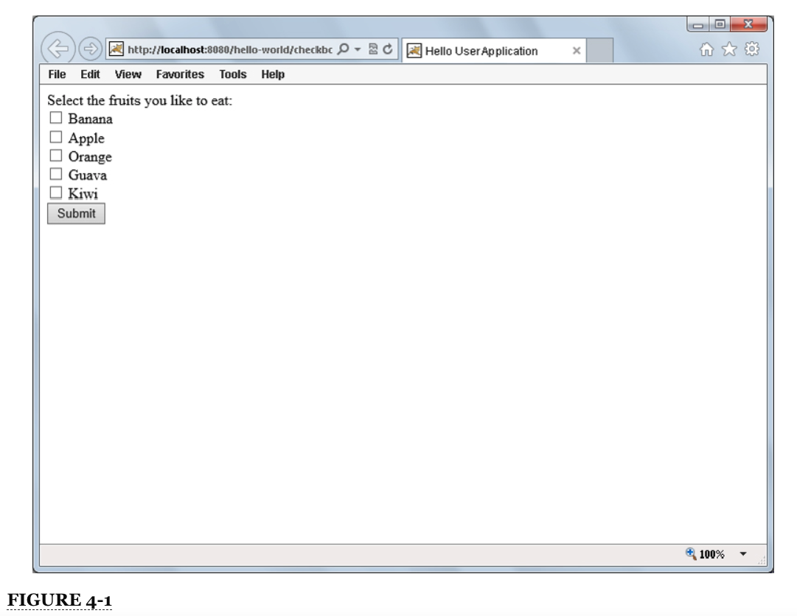

# Capítulo 4: Uso de JSP para mostrar contenido

* `<br/>` Es más fácil que `output.println("<br />")`
* Creando su primera JSP
* Uso de Java dentro de una JSP (y por qué no debería hacerlo)
* Combinando servlets y JSP
* Una nota sobre los documentos JSP (JSPX)
* Resumen

### EN ESTE CAPÍTULO

* Usar `<br/>` es más fácil que `output.println ("<br />")`
* Creando tu primera JSP
* Usar Java dentro de una JSP (y por qué no debería hacerlo)
* Combinando servlets y JSP
* Una nota sobre los documentos JSP (JSPX)

### DESCARGAS DEL CÓDIGO PARA ESTE CAPÍTULO

El código de este capítulo se divide en los siguientes ejemplos principales:

* Proyecto Hello-World-JSP
* Proyecto Hello-User-JSP
* Proyecto Customer-Support-v2

### DEPENDENCIAS DE NEW MAVEN PARA ESTE CAPÍTULO

Además de la dependencia de Maven presentada en el capítulo anterior, también necesitará las siguientes dependencias de Maven. Las exclusiones son necesarias porque la implementación de JSTL define dependencias transitorias en versiones anteriores de las especificaciones JSP y Servlet que tienen diferentes ID de artefactos Maven que las versiones actuales.

```html
      <dependency>
            <groupId>javax.servlet.jsp</groupId>
            <artifactId>javax.servlet.jsp-api</artifactId>
            <version>2.3.1</version>
            <scope>provided</scope>
        </dependency>
        
        <dependency>
            <groupId>javax.servlet.jsp.jstl</groupId>
            <artifactId>javax.servlet.jsp.jstl-api</artifactId>
            <version>1.2.1</version>
            <scope>compile</scope>
        </dependency>
        
        <dependency>
            <groupId>org.glassfish.web</groupId>
            <artifactId>javax.servlet.jsp.jstl</artifactId>
            <version>1.2.2</version>
            <scope>compile</scope>
            <exclusions>
                <exclusion>
                    <groupId>javax.servlet</groupId>
                    <artifactId>servlet-api</artifactId>
                </exclusion>
                <exclusion>
                    <groupId>javax.servlet.jsp</groupId>
                    <artifactId>jsp-api</artifactId>
                </exclusion>
                <exclusion>
                    <groupId>javax.servlet.jsp.jstl</groupId>
                    <artifactId>jstl-api</artifactId>
                </exclusion>
            </exclusions>
        </dependency>
```

En el último capítulo, aprendió acerca de los servlets y el manejo de solicitudes, respuestas, parámetros de solicitud, carga de archivos, configuración de servlets y más. Sin embargo, es posible que haya notado un inconveniente grave al escribir el código de Servlet para generar contenido HTML en la respuesta: llamar repetidamente a métodos en las clases `ServletOutputStream` o `PrintWriter` para generar el contenido y tener que poner contenido HTML dentro de los `Strings` de Java, lo que requiere escapar de las comillas , es un verdadero dolor. En este capítulo, explorará las páginas de JavaServer y cómo pueden hacer su vida mucho más fácil.

## `<BR />` ES MÁS FÁCIL QUE `OUTPUT.PRINTLN(“<BR />”)`

Java es un lenguaje poderoso. Tiene muchas capacidades y características que lo hacen útil, flexible y fácil de usar. Lo más probable es que estés leyendo este libro porque te gusta Java y quieres aprender a hacer más con él. Entonces, ¿qué pasa con esto?

```java
PrintWriter writer = response.getWriter();
writer.append("<!DOCTYPE html>\r\n")
      .append("<html>\r\n")
      .append("    <head>\r\n")
      .append("        <title>Hello World Application</title>\r\n")
      .append("    </head>\r\n")
      .append("    <body>\r\n")
      .append("        Nick says, \"Hello, World!\"\r\n")
      .append("    </body>\r\n");
      .append("</html>\r\n");
```

El número de formas en que esto es incómodo y engorroso es bastante largo. Se debe escribir mucho más código para lograr esto. Se necesita más espacio de archivo para almacenar el código. Se pierde tiempo escribiendo y probando el código. La verbosidad con finales de línea (`\r\n`) es necesaria para hacer que la fuente HTML sea legible en la opción View Source del navegador. Cualquier comilla que aparezca en el HTML debe tener un escape para que no termine prematuramente el literal `String`. Y, quizás uno de los peores problemas, los editores de código no pueden reconocer y validar fácilmente (en la mayoría de los casos, en absoluto) el código HTML dentro de `String` para indicarle si está haciendo algo mal. Seguro que hay una forma mejor. Después de todo, es solo un mensaje de texto. Si escribiera el ejemplo anterior en un archivo HTML simple, sería simple:

```html
<!DOCTYPE html>
<html>
    <head>
        <title>Hello World Application</title>
    </head>
    <body>
        Hello, World!
    </body>
</html>
```

Afortunadamente, los creadores de la especificación Java EE se dieron cuenta de que este sistema rápidamente se volvería difícil de manejar y diseñaron ***JavaServer Pages***, también conocidas como ***JSPs***, para responder a la necesidad.

#### POR QUÉ JSPS SON MEJORES

El problema con el ejemplo de código más reciente es que es un documento HTML estático. Puede haber sido más fácil de escribir y probablemente será infinitamente más fácil de mantener que el ejemplo escrito en Java, pero no tiene nada de dinámico. Las JSP son esencialmente una solución híbrida que combina código Java y etiquetas HTML. Las JSP pueden contener cualquier etiqueta HTML además del código Java, etiquetas JSP integradas (Capítulo 7), etiquetas JSP personalizadas (Capítulo 8) y algo llamado Lenguaje de expresión (Capítulo 5). Muchas de estas funciones las conocerá en capítulos posteriores.

En este capítulo, explorará las reglas básicas de las JSP y aprenderá sobre la sintaxis, directivas, declaraciones, scriptlets y expresiones de la tecnología JSP. También aprenderá sobre el ciclo de vida de una JSP y cómo se utiliza en última instancia para enviar una respuesta al usuario.

Existen alternativas a las JSP. Quizás la alternativa más común es ***Facelets***, parte de la tecnología más amplia de ***JavaServer Faces*** (o JSF para abreviar, lo que facilita su confusión con JSP). También existen marcos de trabajo de plantillas, como ***Velocity***, ***Freemarker***, ***SiteMesh*** y ***Tiles***, que, de alguna manera, complementan o reemplazan las características proporcionadas por JSP. Este libro no puede cubrir todas las opciones y variaciones de las tecnologías de presentación que funcionan con la especificación Servlet 3.1. Por tanto, se centrará en la tecnología más popular y utilizada.

El siguiente ejemplo, que puede encontrar en el archivo :computer: 01 `index.jsp` del proyecto **950-04-01-Hello-World-JSP**, recrea el proyecto **950-03-01-hello-world** del Capítulo 3, pero usa una JSP en lugar de un Servlet. para mostrar el saludo al usuario.

```html
<%@ page contentType="text/html;charset=UTF-8" language="java" %>
<!DOCTYPE html>
<html>
    <head>
        <title>Hello World Application</title>
    </head>
    <body>
        Hello, World!
    </body>
</html>
```

Este ejemplo es casi idéntico al ejemplo original solo en HTML anterior en la sección. El único código nuevo es la primera línea, resaltada en negrita. Esta es una de las varias directivas JSP que examinará con más detalle en la sección "Creación de su primera JSP". Esta directiva en particular establece el tipo de contenido y la codificación de caracteres de la página, algo que hizo anteriormente con las llamadas al método `setContentType` y `setCharacterEncoding` en `HttpServletResponse`. Todo lo demás en esta JSP es HTML simple, transmitido de vuelta al cliente como está en la respuesta. La pregunta interesante es: "¿Qué está pasando realmente detrás de escena?"

### QUÉ SUCEDE CON UNA JSP EN TIEMPO DE EJECUCIÓN

Un JSP es en realidad un servlet elegante. Quizás haya escuchado la frase "syntactic sugar". En última instancia, de una forma u otra, todos los lenguajes populares que los programadores utilizan hoy en día de forma habitual son azúcar sintáctico. Tome Java, por ejemplo, como un código con el que escribe. Cuando compila código Java, se convierte en código de bytes. Lo que importa es el código de bytes, no el código Java. De hecho, muchas declaraciones diferentes en Java pueden convertirse en códigos de bytes idénticos. Pero para ir un paso más allá, el código de bytes no es la representación final de un programa Java. Este código de bytes sigue siendo independiente de la plataforma, pero no es suficiente para ejecutarse en diferentes sistemas operativos.

Cuando Java se ejecuta en el JRE, el compilador Just In Time lo compila en código de máquina, que es específico de la plataforma en la que se ejecuta. En última instancia, es este código de máquina el que se ejecuta. Incluso los lenguajes de nivel inferior, como C, son simplemente azúcar sintáctico para el código de máquina en el que realmente se compilan. Las JSP son otra forma de azúcar sintáctica. En tiempo de ejecución, el compilador JSP interpreta el código JSP, que analiza todas las características especiales del código JSP y las traduce al código Java. La clase Java creada a partir de cada JSP implementa Servlet. Luego, el código Java pasa por el mismo ciclo que normalmente. Aún en tiempo de ejecución, se compila en código de bytes y luego en código de máquina. Finalmente, el JSP convertido en Servlet responde a las solicitudes como cualquier otro Servlet.

Para investigar esto, siga estos pasos:

1. Compile el proyecto Hello-World-JSP en su IDE, inicie su depurador y abra su navegador en http://localhost:8080/hello-world/. Debería ver el saludo familiar en su pantalla.

2. Examine su sistema de archivos hasta el directorio de inicio de Tomcat 8.0 (`C:\Program Files\Apache Software Foundation\Tomcat 8.0` en Windows) y vaya al directorio trabajo `work\Catalina\localhost\hello-world`. Tomcat coloca todas las JSP compiladas para la aplicación en este directorio, pero también deja atrás los archivos intermedios de Java que genera para que pueda inspeccionarlos y solucionar problemas con ellos.

3. Continúe bajando por más directorios hasta que encuentre el archivo `index_jsp.java`. Ábralo (no el archivo `index_jsp.class`) en su editor de texto favorito.

Lo que debería encontrar es una clase que amplíe `org.apache.jasper.runtime.HttpJspBase`. Esta clase abstracta se extiende, es posible que haya adivinado, `HttpServlet. HttpJspBase` proporciona alguna funcionalidad básica que será utilizada por todas las JSP que compila Tomcat, y cuando se ejecuta su JSP, finalmente se ejecuta el método `service` en ese Servlet, que finalmente ejecuta el método `_jspService`.

Si inspecciona el método `_jspService`, encontrará una serie de llamadas al método que escriben su HTML en el flujo de salida. Este código debería resultarle muy familiar porque no es tan diferente del código Java que reemplazó con esta JSP. Por supuesto, la clase JSP Servlet no se ve igual en todos los contenedores web. Las clases `org.apache.jasper`, por ejemplo, son clases específicas de Tomcat. Su JSP se compila de manera diferente en cada contenedor web diferente en el que lo ejecuta. El punto importante es que existe una especificación estándar para el comportamiento y la sintaxis de las JSP, y siempre que los contenedores web que utilice sean compatibles con la especificación, sus JSP deben ejecutarse de la misma manera en todas ellas, incluso si el código Java traducirse en looks completamente diferentes.

Las JSP, al igual que sus Servlets normales, también se pueden depurar en tiempo de ejecución. Para demostrar esto, coloque un punto de interrupción en la línea de su JSP que contenga "Hello, World" y luego actualice su navegador. En este punto, debería alcanzar el punto de interrupción en la JSP y debería notar algunas cosas. Primero, **¡puede alcanzar puntos de interrupción directamente dentro del código JSP!** No es necesario que coloque puntos de interrupción en la clase de servlet JSP traducida; Java, Tomcat y su IDE pueden hacer coincidir el punto de interrupción en JSP con el código que se ejecuta en el tiempo de ejecución. También debe notar que, aunque el punto de interrupción puede estar en el código JSP, el depurador claramente no lo está. La pila mostrará que su tiempo de ejecución se ha detenido dentro del método `_jspService`, y la ventana de variables le muestra todas las instancias y variables locales definidas dentro de ese alcance en la clase `index_jsp`.

**ADVERTENCIA** *IntelliJ IDEA tiene instalaciones de depuración JSP mucho mejores que Eclipse IDE. Si está utilizando Eclipse, es posible que no pueda o colocar un punto de interrupción en esta JSP. A partir de ahora, Eclipse solo le permite colocar puntos de interrupción en el código Java incrustado en sus JSP, mientras que IntelliJ permite puntos de interrupción en cualquier código JSP*.

Como todos los demás Servlets que se ejecutan en su contenedor web, las JSP tienen un ciclo de vida. En algunos contenedores web, como Tomcat, la JSP se traduce y compila justo a tiempo cuando llega la primera solicitud a esa JSP. Para solicitudes futuras, la JSP ya está compilada y lista para usarse. Esto, como puede imaginar, introduce algunos impactos en el rendimiento. Aunque el impacto en el rendimiento generalmente se produce solo en la primera solicitud, dejando que todas las solicitudes posteriores se ejecuten a una velocidad decente, esto aún no es deseado en algunos entornos de producción. Debido a esto, muchos contenedores web le brindan la opción de precompilar todas las JSP de una aplicación a medida que se implementa. Esto, por supuesto, ralentiza significativamente la implementación de aplicaciones grandes. Si tiene muchos miles de JSP, su aplicación podría tardar 10 minutos en implementarse en lugar de solo 1. Depende de la organización decidir qué configuración satisface mejor sus necesidades. Independientemente del momento de la compilación, después de que llegue la primera solicitud, se creará una instancia del JSP Servlet y se inicializará, y luego se podrá atender la primera solicitud.

En este punto, debe darse cuenta de que el código que escribe en su JSP finalmente se traduce a alguna versión del código que habría tenido que escribir de todos modos si no tuviera JSP. Entonces, ¿por qué, podría preguntarse, debería uno molestarse con las JSP? El hecho es que JSP es un formato de archivo mucho más fácil para producir marcas para mostrar en un navegador web que escribir código Java directo. Si esto puede mejorar la velocidad, la eficiencia y la precisión de su proceso de desarrollo, la pregunta en realidad es: "¿Por qué no utilizaría JSP?"

## CREANDO SU PRIMERA JSP

Ha explorado una JSP que ya fue escrita para usted, así que ahora trabaje en la creación de su propia JSP. Necesita saber algunas cosas sobre cómo están estructuradas las JSP y qué puede poner en las JSP. Repasa algunos de los conocimientos básicos necesarios en esta sección y luego profundiza un poco más en la siguiente.

### ENTENDIENDO LA ESTRUCTURA DEL ARCHIVO

En el capítulo anterior, exploró los servlets y respondió la pregunta: "¿Qué debe hacer en el método de servicio?" La respuesta fue que *debe* responder adecuadamente a la solicitud HTTP con una respuesta HTTP válida, pero debido a que `HttpServlet` se encarga de todo eso por usted, sus métodos `doGet` y `doPost` podrían ser literalmente métodos vacíos (por inútiles que sean). Resulta que la pregunta en este caso sigue siendo la misma. Hay muchas cosas que deben suceder cuando se ejecuta una JSP, pero todos esos "deberes" se manejan por usted.

Para demostrar esto, cree un archivo llamado :computer: 02 `blank.jsp` en la raíz web de un proyecto vacío; elimine todo su contenido (su IDE podría poner algún código allí para usted, elimínelo todo); y vuelva a implementar su proyecto. Alternativamente, simplemente use **950-04-01-Hello-World-JSP** que descargó, que ya contiene un `blank.jsp`. Cuando vas a http://localhost:8080/hello-world/blank.jsp, no obtienes ningún error. Todo funciona bien; acaba de obtener una página en blanco inútil. Ahora ingrese el siguiente código, vuelva a implementar y vuelva a cargar:

```html
<!DOCTYPE html>
<html>
    <head>
        <title>Hello World Application</title>
    </head>
    <body>
        Hello, World!
    </body>
</html>
```

Ahora hay una pequeña diferencia entre `blank.jsp` e `index.jsp`, ya que es la etiqueta especial que falta en la primera línea de `index.jsp`. Y, sin embargo, el contenido sigue siendo el mismo. Esto se debe a que las JSP tienen por defecto un tipo de contenido de `text/html` y una codificación de caracteres ISO-8859-1. Sin embargo, esta codificación de caracteres predeterminada es incompatible con muchos caracteres especiales, como los que se encuentran en idiomas distintos del inglés, lo que puede interferir con los esfuerzos por localizar su aplicación. Entonces, como mínimo, su JSP debe contener HTML para mostrárselo al usuario. Sin embargo, para asegurarse de que HTML se muestre correctamente en todos los navegadores en todos los sistemas en muchos idiomas, querrá incluir ciertas etiquetas JSP para controlar los datos enviados al cliente, como establecer la codificación de caracteres en UTF-8 de fácil localización. 

Se pueden usar varios tipos diferentes de etiquetas en JSP, y explorará más en la siguiente sección. Del tipo de etiqueta directiva, hay una que ya ha visto:

```html
<%@ page ... %>
```

Esta etiqueta de directiva le proporciona algunos controles sobre cómo se traduce, representa y transmite la JSP al cliente. En el ejemplo de `index.jsp`, la directiva de la página se ve así:

```html
<%@ page contentType="text/html;charset=UTF-8" language="java" %>
```

El atributo `language` le dice al contenedor qué lenguaje de scripting JSP usa este JSP. Un lenguaje de secuencias de comandos JSP (que no debe confundirse con los lenguajes de secuencias de comandos interpretados) es un lenguaje que se puede incrustar en una JSP para programar determinadas acciones. Actualmente, Java es el único lenguaje de secuencias de comandos compatible con JSP, pero este atributo lo deja abierto para su extensión algún día.

Técnicamente, puede omitir este atributo. Debido a que Java es el único lenguaje de secuencias de comandos JSP admitido y, además, Java es el predeterminado en la especificación, Java está implícito cuando falta este atributo. El atributo `contentType` le dice al contenedor el valor del encabezado `Content-Type` que debe enviarse junto con la respuesta. El encabezado `Content-Type` contiene tanto el tipo de contenido como la codificación de caracteres, separados por un punto y coma. Si recuerda haber leído el archivo `index_jsp.java`, contenía el Java al que se tradujo este atributo:

```html
response.setContentType("text/html;charset=UTF-8");
```

Cabe señalar que el fragmento de código anterior es el equivalente a las siguientes dos líneas de código, que vio en su proyecto **950-03-02-Hello-User** del Capítulo 3:

```html
response.setContentType("text/html");
response.setCharacterEncoding("UTF-8");
```

Y además, ambos son equivalentes a la siguiente línea de código:

```html
response.setHeader("Content-Type", "text/html;charset=UTF-8");
```

Como puede ver, hay varias formas de realizar la misma tarea. Los métodos `setContentType` y `setCharacterEncoding` son métodos prácticos. El método que utilice depende de usted; aunque, por lo general, debe elegir uno y atenerse a él para evitar confusiones. Sin embargo, como la mayor parte de su código de contenido a partir de ahora estará basado en JSP, lo que más le preocupará será el atributo `contentType` de la directiva de la página.

### DIRECTIVES, DECLARATIONS, SCRIPTLETS Y EXPRESSIONS

Además de las diversas etiquetas HTML y JSP que puede utilizar dentro de una JSP, existen varias estructuras únicas que definen una especie de lenguaje JSP. Son directivas, declaraciones, scriptlets y expresiones. En los términos más simples, se ven así:

```html
<%@ this is a directive %>
<%! This is a declaration %>
<% this is a scriptlet %>
<%= this is an expression %>
```

#### Usando Directives

Las directivas se utilizan para indicar al intérprete JSP que realice una acción (como establecer el tipo de contenido) o hacer una suposición sobre el archivo (como qué lenguaje de secuencias de comandos utiliza), para importar una clase, para incluir alguna otra JSP en el momento de la traducción. o para incluir una JSP tag library(biblioteca de etiquetas JSP).

#### Usando Declarations

Utiliza declaraciones para declarar algo dentro del alcance de su clase JSP Servlet. Por ejemplo, puede definir variables de instancia, métodos o clases dentro de una etiqueta de declaración. Debe recordar que todas estas declaraciones se realizan dentro de la clase JSP Servlet generada, por lo que cualquier clase que defina son en realidad clases internas de la clase JSP Servlet.

#### Usando Scriptlets

Como una declaración, un scriptlet también contiene código Java. Sin embargo, los scriptlets tienen un alcance diferente. Aunque el código dentro de una declaración se copia en el cuerpo de la clase JSP Servlet en el momento de la traducción y, por lo tanto, se debe usar para *declarar* algún campo, tipo o método, los scriptlets se copian en el cuerpo del método `_jspService` que analizó anteriormente. Cualquier variable local que esté dentro del alcance dentro de la ejecución de este método estará dentro del alcance dentro de sus scriptlets, y cualquier código que sea legal dentro de un cuerpo de método es legal dentro de un scriptlet. Entonces, puede definir variables locales, pero no campos de instancia. Puede usar declaraciones condicionales, manipular objetos y realizar operaciones aritméticas, todo lo que no puede hacer dentro de una declaración. Incluso puede definir clases (por extraño que parezca, pero es legal en Java tener definiciones de clase dentro de un método), pero las clases no tienen alcance fuera del método `_jspService`. Una clase, método o variable definida dentro de una declaración puede usarse dentro de un scriptlet, pero una clase o variable definida dentro de un scriptlet no puede usarse dentro de una declaración.

#### Usando Expressions

Las expresiones contienen código Java simple que devuelve algo que se puede escribir en la salida del cliente, y las expresiones envían la variable de retorno de ese código al cliente. Entonces, podría tener un cálculo aritmético dentro de una expresión porque eso da como resultado un valor numérico que se puede mostrar. Podría llamar a algún método que devuelva una Cadena o un número u otra primitiva porque eso da como resultado un valor devuelto visualizable. Esencialmente, cualquier código que pueda ser legalmente el lado derecho completo de una declaración de asignación se puede colocar dentro de una expresión. Las expresiones se ejecutan dentro del mismo ámbito de método que los scriptlets; es decir, las expresiones se copian en el método `_jspService` tal como lo hacen los scriptlets.

Eche un vistazo al siguiente código de ejemplo. En realidad, no hace nada útil, pero demuestra la variedad de cosas que puede hacer dentro de directivas, declaraciones, scriptlets y expresiones.

```html
<%@ page contentType="text/html;charset=UTF-8" language="java" %>
<%!
    private final int five = 0;
    
    protected String cowboy = "rodeo";
    
    //The assignment below is not declarative and is a syntax error if uncommented
    //cowboy = "test";
    
    public long addFive(long number)
    {
        return number + 5L;
    }
    
    public class MyInnerClass
    {
        
    }
    MyInnerClass instanceVariable = new MyInnerClass();
    
    //WeirdClassWithinMethod is in method scope, so the declaration below is
    // a syntax error if uncommented
    //WeirdClassWithinMethod bad = new WeirdClassWithinMethod();
%>
<%
    class WeirdClassWithinMethod
    {
        
    }
    WeirdClassWithinMethod weirdClass = new WeirdClassWithinMethod();
    MyInnerClass innerClass = new MyInnerClass();
    int seven;
    seven = 7;
%>
<%= "Hello, World" %><br />
<%= addFive(12L) %>
```

#### Poniendolo todo junto

Cree un archivo JSP llamado :computer: 03 `gibberish.jsp` en la raíz web de un proyecto vacío y coloque el código gibberish anterior allí (o simplemente use el JSP en el proyecto **904-04-01-Hello-World-JSP**). Compile y ejecute su aplicación y vaya a http://localhost:8080/hello-world/gibberish.jsp. Obviamente, esta página no es útil en el navegador; el punto que debe comprender está en el archivo fuente. Vuelva al directorio de trabajo de Tomcat y busque el archivo `gibberish_jsp.java`. Examine cómo se tradujo el código en su JSP al código Java en la clase JSP Servlet para comprender mejor los diferentes propósitos de las directivas, declaraciones, scriptlets y expresiones.

### COMENTAR SU CÓDIGO

Como casi todos los demás lenguajes o marcas existentes, JSP también tiene un método para comentar código. Hay cuatro formas diferentes de comentar el código dentro de una JSP:

* Comentarios XML
* Comentarios de la línea Java tradicional
* Comentarios de bloque tradicionales de Java
* Comentarios JSP.

El comentario XML (también conocido como comentario HTML) es una sintaxis con la que probablemente ya esté familiarizado:

```html
<!-- This is an HTML/XML comment -->
```

Este tipo de comentario se transmite al cliente porque es un marcado XML y HTML estándar. El navegador lo ignora, pero aparece en la fuente de la respuesta. Más importante aún, ***se evaluarán todas las etiquetas JSP incluidas en este comentario***. Es esencial recordar esto porque ***comentar el código con este estilo de comentario no impide que se ejecute el código Java interno***. Para demostrar esto, considere el siguiente ejemplo:

```html
<!-- This is an HTML/XML comment: <%= someObject.dumpInfo() %> -->
```

Si `someObject.dumpInfo()` devuelve "connections=5, errors=12, successes=3847", la respuesta enviada al navegador del cliente contendrá el siguiente comentario HTML:

```html
<!-- This is an HTML/XML comment: connections=5, errors=12, successes=3847 -->
```

Puede utilizar cualquier comentario legal de Java dentro de declaraciones y scriptlets en JSP. Esto incluye, como se mencionó anteriormente, comentarios de línea y comentarios de bloque. En el siguiente ejemplo, todo el código en negrita está comentado y no se evaluará:

```html
<%
    String hello = "Hello, World!"; // this is a comment
    //long test = 12L;
    /*int i = 0;
    int j = 12;*/
    String goodbye = "Goodbye, World!";
%>
```

El nuevo tipo de comentario que aún no ha utilizado es el comentario JSP. La sintaxis del comentario JSP se parece mucho a un comentario XML/HTML, siendo la única diferencia el signo de porcentaje en lugar del signo de exclamación al principio y el signo de porcentaje al final:

```html
<%-- This is a JSP comment --%>
```

Al igual que con el comentario XML/HTML, todo lo que esté entre el `<%--` y el `--%>` se considera comentado. No solo no se envía al navegador, el compilador JSP ni siquiera lo interpreta/traduce. Mientras que los tres tipos de comentarios cubiertos anteriormente aparecen en el archivo java JSP Servlet, este último tipo de comentario no. Para el traductor, ni siquiera existe. Esto es especialmente útil para comentar algún rango de código que incluye scriptlets JSP, expresiones, declaraciones, directivas y marcas que no desea que se evalúen o envíen al navegador.

### AÑADIR IMPORTACIONES A SU JSP

En Java, cuando usa una clase directamente, debe hacer referencia a ella usando su nombre de clase completamente calificado o debe incluir una declaración de importación en la parte superior del archivo de código Java. Las reglas son las mismas en las JSP. Cada vez que una JSP contiene código Java que utiliza una clase directamente, debe utilizar el nombre de clase completo o incluir una directiva de importación en el archivo JSP. Y así como todas las clases del paquete `java.lang` se importan implícitamente en archivos Java, de manera similar, todas las clases del paquete `java.lang` se importan implícitamente en archivos JSP.

Importar clases de Java en JSP es diferente, pero tan fácil como importar clases de Java en un archivo de código Java. Importar una o más clases es tan simple como agregar un atributo de importación a la directiva de página que aprendió anteriormente:

```html
<%@ page import="java.util.*,java.io.IOException" %>
```


En este ejemplo, usa una coma para separar varias importaciones y el resultado es que se importan la clase `java.io.IOException` y todos los miembros del paquete `java.util`. Por supuesto, no tiene que usar una directiva separada para importar clases. Puede combinar esto con el ejemplo visto anteriormente:

```html
<%@ page contentType="text/html;charset=UTF-8" language="java"
         import="java.util.*,java.io.IOException" %>
```

Tampoco es necesario combinar varias importaciones en una sola directiva con un separador de coma. Puede utilizar varias directivas para realizar esta tarea:

```html
<%@ page import="java.util.Map" %>
<%@ page import="java.util.List" %>
<%@ page import="java.io.IOException" %>
```

Algo a tener en cuenta al hacer esto es que cada etiqueta JSP que no genera salida, y también cada directiva, declaración y scriptlet, da como resultado una línea vacía que se envía al cliente. Entonces, si tiene muchas directivas de página para las importaciones seguidas de varias declaraciones y scriptlets, podría terminar con docenas de líneas en blanco en su salida. Para compensar esto, los desarrolladores de JSP a menudo encadenan el final de una etiqueta al comienzo de la siguiente:

```html
<%@ page import="java.util.Map"
%><%@ page import="java.util.List"
%><%@ page import="java.io.IOException" %>
```

Este ejemplo de código tiene exactamente el mismo resultado lógico que el ejemplo anterior, pero solo da como resultado una línea en blanco en la parte superior de la salida en lugar de tres. En la sección “Combinación de servlets y JSP”, aprenderá acerca de una configuración de deployment descriptor que recorta este espacio en blanco por completo.

### USO DE DIRECTIVAS

Anteriormente, conoció la directiva, una función JSP indicada con un comienzo `<%@` y un final con `%>`. Hay tres tipos diferentes de directivas, que se tratan en este momento.

#### Cambiar las propiedades de la página

Ya ha explorado algunas características de la directiva `page`, como los atributos `contentType`, `language` e `import`. También hay muchas más características de la directiva de página. Como se explicó anteriormente, la directiva de la página le proporciona algunos controles sobre cómo se traduce, representa y transmite el JSP al cliente. Estos son algunos de los otros atributos que pueden incluirse en esta directiva:

#### `pageEncoding`

Especifica la codificación de caracteres utilizada por su JSP y es equivalente a `setCharacterEncoding` en `HttpServletResponse`. En lugar de `contentType="text/html;charset=UTF-8"`, podría escribir `contentType="text/html" pageEncoding="UTF-8"`.

#### `session`

Debe ser `true` o `false`, e indica si la JSP participa en sesiones HTTP. De forma predeterminada, es verdadero, lo que le da acceso a la variable de sesión implícita en la JSP (tratada en la sección "Uso de Java dentro de una JSP (y por qué no debería)"). Si lo establece en `false`, no puede usar la variable `session` implícita. ***Si su aplicación no usa sesiones y desea mejorar el rendimiento, establecer esto en falso puede ser una buena idea***. Aprenderá más sobre las sesiones HTTP en el Capítulo 5.

#### `isELIgnored`

Este atributo especifica si el lenguaje de expresión (EL) se analiza y se traduce para esta JSP. Aprenderá más sobre EL en el Capítulo 6. Antes de la especificación JSP 2.0, el valor predeterminado era `true`, lo que significa que tenía que establecerlo en `false` para cada JSP en el que deseaba utilizar EL. A partir de JSP 2.0 (utiliza JSP 2.3 en este libro), el valor predeterminado es `false`, por lo que nunca debería tener que preocuparse por esta configuración.

#### `buffer` y `autoFlush`

Estos atributos están estrechamente relacionados y sus valores predeterminados son "8kb" y `true`, respectivamente. Controlan si la salida de la JSP se envía inmediatamente al navegador a medida que se genera o almacenados en búfer y enviados en lotes. El atributo `buffer` especifica el tamaño del búfer JSP o "none" (la salida no se almacenará en búfer), mientras que `autoFlush` indica si el búfer se vaciará automáticamente después de que alcance su límite de tamaño. Si `buffer se establece en "none" y `autoFlush` se establece en `false`, se produce una excepción cuando la JSP se traduce a Java. Si `autoFlush` se establece en `false` y el `buffer se llena, se produce una excepción. Esta es una forma práctica de garantizar que el contenido que genera una JSP no supere una determinada longitud.

Con `autoFlush` establecido a `true` (el valor predeterminado), cuanto más pequeño sea el búfer, más a menudo se descargarán los datos al cliente, y cuanto mayor sea el búfer, con menos frecuencia se descargarán los datos al cliente. Deshabilitar el búfer por completo con `buffer="none"` puede mejorar el rendimiento de sus JSP porque disminuye el consumo de memoria y la sobrecarga de la CPU. Sin embargo, esto no está exento de contratiempos. No usar búfer puede resultar en el envío de más paquetes al navegador, lo que puede aumentar marginalmente el consumo de ancho de banda. Además, cuando el primer carácter de la respuesta comienza a fluir hacia el cliente, los encabezados de respuesta HTTP deben confirmarse y enviarse antes de la respuesta. Debido a esto, no puede establecer encabezados de respuesta (`response.setHeader(...)`) o reenviar el JSP (`<jsp:forward />`) después de que el búfer se haya vaciado, y no puede establecer encabezados de respuesta o reenviar el JSP en absoluto en una JSP donde se ha inhabilitado el búfer. Este puede ser un sacrificio aceptable para mejorar el rendimiento del lado del servidor en determinadas circunstancias.

#### `errorPage`

Si ocurre un error durante la ejecución de la JSP, este atributo indica al contenedor a qué JSP debe reenviar la solicitud.

#### `isErrorPage`

Este atributo indica que esta JSP está sirviendo como una página de error (por defecto, es `false`). Si se establece en `true`, esto habilita la variable `exception` implícita en la página. Haría esto en las JSP a las que reenvía cuando ocurren errores, o que ha definido en el contenedor como JSP de manejo de errores.

#### `isThreadSafe` 

`true` por defecto, esto le dice al contenedor que la JSP puede atender de forma segura múltiples solicitudes simultáneamente. Si se cambia a `false`, el contenedor solo atiende solicitudes a esta JSP una por una. ***Una buena regla general es no cambiar esto nunca***. Recuerde: "Si su JSP no es seguro para subprocesos, lo está haciendo mal".

#### `extends`

Este atributo especifica de qué clase debe heredar su servlet JSP. Usar esto no es portátil de un contenedor web a otro y nunca debería ser necesario. Simplemente no lo hagas.

#### Otros atributos

En la mayoría de sus JSP, `contentType` (y opcionalmente `pageEncoding`) son los únicos atributos de la directiva `page` que cambiará de los valores predeterminados. Los atributos `session` e `isErrorPage` son probablemente los dos más comunes de los otros atributos. Ocasionalmente, es posible que deba deshabilitar el almacenamiento en búfer. Con cada JSP, debe evaluar sus opciones y decidir qué atributos deben cambiarse para adaptarse a las necesidades de su aplicación.

#### Incluyendo otras JSP

Incluir otras JSP en una JSP es fácil, pero hay algunas reglas y opciones interesantes a tener en cuenta. La primera herramienta que puede utilizar para incluir otra JSP en su JSP es la directiva include. Es sencillo:

```html
<%@ include file="/path/to/some/file.jsp" %>
```

El atributo `file` proporciona al contenedor la ruta al archivo JSP que debe incluirse. Si es absoluta, la ruta se resuelve desde la web root de la aplicación, por lo que un archivo llamado `included.jsp` en el directorio `WEB-INF` podría incluirse con la ruta `/WEB-INF/included.jsp`. Si la ruta es relativa, se resuelve desde el mismo directorio en el que existe la JSP incluida. La directiva `include` se evalúa en el momento de la traducción. Antes de que JSP se traduzca a Java, la directiva `include` se reemplaza (virtualmente) con el contenido del archivo JSP incluido. Después de que esto suceda, los contenidos combinados se traducen a Java y se compilan. Por lo tanto, como puede ver, este proceso es estático y solo ocurre una vez.

Para demostrar esto, siga estos pasos:

1. Cree un JSP llamado :computer: 04`includer.jsp` en la raíz web de su proyecto **904-04-01-Hello-World-JSP** y coloque la siguiente línea de código en él (eliminando cualquier código generado por su IDE). 

```html
<%@ include file="index.jsp" %>
```

2. Compile y depure su aplicación y navegue hasta http://localhost:8080/hello-world/includer.jsp en su navegador favorito. Debería ver una página que ya nos es familiar, lo que significa que su inclusión ha funcionado.

3. Ahora vaya al directorio de trabajo de Tomcat y abra el archivo `includer_jsp.java` que creó Tomcat. Debería notar inmediatamente que, además del nombre de la clase, es idéntico a `index_jsp.java`. Esto se debe a que la JSP se incluyó de forma estática en el momento de la traducción.

Hay una forma diferente de incluir otras JSP que da como resultado una inclusión dinámica (tiempo de ejecución) en lugar de una inclusión estática (tiempo de traducción). Utiliza la etiqueta `<jsp:include>` para lograr esto:

```html
<jsp:include page="/path/to/some/page.jsp" />
```

La etiqueta `<jsp:include>` no tiene un atributo `file`; tiene un atributo `page`. La ruta sigue siendo relativa al archivo actual o absoluta desde la raíz web, al igual que con la directiva `include`. Pero no está incluido en el momento de la traducción. En cambio, el archivo incluido se compila por separado. En tiempo de ejecución, la solicitud se reenvía temporalmente a la JSP incluida, la salida resultante de esa JSP se escribe en la respuesta y luego el control vuelve a la JSP incluida. Esto se puede ver fácilmente creando un archivo llamado ;computer: 05 `dynamicIncluder.jsp` en la raíz web de tu proyecto con la siguiente línea de código (o usa el proyecto **904-04-01-Hello-World-JSP**):

```html
<jsp:include page="index.jsp" />
```

Compile y depure nuevamente y navegue a http://localhost:8080/hello-world/dynamicIncluder.jsp, luego abra el archivo `dynamicIncluder_jsp.java` que creó Tomcat. Ahora puede ver que el contenido de este archivo Java es bastante diferente. La línea más interesante del archivo es:

```html
org.apache.jasper.runtime.JspRuntimeLibrary.include(request, response, "index.jsp", out, false);
```

Esto envía la solicitud y la respuesta a otro método, que ejecuta el JSP incluido, escribe su contenido en la respuesta y regresa.

Ambos métodos de inclusión tienen sus puntos fuertes y débiles. La directiva `include` es rápida porque se evalúa solo una vez, y todas las variables definidas en la JSP incluida están dentro del alcance y pueden ser referenciadas por la JSP incluida. Pero este método hace que su JSP (y el método `_jspService`, como resultado) sea más largo, lo cual es importante tener en cuenta porque el código de bytes de **los métodos Java compilados no puede tener más de 65 534 bytes**. La etiqueta `<jsp:include>` no causa este problema, pero tampoco funciona tan bien porque debe evaluarse cada carga de página, y las variables definidas en el JSP incluido están fuera del alcance y no se pueden usar en el JSP incluido. En última instancia, debe decidir cuál es el apropiado cada vez que necesite incluir un archivo, pero en ***la mayoría de los casos, la directiva `include` es una buena opción***.

**NOTA** *De forma predeterminada, los contenedores web traducen y compilan archivos que terminan en `.jsp` y `.jspx` (que conocerá más adelante) como JSP. Es posible que también haya visto la extensión `.jspf`. Los archivos JSPF generalmente se denominan Fragmentos JSP y no los compila el contenedor web. Aunque no existen reglas estrictas que rijan los archivos JSPF (técnicamente, puede configurar la mayoría de los contenedores web para compilarlos si lo desea), existen algunas mejores prácticas acordadas. Los archivos JSPF representan fragmentos de JSP que no pueden ser independientes y que siempre deben incluirse, no se debe acceder a ellos directamente. Por eso, los contenedores web normalmente no los compilan. De hecho, en muchos casos, un archivo JSPF hace referencia a variables que solo pueden existir si se incluyen en otro archivo JSP. Por esta razón, **los archivos JSPF deben incluirse solo utilizando la directiva include porque las variables definidas en el JSP incluido deben estar dentro del alcance del JSP incluido***.

#### Incluyendo Tag Libraries

Los capítulos 7 y 8 hablan más sobre las bibliotecas de etiquetas, pero ahora se mencionan debido a cómo están incluidas. Utiliza la directiva `taglib` para hacer referencia a una biblioteca de etiquetas de modo que pueda usar las etiquetas definidas por esa biblioteca de etiquetas en su JSP. Al igual que la directiva `include`, la directiva `taglib` es bastante simple:

```html
<%@ taglib uri="http://java.sun.com/jsp/jstl/core" prefix="c" %>
```

El atributo `uri` especifica el espacio de nombres URI en el que se define la biblioteca de etiquetas, y el atributo de prefijo define el alias con el que hace referencia a las etiquetas en esa biblioteca. Aprenderá más sobre lo que esto significa en el Capítulo 7.

### USO DE LA ETIQUETA <JSP>

Todas las JSP admiten un tipo especial de etiqueta con un prefijo XMLNS de `jsp`. Esta etiqueta tiene muchos usos y características. La mayoría de las características se utilizan en documentos JSP (versiones XML de JSP que conocerá en la última sección de este capítulo) o reliquias de versiones anteriores de JSP en las que algunas cosas eran mucho más difíciles de hacer que ahora (y también lo son). no cubierto aquí). Sin embargo, debería conocer algunas funciones útiles de esta etiqueta.

Ya ha aprendido sobre `<jsp:include>` y en qué se diferencia de la directiva `include`. Una etiqueta similar es la etiqueta `<jsp:forward>`. Esto le permite reenviar una solicitud desde la JSP que se está ejecutando actualmente a alguna otra JSP. A diferencia de `<jsp:include>`, ***la solicitud no vuelve a la JSP original***. Esto no es una redirección; el navegador del cliente no ve el cambio. Además, todo lo que JSP escribe en la respuesta permanece en la respuesta cuando se produce el reenvío(forward); no se borra, como lo haría con una redirección. Usar la etiqueta `<jsp:forward>` es simple:

```html
<jsp:forward page="/some/other/page.jsp" />
```

En este ejemplo, la solicitud se reenvía internamente a `/some/other/page.jsp`. Cualquier contenido de respuesta generado antes de la etiqueta todavía se envía al navegador del cliente. Cualquier código que venga después de la etiqueta se ignora y no se evalúa. Así es como esta etiqueta se diferencia de la etiqueta `<jsp:include>`. Si el código después de la etiqueta `<jsp:forward>` no fuera ignorado, esta etiqueta se comportaría como la etiqueta `<jsp:include>`.

Otras tres etiquetas relacionadas son `<jsp:useBean>`, `<jsp:getProperty>` y `<jsp:setProperty>`. La etiqueta `<jsp:useBean>` declara la presencia de un JavaBean en la página, mientras que `<jsp:getProperty>` recupera propiedades (usando métodos getter) de beans declarados con <jsp: useBean>. De manera similar, <jsp: setProperty> establece propiedades (usando métodos setter). Un bean Java en este caso es cualquier objeto instanciado.`<jsp:useBean>` instancia una clase para crear un bean, y luego se puede acceder a este bean utilizando las otras dos etiquetas de bean, etiquetas personalizadas y scriptlets y expresiones JSP. ***La ventaja de declarar un bean de esta forma es que hace que el bean esté disponible para otras etiquetas JSP; si simplemente declarara el bean en un scriptlet, solo estaría disponible para scriptlets y expresiones***.

Finalmente, está la etiqueta `<jsp:plugin>`, que es una herramienta útil para incrustar Applets de Java en el HTML renderizado. Esta etiqueta elimina el riesgo de estropear la estructura cuidadosa de las etiquetas `<object>` y `<embed>` necesarias para que los applets de Java funcionen en todos los navegadores. Maneja la creación de estas etiquetas HTML para que el Applet funcione en todos los navegadores convencionales que admiten el complemento Java. A continuación, se muestra un ejemplo del uso de la etiqueta `<jsp:plugin>`:

```html
<jsp:plugin type="applet" code="MyApplet.class" jreversion="1.8">
    <jsp:params>
        <jsp:param name="appletParam1" value="paramValue1"/>
    </jsp:params>
    <jsp:fallback>
        The browser you are using does not support Java Applets. You might
        consider switching browsers.
    </jsp:fallback>
</jsp:plugin>
```

Tenga en cuenta que `<jsp:plugin>` también puede contener atributos estándar HTML object/embed, como `name`, `align`, `height`, `width`, `hspace` y `vspace`. Estos atributos se copian en el marcado HTML.

**NOTA** *Los Java Applets son un tema completamente diferente de las aplicaciones web y están fuera del alcance de este libro. Si desea obtener más información sobre los applets de Java, la mayoría de los libros de Java para principiantes cubren el tema*.


## USANDO JAVA DENTRO DE UNA JSP (¡Y POR QUÉ NO DEBE USTED!)

En esta sección, explorará un poco más el uso de Java dentro de una JSP reemplazando el Servlet en el proyecto Hello-User (del capítulo anterior) con solo una JSP. Luego, considera brevemente por qué se desaconseja el uso de Java en una JSP (y por qué existe realmente una configuración de descriptor de implementación para deshabilitarlo). Para el resto de esta sección, utiliza el proyecto Hello-User-JSP en el sitio de descarga de wrox.com.

### USANDO LAS VARIABLES IMPLÍCITAS EN UNA JSP

Los archivos JSP tienen varias variables implícitas (objetos) disponibles para su uso dentro de scriptlets y expresiones en JSP. Se consideran implícitos porque no tiene que definirlos ni declararlos en ninguna parte de su código. La especificación JSP requiere que el traductor y el compilador de JSP proporcionen estas variables, con los nombres exactos especificados. Las variables tienen alcance de método. Se definen al principio del método Servlet en el que se ejecuta JSP (en Tomcat 8.0, el método `_jspService`). Esto significa que no puede usarlos dentro de ningún código que coloque dentro de las declaraciones JSP. Las declaraciones tienen alcance de clase. Debido a que las variables implícitas están dentro del alcance solo dentro del método en el que se ejecuta JSP, el código dentro de las declaraciones no puede usarlas. Puede ver un ejemplo de cómo se definen las variables implícitas observando el método `_jspService` de cualquiera de las JSP compiladas previamente que examinó en el último sección:

```java
public void _jspService(final javax.servlet.http.HttpServletRequest request,
                            final javax.servlet.http.HttpServletResponse response)
            throws java.io.IOException, javax.servlet.ServletException
    {
        final javax.servlet.jsp.PageContext pageContext;
        javax.servlet.http.HttpSession session = null;
        final javax.servlet.ServletContext application;
        final javax.servlet.ServletConfig config;
        javax.servlet.jsp.JspWriter out = null;
        final java.lang.Object page = this;
        javax.servlet.jsp.JspWriter _jspx_out = null;
        javax.servlet.jsp.PageContext _jspx_page_context = null;
 
        try {
            response.setContentType("text/html;charset=UTF-8");
            pageContext = _jspxFactory.getPageContext(this, request, response,
                    null, true, 8192, true);
            _jspx_page_context = pageContext;
            application = pageContext.getServletContext();
            config = pageContext.getServletConfig();
            session = pageContext.getSession();
            out = pageContext.getOut();
            _jspx_out = out;
            ...
        }
        ...
    }
```

El código no es exactamente la imagen de un código limpio, pero las partes importantes del código están en negrita para que pueda comprender lo que está sucediendo. El código en negrita enfatiza la declaración o asignación (o ambas) de variables implícitas requeridas por la especificación JSP. Las variables que no están en negrita (como `_jspx_out` o `_jspx_page_context`) son variables específicas de Tomcat que no se garantiza que existan y nunca deben usarse en su JSP. En este código hay ocho variables implícitas, pero la especificación JSP define nueve variables implícitas. Ahora eche un vistazo a cada una de estas variables implícitas y comprenderá por qué falta una.

#### `request` y `response`

La variable `request` es una instancia de `HttpServletRequest` y la variable `response` es una instancia de `HttpServletResponse`, de las cuales aprendió en detalle en el Capítulo 3. Cualquier cosa que pueda hacer con una solicitud en un Servlet también puede hacer en una JSP, incluida la obtención solicitar parámetros, obtener y establecer atributos, e incluso leer del cuerpo de la respuesta. Aquí se aplican las mismas reglas que aprendió en el capítulo anterior. Sin embargo, existen algunas restricciones sobre lo que puede hacer con el objeto de respuesta en una JSP. Estas restricciones no son restricciones de contrato, por lo que no se aplican en el momento de la compilación. En cambio, se aplican en tiempo de ejecución porque violarlos podría provocar un comportamiento inesperado o incluso errores. Por ejemplo, no debe llamar a `getWriter` o `getOutputStream` porque el JSP ya está escribiendo en la salida de respuesta. Tampoco debe establecer el tipo de contenido o la codificación de caracteres, vaciar o restablecer el búfer o cambiar el tamaño del búfer. Estas son todas las cosas que hace JSP, y si su código también las hace, puede causar problemas.

#### `session`

Esta variable es una instancia de `HttpSession`. Aprenderá más sobre las sesiones en el siguiente capítulo. Recuerde de la sección anterior que la directiva de página tiene un atributo de sesión que por defecto es verdadero. Es por eso que la variable de sesión está disponible en el ejemplo de código anterior y estará disponible de forma predeterminada en todas sus JSP. Si establece el atributo de sesión de la directiva de página en falso, la variable de sesión en la JSP no está definida y no se puede utilizar.

#### `out`

`JspWriter` instancia `out` está disponible para que la use en todas sus JSP. Es un `Writer`, como lo que se obtiene al llamar al método `getWriter` en `HttpServletResponse`. Si por alguna razón necesita escribir directamente en la respuesta, debe usar la variable `out`. Sin embargo, en la mayoría de los casos, simplemente puede usar una expresión o escribir texto o contenido HTML en la JSP.

#### `application`

Esta es una instancia de la interfaz `ServletContext`. Recuerde del Capítulo 3 que esta interfaz le da acceso a la configuración de la aplicación web como un todo, incluidos todos los parámetros de inicio de contexto. Por qué esta variable se denominó `application` en lugar de `context` o `servletContext` es un misterio.

#### `config`

La variable `config` es una instancia de la interfaz `ServletConfig`. A diferencia de la variable `application`, su nombre en realidad refleja lo que es. Como aprendió en el Capítulo 3, puede usar este objeto para acceder a la configuración del JSP Servlet, tales como los parámetros init del Servlet.

#### `pageContext`

Este objeto, una instancia de la clase `PageContext`, proporciona varios métodos convenientes para obtener atributos de solicitud y atributos de sesión, acceder a la solicitud y respuesta, incluidos otros archivos, y reenviar la solicitud. Probablemente nunca necesitará usar esta clase dentro de una JSP. Sin embargo, será útil cuando escriba etiquetas JSP personalizadas en el Capítulo 8.

#### `page`

La variable `page` es un objeto interesante de examinar. Es una instancia de `java.lang.Object`, que inicialmente hace que parezca inútil. Sin embargo, es esencialmente la variable `this` del objeto JSP Servlet. Por lo tanto, puede convertirlo en Servlet y usar métodos definidos en la interfaz de Servlet. También es un `javax.servlet.jsp.JspPage` (que extiende Servlet) y un `javax.servlet.jsp.HttpJspPage` (que extiende JspPage), por lo que puede convertirlo en cualquiera de esos y usar métodos definidos en esas interfaces. En realidad, probablemente nunca tendrá una razón para usar esta variable. Puede resultar útil si alguna vez se admiten otros lenguajes de secuencias de comandos JSP. Sin embargo, la especificación JSP 2.3, sección 1.8.3 nota "a", dice que la página es siempre un sinónimo de esto cuando el lenguaje de programación es Java. Por lo tanto, cualquier cosa que pueda hacer con la página (como obtener el nombre del Servlet o los métodos de acceso o las variables de instancia que definió en una declaración JSP) también puede hacer con esto.

#### exception

Esta es la variable que faltaba en el ejemplo de código anterior. Recuerde de la sección anterior que puede especificar como verdadero el atributo `isErrorPage` en la directiva `page` para indicar que el propósito de JSP es manejar errores. Si lo hace, la variable `exception` estará disponible para su uso dentro de la JSP. Debido a que el valor predeterminado para `isErrorPage` es `false` y no lo ha usado en ninguna parte, la variable de excepción no se ha definido en ninguna JSP que haya creado. Si crea una JSP con `isErrorPage` establecido con `true`, la variable `exception` implícita, `Throwable`, se define automáticamente.

**NOTA**
<hr>
Puede leer el documento de especificación de JavaServer Pages 2.3 en la página de especificación JSP.
<hr>

#### Probar las variables implícitas

Ahora que comprende las variables implícitas disponibles y sus propósitos, debería explorar esto más escribiendo código JSP que use las variables implícitas. En su proyecto **950-04-02-Hello-User-JSP**, cree un archivo :computer: 01 `greeting.jsp` en la raíz web y coloque el siguiente código en él:

```java
<%@ page contentType="text/html;charset=UTF-8" language="java" %>
<%!
    private static final String DEFAULT_USER = "Guest";
%>
<%
    String user = request.getParameter("user");
    if(user == null)
        user = DEFAULT_USER;
%>
<!DOCTYPE html>
<html>
    <head>
        <title>Hello User Application</title>
    </head>
    <body>
        Hello, <%= user %>!<br /><br />
        <form action="greeting.jsp" method="POST">
            Enter your name:<br />
            <input type="text" name="user" /><br />
            <input type="submit" value="Submit" />
        </form>
    </body>
</html>
```

Compare esto con el código que escribió en `HelloServlet.java` para el proyecto **950-03-02-Hello-User** en el capítulo anterior. Hay mucho menos, pero logra lo mismo. Observe el uso de una declaración para definir la variable `DEFAULT_USER`, un scriptlet para buscar el parámetro de solicitud `user` y predeterminado si no está configurado, y una `expression` para generar el valor de la variable `user`. Ahora compile y depure este código y vaya a http://localhost:8080/hello-world/greeting.jsp en su navegador. Intente ingresar un nombre en el campo de entrada y haga clic en el botón Submit: la variable post se detecta y se usa. Ahora intente ir a http://localhost:8080/hello-world/greeting.jsp?user=Allison, y debería ver que el parámetro query también se detecta y se usa. Se le anima a explorar el código Java al que Tomcat tradujo su JSP.

Otra cosa que hizo en el proyecto **950-03-02-Hello-User** fue crear un servlet para demostrar el uso de parámetros de valor múltiple. Esto también se puede replicar mediante JSP. Cree un archivo en la raíz web de su proyecto llamado :computer: 02 `checkboxes.jsp` (o use el proyecto **950-04-02-Hello-User-JSP**):

```html
<%@ page contentType="text/html;charset=UTF-8" language="java" %>
<!DOCTYPE html>
<html>
    <head>
        <title>Hello User Application</title>
    </head>
    <body>
        <form action="checkboxesSubmit.jsp" method="POST">
            Select the fruits you like to eat:<br />
            <input type="checkbox" name="fruit" value="Banana" /> Banana<br />
            <input type="checkbox" name="fruit" value="Apple" /> Apple<br />
            <input type="checkbox" name="fruit" value="Orange" /> Orange<br />
            <input type="checkbox" name="fruit" value="Guava" /> Guava<br />
            <input type="checkbox" name="fruit" value="Kiwi" /> Kiwi<br />
            <input type="submit" value="Submit" />
        </form>
    </body>
</html>
```

Este archivo replica la salida del método `doGet` en el archivo `MultiValueParameterServlet.java` del proyecto **950-03-02-Hello-User**. A continuación, cree `checkboxesSubmit.jsp` (también en el proyecto **950-04-02-Hello-User-JSP**):

```html
<%@ page contentType="text/html;charset=UTF-8" language="java" %>
<%
    String[] fruits = request.getParameterValues("fruit");
%>
<!DOCTYPE html>
<html>
    <head>
        <title>Hello User Application</title>
    </head>
    <body>
        <h2>Your Selections</h2>
        <%
            if(fruits == null)
            {
        %>You did not select any fruits.<%
            }
            else
            {
        %><ul><%
                for(String fruit : fruits)
                {
                    out.println("<li>" + fruit + "</li>");
                }
        %></ul><%
            }
        %>
    </body>
</html>
```

Este archivo replica la lógica y la salida del método `doPost` de la clase `MultiValueParameterServlet`. Observe cómo el código en negrita entra y sale de los scriptlets, utilizando Java solo donde los requisitos lógicos lo exigen y dejando que los scriptlets utilicen la salida directa en lugar de escribir con la variable de salida implícita. La excepción está dentro del ciclo `for`, que demuestra un caso de uso para la variable `out`. Esto podría haberse reemplazado fácilmente con `%><li><%= fruit %></li><%` para lograr lo mismo. Ahora compile y depure el proyecto y vaya a http://localhost:8080/hello-world/checkboxes.jsp en su navegador. Debería ver una página como la de la Figura 4-1. Experimente con diferentes combinaciones de casillas de verificación y verifique que se comporte de manera idéntica al proyecto **950-03-02-Hello-User** en el Capítulo 3. Intente reemplazar el uso de out en el ciclo `for` con `%><li><%= fruit %></li><%`. Cuando recompile y ejecute el proyecto nuevamente, la salida no debería cambiar.



Finalmente, cree un archivo llamado `contextParameters.jsp` para explorar el uso de la variable implícita `application` y la recuperación de los parámetros de inicio de contexto. Alternativamente, use el archivo que ya está en el proyecto **950-04-02-Hello-User-JSP**.

```html
<%@ page contentType="text/html;charset=UTF-8" language="java" %>
<!DOCTYPE html>
<html>
    <head>
        <title>Hello User Application</title>
    </head>
    <body>
        settingOne: <%= application.getInitParameter("settingOne") %>,
        settingTwo: <%= application.getInitParameter("settingTwo") %>
    </body>
</html>
```

Además, debe tener algunos parámetros de inicio de contexto definidos en su descriptor de implementación, como en el Capítulo 3:

```html
    <context-param>
        <param-name>settingOne</param-name>
        <param-value>foo</param-value>
    </context-param>
    <context-param>
        <param-name>settingTwo</param-name>
        <param-value>bar</param-value>
    </context-param>
```
Ahora compile, depure y navegue hasta http://localhost:8080/hello-world/contextParameters.jsp. Al igual que con el proyecto **950-03-02-Hello-User** basado en Servlet, debería ver los valores de los parámetros de inicio de contexto.

### POR QUÉ NO DEBE USAR JAVA EN UNA JSP

Hay muchas ventajas en el uso de Java dentro de una JSP y, además de los usos señalados anteriormente en este capítulo, es probable que esté pensando en otros usos al leer este párrafo. Lo mejor de usar Java en una JSP es que casi todo lo que puede hacer en una clase Java normal lo puede hacer en una JSP. Sin embargo, uno de los mayores peligros de usar Java en una JSP es que casi todo lo que puede hacer en una clase Java normal lo puede hacer en una JSP. Estas frases pueden parecer una locura, pero es verdad. Piense en todas las cosas que puede hacer con el código Java. Aquí hay algunos que le ayudarán.

Puede conectarse, consultar y manipular una base de datos relacional (o una base de datos NoSQL, según sea el caso). También puede acceder y escribir archivos en el sistema de archivos del servidor. Puede conectarse a servidores remotos, realizar transacciones de servicios web REST e interactuar con los periféricos del sistema. Incluso podría hacer algunos cálculos numéricos, ordenar un árbol binario con mil millones de nodos, recorrer un gran conjunto de datos en busca de datos sospechosos o buscar un modelo de objetos de documento para un conjunto particular de nodos. Ahora levante la mano si cree que alguna de estas cosas son buenas ideas en una JSP.

Java es un lenguaje poderoso, y el problema de tener todo ese poder al alcance de la mano es que es muy difícil no usarlo. Dependiendo de la aplicación, cualquiera de esas tareas pueden ser tareas que deba realizar dentro de una aplicación web. Pero considere esto: en una aplicación limpiamente estructurada, ¿sería apropiado poner todo el acceso a la base de datos, la manipulación de archivos y el código de procesamiento de números en una sola clase? Probablemente no. Lo más probable es que tenga varias clases que realicen funciones especializadas y luego use esas clases donde sea necesario. JavaServer Pages es una tecnología que fue diseñada para la capa de presentación, también conocida como vista. Aunque es posible mezclar el acceso a la base de datos con la capa de presentación, o mezclar el procesamiento de números con la capa de presentación, no es una buena idea. Los lenguajes funcionales, los lenguajes de secuencias de comandos y otros lenguajes que se ejecutan desde la parte superior de un archivo hasta la parte inferior de un archivo, como PHP, ciertamente tienen sus usos. Pero es probable que no eligió Java como su plataforma de elección para poder crear páginas escritas de esta manera. Lo más probable es que haya elegido Java por su elegancia, tipado fuerte y estructura estricta orientada a objetos, entre otras razones.

Además, en la mayoría de las organizaciones, los desarrolladores de interfaces de usuario son responsables de crear la capa de presentación. Estos desarrolladores rara vez tienen experiencia en escribir código Java y proporcionarles esa capacidad puede ser peligroso. En cambio, a menudo tiene sentido proporcionarles un conjunto de herramientas menos poderosas con las que trabajar.

En una aplicación bien estructurada y codificada de forma limpia, la capa de presentación está separada de la lógica empresarial, que también está separada de la capa de persistencia de datos. De hecho, es posible crear JSP que muestren contenido dinámico sin una sola línea de Java dentro de JSP. Esto permite a los desarrolladores de aplicaciones concentrarse en la lógica empresarial y de datos mientras los desarrolladores de interfaces de usuario trabajan en las JSP. Quizás se pregunte cómo es posible esto, pero no se sentirá decepcionado. Aprenderá el primer paso en la siguiente sección y explorará tecnologías JSP aún más potentes en los capítulos 6, 7 y 8.

## COMBINACIÓN DE SERVLETS Y JSPS

Para el resto de este capítulo, mejorará la aplicación de soporte al cliente en la que comenzó a trabajar en el Capítulo 3. Puede seguir los ejemplos y encontrar el código fuente completo en el proyecto **950-04-03-Customer-Support-v2**. Cuando se trata de lógica compleja, validación de datos, persistencia de datos y una capa de presentación detallada, tiene más sentido utilizar una combinación de Servlets y JSP en lugar de utilizar exclusivamente uno u otro. En esta sección, separará la lógica empresarial de la atención al cliente de la capa de presentación.

### CONFIGURACIÓN DE LAS PROPIEDADES JSP EN EL DESCRIPTOR DE DESPLIEGUE

Anteriormente en el capítulo, aprendió sobre la directiva `page` y los muchos atributos que proporciona para permitirle personalizar cómo se traduce, compila y procesa su JSP. Sin embargo, si tiene muchas JSP con propiedades similares, puede resultar complicado colocar esta directiva de página en la parte superior de cada archivo JSP. Afortunadamente, existe una forma de configurar propiedades JSP comunes dentro del deployment descriptor. En el archivo `web.xml`, que debería estar vacío excepto por el <display-name>, agregue el siguiente contenido:

```html
    <jsp-config>
        <jsp-property-group>
            <url-pattern>*.jsp</url-pattern>
            <url-pattern>*.jspf</url-pattern>
            <page-encoding>UTF-8</page-encoding>
            <scripting-invalid>false</scripting-invalid>
            <include-prelude>/WEB-INF/jsp/base.jspf</include-prelude>
            <trim-directive-whitespaces>true</trim-directive-whitespaces>
            <default-content-type>text/html</default-content-type>
        </jsp-property-group>
    </jsp-config>
```

#### Comprensión de los JSP Property Groups

La etiqueta `<jsp-config>` contiene cualquier número de etiquetas `<jsp-property-group>`. Estos grupos de propiedades se utilizan para diferenciar propiedades para diferentes grupos de JSP. Por ejemplo, es posible que desee definir un conjunto de propiedades comunes para todas las JSP en la carpeta `/WEB-INF/jsp/admin` y un conjunto diferente de propiedades comunes para todas las JSP en la carpeta `/WEB-INF/jsp/help `. Puede diferenciar estos grupos de propiedades definiendo etiquetas `<url-pattern>` distintas para cada `<jsp-property-group>`. En el ejemplo de código anterior, las etiquetas `<url-pattern>` indican que este grupo de propiedades se aplica a todos los archivos que terminan en `.jsp` y `.jspf`, en cualquier lugar de la aplicación web. Si desea tratar las JSP en una carpeta de manera diferente a las JSP en otra de la manera mencionada anteriormente, podría tener dos (o más) etiquetas `<jsp-property-group>`, una de las cuales tiene `<url-pattern>/WEB-INF/jsp/admin/*.jsp</url-pattern>` y el otro tiene `<url-pattern>/WEB-INF/jsp/help/*.jsp</url-pattern>`.

Considere algunas reglas importantes al tratar con la etiqueta `<url-pattern>`:

* Si algún archivo en sus aplicaciones coincide con un `<url-pattern>` tanto en un `<servlet-mapping>` como en un grupo de propiedades JSP, la coincidencia más específica gana. Por ejemplo, si un `<url-pattern>` coincidente fuera `*.jsp` y el otro fuera `/WEB-INF/jsp/admin/*.jsp`, el que tenga `/WEB-INF/jsp/admin/*.jsp` ganaría. Si las etiquetas `<url-pattern>` son idénticas, el grupo de propiedades JSP gana sobre el mapping del servlet.

* Si algún archivo coincide con un `<url-pattern>` en más de un grupo de propiedades JSP, gana la coincidencia más específica. Si dos o más coincidencias más específicas son idénticas, gana el primer grupo de propiedades JSP coincidente en el orden en que aparece en el descriptor de implementación.

* Si algún archivo coincide con un `<url-pattern>` en más de un grupo de propiedades JSP y más de uno de esos grupos de propiedades contiene reglas `<include-prelude>` o `<include-coda>`, se aplican las reglas de inclusión de todos los grupos de propiedades JSP para ese archivo, aunque solo uno de los grupos de propiedades se utiliza para las otras propiedades.

Para comprender ese último punto, considere los siguientes grupos de propiedades hipotéticos:

```html
        <jsp-property-group>
            <url-pattern>*.jsp</url-pattern>
            <url-pattern>*.jspf</url-pattern>
            <page-encoding>UTF-8</page-encoding>
            <include-prelude>/WEB-INF/jsp/base.jspf</include-prelude>
        </jsp-property-group>
        <jsp-property-group>
            <url-pattern>/WEB-INF/jsp/admin/*.jsp</url-pattern>
            <url-pattern>/WEB-INF/jsp/admin/*.jspf</url-pattern>
            <page-encoding>ISO-8859-1</page-encoding>
            <include-prelude>/WEB-INF/jsp/admin/include.jspf</include-prelude>
        </jsp-property-group>
```

Un archivo llamado `/WEB-INF/jsp/user.jsp` coincidiría solo con el primer grupo de propiedades. Tendría una codificación de caracteres de UTF-8 y el archivo `/WEB-INF/jsp/base.jspf` se incluiría al principio. Por otro lado, `/WEB-INF/jsp/admin/user.jsp` coincidiría con ambos grupos de propiedades. Debido a que el segundo grupo de propiedades es una coincidencia más específica, este archivo tendría una codificación de caracteres de ISO-8859-1. Sin embargo, tanto `/WEB-INF/jsp/base.jspf` como `/WEB-INF/jsp/admin/include.jspf` se incluirían al principio de este archivo. Esto puede resultar muy confuso, por lo que se le insta a mantener sus grupos de propiedades JSP lo más simples posible.

#### Usar propiedades JSP

La etiqueta `<include-prelude>` en el descriptor de implementación del proyecto Customer Support le dice al contenedor que incluya el archivo `/WEB-INF/jsp/base.jspf` al *comienzo* de cada JSP que pertenece a este grupo de propiedades. Esto es útil para definir variables comunes, declaraciones de bibliotecas de etiquetas u otros recursos que deberían estar disponibles para todas las JSP del grupo. De manera similar, una etiqueta `<include-coda>` define un archivo que se incluirá al final de cada JSP en el grupo. Puede utilizar estas dos etiquetas más de una vez en un solo grupo JSP. Puede, por ejemplo, crear archivos `header.jspf` y `footer.jspf` para incluirlos al principio y al final, respectivamente, de cada JSP. Estos archivos pueden contener contenido HTML de encabezado y pie de página para que funcionen como una especie de plantilla para su aplicación. Por supuesto, debe tener cuidado al hacer esto, porque podría incluir fácilmente estos archivos en lugares que no desea.

La etiqueta `<page-encoding>` es idéntica al atributo `pageEncoding` de la directiva de página. Debido a que las JSP ya tienen un tipo de contenido de `text/html` de forma predeterminada, simplemente puede especificar una `<page-encoding>` de UTF-8 para cambiar la codificación de caracteres del tipo de contenido de sus JSP de `text/html;ISO-8859-1` a `text/html;UTF-8`. También puede usar la etiqueta `<default-content-type>` para sobreescribir el `text/html` con algún otro tipo de contenido predeterminado.

Una propiedad particularmente útil es `<trim-directive-whitespaces>`. Esta propiedad indica al traductor JSP que elimine de la salida de respuesta cualquier texto de espacio en blanco creado por directivas, declaraciones, scriptlets y otras etiquetas JSP. Anteriormente en este capítulo, aprendió cómo encadenar el final de una directiva al comienzo de la siguiente para evitar que aparezcan nuevas líneas adicionales en la respuesta. Esta etiqueta se encarga de eso por usted para que pueda escribir un código más limpio.

También se mencionó anteriormente la posibilidad de usar el deployment descriptor para deshabilitar completamente Java dentro de las JSP. La etiqueta `<scripting-invalid>` sirve para ese propósito. El valor predeterminado y el valor en su código, `false`, permite Java en todas las JSP del grupo. Más adelante en el libro, cambia este valor a `true`. Una vez `true`, el uso de Java dentro de una JSP coincidente da como resultado un error de traducción. La etiqueta `<el-ignored>` es similar y corresponde al atributo `isELIgnored` de la directiva `page`. Si es `true`, el lenguaje de expresión está prohibido en las JSP del grupo (lo que da como resultado un error de traducción si se usa EL). Este valor predeterminado es `false` (permitir lenguaje de expresión), y puede dejarlo así.

Hay un puñado de otras etiquetas de grupo de propiedades JSP que probablemente nunca utilizará. `<is-xml>` indica que las JSP coincidentes son documentos JSP (que conocerá en la siguiente sección). La etiqueta `<deferred-syntax-allowed-as-literal>` es una característica del lenguaje de expresión que aprendió en el Capítulo 6. `<buffer>` corresponde al atributo `buffer` de la directiva `page` que aprendió anteriormente en el capítulo. Finalmente, `<error-on-undeclared-namespace>` indica si se genera un error si se usa una etiqueta con un espacio de nombres desconocido dentro de una JSP coincidente, y el valor predeterminado es `false`.

A excepción de `<url-pattern>`, todas las etiquetas dentro de `<jsp-property-group>` son opcionales, pero deben aparecer en el siguiente orden, con las etiquetas no utilizadas omitidas: `<url-pattern>`, `<el-ignored>`, `<page-encoding>`, `<scripting-invalid>`, `<is-xml>`, `<include-prelude>`, `<include-coda>`, `<deferred-syntax-allowed-as-literal>`, `<trim-directive-whitespace>`, `<default-content-type>`, `<buffer>`, `<error-on-undeclared-namespace>`.

En el proyecto Customer Support, tiene que incluir `/WEB-INF/jsp/base.jspf` en todas las JSP de la aplicación. (El contenedor web es lo suficientemente inteligente como para no aplicar esta regla de inclusión al propio base.jspf). Su contenido es simple:

```html
<%@ page import="com.wrox.TicketServlet, com.wrox.Attachment" %>
<%@ taglib prefix="c" uri="http://java.sun.com/jsp/jstl/core" %>
```

Esto logra dos cosas: importa estas clases para todas las JSP y declara la biblioteca de etiquetas del núcleo JSTL con un prefijo XMLNS de `c`. Aprenderá más sobre JSTL en el Capítulo 7. Quizás se pregunte por qué este archivo se coloca en el directorio `/WEB-INF/jsp` en lugar de en la raíz web. **Recuerde que los archivos dentro del directorio `WEB-INF` están protegidos del acceso web. Colocar el archivo JSP en este directorio evita que los usuarios accedan al JSP desde su navegador. Desearía hacer esto para cualquier JSP a la que no desee que los navegadores accedan directamente**, como las JSP que dependen de los atributos de sesión y solicitud proporcionados por un servlet de reenvío(forwarding) y las JSP que solo están incluidas(included).

Lo último que debe mirar antes de continuar es el archivo `included` en la raíz web del proyecto Customer Support . Este es un *archivo de índice de directorio(directory index file)* de la aplicaciones web, y su existencia en la raíz web significa que puede responder a las solicitudes de la deployed application root (`/`)  sin estar directamente identificado en la URL. Tiene dos líneas simples de código:

```html
<%@ page session="false" %>
<c:redirect url="/tickets" />
```

La segunda línea de código redirige al usuario a la URL del servlet `/tickets` en relación con la aplicación implementada. La primera línea de código deshabilita las sessions en el archivo `index.jsp` para evitar que el parámetro `JSESSIONID` innecesario se agregue automáticamente a la URL de redireccionamiento (lo que ocurre cuando se crea una sesión y el cliente es redirigido en la misma solicitud).

### ENVIAR UNA SOLICITUD DE UN SERVLET A UNA JSP (FORWARDING A REQUEST FROM A SERVLET TO A JSP)

Un patrón típico cuando se combinan Servlets y JSP es hacer que el Servlet acepte la solicitud, realice cualquier procesamiento de lógica empresarial y almacenamiento o recuperación de datos necesarios, prepare un modelo que pueda usarse fácilmente en una JSP y luego reenvíe la solicitud a la JSP. Los métodos del `TicketServlet` de la aplicación dCustomer Support necesitan algunos cambios para que esto suceda. Puede aplicar estos cambios usted mismo o simplemente verlos en el proyecto que descargó.

#### Uso del Request Dispatcher (despachador de solicitudes)

Primero debe abordar el método `showTicketForm` porque es el más simple de cambiar. Debe cambiar su firma para aceptar también un `HttpServletRequest` y luego reemplazar todo el contenido con un simple reenvío al JSP:

```java
private void showTicketForm(HttpServletRequest request,
                            HttpServletResponse response)
            throws ServletException, IOException
    {
        request.getRequestDispatcher("/WEB-INF/jsp/view/ticketForm.jsp")
               .forward(request, response);
    }
```

El nuevo código para este método le presenta una nueva característica de `HttpServletRequest`. El método `getRequestDispatcher` obtiene un `javax.servlet.RequestDispatcher`, que maneja forwards e includes internos para una ruta específica (en este caso `/WEB-INF/jsp/view/ticketForm.jsp`). Con este objeto, puede reenviar(forward) la solicitud actual a esa JSP llamando al método `forward`. Tenga en cuenta que esto no es un redireccionamiento: el navegador del usuario no recibe un código de estado(status code) de redireccionamiento y la barra de URL del navegador no cambia. En cambio, el manejo de solicitudes internas se reenvía(forwarded) a una parte diferente de la aplicación. Después de llamar al `forward`, su código de Servlet nunca debe manipular la respuesta nuevamente. Hacerlo podría resultar en errores o comportamiento errático. Ahora cree el archivo JSP al que reenvía este método (o véalo en el proyecto que descargó):

```html
<%@ page session="false" %> 
<!DOCTYPE html>
<html>
    <head>
        <title>Customer Support</title>
    </head>
    <body>
        <h2>Create a Ticket</h2>
        <form method="POST" action="tickets" enctype="multipart/form-data">
            <input type="hidden" name="action" value="create"/>
            Your Name<br/>
            <input type="text" name="customerName"><br/><br/>
            Subject<br/>
            <input type="text" name="subject"><br/><br/>
            Body<br/>
            <textarea name="body" rows="5" cols="30"></textarea><br/><br/>
            <b>Attachments</b><br/>
            <input type="file" name="file1"/><br/><br/>
            <input type="submit" value="Submit"/>
        </form>
    </body>
</html>
```

#### Diseñar para la Capa de Presentación

Este no es un ejemplo impresionante porque todo lo que ha hecho es copiar algo de código de Java a JSP, no es algo nuevo en este momento. Aún no está utilizando sesiones, por lo que se ha desactivado en la JSP. A continuación, debe cambiar el método `viewTicket` de `TicketServlet`, que es más complicado. ***Un buen enfoque es pensar en su presentación, primero***: ¿qué elementos de datos necesita para funcionar? - ***y luego codifique su método Servlet para proporcionar esa información***. Con esto en mente, comience con el archivo `/WEB-INF/jsp/view/viewTicket.jsp`:


```html
<%@ page session="false" %> 
<%
    String ticketId = (String)request.getAttribute("ticketId");
    Ticket ticket = (Ticket)request.getAttribute("ticket");
%>
<!DOCTYPE html>
<html>
    <head>
        <title>Customer Support</title>
    </head>
    <body>
        <h2>Ticket #<%= ticketId %>: <%= ticket.getSubject() %></h2>
        <i>Customer Name - <%= ticket.getCustomerName() %></i><br /><br />
        <%= ticket.getBody() %><br /><br />
        <%
            if(ticket.getNumberOfAttachments() > 0)
            {
                %>Attachments: <%
                int i = 0;
                for(Attachment a : ticket.getAttachments())
                {
                    if(i++ > 0)
                        out.print(", ");
                    %><a href="<c:url value="/tickets">
                        <c:param name="action" value="download" />
                        <c:param name="ticketId" value="<%= ticketId %>" />
                        <c:param name="attachment" value="<%= a.getName() %>" />
                    </c:url>"><%= a.getName() %></a><%
                }
            }
        %>
        <a href="<c:url value="/tickets" />">Return to list tickets</a>
    </body>
</html>
```

La creación de esta JSP debería mostrarle que la capa de presentación necesita un `ticketId` y un `ticket` para mostrarse correctamente (el código en negrita). El método `viewTicket` se puede cambiar para proporcionar estas variables y reenviar la solicitud a la JSP:

```java
private void viewTicket(HttpServletRequest request,
                            HttpServletResponse response)
            throws ServletException, IOException
    {
        String idString = request.getParameter("ticketId");
        Ticket ticket = this.getTicket(idString, response);
        if(ticket == null)
            return;
 
        request.setAttribute("ticketId", idString);
        request.setAttribute("ticket", ticket); 
 
        request.getRequestDispatcher("/WEB-INF/jsp/view/viewTicket.jsp")
               .forward(request, response);
    }
```

Las primeras líneas del método realizan la lógica empresarial de analizar el parámetro de solicitud y obtener el ticket de la base de datos. Luego, el código en negrita agrega dos atributos a la solicitud. Este es el propósito principal de los atributos de solicitud. Se pueden usar para pasar datos entre diferentes elementos de la aplicación que manejan la misma solicitud, como entre un Servlet y una JSP. **Los atributos de la solicitud son diferentes de los parámetros de la solicitud: *los atributos de la solicitud son Objetos mientras que los parámetros de la solicitud son Cadenas*, y los clientes no pueden pasar atributos como si fueran parámetros**. **Los atributos de solicitud existen únicamente para uso interno dentro de su aplicación**. Si el servlet coloca un `Ticket` en un atributo de solicitud, JSP lo recupera como un `ticket`. Durante la vida del request, cualquier componente de la aplicación que tenga acceso a la instancia de `HttpServletRequest` tiene acceso a los atributos del request. Cuando se completa el request, los atributos del request se descartan.

El último método que necesita cambiar es el método `listTickets`. Nuevamente, comience por crear el archivo de presentación `/WEB-INF/jsp/view/listTickets.jsp` en la aplicación Customer Support. Debido a que los atributos del request son Objetos, debe convertirlos cuando los recupere. En este caso, el cast a `Map<Integer, Ticket>` es una operación unchecked, por lo que debe suprimir la advertencia.

```html
<%@ page session="false" import="java.util.Map" %>
<%
    @SuppressWarnings("unchecked")
    Map<Integer, Ticket> ticketDatabase =
            (Map<Integer, Ticket>)request.getAttribute("ticketDatabase");
%>
<!DOCTYPE html>
<html>
    <head>
        <title>Customer Support</title>
    </head>
    <body>
        <h2>Tickets</h2>
        <a href="<c:url value="/tickets">
            <c:param name="action" value="create" />
        </c:url>">Create Ticket</a><br /><br />
        <%
            if(ticketDatabase.size() == 0)
            {
                %><i>There are no tickets in the system.</i><%
            }
            else
            {
                for(int id : ticketDatabase.keySet())
                {
                    String idString = Integer.toString(id);
                    Ticket ticket = ticketDatabase.get(id);
                    %>Ticket #<%= idString %>: <a href="<c:url value="/tickets">
                        <c:param name="action" value="view" />
                        <c:param name="ticketId" value="<%= idString %>" />
                    </c:url>"><%= ticket.getSubject() %></a> (customer:
        <%= ticket.getCustomerName() %>)<br /><%
                }
            }
        %>
    </body>
</html>
```


