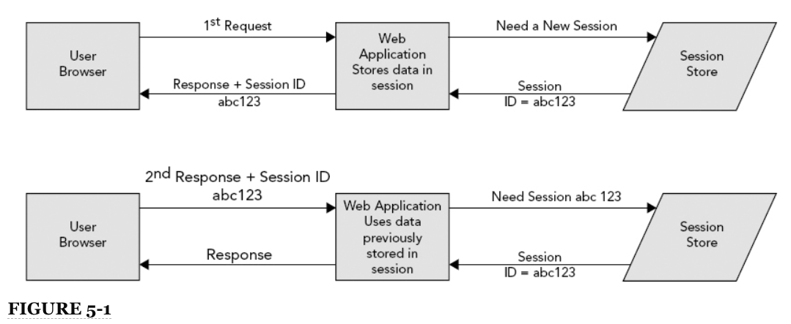

# 5: Mantener el State Usando Sessions

* Entender por qué las Sessions son necesarias
* Uso de Session Cookies y URL Rewriting
* Almacenamiento de Datos en una Session
* Aplicar Sessions de manera útil
* Agrupar(Clustering) una Splicación que usa Sessions
* Resumen

### EN ESTE CAPÍTULO

* Por que las sesiones son necesarias
* Trabajar con cookies y parámetros de URL
* Cómo almacenar datos en una sesión
* Hacer que las sesiones sean útiles
* Cómo agrupar una aplicación que usa sesiones

### PROYECTOS PARA ESTE CAPÍTULO

El código de este capítulo se divide en los siguientes ejemplos principales:

* Proyecto de carrito de compras
* Proyecto Sesión-Actividad
* Proyecto Customer-Support-v3

### DEPENDENCIAS DE NEW MAVEN PARA ESTE CAPÍTULO

No hay nuevas dependencias de Maven para este capítulo. Continúe usando las dependencias de Maven presentadas en todos los capítulos anteriores.

## ENTENDIENDO POR QUÉ SON NECESARIAS LAS SESIONES

Hasta ahora, ha aprendido sobre aplicaciones web, contenedores web, Servlets, JSP y cómo funcionan juntos los Servlets y JSP. También ha aprendido sobre el ciclo de vida de una solicitud, y debe quedar claro en este punto que las herramientas que le han presentado hasta ahora no le permiten asociar múltiples solicitudes provenientes del mismo cliente y compartir datos entre esas solicitudes. Podría pensar que puede usar la dirección IP como un identificador único y que todas las solicitudes de una dirección IP dentro de un período de tiempo deben pertenecer al mismo cliente. Desafortunadamente, debido a la traducción de direcciones de red (NAT), esto no es confiable. Miles de estudiantes en un campus universitario pueden, literalmente, usar la misma dirección IP, escondida detrás de un enrutador NAT. Por esta razón, el concepto de sesiones HTTP ha logrado una adopción casi universal por todas las tecnologías del lado del servidor HTTP, y Java EE tiene soporte de sesión escrito en su especificación.

No todas las aplicaciones necesitan sesiones. Los ejemplos de Hello World que ha visto en este libro ciertamente no necesitan sesiones. Hasta ahora, la aplicación de atención al cliente no ha necesitado sesiones. Ha sido más como un tablero de mensajes anónimos. Pero si piensa en los requisitos que Multinational Widget Corporation tiene para su sitio de soporte al cliente, rápidamente se dará cuenta de que en algún momento debe crear cuentas de usuario y esos usuarios deben iniciar sesión en la aplicación. Las solicitudes de asistencia al cliente pueden contener información privada, como archivos de configuración del servidor que otros clientes no deberían ver. Ciertamente, necesita una forma de restringir el acceso a ciertos tickets de soporte para que solo el cliente que publique y los miembros del equipo de soporte del MWC puedan acceder a un ticket determinado. Puede hacer que los usuarios proporcionen un nombre de usuario y una contraseña en cada página a la que acceden, pero es seguro que los clientes no estarán contentos con esa solución.

### ESTADO DE MANTENIMIENTO

Las sesiones se utilizan para mantener el estado entre una solicitud y la siguiente. Las solicitudes HTTP son completamente sin estado por sí mismas. Desde la perspectiva del servidor, la solicitud comienza cuando el navegador web del usuario abre un socket al servidor y finaliza cuando el servidor envía el último paquete al cliente y cierra la conexión. En ese momento, ya no hay un vínculo entre el navegador del usuario y el servidor, y cuando entra la siguiente conexión, no hay forma de vincular la nueva solicitud con la solicitud anterior.

Las aplicaciones a menudo no pueden funcionar correctamente de una manera tan apátrida. Un ejemplo clásico es el sitio web de compras en línea. Casi todos los sitios de compras en línea en estos días requieren que cree un nombre de usuario y una contraseña antes de comprar, pero considere incluso los pocos que no lo hacen. Cuando navega por la tienda, encuentra un producto que le gusta, por lo que agrega ese producto a su carrito de compras. Sigues navegando por la tienda y encuentras otro producto que te gusta. También lo agrega a su carrito de compras. Cuando ve su carrito de compras, ve que ambos productos que agregó permanecen en su carrito de compras. De alguna manera, entre cada solicitud que realizaba, el sitio web sabía que esas solicitudes provenían del mismo navegador en la misma computadora y las asociaba con su carrito de compras. Nadie más puede ver su carrito de compras o los artículos que contiene; está vinculado exclusivamente a su computadora y navegador. Este escenario es una analogía con una experiencia de compra de la vida real. Entras en tu tienda de comestibles favorita y, cuando entras por la puerta, agarras un carrito de compras o una canasta. (Obtienes una sesión del servidor). Caminas por la tienda y recoges artículos sobre la marcha, colocándolos en tu carrito (agregándolos a la sesión). Cuando llegas a la caja registradora, sacas los artículos del carrito y se los entregas al cajero, quien los escanea y toma tu dinero. (Paga usando su sesión). Al salir por la puerta, devuelve su carrito o canasta de compras. (Cierra su navegador o cierra sesión, finalizando su sesión).

En este ejemplo, el carrito o la cesta mantienen su estado mientras camina por la tienda. Sin el carrito, ni usted ni la tienda podrían mantenerse al día con todo lo que necesita para comprar. Si no se mantuviera ningún estado entre solicitudes, tendría que "entrar", tomar un artículo, pagarlo, "salir" (finalizar la solicitud) y repetir todo el proceso nuevamente para cada artículo que desea comprar. Las sesiones son el motor detrás del mantenimiento estado entre solicitudes, y sin ellos la web sería un lugar muy diferente.

### RECORDANDO A LOS USUARIOS

Otro escenario a considerar es el sitio web del foro de usuarios. Casi universalmente en los foros en línea, los usuarios son conocidos por sus nombres de usuario o "identificadores". Cuando un usuario ingresa a los foros, inicia sesión y proporciona un nombre de usuario y una contraseña para demostrar su identidad. (El mérito de la autenticación de nombre de usuario / contraseña como prueba de identidad es un argumento reservado para el Capítulo 25). Desde ese punto, puede agregar hilos en el foro, responder a hilos, participar en mensajes privados con otros usuarios, informar hilos o respuestas a moderadores y posiblemente marque temas como favoritos. Tenga en cuenta que el usuario inició sesión solo una vez durante toda esa línea de tiempo. El sistema necesitaba una forma de recordar quién era entre cada solicitud, y las sesiones lo proporcionaban.

### HABILITAR EL FLUJO DE TRABAJO DE LA APLICACIÓN

A menudo, los usuarios necesitan algún tipo de flujo de trabajo para completar una tarea utilizando una aplicación web avanzada. En el caso de crear un artículo de noticias para su publicación en un sitio de noticias, por ejemplo, el periodista puede ir primero a una pantalla donde puede ingresar un título, un eslogan y un cuerpo y dar formato a los elementos de manera apropiada. En la página siguiente, puede seleccionar una o más fotos asociadas con el artículo e indicar cómo deben mostrarse. También podría subir o grabar algún video para colocarlo en el artículo. Por último, probablemente se le presentará una lista de artículos similares o un campo de búsqueda para encontrar artículos similares de modo que pueda indicar cuáles deben colocarse en un cuadro de Artículos relacionados.

Una vez completados todos estos pasos, se publicaría el artículo. Todo este escenario representa la idea de un flujo de trabajo. El flujo de trabajo contiene muchos pasos, cada paso forma parte de la finalización de una sola tarea. Para unir todos estos pasos para completar el flujo de trabajo, las solicitudes deben tener un estado mantenido entre ellos. El ejemplo del carrito de la compra es en realidad un subconjunto de la idea más amplia de los flujos de trabajo.

## USO DE COOKIES DE SESIÓN Y REESCRIBICIÓN DE URL

Ahora que comprende la importancia de las sesiones, probablemente se esté preguntando cómo funcionan. Hay dos componentes diferentes para esto: primero, la teoría genérica detrás de las sesiones web y cómo se implementan; y segundo, los detalles detrás de la implementación de la sesión en aplicaciones web Java EE. Ambos se tratan en esta sección.

En la teoría general de las sesiones web, una sesión es un archivo, segmento de memoria, objeto o contenedor administrado por el servidor o la aplicación web que contiene varios elementos de datos asignados. Estos elementos de datos pueden ser un nombre de usuario, un carrito de compras, detalles del flujo de trabajo y más. El navegador del usuario no guarda ni mantiene ninguno de estos datos. Es administrado únicamente por el servidor o el código de la aplicación web. La única pieza que falta es un vínculo entre este contenedor y el navegador del usuario. Para este propósito, a las sesiones se les asigna una cadena generada aleatoriamente llamada ID de sesión. La primera vez que se crea una sesión (como resultado de la recepción de una solicitud), el ID de sesión para esa sesión se transmite al navegador del usuario como parte de la respuesta. Cada solicitud posterior del navegador de ese usuario incluye el ID de sesión de alguna manera. Cuando la aplicación recibe la solicitud con el ID de sesión, puede vincular la sesión existente a esa solicitud. Esto se demuestra en la Figura 5-1.



**NOTA**
<hr>
Es posible que se pregunte por qué el ID de sesión es aleatorio en lugar de un ID secuencial simple. La razón de esto es convincente: una identificación secuencial sería predecible y una identificación predecible haría que el secuestro de las sesiones de otros usuarios fuera trivial.
</hr>

El problema que queda por resolver es cómo se pasa el ID de sesión del servidor al navegador y viceversa. Hay dos técnicas que se utilizan para lograr esto: cookies de sesión y reescritura de URL.

### ENTENDIENDO LA COOKIE DE SESIÓN

Afortunadamente, ya existe una solución en HTTP 1.1 que permite a los servidores enviar ID de sesión a los navegadores para que los navegadores incluyan los ID de sesión en solicitudes futuras. Esta es la tecnología llamada cookies HTTP. Si no está familiarizado con las cookies, son esencialmente un mecanismo mediante el cual se pueden pasar datos arbitrarios del servidor al navegador a través del encabezado de respuesta `Set-Cookie`, almacenarse localmente en la computadora del usuario y luego transmitirse desde el navegador al servidor a través de el encabezado de la solicitud de cookies. Las cookies pueden tener varios atributos, como un nombre de dominio, una ruta, una fecha de vencimiento o una edad máxima, una bandera segura y una bandera de solo HTTP.

El atributo `Domain` indica al navegador para qué nombres de dominio debe devolver la cookie, mientras que el atributo `Path` permite que la cookie se restrinja aún más a una determinada URL relativa al dominio. Cada vez que un navegador realiza una solicitud de cualquier tipo, encuentra todas las cookies que coinciden con el dominio y la ruta del sitio y envía esas cookies junto con la solicitud. `Expires` define una fecha de vencimiento absoluta para la cookie, mientras que el atributo `Max-Age` mutuamente excluyente define la cantidad de segundos antes de que caduque la cookie. Si la fecha de vencimiento de una cookie está en el pasado, el navegador la borra inmediatamente. (***Así es como se elimina una cookie: establezca su fecha de vencimiento en el pasado***). Si una cookie no tiene un atributo `Expires` o `Max-Age`, se elimina cuando se cierra el navegador. Si el atributo `Secure` está presente (no es necesario que tenga un valor), el navegador enviará la cookie solo a través de HTTPS. Esto evita que la cookie se transmita sin cifrar. Finalmente, el atributo `HttpOnly` restringe la cookie a solicitudes directas del navegador. Otras tecnologías, como JavaScript y Flash, no tendrán acceso a la cookie.

Los servidores web y los servidores de aplicaciones utilizan cookies para almacenar los ID de sesión en el lado del cliente para que puedan transmitirse al servidor con cada solicitud. Con los servidores de aplicaciones Java EE, el nombre de esta cookie de sesión es `JSESSIONID` de forma predeterminada. Examine los siguientes encabezados de una serie de solicitudes y respuestas entre un navegador cliente y una aplicación web Java EE implementada en http://www.example.com/support. Esto es lo que esperaría ver si rastrea las solicitudes y respuestas HTTP con una herramienta de rigidez de red como Fiddler o Wireshark.

REQUEST 1

```java
GET /support HTTP/1.1
Host: www.example.com
```

RESPONSE 1

```java
HTTP/1.1 302 Moved Temporarily
Location: https://www.example.com/support/login
Set-Cookie: JSESSIONID=NRxclGg2vG7kI4MdlLn; Domain=.example.com; Path=/; HttpOnly
```
REQUEST 2

```java
GET /support/login HTTP/1.1
Host: www.example.com
Cookie: JSESSIONID=NRxclGg2vG7kI4MdlLn
```

RESPONSE 2

```java
HTTP/1.1 200 OK
Content-Type: text/html;charset=UTF-8
Content-Length: 21765
```

REQUEST 3

```java
POST /support/login HTTP/1.1
Host: www.example.com
Cookie: JSESSIONID=NRxclGg2vG7kI4MdlLn
```

RESPONSE 3

```java
HTTP/1.1 302 Moved Temporarily
Location: http://www.example.com/support/home
Set-Cookie: remusername=Nick; Expires=Wed, 02-Jun-2021 12:15:47 GMT; 
    Domain=.example.com; Path=/; HttpOnly
```

REQUEST 4

```java
GET /support/home HTTP/1.1
Host: www.example.com
Cookie: JSESSIONID=NRxclGg2vG7kI4MdlLn; remusername=Nick
```

RESPONSE 4

```java
HTTP/1.1 200 OK
Content-Type: text/html;charset=UTF-8
Content-Length: 56823
```

Los headers `Set-Cookie` en las respuestas se utilizan para enviar cookies al navegador del usuario para su almacenamiento. Asimismo, los headers `Cookie` en las solicitudes se utilizan para enviar cookies al servidor web. En este escenario imaginario, el usuario navega a algún sitio de soporte y es redirigido a la página de inicio de sesión. Mientras se redirige, el navegador del usuario también obtiene una cookie de identificación de sesión del servidor. Cuando el navegador del usuario va a la página de inicio de sesión, incluye la cookie de identificación de sesión en su solicitud. A partir de ese momento, cada vez que el navegador envía una nueva solicitud, incluye la cookie `JSESSIONID`. El servidor no lo vuelve a enviar porque sabe que el navegador ya lo tiene.

Después de un inicio de sesión exitoso, el servidor también envía una cookie `remusername`. Esto no está relacionado con la sesión y, en este caso, representa una técnica que el sitio utiliza para completar automáticamente el nombre de usuario del usuario cada vez que accede a la página de inicio de sesión. Las solicitudes futuras siempre contendrán esta cookie; aunque las respuestas futuras no lo restablecen. Tenga en cuenta que la cookie `JSESSIONID` no tiene fecha de caducidad, mientras que la cookie `remusername` sí la tiene. La cookie `remusername` caducará en el año 2021 (mucho tiempo a partir de ahora, después de lo cual el usuario probablemente tendrá una computadora diferente), mientras que la cookie `JSESSIONID` caducará tan pronto como el usuario cierre su navegador.

**NOTA**
<hr>
La cookie `remusername` se utiliza aquí simplemente para demostrar otro uso de las cookies y cómo se transmiten varias cookies en el encabezado de solicitud `Cookie`. La característica real, recordar nombres de usuario, no está relacionada con esta discusión.
<hr>

Uno de los obstáculos para el uso de cookies para transmitir ID de sesión es que los usuarios pueden deshabilitar el soporte de cookies en sus navegadores, eliminando así por completo este método de transmisión de ID de sesión. Sin embargo, durante la última década esto se ha vuelto cada vez menos preocupante, con un importante proveedor de búsqueda y correo electrónico y una importante red social que requiere que las cookies estén habilitadas para los usuarios de sus sitios web.

### SESSION IDS EN EL URL

Otro método popular para transmitir ID de sesión es a través de URL. El servidor web o de aplicaciones sabe que debe buscar un patrón particular que contenga el ID de sesión en la URL y, si lo encuentra, recupera la sesión de la URL. Las diferentes tecnologías utilizan diferentes estrategias para incrustar y localizar ID de sesión en la URL. Por ejemplo, PHP usa un parámetro de consulta llamado `PHPSESSID`:

```sh
http://www.example.com/support?PHPSESSID=NRxclGg2vG7kI4MdlLn&foo=bar&high=five
```

Las aplicaciones Java EE utilizan un enfoque diferente. El ID de sesión se coloca en un parámetro matrix en el último segmento de ruta (o directorio) en la URL. Esto libera la cadena de consulta para que el ID de sesión no entre en conflicto con otros parámetros de la cadena de consulta.


```sh
http://www.example.com/support;JSESSIONID=NRxclGg2vG7kI4MdlLn?foo=bar&high=five
```

La técnica específica que utiliza una tecnología determinada es irrelevante para el resultado final: inserte el ID de sesión en la URL y evitará la necesidad de utilizar cookies. Sin embargo, es posible que se pregunte cómo llega el ID de sesión en una URL de solicitud al navegador en primer lugar. Una URL de solicitud solo es efectiva para transmitir el ID de sesión desde el navegador al servidor. Entonces, ¿de dónde proviene el ID de sesión? La respuesta es que el ID de sesión debe estar incrustado en cada URL que la aplicación envía en cada respuesta, incluidos los enlaces en la página, las acciones de formulario y las redirecciones 302. Considere el ejemplo anterior del escenario de inicio de sesión utilizando cookies. Los siguientes encabezados demuestran el mismo conjunto de transacciones que utilizan la incrustación de URL en lugar de cookies:


REQUEST 1

```java
GET /support HTTP/1.1
Host: www.example.com
```

RESPONSE 1

```java
HTTP/1.1 302 Moved Temporarily
Location: https://www.example.com/support/login;JSESSIONID=NRxclGg2vG7kI4MdlLn
```

REQUEST 2

```java
GET /support/login;JSESSIONID=NRxclGg2vG7kI4MdlLn HTTP/1.1
Host: www.example.com
```

RESPONSE 2

```java
HTTP/1.1 200 OK
Content-Type: text/html;charset=UTF-8
Content-Length: 21796
...
<form action="http://www.example.com/support/login;JSESSIONID=NRxclGg2vG7kI4MdlLn"
      method="post">
...
```

REQUEST 3

```java
POST /support/login;JSESSIONID=NRxclGg2vG7kI4MdlLn HTTP/1.1
Host: www.example.com
```

RESPONSE 3

```java
HTTP/1.1 302 Moved Temporarily
Location: http://www.example.com/support/home;JSESSIONID=NRxclGg2vG7kI4MdlLn
```

REQUEST 4

```java
GET /support/home;JSESSIONID=NRxclGg2vG7kI4MdlLn HTTP/1.1
Host: www.example.com
```

RESPONSE 4

```java
HTTP/1.1 200 OK
Content-Type: text/html;charset=UTF-8
Content-Length: 56854
...
<a href="http://www.example.com/support/somewhere;JSESSIONID=NRxclGg2vG7kI4MdlLn">
...
```

En este caso, observe que el ID de sesión se devuelve al navegador a través del encabezado `Location`, la acción del formulario y la etiqueta de enlace. Como puede ver, el navegador nunca es "consciente" de la ID de sesión como lo hace con una cookie de sesión. En su lugar, el servidor reescribe la URL del encabezado `Location` y las URL en cualquier contenido de respuesta (enlaces, acciones de formulario y otras URL) de modo que cualquier URL que utilice el navegador para acceder al servidor ya tenga la ID de sesión incrustada. El punto importante de esto es que la ID de sesión *debe estar incrustada en la URL del encabezado `Location` y en cada una de las URL en el markup*. Esta no es una tarea trivial y, a menudo, puede ser francamente inconveniente. Para este propósito, la API de Java EE Servlet viene con algunas comodidades que lo hacen simple.

Para empezar, la interfaz `HttpServletResponse` define dos métodos que reescriben las URL para incluir ID de sesión incrustados si es necesario: `encodeURL` y `encodeRedirectURL`. Cualquier URL que se colocará en un enlace, acción de formulario u otro marcado se puede pasar primero al método `encodeURL`, que devuelve una versión "codificada" apropiada de la URL. Cualquier URL pasada al método de respuesta `sendRedirect` puede pasarse al método `encodeRedirectURL`, que devuelve una versión "codificada" de esa URL. La palabra "codificado" aquí significa que el parámetro de matriz `JSESSIONID` se incrustará en el último segmento de la ruta de la URL solo si se cumplen las cuatro condiciones siguientes:

* Hay una sesión activa para la solicitud actual. (O solicitó una sesión al pasar un ID de sesión o el código de la aplicación creó una nueva sesión).
* La cookie `JSESSIONID` no estaba presente en la solicitud.
* La URL no es una URL absoluta y es una URL dentro de la misma aplicación web.
* La reescritura de URL de sesión está habilitada en el deployment descriptor (más sobre esto en la sección "Almacenamiento de datos en una sesión").

La segunda condición es la condición problemática. La única forma de detectar si el navegador de un usuario permite cookies es establecer una cookie y luego buscar esa cookie que se devolverá en la siguiente solicitud. Sin embargo, necesita una sesión para asociar una solicitud con otra; de lo contrario, ¿cómo sabría si la solicitud fue simplemente la primera solicitud de un usuario diferente o una segunda solicitud del mismo usuario sin una cookie? Por lo tanto, la segunda condición siempre asume que la falta de una cookie `JSESSIONID` significa que el navegador del usuario no admite cookies, entendiendo que esto significa que las URL siempre se codificarán en la primera solicitud a una aplicación habilitada para sesión, incluso si el navegador del usuario admite cookies. El desafortunado efecto secundario es que a veces las URL contienen el parámetro de matriz `JSESSIONID` incluso si el navegador del usuario aceptó la cookie `JSESSIONID`.

Por supuesto, los métodos `HttpServletRequest` son solo parte del conjunto de herramientas disponible para ayudarlo a insertar ID de sesión en URL. La etiqueta `<c:url>`, que se analiza con más detalle en el Capítulo 7, también incorpora los ID de sesión en las URL.

### VULNERABILIDADES DE LA SESIÓN

Como puedes imaginar, las sesiones no están exentas de vulnerabilidades, y sería negligente si no te advirtiera sobre ellas. La mala noticia es que estas vulnerabilidades pueden causar serios problemas a sus usuarios, y si realiza transacciones con información confidencial o personal (como números de tarjetas de crédito o datos de atención médica) puede significar grandes multas para su negocio. La buena noticia es que existen formas fáciles de abordar estas vulnerabilidades, de las que también aprenderá. Por supuesto, no puedo cubrir todas las vulnerabilidades potenciales en sus aplicaciones, ya que hay miles de formas de comprometer las aplicaciones web. El desarrollador siempre debe ser diligente y estar bien informado sobre cuestiones de seguridad. En aplicaciones sensibles y de misión crítica, sería prudente utilizar un escáner comercial de algún tipo que escanee su aplicación en busca de debilidades.

Para obtener más información sobre las vulnerabilidades de las sesiones y las aplicaciones web, y cómo detectarlas y abordarlas, visite el sitio web del Proyecto de seguridad de aplicaciones web abiertas (OWASP) https://www.owasp.org/.

#### El Error de Copiar y Pegar

Quizás una de las formas más fáciles de poner en peligro una sesión es que un usuario desprevenido copie y pegue la URL de su navegador en un correo electrónico, publicación en un foro, sala de chat u otra área pública. La incrustación de ID de sesión en URL, sobre la que leíste anteriormente en esta sección, es la fuente de este problema. ¿Recuerda las URL que se transmiten entre el cliente y el servidor? Esas URL, ID de sesión y todo, aparecen en la barra de direcciones en el navegador del cliente. Si el usuario decide compartir una página de su aplicación con sus amigos y copia y pega la URL de la barra de direcciones, la ID de sesión se incluye en la URL que ven sus amigos. Si van a esa URL antes de que expire la sesión, asumen la identidad del usuario que compartió la URL. El problema obvio con esto es que los amigos del usuario pueden ver información personal accidentalmente.

El escenario más peligroso es que un personaje infame encuentra el enlace y lo usa para secuestrar la sesión del usuario. Entonces puede cambiar e la dirección de correo electrónico de la cuenta, obtenga un enlace para restablecer la contraseña y, finalmente, cambie la contraseña, lo que le da al atacante un control total sobre la cuenta del usuario y todo lo que contiene.

Tan inocente como es el origen de este problema, un usuario que copia y pega una URL desde su barra de direcciones, el único método infalible para abordar esta vulnerabilidad es deshabilitar por completo la inserción de ID de sesión en las URL. Aunque esto puede parecer una medida drástica con consecuencias potencialmente catastróficas para la usabilidad de su aplicación, recuerde lo que se dijo anteriormente acerca de lo común que se ha vuelto para las principales compañías de Internet requerir cookies al usar sus sitios. Las cookies se han convertido en una realidad para los usuarios de la web hoy en día, y las vulnerabilidades inherentes a las cookies son mucho menos comunes y peligrosas que esta.

#### Fijación de sesiones

El ataque de fijación de sesión es similar al error de copiar y pegar, excepto que el "usuario desprevenido" en este caso es el atacante y las víctimas son los usuarios que utilizan un enlace que contiene un ID de sesión. Un atacante puede ir a algún sitio web conocido por aceptar ID de sesión incrustados en la URL. El atacante obtendrá una identificación de sesión de esta manera (ya sea a través de una URL o examinando las cookies del navegador) y luego enviará una URL que contenga esa identificación de sesión a una víctima, a través de un foro o (más a menudo) un correo electrónico. En este punto, cuando el usuario hace clic en el enlace para ir al sitio web, su ID de sesión se fija a lo que estaba en la URL, una ID de sesión que el atacante conoce. Si el usuario inicia sesión en el sitio web durante esta sesión, el atacante también iniciará sesión porque comparte el ID de sesión, lo que le da acceso a la cuenta del usuario.

Hay dos formas de abordar el problema:

* Al igual que con el error de copiar y pegar, simplemente puede deshabilitar la incrustación de ID de sesión en URL y también impedir que su aplicación acepte ID de sesión a través de URL (algo que explora en la sección "Almacenamiento de datos en una sesión").

* Emplee la *migración de sesión* después de iniciar sesión. Cuando el usuario inicie sesión, cambie el ID de la sesión o copie los detalles de la sesión en una nueva sesión e invalide la sesión original. (Cualquiera de los métodos logra lo mismo: asignar un ID de sesión diferente a la sesión que acaba de "iniciar sesión"). El atacante todavía tiene el ID de sesión original, que ya no es válido y no está conectado a la sesión del usuario.

**ADVERTENCIA**
<hr>
Existe otro tipo de ataque de fijación de sesión en el que un sitio web malintencionado escribe una cookie de identificación de sesión utilizando el nombre de dominio de otro sitio web, configurando efectivamente la identificación de sesión para el otro sitio web en el navegador de la víctima. Este ataque tiene el mismo efecto que el ataque de fijación de sesión de URL. Sin embargo, no hay forma de que las aplicaciones web se protejan contra esta vulnerabilidad sin deshabilitar las sesiones por completo. Esta vulnerabilidad es en realidad una vulnerabilidad del navegador, no una vulnerabilidad de las aplicaciones web.

Todos los navegadores modernos han solucionado esta vulnerabilidad para los ataques entre dominios (el sitio `example.net` establece una cookie para el sitio `example.net`). Sin embargo, el sitio `malicioso.example.net` aún podría establecer una cookie de sesión para el dominio `.example.net`, que luego sería recogida por el sitio `vulnerable.example.net`. Este problema se puede evitar por completo siguiendo una regla simple: no comparta un nombre de dominio con aplicaciones que no sean de confianza.
<hr>

#### Cross-Site Scripting y Session Hijacking

Ya ha leído sobre el error de copiar y pegar que, cuando lo explota una parte malintencionada, se convierte en un ataque de fijación de sesión. Existe otra forma de secuestro de sesión que utiliza JavaScript para leer el contenido de una cookie de sesión. Un atacante, que aprovecha la vulnerabilidad de un sitio a los ataques de secuencias de comandos entre sitios, inyecta JavaScript en una página para leer el contenido de una cookie de identificación de sesión utilizando la propiedad DOM de JavaScript `document.cookie`. Después de que el atacante recupera una identificación de sesión de un usuario desprevenido, puede asumir esa identificación de sesión creando una cookie en su propia máquina o utilizando la incrustación de URL, asumiendo así la identidad de la víctima.

La defensa más obvia contra este ataque es proteger su sitio contra las secuencias de comandos entre sitios, que es un tema fuera del alcance de este libro (consulte el sitio web de OWASP mencionado anteriormente). Sin embargo, hacer esto puede ser complicado y difícil, y los atacantes encuentran constantemente nuevas formas de realizar ataques de secuencias de comandos entre sitios. Una defensa alternativa, que siempre debe usar junto con esto, es marcar todas sus cookies con el atributo HttpOnly. Este atributo permite que la cookie se use solo cuando el navegador realiza una solicitud HTTP (o HTTPS), ya sea que la solicitud se realice a través de un enlace, la entrada manual de una URL en la barra de direcciones, el envío de un formulario o una solicitud AJAX. Más importante aún, `HttpOnly` deshabilita completamente la capacidad de JavaScript, Flash o algún otro script o complemento del navegador para obtener el contenido de la cookie (o incluso saber de su existencia). Esto detiene en seco el ataque de secuestro de sesiones de secuencias de comandos entre sitios. Las cookies de ID de sesión siempre deben incluir el atributo `HttpOnly`.

**NOTA**
<hr>
Aunque el atributo `HttpOnly` evita que JavaScript acceda a la cookie utilizando la propiedad DOM `document.cookie`, las solicitudes AJAX que se originan en el código JavaScript seguirán incluyendo la cookie de ID de sesión porque el navegador, no el código JavaScript, es responsable de formar los encabezados de solicitud AJAX. Esto significa que el servidor aún podrá asociar las solicitudes AJAX con la sesión del usuario.
<hr>

#### Cookies Inseguras

La última vulnerabilidad que debe considerar es el ataque *man-in-the-middle* (*ataque MitM*), el clásico ataque de interceptación de datos mediante el cual un atacante observa una solicitud o respuesta mientras viaja entre el cliente y el servidor y obtiene información de la solicitud o respuesta. Este ataque dio lugar a Secure Sockets Layer and Transport Layer Security (SSL/TLS), la base del protocolo HTTPS. Asegurar su tráfico web mediante HTTPS frustra eficazmente el ataque MitM y evita que se roben las cookies de identificación de sesión. El problema, sin embargo, es que un usuario puede intentar primero ir a su sitio usando HTTP. Incluso si los redirige a HTTPS, el daño ya está hecho: su navegador ha transmitido la cookie de identificación de sesión a su servidor sin cifrar, y un atacante que lo observe puede robar la identificación de sesión.

La bandera de cookies `Secure` se creó para abordar este mismo problema. Cuando su servidor envía la cookie de identificación de sesión al cliente en la respuesta, establece el indicador de seguridad. Esto le dice al navegador que la cookie debe transmitirse solo a través de HTTPS. A partir de ese momento, la cookie solo se transmitirá encriptada y los atacantes no podrán interceptarla. El inconveniente es que su sitio siempre debe estar detrás de HTTPS para que esto funcione. De lo contrario, tan pronto como redirija al usuario a HTTP, el navegador ya no podrá transmitir la cookie y se perderá la sesión. Por esta razón, debe sopesar las necesidades de seguridad de su aplicación y determinar si los datos que está protegiendo son lo suficientemente sensibles como para garantizar la sobrecarga de rendimiento y la molestia de asegurar cada solicitud con HTTPS.

#### La Defensa más Fuerte Posible

Una última opción que debe comprender cuando se trata de la seguridad de sus sesiones es el SSL/TLS Session ID. Para mejorar la eficiencia del protocolo SSL al eliminar la necesidad de realizar un protocolo de enlace SSL en cada solicitud, el protocolo SSL define su propio tipo de ID de sesión. La ID de sesión SSL se establece durante el protocolo de enlace SSL y luego se usa en solicitudes posteriores para unir solicitudes para determinar qué claves deben usarse para el cifrado y el descifrado. Este mismo concepto duplica la noción de ID de sesión HTTP. Sin embargo, el ID de sesión SSL no se transmite ni se almacena mediante cookies o URL y es extremadamente seguro. (Puede obtener más información sobre cómo funciona la ID de sesión SSL revisando RFC 2246 “El protocolo TLS”). Es sumamente difícil obtener una ID de sesión SSL para la que no está autorizado. Algunos sitios web de alta seguridad, como los de instituciones financieras, reutilizan el ID de sesión SSL como el ID de sesión HTTP, eliminando así las cookies y la codificación de URL y manteniendo el estado entre solicitudes.

Este es un método extremadamente seguro para establecer un ID de sesión entre solicitudes y es casi invulnerable. Además, cuando se encuentran vulnerabilidades de SSL, generalmente se tratan en cuestión de semanas y se eliminan mediante actualizaciones del navegador. Sin embargo, es comprensible que existan algunos inconvenientes en el uso de esta técnica; de lo contrario, todo el mundo lo usaría. En versiones anteriores de la especificación Java EE, no había una forma estándar de especificar esto, por lo que los desarrolladores tenían que usar clases específicas del contenedor para lograr el uso de ID de sesión SSL, y esta configuración a veces era impredecible. En la especificación Java EE 6.0, se agregó una opción (sobre la que aprenderá en la siguiente sección) para indicar fácilmente al contenedor web que use ID de sesión SSL, por lo que la configuración ya no es una preocupación importante (aunque no muchos sitios lo están usando todavía ). Además, al igual que con la bandera de cookies seguras, requiere que su sitio siempre esté detrás de HTTPS. Sin embargo, si está lo suficientemente preocupado por la seguridad como para habilitar esta función, probablemente tenga la intención de que todo su sitio esté siempre detrás de HTTPS, por lo que es probable que esto no sea un problema para usted.

Otro problema con la reutilización de la ID de sesión SSL es que el contenedor web debe ser responsable de las comunicaciones SSL. Si utiliza un servidor web o un equilibrador de carga para administrar sus comunicaciones SSL, algo común en entornos de servidores agrupados, el contenedor web no sabrá cuál es el ID de sesión SSL. En un entorno agrupado de este tipo, la solicitud del usuario también debe enrutarse siempre al mismo servidor. Finalmente, según el servidor y el navegador, la vida útil de la ID de sesión SSL puede ser muy larga o muy corta, por lo que es difícil confiar en esto como reemplazo de la ID de sesión HTTP.

Ahora que se le presentó a las sesiones, aprendió sobre la cookie `JSESSIONID` y la reescritura de URL, y exploró algunas de las vulnerabilidades inherentes a las sesiones y cómo abordarlas, es hora de comenzar a usar sesiones en su aplicación Java EE.

## ALMACENAMIENTO DE DATOS EN UNA SESIÓN

A medida que aprenda a utilizar sesiones en Java EE, utilizará el proyecto de ejemplo **950-05-01-Shopping-Cart**. No creará un sitio de compras completo con sistemas de pago y funciones relacionadas. Simplemente explorará el concepto de usar sesiones para agregar datos recopilados en varias páginas (en este caso, productos agregados a un carrito de compras). Puede crear el proyecto usted mismo o seguir el proyecto **950-05-01-Shopping-Cart**. Su proyecto debe comenzar con el deployment descriptor `<jsp-config>` del Capítulo 4 y el siguiente archivo `/WEB-INF/jsp/base.jspf`:

```java
<%@ taglib prefix="c" uri="http://java.sun.com/jsp/jstl/core" %>
```

Además, debe tener un archivo `index.jsp` simple en su raíz web para redirigir a su tienda Servlet:

```java
<c:redirect url="/shop" />
```

### CONFIGURAR SESIONES EN EL DEPLOYMENT DESCRIPTOR

En muchos casos, las sesiones HTTP están listas para funcionar en Java EE y no requieren una configuración explícita. Sin embargo, configúrelos que pueda, y por motivos de seguridad debería hacerlo. Las sesiones se configuran en el deployment descriptor mediante la etiqueta `<session-config>`. Dentro de esta etiqueta, puede configurar el método mediante el cual se rastrean las sesiones, la edad después de la cual se agota el tiempo de espera de las sesiones y los detalles de la cookie de identificación de sesión, si la usa. Muchos de estos tienen valores predeterminados que nunca es necesario cambiar. El siguiente código muestra todas las configuraciones posibles del deployment descriptor settings para las sesiones.

```java
    <session-config>
        <session-timeout>30</session-timeout>
        <cookie-config>
            <name>JSESSIONID</name>
            <domain>example.org</domain>
            <path>/shop</path>
            <comment><![CDATA[Keeps you logged in. See our privacy policy for
                more information.]]></comment>
            <http-only>true</http-only>
            <secure>false</secure>
            <max-age>1800</max-age>
        </cookie-config>
        <tracking-mode>COOKIE</tracking-mode>
        <tracking-mode>URL</tracking-mode>
        <tracking-mode>SSL</tracking-mode>
    </session-config>
```

Todas las etiquetas dentro de `<session-config>` y `<cookie-config>` son opcionales, pero deben aparecer en el orden que se muestra en este ejemplo (excluyendo las etiquetas omitidas). La etiqueta `<session-timeout>` especifica cuánto tiempo deben permanecer inactivas las sesiones, en minutos, antes de ser invalidadas. **Si el valor es 0 o menos, la sesión nunca caduca**. Si se omite esta etiqueta, se aplica el contenedor predeterminado. ***El contenedor predeterminado de Tomcat es 30, que se puede cambiar en la configuración de Tomcat***. Si desea coherencia, debe establecer explícitamente el tiempo de espera con esta etiqueta. En este ejemplo, el tiempo de espera es de 30 minutos. *Cada vez que un usuario con un ID de sesión determinado realiza una solicitud a su aplicación, el temporizador se reinicia en la inactividad de su sesión*. Si pasa más de 30 minutos sin hacer una solicitud, su sesión se considera inválida y se le da una nueva sesión. La etiqueta `<tracking-mode>`, que se agregó en Servlet 3.0/Java EE 6, indica qué técnica debe usar el contenedor para rastrear los ID de sesión. Los valores legales son:

* `URL`: El contenedor solo incorpora los ID de sesión en las URL. No utiliza cookies ni ID de sesión SSL. Este enfoque no es muy seguro.

* `COOKIE`: El contenedor utiliza cookies de sesión para rastrear los ID de sesión. Esta técnica es muy segura.

* `SSL`: El contenedor utiliza ID de sesión SSL como ID de sesión HTTP. Este método es el más seguro disponible, pero requiere que todas las solicitudes sean HTTPS para que funcione correctamente.

Puede usar `<tracking-mode>` más de una vez para decirle al contenedor que puede usar múltiples estrategias. Por ejemplo, si especifica `COOKIE` y `URL`, el contenedor prefiere las cookies pero usa las URL cuando las cookies no están disponibles (como se describe en la sección anterior). Especificar `COOKIE` como el único modo de seguimiento le dice al contenedor que nunca incruste sesiones en URL y siempre asuma que el usuario tiene las cookies habilitadas. Del mismo modo, especificar la URL como el único modo de seguimiento le dice al contenedor que *nunca* use cookies. Si habilita el modo de seguimiento SSL, no puede habilitar también los modos `COOKIE` o `URL`. Las ID de sesión SSL deben usarse solas; el contenedor no puede recurrir a cookies o URL en ausencia de HTTPS.

La etiqueta `<cookie-config>` se aplica solo cuando se especifica `COOKIE` como uno de los (o el único) modo de seguimiento. Las etiquetas dentro de él personalizan las cookies de sesión que el contenedor devuelve al navegador:

* La etiqueta `<name>` le permite personalizar el nombre de la cookie de sesión. El valor predeterminado es `JSESSIONID`, y probablemente nunca necesitará cambiarlo.

* Las etiquetas `<domain>` y `<path>` corresponden a los atributos `Domain` y `Path` de la cookie. El contenedor web los predetermina de forma apropiada para que usted no necesite personalizarlos. El `Domain` tiene como valor predeterminado el nombre de dominio utilizado para realizar la solicitud durante la cual se creó la sesión. La `Path` tiene como valor predeterminado el nombre del contexto de la aplicación implementada.

* La etiqueta `<comment>` agrega un atributo `Comment` a la cookie de ID de sesión, brindando la oportunidad de agregar texto arbitrario. Esto se usa a menudo para explicar el propósito de la cookie y señalar a los usuarios la política de privacidad del sitio. Si usa esto, depende completamente de usted. Si omite esta etiqueta, el atributo `Comment` no se agrega a la cookie.

* Las etiquetas `<http-only>` y `<secure>` corresponden a los atributos de cookie `HttpOnly` y `Secure`, y ambos predeterminados son `false`. Para mayor seguridad, siempre debe personalizar `<http-only>` como `true`. `<secure>` debe cambiarse a `true` solo si tiene HTTPS habilitado.

* La etiqueta final, `<max-age>`, especifica el atributo de cookie `Max-Age` que controla cuándo caduca la cookie. Por defecto, la cookie no tiene fecha de caducidad, lo que significa que caduca cuando se cierra el navegador. Establecer esto en -1 tiene el mismo efecto. La caducidad de la cookie cuando se cierra el navegador es casi siempre lo que desea. Puede personalizar este valor en segundos (a diferencia de `<session-timeout>`, que es en minutos), pero hacerlo podría hacer que la cookie caduque y el seguimiento de la sesión falle mientras el usuario está en medio de usar activamente su aplicación. Es mejor dejar este solo y no usar esta etiqueta.

**NOTA**
<hr>
*A partir de Servlet 3.0/Java EE 6,, puede omitir el deployment descriptor y configurar la mayoría de estas opciones mediante programación utilizando `ServletContext`. Utilice el método `setSessionTrackingModes` para especificar un conjunto de una o más constantes de enumeración `javax.servlet.SessionTrackingMode`. `getSessionCookieConfig` devuelve un `javax.servlet.SessionCookieConfig`: use este objeto para configurar cualquiera de las opciones de `<cookie-config>`. Puede configurar los modos de seguimiento o la configuración de cookies solo dentro del método `contextInitialized` de un `ServletContextListener` o del método `onStartup` de un `ServletContainerInitializer`. Aprenderá sobre los escuchas en la sección "Aplicar sesiones de manera útil" y `ServletContainerInitializers` en el Capítulo 12. Actualmente no puede configurar el tiempo de espera de la sesión de manera programática; esta omisión debe corregirse en Java EE 8.

Ahora que comprende las opciones disponibles, la configuración de sesión para el proyecto **950-05-01-Shopping-Cart** es la siguiente:

```html
    <session-config>
        <session-timeout>30</session-timeout>
        <cookie-config>
            <http-only>true</http-only>
        </cookie-config>
        <tracking-mode>COOKIE</tracking-mode>
    </session-config>
```

Esto hace que las sesiones duren 30 minutos, indica al contenedor que solo use cookies para el seguimiento de sesiones y hace que las cookies de sesión contengan el atributo `HttpOnly` por seguridad. Acepta todos los demás valores predeterminados y no especifica un comentario para la cookie. El seguimiento de sesiones de URL está deshabilitado porque no es seguro. Para el resto del libro, siempre utilizará esta configuración de sesión.

**NOTA**
<hr>
*Como se señaló anteriormente, el enfoque más seguro sería utilizar ID de sesión SSL. Un compromiso seguro usa cookies pero establece el atributo de cookie Secure para requerir HTTPS. Este libro no demuestra ninguna de estas técnicas porque hacerlo requeriría generar un certificado SSL autofirmado y aprender las complejidades de configurar SSL en Tomcat. Ambos temas están más allá del alcance de este libro y se pueden explorar más en la documentación de Tomcat*.
<hr>

### ALMACENAMIENTO Y RECUPERACIÓN DE DATOS

En su proyecto, cree un Servlet llamado `com.wrox.StoreServlet` y anótelo como un Servlet con el patrón de URL `/shop`. Además, cree un mapa simple en su Servlet que represente una base de datos de productos. (O simplemente use el proyecto **950-05-01-Shopping-Cart**).

```java
@WebServlet(
        name = "storeServlet",
        urlPatterns = "/shop"
)
public class StoreServlet extends HttpServlet
{
    private final Map<Integer, String> products = new Hashtable<>();
 
    public StoreServlet()
    {
        this.products.put(1, "Sandpaper");
        this.products.put(2, "Nails");
        this.products.put(3, "Glue");
        this.products.put(4, "Paint");
        this.products.put(5, "Tape");
    }
}
```

Puede utilizar esta base de datos de productos para "examinar" productos y vincular los artículos del carrito a los nombres de los productos.

#### Uso de Sesiones en sus Servlets

Cree una implementación simple del método `doGet` que admita tres acciones: `browse`, `addToCart`, and `viewCart`:

```java
    @Override
    protected void doGet(HttpServletRequest request, HttpServletResponse response)
            throws ServletException, IOException
    {
        String action = request.getParameter("action");
        if(action == null)
            action = "browse";
 
        switch(action)
        {
            case "addToCart":
                this.addToCart(request, response);
                break; 
 
            case "viewCart":
                this.viewCart(request, response);
                break;
            
            case "browser":
            default:
                this.browse(request, response);
                break;
        }
    }
```

Los métodos `browse` y `viewCart` de su Servlet deberían ser bastante simples, agregando un atributo de solicitud y reenvío a una JSP:

```java
    private void viewCart(HttpServletRequest request, HttpServletResponse response)
            throws ServletException, IOException
    {
        request.setAttribute("products", this.products);
        request.getRequestDispatcher("/WEB-INF/jsp/view/viewCart.jsp")
                .forward(request, response);
    }
 
    private void browse(HttpServletRequest request, HttpServletResponse response)
            throws ServletException, IOException
    {
        request.setAttribute("products", this.products);
        request.getRequestDispatcher("/WEB-INF/jsp/view/browse.jsp")
               .forward(request, response);
    }
```

Estos métodos son similares en el sentido de que ambos agregan la base de datos de productos a un atributo de solicitud, pero reenvían a diferentes JSP. Ahora eche un vistazo al método `addToCart`:

```java
    private void addToCart(HttpServletRequest request,
                           HttpServletResponse response)
            throws ServletException, IOException
    {
        int productId;
        try
        {
            productId = Integer.parseInt(request.getParameter("productId"));
        }
        catch(Exception e)
        {
            response.sendRedirect("shop");
            return;
        }
 
        HttpSession session = request.getSession();
        if(session.getAttribute("cart") == null)
            session.setAttribute("cart", new Hashtable<Integer, Integer>());
 
        @SuppressWarnings("unchecked")
        Map<Integer, Integer> cart =
                (Map<Integer, Integer>)session.getAttribute("cart");
        if(!cart.containsKey(productId))
            cart.put(productId, 0);
        cart.put(productId, cart.get(productId) + 1);
 
        response.sendRedirect("shop?action=viewCart");
    }
```

Este método es definitivamente más complicado. Primero, obtiene y analiza el ID de producto para el producto que se agrega al carrito. Después de eso, el código en negrita llama a algunos métodos nuevos relacionados con la sesión que aún no ha mirado. El método `getSession` en `HttpServletRequest` viene en dos formas: `getSession()` y `getSession(booleano)`.

**Una llamada a `getSession()` llama a `getSession(true)`, que devuelve la sesión existente si existe una y crea una nueva sesión si aún no existe una sesión. (Nunca devuelve nulo)**. Una llamada a **`getSession(false)`, por otro lado, devuelve la sesión existente si existe una y nula si no existe ninguna sesión**. Hay razones para llamar a `getSession` con un argumento `false`; por ejemplo, es posible que desee probar si ya se ha creado una sesión, pero en la mayoría de los casos simplemente llama a `getSession()`. El método `getAttribute` devuelve un objeto almacenado en la sesión. Tiene una contraparte, `getAttributeNames`, que devuelve una enumeración de los nombres de todos los atributos de la sesión. El método `setAttribute` vincula un objeto a la sesión. En este ejemplo, el código busca el atributo del carrito, lo agrega si no existe y luego recupera el mapa del carrito simple de la sesión. Luego busca el ID del producto en el carrito y lo agrega con una cantidad de 0 si no existe. Finalmente, incrementa la cantidad de ese producto en el carrito.

#### Uso de Sesiones en sus JSP

El código de Servlet puede manejar la lógica en su aplicación, pero necesita algunas JSP para mostrar la lista de productos y el carrito de compras. Comience creando `/WEB-INF/jsp/view/browse.jsp`:

```java
<%@ page import="java.util.Map" %>
<!DOCTYPE html>
<html>
    <head>
        <title>Product List</title>
    </head>
    <body>
        <h2>Product List</h2>
        <a href="<c:url value="/shop?action=viewCart" />">View Cart</a><br /><br />
        <%
            @SuppressWarnings("unchecked")
            Map<Integer, String> products =
                    (Map<Integer, String>)request.getAttribute("products");
 
            for(int id : products.keySet())
            {
                %><a href="<c:url value="/shop">
                    <c:param name="action" value="addToCart" />
                    <c:param name="productId" value="<%= Integer.toString(id) %>"/>
                </c:url>"><%= products.get(id) %></a><br /><%
            }
        %>
    </body>
</html>
```

Esta JSP tiene pocas novedades y simplemente enumera todos los productos. Explorará las etiquetas `<c:url>` y `<c:param>` con más detalle en el Capítulo 7. Al hacer clic en el nombre de un producto, se agrega al carrito. A continuación, cree `/WEB-INF/jsp/view/viewCart.jsp`:


```java
<%@ page import="java.util.Map" %>
<!DOCTYPE html>
<html>
    <head>
        <title>View Cart</title>
    </head>
    <body>
        <h2>View Cart</h2>
        <a href="<c:url value="/shop" />">Product List</a><br /><br />
        <%
            @SuppressWarnings("unchecked")
            Map<Integer, String> products =
                    (Map<Integer, String>)request.getAttribute("products");
            @SuppressWarnings("unchecked")
            Map<Integer, Integer> cart =
                    (Map<Integer, Integer>)session.getAttribute("cart");
 
            if(cart == null || cart.size() == 0)
                out.println("Your cart is empty.");
            else
            {
                for(int id : cart.keySet())
                {
                    out.println(products.get(id) + " (qty: " + cart.get(id) +
                            ")<br />");
                }
            }
        %>
    </body>
</html>
```

Esta JSP utiliza la variable implícita `session` que aprendió en el Capítulo 4 para acceder al `Map` del carrito de compras almacenado en la sesión. Luego enumera todos los artículos en el carrito y sus cantidades. Tenga en cuenta que el atributo `session` de la directiva `page` ya no se establece en `false` (el valor predeterminado es `true`), lo que le permite utilizar la variable de sesión en la JSP.

#### Compilación y Prueba

Ahora que todo está en su lugar, compile su proyecto y ejecute Tomcat en su depurador IDE.

1. Navegue en su navegador a http://localhost:8080/shopping-cart/ y verá la lista de productos.
2. Haga clic en View Cart para ver su carrito, que estará vacío porque aún no ha agregado nada.
3. Haga clic en Lista de productos para volver a la lista de productos y luego haga clic en el nombre de un producto para agregarlo a su carrito. Ahora debería ver el carrito, que tiene el artículo en él.
4. Regrese a la lista de productos y agregue un producto diferente al carrito. Ahora debería ver ambos artículos en su carrito. La sesión está almacenando datos correctamente entre solicitudes.
5. Agregue otro producto y también agregue algunos de los mismos productos. Deberían aparecer más productos en su carrito y las cantidades deberían aumentar para los productos que agregó nuevamente.

Después de un tiempo, su carrito debería verse como la Figura 5-2.


Para probar más a fondo que la sesión funciona correctamente, abra su aplicación en un navegador diferente y haga clic en View Cart. El carrito en el nuevo navegador debería estar vacío, mientras que el carrito en su navegador original aún debería tener elementos. Esto demuestra que su carrito no solo persiste entre solicitudes, sino que también pertenece solo a su sesión individual en ese navegador. Ningún otro usuario puede verlo.

La prueba final es cerrar y volver a abrir la ventana del navegador original que tenía elementos del carrito. Ahora el carrito debería estar vacío. Esto se debe a que la cookie de sesión expiró cuando cerró el navegador y, cuando volvió a su aplicación, obtuvo una nueva sesión. Sin embargo, la sesión anterior se queda por un tiempo hasta que cancela la implementación de la aplicación o apaga Tomcat, o la sesión se agota debido a la inactividad. No existe una manera (fácil) de recuperar esa sesión en su navegador.

### ELIMINANDO DATOS

Hasta ahora, la sesión es útil, pero no debería tener que cerrar y volver a abrir su navegador para vaciar su carrito. Ahí es donde entra en juego el método `removeAttribute` de la sesión.

1. Agregue un nuevo caso a su método `doGet`:

```java
  case "emptyCart":
     this.emptyCart(request, response);
     break;
```

2. Agregue la implementación del método `emptyCart`:

```java
    private void emptyCart(HttpServletRequest request,
                           HttpServletResponse response)
            throws ServletException, IOException
    {
        request.getSession().removeAttribute("cart");
        response.sendRedirect("shop?action=viewCart");
    }
```

Como puede ver, este es el método más simple en su Servlet. El código elimina el atributo `cart` de su sesión y luego lo redirige para que vea su carrito vacío.

**NOTA**
<hr>
*Cabe señalar que, en su lugar, podría haber llamado a `getAttribute` para recuperar el `Map` y luego haber llamado al método `clear` del `Map`. Esto también vaciaría el carro y sería un poco más eficiente porque con el tiempo conduciría a menos recolecciones de basura. Sin embargo, este ejemplo demuestra el uso del método `removeAttribute`*.
<hr>

3. Ahora necesita una forma de navegar hasta el enlace para vaciar el carrito. Modifique `/WEB-INF/jsp/view/viewCart.jsp` y agregue el siguiente enlace:

```java
<a href="<c:url value="/shop?action=emptyCart" />">Empty Cart</a><br /><br />
```

4. Compile y depure su aplicación y agregue algunos productos a su carrito.

5. Una vez que su carrito comience a llenarse, haga clic en Empty Cart(Vaciar carrito). Todos los productos de su carrito deberían desaparecer, dejándolo con un carrito vacío.

Puede hacer algunas otras cosas con las sesiones con las que no experimentará aquí, pero que debe conocer. Lo más obvio que podría querer hacer es recuperar el ID de sesión para usarlo con algún propósito. Llamar al método `getId` en el objeto `HttpSession` logra esto fácilmente. También existen los métodos `getCreationTime` y `getLastAccessedTime`. Aunque `getCreationTime` obviamente devuelve la hora (marca de tiempo de Unix en milisegundos) en que se creó el objeto de sesión, el método `getLastAccessedTime` puede ser un poco contrario a la intuición.

Esta no es la última vez que su código usó el objeto de sesión de alguna manera. En cambio, es la marca de tiempo de la última solicitud que incluyó el ID de sesión para esa sesión (URL, cookie o sesión SSL); en otras palabras, la última vez que el usuario accedió a la sesión. El método `isNew` puede ser útil: devuelve `true` si la sesión se creó durante la solicitud actual, lo que significa que el navegador del usuario aún no ha recibido el ID de sesión.

`getMaxInactiveInterval` devuelve el tiempo máximo (en segundos) que esta sesión puede estar inactiva (sin solicitudes que contengan el ID de sesión) antes de que expire. Su contraparte es `setMaxInactiveInterval`, que le permite cambiar la ventana de inactividad. De forma predeterminada, `getMaxInactiveInterval` devuelve el valor que estableciste en `<session-timeout>`. El método `setMaxInactiveInterval` anula esta configuración configurada para hacerla más corta o más larga para esta sesión específica.

Para comprender por qué es posible que deba hacer esto, considere una aplicación en la que ciertos usuarios (administradores) tengan mucho poder y puedan ver información confidencial. Es posible que desee que su intervalo de inactividad sea más corto que el de otros usuarios. Por lo tanto, cuando el usuario inicia sesión por primera vez, llama a `setMaxInactiveInterval` para cambiar este valor según los permisos del usuario.

Quizás uno de los métodos de `HttpSession` más importantes que debe conocer es el método de invalidación. Este es un método al que llamaría cuando un usuario cierre la sesión (aunque ese es solo un ejemplo). `invalidate` destruye la sesión y desvincula todos los datos vinculados a ella. Incluso si el navegador del cliente realiza otra solicitud con el mismo ID de sesión, no se utiliza la sesión invalidada. En cambio, se crea una nueva sesión y la respuesta contiene el nuevo ID de sesión.

### ALMACENAMIENTO DE DATOS MÁS COMPLEJOS EN SESIONES

Hasta ahora, ha aprendido cómo usar el objeto `HttpSession` y cómo agregar datos y eliminarlos de la sesión. Sin embargo, solo trabajó con un `Map` simple con claves y valores enteros. ¿Es esto todo lo que puede hacer una sesión? La respuesta es no. Teóricamente hablando, una sesión puede almacenar casi cualquier cosa que desee poner en ella.

Por supuesto, debe pensar en consideraciones de tamaño. Si coloca demasiados datos en sus sesiones, podría comenzar a agotar el grupo de memoria de la máquina virtual. Luego, hay que tener en cuenta la agrupación. La agrupación en clústeres se trata en la sección "Agrupación de una aplicación que usa sesiones", pero desea asegurarse de que puede serializar y transmitir los datos de su sesión a través del clúster (por lo que los atributos de la sesión deberían implementar `Serializable`). Aparte de esas dos restricciones, realmente no hay muchas cosas que no puedas poner en una sesión.

Para demostrar esto, considere el proyecto de ejemplo **950-05-02-Session-Activity**. Tiene el mismo deployment descriptor y el archivo `/WEB-INF/jsp/base.jspf` y un archivo `index.jsp` ligeramente diferente:

```java
<c:redirect url="/do/home" />
```

En el paquete com.wrox hay un POJO llamado `PageVisit`. La clase y sus campos se muestran en el siguiente código. Los métodos de acceso simple(getter) y mutador(setter) para esta clase se dejan al lector para que los complete.

```java
import java.io.Serializable;
import java.net.InetAddress;
 
public class PageVisit implements Serializable
{
    private long enteredTimestamp;
 
    private Long leftTimestamp;
 
    private String request;
 
    private InetAddress ipAddress;
 
    // accessor and mutator methods
}
```

Tenga en cuenta que, aunque `enteredTimestamp` es un primitivo `long`, `leftTimestamp` es un wrapper `Long`. Esto es para que `leftTimestamp` pueda ser `null`. El `ActivityServlet` del Listado 5-1 no es muy complejo. El método estándar `doGet` llama a `recordSessionActivity` y luego a `viewSessionActivity`. El método `viewSessionActivity` simplemente reenvía a una JSP. `recordSessionActivity` está haciendo todo el trabajo divertido: obtiene la sesión; asegura que la `activity Vector` existe en la sesión; actualiza el `leftTimestamp` para la última `PageVisit` en el `Vector`, si hay uno; y luego agrega información sobre la solicitud actual al `Vector`. `Vector` se utiliza aquí porque, a diferencia de `ArrayList`, es una thread-safe `List`. El patrón de URL del servlet tiene un comodín. Este patrón de URL significa que este Servlet responde a cualquier solicitud que comience con `/do/`, lo que puede ser útil cuando pruebe esto.

LISTING 5-1: ACTIVITYSERVLET.JAVA

```java
@WebServlet(
        name = "storeServlet",
        urlPatterns = "/do/*"
)
public class ActivityServlet extends HttpServlet
{
    @Override
    protected void doGet(HttpServletRequest request, HttpServletResponse response)
            throws ServletException, IOException
    {
        this.recordSessionActivity(request);
 
        this.viewSessionActivity(request, response);
    }
 
    private void recordSessionActivity(HttpServletRequest request)
    {
        HttpSession session = request.getSession();
 
        if(session.getAttribute("activity") == null)
            session.setAttribute("activity", new Vector<PageVisit>());
        @SuppressWarnings("unchecked")
        Vector<PageVisit> visits =
                (Vector<PageVisit>)session.getAttribute("activity");
 
        if(!visits.isEmpty())
        {
            PageVisit last = visits.lastElement();
            last.setLeftTimestamp(System.currentTimeMillis());
        }
 
        PageVisit now = new PageVisit();
        now.setEnteredTimestamp(System.currentTimeMillis());
        if(request.getQueryString() == null)
            now.setRequest(request.getRequestURL().toString());
        else
            now.setRequest(request.getRequestURL()+"?"+request.getQueryString());
        try
        {
            now.setIpAddress(InetAddress.getByName(request.getRemoteAddr()));
        }
        catch (UnknownHostException e)
        {
            e.printStackTrace();
        }
        visits.add(now);
    }
    private void viewSessionActivity(HttpServletRequest request,
                                     HttpServletResponse response)
            throws ServletException, IOException
    {
        request.getRequestDispatcher("/WEB-INF/jsp/view/viewSessionActivity.jsp")
               .forward(request, response);
    }
}
```

La última cosa a mirar en este proyecto es el archivo `/WEB-INF/jsp/view/viewSessionActivity.jsp` en el Listado 5-2. Es menos complicado de lo que parece. Todo lo que hace es mostrar todos los datos de visitas a la página acumulados en la sesión de forma legible. Ahora para probar esto, siga estos pasos:

1. Compile y depure su aplicación y navegue hasta http://localhost:8080/session-activity/do/home/ en su navegador. Debería ver alguna información sobre su sesión, una indicación de que la sesión es nueva e información sobre la solicitud que acaba de realizar.

2. Comience a agregar rutas y parámetros de consulta al final de la URL. Pruebe diferentes URL y espere diferentes períodos de tiempo entre cada solicitud. Incluso puede reemplazar `home/` con otra cosa, solo asegúrese de dejar `/do/` en la URL.

Después de un tiempo, debería empezar a ver emerger algo como la Figura 5-3. Su aplicación rastrea la actividad de la solicitud y la mantiene entre solicitudes para mostrarla al usuario.


LISTING 5-2: VIEWSESSIONACTIVITY.JSP

```java
<%@ page import="java.util.Vector, com.wrox.PageVisit, java.util.Date" %>
<%@ page import="java.text.SimpleDateFormat" %>
<%!
    private static String toString(long timeInterval)
    {
        if(timeInterval < 1_000)
            return "less than one second";
        if(timeInterval < 60_000)
            return (timeInterval / 1_000) + " seconds";
        return "about " + (timeInterval / 60_000) + " minutes";
    }
%>
<%
    SimpleDateFormat f = new SimpleDateFormat("EEE, d MMM yyyy HH:mm:ss Z");
%>
<!DOCTYPE html>
<html>
    <head>
        <title>Session Activity Tracker</title>
    </head>
    <body>
        <h2>Session Properties</h2>
        Session ID: <%= session.getId() %><br />
        Session is new: <%= session.isNew() %><br />
        Session created: <%= f.format(new Date(session.getCreationTime()))%><br />
 
        <h2>Page Activity This Session</h2>
        <%
            @SuppressWarnings("unchecked")
            Vector<PageVisit> visits =
                    (Vector<PageVisit>)session.getAttribute("activity");
 
            for(PageVisit visit : visits)
            {
                out.print(visit.getRequest());
                if(visit.getIpAddress() != null)
                    out.print(" from IP " + visit.getIpAddress().getHostAddress());
                out.print(" (" + f.format(new Date(visit.getEnteredTimestamp())));
                if(visit.getLeftTimestamp() != null)
                {
                    out.print(", stayed for " + toString(
                            visit.getLeftTimestamp() - visit.getEnteredTimestamp()
                    ));
                }
                out.println(")<br />");
            }
        %>
    </body>
</html>
```

AQUIII
## APLICAR LAS SESIONES DE MANERA ÚTIL

En este punto, debe estar familiarizado con cómo funcionan las sesiones y cómo usarlas en aplicaciones web Java EE. Hay muchas cosas que puede hacer con las sesiones. Además, hay algunas herramientas adicionales disponibles para ayudarlo a rastrear cuándo se crean, destruyen y actualizan las sesiones. Los explora más en esta sección. Durante el resto del capítulo, trabajará con el proyecto Customer-Support-v3 que se encuentra en el sitio de descarga de códigos wrox.com e integrará sesiones en la aplicación Customer Support.

AÑADIR INICIO DE SESIÓN A LA APLICACIÓN DE ATENCIÓN AL CLIENTE
En el último capítulo, desactivó las sesiones en la aplicación de soporte al cliente agregando session = "false" a los atributos de la página en todas las JSP. Desea utilizar sesiones ahora, y esto puede evitar que lo haga, así que elimine el atributo session = "false" de todas las JSP en la versión 3 de la aplicación de soporte al cliente. Recuerde que el valor predeterminado de este atributo es verdadero, por lo que eliminar el atributo por completo habilita las sesiones.

También debe agregar el XML <session-config> de la aplicación Shopping-Cart al descriptor de implementación para que las sesiones estén configuradas para una mejor seguridad y los ID de sesión no terminen en URL. Debería ser obvio en este punto que la aplicación de soporte al cliente necesita algún tipo de base de datos de usuarios con inicios de sesión. En esta sección, agregará una capacidad de inicio de sesión muy rudimentaria y poco segura a su aplicación. En la última parte del libro, varios capítulos cubren la protección de su aplicación con un sistema de autenticación y autorización más completo, para que pueda mantenerlo simple por ahora.

Configuración de la base de datos de usuarios
Agregue una clase LoginServlet a su aplicación y cree una base de datos de usuario estática en memoria en ella:

```java
```
```java
```

```java
```


