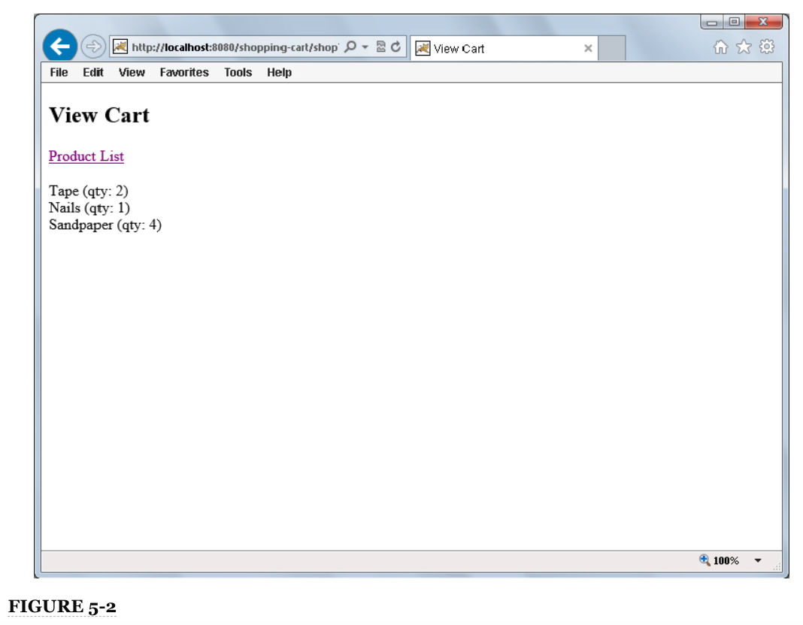
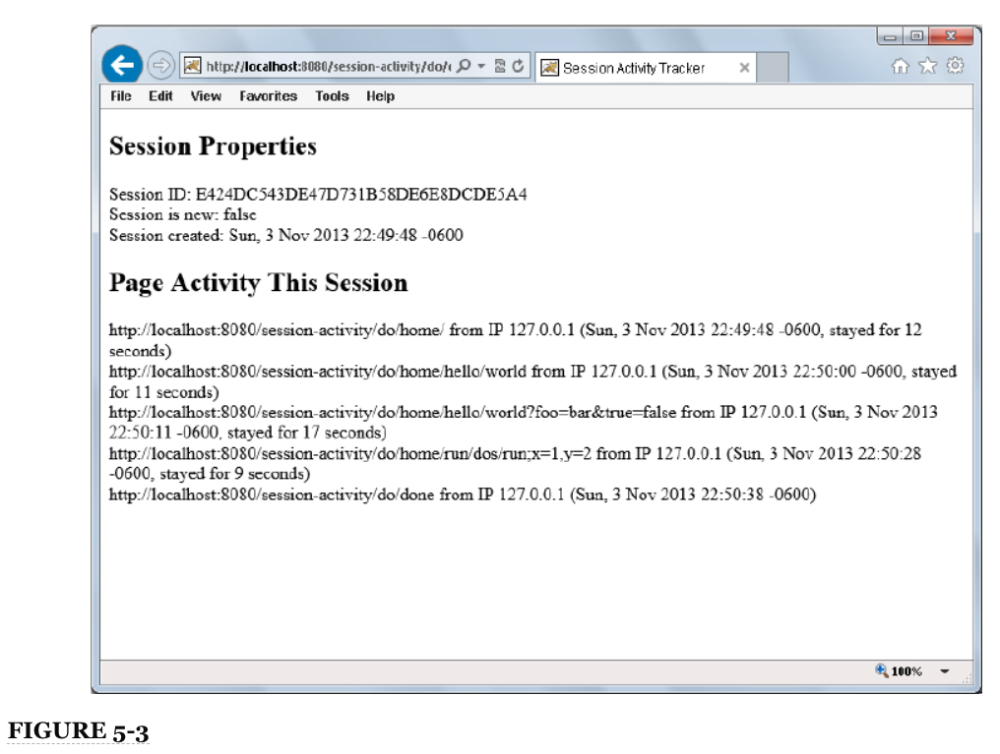
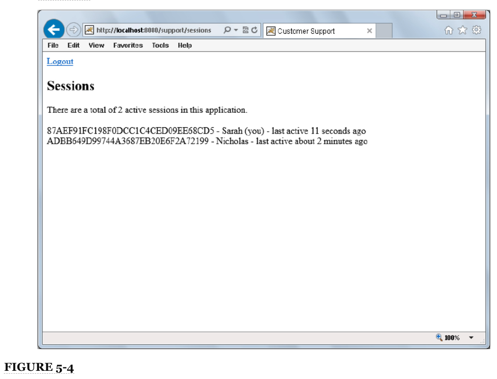
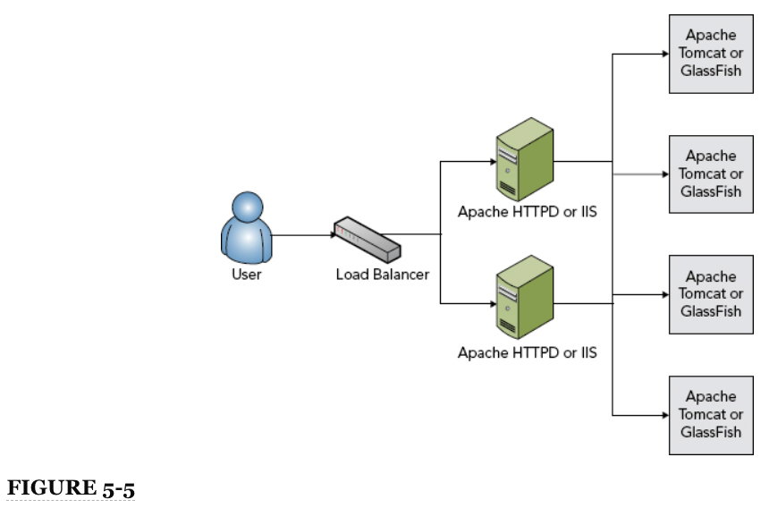

# 5: Mantener el State Usando Sessions

* Entender por qué las Sessions son necesarias
* Uso de Session Cookies y URL Rewriting
* Almacenamiento de Datos en una Session
* Aplicar Sessions de manera útil
* Agrupar(Clustering) una Splicación que usa Sessions
* Resumen

### EN ESTE CAPÍTULO

* Por que las sesiones son necesarias
* Trabajar con cookies y parámetros de URL
* Cómo almacenar datos en una sesión
* Hacer que las sesiones sean útiles
* Cómo agrupar una aplicación que usa sesiones

PROYECTOS PARA ESTE CAPÍTULO

El código de este capítulo se divide en los siguientes ejemplos principales:

* Proyecto de carrito de compras
* Proyecto Sesión-Actividad
* Proyecto Customer-Support-v3

### DEPENDENCIAS DE NEW MAVEN PARA ESTE CAPÍTULO

No hay nuevas dependencias de Maven para este capítulo. Continúe usando las dependencias de Maven presentadas en todos los capítulos anteriores.

## ENTENDIENDO POR QUÉ SON NECESARIAS LAS SESIONES

Hasta ahora, ha aprendido sobre aplicaciones web, contenedores web, Servlets, JSP y cómo funcionan juntos los Servlets y JSP. También ha aprendido sobre el ciclo de vida de una solicitud, y debe quedar claro en este punto que las herramientas que le han presentado hasta ahora no le permiten asociar múltiples solicitudes provenientes del mismo cliente y compartir datos entre esas solicitudes. Podría pensar que puede usar la dirección IP como un identificador único y que todas las solicitudes de una dirección IP dentro de un período de tiempo deben pertenecer al mismo cliente. Desafortunadamente, debido a la traducción de direcciones de red (NAT), esto no es confiable. Miles de estudiantes en un campus universitario pueden, literalmente, usar la misma dirección IP, escondida detrás de un enrutador NAT. Por esta razón, el concepto de sesiones HTTP ha logrado una adopción casi universal por todas las tecnologías del lado del servidor HTTP, y Java EE tiene soporte de sesión escrito en su especificación.

No todas las aplicaciones necesitan sesiones. Los ejemplos de Hello World que ha visto en este libro ciertamente no necesitan sesiones. Hasta ahora, la aplicación de atención al cliente no ha necesitado sesiones. Ha sido más como un tablero de mensajes anónimos. Pero si piensa en los requisitos que Multinational Widget Corporation tiene para su sitio de soporte al cliente, rápidamente se dará cuenta de que en algún momento debe crear cuentas de usuario y esos usuarios deben iniciar sesión en la aplicación. Las solicitudes de asistencia al cliente pueden contener información privada, como archivos de configuración del servidor que otros clientes no deberían ver. Ciertamente, necesita una forma de restringir el acceso a ciertos tickets de soporte para que solo el cliente que publique y los miembros del equipo de soporte del MWC puedan acceder a un ticket determinado. Puede hacer que los usuarios proporcionen un nombre de usuario y una contraseña en cada página a la que acceden, pero es seguro que los clientes no estarán contentos con esa solución.

### ESTADO DE MANTENIMIENTO

Las sesiones se utilizan para mantener el estado entre una solicitud y la siguiente. Las solicitudes HTTP son completamente sin estado por sí mismas. Desde la perspectiva del servidor, la solicitud comienza cuando el navegador web del usuario abre un socket al servidor y finaliza cuando el servidor envía el último paquete al cliente y cierra la conexión. En ese momento, ya no hay un vínculo entre el navegador del usuario y el servidor, y cuando entra la siguiente conexión, no hay forma de vincular la nueva solicitud con la solicitud anterior.

Las aplicaciones a menudo no pueden funcionar correctamente de una manera tan apátrida. Un ejemplo clásico es el sitio web de compras en línea. Casi todos los sitios de compras en línea en estos días requieren que cree un nombre de usuario y una contraseña antes de comprar, pero considere incluso los pocos que no lo hacen. Cuando navega por la tienda, encuentra un producto que le gusta, por lo que agrega ese producto a su carrito de compras. Sigues navegando por la tienda y encuentras otro producto que te gusta. También lo agrega a su carrito de compras. Cuando ve su carrito de compras, ve que ambos productos que agregó permanecen en su carrito de compras. De alguna manera, entre cada solicitud que realizaba, el sitio web sabía que esas solicitudes provenían del mismo navegador en la misma computadora y las asociaba con su carrito de compras. Nadie más puede ver su carrito de compras o los artículos que contiene; está vinculado exclusivamente a su computadora y navegador. Este escenario es una analogía con una experiencia de compra de la vida real. Entras en tu tienda de comestibles favorita y, cuando entras por la puerta, agarras un carrito de compras o una canasta. (Obtienes una sesión del servidor). Caminas por la tienda y recoges artículos sobre la marcha, colocándolos en tu carrito (agregándolos a la sesión). Cuando llegas a la caja registradora, sacas los artículos del carrito y se los entregas al cajero, quien los escanea y toma tu dinero. (Paga usando su sesión). Al salir por la puerta, devuelve su carrito o canasta de compras. (Cierra su navegador o cierra sesión, finalizando su sesión).

En este ejemplo, el carrito o la cesta mantienen su estado mientras camina por la tienda. Sin el carrito, ni usted ni la tienda podrían mantenerse al día con todo lo que necesita para comprar. Si no se mantuviera ningún estado entre solicitudes, tendría que "entrar", tomar un artículo, pagarlo, "salir" (finalizar la solicitud) y repetir todo el proceso nuevamente para cada artículo que desea comprar. Las sesiones son el motor detrás del mantenimiento estado entre solicitudes, y sin ellos la web sería un lugar muy diferente.

### RECORDANDO A LOS USUARIOS

Otro escenario a considerar es el sitio web del foro de usuarios. Casi universalmente en los foros en línea, los usuarios son conocidos por sus nombres de usuario o "identificadores". Cuando un usuario ingresa a los foros, inicia sesión y proporciona un nombre de usuario y una contraseña para demostrar su identidad. (El mérito de la autenticación de nombre de usuario / contraseña como prueba de identidad es un argumento reservado para el Capítulo 25). Desde ese punto, puede agregar hilos en el foro, responder a hilos, participar en mensajes privados con otros usuarios, informar hilos o respuestas a moderadores y posiblemente marque temas como favoritos. Tenga en cuenta que el usuario inició sesión solo una vez durante toda esa línea de tiempo. El sistema necesitaba una forma de recordar quién era entre cada solicitud, y las sesiones lo proporcionaban.

### HABILITAR EL FLUJO DE TRABAJO DE LA APLICACIÓN

A menudo, los usuarios necesitan algún tipo de flujo de trabajo para completar una tarea utilizando una aplicación web avanzada. En el caso de crear un artículo de noticias para su publicación en un sitio de noticias, por ejemplo, el periodista puede ir primero a una pantalla donde puede ingresar un título, un eslogan y un cuerpo y dar formato a los elementos de manera apropiada. En la página siguiente, puede seleccionar una o más fotos asociadas con el artículo e indicar cómo deben mostrarse. También podría subir o grabar algún video para colocarlo en el artículo. Por último, probablemente se le presentará una lista de artículos similares o un campo de búsqueda para encontrar artículos similares de modo que pueda indicar cuáles deben colocarse en un cuadro de Artículos relacionados.

Una vez completados todos estos pasos, se publicaría el artículo. Todo este escenario representa la idea de un flujo de trabajo. El flujo de trabajo contiene muchos pasos, cada paso forma parte de la finalización de una sola tarea. Para unir todos estos pasos para completar el flujo de trabajo, las solicitudes deben tener un estado mantenido entre ellos. El ejemplo del carrito de la compra es en realidad un subconjunto de la idea más amplia de los flujos de trabajo.

## USO DE COOKIES DE SESIÓN Y REESCRIBICIÓN DE URL

Ahora que comprende la importancia de las sesiones, probablemente se esté preguntando cómo funcionan. Hay dos componentes diferentes para esto: primero, la teoría genérica detrás de las sesiones web y cómo se implementan; y segundo, los detalles detrás de la implementación de la sesión en aplicaciones web Java EE. Ambos se tratan en esta sección.

En la teoría general de las sesiones web, una sesión es un archivo, segmento de memoria, objeto o contenedor administrado por el servidor o la aplicación web que contiene varios elementos de datos asignados. Estos elementos de datos pueden ser un nombre de usuario, un carrito de compras, detalles del flujo de trabajo y más. El navegador del usuario no guarda ni mantiene ninguno de estos datos. Es administrado únicamente por el servidor o el código de la aplicación web. La única pieza que falta es un vínculo entre este contenedor y el navegador del usuario. Para este propósito, a las sesiones se les asigna una cadena generada aleatoriamente llamada ID de sesión. La primera vez que se crea una sesión (como resultado de la recepción de una solicitud), el ID de sesión para esa sesión se transmite al navegador del usuario como parte de la respuesta. Cada solicitud posterior del navegador de ese usuario incluye el ID de sesión de alguna manera. Cuando la aplicación recibe la solicitud con el ID de sesión, puede vincular la sesión existente a esa solicitud. Esto se demuestra en la Figura 5-1.

