# Capítulo 9: Mejora de su Aplicación Mediante Filtros

* Comprensión del propósito de los filtros
* Creación, declaración y asignación de filtros
* Ordenar correctamente sus filtros
* Investigación de usos prácticos de filtros
* Simplificar la autenticación con un filtro
* Resumen

#### EN ESTE CAPÍTULO

* El propósito de los filtros
* Cómo crear, declarar y mapear filtros
* Cómo ordenar correctamente sus filtros
* Usar filtros con manejo de solicitudes asincrónicas
* Explorando usos prácticos para filtros
* Usar filtros para simplificar la autenticación

El código de este capítulo se divide en los siguientes ejemplos principales:

* Proyecto de orden de filtro
* Proyecto Filter-Async
* Proyecto de filtro de compresión
* Proyecto Customer-Support-v7

#### DEPENDENCIAS DE NEW MAVEN PARA ESTE CAPÍTULO

No hay nuevas dependencias de Maven para este capítulo. Continúe usando las dependencias de Maven presentadas en todos los capítulos anteriores.

## ENTENDIENDO EL PROPÓSITO DE LOS FILTROS

Los filtros son componentes de la aplicación que pueden interceptar solicitudes de recursos, respuestas de recursos o ambos, y actuar sobre esas solicitudes o respuestas de alguna manera. Los filtros pueden inspeccionar y modificar solicitudes y respuestas, e incluso pueden rechazar, redirigir o reenviar solicitudes.

Una adición relativamente nueva a la especificación de Servlet, los filtros se agregaron en Servlet 2.3, se mejoraron en Servlet 2.4 y no han cambiado mucho desde entonces. La interfaz javax.servlet.Filter es muy simple e involucra HttpServletRequest y HttpServletResponse con las que ya está familiarizado. Al igual que los servlets, los filtros se pueden declarar en el descriptor de implementación, mediante programación o con anotaciones, y pueden tener parámetros de inicio y acceder al ServletContext. El número de usos de los filtros está realmente limitado solo por su imaginación; en esta sección, explora algunas de las aplicaciones más comunes.

### LOGGING FILTERS - FILTROS DE REGISTRO

Los filtros pueden ser especialmente útiles para registrar la actividad en su aplicación. Aprenderá sobre los conceptos y las herramientas involucradas con el registro en el Capítulo 11, pero un escenario que los desarrolladores de aplicaciones a veces enfrentan es la necesidad de registrar cada solicitud en la aplicación y cuál es el resultado de cada solicitud (código de estado, longitud y posiblemente otra información). Por lo general, el contenedor web proporciona funciones para el registro de solicitudes, pero si necesita información de propiedad que se muestre en su registro de solicitudes, puede utilizar un filtro para registrar las solicitudes. También puede usar filtros para agregar información de seguimiento que se usará para todas las operaciones de registro para la solicitud. Esto se llama fish tagging - etiquetado de peces y aprenderá más sobre él en el Capítulo 11.

### AUTHENTICATION FILTERS - FILTROS DE AUTENTICACIÓN

Cuando necesita asegurarse de que solo las personas autorizadas accedan a su aplicación, esto generalmente implica realizar una verificación en cada solicitud para asegurarse de que el usuario haya "iniciado sesión". El significado de ese término puede variar de una aplicación a otra, pero el tedio de realizar esta verificación en cada Servlet es universal. Los filtros pueden facilitar el trabajo al centralizar las verificaciones de autenticación y autorización en una ubicación que intercepta todas las solicitudes seguras.

Al final de este capítulo, agrega un filtro al proyecto de soporte al cliente en curso que hace precisamente esto y elimina el código duplicado en toda la aplicación. En la Parte IV, explora Spring Security y lo usa para agregar autenticación y autorización a sus aplicaciones. Los filtros son la base de Spring Security y constituyen una gran parte de su funcionalidad.

### COMPRESSION AND ENCRYPTION FILTERS - FILTROS DE COMPRESIÓN Y CIFRADO

Aunque no siempre es así (y es cada vez menos común cada día), todavía hay momentos en los que el ancho de banda de Internet es extremadamente limitado y los recursos de la CPU son más abundantes. En estos casos, a menudo es deseable gastar los ciclos de CPU necesarios comprimiendo datos antes de transmitirlos por cable. Puede usar un filtro para lograr esto: cuando llega la solicitud, permanece inalterada, pero cuando la respuesta vuelve al usuario, el filtro la comprime. Esto, por supuesto, requiere que el usuario pueda descomprimir la respuesta. En la sección "Investigación de usos prácticos de los filtros", verá lo que implica escribir un filtro de compresión de respuesta.

Los filtros también pueden ser útiles para manejar el descifrado de solicitudes y el cifrado de respuestas. Normalmente, confía en HTTPS para esto; algo que el contenedor web o el servidor web pueden manejar de forma nativa. Sin embargo, si los consumidores de sus recursos no son un navegador u otro cliente web, sino alguna otra aplicación, podrían emplear un sistema de cifrado patentado que solo entiendan esas dos aplicaciones. En este caso, un filtro es un candidato principal para descifrar las solicitudes a medida que entran y encriptar las respuestas a medida que salen. Comprenda que este es un escenario inusual y que realmente debe confiar en herramientas estándar de la industria, como HTTPS, para proteger las comunicaciones de su aplicación.

### ERROR HANDLING FILTERS - MANEJO DE ERRORES FILTROS

Seamos realistas: por mucho que los desarrolladores de software intenten manejar los errores que surgen durante la ejecución de su software, a veces los errores se escabullen. Cuando el software es un sistema operativo, el síntoma desagradable suele ser una interrupción del sistema, a la que en el mundo de la tecnología se le llama cariñosamente "la pantalla azul de la muerte". Con las aplicaciones de escritorio, el usuario puede recibir un aviso de que "la aplicación se ha cerrado inesperadamente".

Con las aplicaciones web, el resultado suele ser un código de respuesta HTTP de 500, a menudo acompañado de una página HTML simple con las palabras "Error interno del servidor" y alguna información de diagnóstico. Para las aplicaciones que se ejecutan localmente (como en una intranet), esta información de diagnóstico generalmente no es dañina y, de hecho, podría ser útil para que el desarrollador averigüe qué salió mal. Pero para las aplicaciones web que se ejecutan de forma remota, esta información de diagnóstico puede revelar información confidencial del sistema que los piratas informáticos pueden utilizar para comprometer un sistema.

Por estas razones, debe mostrar una página de error genérica más amigable para los usuarios (a menudo con el estilo del resto de su aplicación web) y registrar el error o notificar a un administrador del sistema según sea necesario. Un filtro es la herramienta perfecta para esta tarea. Puede envolver el manejo de solicitudes en un bloque try-catch, capturando y registrando así cualquier error. Esto da como resultado que la solicitud se reenvíe a una página de error genérico que no contiene ningún diagnóstico o información confidencial.

## CREACIÓN, DECLARACIÓN Y MAPEO DE FILTROS

Crear un filtro es tan simple como implementar la interfaz de `Filter`. Su método `init` se llama cuando se inicializa el filtro y proporciona acceso a la configuración del filtro, sus parámetros de inicio y el `ServletContext`, al igual que el método `init` en un Servlet. De manera similar, se llama al método de destrucción cuando se cierra la aplicación web. El método `doFilter` se llama cuando entra una solicitud que se asigna al filtro. Proporciona acceso a los objetos `ServletRequest`, `ServletResponse` y `FilterChain`. Aunque puede usar filtros para filtrar más que solo solicitudes y respuestas HTTP, en realidad, para sus usos, la solicitud siempre es una `HttpServletRequest` y la respuesta siempre es una `HttpServletResponse`. De hecho, por el momento, la especificación de la API de Servlet no admite ningún protocolo además de HTTP. Dentro de `doFilter` puede rechazar la solicitud o continuarla llamando al método `doFilter` del objeto `FilterChain`; puede modificar la solicitud y la respuesta; y puede envolver los objetos de solicitud y respuesta.

### ENTENDIENDO FILTER CHAIN (CADENA DE FILTRO)

Aunque solo un servlet puede manejar una solicitud, cualquier número de filtros puede interceptar una solicitud. La Figura 9-1 demuestra cómo la cadena de filtros acepta una solicitud entrante y la pasa de un filtro a otro hasta que se procesan todos los filtros coincidentes, y finalmente la pasa al Servlet. Llamar a `FilterChain.doFilter()` desencadena la continuación de la cadena de filtros. Si el filtro actual es el último filtro de la cadena, llamar a `FilterChain.doFilter()` devuelve el control al contenedor Servlet, que pasa la solicitud al Servlet. Si el filtro actual no llama a `FilterChain.doFilter()`, la cadena se interrumpe y el Servlet y los filtros restantes nunca manejan la solicitud.

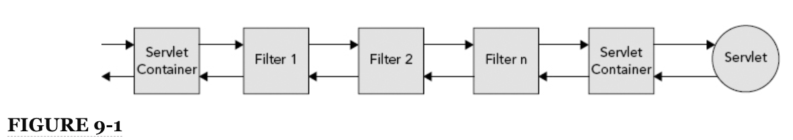

De esta manera, la cadena de filtros es muy parecida a una pila (y, de hecho, la serie de ejecuciones de métodos van en la pila de Java). Cuando entra una solicitud, va al primer filtro, que se agrega a la pila. Cuando ese filtro continúa la cadena, el siguiente filtro se agrega a la pila. Esto continúa hasta que la solicitud va al Servlet, que es el último elemento agregado a la pila. A medida que se completa la solicitud y regresa el método `service` del Servlet, el Servlet se elimina de la pila y el control vuelve al último filtro. Cuando su método `doFilter` regresa, ese filtro se elimina de la pila y el control regresa al filtro anterior. Esto continúa hasta que el control vuelve al primer filtro. Cuando su método `doFilter` regresa, la pila está vacía y el procesamiento de la solicitud se completa. Debido a esto, un filtro puede tomar acción en una solicitud antes y después de que el servlet de destino la atienda.

### MAPEO A URL PATTERNS Y SERVLET NAMES

Al igual que los servlets, los filtros se pueden asignar a patrones de URL. Esto determina qué filtro o filtros interceptarán una solicitud. Cualquier solicitud que coincida con un patrón de URL al que se asigna un filtro primero va a ese filtro antes de ir a cualquier Servlet coincidente. Usando patrones de URL, puede interceptar no solo solicitudes a sus Servlets, sino también a otros recursos, como imágenes, archivos CSS, archivos JavaScript y más.

A veces, la asignación a una URL en particular es inconveniente. Posiblemente tenga varias URL, incluso docenas, que ya están asignadas a un Servlet y también desea asignar un filtro a esas URL. En lugar de asignar su filtro a una URL o URL, puede asignarlo a uno o más nombres de Servlet. Si una solicitud coincide con un Servlet, el contenedor busca los filtros asignados al nombre de ese Servlet y los aplica a la solicitud. Más adelante en esta sección, aprenderá a asignar filtros a URL y nombres de servlet. Ya sea que asigne sus filtros usando patrones de URL, nombres de servlets o ambos, un filtro puede interceptar múltiples patrones de URL y nombres de servlet, y varios filtros pueden interceptar el mismo patrón de URL o nombre de servlet.

#### MAPEO PARA DIFERENTES REQUEST DISPATCHER TYPES

En un contenedor de Servlet, puede enviar solicitudes de varias formas. Existen:

* **Normal requests**: Se originan en el cliente e incluyen una URL dirigida a una aplicación web en particular en el contenedor.
* **Forwarded requests**: Se activan cuando su código llama al método `forward` en un `RequestDispatcher` o usa la etiqueta `<jsp:forward>`. Aunque están relacionados con la solicitud original, se manejan internamente como una solicitud separada.
* **Included requests**: De manera similar, usar `<jsp:include>` y llamar a `include` en un `RequestDispatcher` dan como resultado solicitudes de inclusión internas separadas relacionadas con las solicitudes originales. (Recuerde que esto es contrario a `<%@ include %>`.)
* **Error resource requests**: Son solicitudes a páginas de error para manejar errores HTTP como `404 Not Found, 500 Internal Server Error`, etc.
* **Asynchronous requests**: Estas son solicitudes que se envían desde `AsyncContext` durante el manejo de cualquier otra solicitud.
Antes de Servlet 2.4, los filtros se aplicaban solo a los recursos para solicitudes típicas. Servlet 2.4 agregó la capacidad de asignar filtros a solicitudes reenviadas, incluir solicitudes y recursos de error, ampliando enormemente sus capacidades. En Servlet 3.0 (Java EE 6), el nuevo manejo asincrónico de solicitudes presentó un desafío para los escritores de filtros: debido a que el método de servicio del Servlet regresa antes de que se envíe la respuesta de la solicitud, la capacidad de la cadena de filtros se ve comprometida. Para compensar esto, Servlet 3.0 agregó el nuevo tipo de despachador asincrónico para filtros que interceptan solicitudes enviadas desde AsyncContext. Los filtros asincrónicos deben implementarse con precaución porque pueden invocarse varias veces (potencialmente en diferentes subprocesos) para una sola solicitud asincrónica. Esto se cubre con más detalle en la siguiente sección.

Usted indica a qué tipo o tipos de despachador se debe aplicar un filtro cuando declara y asigna un filtro, sobre lo cual aprenderá en el resto de esta sección.

### USO DEL DEPLOYMENT DESCRIPTOR

Antes de que cualquier filtro que escriba pueda interceptar solicitudes, debe declararlas y mapearlas como lo hace con sus Servlets. Al igual que con los servlets, puede lograr esto de varias formas. La forma tradicional es en el descriptor de implementación usando los elementos `<filter>` y `<filter-mapping>` (análogos a los elementos `<servlet>` y `<servlet-mapping>`). Los elementos `<filter>` deben contener al menos un nombre y una clase, pero también pueden incluir una descripción, un nombre para mostrar, un icono y uno o más parámetros de inicio.

```html
    <filter>
        <filter-name>myFilter</filter-name>
        <filter-class>com.wrox.MyFilter</filter-class>
    </filter>
```
    
El fragmento de código anterior muestra una declaración de filtro simple dentro del descriptor de implementación. A diferencia de los servlets, los filtros no se pueden cargar en la primera solicitud. El método `init` de un filtro siempre se llama al inicio de la aplicación: después de que `ServletContextListener`s se inicialice, antes de Servlets initialize y en el orden en que aparece el filtro en el descriptor de implementación.

Una vez que se ha declarado un filtro, puede asignarlo a cualquier número de URL o Servlet names. Las asignaciones de URL de filtro también pueden incluir comodines, al igual que las asignaciones de URL de Servlet.

```html
    <filter-mapping>
        <filter-name>myFilter</filter-name>
        <url-pattern>/foo</url-pattern>
        <url-pattern>/bar/*</url-pattern>
        <servlet-name>myServlet</servlet-name>
        <dispatcher>REQUEST</dispatcher>
        <dispatcher>ASYNC</dispatcher>
    </filter-mapping>
```

En este caso, el filtro responde a cualquier solicitud a las URL relativas a la aplicación `/foo` y `/bar/*`, así como a cualquier solicitud que termine siendo atendida por el Servlet llamado `myServlet`. Los dos elementos `<dispatcher>` significan que puede responder a solicitudes normales y solicitudes enviadas desde `AsyncContext`. Los tipos de `<dispatcher>` válidos son `REQUEST`, `FORWARD`, `INCLUDE`, `ERROR` y `ASYNC`. Un mapeo de filtro puede tener cero o más elementos `<dispatcher>`. Si no se especifica ninguno, se asume un único despachador `REQUEST` predeterminado.

#### UTILIZAR ANOTACIONES

Al igual que con los Servlets, puede declarar y asignar filtros mediante anotaciones. La anotación `@javax.servlet.annotation.WebFilter` contiene atributos que sustituyen a todas las opciones en el descriptor de implementación. El siguiente código tiene el efecto equivalente de la declaración de filtro anterior y la asignación en el descriptor de implementación:

```java
@WebFilter(
        filterName = "myFilter",
        urlPatterns = { "/foo", "/bar/*" },
        servletNames = { "myServlet" },
        dispatcherTypes = { DispatcherType.REQUEST, DispatcherType.ASYNC }
)
public class MyFilter implements Filter
```

La principal desventaja de usar anotaciones para declarar y mapear filtros es la imposibilidad de ordenar esos filtros en la cadena de filtros. Los filtros tienen un orden particular (que aprenderá en la siguiente sección) que es muy importante para su interacción adecuada. Si desea controlar el orden en el que se ejecutan sus filtros sin usar el deployment descriptor, debe usar la configuración programática. Con suerte, el futuro Java EE 8 incluirá la capacidad de solicitar filtros anotados.

#### UTILIZAR LA CONFIGURACIÓN PROGRAMÁTICA

Puede configurar filtros mediante programación con `ServletContext`, al igual que Servlets, oyentes y otros componentes. En lugar de usar el descriptor de implementación o las anotaciones, puede llamar a métodos en `ServletContext` para registrar y asignar filtros. Debido a que esto debe hacerse antes de que el ServletContext termine de iniciarse, generalmente se logra dentro del método `contextInitialized` de un `ServletContextListener`. (También puede agregar filtros dentro del método `onStartup` de un `ServletContainerInitializer`, sobre el cual aprenderá más en la Parte II).

```java
@WebListener
public class Configurator implements ServletContextListener
{
    @Override
    public void contextInitialized(ServletContextEvent event)
    {
        ServletContext context = event.getServletContext();
 
        FilterRegistration.Dynamic registration =
                context.addFilter("myFilter", new MyFilter());
        registration.addMappingForUrlPatterns(
                EnumSet.of(DispatcherType.REQUEST, DispatcherType.ASYNC),
                false, "/foo", "/bar/*"
        );
        registration.addMappingForServletNames(
                EnumSet.of(DispatcherType.REQUEST, DispatcherType.ASYNC),
                false, "myServlet"
        );
    }
}
```

En este ejemplo, el filtro se agrega al `ServletContext` usando el método `addFilter`. Esto devuelve un `javax.servlet.FilterRegistration.Dynamic`, que puede usar para agregar asignaciones de filtros para patrones de URL y nombres de servlet. Los métodos `addMappingForUrlPatterns` y `addMappingForServletNames` aceptan un conjunto de `javax.servlet.DispatcherTypes` como primer argumento. Al igual que con el descriptor de implementación, si el argumento de tipos de despachador es nulo, se asume el despachador de `REQUEST` predeterminado:

```java
   registration.addMappingForUrlPatterns(null, false, "/foo", "bar/*");
```

El segundo parámetro del método indica el orden del filtro en relación con los filtros en el deployment descriptor. Si es falso (como en este caso), la asignación de filtro programática se ordena antes de cualquier asignación de filtro en el descriptor de implementación. Si es verdadero, las asignaciones en el descriptor de implementación son lo primero. Aprenderá más sobre el orden de los filtros en la siguiente sección. El parámetro final es un parámetro vararg para especificar los patrones de URL (para `addMappingForUrlPatterns`) o los nombres de servlet (para `addMappingForServletNames`) para asignar el filtro.

## ORDENAR SUS FILTERS ADECUADAMENTE

Hasta ahora, a lo largo de este capítulo, ha visto varias referencias al orden de los filtros, pero sin duda se está preguntando qué es exactamente. El orden de los filtros determina en qué parte de la filter chain (cadena de filtros) aparece un filtro, que a su vez determina cuándo un filtro procesa una solicitud en relación con otros filtros. En algunos casos, no importa en qué orden procesen las solicitudes sus filtros; en otros casos, sin embargo, puede ser crítico, depende completamente de cómo esté usando los filtros. Por ejemplo, un filtro que configura la información de registro para una solicitud (o ingresa la solicitud en un registro) probablemente debería ir antes que cualquier otro filtro porque otros filtros podrían alterar el destino de la solicitud. Como se mencionó anteriormente, no puede ordenar filtros declarados usando anotaciones, lo que los hace virtualmente inútiles para la mayoría de las aplicaciones empresariales. Utilizará ampliamente el deployment descriptor o la configuración programática, pero probablemente nunca utilice anotaciones para configurar filtros.

### URL PATTERN MAPPING VERSUS SERVLET NAME MAPPING

Definir el orden de los filtros es simple: los filtros que coinciden con una solicitud se agregan a la filter chain en el orden en que aparecen sus asignaciones en el deployment descriptor o en la configuración programática. (Y recuerde, si configura algunos filtros en el deployment descriptor y otros mediante programación, puede determinar si una asignación programática viene antes que las asignaciones XML utilizando el segundo argumento de los métodos `addMapping*`). El orden de los filtros se muestra en la Figura 9-2, donde diferentes solicitudes coinciden con diferentes filtros pero siempre en el mismo orden. Sin embargo, el orden no es tan simple: las asignaciones de URL tienen preferencia sobre las asignaciones de nombres de Servlet. Si dos filtros coinciden con una solicitud, uno por un patrón de URL y el otro por un nombre de Servlet, el filtro que coincide con el patrón de URL siempre está presente en la chain(cadena) *antes* del filtro que coincide con el nombre de Servlet, como se muestra en la Figura 9-3. incluso si su mapeo aparece después. Para demostrar esto, considere las siguientes mappings (asignaciones):

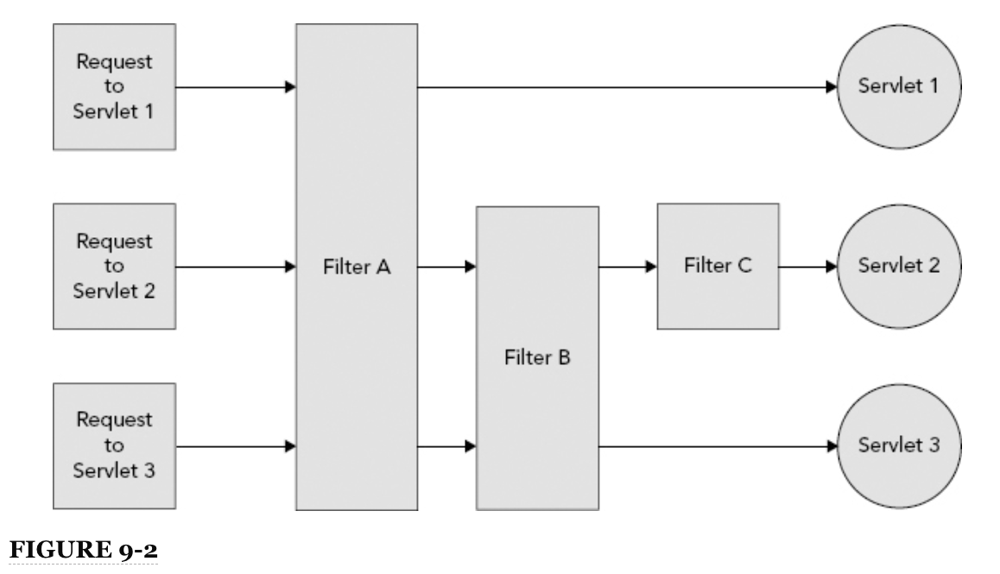

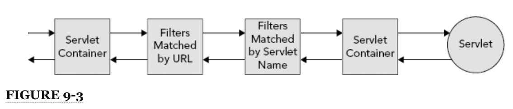

```java
    <servlet-mapping>
        <servlet-name>myServlet</servlet-name>
        <url-pattern>/foo*</url-pattern>
    </servlet-mapping>
 
    <filter-mapping>
        <filter-name>servletFilter</filter-name>
        <servlet-name>myServlet</servlet-name>
    </filter-mapping>
    
    <filter-mapping>
        <filter-name>myFilter</filter-name>
        <url-pattern>/foo*</url-pattern>
    </filter-mapping>
    
    <filter-mapping>
        <filter-name>anotherFilter</filter-name>
        <url-pattern>/foo/bar</url-pattern>
    </filter-mapping>
```

Si llega una solicitud normal a la URL `/foo/bar`, coincidirá con los tres filtros. La filter chain (cadena de filtros) constará, en orden, de `myFilter`, `anotherFilter` y luego `servletFilter.myFilter` se ejecuta antes que `anotherFilter` porque ese es el orden en el que aparecen en el deployment descriptor. Ambos se ejecutan antes de `servletFilter` porque las asignaciones de URL siempre vienen antes que las asignaciones de nombres de servlet. Si la solicitud es un envío de reenvío, inclusión, error o envío asíncrono, no coincidirá con ninguno de estos filtros, porque las asignaciones no especifican ningún `<dispatcher>` explícitamente.

#### EXPLORANDO EL ORDEN DEL FILTRO CON UN EJEMPLO SIMPLE

Para comprender mejor cómo funciona el orden de filtro, eche un vistazo al proyecto **950-09-01-FILTER-ORDER**. Contiene tres servlets y tres filtros. El siguiente fragmento de código, `ServletOne`, es idéntico a sus homólogos `ServletTwo` y `ServletThree`, excepto que todas las apariciones de "One" se han reemplazado por "Two" y "Three", respectivamente:


`pom.xml`

```html
<?xml version="1.0" encoding="UTF-8"?>
<project xmlns="http://maven.apache.org/POM/4.0.0"
         xmlns:xsi="http://www.w3.org/2001/XMLSchema-instance"
         xsi:schemaLocation="http://maven.apache.org/POM/4.0.0
                             http://maven.apache.org/xsd/maven-4.0.0.xsd">
    <modelVersion>4.0.0</modelVersion>

    <groupId>com.wrox</groupId>
    <artifactId>filter-order</artifactId>
    <version>1.0.0.SNAPSHOT</version>
    <packaging>war</packaging>

    <properties>
        <project.build.sourceEncoding>UTF-8</project.build.sourceEncoding>
    </properties>

    <dependencies>
        <dependency>
            <groupId>javax.servlet</groupId>
            <artifactId>javax.servlet-api</artifactId>
            <version>3.1.0</version>
            <scope>provided</scope>
        </dependency>

        <dependency>
            <groupId>javax.servlet.jsp</groupId>
            <artifactId>javax.servlet.jsp-api</artifactId>
            <version>2.3.1</version>
            <scope>provided</scope>
        </dependency>

        <dependency>
            <groupId>javax.el</groupId>
            <artifactId>javax.el-api</artifactId>
            <version>3.0.0</version>
            <scope>provided</scope>
        </dependency>

        <dependency>
            <groupId>javax.servlet.jsp.jstl</groupId>
            <artifactId>javax.servlet.jsp.jstl-api</artifactId>
            <version>1.2.1</version>
            <scope>compile</scope>
        </dependency>
		
        <dependency>
            <groupId>org.glassfish.web</groupId>
            <artifactId>javax.servlet.jsp.jstl</artifactId>
            <version>1.2.2</version>
            <scope>compile</scope>
            <exclusions>
                <exclusion>
                    <groupId>javax.servlet</groupId>
                    <artifactId>servlet-api</artifactId>
                </exclusion>
                <exclusion>
                    <groupId>javax.servlet.jsp</groupId>
                    <artifactId>jsp-api</artifactId>
                </exclusion>
                <exclusion>
                    <groupId>javax.servlet.jsp.jstl</groupId>
                    <artifactId>jstl-api</artifactId>
                </exclusion>
            </exclusions>
        </dependency>

        <dependency>
            <groupId>org.apache.commons</groupId>
            <artifactId>commons-lang3</artifactId>
            <version>3.3.2</version>
            <scope>compile</scope>
        </dependency>
    </dependencies>

    <build>
        <sourceDirectory>source/production/java</sourceDirectory>
        <resources>
            <resource>
                <directory>source/production/resources</directory>
            </resource>
        </resources>

        <testSourceDirectory>source/test/java</testSourceDirectory>
        <testResources>
            <testResource>
                <directory>source/test/resources</directory>
            </testResource>
        </testResources>

        <plugins>
            <plugin>
                <groupId>org.apache.maven.plugins</groupId>
                <artifactId>maven-war-plugin</artifactId>
                <version>2.3</version>
                <configuration>
                    <warSourceDirectory>web</warSourceDirectory>
                </configuration>
            </plugin>
            <plugin>
                <groupId>org.apache.maven.plugins</groupId>
                <artifactId>maven-compiler-plugin</artifactId>
                <version>3.1</version>
                <configuration>
                    <source>1.8</source>
                    <target>1.8</target>
                </configuration>
            </plugin>
        </plugins>
    </build>

</project>
```

`web.xml`

```html
<?xml version="1.0" encoding="UTF-8"?>
<web-app xmlns="http://xmlns.jcp.org/xml/ns/javaee"
         xmlns:xsi="http://www.w3.org/2001/XMLSchema-instance"
         xsi:schemaLocation="http://xmlns.jcp.org/xml/ns/javaee
                             http://xmlns.jcp.org/xml/ns/javaee/web-app_3_1.xsd"
         version="3.1">

    <display-name>Filter Order Application</display-name>

    <filter>
        <filter-name>filterA</filter-name>
        <filter-class>com.wrox.FilterA</filter-class>
    </filter>

    <filter-mapping>
        <filter-name>filterA</filter-name>
        <url-pattern>/*</url-pattern>
    </filter-mapping>

    <filter>
        <filter-name>filterB</filter-name>
        <filter-class>com.wrox.FilterB</filter-class>
    </filter>

    <filter-mapping>
        <filter-name>filterB</filter-name>
        <url-pattern>/servletTwo</url-pattern>
        <url-pattern>/servletThree</url-pattern>
    </filter-mapping>

    <filter>
        <filter-name>filterC</filter-name>
        <filter-class>com.wrox.FilterC</filter-class>
    </filter>

    <filter-mapping>
        <filter-name>filterC</filter-name>
        <url-pattern>/servletTwo</url-pattern>
    </filter-mapping>

</web-app>
```

`ServletOne`

```java
package com.wrox;

import javax.servlet.ServletException;
import javax.servlet.annotation.WebServlet;
import javax.servlet.http.HttpServlet;
import javax.servlet.http.HttpServletRequest;
import javax.servlet.http.HttpServletResponse;
import java.io.IOException;

@WebServlet(name = "servletOne", urlPatterns = "/servletOne")
public class ServletOne extends HttpServlet
{
    @Override
    protected void doGet(HttpServletRequest request, HttpServletResponse response)
            throws ServletException, IOException
    {
        System.out.println("Entering ServletOne.doGet().");
        response.getWriter().write("Servlet One");
        System.out.println("Leaving ServletOne.doGet().");
    }
}
```

`ServletTwo`

```java
package com.wrox;

import javax.servlet.ServletException;
import javax.servlet.annotation.WebServlet;
import javax.servlet.http.HttpServlet;
import javax.servlet.http.HttpServletRequest;
import javax.servlet.http.HttpServletResponse;
import java.io.IOException;

@WebServlet(name = "servletTwo", urlPatterns = "/servletTwo")
public class ServletTwo extends HttpServlet
{
    @Override
    protected void doGet(HttpServletRequest request, HttpServletResponse response)
            throws ServletException, IOException
    {
        System.out.println("Entering ServletTwo.doGet().");
        response.getWriter().write("Servlet Two");
        System.out.println("Leaving ServletTwo.doGet().");
    }
}
```

`ServletThree`

```java
package com.wrox;

import javax.servlet.ServletException;
import javax.servlet.annotation.WebServlet;
import javax.servlet.http.HttpServlet;
import javax.servlet.http.HttpServletRequest;
import javax.servlet.http.HttpServletResponse;
import java.io.IOException;

@WebServlet(name = "servletThree", urlPatterns = "/servletThree")
public class ServletThree extends HttpServlet
{
    @Override
    protected void doGet(HttpServletRequest request, HttpServletResponse response)
            throws ServletException, IOException
    {
        System.out.println("Entering ServletThree.doGet().");
        response.getWriter().write("Servlet Three");
        System.out.println("Leaving ServletThree.doGet().");
    }
}
```

`FilterA.java`

```java
package com.wrox;

import javax.servlet.Filter;
import javax.servlet.FilterChain;
import javax.servlet.FilterConfig;
import javax.servlet.ServletException;
import javax.servlet.ServletRequest;
import javax.servlet.ServletResponse;
import java.io.IOException;

public class FilterA implements Filter
{
    @Override
    public void doFilter(ServletRequest request, ServletResponse response,
                         FilterChain chain) throws IOException, ServletException
    {
        System.out.println("Entering FilterA.doFilter().");
        chain.doFilter(request, response);
        System.out.println("Leaving FilterA.doFilter().");
    }

    @Override
    public void init(FilterConfig config) throws ServletException { }

    @Override
    public void destroy() { }
}
```

`FilterB.java`

```java
package com.wrox;

import javax.servlet.Filter;
import javax.servlet.FilterChain;
import javax.servlet.FilterConfig;
import javax.servlet.ServletException;
import javax.servlet.ServletRequest;
import javax.servlet.ServletResponse;
import java.io.IOException;

public class FilterB implements Filter
{
    @Override
    public void doFilter(ServletRequest request, ServletResponse response,
                         FilterChain chain) throws IOException, ServletException
    {
        System.out.println("Entering FilterB.doFilter().");
        chain.doFilter(request, response);
        System.out.println("Leaving FilterB.doFilter().");
    }

    @Override
    public void init(FilterConfig config) throws ServletException { }

    @Override
    public void destroy() { }
}
```

`FilterC.java`

```java
package com.wrox;

import javax.servlet.Filter;
import javax.servlet.FilterChain;
import javax.servlet.FilterConfig;
import javax.servlet.ServletException;
import javax.servlet.ServletRequest;
import javax.servlet.ServletResponse;
import java.io.IOException;

public class FilterC implements Filter
{
    @Override
    public void doFilter(ServletRequest request, ServletResponse response,
                         FilterChain chain) throws IOException, ServletException
    {
        System.out.println("Entering FilterC.doFilter().");
        chain.doFilter(request, response);
        System.out.println("Leaving FilterC.doFilter().");
    }

    @Override
    public void init(FilterConfig config) throws ServletException { }

    @Override
    public void destroy() { }
}
```

Para probar esto:

1. Compile la aplicación e inicie Tomcat desde su IDE.
2. Vaya a `http://localhost:8080/filters/servletOne` en su navegador. Puede ver varios mensajes impresos en la salida estándar de Tomcat en su IDE:

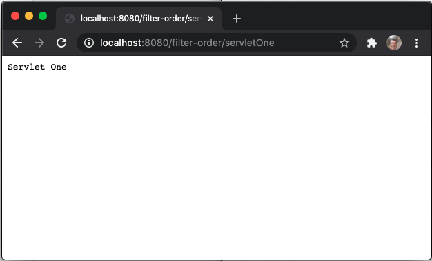

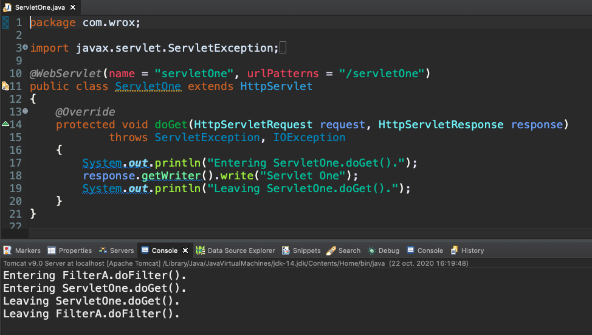

```sh
Entering FilterA.doFilter().
Entering ServletOne.doGet().
Leaving ServletOne.doGet().
Leaving FilterA.doFilter().
```

3. Cambie la dirección en su navegador a `http://localhost:8080/filters/servletTwo` y observe la nueva salida:

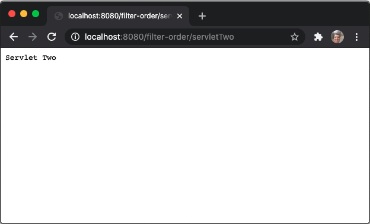

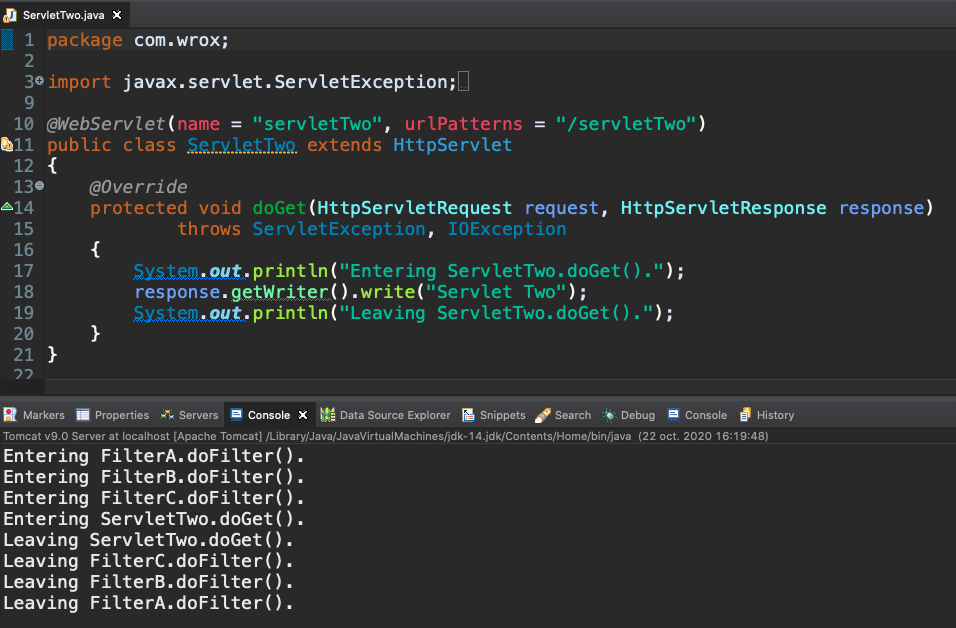

```sh
Entering FilterA.doFilter().
Entering FilterB.doFilter().
Entering FilterC.doFilter().
Entering ServletTwo.doGet().
Leaving ServletTwo.doGet().
Leaving FilterC.doFilter().
Leaving FilterB.doFilter().
Leaving FilterA.doFilter().
```

Observe cómo la Filter chain progresa de A a C y luego al servlet. Luego, después de que el Servlet completa el procesamiento de la solicitud, la cadena sale en orden inverso de C a A.

4. Cambie la dirección en su navegador a `http://localhost:8080/filters/servletThree`. Su salida debería verse como el siguiente código.

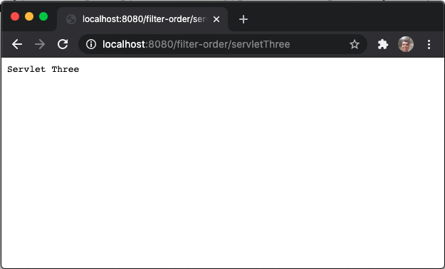

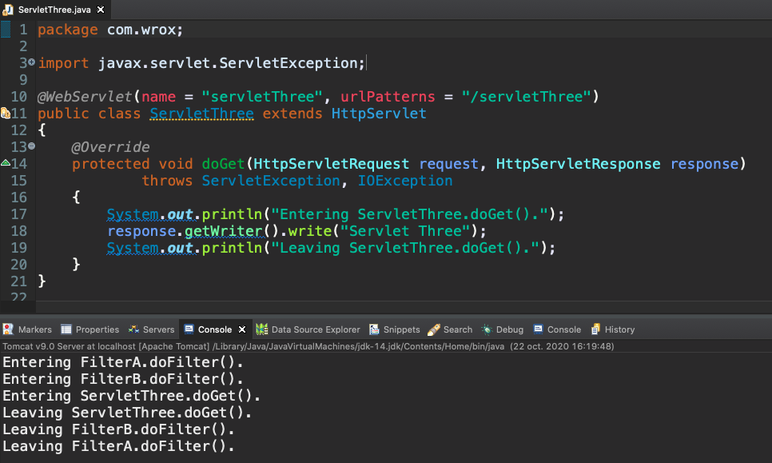

```sh
Entering FilterA.doFilter().
Entering FilterB.doFilter().
Entering ServletThree.doGet().
Leaving ServletThree.doGet().
Leaving FilterB.doFilter().
Leaving FilterA.doFilter().
```

5. Realice los cambios que se le ocurran en las asignaciones para explorar cómo afecta la ejecución de la filter chain. Intente cambiar una o más de las asignaciones de URL a asignaciones de nombres de servlet y observe cómo cambia la filter chain nuevamente.

#### UTILIZAR FILTROS CON MANEJO ASÍNCRONO DE SOLICITUDES

Como se mencionó en la sección anterior, los filtros que se aplican al manejo de solicitudes asincrónicas pueden ser difíciles de implementar y configurar correctamente. El problema clave con el manejo de solicitudes asincrónicas es que el método `service` del servlet puede regresar antes de que se envíe una respuesta al cliente. El manejo de solicitudes se puede delegar a otro hilo o completar en función de algún evento.

Por ejemplo, el método de servicio (o, por extensión, `doGet`, `doPost` u otro método) podría iniciar `AsyncContext`, registrar un oyente para algún tipo de mensaje hipotético (como una solicitud de chat recibida) y luego regresar. Luego, cuando el oyente de mensajes hipotéticos recibe un mensaje, podría enviar la respuesta al usuario. Con esta técnica, un subproceso de solicitud no se bloquea en espera mientras el manejo de la solicitud está en pausa. Un filtro que intercepta una solicitud de este tipo se completará antes de que se envíe la respuesta porque cuando el servicio regresa, el método doChain de FilterChain regresa.

Los filtros mapeados al `ASYNC` dispatcher interceptan las solicitudes internas realizadas como resultado de llamar a uno de los métodos `dispatch` de `AsyncContext`. Para demostrar este filtrado más complejo, consulte el proyecto **950-09-02-FILTER-ASYNC**. Su `AnyRequestFilter` envuelve la solicitud y la respuesta (algo que explorará más en la siguiente sección) y puede filtrar cualquier tipo de solicitud. Si detecta que el Servlet inició un `AsyncContext`, imprime esa información e indica si el `AsyncContext` está usando la solicitud y respuesta original o la solicitud y respuesta no envuelta.


`pom.xml`

```html
<?xml version="1.0" encoding="UTF-8"?>
<project xmlns="http://maven.apache.org/POM/4.0.0"
         xmlns:xsi="http://www.w3.org/2001/XMLSchema-instance"
         xsi:schemaLocation="http://maven.apache.org/POM/4.0.0
                             http://maven.apache.org/xsd/maven-4.0.0.xsd">
    <modelVersion>4.0.0</modelVersion>

    <groupId>com.wrox</groupId>
    <artifactId>filter-async</artifactId>
    <version>1.0.0.SNAPSHOT</version>
    <packaging>war</packaging>

    <properties>
        <project.build.sourceEncoding>UTF-8</project.build.sourceEncoding>
    </properties>

    <dependencies>
        <dependency>
            <groupId>javax.servlet</groupId>
            <artifactId>javax.servlet-api</artifactId>
            <version>3.1.0</version>
            <scope>provided</scope>
        </dependency>

        <dependency>
            <groupId>javax.servlet.jsp</groupId>
            <artifactId>javax.servlet.jsp-api</artifactId>
            <version>2.3.1</version>
            <scope>provided</scope>
        </dependency>

        <dependency>
            <groupId>javax.el</groupId>
            <artifactId>javax.el-api</artifactId>
            <version>3.0.0</version>
            <scope>provided</scope>
        </dependency>

        <dependency>
            <groupId>javax.servlet.jsp.jstl</groupId>
            <artifactId>javax.servlet.jsp.jstl-api</artifactId>
            <version>1.2.1</version>
            <scope>compile</scope>
        </dependency>
		
        <dependency>
            <groupId>org.glassfish.web</groupId>
            <artifactId>javax.servlet.jsp.jstl</artifactId>
            <version>1.2.2</version>
            <scope>compile</scope>
            <exclusions>
                <exclusion>
                    <groupId>javax.servlet</groupId>
                    <artifactId>servlet-api</artifactId>
                </exclusion>
                <exclusion>
                    <groupId>javax.servlet.jsp</groupId>
                    <artifactId>jsp-api</artifactId>
                </exclusion>
                <exclusion>
                    <groupId>javax.servlet.jsp.jstl</groupId>
                    <artifactId>jstl-api</artifactId>
                </exclusion>
            </exclusions>
        </dependency>

        <dependency>
            <groupId>org.apache.commons</groupId>
            <artifactId>commons-lang3</artifactId>
            <version>3.3.2</version>
            <scope>compile</scope>
        </dependency>
    </dependencies>

    <build>
        <sourceDirectory>source/production/java</sourceDirectory>
        <resources>
            <resource>
                <directory>source/production/resources</directory>
            </resource>
        </resources>

        <testSourceDirectory>source/test/java</testSourceDirectory>
        <testResources>
            <testResource>
                <directory>source/test/resources</directory>
            </testResource>
        </testResources>

        <plugins>
            <plugin>
                <groupId>org.apache.maven.plugins</groupId>
                <artifactId>maven-war-plugin</artifactId>
                <version>2.3</version>
                <configuration>
                    <warSourceDirectory>web</warSourceDirectory>
                </configuration>
            </plugin>
            <plugin>
                <groupId>org.apache.maven.plugins</groupId>
                <artifactId>maven-compiler-plugin</artifactId>
                <version>3.1</version>
                <configuration>
                    <source>1.8</source>
                    <target>1.8</target>
                </configuration>
            </plugin>
        </plugins>
    </build>

</project>
```

`web.xml`

```html
<?xml version="1.0" encoding="UTF-8"?>
<web-app xmlns="http://xmlns.jcp.org/xml/ns/javaee"
         xmlns:xsi="http://www.w3.org/2001/XMLSchema-instance"
         xsi:schemaLocation="http://xmlns.jcp.org/xml/ns/javaee
                             http://xmlns.jcp.org/xml/ns/javaee/web-app_3_1.xsd"
         version="3.1">

    <display-name>Filter Async Application</display-name>

    <filter>
        <filter-name>normalFilter</filter-name>
        <filter-class>com.wrox.AnyRequestFilter</filter-class>
        <async-supported>true</async-supported>
    </filter>

    <filter-mapping>
        <filter-name>normalFilter</filter-name>
        <url-pattern>/*</url-pattern>
        <dispatcher>REQUEST</dispatcher>
    </filter-mapping>

    <filter>
        <filter-name>forwardFilter</filter-name>
        <filter-class>com.wrox.AnyRequestFilter</filter-class>
        <async-supported>true</async-supported>
    </filter>

    <filter-mapping>
        <filter-name>forwardFilter</filter-name>
        <url-pattern>/*</url-pattern>
        <dispatcher>FORWARD</dispatcher>
    </filter-mapping>

    <filter>
        <filter-name>asyncFilter</filter-name>
        <filter-class>com.wrox.AnyRequestFilter</filter-class>
        <async-supported>true</async-supported>
    </filter>

    <filter-mapping>
        <filter-name>asyncFilter</filter-name>
        <url-pattern>/*</url-pattern>
        <dispatcher>ASYNC</dispatcher>
    </filter-mapping>

</web-app>
```

`AnyRequestFilter.java`

```java
package com.wrox;

import javax.servlet.AsyncContext;
import javax.servlet.Filter;
import javax.servlet.FilterChain;
import javax.servlet.FilterConfig;
import javax.servlet.ServletException;
import javax.servlet.ServletRequest;
import javax.servlet.ServletResponse;
import javax.servlet.http.HttpServletRequest;
import javax.servlet.http.HttpServletRequestWrapper;
import javax.servlet.http.HttpServletResponse;
import javax.servlet.http.HttpServletResponseWrapper;
import java.io.IOException;

public class AnyRequestFilter implements Filter
{
    private String name;

    @Override
    public void init(FilterConfig config)
    {
        this.name = config.getFilterName();
    }

    @Override
    public void doFilter(ServletRequest request, ServletResponse response,
                         FilterChain chain) throws IOException, ServletException
    {
        System.out.println("Entering " + this.name + ".doFilter().");
        chain.doFilter(
                new HttpServletRequestWrapper((HttpServletRequest)request),
                new HttpServletResponseWrapper((HttpServletResponse)response)
        );
        if(request.isAsyncSupported() && request.isAsyncStarted())
        {
            AsyncContext context = request.getAsyncContext();
            System.out.println("Leaving " + this.name + ".doFilter(), async " +
                    "context holds wrapped request/response = " +
                    !context.hasOriginalRequestAndResponse());
        }
        else
            System.out.println("Leaving " + this.name + ".doFilter().");
    }

    @Override
    public void destroy() { }
}
```

`NonAsyncServlet.java`

```java
package com.wrox;

import javax.servlet.ServletException;
import javax.servlet.annotation.WebServlet;
import javax.servlet.http.HttpServlet;
import javax.servlet.http.HttpServletRequest;
import javax.servlet.http.HttpServletResponse;
import java.io.IOException;

@WebServlet(name = "nonAsyncServlet", urlPatterns = "/regular")
public class NonAsyncServlet extends HttpServlet
{
    @Override
    protected void doGet(HttpServletRequest request, HttpServletResponse response)
            throws ServletException, IOException
    {
        System.out.println("Entering NonAsyncServlet.doGet().");
        request.getRequestDispatcher("/WEB-INF/jsp/view/nonAsync.jsp")
                .forward(request, response);
        System.out.println("Leaving NonAsyncServlet.doGet().");
    }
}

```

`AsyncServlet.java`

```java
package com.wrox;

import javax.servlet.AsyncContext;
import javax.servlet.ServletException;
import javax.servlet.annotation.WebServlet;
import javax.servlet.http.HttpServlet;
import javax.servlet.http.HttpServletRequest;
import javax.servlet.http.HttpServletResponse;
import java.io.IOException;

@WebServlet(name = "asyncServlet", urlPatterns = "/async", asyncSupported = true)
public class AsyncServlet extends HttpServlet
{
    private static volatile int ID = 1;

    @Override
    protected void doGet(HttpServletRequest request, HttpServletResponse response)
            throws ServletException, IOException
    {
        final int id;
        synchronized(AsyncServlet.class)
        {
            id = ID++;
        }
        long timeout = request.getParameter("timeout") == null ?
                10_000L : Long.parseLong(request.getParameter("timeout"));

        System.out.println("Entering AsyncServlet.doGet(). Request ID = " + id +
                ", isAsyncStarted = " + request.isAsyncStarted());

        final AsyncContext context = request.getParameter("unwrap") != null ?
                request.startAsync() : request.startAsync(request, response);
        context.setTimeout(timeout);

        System.out.println("Starting asynchronous thread. Request ID = " + id +
                ".");

        AsyncThread thread = new AsyncThread(id, context);
        context.start(thread::doWork);

        System.out.println("Leaving AsyncServlet.doGet(). Request ID = " + id +
                ", isAsyncStarted = " + request.isAsyncStarted());
    }

    private static class AsyncThread
    {
        private final int id;
        private final AsyncContext context;

        public AsyncThread(int id, AsyncContext context)
        {
            this.id = id;
            this.context = context;
        }

        public void doWork()
        {
            System.out.println("Asynchronous thread started. Request ID = " +
                    this.id + ".");

            try {
                Thread.sleep(5_000L);
            } catch (Exception e) {
                e.printStackTrace();
            }

            HttpServletRequest request =
                    (HttpServletRequest)this.context.getRequest();
            System.out.println("Done sleeping. Request ID = " + this.id +
                    ", URL = " + request.getRequestURL() + ".");

            this.context.dispatch("/WEB-INF/jsp/view/async.jsp");

            System.out.println("Asynchronous thread completed. Request ID = " +
                    this.id + ".");
        }
    }
}
```

`async.jsp`

```html
<% System.out.println("In async.jsp."); %>
Async JSP
```

`nonAsync.jsp`

```html
<% System.out.println("In nonAsync.jsp."); %>
Non-Async JSP
```

Este filtro se crea una instancia y se mappean tres veces en `web.xml`. Las tres asignaciones pueden interceptar cualquier URL, pero la instancia `normalFilter` solo intercepta solicitudes normales; `forwardFilter` solo intercepta solicitudes reenviadas; y `asyncFilter` solo intercepta solicitudes enviadas desde `AsyncContext`. Observe la adición de `<async-supported>true</async-supported>` a cada elemento `<filter>`. Esto le dice al contenedor que el filtro está preparado para solicitudes asincrónicas. Si un filtro sin `<async-supported>` habilitado filtra una solicitud, intentar iniciar un `AsyncContext` en esa solicitud resultará en una `IllegalStateException`.

`NonAsyncServlet` es muy sencillo: responde a las solicitudes de `/regular` y las reenvía a la vista `nonAsync.jsp`.

`AsyncServlet` es mucho más complejo. Para que el registro sea muy claro, genera una ID única para la solicitud actual. Si el parámetro `unwrap` no está presente, inicia `AsyncContext` con `startAsync` (`ServletRequest`, `ServletResponse`). Esto asegura que `AsyncContext` obtenga la solicitud y la respuesta tal como se pasa a `doGet`. Si un filtro envolvió la solicitud o respuesta, el envoltorio es lo que usa `AsyncContext`. Sin embargo, si el `unwrap` está presente, `doGet` inicia `AsyncContext` utilizando el método `startAsync` sin argumentos. En este caso, `AsyncContext` obtiene la solicitud y la respuesta originales, no los request y response wrapped. Observe la llamada al método `start`(`Runnable`) de `AsyncContext` (usando referencias de método Java 8). El uso de esto le dice al contenedor que ejecute `Runnable` con su grupo de subprocesos interno. También puede simplemente iniciar su propio hilo, pero usar el grupo de hilos del contenedor es más seguro y evita el agotamiento de los recursos.

Ahora experimente con estos Servlets y filtros:

1. Compile la aplicación e inicie Tomcat desde su IDE; luego vaya a `http://localhost:8080/filter-async/regular` en su navegador. Debería ver lo siguiente en la ventana de salida del depurador. Observe que `normalFilter` interceptó el request del Servlet y `forwardFilter` interceptó la solicitud reenviada al JSP.

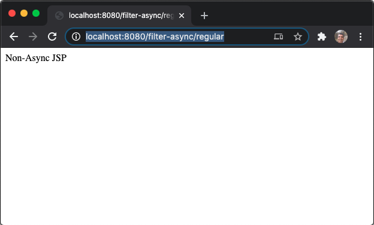


```sh
Entering normalFilter.doFilter().
Entering NonAsyncServlet.doGet().
Entering forwardFilter.doFilter().
In nonAsync.jsp.
Leaving forwardFilter.doFilter().
Leaving NonAsyncServlet.doGet().
Leaving normalFilter.doFilter().
```

2. Vaya a `http://localhost:8080/filter-async/async`. La siguiente salida del debugger aparece inmediatamente. Observe que `normalFilter` intercepta el request pero completa antes de que el response se envíe realmente.

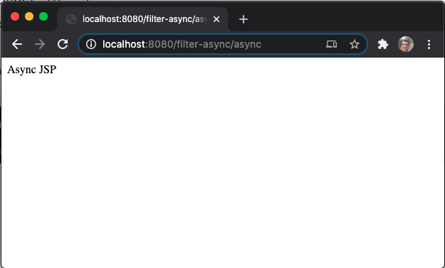

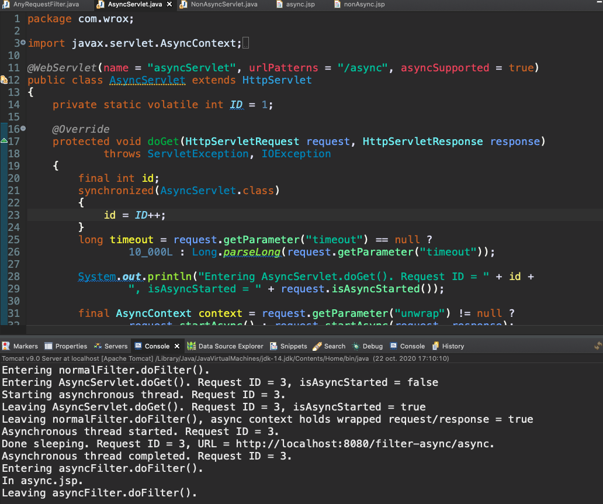

```sh
Entering normalFilter.doFilter().
Entering AsyncServlet.doGet(). Request ID = 3, isAsyncStarted = false
Starting asynchronous thread. Request ID = 3.
Leaving AsyncServlet.doGet(). Request ID = 3, isAsyncStarted = true
Leaving normalFilter.doFilter(), async context holds wrapped request/response = true
Asynchronous thread started. Request ID = 3.
```

Después de una espera de 5 segundos, la clase interna `AsyncThread` envía la respuesta al usuario y aparece el siguiente resultado del depurador. Cuando la solicitud se envía a JSP mediante el método de envío de `AsyncContext`, `asyncFilter` intercepta la solicitud interna a esa JSP.

```sh
Done sleeping. Request ID = 3, URL = http://localhost:8080/filter-async/async.
Asynchronous thread completed. Request ID = 3.
Entering asyncFilter.doFilter().
In async.jsp.
Leaving asyncFilter.doFilter().
```

3. Vaya a `http://localhost:8080/filter-async/async?unwrap` y espere a que se complete la respuesta. Aparece la siguiente salida del depurador (parte de ella después de 5 segundos). Es idéntico excepto que, en este caso, `AsyncContext` contiene la solicitud y la respuesta originales en lugar de la solicitud y la respuesta envueltas(wrapped) (la salida en negrita cambió[**response=false**]).


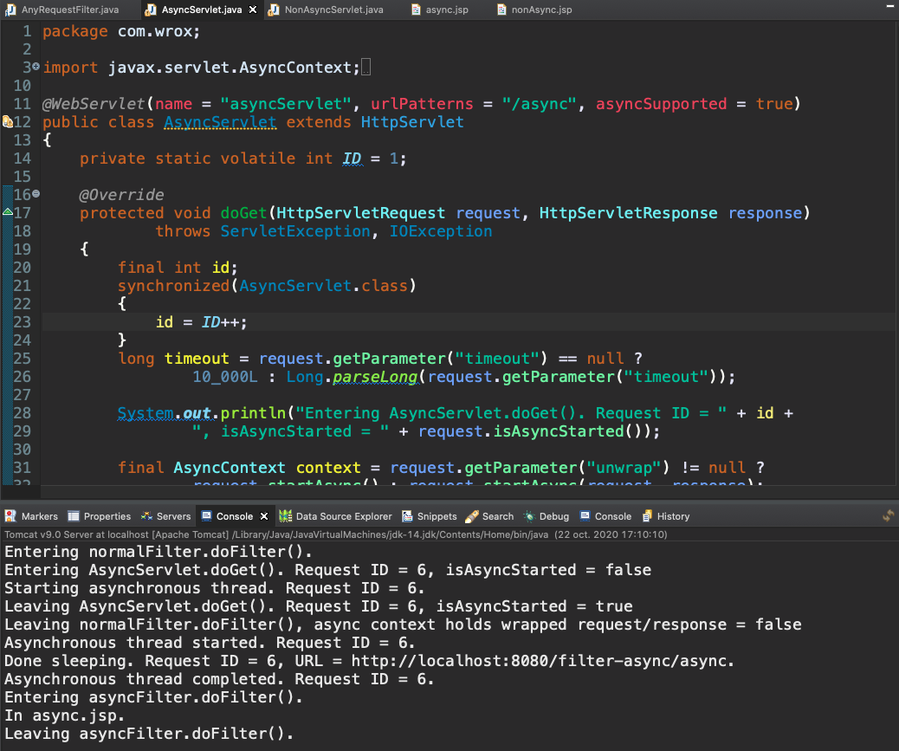

```sh
Entering normalFilter.doFilter().
Entering AsyncServlet.doGet(). Request ID = 6, isAsyncStarted = false
Starting asynchronous thread. Request ID = 6.
Leaving AsyncServlet.doGet(). Request ID = 6, isAsyncStarted = true
Leaving normalFilter.doFilter(), async context holds wrapped request/response = false
Asynchronous thread started. Request ID = 6.
Done sleeping. Request ID = 6, URL = http://localhost:8080/filter-async/async.
Asynchronous thread completed. Request ID = 6.
Entering asyncFilter.doFilter().
In async.jsp.
Leaving asyncFilter.doFilter().
```

4. Vaya a `http://localhost:8080/filter-async/async?timeout=3000`. Aparece el siguiente resultado del depurador y, 5 segundos después, se completa la suspensión y la recuperación de la solicitud del `AsyncContext` da como resultado una `IllegalStateException`. Esto se debe a que el tiempo de espera de `AsyncContext` expiró y la respuesta se cerró antes de que la clase interna `AsyncThread` pudiera completar su trabajo.


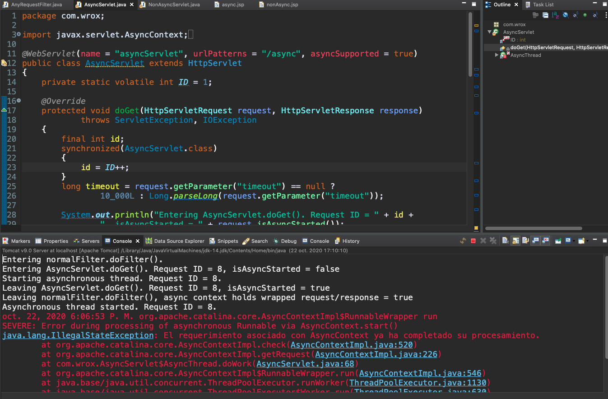

```sh
Entering normalFilter.doFilter().
Entering AsyncServlet.doGet(). Request ID = 8, isAsyncStarted = false
Starting asynchronous thread. Request ID = 8.
Leaving AsyncServlet.doGet(). Request ID = 8, isAsyncStarted = true
Leaving normalFilter.doFilter(), async context holds wrapped request/response = true
Asynchronous thread started. Request ID = 8.
oct. 22, 2020 6:06:53 P. M. org.apache.catalina.core.AsyncContextImpl$RunnableWrapper run
SEVERE: Error during processing of asynchronous Runnable via AsyncContext.start()
java.lang.IllegalStateException: El requerimiento asociado con AsyncContext ya ha completado su procesamiento.
```

A estas alturas debería estar claro lo complejo y poderoso que es el manejo de solicitudes asincrónicas. El punto importante es que si maneja la respuesta usando `AsyncContext` directamente, el código se ejecuta fuera del alcance de los filtros. Sin embargo, si usa el método `dispatch` de `AsyncContext` para reenviar internamente la solicitud a una URL, un filtro asignado para las solicitudes `ASYNC` puede interceptar el reenvío interno y aplicar cualquier lógica adicional necesaria. Debe decidir cuándo es apropiado cada enfoque, pero en la mayoría de los casos no necesitará el manejo asincrónico de solicitudes. Ninguna otra parte de este libro utiliza el manejo de solicitudes asincrónicas.

## INVESTIGANDO USOS PRÁCTICOS PARA FILTROS

Al comienzo del capítulo se discutieron muchos usos prácticos de los filtros. El proyecto **950-09-03-COMPRESSION-FILTER** demuestra dos de estos usos: un filtro de registro(logging filter) y un filtro de compresión de respuesta (response compression filter). El proyecto contiene un Servlet simple asignado a `/servlet` que responde con "This Servlet response may be compressed.". También contiene un simple archivo `/index.jsp` que responde con "This content may be compressed.". Este proyecto utiliza el siguiente `ServletContextListener` para configurar mediante programación los filtros para la aplicación.

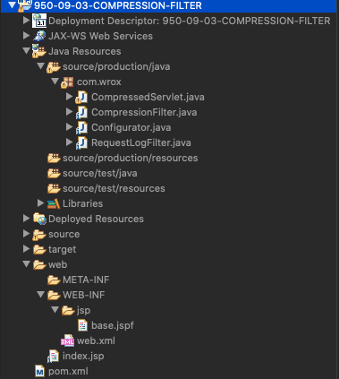

`pom.xml`

```html
<?xml version="1.0" encoding="UTF-8"?>
<project xmlns="http://maven.apache.org/POM/4.0.0"
         xmlns:xsi="http://www.w3.org/2001/XMLSchema-instance"
         xsi:schemaLocation="http://maven.apache.org/POM/4.0.0
                             http://maven.apache.org/xsd/maven-4.0.0.xsd">
    <modelVersion>4.0.0</modelVersion>

    <groupId>com.wrox</groupId>
    <artifactId>compression-filter</artifactId>
    <version>1.0.0.SNAPSHOT</version>
    <packaging>war</packaging>

    <properties>
        <project.build.sourceEncoding>UTF-8</project.build.sourceEncoding>
    </properties>

    <dependencies>
        <dependency>
            <groupId>javax.servlet</groupId>
            <artifactId>javax.servlet-api</artifactId>
            <version>3.1.0</version>
            <scope>provided</scope>
        </dependency>

        <dependency>
            <groupId>javax.servlet.jsp</groupId>
            <artifactId>javax.servlet.jsp-api</artifactId>
            <version>2.3.1</version>
            <scope>provided</scope>
        </dependency>

        <dependency>
            <groupId>javax.el</groupId>
            <artifactId>javax.el-api</artifactId>
            <version>3.0.0</version>
            <scope>provided</scope>
        </dependency>

        <dependency>
            <groupId>javax.servlet.jsp.jstl</groupId>
            <artifactId>javax.servlet.jsp.jstl-api</artifactId>
            <version>1.2.1</version>
            <scope>compile</scope>
        </dependency>
		
        <dependency>
            <groupId>org.glassfish.web</groupId>
            <artifactId>javax.servlet.jsp.jstl</artifactId>
            <version>1.2.2</version>
            <scope>compile</scope>
            <exclusions>
                <exclusion>
                    <groupId>javax.servlet</groupId>
                    <artifactId>servlet-api</artifactId>
                </exclusion>
                <exclusion>
                    <groupId>javax.servlet.jsp</groupId>
                    <artifactId>jsp-api</artifactId>
                </exclusion>
                <exclusion>
                    <groupId>javax.servlet.jsp.jstl</groupId>
                    <artifactId>jstl-api</artifactId>
                </exclusion>
            </exclusions>
        </dependency>

        <dependency>
            <groupId>org.apache.commons</groupId>
            <artifactId>commons-lang3</artifactId>
            <version>3.3.2</version>
            <scope>compile</scope>
        </dependency>
    </dependencies>

    <build>
        <sourceDirectory>source/production/java</sourceDirectory>
        <resources>
            <resource>
                <directory>source/production/resources</directory>
            </resource>
        </resources>

        <testSourceDirectory>source/test/java</testSourceDirectory>
        <testResources>
            <testResource>
                <directory>source/test/resources</directory>
            </testResource>
        </testResources>

        <plugins>
            <plugin>
                <groupId>org.apache.maven.plugins</groupId>
                <artifactId>maven-war-plugin</artifactId>
                <version>2.3</version>
                <configuration>
                    <warSourceDirectory>web</warSourceDirectory>
                </configuration>
            </plugin>
            <plugin>
                <groupId>org.apache.maven.plugins</groupId>
                <artifactId>maven-compiler-plugin</artifactId>
                <version>3.1</version>
                <configuration>
                    <source>1.8</source>
                    <target>1.8</target>
                </configuration>
            </plugin>
        </plugins>
    </build>

</project>
```

`web.xml`

```html
<?xml version="1.0" encoding="UTF-8"?>
<web-app xmlns="http://xmlns.jcp.org/xml/ns/javaee"
         xmlns:xsi="http://www.w3.org/2001/XMLSchema-instance"
         xsi:schemaLocation="http://xmlns.jcp.org/xml/ns/javaee
                             http://xmlns.jcp.org/xml/ns/javaee/web-app_3_1.xsd"
         version="3.1">

    <display-name>Compression Filter Application</display-name>

    <jsp-config>
        <jsp-property-group>
            <url-pattern>*.jsp</url-pattern>
            <url-pattern>*.jspf</url-pattern>
            <page-encoding>UTF-8</page-encoding>
            <scripting-invalid>true</scripting-invalid>
            <include-prelude>/WEB-INF/jsp/base.jspf</include-prelude>
            <trim-directive-whitespaces>true</trim-directive-whitespaces>
            <default-content-type>text/html</default-content-type>
        </jsp-property-group>
    </jsp-config>

    <session-config>
        <session-timeout>30</session-timeout>
        <cookie-config>
            <http-only>true</http-only>
        </cookie-config>
        <tracking-mode>COOKIE</tracking-mode>
    </session-config>

    <distributable />

</web-app>
```

`CompressedServlet.java`

```java
package com.wrox;

import javax.servlet.ServletException;
import javax.servlet.annotation.WebServlet;
import javax.servlet.http.HttpServlet;
import javax.servlet.http.HttpServletRequest;
import javax.servlet.http.HttpServletResponse;
import java.io.IOException;

@WebServlet(name = "compressedServlet", urlPatterns = "/servlet")
public class CompressedServlet extends HttpServlet
{
    @Override
    protected void doGet(HttpServletRequest request, HttpServletResponse response)
            throws ServletException, IOException
    {
        response.setContentType("text/plain");
        response.setCharacterEncoding("UTF-8");
        response.getOutputStream()
                .println("This Servlet response may be compressed.");
    }
}
```

`CompressionFilter.java`

```java
package com.wrox;

import javax.servlet.Filter;
import javax.servlet.FilterChain;
import javax.servlet.FilterConfig;
import javax.servlet.ServletException;
import javax.servlet.ServletOutputStream;
import javax.servlet.ServletRequest;
import javax.servlet.ServletResponse;
import javax.servlet.WriteListener;
import javax.servlet.http.HttpServletRequest;
import javax.servlet.http.HttpServletResponse;
import javax.servlet.http.HttpServletResponseWrapper;
import java.io.IOException;
import java.io.OutputStreamWriter;
import java.io.PrintWriter;
import java.util.zip.GZIPOutputStream;

public class CompressionFilter implements Filter
{
    @Override
    public void doFilter(ServletRequest request, ServletResponse response,
                         FilterChain chain) throws IOException, ServletException
    {
        if(((HttpServletRequest)request).getHeader("Accept-Encoding")
                .contains("gzip"))
        {
            System.out.println("Encoding requested.");
            ((HttpServletResponse)response).setHeader("Content-Encoding", "gzip");
            ResponseWrapper wrapper =
                    new ResponseWrapper((HttpServletResponse)response);
            try
            {
                chain.doFilter(request, wrapper);
            }
            finally
            {
                try {
                    wrapper.finish();
                } catch(Exception e) {
                    e.printStackTrace();
                }
            }
        }
        else
        {
            System.out.println("Encoding not requested.");
            chain.doFilter(request, response);
        }
    }

    @Override
    public void init(FilterConfig filterConfig) throws ServletException { }

    @Override
    public void destroy() { }

    private static class ResponseWrapper extends HttpServletResponseWrapper
    {
        private GZIPServletOutputStream outputStream;
        private PrintWriter writer;

        public ResponseWrapper(HttpServletResponse request)
        {
            super(request);
        }

        @Override
        public synchronized ServletOutputStream getOutputStream()
                throws IOException
        {
            if(this.writer != null)
                throw new IllegalStateException("getWriter() already called.");
            if(this.outputStream == null)
                this.outputStream =
                        new GZIPServletOutputStream(super.getOutputStream());
            return this.outputStream;
        }

        @Override
        public synchronized PrintWriter getWriter() throws IOException
        {
            if(this.writer == null && this.outputStream != null)
                throw new IllegalStateException(
                        "getOutputStream() already called.");
            if(this.writer == null)
            {
                this.outputStream =
                        new GZIPServletOutputStream(super.getOutputStream());
                this.writer = new PrintWriter(new OutputStreamWriter(
                        this.outputStream, this.getCharacterEncoding()
                ));
            }
            return this.writer;
        }

        @Override
        public void flushBuffer() throws IOException
        {
            if(this.writer != null)
                this.writer.flush();
            else if(this.outputStream != null)
                this.outputStream.flush();
            super.flushBuffer();
        }

        @Override
        public void setContentLength(int length) { }

        @Override
        public void setContentLengthLong(long length) { }

        @Override
        public void setHeader(String name, String value)
        {
            if(!"content-length".equalsIgnoreCase(name))
                super.setHeader(name, value);
        }

        @Override
        public void addHeader(String name, String value)
        {
            if(!"content-length".equalsIgnoreCase(name))
                super.setHeader(name, value);
        }

        @Override
        public void setIntHeader(String name, int value)
        {
            if(!"content-length".equalsIgnoreCase(name))
                super.setIntHeader(name, value);
        }

        @Override
        public void addIntHeader(String name, int value)
        {
            if(!"content-length".equalsIgnoreCase(name))
                super.setIntHeader(name, value);
        }

        public void finish() throws IOException
        {
            if(this.writer != null)
                this.writer.close();
            else if(this.outputStream != null)
                this.outputStream.finish();
        }
    }

    private static class GZIPServletOutputStream extends ServletOutputStream
    {
        private final ServletOutputStream servletOutputStream;
        private final GZIPOutputStream gzipStream;

        public GZIPServletOutputStream(ServletOutputStream servletOutputStream)
                throws IOException
        {
            this.servletOutputStream = servletOutputStream;
            this.gzipStream = new GZIPOutputStream(servletOutputStream);
        }

        @Override
        public boolean isReady()
        {
            return this.servletOutputStream.isReady();
        }

        @Override
        public void setWriteListener(WriteListener writeListener)
        {
            this.servletOutputStream.setWriteListener(writeListener);
        }

        @Override
        public void write(int b) throws IOException
        {
            this.gzipStream.write(b);
        }

        @Override
        public void close() throws IOException
        {
            this.gzipStream.close();
        }

        @Override
        public void flush() throws IOException
        {
            this.gzipStream.flush();
        }

        public void finish() throws IOException
        {
            this.gzipStream.finish();
        }
    }
}

```

`Configurator.java`

```java
package com.wrox;

import javax.servlet.FilterRegistration;
import javax.servlet.ServletContext;
import javax.servlet.ServletContextEvent;
import javax.servlet.ServletContextListener;
import javax.servlet.annotation.WebListener;

@WebListener
public class Configurator implements ServletContextListener
{
    @Override
    public void contextInitialized(ServletContextEvent event)
    {
        ServletContext context = event.getServletContext();

        FilterRegistration.Dynamic registration =
                context.addFilter("requestLogFilter", new RequestLogFilter());
        registration.addMappingForUrlPatterns(null, false, "/*");

        registration = context.addFilter("compressionFilter",
                new CompressionFilter());
        registration.setAsyncSupported(true);
        registration.addMappingForUrlPatterns(null, false, "/*");
    }

    @Override
    public void contextDestroyed(ServletContextEvent event) { }
}

```

`RequestLogFilter.java`

```java
package com.wrox;

import org.apache.commons.lang3.time.StopWatch;

import javax.servlet.Filter;
import javax.servlet.FilterChain;
import javax.servlet.FilterConfig;
import javax.servlet.ServletException;
import javax.servlet.ServletRequest;
import javax.servlet.ServletResponse;
import javax.servlet.http.HttpServletRequest;
import javax.servlet.http.HttpServletResponse;
import java.io.IOException;
import java.time.Instant;

public class RequestLogFilter implements Filter
{
    @Override
    public void doFilter(ServletRequest request, ServletResponse response,
                         FilterChain chain) throws IOException, ServletException
    {
        Instant time = Instant.now();
        StopWatch timer = new StopWatch();
        try
        {
            timer.start();
            chain.doFilter(request, response);
        }
        finally
        {
            timer.stop();
            HttpServletRequest in = (HttpServletRequest)request;
            HttpServletResponse out = (HttpServletResponse)response;
            String length = out.getHeader("Content-Length");
            if(length == null || length.length() == 0)
                length = "-";
            System.out.println(in.getRemoteAddr() + " - - [" + time + "]" +
                    " \"" + in.getMethod() + " " + in.getRequestURI() + " " +
                    in.getProtocol() + "\" " + out.getStatus() + " " + length +
                    " " + timer);
        }
    }

    @Override
    public void init(FilterConfig filterConfig) throws ServletException { }

    @Override
    public void destroy() { }
}

```

`base.jspf`

```html
<%@ taglib prefix="c" uri="http://java.sun.com/jsp/jstl/core" %>
<%@ taglib prefix="fmt" uri="http://java.sun.com/jsp/jstl/fmt" %>
<%@ taglib prefix="fn" uri="http://java.sun.com/jsp/jstl/functions" %>
```


`index.jsp`

```html
<!DOCTYPE html>
<html>
    <head>
        <title>Compressed Index Page</title>
    </head>
    <body>
        This content may be compressed.
    </body>
</html>

```


### AÑADIR UN SIMPLE LOGGING FILTER

La clase `RequestLogFilter` es el primer filtro en la filter chain (cadena de filtros) para todas las solicitudes a la aplicación. Mide el tiempo que tarda una solicitud en procesar y registra información sobre cada solicitud que llega a la aplicación: — the IP address, timestamp, request method, protocol, response status and length, and time to process the request — (la dirección IP, la marca de tiempo, el método de solicitud, el protocolo, el estado y la duración de la respuesta y el tiempo para procesar la solicitud), similar a Apache HTTP log format. El logging(registro) ocurre en el bloque `finally` para que cualquier excepción lanzada más abajo en la cadena de filtros no impida que se escriba la declaración de registro.

<hr>
**NOTA**: El `RequestLogFilter` no funcionará correctamente con el manejo de solicitudes asincrónicas. Si un servlet inicia un `AsyncContext`, `doFilter` regresará antes de que se envíe la respuesta, lo que significa que el filtro registrará información incompleta o incorrecta. Hacer que este filtro funcione correctamente para solicitudes asincrónicas es una tarea importante y compleja que se deja como un ejercicio para que el lector lo considere.
<hr>

### COMPRIMIR EL RESPONSE CONTENT USANDO UN FILTRO

`CompressionFilter` en el Listado 9-3 es significativamente más complejo que `RequestLogFilter`. Cuando piense en comprimir la respuesta, podría pensar que debería ejecutar la cadena de filtros y luego realizar la lógica de compresión en el camino de regreso. Sin embargo, recuerde que los datos de respuesta pueden comenzar a fluir de regreso al cliente antes de que el servlet haya completado el servicio de la solicitud. También puede comenzar a fluir de regreso al cliente después de que el servlet haya completado el servicio de la solicitud, en el caso del manejo de solicitudes asincrónicas. Debido a esto, si desea alterar el contenido de la respuesta, debe ajustar el objeto de respuesta pasado más abajo en la cadena. `CompressionFilter` hace precisamente esto.

Tómese un minuto para leer el código y examinar lo que está haciendo `CompressionFilter`. Primero, verifica si el cliente ha incluido un encabezado de solicitud `Accept-Encoding` que contiene la codificación "gzip". Esta es una verificación muy importante porque si no es así, esto significa que es posible que el cliente no comprenda las respuestas comprimidas con gzip. Si es así, establece el encabezado `Content-Encoding` en "gzip" y luego envuelve el objeto de respuesta con una instancia de la clase interna privada `ResponseWrapper`. Esta clase, a su vez, envuelve el `PrintWriter` o `ServletOutputStream` que envía datos de vuelta al cliente con la clase interna privada `GZIPServletOutputStream`. Este contenedor contiene un `java.util.zip.GZIPOutputStream` interno. Los datos de respuesta se escriben primero en `GZIPOutputStream` y, cuando se completa la solicitud, finaliza la compresión y escribe la respuesta comprimida en el wrapped `ServletOutputStream`. `ResponseWrapper` también evita que cualquier código de Servlet establezca el encabezado de longitud del contenido para la respuesta porque la longitud del contenido no se puede conocer hasta después de que se comprime la respuesta.

El patrón de envoltura (**wrapper pattern**) es un patrón muy común que probablemente verá aplicado en muchos filtros. Se pueden ajustar tanto los objetos de solicitud como de respuesta; sin embargo, envolver la respuesta suele ser más común. Envolver la respuesta le permite interceptar cualquier llamada de método en la respuesta envuelta, lo que facilita la capacidad de modificar los datos de la respuesta. También puede usar un filtro muy similar al de `CompressionFilter.java` para cifrar los datos de respuesta en lugar de comprimirlos. El objeto de la solicitud se podría ajustar para descifrar su contenido.

Para probar los filtros de registro y compresión (logging y compression):

1. Compile su aplicación e inicie Tomcat desde su IDE.
2. Vaya a `http://localhost:8080/compression/` y `http://localhost:8080/compression/servlet` en su navegador.
3. Con las herramientas de desarrollo creadas para su navegador, comience a monitorear los encabezados de las solicitudes y las respuestas de la aplicación. (Microsoft Internet Explorer y Google Chrome tienen herramientas de desarrollo integradas que pueden hacer esto, y el complemento Firebug para Mozilla Firefox tiene esta capacidad). Debería ver una pantalla como la de la Figura 9-4.

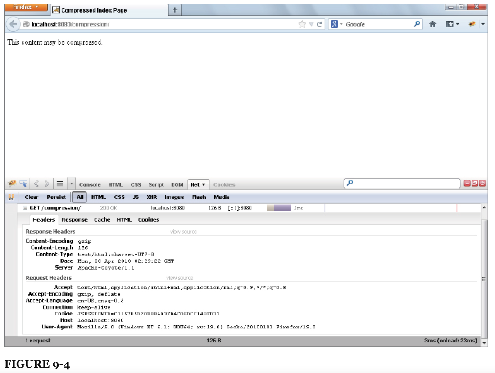

Tenga en cuenta que el `Accept-Encoding` request header contiene la codificación "gzip" y el `Content-Encoding` response header tiene el valor "gzip". Esto significa que su navegador anuncia que puede aceptar respuestas gzip-encoded, y el filtro de compresión está obligando a la solicitud y comprimiendo los datos de respuesta antes de enviarlos al navegador.

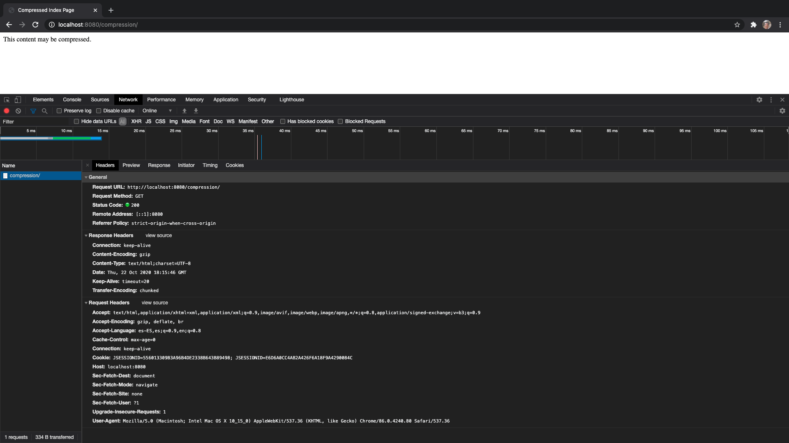

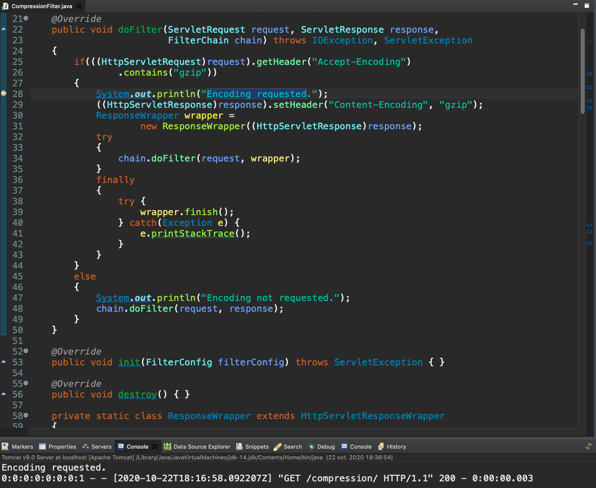

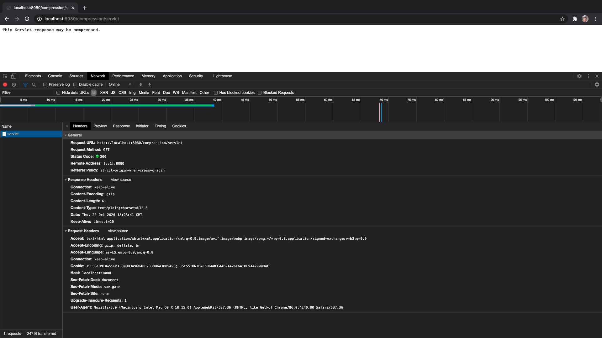

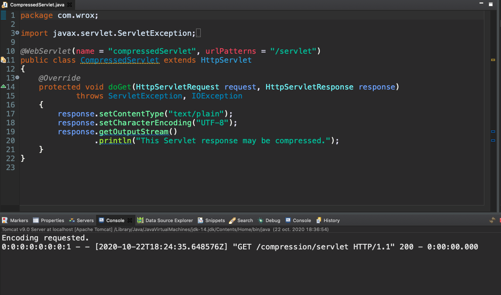

## SIMPLIFICANDO LA AUTENTICACIÓN CON UN FILTRO

Un uso fundamental de los filtros en las aplicaciones web es proteger las aplicaciones contra el acceso no deseado. La aplicación de soporte al cliente que está creando para Multinational Widget Corporation utiliza un mecanismo de autenticación muy primitivo para proteger sus páginas. Probablemente ya haya notado que muchos lugares de la aplicación contienen el mismo código duplicado para verificar la autenticación:

```java
   if(request.getSession().getAttribute("username") == null)
   {
   	response.sendRedirect("login");
        return;
   }
```

En algún momento, es posible que haya pensado que una mejor solución es crear un método estático público en alguna clase para realizar esta verificación y llamarlo en todas partes. Por supuesto, esto reduce el código duplicado, pero aún da como resultado la realización de esa llamada al método en varios lugares. A medida que aumentara la cantidad de servlets en su aplicación, también aumentaría la cantidad de llamadas a ese método estático.

Después de lo que ha aprendido en este capítulo, debe quedar claro que un filtro es un lugar mejor para colocar este código. El proyecto **950-09-04-CUSTOMER-SUPPORT** demuestra esto agregando la clase listener `Configurator` y la clase `AuthenticationFilter`. 


El fragmento de código anterior se ha eliminado de los métodos `doGet` y `doPost` en `TicketServlet` y del método `doGet` en `SessionListServlet`. El configurador es simple: declara el `AuthenticationFilter` y lo asigna a `/tickets` y `/sessions`:


```java
@WebListener
public class Configurator implements ServletContextListener
{
    @Override
    public void contextInitialized(ServletContextEvent event)
    {
        ServletContext context = event.getServletContext();
 
        FilterRegistration.Dynamic registration = context.addFilter(
                "authenticationFilter", new AuthenticationFilter()
        );
        registration.setAsyncSupported(true);
        registration.addMappingForUrlPatterns(
                null, false, "/sessions", "/tickets"
        );
    }
 
    @Override
    public void contextDestroyed(ServletContextEvent event) { }
}
```

A medida que agrega más Servlets u otros recursos protegidos (como JSP) a su aplicación, solo necesita agregar sus URL patterns al registro del filtro para asegurarse de que los usuarios inicien sesión antes de acceder a esos recursos. Por supuesto, este filtro no protege el Servlet de inicio de sesión porque no desea proteger la pantalla de inicio de sesión. Tampoco es necesario que proteja ninguno de los recursos de imagen, JavaScript o CSS porque no contienen datos confidenciales. `AuthenticationFilter` realiza la verificación de autenticación en cada solicitud de cualquier método HTTP y redirige a los usuarios a la pantalla de inicio de sesión si no han iniciado sesión:

```java
public class AuthenticationFilter implements Filter
{
    @Override
    public void doFilter(ServletRequest request, ServletResponse response,
                         FilterChain chain) throws IOException, ServletException
    {
        HttpSession session = ((HttpServletRequest)request).getSession(false);
        if(session != null && session.getAttribute("username") == null)
            ((HttpServletResponse)response).sendRedirect("login");
        else
            chain.doFilter(request, response);
    }
 
    @Override
    public void init(FilterConfig config) throws ServletException { }
 
    @Override
    public void destroy() { }
}
```

Una cosa hermosa sobre este cambio es que si modifica el algoritmo de autenticación, solo necesita cambiar el filtro para continuar protegiendo los recursos en su aplicación. Anteriormente, habría tenido que realizar cambios en cada Servlet. Pruebe estos cambios compilando, iniciando Tomcat en su IDE y navegando a `http://localhost:8080/customer-support/login` en su navegador. Aunque la verificación de autenticación se eliminó de todos los Servlets, aún se le pedirá que inicie sesión antes de ver o crear tickets, o ver la lista de sesiones.

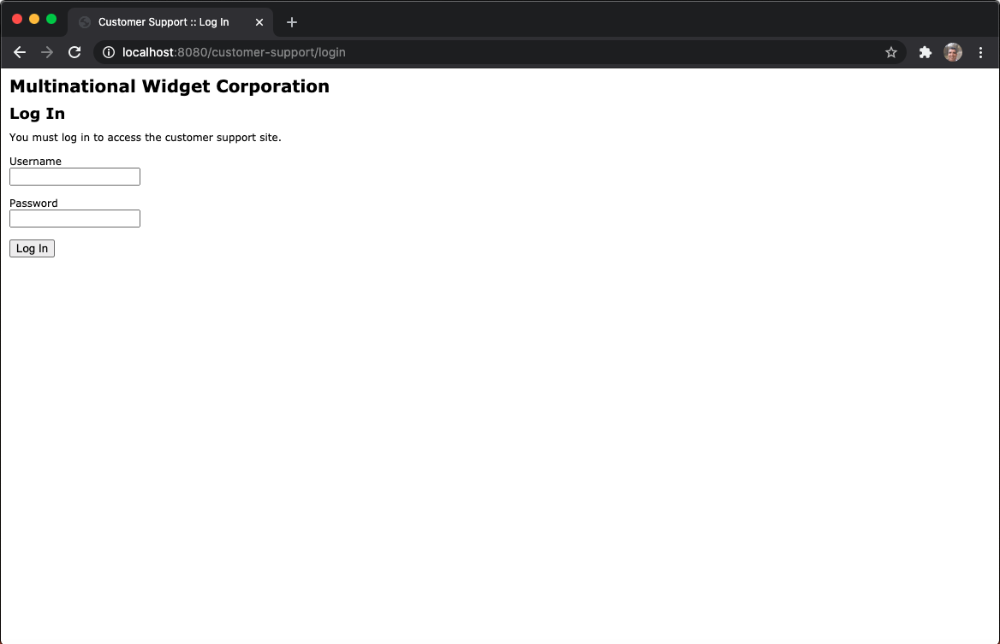

## RESUMEN

En este capítulo, exploró el propósito de los filtros y las muchas razones por las que podría usarlos. Aprendió sobre la interfaz de filtro y cómo crear, declarar y mapear filtros en sus aplicaciones. Experimentó con la importantísima cadena de filtros y aprendió cómo el orden en el que se ejecutan los filtros puede ser poco importante en algunos escenarios y bastante crítico en otros. Se le presentó el concepto de manejo de solicitudes asincrónicas y utilizó filtros para explorar ese tema más a fondo y comprender lo complicado que puede ser el manejo de solicitudes asincrónicas. Finalmente, después de explorar las tres formas diferentes de declarar y mapear filtros (en el descriptor de implementación, usando anotaciones y programáticamente) experimentó con un filtro de registro, un filtro de compresión de respuesta y un filtro de autenticación.

En el siguiente capítulo, explorará la tecnología de WebSockets, cómo mejoran drásticamente las aplicaciones web interactivas y cómo usarlas en Java y JavaScript. Un punto interesante es que el código en Tomcat que hace posible WebSockets en realidad usa un filtro para interceptar todas las solicitudes vinculadas a WebSocket en su aplicación y enviarlas a sus puntos finales de WebSocket (sobre los cuales aprenderá más en el próximo capítulo). Entonces, sin siquiera hacer nada, tu aplicación ya tiene filtros inspeccionando y, si es necesario, modificando solicitudes.
