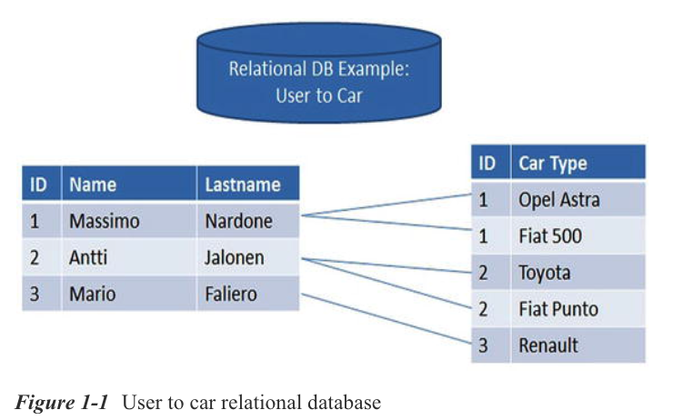
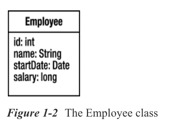
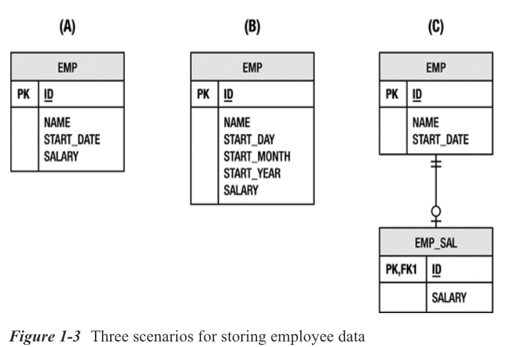
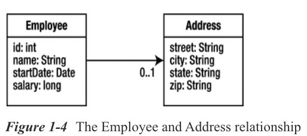
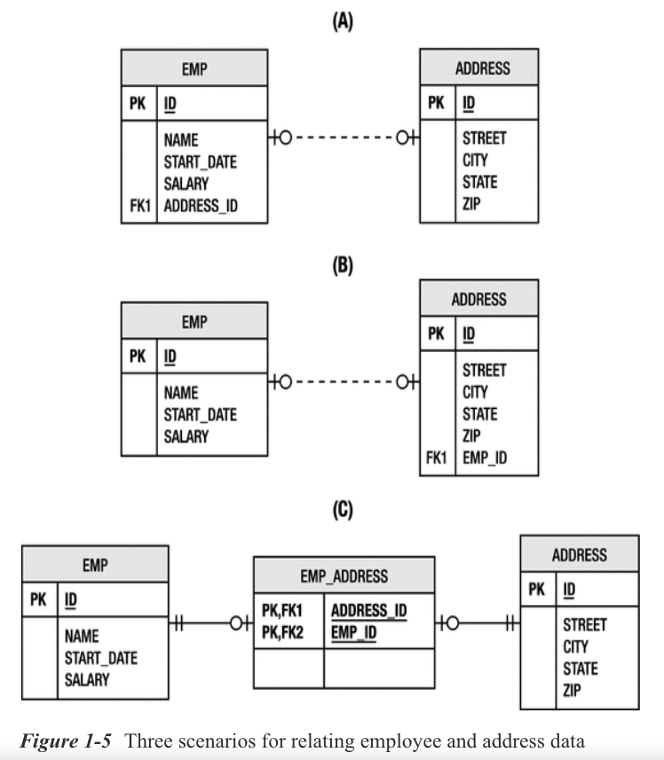
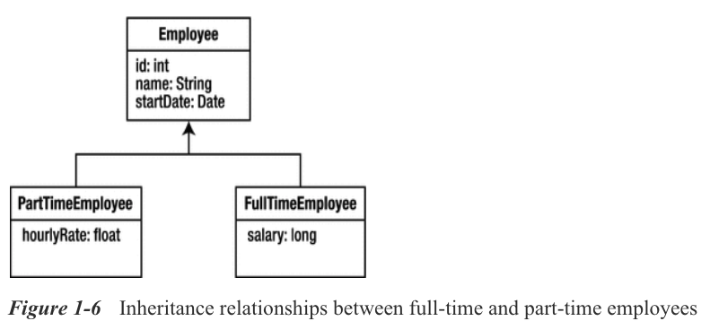
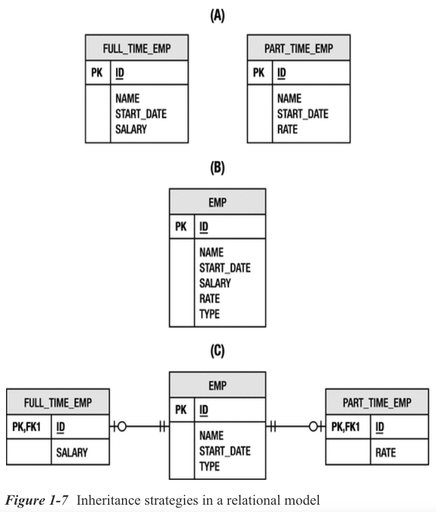
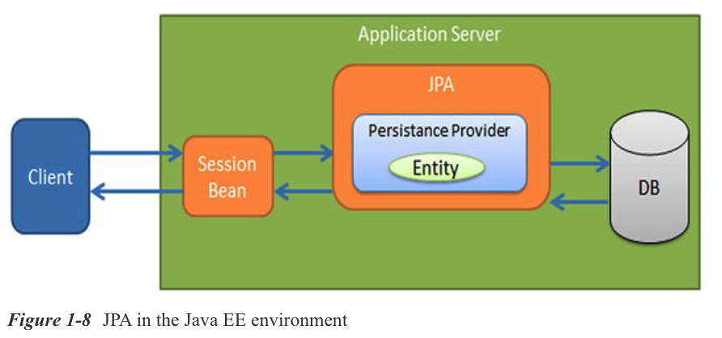

# 01. Introduction

* Relational Databases
* Object-Relational Mapping
   * The Impedance Mismatch
* Java Support for Persistence
   * Proprietary Solutions
   * JDBC
   * Enterprise JavaBeans
   * Java Data Objects
* Why Another Standard?
* The Java Persistence API
   * History of the Specification
   * Overview
* Summary

MATERIAL SUPLEMENTARIO ELECTRÓNICO

La versión en línea de este capítulo (https://doi.org/10.1007/978-1-4842-3420-4_1) contiene material complementario, que está disponible para usuarios autorizados.

Las aplicaciones empresariales se definen por su necesidad de recopilar, procesar, transformar e informar sobre grandes cantidades de información. Y, por supuesto, esa información debe guardarse en algún lugar. El almacenamiento y la recuperación de datos es un negocio de miles de millones de dólares, evidenciado en parte por el crecimiento del mercado de bases de datos, así como por el surgimiento de servicios de almacenamiento basados en la nube. A pesar de todas las tecnologías disponibles para la gestión de datos, los diseñadores de aplicaciones todavía dedican gran parte de su tiempo a tratar de trasladar sus datos hacia y desde el almacenamiento de manera eficiente.

A pesar del éxito que ha tenido la plataforma **Java** al trabajar con sistemas de bases de datos, durante mucho tiempo sufrió el mismo problema que ha afectado a otros lenguajes de programación orientados a objetos. Mover datos entre un sistema de base de datos y el modelo de objetos de una aplicación Java fue mucho más difícil de lo necesario. Los desarrolladores de Java escribieron mucho código para convertir datos de filas y columnas en objetos, o se vieron atados a marcos patentados que intentaron ocultarles la base de datos. Afortunadamente, se introdujo en la plataforma una solución estándar, la **API de persistencia de Java (JPA)** para cerrar la brecha entre los modelos de dominio orientados a objetos y los sistemas de bases de datos relacionales.

Este libro presenta la **versión 2.2 de la API de persistencia de Java como parte de Java EE 8** y explora todo lo que tiene para ofrecer a los desarrolladores.

La versión de mantenimiento de **JPA 2.2 comenzó durante 2017 bajo JSR 338** y finalmente fue **aprobada el 19 de junio de 2017**.

Aquí está ***la declaración de lanzamiento oficial de Java Persistence 2.2 Maintenance***:

“La especificación Java Persistence 2.2 mejora la API de persistencia de Java con soporte para anotaciones repetidas; inyección en convertidores de atributos; soporte para el mapeo de los tipos **`java.time.LocalDate`**, **`java.time.LocalTime`**, **`java.time.LocalDateTime`**, **`java.time.OffsetTime`** y **`java.time.OffsetDateTime`**; y métodos para recuperar los resultados de **`Query`** y **`TypedQuery`** como transmisiones".

***Uno de sus puntos fuertes es que se puede colocar en cualquier capa, nivel o marco en el que necesite una aplicación***. Ya sea que esté creando ***aplicaciones cliente-servidor*** para recopilar datos de formularios en una ***aplicación Swing*** o creando un ***Sitio Web*** con la última aplicación framework, ***JPA puede ayudarlo a proporcionar persistencia de manera más efectiva***.

***Para preparar el escenario para JPA, este capítulo primero da un paso atrás para mostrar dónde hemos estado y qué problemas estamos tratando de resolver***. A partir de ahí, analizaremos el historial de la especificación y le brindaremos una vista de alto nivel de lo que tiene para ofrecer.

## Bases de datos relacionales

Muchas formas de conservar los datos han ido y venido a lo largo de los años, y ningún concepto tiene más poder de permanencia que la **Base de Datos Relacional**. Incluso en la era de la nube, cuando **"Big Data"** y **"NoSQL"** roban regularmente los titulares, los servicios de bases de datos relacionales tienen una demanda constante para permitir que las aplicaciones empresariales actuales se ejecuten en la nube. Si bien el key-value y los document-oriented NoSQL stores tienen su lugar, el almacenamiento relacional siguen haciendo que ***las bases de datos relacionales tengan un uso general y que sean las más populares que existen***, y ***son donde se almacena la gran mayoría de los datos corporativos del mundo***. Son el punto de partida para todas las aplicaciones empresariales y, a menudo, tienen una vida útil que continúa mucho después de que la aplicación se ha desvanecido.

***Comprender los datos relacionales es clave para un desarrollo empresarial exitoso***. El desarrollo de aplicaciones que funcionen bien con los sistemas de bases de datos es un obstáculo comúnmente reconocido en el desarrollo de software. Gran parte del éxito de Java se puede atribuir a su adopción generalizada para la creación de sistemas de bases de datos empresariales. Desde sitios web para consumidores hasta pasarelas automatizadas, ***las aplicaciones Java están en el corazón del desarrollo de aplicaciones empresariales***. La figura 1-1 muestra un ejemplo de una base de datos relacional de usuario a automóvil.

## Object-Relational Mapping

“**El Domain Model tiene una Clase. La Base de Datos tiene una Tabla**. Se ven bastante similares. Debería ser sencillo convertir uno a otro automáticamente". Este es un pensamiento que probablemente todos hemos tenido en un momento u otro mientras escribíamos otro **Objeto de Acceso a Datos (DAO) para convertir conjuntos de resultados de Conectividad de base de datos Java (JDBC) en algo orientado a objetos**. El modelo de dominio(domain model) se parece lo suficiente al modelo relacional de la base de datos que parece pedir a gritos una forma de hacer que los dos modelos se comuniquen entre sí.

**La técnica de cerrar la brecha entre el Modelo de Objetos y el Modelo Relacional se conoce como Mapeo Relacional de Objetos**, a menudo denominado **Mapeo O-R** o simplemente **ORM**. El término proviene de ***la idea de que de alguna manera estamos mapeando los conceptos de un modelo a otro, con el objetivo de introducir un mediador para gestionar la transformación automática de uno a otro***.

Antes de entrar en los detalles del mapeo relacional de objetos, **definamos un breve manifiesto de cuál debería ser la solución ideal**.

* **Objetos, no Tablas**: las aplicaciones deben escribirse en términos del **Domain Model(Modelo de Dominio)**, no vinculadas al Modelo Relacional. ***Debe ser posible operar y consultar el Modelo de Dominio sin tener que expresarlo en el lenguaje relacional de tablas, columnas y claves externas***.

* **Conveniencia, no Ignorancia**: las herramientas de mapeo deben ser utilizadas solo por alguien familiarizado con la tecnología relacional. ***El mapeo O-R no está destinado a evitar que los desarrolladores comprendan los problemas de mapeo ni a ocultarlos por completo. Está destinado a aquellos que entienden los problemas y saben lo que necesitan, pero que no quieren tener que escribir miles de líneas de código para tratar un problema que ya se ha resuelto***.

* **Discreto, no transparente**: no es razonable esperar que la persistencia sea transparente porque una aplicación siempre necesita tener el control de los objetos que persisten y ser consciente del ciclo de vida de la entidad. Sin embargo, ***la solución de persistencia no debe inmiscuirse en el Modelo de Dominio, y no se debe exigir a las clases de dominio que extiendan clases o implementen interfaces para que sean persistentes***.

* **Datos Heredados, nuevos Objetos**: ***es mucho más probable que una aplicación apunte a un esquema de Base de Datos Relacional existente que crear uno nuevo***. El soporte para esquemas heredados es uno de los casos de uso más relevantes que surgirán, y es muy posible que tales bases de datos sobrevivan a cada uno de nosotros.

* **Suficiente, pero no demasiado**: los desarrolladores empresariales tienen problemas que resolver y necesitan características suficientes para resolver esos problemas. Lo que no les gusta es verse obligados a comer un Modelo de Persistencia de peso pesado que introduce una gran sobrecarga porque está resolviendo problemas que muchos ni siquiera están de acuerdo en que son problemas.

* **Local, pero móvil**: una representación persistente de datos no necesita modelarse como un objeto remoto completo. La distribución es algo que existe como parte de la aplicación, no como parte de la capa de persistencia. Sin embargo, las entidades que contienen el estado persistente deben poder viajar a la capa que las necesite, de modo que si se distribuye una aplicación, las entidades admitirán y no inhibirán una arquitectura en particular.

* **API estándar, con implementaciones conectables**: las grandes empresas con aplicaciones considerables no quieren correr el riesgo de verse acopladas a bibliotecas e interfaces específicas de productos. Al depender solo de las interfaces estándar definidas, la aplicación se desacopla de las API propietarias y puede cambiar de implementación si otra se vuelve más adecuada.

***Este parece ser un conjunto de requisitos algo exigente, pero es uno que nace tanto de la experiencia práctica como de la necesidad. Las aplicaciones empresariales tienen necesidades de persistencia muy específicas, y esta lista de compras de artículos es una representación bastante específica de la experiencia de la comunidad empresarial***.

### LA IMPEDANCIA INCORRECTA

Los defensores del Mapeo Relacional de objetos a menudo ***describen la diferencia entre el Modelo de Objeto y el Modelo Relacional como el desajuste de impedancia entre los dos***. Esta es una descripción adecuada porque el desafío de mapear uno con el otro no radica en las similitudes entre los dos, sino en los conceptos de cada uno para los cuales no hay un equivalente lógico en el otro.

En las siguientes secciones, presentamos algunos Modelos de Dominio orientados a Objetos básicos y una variedad de Modelos Relacionales para conservar el mismo conjunto de datos. Como verá, el desafío en el Mapeo Relacional de Objetos no es tanto la complejidad de un solo mapeo sino que hay tantos mapeos posibles. El objetivo no es explicar cómo llegar de un punto a otro, sino comprender los caminos que se deben tomar para llegar al destino previsto.

#### Representación de clase

Comencemos esta discusión con una clase sencilla. La Figura 1-2 muestra una Clase **`Employee`** con cuatro atributos: **ID de empleado**, **nombre de empleado**, **fecha de inicio** y **salario actual**.

Ahora considere el Modelo Relacional que se muestra en la Figura 1-3. **La representación ideal** de esta Clase en la Base de Datos corresponde al **escenario (A)**. ***Cada Campo de la Clase se asigna directamente a una Columna de la Tabla***. La identificación del empleado se convierte en la Clave Principal(**Primary Key**) . Con la excepción de algunas pequeñas diferencias de nombre, este es un mapeo sencillo.

En el **escenario (B)**, vemos que la ***Fecha de Inicio*** del empleado en realidad ***se almacena como tres columnas separadas***, una para cada día, mes y año. Recuerde que la clase usó un objeto **`Date`** para representar este valor. Debido a que los esquemas de la Base de Datos son mucho más difíciles de cambiar, ***¿debería la clase verse obligada a adoptar la misma estrategia de almacenamiento para mantener la coherencia con el modelo relacional?*** ***Considere también lo inverso del problema, en el que la clase había usado tres campos y la tabla usaba una sola columna de fecha***. **Incluso un solo campo se vuelve complejo de mapear cuando la base de datos y el modelo de objetos difieren en la representación**.

***La Información Salarial se considera comercialmente sensible, por lo que puede ser imprudente colocar el valor del salario directamente en la tabla*** **`EMP`**, que puede usarse para varios propósitos. En el **escenario (C)**, la tabla **`EMP`** se ha dividido para que la información salarial se almacene en una tabla **`EMP_SAL`** separada. Esto permite que el administrador de la base de datos restrinja el acceso **`SELECT`** a la información salarial a aquellos usuarios que realmente lo requieran. Con este mapeo, incluso una sola operación para la clase **`Employee`** ahora requiere inserciones o actualizaciones en dos tablas diferentes.

Claramente, incluso almacenar los datos de una sola Clase en una Base de Datos puede ser un ejercicio desafiante. Nos preocupamos por estos escenarios porque los esquemas de Bases de Datos reales en sistemas de producción nunca fueron diseñados con Modelos de Objetos en mente. La regla general en las aplicaciones empresariales es que las necesidades de la Base de Datos superan los deseos de la aplicación. De hecho, normalmente hay muchas aplicaciones, algunas orientadas a objetos y otras basadas en el **lenguaje de consulta estructurado (SQL)**, que recuperan y almacenan datos en una sola base de datos. La dependencia de múltiples aplicaciones en la misma base de datos significa que cambiar la base de datos afectaría a cada una de las aplicaciones, claramente una opción indeseable y potencialmente costosa. ***Depende del modelo de objetos adaptarse y encontrar formas de trabajar con el esquema de la base de datos sin dejar que el diseño físico domine el modelo de aplicación lógica**.
AQUIIIIIIIIIII
#### Relaciones

Los objetos rara vez existen de forma aislada. Al igual que las relaciones en una base de datos, las clases de dominio dependen y se asocian a otras clases de dominio. Considere la clase `Employee` presentada en la Figura 1-2. Hay muchos conceptos de dominio que podrían asociarse con un empleado, pero por ahora introduzcamos la clase de dominio `Address`, para la cual un `Employee` puede tener como máximo una instancia. Decimos en este caso que `Employee` tiene una ***relación de uno a uno*** con `Address`, representada en el Lenguaje de Modelado Unificado (UML) por la notación `0..1`. La figura 1-4 demuestra esta relación.

Discutimos diferentes escenarios para representar el estado de `Employee` en la sección anterior, y del mismo modo, existen varios enfoques para representar una relación en un esquema de base de datos. La figura 1-5 muestra tres escenarios diferentes para una relación uno a uno entre un empleado y una dirección.

El componente básico de las relaciones en la base de datos es la clave externa (foreign key). Cada escenario implica relaciones de clave externa entre las diversas tablas, pero para que haya una relación de clave externa, la tabla de destino debe tener una clave principal (primary key). Y así, incluso antes de que podamos asociar empleados y direcciones, tenemos un problema. La clase de dominio `Address` no tiene un identificador, sin embargo, la tabla en la que se almacenaría debe tener uno si va a formar parte de las relaciones. Podríamos construir una clave principal a partir de todas las columnas de la tabla `ADDRESS`, pero esto se considera una mala práctica. Por lo tanto, se introduce la columna `ID`, y el mapeo relacional de objetos tendrá que adaptarse de alguna manera.

El escenario (A) de la Figura 1-5 muestra el mapa ideal de esta relación. La tabla `EMP` tiene una clave externa para la tabla `ADDRESS` almacenada en la columna `ADDRESS_ID`. Si la clase `Employee` retiene una instancia de la clase `Address`, el valor de la clave principal para la dirección se puede establecer durante las operaciones store cuando se escribe una fila `EMPLOYEE`.

Y, sin embargo, considere el escenario (B), que es solo ligeramente diferente pero de repente mucho más complejo. En el modelo de dominio, una instancia de `Address` no retuvo la instancia de `Employee` que la poseía y, sin embargo, la clave principal del empleado debe almacenarse en la tabla `ADDRESS`. El mapeo relacional de objetos debe tener en cuenta esta discrepancia entre la clase de dominio y la tabla o se deberá agregar una referencia al empleado para cada dirección.

Para empeorar las cosas, el escenario (C) introduce una tabla de combinación para relacionar las tablas `EMP` y `ADDRESS`. En lugar de almacenar las claves externas directamente en una de las tablas de dominio, la tabla de combinación retiene el par de claves. Cada operación de base de datos que involucre las dos tablas ahora debe atravesar la tabla de combinación y mantenerla consistente. Podríamos introducir una clase de asociación `EmployeeAddress` en el modelo de dominio para compensar, pero eso anula la representación lógica que estamos tratando de lograr.

Las relaciones presentan un desafío en cualquier solución de mapeo relacional de objetos. Esta introducción cubrió solo las relaciones uno a uno y, sin embargo, nos hemos enfrentado a la necesidad de claves primarias que no están en el modelo de objetos y a la posibilidad de tener que introducir relaciones adicionales en el modelo o incluso clases asociadas para compensar el esquema de la base de datos.

#### Herencia

Un elemento definitorio de un modelo de dominio orientado a objetos es la oportunidad de introducir relaciones generalizadas entre clases similares. La herencia es la forma natural de expresar estas relaciones y permite el polimorfismo en la aplicación. Repasemos la clase `Employee` que se muestra en la Figura 1-2 e imaginemos una empresa que necesita distinguir entre empleados a tiempo completo y a tiempo parcial. Los empleados a tiempo parcial trabajan por una tarifa por hora, mientras que a los empleados a tiempo completo se les asigna un salario. Esta es una buena oportunidad para la herencia, moviendo la información salarial a las subclases `PartTimeEmployee` y `FullTimeEmployee`. La figura 1-6 muestra esta disposición.

La herencia presenta un problema genuino para el mapeo relacional de objetos. Ya no estamos tratando con una situación en la que hay un mapeo natural de una clase a una tabla. Considere los modelos relacionales que se muestran en la Figura 1-7. Una vez más, se demuestran tres estrategias diferentes para conservar el mismo conjunto de datos.

Podría decirse que la solución más fácil para alguien que mapea una estructura de herencia a una base de datos sería poner todos los datos necesarios para cada clase (incluidas las clases principales) en tablas separadas. Esta estrategia se demuestra en el escenario (A) de la Figura 1-7. Tenga en cuenta que no existe relación entre las tablas (es decir, cada tabla es independiente de las demás). Esto significa que las consultas en estas tablas ahora son mucho más complicadas si el usuario necesita operar tanto con empleados a tiempo completo como a tiempo parcial en un solo paso.

Una alternativa eficiente pero desnormalizada es colocar todos los datos necesarios para cada clase en el modelo en una sola tabla. Eso hace que sea muy fácil de consultar, pero observe la estructura de la tabla que se muestra en el escenario (B) de la Figura 1-7. Hay una nueva columna, `TYPE`, que no existe en ninguna parte del modelo de dominio. La columna `TYPE` indica si el empleado es a tiempo parcial o completo. Esta información ahora debe ser interpretada por una solución de mapeo relacional de objetos para saber qué tipo de clase de dominio instanciar para cualquier fila dada en la tabla.

El escenario (C) lleva esto un paso más allá, esta vez normalizando los datos en tablas separadas para empleados a tiempo completo y a tiempo parcial. Sin embargo, a diferencia del escenario (A), estas tablas están relacionadas por una tabla `EMP` común que almacena todos los datos comunes a ambos tipos de empleados. Puede parecer excesivo para una sola columna de datos adicionales, pero un esquema real con muchas columnas específicas para cada tipo de empleado probablemente utilizaría este tipo de estructura de tabla. Presenta los datos en una forma lógica y también simplifica la consulta al permitir que las tablas se unan. Desafortunadamente, lo que funciona bien para la base de datos no necesariamente funciona bien para un modelo de objetos asignado a dicho esquema. Incluso sin asociaciones con otras clases, el mapeo relacional de objetos de la clase de dominio ahora debe tener en cuenta las uniones entre varias tablas. Cuando comienza a considerar superclases abstractas o clases padre que no son persistentes, la herencia se convierte rápidamente en un tema complejo en el mapeo relacional de objetos. No solo existe un desafío con el almacenamiento de los datos de la clase, sino que las complejas relaciones de las tablas también son difíciles de consultar de manera eficiente.

## Soporte de Java para la Persistencia

Desde los primeros días de la plataforma Java, han existido interfaces de programación para proporcionar puertas de enlace a la base de datos y para abstraer muchos de los requisitos de persistencia específicos del dominio de las aplicaciones comerciales. Las siguientes secciones analizan las soluciones de persistencia Java actuales y pasadas y su función en las aplicaciones empresariales.

La API de persistencia de Java consta de cuatro áreas:

* La Java Persistence API

* La Java Persistence Criteria API

* El Query language

* El Object-relational mapping metadata

### SOLUCIONES PROPIAS

Puede ser una sorpresa saber que las soluciones de mapeo relacional de objetos existen desde hace mucho tiempo; más incluso que el propio lenguaje Java. Productos como Oracle TopLink comenzaron en el mundo Smalltalk antes de cambiar a Java. Una gran ironía en la historia de las soluciones de persistencia de Java es que una de las primeras implementaciones de beans de entidad se demostró al agregar una capa de bean de entidad adicional sobre los objetos mapeados de TopLink.

Las dos API de persistencia propietarias más populares fueron TopLink en el espacio comercial e Hibernate en la comunidad de código abierto. Los productos comerciales como TopLink estaban disponibles en los primeros días de Java y tuvieron éxito, pero las técnicas nunca se estandarizaron para la plataforma Java. Más tarde, cuando las nuevas soluciones de mapeo relacional de objetos de código abierto como Hibernate se hicieron populares, se produjeron los cambios en torno a la persistencia en la plataforma Java, lo que llevó a una convergencia hacia el mapeo relacional de objetos como la solución preferida.

Estos dos productos y otros podrían integrarse con todos los principales servidores de aplicaciones y proporcionar aplicaciones con todas las características de persistencia que necesitaban. Los desarrolladores de aplicaciones estaban de acuerdo con el uso de un producto de terceros para sus necesidades de persistencia, especialmente dado que no había estándares comunes y equivalentes a la vista.

#### Data Mappers

Un enfoque parcial para resolver el problema relacional de objetos fue usar mapeadores de datos[1]. El patrón del mapeador de datos cae en el espacio entre JDBC simple (ver la sección "JDBC") y una solución completa de mapeo relacional de objetos porque el desarrollador de la aplicación es responsable para crear las cadenas de SQL sin procesar para asignar el objeto a las tablas de la base de datos, pero normalmente se usa un marco personalizado o estándar para invocar el SQL desde los métodos del asignador de datos. El marco también ayuda con otras cosas como el mapeo del conjunto de resultados y los parámetros de la declaración SQL. El framework mapeador de datos más popular fue **Apache iBatis** (**ahora llamado MyBatis** y alojado en Google Code). Ganó una comunidad considerable y todavía se encuentra en varias aplicaciones.

La mayor ventaja de utilizar una estrategia de mapeo de datos como MyBatis es que la aplicación tiene un control completo sobre el SQL que se envía a la base de datos. Los procedimientos almacenados y todas las funciones de SQL disponibles desde el controlador son un juego limpio, y la sobrecarga agregada por el marco es menor que cuando se usa un marco ORM completo. Sin embargo, la principal desventaja de poder escribir SQL personalizado es que debe mantenerse. Cualquier cambio realizado en el modelo de objetos puede tener repercusiones en el modelo de datos y posiblemente provocar una pérdida significativa de SQL durante el desarrollo. Un marco minimalista también abre la puerta para que el desarrollador cree nuevas funciones a medida que crecen los requisitos de la aplicación, lo que eventualmente conduce a una reinvención de la rueda ORM. Los mapeadores de datos aún pueden tener un lugar en algunas aplicaciones si están seguros de que sus necesidades no crecerán más allá del simple mapeo, o si requieren un SQL muy explícito que no se puede generar.

### JDBC

El segundo lanzamiento de la plataforma Java, Java Development Kit (JDK) 1.1, lanzado en 1997, marcó el comienzo del primer soporte importante para la persistencia de bases de datos con JDBC. Fue creado como una versión específica de Java de su predecesor más genérico, la especificación Object Database Connectivity (ODBC), un estándar para acceder a cualquier base de datos relacional desde cualquier idioma o plataforma. Al ofrecer una abstracción simple y portátil de las interfaces de programación de clientes patentadas que ofrecen los proveedores de bases de datos, JDBC permite que los programas Java interactúen completamente con la base de datos. Esta interacción depende en gran medida de SQL, ofreciendo a los desarrolladores la oportunidad de escribir consultas y declaraciones de manipulación de datos en el lenguaje de la base de datos, pero ejecutadas y procesadas utilizando un modelo de programación Java simple.

La ironía de JDBC es que, aunque las interfaces de programación son portátiles, el lenguaje SQL no lo es. A pesar de los muchos intentos de estandarizarlo, todavía es raro escribir SQL de alguna complejidad que se ejecute sin cambios en dos plataformas de bases de datos principales. Incluso cuando los dialectos SQL son similares, cada base de datos funciona de manera diferente según la estructura de la consulta, lo que requiere un ajuste específico del proveedor en la mayoría de los casos.

También está el problema del acoplamiento estrecho entre la fuente de Java y el texto SQL. Los desarrolladores se ven constantemente tentados por el atractivo de las consultas SQL listas para ejecutar, ya sea construidas dinámicamente en tiempo de ejecución o simplemente almacenado en variables o campos. Este es un modelo de programación muy atractivo hasta que un día se da cuenta de que la aplicación tiene que admitir un nuevo proveedor de base de datos que no es compatible con el dialecto de SQL que ha estado utilizando.

Incluso con el texto SQL relegado a archivos de propiedades u otros metadatos de la aplicación, llega un momento en el que trabajar con JDBC no solo se siente mal sino que también se convierte en un ejercicio engorroso al tomar datos de filas y columnas tabulares y tener que convertirlos continuamente en objetos. La aplicación tiene un modelo de objetos, ¿por qué tiene que ser tan difícil de usar con la base de datos?

### ENTERPRISE JAVABEANS

El primer lanzamiento de la plataforma Java 2 Enterprise Edition (J2EE) introdujo una nueva solución para la persistencia de Java en la forma del bean de entidad, parte de la familia de componentes Enterprise JavaBean (EJB). Con la intención de aislar completamente a los desarrolladores de lidiar directamente con la persistencia, introdujo un enfoque basado en interfaz donde la clase de bean concreto nunca fue utilizada directamente por el código del cliente. En cambio, un compilador de beans especializado generó una implementación de la interfaz del bean para facilitar cosas como la persistencia, la seguridad y la gestión de transacciones, delegando la lógica empresarial a la implementación del bean de entidad. Los beans de entidad se configuraron mediante una combinación de descriptores de implementación XML estándar y específicos del proveedor, que se hicieron conocidos por su complejidad y verbosidad.

Probablemente sea justo decir que los beans de entidad fueron diseñados en exceso para el problema que estaban tratando de resolver, pero, irónicamente, la primera versión de la tecnología carecía de muchas características necesarias para implementar aplicaciones comerciales realistas. Las relaciones entre entidades tenían que ser administradas por la aplicación, lo que requería que los campos de clave externa se almacenaran y administraran en la clase de bean. El mapeo real del bean de entidad a la base de datos se realizó en su totalidad utilizando configuraciones específicas del proveedor, al igual que la definición de buscadores (el término de bean de entidad para consultas). Finalmente, los beans de entidad se modelaron como objetos remotos que usaban RMI y CORBA, lo que introdujo la sobrecarga de la red y restricciones que nunca deberían haberse agregado a un objeto persistente para empezar. El bean de entidad realmente comenzó resolviendo el problema del componente persistente distribuido, una cura para la que no había ninguna enfermedad, dejando atrás el caso común de objetos persistentes ligeros a los que se accede localmente.

La especificación EJB 2.0 resolvió muchos de los problemas identificados en las primeras versiones. Se introdujo la noción de beans de entidad administrados por contenedor, donde las clases de beans se volvieron abstractas y el servidor era responsable de generar una subclase para administrar los datos persistentes. Se introdujeron interfaces locales y relaciones administradas por contenedores, lo que permitió que las asociaciones se definieran entre beans de entidad y el servidor las mantuviera automáticamente coherentes. Esta versión también vio la introducción de Enterprise JavaBeans Query Language (EJB QL), un lenguaje de consulta diseñado para trabajar con entidades que podrían compilarse de forma portátil en cualquier dialecto SQL.

A pesar de las mejoras introducidas con EJB 2.0, quedaba un problema importante: la complejidad excesiva. La especificación asumió que las herramientas de desarrollo aislarían al desarrollador del desafío de configurar y administrar los muchos artefactos requeridos para cada bean. Desafortunadamente, estas herramientas tardaron demasiado en materializarse, por lo que la carga recayó directamente sobre los hombros de los desarrolladores, incluso a medida que aumentaba el tamaño y el alcance de las aplicaciones EJB. Los desarrolladores se sintieron abandonados en un mar de complejidad sin la infraestructura prometida para mantenerlos a flote.

### JAVA DATA OBJECTS

Debido en parte a algunas de las fallas del modelo de persistencia EJB y cierta frustración por no tener una API de persistencia estandarizada satisfactoria, se intentó otra especificación de persistencia. **Java Data Objects (JDO)** fue inspirado y apoyado principalmente por los proveedores de bases de datos orientadas a objetos (OODB) y nunca fue adoptado por la comunidad de programación convencional. Exigía que los proveedores mejoraran el código de bytes de los objetos de dominio para producir archivos de clase que fueran compatibles con binarios en todos los proveedores, y todos los productos de los proveedores que cumplieran con la normativa tenían que ser capaces de producirlos y consumirlos. JDO también tenía un lenguaje de consulta que estaba decididamente orientado a objetos por naturaleza, que no le sentaba bien a los usuarios de bases de datos relacionales, que eran una abrumadora mayoría.

JDO alcanzó el estado de extensión del JDK, pero nunca se convirtió en una parte integrada de la plataforma empresarial Java. Tenía muchas características buenas y fue adoptado por una pequeña comunidad de usuarios devotos que se apegaron a él y trataron desesperadamente de promoverlo. Desafortunadamente, los principales proveedores comerciales no comparten la misma opinión sobre cómo se debe implementar un marco de persistencia. Pocos apoyaron la especificación, por lo que se habló de JDO, pero rara vez se usó.

Algunos podrían argumentar que se adelantó a su tiempo y que su dependencia de la mejora del código de bytes hizo que fuera estigmatizado injustamente. Probablemente esto era cierto, y si se hubiera introducido tres años después, podría haber sido mejor aceptado por una comunidad de desarrolladores que ahora no piensa en el uso de marcos que hacen un uso extensivo de la mejora del código de bytes. Sin embargo, una vez que el movimiento de persistencia de EJB 3.0 estuvo en movimiento, y los principales proveedores se inscribieron para ser parte del nuevo estándar de persistencia empresarial, la escritura estaba en la pared para JDO. La gente pronto se quejó a Sun de que ahora tenían dos especificaciones de persistencia: una que era parte de su plataforma empresarial y también funcionaba en Java SE, y otra que se estaba estandarizando solo para Java SE. Poco después, Sun anunció que JDO se reduciría al modo de mantenimiento de especificación y que JPA se basaría tanto en JDO como en los proveedores de persistencia y se convertiría en el único estándar compatible en el futuro.

## ¿Por qué otro estándar?

Los desarrolladores de software sabían lo que querían, pero muchos no podían encontrarlo en los estándares existentes, por lo que decidieron buscar en otra parte. Lo que encontraron fue una variedad de marcos de persistencia patentados, tanto comerciales como de código abierto. Muchos de los productos que implementaron estas tecnologías adoptaron un modelo de persistencia que no se inmiscuyó en los objetos de dominio. Para estos productos, la persistencia no era intrusiva para los objetos comerciales en el sentido de que, a diferencia de los beans de entidad, no tenían que estar al tanto de la tecnología que los persistía. No tuvieron que implementar ningún tipo de interfaz ni extender una clase especial. El desarrollador podría simplemente tratar el objeto persistente como cualquier otro objeto Java y luego asignarlo a un almacén persistente y usar una API de persistencia para persistirlo. Debido a que los objetos eran objetos Java regulares, este modelo de persistencia llegó a conocerse como persistencia de objetos Java antiguos simples (POJO) [Plain Old Java Object (POJO )].

A medida que **Hibernate**, **TopLink** y otras API de persistencia se instalaron en las aplicaciones y cumplieron perfectamente con las necesidades de la aplicación, a menudo se preguntaba: “¿Por qué molestarse en actualizar el estándar EJB para que coincida con lo que estos productos ya hacían? ¿Por qué no seguir utilizando estos productos como ya se ha hecho durante años, o por qué no estandarizarlos en un producto de código abierto como Hibernate? En realidad, hay muchas razones por las que esto no se podría hacer, y sería una mala idea incluso si pudiera.

Un estándar va mucho más allá de un producto, y un solo producto (incluso un producto tan exitoso como Hibernate o TopLink) no puede incorporar una especificación, aunque puede implementar una. En esencia, la intención de una especificación es que sea implementada por diferentes proveedores y que tenga diferentes productos que ofrezcan interfaces y semánticas estándar que puedan ser asumidas por aplicaciones sin acoplar la aplicación a ningún producto.

Vincular un estándar a un proyecto de código abierto como Hibernate sería problemático para el estándar y probablemente incluso peor para el proyecto Hibernate. Imagine una especificación basada en una versión específica o un punto de control del código base de un proyecto de código abierto, y lo confuso que sería. Ahora imagine un proyecto de software de código abierto (OSS) que no podría cambiar o podría cambiar solo en versiones discretas controladas por un comité especial cada dos años, a diferencia de los cambios que decide el propio proyecto. Hibernate, y de hecho cualquier proyecto de código abierto, probablemente se sofocaría.

Aunque la estandarización puede no ser valorada por el consultor o la tienda de software de cinco personas, para una corporación es enorme. Las tecnologías de software son una gran inversión para la mayoría de los departamentos de TI corporativos y el riesgo debe medirse cuando se trata de grandes sumas de dinero. El uso de una tecnología estándar reduce sustancialmente ese riesgo y permite que la corporación pueda cambiar de proveedor si la elección inicial no satisface la necesidad.

Además de la portabilidad, el valor de estandarizar una tecnología se manifiesta también en todo tipo de otras áreas. La educación, los patrones de diseño y la comunicación de la industria son solo algunos de los muchos beneficios que aportan los estándares.

## La Java Persistence API (API de Persistencia de Java)

La API de persistencia de Java es un marco ligero basado en POJO para la persistencia de Java. Aunque el mapeo relacional de objetos es un componente importante de la API, también ofrece soluciones a los desafíos arquitectónicos de integrar la persistencia en aplicaciones empresariales escalables. Las siguientes secciones analizan la evolución de la especificación y proporcionan una descripción general de los principales aspectos de esta tecnología.

**JPA no es un producto, sino simplemente una especificación que no puede realizar la persistencia por sí misma. JPA, por supuesto, requiere una base de datos para persistir**.

### HISTORIA DE LA ESPECIFICACIÓN

La API de persistencia de Java es notable no solo por lo que ofrece a los desarrolladores, sino también por la forma en que llegó a ser. Las siguientes secciones describen la prehistoria de las soluciones de persistencia relacional de objetos y la génesis de JPA.

#### EJB 3.0 y JPA 1.0

Después de años de quejas sobre la complejidad de crear aplicaciones empresariales con Java, la "facilidad de desarrollo" fue el tema del lanzamiento de la plataforma Java EE 5. EJB 3.0 lideró la carga y encontró formas de hacer que Enterprise JavaBeans sea más fácil y productivo de usar.

En el caso de los beans de sesión y los beans controlados por mensajes, las soluciones a los problemas de usabilidad se lograron simplemente eliminando algunos de los requisitos de implementación más onerosos y dejando que los componentes se parezcan más a objetos simples de Java.

En el caso de los beans de entidad, sin embargo, existía un problema más serio. Si la definición de "facilidad de uso" es mantener las interfaces de implementación y los descriptores fuera del código de la aplicación y adoptar el modelo de objetos naturales del lenguaje Java, ¿cómo se hacen los beans de entidad de grano grueso, controlados por interfaces y administrados por contenedores? y te sientes como un modelo de dominio?

La respuesta fue empezar de nuevo y dejar los beans de entidad(entity beans) en paz y, en su lugar, introducir un nuevo modelo de persistencia. La API de persistencia de Java nació del reconocimiento de las demandas de los profesionales y de las soluciones propietarias existentes que estaban utilizando para resolver sus problemas. Ignorar esa experiencia habría sido una locura.

Por lo tanto, los principales proveedores de soluciones de mapeo relacional de objetos se adelantaron y estandarizaron las mejores prácticas representadas por sus productos. Hibernate y TopLink fueron los primeros en firmar con los proveedores de EJB, seguidos más tarde por los proveedores de JDO.

Años de experiencia en la industria, junto con la misión de simplificar el desarrollo, se combinaron para producir la primera especificación que realmente adopta los nuevos modelos de programación que ofrece la plataforma Java SE 5. El uso de anotaciones en particular dio como resultado una nueva forma de usar la persistencia en aplicaciones que nunca antes se había visto.

La especificación EJB 3.0 resultante, lanzada en 2006, terminó dividida en tres partes distintas y dividida en tres documentos separados. El primer documento contenía todo el contenido del modelo de componente de EJB heredado y el segundo describía el nuevo modelo de componente de POJO simplificado. El tercero fue la API de persistencia de Java, una especificación independiente que describía el modelo de persistencia en los entornos Java SE y Java EE.

La figura 1-8 muestra JPA en el entorno Java EE.

#### JPA 2.0

Cuando se inició la primera versión de JPA, la persistencia de ORM ya había evolucionado durante una década. Desafortunadamente, solo hubo un período de tiempo relativamente corto disponible (aproximadamente dos años) en el ciclo de desarrollo de la especificación para crear la especificación inicial, por lo que no todas las características posibles que se habían encontrado pudieron incluirse en la primera versión. Aún así, se especificó una cantidad impresionante de características, y el resto se dejó para versiones posteriores y para que los proveedores las respalden de manera patentada mientras tanto.

La siguiente ***versión, JPA 2.0, fue definitiva en 2009*** e incluyó una serie de características que no estaban presentes en la primera versión, específicamente aquellas que habían sido más solicitadas por los usuarios. Estas nuevas características incluyeron capacidades de mapeo adicionales, formas flexibles de determinar la forma en que el proveedor accedió al estado de la entidad y extensiones del lenguaje de consulta de persistencia de Java (JP QL). Probablemente la característica más significativa fue la Java Criteria API, una forma programática de crear consultas dinámicas. Esto permitió principalmente que los frameworks usaran JPA como un medio para construir código mediante programación para acceder a los datos.

#### JPA 2.1

El lanzamiento de **JPA 2.1 en 2013** hizo posible que casi todas las aplicaciones basadas en JPA estuvieran satisfechas con las características incluidas en el estándar sin tener que volver a las adiciones de los proveedores. Sin embargo, no importa cuántas características se especifiquen, siempre habrá aplicaciones que necesiten capacidades adicionales para trabajar en circunstancias inusuales. La especificación JPA 2.1 agregó algunas de las características más exóticas, como mapping converters, compatibilidad con procedimientos almacenados y contextos de persistencia no sincronizados para mejorar las operaciones de conversación. También agregó la capacidad de crear gráficos de entidades y pasarlos a consultas, lo que equivale a lo que comúnmente se conoce como restricciones de grupo de recuperación en el conjunto de objetos devueltos.

#### JPA 2.2 y EJB 3.2

La versión de mantenimiento de **JPA 2.2 fue publicada por Oracle en junio de 2017**. En general, los cambios en JPA 2.2, enumerados en el archivo de registro de cambios, incluyeron:

* Capacidad para transmitir el resultado de la ejecución de una consulta

* `@Repeatable` para todas las anotaciones relevantes

* Soporte para tipos básicos de fecha y hora de Java 8

* Permitir que `AttributeConverters` admita la inyección de CDI

* Actualización del mecanismo de descubrimiento del proveedor de persistencia

* Permitir que todas las anotaciones JPA se utilicen en metaanotaciones

El archivo de registro de cambios de JPA 2.2 se puede encontrar aquí:

https://jcp.org/aboutJava/communityprocess/maintenance/jsr338/ChangeLog-JPA-2.2-MR.txt

Dado que JPA 2.2 es solo una versión pequeña, a lo largo de este libro notamos cuándo se describirán las nuevas características agregadas en JPA 2.2, mientras que el resto de ellas seguirá siendo parte de JPA 2.1.

Desde 2013, también se desarrolló una versión final de EJB 3.2 como parte de Java EE 7.

Las nuevas características de la versión Enterprise JavaBeans 3.2 (EJB 3.2) incluyen JNDI y EJB Lite.

#### JPA y tu

Al final, es posible que todavía haya alguna característica que usted, o algún otro usuario de JPA, podría buscar en el estándar que aún no se ha incluido. Si la función es solicitada por un número suficiente de usuarios, es probable que eventualmente se convierta en parte del estándar, pero eso depende en parte de los desarrolladores. Si cree que una función debería estar estandarizada, debe hablar y solicitarla a su proveedor de JPA; también debe ponerse en contacto con el grupo de expertos de la próxima versión de JPA. La comunidad ayuda a moldear e impulsar los estándares, y es usted, la comunidad, quien debe dar a conocer sus necesidades.

Sin embargo, tenga en cuenta que siempre habrá un subconjunto de características que se utilizan con poca frecuencia y que probablemente nunca se incluirán en el estándar simplemente porque no son lo suficientemente convencionales como para justificar su inclusión. La conocida filosofía de que las “necesidades de muchos” superan las “necesidades de unos pocos” (ni siquiera pretenda que no se sabe el episodio exacto en el que se expresó por primera vez esta filosofía) debe tenerse en cuenta porque cada nueva La característica agrega una cantidad distinta de cero de complejidad a la especificación, haciéndola mucho más grande y mucho más difícil de entender, usar e implementar. La lección es que, aunque le pedimos su opinión, no es posible incorporarla en su totalidad a la especificación.

### OVERVIEW

El modelo de JPA es simple y elegante, potente y flexible. Es natural de usar y fácil de aprender, especialmente si ha utilizado alguno de los productos de persistencia existentes en el mercado hoy en día en los que se basó la API. La API operativa principal a la que se expondrá una aplicación está contenida en un pequeño número de clases.

**NOTA** ***Si está interesado en las herramientas JPA de Java de código abierto, le proporcioné una breve descripción de tres de las más populares como parte de la descarga gratuita del código fuente disponible en www.apress.com/9781484234198***.

#### Persistencia POJO

Quizás el aspecto más importante de JPA es el hecho de que los objetos son POJO, lo que significa que no hay nada especial en ningún objeto que se vuelva persistente. De hecho, casi cualquier objeto de aplicación no final existente con un constructor predeterminado se puede hacer persistente capaz sin cambiar ni una sola línea de código. El mapeo relacional de objetos con JPA se basa completamente en metadatos. Se puede hacer agregando anotaciones al código o usando XML definido externamente. Los objetos que se conservan son tan pesados como los datos que se definen o mapean con ellos.

#### No intrusividad

La API de persistencia existe como una capa separada de los objetos persistentes. La lógica empresarial de la aplicación llama a la API de persistencia, se le pasan los objetos de persistencia y se le indica que opere sobre ellos. Entonces, aunque la aplicación debe conocer la API de persistencia porque tiene que llamar a ella, los objetos persistentes en sí mismos no necesitan ser conscientes. Como la API no se entromete en el código de las clases de objetos persistentes, se denomina persistencia no intrusiva.

Algunas personas tienen la idea errónea de que la persistencia no intrusiva significa que los objetos persisten mágicamente, como solían hacer las bases de datos de objetos de antaño cuando se comprometía una transacción. A esto a veces se le llama persistencia transparente y es una noción incorrecta que es aún más irracional cuando se piensa en realizar consultas. Necesita tener alguna forma de recuperar los objetos del almacén de datos. Esto requiere un objeto API separado y, de hecho, algunas bases de datos de objetos requieren que los usuarios invoquen objetos Extent especiales para emitir consultas. Las aplicaciones necesitan absolutamente administrar sus objetos persistentes de formas muy explícitas y requieren una API designada para hacerlo.

#### Object Queries

Un potente marco de consulta ofrece la capacidad de consultar entre entidades y sus relaciones sin tener que utilizar claves externas concretas o columnas de base de datos. Las consultas se pueden expresar en JP QL, un lenguaje de consulta que se modela después de SQL por su familiaridad, pero que no está vinculado al esquema de la base de datos, o definido mediante la API de criteria. Las consultas utilizan una abstracción de esquema que se basa en el modelo de entidad en contraposición a las columnas en las que se almacena la entidad. Las entidades Java y sus atributos se utilizan como esquema de consulta, por lo que no se requiere conocimiento de la información de mapeo de la base de datos. Las consultas eventualmente serán traducidas por la implementación de JPA al SQL apropiado para la base de datos de destino y se ejecutarán en la base de datos.

En general, una entidad es un objeto de dominio de persistencia ligero.

En la práctica, una entidad es una tabla en una base de datos relacional donde cada instancia de entidad corresponde a una determinada fila en esa tabla.

Una consulta puede definirse estáticamente en metadatos o crearse dinámicamente pasando criterios de consulta al construirla. También es posible escapar a SQL si existe un requisito de consulta especial que la generación de SQL desde el marco de persistencia no puede cumplir. Estas consultas pueden devolver resultados en forma de entidades, proyecciones de atributos de entidad específicos o incluso valores de función agregados, entre otras opciones. Las consultas JPA son abstracciones valiosas que permiten realizar consultas en el modelo de dominio de Java en lugar de en tablas de bases de datos concretas.

#### Mobile Entities

Las aplicaciones cliente/servidor y web y otras arquitecturas distribuidas son claramente los tipos de aplicaciones más populares en un mundo conectado. Reconocer este hecho significa reconocer que las entidades persistentes deben ser móviles en la red. Los objetos se deben poder mover de una máquina virtual Java (JVM) a otra y luego volver de nuevo, y la aplicación debe seguir utilizándolos.

Los objetos que abandonan la capa de persistencia se denominan separados. Una característica clave del modelo de persistencia es la capacidad de cambiar entidades separadas y luego volver a unirlas cuando regresen a la JVM de origen. El modelo de desapego proporciona una forma de reconciliar el estado de una entidad que se vuelve a unir con el estado en el que se encontraba antes de que se desapegara. Esto permite que los cambios de entidad se realicen fuera de línea mientras se mantiene la coherencia de la entidad frente a la concurrencia.

#### Configuración sencilla

Hay una gran cantidad de características de persistencia que la especificación tiene para ofrecer y que explicaremos en los capítulos de este libro. Todas las funciones se pueden configurar mediante el uso de anotaciones, XML o una combinación de ambos. Las anotaciones ofrecen una facilidad de uso incomparable en la historia de los metadatos de Java. Son cómodos de escribir y fáciles de leer, y permiten que los principiantes pongan en marcha una aplicación rápida y fácilmente. La configuración también se puede hacer en XML para aquellos a quienes les gusta XML o desean externalizar los metadatos del código.

De mayor importancia que el lenguaje de metadatos es el hecho de que JPA hace un uso intensivo de los valores predeterminados. Esto significa que no importa qué método se elija, la cantidad de metadatos que se requerirán solo para comenzar a funcionar es el mínimo absoluto. En algunos casos, si los valores predeterminados son lo suficientemente buenos, casi no se requerirán metadatos.

#### Integration y Testability

Las aplicaciones de varios niveles alojadas en un servidor de aplicaciones se han convertido en el estándar de facto para las arquitecturas de aplicaciones. Prueba en un servidor de aplicaciones es un desafío que pocos disfrutan. Puede traer dolor y dificultades, y a menudo es prohibitivo practicar pruebas unitarias y pruebas de caja blanca.

Esto se resuelve definiendo la API para que funcione tanto fuera como dentro del servidor de aplicaciones. Aunque no es un caso de uso tan común, las aplicaciones que se ejecutan en dos niveles (la aplicación que habla directamente con el nivel de la base de datos) pueden usar la API de persistencia sin la existencia de un servidor de aplicaciones. El escenario más común es para pruebas unitarias y marcos de pruebas automatizados que se pueden ejecutar fácil y convenientemente en entornos Java SE.

Con la API de persistencia de Java, ahora es posible escribir código de persistencia integrado en el servidor y poder reutilizarlo para realizar pruebas fuera del servidor. Cuando se ejecuta dentro de un contenedor de servidor, se aplican todos los beneficios de la compatibilidad con contenedores y la facilidad de uso superior, pero con algunos cambios y un poco de compatibilidad con el marco de prueba, la misma aplicación también se puede configurar para que se ejecute fuera del contenedor.

## Resumen

Este capítulo presentó una introducción a la API de persistencia de Java. Comenzamos con una introducción al problema principal al que se enfrentan los desarrolladores que intentan utilizar modelos de dominio orientados a objetos junto con una base de datos relacional: el desajuste de impedancia. Para demostrar la complejidad de cerrar la brecha, presentamos tres modelos de objetos pequeños y nueve formas diferentes de representar la misma información. Exploramos cada uno un poco y discutimos cómo la asignación de objetos a diferentes configuraciones de tabla puede causar diferencias, no solo en la forma en que evolucionan los datos en la base de datos, sino también en lo costosas que son las operaciones de la base de datos resultantes y cómo funciona la aplicación.

Luego presentamos una descripción general de algunas de las soluciones patentadas y los estándares actuales de persistencia, analizando JDBC, EJB y JDO. En cada caso, analizamos la evolución del estándar y dónde se quedó corto. Obtuvo algunas ideas generales sobre aspectos particulares del problema de persistencia que se aprendieron a lo largo del camino.

Concluimos el capítulo con una breve mirada a JPA. Analizamos el historial de la especificación y los proveedores que se unieron para crearla. Luego, analizamos el papel que desempeña en el desarrollo de aplicaciones empresariales y presentamos algunas de las características que ofrece la especificación.

En el siguiente capítulo, podrá disfrutar de JPA realizando un recorrido relámpago de los conceptos básicos y creando una aplicación empresarial Java sencilla en el proceso.

***Footnotes***
[1] Fowler, Martin. Patrones de arquitectura de aplicaciones empresariales, Addison-Wesley, 2003.
