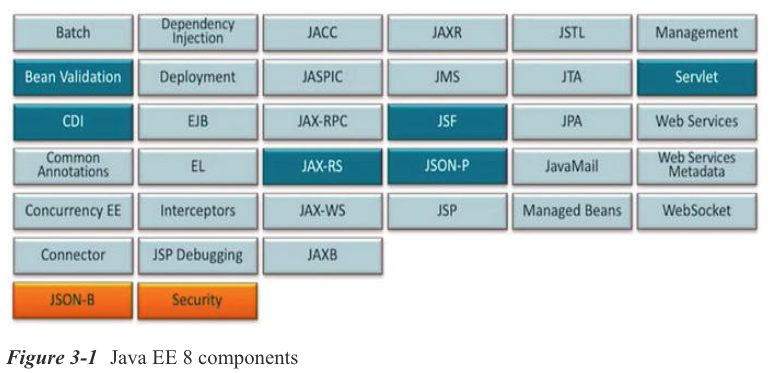
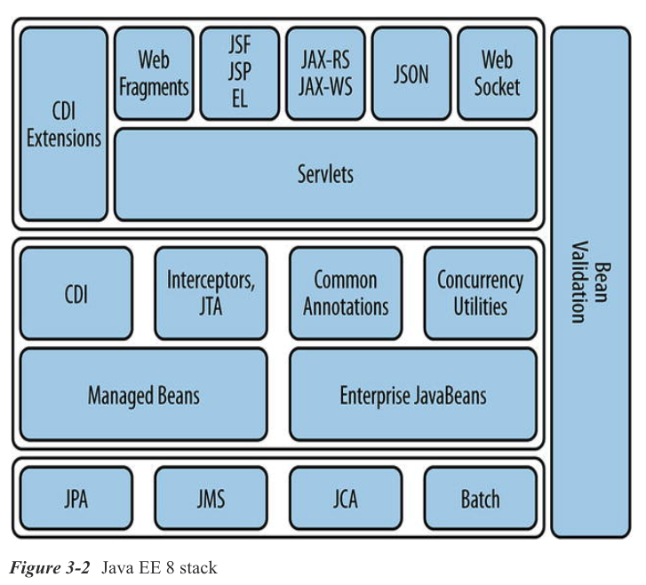
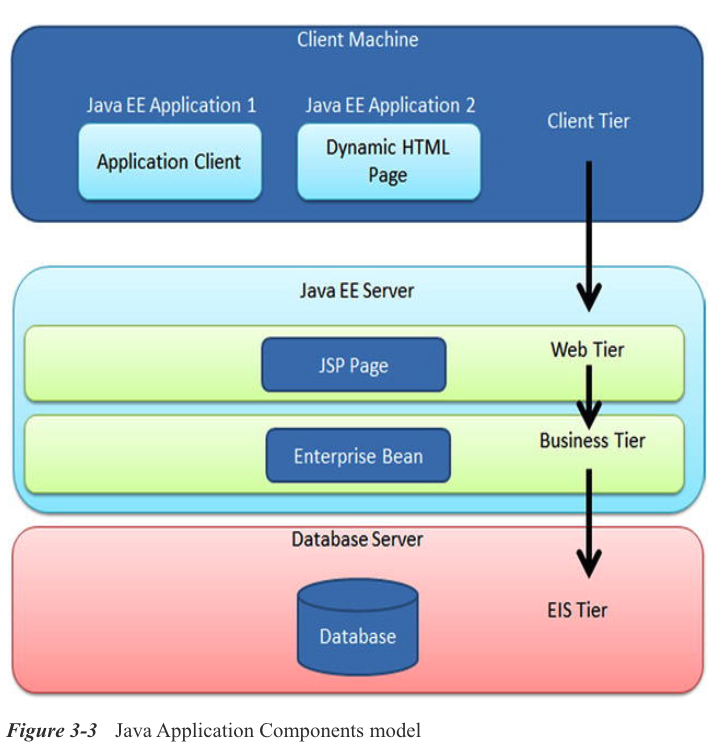

### Chapter 3: Enterprise Applications

* Application Component Models
* Session Beans
   * Stateless Session Beans
   * Stateful Session Beans
   * Singleton Session Beans
* Servlets
* Dependency Management and CDI
   * Dependency Lookup
   * Dependency Injection
   * Declaring Dependencies
* CDI and Contextual Injection
   * CDI Beans
   * Injection and Resolution
   * Scopes and Contexts
   * Qualified Injection
   * Producer Methods and Fields
   * Using Producer Methods with JPA Resources
* Transaction Management
   * Transaction Review
   * Enterprise Transactions in Java
* Putting It All Together
   * Defining the Component
   * Defining the User Interface
   * Packaging It Up
* Summary

No existe tecnología en el vacío, y JPA no es diferente en este sentido. Aunque el estilo de aplicación de cliente pesado que se demostró en el capítulo anterior es un uso viable de JPA, la mayoría de las aplicaciones Java empresariales se implementan en un servidor de aplicaciones, normalmente utilizando tecnologías web Java EE y posiblemente también otras tecnologías. Por lo tanto, es esencial comprender los componentes que componen una aplicación implementada y el papel de JPA en este entorno.

Este libro trata sobre JPA en Java EE 8, cuyas principales características nuevas son compatibles con HTML5, el estándar HTTP/2 y la integración de beans, y una infraestructura mejorada para aplicaciones que se ejecutan en la nube.

Comenzamos con una descripción general de las principales tecnologías Java EE relevantes para la persistencia. Como parte de esta descripción general, describimos el modelo de componente EJB, demostrando la sintaxis básica para algunos de los diferentes tipos de EJB.

Luego pasaremos a cubrir brevemente el mecanismo estándar de inyección de dependencia (DI), principalmente utilizando el enfoque de Contextos e Inyección de dependencia (CDI) de Java EE. Este capítulo no pretende ser una exploración completa o detallada de Java EE o marcos de componentes, y posiblemente no podamos entrar en todos los marcos de DI en la esfera de DI, o incluso en las facilidades que ofrece CDI. Sin embargo, los ejemplos de CDI y EJB son bastante típicos de DI en general y deberían dar a los lectores una idea general de cómo se puede usar JPA con componentes habilitados para DI, ya sean de la variedad Java EE o algún otro componente de contenedor DI, como Spring o Guice.

A continuación, analizamos las transacciones, otra tecnología de servidor de aplicaciones que ha tenido un gran impacto en las aplicaciones que utilizan JPA. Las transacciones son un elemento fundamental de cualquier aplicación empresarial que necesite garantizar la integridad de los datos.

Finalmente, explicamos cómo utilizar las tecnologías descritas en este capítulo dentro del contexto de cómo la persistencia se integra en cada tecnología componente. También revisamos la aplicación Java SE del capítulo anterior y la redirigimos a la plataforma empresarial.

Aquí hay una lista de los cambios más importantes en Java EE 8:

* Java EE 8 platform

* JSON-B 1.0

* JSON-P 1.1

* JAX-RS 2.1

* MVC 1.0

* Java Servlet 4.0

* JSF 2.3

* JMS 2.1

* CDI 2.0

* Java EE Security 1.0

* Java EE Management 2.0

* Concurrency utilities

* Connector architecture

* WebSocket

* JPA

* EJB

* JTA

* JCache

* JavaMail

La figura 3-1 muestra los componentes principales de Java EE 8.



La figura 3-2 muestra el Java EE 8 stack.




## Application Component Models (Modelos de Componentes de Aplicación)

La palabra "component" ha adquirido muchos significados en el desarrollo de software, así que comencemos con una definición. Un componente es una unidad de software autónoma y reutilizable que se puede integrar en una aplicación. Los clientes interactúan con los componentes a través de un contrato bien definido. En Java, la forma más simple de componente de software es ***JavaBean***, comúnmente conocido como solo un **bean**. Los beans son componentes implementados en términos de una sola clase cuyo contrato está definido por los patrones de denominación de los métodos en el bean. Los patrones de nomenclatura de JavaBean son tan comunes ahora que es fácil olvidar que originalmente estaban destinados a brindar a los constructores de interfaces de usuario una forma estándar de tratar con componentes de terceros.

En el espacio empresarial, los componentes se enfocan más en implementar servicios comerciales, con el contrato del componente definido en términos de las operaciones comerciales que puede llevar a cabo ese componente. El modelo de componente tradicional para Java EE siempre ha sido el modelo EJB, que define formas de empaquetar, implementar e interactuar con servicios empresariales autónomos. Luego apareció CDI y trajo un modelo más poderoso y flexible del componente de bean administrado, con beans de CDI que son clases de Java EJB o no EJB.

La elección de utilizar un modelo de componente en su aplicación es en gran medida una preferencia personal, pero generalmente es una buena elección de diseño. El uso de componentes requiere organizar la aplicación en capas, con los servicios empresariales que viven en el modelo de componentes y los servicios de presentación superpuestos.

Históricamente, uno de los desafíos en la adopción de componentes en Java EE fue la complejidad de implementarlos. Con ese problema resuelto en gran medida, nos quedamos con los siguientes beneficios que un conjunto bien definido de servicios comerciales aporta a una aplicación:

* ***Loose coupling*** (Acoplamiento flexible): El uso de componentes para implementar servicios fomenta el acoplamiento flexible entre las capas de una aplicación. La implementación de un componente puede cambiar sin ningún impacto para los clientes u otros componentes que dependen de él.

* ***Dependency management*** (Gestión de dependencias): Las dependencias de un componente se pueden declarar en metadatos y el contenedor las puede resolver automáticamente.

* ***Lifecycle management*** (Gestión del ciclo de vida): El ciclo de vida de los componentes está bien definido y gestionado por el servidor de aplicaciones. Las implementaciones de componentes pueden participar en las operaciones del ciclo de vida para adquirir y liberar recursos, o realizar otro comportamiento de inicialización y apagado.

* ***Declarative container services*** (Servicios de contenedor declarativos): El servidor de aplicaciones intercepta los métodos comerciales de los componentes para aplicar servicios como la concurrencia, la gestión de transacciones, la seguridad y la comunicación remota.

* ***Portability*** (Portabilidad): Los componentes que cumplen con los estándares Java EE y que se implementan en servidores basados en estándares se pueden transferir más fácilmente de un servidor compatible a otro.

* ***Scalability and reliability*** (Escalabilidad y confiabilidad): Los servidores de aplicaciones están diseñados para garantizar que los componentes se administren de manera eficiente con miras a la escalabilidad. Según el tipo de componente y la configuración del servidor, las operaciones comerciales implementadas mediante componentes pueden reintentar llamadas de método fallidas o incluso conmutar por error a otro servidor en un clúster.

A medida que lea este libro, notará que, en algunos casos, un ejemplo utilizará un componente para albergar la lógica empresarial e invocará la API de persistencia de Java. En muchos casos será un bean de sesión, en otros casos será un bean CDI que no es EJB, y en otros será un bean de sesión gestionado por CDI (bean de sesión con alcance). Los beans de sesión son el componente preferido porque son los más sencillos de escribir y configurar y se adaptan naturalmente a la interacción con JPA. El tipo de componente real que utilizamos es menos importante (el tipo de componente es en gran medida sustituible siempre que sea gestionado por un contenedor que admita JPA y transacciones) que ilustrar cómo los componentes encajan en el JPA y pueden invocarlo.

La Figura 3-3 muestra el modelo de componentes de la aplicación Java.



## STATELESS SESSION BEANS

Los beans de sesión son una tecnología de componentes diseñada para encapsular servicios empresariales. Las operaciones accesibles al cliente soportadas por el servicio pueden definirse usando una interfaz Java, o en ausencia de una interfaz, solo el conjunto de métodos públicos en la clase de implementación del bean. La clase bean es poco más que una clase Java normal y, sin embargo, en virtud de ser parte del modelo de componente EJB, el bean tiene acceso a una amplia gama de servicios de contenedor. El significado del nombre "session bean" tiene que ver con la forma en que los clientes acceden e interactúan con ellos. Una vez que un cliente adquiere una referencia a un bean de sesión del servidor, inicia una sesión con ese bean y puede invocar operaciones comerciales en él.

**Hay tres tipos de beans de sesión: sin *estado(stateless)*, con *estado(stateful)* y *singleton***. La interacción con un bean de sesión sin estado comienza al inicio de una llamada a un método empresarial y finaliza cuando finaliza la llamada al método. No hay ningún estado que se transfiera de una operación comercial a otra. Una interacción con beans de sesión con estado se convierte más en una conversación que comienza desde el momento en que el cliente adquiere una referencia al bean de sesión y finaliza cuando el cliente lo devuelve explícitamente al servidor. Las operaciones comerciales en un bean de sesión con estado pueden mantener el estado en la instancia del bean en todas las llamadas. Proporcionamos más detalles sobre las consideraciones de implementación de esta diferencia en el estilo de interacción a medida que describimos cada tipo de bean de sesión.

***Los beans de sesión singleton*** pueden considerarse un híbrido de beans de sesión sin estado y con estado. Todos los clientes comparten la misma instancia de bean singleton, por lo que es posible compartir el estado entre las invocaciones de métodos, pero los beans de sesión singleton carecen del contrato conversacional y la movilidad de los beans de sesión con estado. El estado de un bean de sesión singleton también plantea problemas de simultaneidad que deben tenerse en cuenta al decidir si utilizar este estilo de bean de sesión.

Como ocurre con la mayoría de los contenedores de componentes, los clientes de un contenedor EJB no interactúan directamente con una instancia de bean de sesión. El cliente hace referencia e invoca una implementación de la interfaz comercial o la clase de bean proporcionada por el servidor. Esta clase de implementación actúa como un proxy para la implementación del bean subyacente. Este desacoplamiento del cliente del bean permite que el servidor intercepte las llamadas a métodos para proporcionar los servicios requeridos por el bean, como la gestión de transacciones. También permite que el servidor optimice y reutilice instancias de la clase de bean de sesión según sea necesario.

En las siguientes secciones, analizamos los beans de sesión que utilizan invocaciones de métodos de negocio sincrónicos. Los métodos comerciales asincrónicos ofrecen un patrón de invocación alternativo que involucra futuros, pero están más allá del alcance de este libro.

### STATELESS SESSION BEANS

Como se mencionó, un bean de sesión sin estado se propone completar una operación dentro de la vida útil de un solo método. Los beans sin estado pueden implementar muchas operaciones comerciales, pero cada método no puede asumir que se invocó otro antes.

Esto puede parecer una limitación del bean sin estado, pero es, con mucho, la forma más común de implementación de servicios empresariales. A diferencia de los beans de sesión con estado, que son buenos para acumular estado durante una conversación (como el carro de la compra de una aplicación minorista), los beans de sesión sin estado están diseñados para realizar operaciones independientes de manera muy eficiente. Los beans de sesión sin estado pueden escalar a una gran cantidad de clientes con un impacto mínimo en los recursos generales del servidor.

#### ***Definición de un Stateless Session Bean (Bean de Sesión sin Estado)***

Un bean de sesión se define en dos partes:

* Cero o más interfaces comerciales que definan qué métodos puede invocar un cliente en el bean. Cuando no se define ninguna interfaz, el conjunto de métodos públicos en la clase de implementación del bean forma una interfaz lógica de cliente.

* Una clase que implementa estas interfaces, llamada clase bean, que está marcada con la anotación `@Stateless`.

Si desea hacer frente a su bean de sesión con una interfaz real o no, es una cuestión de preferencia. Mostramos ejemplos de ambos, pero generalmente no usamos la interfaz en ejemplos posteriores.

Veamos primero una versión interconectada de un bean de sesión sin estado. El Listado 3-1 muestra la interfaz empresarial que es compatible con este bean de sesión. En este ejemplo, el servicio consta de un solo método, `sayHello()`, que acepta un argumento `String` correspondiente al nombre de una persona y devuelve una respuesta `String`. No hay ninguna anotación o interfaz principal que indique que se trata de una interfaz empresarial. Cuando se implementa mediante el bean de sesión, se tratará automáticamente como una interfaz comercial local, lo que significa que solo es accesible para los clientes dentro del mismo servidor de aplicaciones. También es posible un segundo tipo de interfaz empresarial para clientes remotos, pero no se utiliza con frecuencia.

***Listado 3-1*** La Interfaz Empresarial para un Session Bean (Bean de Sesión)

```java
public interface HelloService {
   public String sayHello(String name);
}
```

Ahora consideremos la implementación, que se muestra en el Listado 3-2. Esta es una clase Java normal que implementa la interfaz empresarial `HelloService`. Lo único que es único sobre esta clase es la anotación `@Stateless` <sup>1</sup> que la marca como un bean de sesión sin estado. El método comercial se implementa sin restricciones o requisitos especiales. Esta es una clase normal que resulta ser un EJB.

***Listado 3-2*** La clase Bean que implementa la interfaz `HelloService`

```java
@Stateless
public class HelloServiceBean implements HelloService {
   public String sayHello(String name) {
      return "Hello, "  + name;
   }
}
```

En términos de diseño de API, usar una interfaz es probablemente la mejor manera de exponer las operaciones de un bean de sesión, ya que separa la interfaz de la implementación. Sin embargo, la norma actual es implementar componentes como clases simples que contienen la lógica empresarial sin una interfaz. Usando este enfoque, el bean de sesión sería simplemente como se muestra en el Listado 3-3.


***Listado 3-3*** Un Session Bean sin Interfaz

```java
@Stateless
public class HelloService {
   public String sayHello(String name) {
      return “Hello, “ + name;
   }
}
```

La interfaz lógica del bean de sesión consta de sus métodos públicos; en este caso, el método `sayHello()`. Los clientes usan la clase `HelloServiceBean` como si fuera una interfaz y deben ignorar cualquier método no público o detalles de la implementación. Bajo las sábanas, el cliente interactuará con un proxy que extiende la clase de bean y anula los métodos comerciales para proporcionar los servicios de contenedor estándar.

#### ***Lifecycle Callbacks***

A diferencia de una clase Java normal utilizada en el código de la aplicación, el servidor gestiona el ciclo de vida de un bean de sesión sin estado. El servidor decide cuándo crear y eliminar instancias de bean y tiene que inicializar los servicios para una instancia de bean después de que se construya, pero antes de que se invoque la lógica empresarial del bean. Del mismo modo, es posible que el bean tenga que adquirir un recurso, como una fuente de datos JDBC, antes de poder utilizar los métodos comerciales. Sin embargo, para que el bean adquiera un recurso, el servidor primero debe haber completado la inicialización de sus servicios para el bean. Esto limita la utilidad del constructor para la clase porque el bean no tendrá acceso a ningún recurso hasta que se complete la inicialización del servidor.

Para permitir que tanto el servidor como el bean logren sus requisitos de inicialización, los EJB admiten métodos de devolución de llamada del ciclo de vida que el servidor invoca en varios puntos del ciclo de vida del bean. Para los beans de sesión sin estado, hay dos devoluciones de llamada de ciclo de vida: `PostConstruct` y `PreDestroy`. El servidor invocará la devolución de llamada de `PostConstruct` tan pronto como haya completado la inicialización de todos los servicios de contenedor para el bean. En efecto, esto reemplaza al constructor como la ubicación para la lógica de inicialización porque es solo aquí donde se garantiza la disponibilidad de los servicios de contenedor. El servidor invoca la devolución de llamada `PreDestroy` inmediatamente antes de que el servidor libere la instancia del bean para que sea recolectada como basura. Cualquier recurso adquirido durante `PostConstruct` que requiera un cierre explícito debe liberarse durante `PreDestroy`.

El Listado 3-4 muestra un bean de sesión sin estado que adquiere una referencia a una instancia `java.util.logging.Logger` durante la devolución de llamada de `PostConstruct`, identificada por la anotación de marcador `@PostConstruct`. Asimismo, una devolución de llamada `PreDestroy` se identifica mediante la anotación `@PreDestroy`.


***Listado 3-4*** Uso de `PostConstruct ` Callback para Adquirir un Logger

```java
@Stateless
public class LoggerBean {
   private Logger logger;
   
   @PostConstruct
   void init() {
      logger = Logger.getLogger("notification");
   }
   public void logMessage(String message) {
      logger .info(message);
   }
}
```

### STATEFUL SESSION BEANS

En la introducción a los beans de sesión, describimos la diferencia entre beans sin estado y con estado como basada en el estilo de interacción entre cliente y servidor. En el caso de los beans de sesión sin estado, esa interacción comenzó y terminó con una única llamada al método. A veces, los clientes necesitan emitir varias solicitudes y que cada solicitud pueda acceder o considerar los resultados de solicitudes anteriores. Los beans de sesión con estado están diseñados para manejar este escenario proporcionando un servicio dedicado a un cliente que comienza cuando el cliente obtiene una referencia al bean y finaliza solo cuando el cliente elige terminar la conversación.

El ejemplo por excelencia del bean de sesión con estado es el carrito de compras de una aplicación de comercio electrónico. El cliente obtiene una referencia al carrito de la compra, iniciando la conversación. Durante el lapso de la sesión del usuario, el cliente agrega o elimina artículos del carrito de compras, que mantiene el estado específico del cliente. Luego, cuando finaliza la sesión, el cliente completa la compra, provocando que se retire el carrito de la compra.

Esto no es diferente al uso de un objeto Java no administrado en el código de la aplicación. Usted crea una instancia, invoca operaciones en el objeto que acumulan estado y luego desecha el objeto cuando ya no lo necesita. La única diferencia con el bean de sesión con estado es que el servidor administra la instancia del objeto real y el cliente interactúa con esa instancia indirectamente a través de un objeto proxy.

Los beans de sesión con estado ofrecen un superconjunto de la funcionalidad disponible en los beans de sesión sin estado. Las características que cubrimos para los beans de sesión sin estado se aplican igualmente a los beans de sesión con estado.

#### ***Definición de un Stateful Session Bean (Bean de Sesión con Estado)***

Ahora que hemos establecido el caso de uso para un bean de sesión con estado, veamos cómo definir uno. De manera similar al bean de sesión sin estado, un bean de sesión con estado puede tener o no una interfaz implementada por una sola clase de bean. El Listado 3-5 muestra la clase de bean para el bean de sesión con estado `ShoppingCart`. La clase de bean se ha marcado con la anotación `@Stateful` para indicar al servidor que la clase es un bean de sesión con estado.

***Listado 3-5*** Implementación de un Carrito de la Compra mediante un Stateful Session Bean (Bean de Sesión con Estado)

```java
@Stateful
public class ShoppingCart {
   
   private HashMap<String,Integer> items = new HashMap<String,Integer>();
   
   public void addItem(String item, int quantity) {
      Integer orderQuantity = items.get(item);
      if (orderQuantity == null) {
         orderQuantity = 0;
      }
      orderQuantity += quantity;
      items.put(item, orderQuantity);
   }
    
   public void removeItem(String item, int quantity) {
      // ...
   }
   
   public Map<String,Integer> getItems() {
      // ...
   }
   
   // ...
   @Remove
   public void checkout(int paymentId) {
      // store items to database
      // ...
   }
    
   @Remove
   public void cancel() {
   }
}
```


Hay dos cosas diferentes en este bean en comparación con los beans de sesión sin estado con los que hemos estado tratando hasta ahora.

La primera diferencia es que la clase de bean tiene campos de estado que son modificados por los métodos comerciales del bean. Esto está permitido porque el cliente que utiliza el bean de manera efectiva tiene acceso a una instancia privada del bean de sesión en la que realizar cambios.

La segunda diferencia es que hay métodos marcados con la anotación `@Remove`. Estos son los métodos que utilizará el cliente para finalizar la conversación con el bean. Después de que se haya llamado a uno de estos métodos, el servidor destruirá la instancia del bean y la referencia del cliente lanzará una excepción si se hace algún intento adicional para invocar métodos comerciales. Cada bean de sesión con estado debe definir al menos un método marcado con la anotación `@Remove`, incluso si el método no hace nada más que servir como final de la conversación. En el Listado 3-5, se llama al método `checkout()` si el usuario completa la transacción de compra, aunque se llama a `cancel()` si el usuario decide no continuar. El bean de sesión se elimina en cualquier caso.

#### ***Lifecycle Callbacks***

Al igual que el bean de sesión sin estado, el bean de sesión con estado también admite devoluciones de llamada del ciclo de vida para facilitar la inicialización y limpieza del bean. También admite dos devoluciones de llamada adicionales para permitir que el bean maneje con gracia la pasivación y activación de la instancia del bean. ***La pasivación es el proceso mediante el cual el servidor serializa la instancia de bean para que pueda almacenarse fuera de línea para liberar recursos o replicarse en otro servidor en un clúster***. ***La activación es el proceso de deserialización de una instancia de bean de sesión pasivada y volverla a activar en el servidor***. Debido a que los beans de sesión con estado mantienen el estado en nombre de un cliente y no se eliminan hasta que el cliente invoca uno de los métodos de eliminación en el bean, el servidor no puede destruir una instancia de bean para liberar recursos. La pasivación permite que el servidor recupere recursos temporalmente mientras conserva el estado de la sesión.

Antes de que un bean sea pasivado, el servidor invocará la devolución de llamada `PrePassivate`. El bean usa esta devolución de llamada para preparar el bean para la serialización, generalmente cerrando cualquier conexión activa a otros recursos del servidor. El método `PrePassivate` se identifica mediante la anotación de marcador `@PrePassivate`. Después de que se haya activado un bean, el servidor invocará la devolución de llamada `PostActivate`. Con la instancia serializada restaurada, el bean debe volver a adquirir cualquier conexión a otros recursos de los que dependan los métodos comerciales del bean. El método `PostActivate` se identifica mediante la anotación de marcador `@PostActivate`.

El Listado 3-6 muestra un bean de sesión que usa las devoluciones de llamada del ciclo de vida para mantener una conexión JDBC `Connection`. Tenga en cuenta que solo la conexión JDBC se gestiona explícitamente. Como fábrica de conexiones de recursos, el servidor guarda y restaura automáticamente la fuente de datos durante la pasivación y activación.

***Listado 3-6*** Uso de Lifecycle Callbacks en un Stateful Session Bean

```java
@Stateful
public class OrderBrowser {
   
   DataSource ds;
   Connection conn;
    
   @PostConstruct
   void init() {
      // acquire the data source
      // ...
      acquireConnection();
   }

   @PrePassivate
   void passivate() { releaseConnection(); }
   
   @PostActivate
   void activate() { acquireConnection(); }
    
   @PreDestroy
   void shutdown() { releaseConnection(); }
    
   private void acquireConnection() {
      try {
         conn = ds.getConnection();
      } catch (SQLException e) {
         throw new EJBException(e);
      }
   }
    
   private void releaseConnection() {
      try {
         conn.close();
      } catch (SQLException e) {
      } finally {
         conn = null;
      }
   }
    
   public Collection<Order> listOrders() {
      // ...
   }
    
   @Remove
   public void remove() {}
   
}
```

### SINGLETON SESSION BEANS

Dos de las críticas más comunes al bean de sesión sin estado han sido la sobrecarga percibida de la agrupación de beans y la incapacidad de compartir el estado a través de campos estáticos. El bean de sesión singleton intenta proporcionar una solución a ambas preocupaciones proporcionando una única instancia de bean compartida a la que se puede acceder simultáneamente y utilizar como mecanismo para el estado compartido. Los beans de sesión singleton comparten las mismas devoluciones de llamada del ciclo de vida que un bean de sesión sin estado, y los recursos gestionados por el servidor, como los contextos de persistencia, se comportan de la misma manera que si fueran parte de un bean de sesión sin estado. Pero las similitudes terminan ahí porque los beans de sesión singleton tienen un ciclo de vida general diferente al de los beans de sesión sin estado y tienen la complejidad adicional del bloqueo controlado por el desarrollador para la sincronización.

A diferencia de otros beans de sesión, se puede declarar que el singleton se crea con entusiasmo durante la inicialización de la aplicación y que existe hasta que se apaga. Una vez creado, seguirá existiendo hasta que el contenedor lo elimine, independientemente de las excepciones que se produzcan durante la ejecución del método comercial. Esta es una diferencia clave con respecto a otros tipos de bean de sesión porque la instancia de bean nunca se volverá a crear en caso de una excepción del sistema.

La larga vida y la instancia compartida del bean de sesión singleton lo convierten en el lugar ideal para almacenar el estado común de la aplicación, ya sea de solo lectura o lectura-escritura. Para proteger el acceso a este estado, el bean de sesión singleton proporciona una serie de opciones de simultaneidad en función de las necesidades del desarrollador de la aplicación. Los métodos pueden desincronizarse por completo para mejorar el rendimiento, o el contenedor los puede bloquear y administrar automáticamente.

#### ***Definición de un Singleton Session Bean***

Siguiendo el patrón de los beans de sesión sin estado y con estado, los beans de sesión singleton se definen mediante la anotación `@Singleton`. Los beans de sesión singleton pueden incluir una interfaz o utilizar una vista sin interfaz. El Listado 3-7 muestra un bean de sesión singleton simple con una vista sin interfaz para rastrear el número de visitas a un sitio web.


***Listado 3-7*** Implementación de un Singleton Session Bean

```java
@Singleton
public class HitCounter {
   int count;
   public void increment() { ++count; }
   public void getCount() { return count; }
   public void reset() { count = 0; }
}
```

Si compara el bean `HitCounter` del Listado 3-7 con los beans de sesión sin estado y con estado definidos anteriormente, puede ver dos diferencias inmediatas. A diferencia del bean de sesión sin estado, existe un estado en forma de campo de recuento que se utiliza para capturar el recuento de visitas. Pero a diferencia del bean de sesión con estado, no hay una anotación `@Remove` para identificar el método de negocio que completará la sesión.

De forma predeterminada, el contenedor administrará la sincronización de los métodos comerciales para garantizar que no se produzcan daños en los datos. En este ejemplo, eso significa que todo el acceso al bean se serializa para que solo un cliente invoque un método comercial en la instancia en cualquier momento.

El ciclo de vida del bean de sesión singleton está vinculado al ciclo de vida de la aplicación general. El contenedor determina el punto en el que se crea la instancia de singleton a menos que la clase de bean esté anotada con la anotación `@Startup` para forzar la inicialización ansiosa cuando se inicia la aplicación. El contenedor puede crear singletons que no especifican la inicialización ansiosa de manera perezosa, pero esto es específico del proveedor y no se puede asumir.

#### ***Lifecycle Callbacks***

Las devoluciones de llamada del ciclo de vida de los beans de sesión singleton son las mismas que las de los beans de sesión sin estado: `PostConstruct` y `PreDestroy`. El contenedor invocará la devolución de llamada de `PostConstruct` después de la inicialización del servidor de la instancia de bean y de la misma manera invocará la devolución de llamada de `PreDestroy` antes de eliminar la instancia de bean. La diferencia clave aquí con respecto a los beans de sesión sin estado es que `PreDestroy` se invoca solo cuando la aplicación se apaga como un todo. Por lo tanto, se llamará solo una vez, mientras que las devoluciones de llamada del ciclo de vida de los beans de sesión sin estado se invocan con frecuencia a medida que se crean y destruyen las instancias de bean.

## Servlets

Los servlets son una tecnología de componentes diseñada para satisfacer las necesidades de los desarrolladores web que necesitan responder a las solicitudes HTTP y generar contenido dinámico a cambio. Los servlets son la tecnología más antigua y popular introducida como parte de la plataforma Java EE. Son la base de tecnologías como JavaServer Pages (JSP) y la columna vertebral de marcos web como JavaServer Faces (JSF).

Aunque es posible que tenga algo de experiencia con servlets, vale la pena describir el impacto que los modelos de aplicaciones web han tenido en el desarrollo de aplicaciones empresariales. Debido a su dependencia del protocolo HTTP, la Web es inherentemente un medio sin estado. Al igual que los beans de sesión sin estado descritos anteriormente, un cliente realiza una solicitud, el servidor activa el método de servicio apropiado en el servlet y el contenido se genera y se devuelve al cliente. Cada solicitud es completamente independiente de la anterior.

Esto presenta un desafío porque muchas aplicaciones web implican algún tipo de conversación entre el cliente y el servidor en el que las acciones previas del usuario influyen en los resultados devueltos en las páginas siguientes. Para mantener ese estado de conversación, muchas aplicaciones tempranas intentaron incrustar dinámicamente información de contexto en URL. Desafortunadamente, esta técnica no solo no escala muy bien, sino que también requiere un elemento dinámico para toda la generación de contenido que dificulta que los no desarrolladores escriban contenido para una aplicación web.

Los servlets resuelven el problema del estado conversacional con la sesión. No debe confundirse con el bean de sesión, la sesión HTTP es un mapa de datos asociados con un ID de sesión. Cuando la aplicación solicita que se cree una sesión, el servidor genera un nuevo ID y devuelve un objeto `HTTPSession` que la aplicación puede usar para almacenar pares de datos key/value. Luego utiliza técnicas como las cookies del navegador para vincular el ID de sesión con el cliente, uniendo los dos en una conversación. Para las aplicaciones web, el cliente ignora en gran medida el estado conversacional que rastrea el servidor.

El uso eficaz de la sesión HTTP es un elemento importante del desarrollo de servlets. El Listado 3-8 muestra los pasos necesarios para solicitar una sesión y almacenar datos de conversación en ella. En este ejemplo, asumiendo que el usuario ha iniciado sesión, el servlet almacena el ID de usuario en la sesión, haciéndolo disponible para su uso en todas las solicitudes posteriores del mismo cliente. La llamada `getSession()` en el objeto `HttpServletRequest` devolverá la sesión activa o creará una nueva si no existe una. Una vez obtenida, la sesión actúa como un mapa, con pares key/value establecidos y recuperados con los métodos `setAttribute()` y `getAttribute()`, respectivamente. Como verá más adelante en este capítulo, la sesión del servlet, que almacena datos no estructurados, a veces se empareja con un bean de sesión con estado para administrar la información de la sesión con el beneficio de una interfaz comercial bien definida.

***Listado 3-8*** Mantenimiento del Estado Conversacional con un Servlet

```java
public class LoginServlet extends HttpServlet {
   protected void doPost(HttpServletRequest request, HttpServletResponse response)
            throws ServletException, IOException {
      String userId = request.getParameter("user");
      HttpSession session = request.getSession();
      session.setAttribute("user", userId);
      // ...
   }
}
```

El auge de los frameworks de aplicaciones dirigidos a la Web también ha cambiado la forma en que desarrollamos aplicaciones web. El código de aplicación escrito en servlets se está reemplazando rápidamente con código de aplicación extraído del modelo base utilizando marcos como JSF. Cuando se trabaja en un entorno como este, los problemas básicos de persistencia de la aplicación, como dónde adquirir y almacenar el administrador de la entidad y cómo utilizar las transacciones de manera eficaz y rápida, se vuelven relevantes.

Aunque exploramos algunos de estos problemas, la persistencia en el contexto de un marco como JSF está más allá del alcance de este libro. Como solución general, recomendamos adoptar un modelo de componentes en el que centrar las operaciones de persistencia. Los beans de sesión, por ejemplo, son fácilmente accesibles desde cualquier lugar dentro de una aplicación Java EE, lo que los convierte en un terreno neutral perfecto para los servicios empresariales. La capacidad de intercambiar entidades dentro y fuera del modelo de bean de sesión significa que los resultados de las operaciones de persistencia se podrán utilizar directamente en marcos web sin tener que acoplar estrechamente el código de presentación a la API de persistencia.

## Dependency Management y CDI

La lógica empresarial de un componente Java EE no suele ser completamente autónoma. La mayoría de las veces, la implementación depende de otros recursos. Esto puede incluir recursos del servidor, como una fuente de datos JDBC, o recursos definidos por la aplicación, como otro componente o administrador de entidad para una unidad de persistencia específica. La plataforma central Java EE contiene un soporte bastante limitado para inyectar dependencias en una cantidad limitada de recursos de servidor predefinidos, como fuentes de datos, transacciones administradas y otros. Sin embargo, el estándar CDI va mucho más allá de la simple inyección de dependencia (DI) y proporciona un marco extenso para soportar una amplia gama de requisitos, desde los más triviales hasta los exóticos. Comenzamos describiendo los conceptos básicos y el soporte contenido dentro de la plataforma desde antes de CDI y luego pasamos a CDI y su modelo de DI contextual.

Los componentes de Java EE admiten la noción de referencias a recursos. Una referencia es un enlace con nombre a un recurso que puede resolverse dinámicamente en tiempo de ejecución desde el código de la aplicación o resolverse automáticamente por el contenedor cuando se crea la instancia del componente. Cubrimos cada uno de estos escenarios en breve.

Una referencia consta de dos partes: un nombre y un objetivo. El código de la aplicación usa el nombre para resolver la referencia de forma dinámica, mientras que el servidor usa la información de destino para encontrar el recurso que la aplicación está buscando. El tipo de recurso que se ubicará determina el tipo de información requerida para coincidir con el objetivo. Cada referencia de recurso requiere un conjunto diferente de información específica del tipo de recurso al que se refiere.

Una referencia se declara utilizando una de las anotaciones de referencia de recursos: `@Resource`, `@EJB`, `@PersistenceContext` o `@PersistenceUnit`. Estas anotaciones se pueden colocar en una clase, campo o método de establecimiento. La elección de la ubicación determina el nombre predeterminado de la referencia y si el servidor resuelve o no la referencia automáticamente.

### DEPENDENCY LOOKUP

La primera estrategia para resolver dependencias en el código de la aplicación que discutimos se llama búsqueda de dependencias. Esta es la forma tradicional de gestión de dependencias en Java EE, en la que el código de la aplicación es responsable de buscar una referencia con nombre utilizando la Interfaz de directorio y nombres de Java (JNDI) Java Naming and Directory Interface.

Todas las anotaciones de recursos admiten un atributo llamado `name` que define el nombre JNDI de la referencia. Cuando la anotación de recurso se coloca en la definición de clase, este atributo es obligatorio. Si la anotación de recursos se coloca en un campo o en un método de establecimiento, el servidor generará un nombre predeterminado. Cuando se usa la búsqueda de dependencias, las anotaciones generalmente se colocan en el nivel de clase y el nombre se especifica explícitamente. Colocar una referencia de recurso en un campo o método de establecimiento tiene otros efectos además de generar un nombre predeterminado que discutiremos en la siguiente sección.

La función del nombre es proporcionar una forma para que el cliente resuelva la referencia de forma dinámica. Cada servidor de aplicaciones Java EE admite JNDI, aunque las aplicaciones lo utilizan con menos frecuencia desde el advenimiento de la inyección de dependencias, y cada componente Java EE tiene su propio contexto de denominación JNDI de ámbito local denominado contexto de denominación del entorno. El nombre de la referencia está vinculado al contexto de nomenclatura del entorno y, cuando se busca mediante la API JNDI, el servidor resuelve la referencia y devuelve el destino de la referencia.

Considere el bean de sesión `DeptService` que se muestra en el Listado 3-9. Ha declarado una dependencia de un bean de sesión utilizando la anotación `@EJB` y le ha dado el nombre `deptAudit`. El elemento `beanInterface` de la anotación `@EJB` hace referencia a la clase de bean de sesión. En el `PostConstruct` callback, el bean de auditoría se busca y se almacena en el campo `audit`. Las interfaces `Context` e `InitialContext` están definidas por la API JNDI. El método `lookup()` de la interfaz de contexto es la forma tradicional de recuperar objetos de un contexto JNDI. Para encontrar la referencia denominada `deptAudit`, la aplicación busca el nombre `java:comp/env/deptAudit` y envía el resultado a `AuditService`. El prefijo `java:comp/env/` que se agregó al nombre de la referencia indica al servidor que se debe buscar el contexto de nomenclatura del entorno para encontrar la referencia. Si el nombre se especifica incorrectamente, la búsqueda fallará.

***Listado 3-9*** Buscando una Dependencia de EJB

```java
@Stateless
@EJB(name="deptAudit", beanInterface=AuditService.class)
public class DeptService {
   private AuditService audit;
    
   @PostConstruct
   void init() {
      try {
         Context ctx = new InitialContext();
         audit = (AuditService) ctx.lookup("java:comp/env/deptAudit");
      } catch (NamingException e) {
         throw new EJBException(e);
      }
   }
   // ...
}
```

Todos los componentes de Java EE admiten el uso de la API JNDI para buscar referencias de recursos en el contexto de denominación del entorno. Sin embargo, es un método algo engorroso para encontrar un recurso debido a los requisitos de manejo de excepciones de JNDI. Los EJB también admiten una sintaxis alternativa utilizando el método `lookup()` de la interfaz `EJBContext`. La interfaz `EJBContext` (y subinterfaces como `SessionContext`) está disponible para cualquier EJB y proporciona al bean acceso a servicios de tiempo de ejecución como el servicio de temporizador. El Listado 3-10 muestra el mismo ejemplo que el Listado 3-9 usando el método `lookup()`. La instancia de `SessionContext` en este ejemplo se proporciona a través de un método de establecimiento que es llamado por el contenedor. Volvemos a visitar este ejemplo más adelante en la sección denominada "Referencias a los recursos del servidor" para ver cómo se invoca.


***Listado 3-10*** Usando el método `EJBContext lookup()`

```java
@Stateless
@EJB(name="deptAudit", beanInterface=AuditService.class)
public class DeptService  {
   SessionContext context;
   AuditService audit;
    
   public void setSessionContext(SessionContext context) {
      this.context = context;
   }
    
   @PostConstruct
   public void init() {
      audit = (AuditService) context.lookup("deptAudit");
   }
   // ...
}
```

El método `EJBContext lookup()` tiene dos ventajas sobre la API JNDI. La primera es que el argumento del método es el nombre exactamente como se especificó en la referencia del recurso. La segunda es que solo se lanzan excepciones de tiempo de ejecución desde el método `lookup()` para evitar el manejo de excepciones comprobado de la API JNDI. Detrás de escena, se realiza exactamente la misma secuencia de llamadas a la API JNDI del Listado 3-9, pero las excepciones JNDI se manejan automáticamente.

### DEPENDENCY INJECTION

Cuando se coloca una anotación de recurso en un campo o método de establecimiento, ocurren dos cosas. Primero, se declara una referencia de recurso como si se hubiera colocado en la clase de bean (similar a la forma en que funcionaba la anotación `@EJB` en el ejemplo del Listado 3-9), y el nombre de ese recurso se vinculará al entorno contexto de nomenclatura cuando se crea el componente. En segundo lugar, el servidor realiza la búsqueda automáticamente en su nombre y establece el resultado en la clase instanciada.

El proceso de buscar automáticamente un recurso y configurarlo en la clase se llama inyección de dependencia porque se dice que el servidor inyecta la dependencia resuelta en la clase. Esta técnica, una de las varias comúnmente denominadas inversión de control, elimina la carga de buscar recursos manualmente en el contexto del entorno JNDI.

La inyección de dependencias se considera una práctica recomendada para el desarrollo de aplicaciones, no solo porque reduce la necesidad de búsquedas JNDI sino también porque simplifica las pruebas. Sin ningún código de API JNDI en la clase que tenga dependencias en el entorno de ejecución del servidor de aplicaciones, la clase de bean se puede instanciar directamente en una prueba unitaria. Luego, el desarrollador puede proporcionar manualmente las dependencias necesarias y probar la funcionalidad de la clase en cuestión en lugar de preocuparse por cómo solucionar la búsqueda de JNDI.

#### ***Field Injection***

La primera forma de inyección de dependencia se llama ***Field Injection***. Inyectar una dependencia en un campo significa que después de que el servidor busca la dependencia en el contexto de nomenclatura del entorno, asigna el resultado directamente al campo anotado de la clase. El Listado 3-11 revisita el ejemplo del Listado 3-9 y demuestra un uso más simple de la anotación `@EJB`, esta vez inyectando el resultado en el campo `audit`. El código de la interfaz de directorio utilizado antes desapareció y los métodos de negocio del bean pueden asumir que el campo de auditoría contiene una referencia al bean `AuditService`.

***Listado 3-11*** Uso de Field Injection

```java
@Stateless
public class DeptService {
   @EJB AuditService audit;
   // ...
}
```

La Field Injection (inyección de campo) es sin duda la más fácil de implementar, y los ejemplos de este libro siempre optan por utilizar este formulario en lugar del formulario de búsqueda dinámica. Lo único que se debe tener en cuenta con la inyección de campo es que si está planeando realizar pruebas unitarias, debe agregar un método de establecimiento o hacer que el campo sea accesible para sus pruebas unitarias para satisfacer manualmente la dependencia. Los campos privados, aunque legales, requieren hacks desagradables si no hay una forma accesible de establecer su valor. Considere el alcance del paquete para la inyección de campo si desea realizar una prueba unitaria sin tener que agregar un establecedor.

Mencionamos en la sección anterior que se genera automáticamente un nombre para la referencia cuando se coloca una anotación de recurso en un campo o método de establecimiento. Para completar, describimos el formato de este nombre, pero es poco probable que encuentre muchas oportunidades para usarlo. El nombre generado es el nombre de clase completo, seguido de una barra diagonal y luego el nombre del campo o propiedad. Esto significa que si el bean `DeptService` se encuentra en el paquete `persistence.session`, el EJB inyectado al que se hace referencia en el Listado 3-9 sería accesible en el contexto de nomenclatura del entorno con el nombre `persistence.session.DeptService/audit`. La especificación del elemento `name` para la anotación de recurso anulará este valor predeterminado.

#### ***Setter Injection***

La segunda forma de inyección de dependencia se llama *setter injection* (inyección de setter) e implica anotar un método de setter en lugar de un campo de clase. Cuando el servidor resuelve la referencia, invocará el método de establecimiento anotado con el resultado de la búsqueda. El Listado 3-12 vuelve a visitar el Listado 3-9 una vez más para demostrar el uso de la inyección de setter.

***Listado 3-12*** Uso de Setter Injection

```java
@Stateless
public class DeptService {
   private AuditService audit;
   @EJB
   public void setAuditService(AuditService audit) {
      this.audit = audit;
   }
   // ...
}
```

Este estilo de inyección permite campos privados, pero también funciona bien con pruebas unitarias. Cada prueba puede simplemente instanciar la clase de bean y realizar manualmente la inyección de dependencia invocando el método setter, generalmente proporcionando una implementación del recurso requerido que se adapta a la prueba.

### DECLARACIÓN DE DEPENDENCIAS

Las siguientes secciones describen algunas de las anotaciones de recursos descritas en la especificación Java EE. Cada anotación tiene un atributo de nombre para especificar opcionalmente el nombre de referencia para la dependencia. Otros atributos de las anotaciones son específicos del tipo de recurso que se debe adquirir.

#### ***Referenciar un Persistence Context (Contexto de Persistencia)***

En el capítulo anterior, demostramos cómo crear un administrador de entidad para un contexto de persistencia usando un `EntityManagerFactory` devuelto por la clase `Persistence`. En el entorno Java EE, la anotación `@PersistenceContext` se puede utilizar para declarar una dependencia en un contexto de persistencia y hacer que el administrador de entidades para ese contexto de persistencia se adquiera automáticamente.

El Listado 3-13 demuestra el uso de la anotación `@PersistenceContext` para adquirir un administrador de entidades mediante la inyección de dependencias en un bean de sesión sin estado. El elemento `unitName` especifica el nombre de la unidad de persistencia en la que se basará el contexto de persistencia.

**TIP** ***Si se omite el elemento `unitName`, la forma en que se determina el nombre de la unidad para el contexto de persistencia depende del proveedor. Algunos proveedores pueden proporcionar un valor predeterminado si solo hay una unidad de persistencia para una aplicación, mientras que otros pueden requerir que el nombre de la unidad se especifique en un archivo de configuración específico del proveedor***.

***Listado 3-13*** Inyectando una instancia EntityManager

```java
@Stateless
public class EmployeeService {
   @PersistenceContext(unitName="EmployeeService")
   EntityManager em;
   // ...
}
```

Quizás se pregunte por qué existe un campo de estado en un bean de sesión sin estado; después de todo, los administradores de entidades deben mantener su propio estado para poder administrar un contexto de persistencia específico. La buena noticia es que la especificación se diseñó teniendo en cuenta la integración de contenedores, por lo que lo que realmente se inyecta en el Listado 3-13 no es una instancia de administrador de entidades como las que usamos en el capítulo anterior. El valor inyectado en el bean es un proxy administrado por contenedor que adquiere y libera contextos de persistencia en nombre del código de la aplicación. Esta es una característica poderosa de la API de persistencia de Java en Java EE y se trata ampliamente en el Capítulo 6.

Por ahora, es seguro asumir que el valor inyectado "hará lo correcto". No es necesario eliminarlo y funciona automáticamente con la gestión de transacciones del servidor de aplicaciones. Otros contenedores que admiten JPA, como Spring, ofrecerán una funcionalidad similar, pero generalmente requerirán alguna configuración adicional para que funcione.

#### ***Referenciar una Unidad de Persistencia***

Se puede hacer referencia a `EntityManagerFactory` para una unidad de persistencia usando la anotación `@PersistenceUnit`. Al igual que la anotación `@PersistenceContext`, el elemento `unitName` identifica la unidad de persistencia para la instancia `EntityManagerFactory` a la que queremos acceder. Si el nombre de la unidad persistente no se especifica en la anotación, la forma en que se determina el nombre depende del proveedor.

El listado 3-14 demuestra la inyección de una instancia de `EntityManagerFactory` en un bean de sesión con estado. Luego, el bean crea una instancia de `EntityManager` desde la fábrica durante la devolución de llamada del ciclo de vida de `PostConstruct`. Una instancia de `EntityManagerFactory` inyectada se puede almacenar de forma segura en cualquier instancia de componente. Es seguro para subprocesos y no es necesario eliminarlo cuando se elimina la instancia del bean.


***Listado 3-14*** Inyectando una instancia EntityManagerFactory

```java
@Stateful
public class EmployeeService {
   
   @PersistenceUnit(unitName="EmployeeService")
   private EntityManagerFactory emf;
   
   private EntityManager em;
   
   @PostConstruct
   public void init() {
      em = emf.createEntityManager();
   }
   // ...
}
```

`EntityManagerFactory` para una unidad de persistencia no se usa con tanta frecuencia en el entorno Java EE porque los administradores de entidades inyectados son más fáciles de adquirir y usar. Como verá en el Capítulo 6, existen diferencias importantes entre los administradores de entidades devueltos de fábrica y los proporcionados por el servidor en respuesta a la anotación `@PersistenceContext`.

#### ***Referencia a Server Resources (Recursos del Servidor)***

La anotación `@Resource` es la referencia general para los tipos de recursos de Java EE que no tienen anotaciones dedicadas. Se utiliza para definir referencias a fábricas de recursos, fuentes de datos y otros recursos del servidor. La anotación `@Resource` también es la más simple de definir porque el único elemento adicional es `resourceType`, que le permite especificar el tipo de recurso si el servidor no puede resolverlo automáticamente. Por ejemplo, si el campo en el que está inyectando es de tipo `Object`, entonces el servidor no puede saber que usted desea una fuente de datos. El elemento `resourceType` se puede establecer en `javax.sql.DataSource` para hacer explícita la necesidad.

Una de las características de la anotación `@Resource` es que se utiliza para adquirir recursos lógicos específicos del tipo de componente. Esto incluye implementaciones de `EJBContext`, así como servicios como el servicio de temporizador EJB. Sin definirlo como tal, usamos la inyección de setter para adquirir la instancia `EJBContext` en el Listado 3-10. Para completar ese ejemplo, la anotación `@Resource` podría haberse colocado en el método `setSessionContext()`. El Listado 3-15 revisa el ejemplo del Listado 3-10, esta vez demostrando la inyección de campo con `@Resource` para adquirir una instancia de SessionContext.

***Listado 3-15*** Inyectando una Instancia SessionContext

```java
@Stateless
@EJB(name="audit", beanInterface=AuditService.class)
public class DeptService {
   @Resource
   SessionContext context;
    
   AuditService audit;
    
   @PostConstruct
   public void init() {
      audit = (AuditService) context.lookup("audit");
   }
   // ...
}
```

## CDI y Contextual Injection
AQUIIII
Si bien las instalaciones básicas de inyección de la plataforma son útiles, están claramente limitadas tanto en términos de lo que se puede inyectar como de cuánto control se puede ejercer sobre el proceso de inyección. CDI proporciona un estándar de inyección más poderoso que primero amplía la noción de un bean administrado y una inyección de recursos de plataforma y luego pasa a definir un conjunto de servicios de inyección adicionales disponibles para beans administrados por CDI. Por supuesto, la característica clave de la inyección contextual es la capacidad de inyectar una instancia de objeto determinada de acuerdo con el contexto actualmente activo.

Las capacidades de CDI son amplias y extensas, y obviamente más allá del alcance de un libro sobre JPA. Para los propósitos de este libro, solo rascamos la superficie y mostramos cómo crear y usar beans CDI simples con calificadores. Sugerimos que los lectores interesados ​​consulten algunos de los muchos libros escritos sobre CDI para obtener más información sobre interceptores, decoradores, eventos y muchas otras características disponibles dentro de un contenedor CDI.

FRIJOLES CDI
Uno de los beneficios de los EJB es que brindan todos los servicios que uno pueda necesitar, desde seguridad hasta administración automática de transacciones y control de concurrencia. Sin embargo, el modelo de servicio completo puede verse como un inconveniente si no usa o no desea algunos de los servicios, ya que la percepción es que hay al menos algún costo asociado con tenerlos. Los beans administrados y las extensiones CDI para ellos brindan un modelo más de pago por uso. Solo obtiene los servicios que especifique. Sin embargo, no se deje engañar pensando que los beans CDI son menos voluminosos que un EJB moderno. Cuando se trata de la implementación, ambos tipos de objetos son enviados por el contenedor de la misma manera y los enlaces de servicio se agregarán y activarán según sea necesario.

¿Qué son los frijoles CDI, de todos modos? Un bean CDI es cualquier clase que califica para los servicios de inyección de CDI, cuyo requisito principal es simplemente que sea una clase concreta.2 Incluso los beans de sesión pueden ser beans de CDI y, por lo tanto, calificar para los servicios de inyección de CDI, aunque hay algunas advertencias sobre sus contextos de ciclo de vida.

INYECCION Y RESOLUCION
Un bean puede tener sus campos o propiedades como destino de la inyección si están anotados por @ javax.inject.Inject. CDI define un algoritmo sofisticado para resolver el tipo correcto de objeto a inyectar, pero en el caso general, si tiene un campo declarado de tipo X, entonces se inyectará una instancia de X en él. Podemos reescribir el ejemplo del Listado 3-10 para usar beans CDI administrados simples en lugar de EJB. El listado 3-16 muestra el uso de la anotación de inyección en un campo. La instancia de AuditService se inyectará después de que se instancia la instancia de DeptService.

``
```java
```


``
```java
```

``
```java
```

``
```java
```

``
```java
```

``
```java
```

``
```java
```
``
```java
```
``
```java
```
``
```java
```
``
```java
```
``
```java
```
v
``
```java
`````
```java
`````
```java
```
``
```java
```


