### Chapter 4: Object-Relational Mapping

* Persistence Annotations
* Accessing Entity State
   * Field Access
   * Property Access
   * Mixed Access
* Mapping to a Table
* Mapping Simple Types
   * Column Mappings
   * Lazy Fetching
   * Large Objects
   * Enumerated Types
   * Temporal Types
   * Transient State
* Mapping the Primary Key
   * Overriding the Primary Key Column
   * Primary Key Types
   * Identifier Generation
* Relationships
   * Relationship Concepts
   * Mappings Overview
   * Single-Valued Associations
   * Collection-Valued Associations
   * Lazy Relationships
* Embedded Objects
* Summary

La mayor parte de una API que persiste objetos en una base de datos relacional termina siendo el componente de mapeo relacional de objetos (ORM). El tema de ORM generalmente incluye todo, desde cómo se asigna el estado del objeto a las columnas de la base de datos hasta cómo emitir consultas entre los objetos. Nos enfocamos en este capítulo principalmente en cómo definir y mapear el estado de la entidad a la base de datos, enfatizando la manera simple en que se puede hacer.

Este capítulo presenta los conceptos básicos de la asignación de campos a las columnas de la base de datos y luego muestra cómo asignar y generar identificadores de entidad automáticamente. Entramos en algunos detalles sobre los diferentes tipos de relaciones e ilustramos cómo se asignan desde el modelo de dominio al modelo de datos.

Las características de ORM más importantes son:

* ***Persistencia idiomática***: Al habilitar la escritura de las clases de persistencia utilizando clases orientadas a objetos.

* ***Alto rendimiento***: Habilitando técnicas de búsqueda y bloqueo.

* ***Confiable***: Al permitir la estabilidad para los programadores JPA.


## Persistence Annotations (Anotaciones de Persistencia)

Hemos mostrado en capítulos anteriores cómo las anotaciones se han utilizado ampliamente tanto en las especificaciones EJB como en JPA. Discutimos la persistencia y los metadatos de mapeo con mucho detalle, y debido a que usamos anotaciones para explicar los conceptos, vale la pena revisar algunas cosas sobre las anotaciones antes de comenzar.

***Las anotaciones de persistencia se pueden aplicar en tres niveles diferentes: clase, método y campo***. Para anotar cualquiera de estos niveles, la anotación debe colocarse delante de la definición de código del artefacto que se anota. En algunos casos, los colocamos en la misma línea justo antes de la clase, método o campo; en otros casos, los ponemos en la línea de arriba. La elección se basa completamente en las preferencias de la persona que aplica las anotaciones y creemos que tiene sentido hacer una cosa en algunos casos y la otra en otros. Depende de la longitud de la anotación y de cuál parece ser el formato más legible.

Las anotaciones JPA fueron diseñadas para ser legibles, fáciles de especificar y lo suficientemente flexibles como para permitir diferentes combinaciones de metadatos. La mayoría de las anotaciones se especifican como hermanas en lugar de estar anidadas entre sí, lo que significa que varias anotaciones pueden anotar la misma clase, campo o propiedad en lugar de tener anotaciones incrustadas dentro de otras anotaciones. Sin embargo, al igual que con todas las compensaciones, se debe pagar el gaitero y el costo de la flexibilidad es que muchas posibles permutaciones de metadatos de nivel superior serán sintácticamente correctas pero semánticamente inválidas. El compilador no será de utilidad, pero el tiempo de ejecución del proveedor a menudo hará algunas comprobaciones básicas en busca de agrupaciones de anotaciones incorrectas. Sin embargo, la naturaleza de las anotaciones es que, cuando son inesperadas, a menudo no se notan en absoluto. Vale la pena recordar esto cuando intente comprender un comportamiento que podría no coincidir con lo que pensó que había especificado en las anotaciones. Puede ser que se estén ignorando una o más de las anotaciones.

**Las anotaciones de mapeo se pueden clasificar en una de dos categorías: anotaciones lógicas y anotaciones físicas**. ***Las anotaciones en el grupo lógico son aquellas que describen el modelo de entidad desde una vista de modelado de objetos. Están estrechamente vinculados al modelo de dominio y son el tipo de metadatos que quizás desee especificar en UML o en cualquier otro lenguaje o marco de modelado de objetos. Las anotaciones físicas se relacionan con el modelo de datos concreto en la base de datos. Se ocupan de tablas, columnas, restricciones y otros artefactos a nivel de base de datos que el modelo de objetos nunca podría conocer de otra manera.***

Usamos ambos tipos de anotaciones a lo largo de los ejemplos y para demostrar los metadatos del mapeo. Comprender y poder distinguir entre estos dos niveles de metadatos lo ayudará a tomar decisiones sobre dónde declarar metadatos y dónde usar anotaciones y XML. Como verá en el Capítulo 13, existen equivalentes XML para todas las anotaciones de mapeo descritas en este capítulo, lo que le brinda la libertad de utilizar el enfoque que mejor se adapte a sus necesidades de desarrollo.

## Acceder al Entity State (Estado de la Entidad)

***El proveedor debe poder acceder al estado mapeado de una entidad en tiempo de ejecución***, de modo que cuando llegue el momento de escribir los datos, puedan obtenerse de la instancia de la entidad y almacenarse en la base de datos. De manera similar, cuando el estado se carga desde la base de datos, el tiempo de ejecución del proveedor debe poder insertarlo en una nueva instancia de entidad. ***La forma en que se accede al estado en la entidad se denomina modo de acceso***.

***En el Capítulo 2, aprendió que hay dos formas diferentes de especificar el estado de la entidad persistente: puede anotar los campos o anotar las propiedades de estilo JavaBean***. El mecanismo que usa para designar el estado persistente es el mismo que el modo de acceso que usa el proveedor para acceder a ese estado. Si anota campos, el proveedor obtendrá y establecerá los campos de la entidad *mediante la reflexión*. Si las anotaciones se establecen en los métodos getter de las propiedades, el proveedor invocará esos métodos getter y setter para acceder y establecer el estado.

### ACCESO AL CAMPO

Anotar los campos de la entidad hará que el proveedor utilice el acceso al campo para obtener y establecer el estado de la entidad. Los métodos getter y setter pueden estar presentes o no, pero si están presentes, el proveedor los ignora. Todos los campos deben declararse como `protected`, `package` o `private`. **Los campos públicos no están permitidos porque abrirían los campos de estado al acceso de cualquier clase desprotegida en la VM**. Hacerlo no es solo una mala práctica obviamente, sino que también podría frustrar la implementación del proveedor. Por supuesto, los otros calificadores no impiden que las clases dentro del mismo paquete o jerarquía hagan lo mismo, pero existe una compensación obvia entre lo que debería restringirse y lo que debería recomendarse. Otras clases deben usar los métodos de una entidad para acceder a su estado persistente, e incluso la propia clase de entidad solo debería manipular los campos directamente durante la inicialización.

El ejemplo del Listado 4-1 muestra la entidad `Employee` que se asigna mediante el acceso de campo. La anotación `@Id` indica no solo que el campo `id` es el identificador persistente o la clave principal de la entidad, sino también que se debe asumir el acceso al campo. Los campos `name` y `salary` se configuran de forma predeterminada para ser persistentes y se asignan a columnas con el mismo nombre.

***Listado 4-1*** Usando Field Access

```java
@Entity
public class Employee {
   @Id private long id;
   private String name;
   private long salary;
   
   public long getId() { return id; }
   public void setId(long id) { this.id = id; }
   
   public String getName() { return name; }
   public void setName(String name) { this.name = name; }
   
   public long getSalary() { return salary; }
   public void setSalary(long salary) { this.salary = salary; }
}
```

### :computer: `960-04-01-fieldAccess`

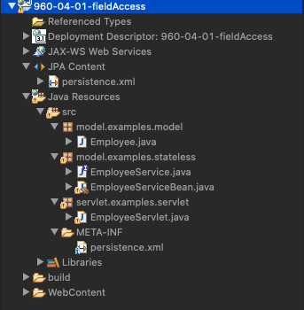

`persistence.xml`

```html
<?xml version="1.0" encoding="UTF-8"?>
<persistence version="2.2" xmlns="http://xmlns.jcp.org/xml/ns/persistence" xmlns:xsi="http://www.w3.org/2001/XMLSchema-instance" xsi:schemaLocation="http://xmlns.jcp.org/xml/ns/persistence http://xmlns.jcp.org/xml/ns/persistence/persistence_2_2.xsd">
	<persistence-unit name="EmployeeService" transaction-type="JTA">
		<jta-data-source>jdbc/EmployeeDS</jta-data-source>
		<class>model.examples.model.Employee</class>
	</persistence-unit>
</persistence>
```

#### Model

`Employee.java`

```java
package model.examples.model;

import javax.persistence.Entity;
import javax.persistence.Id;

@Entity
public class Employee {
   @Id
   private int id;
   private String name;
   private long salary;

   public int getId() {
      return id;
   }
    
   public void setId(int id) {
      this.id = id;
   }
    
   public String getName() {
      return name;
   }
    
   public void setName(String name) {
      this.name = name;
   }

   public long getSalary() {
      return salary;
   }

   public void setSalary(long salary) {
      this.salary = salary;
   }

   public String toString() {
      return "ID Empleado: " + getId() + " Nombre: " + getName() + " Salario: " + getSalary();
   }
}
```


#### Capa de Servios con EJBs

`EmployeeService.java`

```java
package model.examples.stateless;

import java.util.Collection;

import model.examples.model.Employee;

public interface EmployeeService {
   public Employee createEmployee(int id, String name, long salary);
   public Collection<Employee> findAllEmployees();
}
```

`EmployeeServiceBean.java`

```java
package model.examples.stateless;

import java.util.Collection;

import javax.ejb.Stateless;
import javax.persistence.EntityManager;
import javax.persistence.PersistenceContext;
import javax.persistence.Query;

import model.examples.model.Employee;

@Stateless
public class EmployeeServiceBean implements EmployeeService {
   @PersistenceContext(unitName="EmployeeService")
   protected EntityManager em;

   public Employee createEmployee(int id, String name, long salary) {
      Employee emp = new Employee();
      emp.setId(id);
      emp.setName(name);
      emp.setSalary(salary);
      em.persist(emp);
        
      return emp;
   }

   public Collection<Employee> findAllEmployees() {
      Query query = em.createQuery("SELECT e FROM Employee e");
      return (Collection<Employee>) query.getResultList();
   }
}
```

#### Capa Controller - Servlet

`EmployeeServlet.java`

```java
package servlet.examples.servlet;

import java.io.IOException;
import java.io.PrintWriter;
import java.util.Collection;

import javax.ejb.EJB;
import javax.servlet.ServletException;
import javax.servlet.annotation.WebServlet;
import javax.servlet.http.HttpServlet;
import javax.servlet.http.HttpServletRequest;
import javax.servlet.http.HttpServletResponse;

import model.examples.model.Employee;
import model.examples.stateless.EmployeeService;

@WebServlet(name="EmployeeServlet", 
            urlPatterns="/EmployeeServlet")
public class EmployeeServlet extends HttpServlet {

   private final String TITLE = "Capítulo 4: Ejemplo de Acceso al Campo (Field Access)";
    
   private final String DESCRIPTION =
      "Este ejemplo demuestra cómo especificar el acceso al campo(field access) para las entidades. </br>" +
      "Te permite crear/buscar empleados. Todas las operaciones " +
      "se conservan en la base de datos.";
    
   // inyectar una referencia al EmployeeService slsb
   @EJB EmployeeService service;
    
   public void doPost(HttpServletRequest request, HttpServletResponse response) throws ServletException, IOException {
      response.setContentType("text/html");
      PrintWriter out = response.getWriter();
      printHtmlHeader(out);
        
      // process request
      String action = request.getParameter("action");
      if (action == null) {
         // do nothing if no action requested
      } else if (action.equals("Crear")) {
         Employee emp = service.createEmployee(
                     parseInt(request.getParameter("id")),
                     request.getParameter("name"),
                     parseLong(request.getParameter("salary")));
         out.println("<b>Creado:</b> " + emp);
      } else if (action.equals("Buscar Todo")) {
         Collection<Employee> emps = service.findAllEmployees();
         if (emps.isEmpty()) {
            out.println("<b>No se encontraron empleados</b> ");
         } else {
            out.println("<b>Empleados encontrados:</b> </br></br>");
            for (Employee emp : emps) {
               out.println(emp + "<br/>");
            }
         }
      }
        
      printHtmlFooter(out);
   }
    
   public void doGet(HttpServletRequest request, HttpServletResponse response) throws ServletException, IOException {
      doPost(request, response);
   }
    
   private int parseInt(String intString) {
      try {
         return Integer.parseInt(intString);
      } catch (NumberFormatException e) {
         return 0;
      }
   }
    
   private long parseLong(String longString) {
      try {
         return Long.parseLong(longString);
      } catch (NumberFormatException e) {
         return 0;
      }
   }

   private void printHtmlHeader(PrintWriter out) throws IOException {
      out.println("<body>");
      out.println("<html>");
      out.println("<head><title>" + TITLE + "</title></head>");
      out.println("<center><h1>" + TITLE + "</h1></center>");
      out.println("<p>" + DESCRIPTION + "</p>");
      out.println("<hr/>");
      out.println("<form action=\"EmployeeServlet\" method=\"POST\">");
      // form to create and Employee and Address
      out.println("<h3>Crear un Empleado</h3>");
      out.println("<table><tbody>");
      out.println("<tr><td>ID de Empleado:</td><td><input type=\"text\" name=\"id\"/>(int)</td></tr>");
      out.println("<tr><td>Nombre de Empleado:</td><td><input type=\"text\" name=\"name\"/>(String)</td></tr>");
      out.println("<tr><td>Salario de Empleado:</td><td><input type=\"text\" name=\"salary\"/>(long)</td></tr>");
      out.println("<td><input name=\"action\" type=\"submit\" value=\"Crear\"/></td></tr>");
      out.println("</tbody></table>");
      out.println("<hr/>");
      // form to find all
      out.println("<h3>Buscar todos los Empleados</h3>");
      out.println("<input name=\"action\" type=\"submit\" value=\"Buscar Todo\"/>");
      out.println("</form>");
      out.println("<hr/>");
   }
    
    
   private void printHtmlFooter(PrintWriter out) throws IOException {
      out.println("</html>");
      out.println("</body>");
      out.close();
   }
}
```

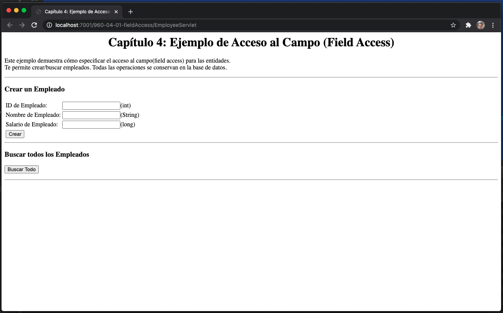
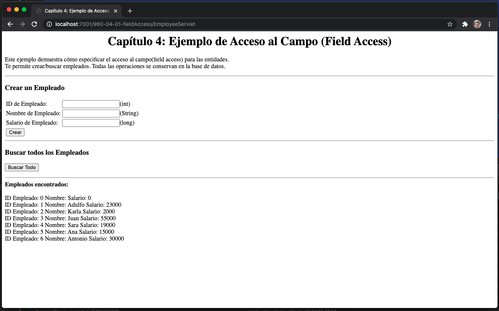
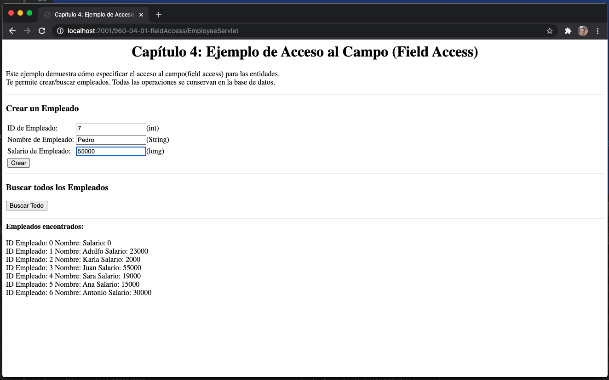
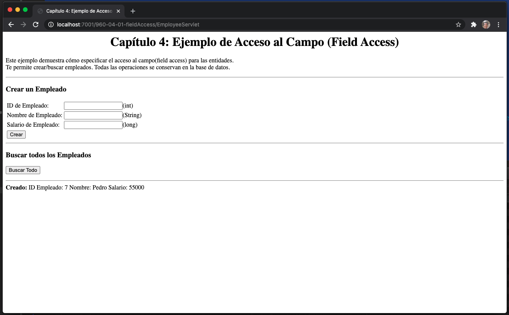
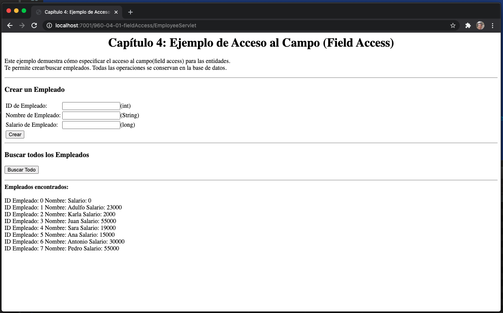

### ACCESO A LA PROPIEDAD

Cuando se usa el modo de acceso a la propiedad, se aplica el mismo contrato que para los JavaBeans, y debe haber métodos getter y setter para las propiedades persistentes. El tipo de propiedad está determinado por el tipo de retorno del método getter y debe ser el mismo que el tipo del parámetro único pasado al método setter. Ambos métodos deben tener visibilidad `public` or `protected`. Las anotaciones de mapeo de una propiedad deben estar en el método getter.

En el Listado 4-2, la clase `Employee` tiene una anotación `@Id` en el método getter `getId()` para que el proveedor use el acceso a la propiedad para obtener y establecer el estado de la entidad. Las propiedades `name` y `salary` se harán persistentes en virtud de los métodos getter y setter que existen para ellos, y se asignarán a las columnas `NAME` y `SALARY`, respectivamente. Tenga en cuenta que la propiedad de salario está respaldada por el campo `salary`, que no comparte el mismo nombre. Esto pasa desapercibido para el proveedor porque al especificar el acceso a la propiedad, le estamos diciendo al proveedor que ignore los campos de la entidad y use solo los métodos getter y setter para nombrar.

***Listado 4-2*** Usando Property Access

```java
@Entity
public class Employee {
   private long id;
   private String name;
   private long wage;
   
   @Id public long getId() { return id; }
   public void setId(long id) { this.id = id; }
    
   public String getName() { return name; }
   public void setName(String name) { this.name = name; }
    
   public long getSalary() { return wage; }
   public void setSalary(long salary) { this.wage = salary; }
}
```

### ACCESO MIXTO

También es posible combinar el acceso al campo con el acceso a la propiedad dentro de la misma jerarquía de entidad, o incluso dentro de la misma entidad. Esta no será una ocurrencia muy común, pero puede ser útil, por ejemplo, cuando se agrega una subclase de entidad a una jerarquía existente que usa un tipo de acceso diferente. Agregar una anotación `@Access` con un modo de acceso especificado en la entidad de subclase hará que el tipo de acceso predeterminado sea anulado para esa subclase de entidad.

La anotación `@Access` también es útil cuando necesita realizar una transformación simple a los datos al leer o escribir en la base de datos. Por lo general, querrá acceder a los datos a través del acceso de campo, pero en este caso, definirá un par de métodos getter/setter para realizar la transformación y usar el acceso a la propiedad para ese atributo. En general, hay tres pasos esenciales para agregar un campo o propiedad persistente para acceder de manera diferente al modo de acceso predeterminado para esa entidad.

Considere una entidad de `Employee` que tiene un modo de acceso predeterminado de `FIELD`, pero la columna de la base de datos almacena el código de área como parte del número de teléfono, y solo queremos almacenar el código de área en el campo de la entidad `phoneNum` si no es un número local. Podemos agregar una propiedad persistente que la transforme en consecuencia en lecturas y escrituras.

Lo primero que se debe hacer es marcar explícitamente el modo de acceso predeterminado para la clase anotándolo con la anotación `@Access` e indicando el tipo de acceso. A menos que se haga esto, no estará definido si se anotan tanto los campos como las propiedades. Etiquetaríamos nuestra entidad `Employee` para que tenga acceso de `FIELD`:

```java
@Entity
@Access(AccessType.FIELD)
public class Employee { ... }
```

El siguiente paso es anotar el campo o propiedad adicional con la anotación `@Access`, pero esta vez especificando el tipo de acceso opuesto al especificado en el nivel de clase. Puede parecer un poco redundante, por ejemplo, especificar el tipo de acceso de `AccessType.PROPERTY` en una propiedad persistente porque es obvio al mirarla que es una propiedad, pero hacerlo indica que lo que está haciendo no es un descuido, pero una excepción consciente al caso predeterminado.

```java
@Access(AccessType.PROPERTY) @Column(name="PHONE")
protected String getPhoneNumberForDb() { ... }
```

El último punto a recordar es que el campo o propiedad correspondiente al que se hace persistente debe marcarse como transitorio para que las reglas de acceso predeterminadas no hagan que el mismo estado persista dos veces. Por ejemplo, debido a que estamos agregando una propiedad persistente a una entidad para la que el tipo de acceso predeterminado es a través de campos, el campo en el que se almacena el estado de la propiedad persistente en la entidad debe anotarse con `@Transient`

```java
:

@Transient private String phoneNum;
```

El Listado 4-3 muestra la clase de entidad `Employee` completa anotada para usar el property access solo para una propiedad.

***Listado 4-3*** Uso de Acceso Combinado

```java
@Entity
@Access(AccessType.FIELD)
public class Employee {

   public static final String LOCAL_AREA_CODE = "613";
  
   @Id private long id;
   @Transient private String phoneNum;
   ...
   public long getId() { return id; }
   public void setId(long id) { this.id = id; }
    
   public String getPhoneNumber() { return phoneNum; }
   public void setPhoneNumber(String num) { this.phoneNum = num; }
    
   @Access(AccessType.PROPERTY) @Column(name="PHONE")
   protected String getPhoneNumberForDb() {
      if (phoneNum.length() == 10)
         return phoneNum;
      else
         return LOCAL_AREA_CODE + phoneNum;
   }
   
   protected void setPhoneNumberForDb(String num) {
      if (num.startsWith(LOCAL_AREA_CODE))
         phoneNum = num.substring(3);
      else
         phoneNum = num;
   }
   ...
}
```

## Mapping a una Tabla

En el Capítulo 2 viste que, en el caso más simple, mapear una entidad a una tabla, no necesita ninguna anotación de mapeo. Solo es necesario especificar las anotaciones `@Entity` y `@Id` para crear y asignar una entidad a una tabla de base de datos.

En esos casos, el nombre de la tabla predeterminado, que era solo el nombre no calificado de la clase de entidad, era perfectamente adecuado. Si sucede que el nombre de la tabla predeterminado no es el nombre que le gusta, o si una tabla adecuada que contiene el estado ya existe en su base de datos con un nombre diferente, debe especificar el nombre de la tabla. Para ello, anota la clase de entidad con la anotación `@Table` e incluye el nombre de la tabla con el elemento `name`. Muchas bases de datos tienen nombres breves para las tablas. El Listado 4-4 muestra una entidad que está asignada a una tabla que tiene un nombre diferente al de su clase.

***Listado 4-4*** Sobreescribir el Nombre de Default de la Tabla

```java
@Entity
@Table(name="EMP")
public class Employee { ... }
```

**TIP** ***Los nombres predeterminados no se especifican en mayúsculas o minúsculas. La mayoría de las bases de datos no distinguen entre mayúsculas y minúsculas, por lo que generalmente no importa si un proveedor usa el nombre de la entidad en mayúsculas o si lo convierte a mayúsculas. En el Capítulo 10, discutimos cómo delimitar los identificadores de la base de datos cuando la base de datos está configurada para distinguir entre mayúsculas y minúsculas.***

La anotación `@Table` brinda la capacidad no solo de nombrar la tabla en la que se almacena el estado de la entidad, sino también de nombrar un esquema o catálogo de base de datos. El nombre de esquema se usa comúnmente para diferenciar un conjunto de tablas de otro y se indica mediante el elemento `schema`. El Listado 4-5 muestra una entidad `Employee` que está mapped a la tabla `EMP` en el esquema de `HR`.

***Listado 4-5*** Establecer un Schema

```java
@Entity
@Table(name="EMP", schema="HR")
public class Employee { ... }
```

Cuando se especifica, el nombre del esquema se antepondrá al nombre de la tabla cuando el proveedor de persistencia vaya a la base de datos para acceder a la tabla. En este caso, el esquema `HR` se antepondrá a la tabla `EMP` cada vez que se acceda a la tabla.

**TIP** ***Algunos proveedores pueden permitir que el esquema se incluya en el elemento de nombre de la tabla sin tener que especificar el elemento de esquema, como en `@Table(name="HR.EMP")`. El soporte para incluir el nombre del esquema con el nombre de la tabla no es estándar.***

Algunas bases de datos apoyan la noción de catálogo. Para estas bases de datos, se puede especificar el elemento `catalog` de la anotación `@Table`. El Listado 4-6 muestra un catálogo que se configura explícitamente para la tabla `EMP`.

***Listado 4-6*** Establecer un Catalog

```java
@Entity
@Table(name="EMP", catalog="HR")
public class Employee { ... }
```

## Mapeo de Tipos Simples

Los tipos simples de Java se asignan como parte del estado inmediato de una entidad en sus campos o propiedades. La lista de tipos persistentes es bastante extensa e incluye prácticamente todos los tipos integrados que le gustaría conservar. Incluyen lo siguiente:

* ***Tipos primitivos de Java***: `byte`, `int`, `short`, `long`, `boolean`, `char`, `float` y `double`

* ***Clases de envoltura de tipos primitivos de Java**: `Byte`, `Integer`, `Short`, `Long`, `Boolean`, `Character`, `Float` y `Double`

* ***Tipos array de byte y character***: `byte[]`, `Byte[]`, `char[]` y `Character[]`

* ***Tipos numéricos grandes***: `java.math.BigInteger` y `java.math.BigDecimal`

* ***Strings***: `java.lang.String`

* ***Tipos temporal de Java***: `java.util.Date` y `java.util.Calendar`

* ***Tipos temporal de JDBC***: `java.sql.Date`, `java.sql.Time` y `java.sql.Timestamp`

* ***Tipos enumerados***: Cualquier sistema o tipo enumerado definido por el usuario

* ***Objetos serializables***: Cualquier sistema o tipo serializable definido por el usuario

A veces, el tipo de columna de la base de datos que se asigna no es exactamente el mismo que el tipo de Java. En casi todos los casos, el tiempo de ejecución del proveedor puede convertir el tipo devuelto por JDBC en el tipo Java correcto del atributo. Si el tipo de la capa JDBC no se puede convertir al tipo Java del campo o propiedad, normalmente se lanzará una excepción, aunque no se garantiza.

**TIP** ***Cuando el tipo persistente no coincide con el tipo JDBC, algunos proveedores pueden optar por realizar una acción propietaria o realizar la mejor suposición para convertir entre los dos. En otros casos, el controlador JDBC podría realizar la conversión por sí solo.***

Al persistir un campo o propiedad, el proveedor observa el tipo y se asegura de que sea uno de los tipos persistentes enumerados anteriormente. Si está en la lista, el proveedor lo persistirá usando el tipo de JDBC apropiado y lo pasará al controlador JDBC. En ese momento, si el campo o la propiedad no se pueden serializar, el resultado no se especifica. El proveedor puede optar por lanzar una excepción o simplemente intentar pasar el objeto a JDBC. Verá en el Capítulo 10 cómo se pueden usar los convertidores para ampliar la lista de tipos que pueden persistir en JPA.

Se puede colocar una anotación `@Basic` opcional en un campo o propiedad para marcarlo explícitamente como persistente. Esta anotación es principalmente para fines de documentación y no es necesaria para que el campo o la propiedad sean persistentes. Si no está allí, se asume implícitamente en ausencia de cualquier otra anotación de mapeo. Debido a la anotación, las asignaciones de tipos simples se denominan asignaciones básicas, ya sea que la anotación `@Basic` esté realmente presente o simplemente se esté asumiendo.

**NOTA** ***Ahora que ha visto cómo puede persistir campos o propiedades y cómo son virtualmente equivalentes en términos de persistencia, simplemente los llamaremos atributos. Un atributo es un campo o propiedad de una clase, y usaremos el término atributo de ahora en adelante para evitar tener que referirnos continuamente a campos o propiedades en términos específicos.***

### MAPPINGS DE COLUMNA

La anotación `@Basic` (o asignación básica asumida en su ausencia) se puede considerar como una indicación lógica de que un atributo dado es persistente. La anotación física que es la anotación que acompaña a la asignación básica es la anotación `@Column`. La especificación de `@Column` en el atributo indica características específicas de la columna de la base de datos física por las que el modelo de objetos está menos preocupado. De hecho, es posible que el modelo de objetos nunca necesite saber a qué columna está asignado, y el nombre de la columna y los metadatos de asignación física se pueden ubicar en un archivo XML separado.

Se pueden especificar varios elementos de anotación como parte de `@Column`, pero la mayoría de ellos se aplican solo a la generación de esquemas y se tratan más adelante en el libro. El único que tiene importancia es el elemento de nombre, que es solo una cadena que especifica el nombre de la columna a la que se ha asignado el atributo. Esto se usa cuando el nombre de columna predeterminado no es apropiado o no se aplica al esquema que se está usando. Puede pensar en el elemento de nombre de la anotación `@Column` como un medio para anular el nombre de columna predeterminado que de otro modo se habría aplicado. El ejemplo del Listado 4-7 muestra cómo anular el nombre de columna predeterminado para un atributo.

***Listing 4-7*** Mapping Attributes a Columns

```java
@Entity
public class Employee {
   @Id
   @Column(name="EMP_ID")
   private long id;
   
   private String name;
   
   @Column(name="SAL")
   private long salary;
   
   @Column(name="COMM")
   private String comments;
   // ...
}
```

Para poner estas anotaciones en contexto, veamos el mapeo de la tabla completo representado por esta entidad. Lo primero que debe notar es que no existe una anotación `@Table` en la clase, por lo que se le aplicará el nombre de tabla predeterminado `EMPLOYEE`.

A continuación, tenga en cuenta que `@Column` se puede usar con asignaciones de `@Id`, así como con asignaciones básicas. El campo de `id` se anula para asignarlo a la columna `EMP_ID` en lugar de a la columna predeterminada `ID`. El campo `name` no está anotado con `@Column`, por lo que el nombre de columna predeterminado `NAME` se usaría para almacenar y recuperar el nombre del empleado. Los campos `salary` y `comments`, sin embargo, están anotados para asignarlos a las columnas `SAL` y `COMM`, respectivamente. Por lo tanto, la entidad `Employee` se asigna a la tabla que se muestra en la Figura 4-2.

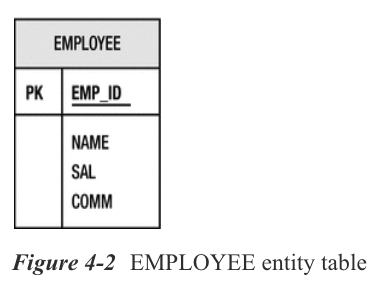

### LAZY FETCHING

En ocasiones, se sabrá de antemano que rara vez se accederá a determinadas partes de una entidad. En estas situaciones, puede optimizar el rendimiento al recuperar la entidad obteniendo solo los datos a los que espera que se acceda con frecuencia; el resto de los datos se puede recuperar solo cuando o si es necesario. Hay muchos nombres para este tipo de función, incluida la carga diferida (lazy loading), la carga diferida, la obtención diferida, la obtención bajo demanda, la lectura justo a tiempo, la indirección y otros. Todos significan más o menos lo mismo, que es solo que algunos datos pueden no cargarse cuando el objeto se lee inicialmente desde la base de datos, pero solo se recuperarán cuando se haga referencia a ellos o se acceda a ellos.

El tipo de búsqueda(fetch) de un mapeo básico se puede configurar para que se cargue de manera perezosa o con entusiasmo (lazily or eagerly) especificando el elemento `fetch` en la anotación `@Basic` correspondiente. El tipo enumerado `FetchType` define los valores para este elemento, que pueden ser `EAGER` o `LAZY`. Establecer el tipo de recuperación de una asignación básica en `LAZY` significa que el proveedor puede aplazar la carga del estado de ese atributo hasta que se haga referencia a él. El valor predeterminado es cargar todas las asignaciones básicas con entusiasmo (eagerly). El Listado 4-8 muestra un ejemplo de cómo anular un mapeo básico para cargarlo de forma diferida (lazily loaded).

***Listado 4-8*** Lazy Field Loading

```java
@Entity
public class Employee {
   // ...
   @Basic(fetch=FetchType.LAZY)
   @Column(name="COMM")
   private String comments;
   // ...
}
```

Suponemos en este ejemplo que las aplicaciones rara vez accederán a los comentarios en un registro de empleado, por lo que lo marcamos como obtenido de manera perezosa. Tenga en cuenta que, en este caso, la anotación `@Basic` no solo está presente para fines de documentación, sino que también es necesaria para especificar el tipo de búsqueda para el campo. Configurar el campo `comments` para que se recupere de forma perezosa permitirá que una instancia de `Empleado` devuelta de una consulta tenga el campo `comments` vacío. Sin embargo, la aplicación no tiene que hacer nada especial para obtenerla. Simplemente accediendo al campo `comments`, el proveedor lo leerá y completará de forma transparente si aún no se ha cargado.

Antes de utilizar esta función, debe tener en cuenta algunos puntos pertinentes sobre la búsqueda diferida de atributos. En primer lugar, la directiva para obtener un atributo de forma perezosa solo debe ser una sugerencia para el proveedor de persistencia para ayudar a la aplicación a lograr un mejor rendimiento. No se requiere que el proveedor respete la solicitud porque el comportamiento de la entidad no se ve comprometido si el proveedor sigue adelante y carga el atributo. Sin embargo, lo contrario no es cierto, porque especificar que un atributo debe buscarse con eagerly fetched puede ser fundamental para poder acceder al estado de la entidad una vez que la entidad se separa del contexto de persistencia. Hablamos más sobre el desapego en el Capítulo 6 y exploramos la conexión entre la carga diferida y el desapego (lazy loading and detachment).

En segundo lugar, en la superficie podría parecer que esta es una buena idea para ciertos atributos de una entidad, pero en la práctica casi nunca es una buena idea lazily fetch tipos simples. Es poco lo que se puede ganar al devolver solo una parte de una fila de la base de datos a menos que esté seguro de que no se accederá al estado en la entidad más adelante. Las únicas ocasiones en las que se debe considerar la carga diferida(lazy loading) de una asignación básica son cuando hay muchas columnas en una tabla (por ejemplo, docenas o cientos) o cuando las columnas son grandes (por ejemplo, cadenas de caracteres o cadenas de bytes muy grandes). La carga de los datos podría requerir una cantidad significativa de recursos y no cargarlos podría ahorrar mucho esfuerzo, tiempo y recursos. A menos que cualquiera de estos dos casos sea cierto, en la mayoría de los casos, la búsqueda perezosa de un subconjunto de atributos de objeto terminará siendo más costosa que la obtención con entusiasmo.

Sin embargo, la búsqueda diferida es bastante relevante cuando se trata de mapeos de relaciones, por lo que discutiremos este tema más adelante en el capítulo.

### OBJETOS GRANDES

Un término de base de datos común para un carácter o un objeto basado en bytes que puede ser muy grande (hasta el rango de gigabytes) es un objeto grande, o LOB para abreviar. Las columnas de la base de datos que pueden almacenar este tipo de objetos grandes requieren que se acceda a llamadas JDBC especiales desde Java. Para indicar al proveedor que debe utilizar los métodos LOB al pasar y recuperar estos datos hacia y desde el controlador JDBC, se debe agregar una anotación adicional a la asignación básica. La anotación `@Lob` actúa como la anotación de marcador para cumplir con este propósito y puede aparecer junto con la anotación `@Basic`, o puede aparecer cuando `@Basic` está ausente y se asume implícitamente que está en el mapeo.

Debido a que la anotación `@Lob` en realidad solo califica la asignación básica, también puede ir acompañada de una anotación `@Column` cuando el nombre de la columna LOB debe anularse del nombre predeterminado asumido.

Los LOB vienen en dos tipos en la base de datos: objetos grandes de caracteres, llamados CLOB, y objetos grandes binarios, o BLOB. Como implican sus nombres, una columna CLOB contiene una secuencia de caracteres grande, y una columna BLOB puede almacenar una secuencia de bytes grande. Los tipos de Java asignados a las columnas BLOB son los tipos `byte[]`, `Byte[]` y `Serializable`, mientras que los objetos `char[]`, `Character[]` y `String` se asignan a las columnas CLOB. El proveedor es responsable de hacer esta distinción según el tipo de atributo que se asigna.

Un ejemplo de mapeo de una imagen a una columna BLOB se muestra en el Listado 4-9. Aquí, se supone que la columna `PIC` es una columna BLOB para almacenar la imagen del empleado que está en el campo `picture`. También hemos marcado este campo para que se cargue de forma diferida, una práctica común aplicada a los LOB a los que no se hace referencia con frecuencia.

***Listado 4-9*** Mapping una Columna BLOB 

```java
@Entity
public class Employee {
   @Id
   private long id;
   
   @Basic(fetch=FetchType.LAZY)
   @Lob @Column(name="PIC")
   private byte[] picture;
   
   // ...
}
```

### TIPOS ENUMERADOS

Otro de los tipos simples que se pueden tratar de forma especial es el enumerado. Los valores de un tipo enumerado son constantes que pueden manejarse de manera diferente según las necesidades de la aplicación.

Como ocurre con los tipos enumerados en otros lenguajes, los valores de un tipo enumerado en Java tienen una asignación ordinal implícita que está determinada por el orden en que fueron declarados. Este ordinal no se puede modificar en tiempo de ejecución y se puede utilizar para representar y almacenar los valores del tipo enumerado en la base de datos. La interpretación de los valores como ordinales es la forma predeterminada en que los proveedores asignarán tipos enumerados a la base de datos, y el proveedor asumirá que la columna de la base de datos es un tipo entero.

Considere el siguiente tipo enumerado:


```java
public enum EmployeeType {
   FULL_TIME_EMPLOYEE,
   PART_TIME_EMPLOYEE,
   CONTRACT_EMPLOYEE
}
```

Los ordinales asignados a los valores de este tipo enumerado en tiempo de compilación serían 0 para `FULL_TIME_EMPLOYEE`, 1 para `PART_TIME_EMPLOYEE` y 2 para `CONTRACT_EMPLOYEE`. En el Listado 4-10, definimos un campo persistente de este tipo.

***Listado 4-10*** Mapping un Enumerated Type Usando Ordinales

```java
@Entity
public class Employee {
   @Id private long id;
   
   private EmployeeType type;
   
   // ...
}
```

Puede ver que el mapeo de `EmployeeType` es trivialmente fácil hasta el punto en que en realidad no tiene que hacer nada en absoluto. Se aplican los valores predeterminados y todo funcionará. El campo `type` se asignará a una columna `TYPE` de números enteros y todos los empleados de tiempo completo tendrán asignado un ordinal de 0. De manera similar, los otros empleados tendrán sus tipos almacenados en la columna `TYPE` en consecuencia.

Sin embargo, si cambia un tipo enumerado, entonces tenemos un problema. Los datos ordinales persistentes en la base de datos ya no se aplicarán al valor correcto. En este ejemplo, si la política de beneficios de la empresa cambiara y comenzáramos a brindar beneficios adicionales a los empleados a tiempo parcial que trabajaron más de 20 horas por semana, querríamos diferenciar entre los dos tipos de empleados a tiempo parcial. Al agregar un valor `PART_TIME_BENEFITS_EMPLOYEE` después de `PART_TIME_EMPLOYEE`, estaríamos provocando una nueva asignación ordinal, donde a nuestro nuevo valor se le asignaría el ordinal de 2 y `CONTRACT_EMPLOYEE` obtendría 3. Esto tendría el efecto de causar que todos los empleados contratados en el registro de repente se convierten en empleados a tiempo parcial con beneficios, claramente no el resultado que esperábamos.

Podríamos revisar la base de datos y ajustar todas las entidades de `Employee` para que tengan su tipo correcto, pero si el tipo de empleado se usa en otro lugar, entonces tendríamos que asegurarnos de que todas estén arregladas también. Esta no es una buena situación de mantenimiento.

Una mejor solución sería almacenar el nombre del valor como una cadena en lugar de almacenar el ordinal. Esto nos aislaría de cualquier cambio en la declaración y nos permitiría agregar nuevos tipos sin tener que preocuparnos por los datos existentes. Podemos hacer esto agregando una anotación `@Enumerated` en el atributo y especificando un valor de `STRING`.

La anotación `@Enumerated` realmente permite que se especifique un `EnumType`, y el `EnumType` es en sí mismo un tipo enumerado que define valores de `ORDINAL` y `STRING`. Si bien es algo irónico que se utilice un tipo enumerado para indicar cómo el proveedor debe representar los tipos enumerados, es totalmente apropiado. Debido a que el valor predeterminado de `@Enumerated` es `ORDINAL`, especificar `@Enumerated(ORDINAL)` es útil solo cuando desea que esta asignación sea explícita.

En el Listado 4-11, estamos almacenando cadenas para los valores enumerados. Ahora la columna `TYPE` debe ser un tipo basado en cadenas, y todos los empleados de tiempo completo tendrán la cadena `FULL_TIME_EMPLOYEE` almacenada en su columna `TYPE` correspondiente.

***Listado 4-11*** Mapping un Enumerated Type Usando Strings

```java
@Entity
public class Employee {
   @Id
   private long id;
   
   @Enumerated(EnumType.STRING)
   private EmployeeType type;
   
   // ...
}
```

Tenga en cuenta que el uso de cadenas resolverá el problema de insertar valores adicionales en el medio del tipo enumerado, pero dejará los datos vulnerables a cambios en los nombres de los valores. Por ejemplo, si quisiéramos cambiar `PART_TIME_EMPLOYEE` a `PT_EMPLOYEE`, entonces tendríamos problemas. Sin embargo, este es un problema menos probable porque cambiar los nombres de un tipo enumerado haría que todo el código que usa el tipo enumerado también tenga que cambiar. Esto sería una molestia mayor que reasignar valores en una columna de la base de datos.

En general, almacenar el ordinal es la mejor y más eficiente forma de almacenar tipos enumerados siempre que la probabilidad de que se inserten valores adicionales en el medio no sea alta. Aún se podrían agregar nuevos valores al final del tipo sin consecuencias negativas.

Una nota final sobre los tipos enumerados es que se definen de forma bastante flexible en Java. De hecho, incluso es posible tener valores que contengan estado. Actualmente no hay soporte dentro de la JPA para mapear el estado contenido en los valores enumerados. Tampoco hay soporte para la posición de compromiso entre `STRING` y `ORDINAL` de mapear explícitamente cada valor enumerado a un valor numérico dedicado diferente de su valor ordinal asignado por el compilador. Se está considerando un soporte enumerado más extenso para versiones futuras.

### TIPOS TEMPORAL

Los tipos temporales son el conjunto de tipos basados en el tiempo que se pueden usar en asignaciones de estado persistentes. La lista de tipos temporales admitidos incluye los tres tipos `java.sql`: —`java.sql.Date`, `java.sql.Time` y `java.sql.Timestamp` — y los dos tipos `java.util`: —`java.util.Date` y `java.util.Calendar`.

Los tipos `java.sql` son completamente sencillos. Actúan como cualquier otro tipo de mapeo simple y no necesitan ninguna consideración especial. Sin embargo, los dos tipos de `java.util` necesitan metadatos adicionales para indicar cuál de los tipos de `java.sql` de JDBC se debe usar al comunicarse con el controlador JDBC. Esto se hace anotándolos con la anotación `@Temporal` y especificando el tipo JDBC como un valor del tipo enumerado `TemporalType`. Hay tres valores enumerados de `DATE`, `TIME` y `TIMESTAMP` para representar cada uno de los tipos `java.sql`.

El listado 4-12 muestra cómo `java.util.Date` y `java.util.Calendar` se pueden asignar a columnas de fecha en la base de datos.

***Listado 4-12*** Mapping Temporal Types

```java
@Entity
public class Employee {
   @Id
   private long id;
    
   @Temporal(TemporalType.DATE)
   private Calendar dob;

   @Temporal(TemporalType.DATE)
   @Column(name="S_DATE")
   private Date startDate;
   // ...
}
```

Al igual que las otras variedades de asignaciones básicas, la anotación `@Column` se puede utilizar para anular el nombre de columna predeterminado.

### TRANSIENT STATE

Los atributos que forman parte de una entidad persistente pero que no están destinados a ser persistentes pueden modificarse con el modificador `transient` en Java o anotarse con la anotación `@Transient`. Si se especifica alguno, el tiempo de ejecución del proveedor no aplicará sus reglas de asignación predeterminadas al atributo en el que se especificó.

Los campos Transient se utilizan por varias razones. Uno podría ser el caso anteriormente en el capítulo cuando mezclamos el modo de acceso y no queríamos mantener el mismo estado dos veces. Otro podría ser cuando desea almacenar en caché algún estado en la memoria que no desea tener que volver a calcular, redescubrir o reinicializar. Por ejemplo, en el Listado 4-13 estamos usando un campo transitorio para guardar la palabra específica de la localidad correcta para `Employee` para que la imprimamos correctamente donde sea que se muestre. Hemos utilizado el modificador transitorio en lugar de la anotación `@Transient` para que si el empleado se serializa de una máquina virtual a otra, el nombre traducido se reinicializará para corresponder con la configuración regional de la nueva máquina virtual. En los casos en los que el valor no persistente deba retenerse durante la serialización, se debe usar la anotación en lugar del modificador.

***Listado 4-13*** Usando un Transient Field

```java
@Entity
public class Employee {
   @Id private long id;
   
   private String name;
   private long salary;

   transient private String translatedName;
   
   // ...
   
   public String toString() {
      if (translatedName == null) {
         translatedName = ResourceBundle.getBundle("EmpResources").getString("Employee");
      }
      return translatedName + ": " + id + " " + name;
   }
}
```

## Mapeo de la Primary Key

Cada entidad que se asigna a una base de datos relacional debe tener una asignación a una clave principal en la tabla. Ya ha aprendido los conceptos básicos de cómo la anotación `@Id` indica el identificador de la entidad. En esta sección, explorará identificadores simples y claves primarias con un poco más de profundidad y aprenderá cómo puede permitir que el proveedor de persistencia genere valores de identificadores únicos.

**NOTA** ***Cuando un identificador de entidad se compone de un solo atributo, se denomina identificador simple.***

### OVERRIDING DE LA COLUMNA PRIMARY KEY

Las mismas reglas predeterminadas se aplican a las asignaciones de ID que a las asignaciones básicas, que es que se supone que el nombre de la columna es el mismo que el nombre del atributo. Al igual que con las asignaciones básicas, la anotación `@Column` se puede utilizar para anular el nombre de la columna al que se asigna el atributo ID.

Se asume que las claves primarias son insertables, pero no nulables ni actualizables(nullable or updatable). Al overriding una columna de clave principal, los elementos que aceptan valores `nullable` y `updatable` no deben overridden. Solo en la circunstancia muy específica de mapear la misma columna a múltiples campos/relaciones (como se describe en el Capítulo 10), el elemento `insertable` debe establecerse a `false`.

### PRIMARY KEY TYPES

Excepto por su significado especial al designar el mapeo a la columna de clave principal, un mapeo de ID es casi lo mismo que el mapeo básico. La otra diferencia principal es que las asignaciones de ID generalmente están restringidas a los siguientes tipos:

* ***Tipos primitivos de Java***: `byte`, `int`, `short`, `long` y `char`

* ***Clases contenedoras de tipos primitivos de Java***: `Byte`, `Integer`, `Short`, `Long` y `Character`

* ***String***: `java.lang.String`

* ***Tipo numérico grande***: `java.math.BigInteger`

* ***Tipos temporales***: `java.util.Date` y `java.sql.Date`

Los tipos de coma flotante como `float` y `double` también están permitidos, así como las clases de envoltura `Float` y `Double` y `java.math.BigDecimal`, pero se desaconsejan debido a la naturaleza del error de redondeo y la falta de confianza del operador `equals()` cuando se aplica a ellos. El uso de tipos flotantes para claves primarias es una tarea arriesgada y definitivamente no se recomienda.

### IDENTIFIER GENERATION

A veces, las aplicaciones no quieren molestarse en tratar de definir y garantizar la unicidad en algún aspecto de su modelo de dominio y se contentan con permitir que los valores de identificador se generen automáticamente para ellas. Esto se denomina generación de ID y se especifica mediante la anotación `@GeneratedValue`.

Cuando la generación de ID está habilitada, el proveedor de persistencia generará un valor de identificador para cada instancia de ese tipo de entidad. Una vez que se obtiene el valor del identificador, el proveedor lo insertará en la entidad recién persistente; sin embargo, dependiendo de la forma en que se genere, es posible que no esté presente en el objeto hasta que la entidad se haya insertado en la base de datos. En otras palabras, la aplicación no puede confiar en poder acceder al identificador hasta después de que se haya producido una descarga o se haya completado la transacción.

Las aplicaciones pueden elegir una de las cuatro estrategias de generación de ID diferentes especificando una estrategia en el elemento de estrategia. El valor puede ser cualquiera de los valores enumerados `AUTO`, `TABLE`, `SEQUENCE` o `IDENTITY` del tipo enumerado `GenerationType`.

Los generadores de tablas y secuencias se pueden definir específicamente y luego reutilizar por múltiples clases de entidades. Estos generadores se nombran y son globalmente accesibles para todas las entidades en la unidad de persistencia.

#### ***Automatic ID Generation***

Si a una aplicación no le importa qué tipo de generación usa el proveedor pero quiere que ocurra la generación, puede especificar una estrategia de `AUTO`. Esto significa que el proveedor utilizará cualquier estrategia que desee para generar identificadores. El listado 4-14 muestra un ejemplo del uso de la generación automática de ID. Esto hará que el proveedor cree un valor de identificador y lo inserte en el campo `id` de cada entidad `Employee` que se conserva.

**TIP** ***No se requiere explícitamente que el campo de identificador de entidad sea un tipo integral, pero normalmente es el único tipo que creará `AUTO`. Recomendamos que se utilice `long` para acomodar la extensión completa del dominio de identificador generado.***

***Listing 4-14*** Usando Auto ID Generation

```java
@Entity
public class Employee {
   @Id 
   @GeneratedValue(strategy=GenerationType.AUTO)
   private long id;
   // ...
}
```

Sin embargo, hay una trampa para usar `AUTO`. El proveedor puede elegir su propia estrategia para almacenar los identificadores, pero necesita tener algún tipo de recurso persistente para poder hacerlo. Por ejemplo, si elige una estrategia basada en tablas, necesita crear una tabla; si elige una estrategia basada en secuencia, necesita crear una secuencia. El proveedor no siempre puede confiar en la conexión de base de datos que obtiene del servidor para tener permisos para crear una tabla en la base de datos. Esta es normalmente una operación privilegiada que a menudo está restringida al DBA. Será necesario que haya algún tipo de fase de creación o generación de esquema para hacer que el recurso se cree antes de que la estrategia `AUTO` pueda funcionar.

El modo `AUTO` es realmente una estrategia de generación para el desarrollo o la creación de prototipos. Funciona bien como un medio para ponerlo en funcionamiento más rápidamente cuando se genera el esquema de la base de datos. En cualquier otra situación, sería mejor utilizar una de las otras estrategias de generación discutidas en las secciones posteriores.

#### ***ID Generation Using a Table(Generación de ID usando una tabla)***

La forma más flexible y portátil de generar identificadores es utilizar una tabla de base de datos. No solo se transferirá a diferentes bases de datos, sino que también permite almacenar múltiples secuencias de identificadores diferentes para diferentes entidades dentro de la misma tabla.

Una tabla de generación de ID debe tener dos columnas. La primera columna es un tipo de cadena que se utiliza para identificar la secuencia del generador en particular. Es la clave principal para todos los generadores de la tabla. La segunda columna es un tipo integral que almacena la secuencia de ID real que se está generando. El valor almacenado en esta columna es el último identificador que se asignó en la secuencia. Cada generador definido representa una fila en la tabla.

La forma más fácil de usar una tabla para generar identificadores es simplemente especificar la estrategia de generación para que sea `TABLE` en el elemento `strategy`:

```java
@Id 
@GeneratedValue(strategy=GenerationType.TABLE)
private long id;
```

Debido a que se indica la estrategia de generación pero no se ha especificado ningún generador, el proveedor asumirá una tabla de su propia elección. Si se utiliza la generación de esquemas, se creará; si no, la tabla predeterminada asumida por el proveedor debe ser conocida y debe existir en la base de datos.

Un enfoque más explícito sería especificar realmente la tabla que se utilizará para el almacenamiento de ID. Esto se hace mediante la definición de un generador de tablas que, contrariamente a lo que su nombre implica, en realidad no genera tablas. Más bien, es un generador de identificadores que usa una tabla para almacenar los valores de los identificadores. Podemos definir uno usando una anotación `@TableGenerator` y luego referirnos a él por su nombre en la anotación `@GeneratedValue`:

```java
@TableGenerator(name="Emp_Gen")
@Id @GeneratedValue(generator="Emp_Gen")
private long id;
```

Aunque estamos mostrando `@TableGenerator` anotando el atributo identificador, en realidad se puede definir en cualquier atributo o clase. Independientemente de dónde se defina, estará disponible para toda la unidad de persistencia. Una buena práctica sería definirlo localmente en el atributo ID si solo lo usa una clase, pero definirlo en XML, como se describe en el Capítulo 13, si se usará para varias clases.

El elemento `name` nombra globalmente al generador, lo que nos permite hacer referencia a él en el elemento `generator` de la anotación `@GeneratedValue`. Esto es funcionalmente equivalente al ejemplo anterior donde simplemente dijimos que queríamos usar la generación de tablas pero no especificamos el generador. Ahora estamos especificando el nombre del generador, pero no proporcionamos ninguno de los detalles del generador, dejando que sean predeterminados por el proveedor.

Otro enfoque de calificación sería especificar los detalles de la tabla, como se muestra a continuación:

```java
@TableGenerator(name="Emp_Gen",
   table="ID_GEN",
   pkColumnName="GEN_NAME",
   valueColumnName="GEN_VAL")
```

Hemos incluido algunos elementos adicionales después del nombre del generador. Después del nombre hay tres elementos (`table`, `pkColumnName` y `valueColumnName`) que definen la tabla real que almacena los identificadores de `Emp_Gen`.

El elemento `table` solo indica el nombre de la tabla. El elemento `pkColumnName` es el nombre de la columna de clave principal en la tabla que identifica de forma única al generador, y el elemento `valueColumnName` es el nombre de la columna que almacena el valor de secuencia de ID real que se está generando. En este caso, la tabla se llama `ID_GEN`, el nombre de la columna de clave primaria (la columna que almacena los nombres del generador) se llama `GEN_NAME` y la columna que almacena los valores de secuencia de ID se llama `GEN_VAL`.

El nombre del generador se convierte en el valor almacenado en la columna `pkColumnName` para esa fila y el proveedor lo usa para buscar el generador y obtener su último valor asignado.

En nuestro ejemplo, llamamos a nuestro generador `Emp_Gen` para que nuestra tabla se pareciera a la de la Figura 4-3.

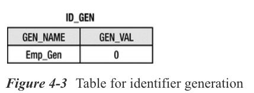

Tenga en cuenta que el último identificador `Employee` asignado es 0, lo que nos indica que aún no se han generado identificadores. Se puede especificar un elemento `initialValue` que represente el último identificador asignado como parte de la definición del generador, pero el valor predeterminado de 0 será suficiente en casi todos los casos. Esta configuración se usa solo durante la generación del esquema cuando se crea la tabla. Durante ejecuciones posteriores, el proveedor leerá el contenido de la columna de valor para determinar el siguiente identificador que se dará.

Para evitar actualizar la fila para cada identificador que se solicita, se usa un tamaño de asignación. Esto hará que el proveedor preasigne un bloque de identificadores y luego proporcione identificadores de la memoria según lo solicitado hasta que se agote el bloque. Una vez que este bloque se agota, la siguiente solicitud de un identificador activa otro bloque de identificadores para ser preasignado, y el valor del identificador se incrementa por el tamaño de la asignación. De forma predeterminada, el tamaño de la asignación se establece en 50. Este valor se puede anular para que sea mayor o menor mediante el uso del elemento `allocationSize` al definir el generador.

**TIP** ***El proveedor puede asignar identificadores dentro de la misma transacción que la entidad que se persiste o en una transacción separada. No está especificado, pero debe consultar la documentación de su proveedor para ver cómo puede evitar el riesgo de un punto muerto cuando los subprocesos concurrentes están creando entidades y bloqueando recursos.***

El Listado 4-15 muestra un ejemplo de cómo definir un segundo generador que se usará para las entidades `Address`, pero que usa la misma tabla `ID_GEN` para almacenar la secuencia del identificador. En este caso, en realidad estamos dictando explícitamente el valor que estamos almacenando en la columna de clave primaria de la tabla de identificadores especificando el elemento `pkColumnvalue`. Este elemento permite que el nombre del generador sea diferente del valor de la columna, aunque rara vez es necesario hacerlo. El ejemplo muestra un generador `Address` ID llamado `Address_Gen` pero luego define el valor almacenado en la tabla para la generación de `Address` ID como `Addr_Gen`. El generador también establece el valor inicial en 10000 y el tamaño de asignación en 100.

***Listado 4-15*** Usando Table ID Generation

```java
@TableGenerator(name="Address_Gen",
   table="ID_GEN",
   pkColumnName="GEN_NAME",
   valueColumnName="GEN_VAL",
   pkColumnValue="Addr_Gen",
   initialValue=10000,
   allocationSize=100)
@Id 
@GeneratedValue(generator="Address_Gen")
private long id;
```

Si se definieron los generadores `Emp_Gen` y `Address_Gen`, al iniciar la aplicación, la tabla `ID_GEN` debería verse como la Figura 4-4. A medida que la aplicación asigna identificadores, los valores almacenados en la columna `GEN_VAL` aumentarán.

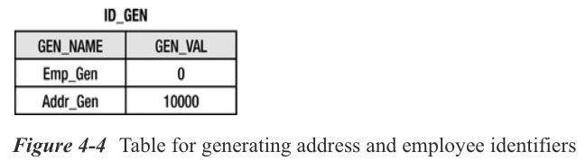

Si no ha utilizado la función de generación automática de esquemas (discutida en el Capítulo 14), la tabla ya debe existir o estar creada en la base de datos a través de algún otro medio y estar configurada para estar en este estado cuando la aplicación se inicie por primera vez. Se podría aplicar el siguiente SQL para crear e inicializar esta tabla:

```java
CREATE TABLE id_gen (
   gen_name VARCHAR(80),
   gen_val INTEGER,
   CONSTRAINT pk_id_gen
      PRIMARY KEY (gen_name)
);
INSERT INTO id_gen (gen_name, gen_val) VALUES ('Emp_Gen', 0);
INSERT INTO id_gen (gen_name, gen_val) VALUES ('Addr_Gen', 10000);
```

#### ***ID Generation Usando a Database Sequence***

Muchas bases de datos admiten un mecanismo interno para la generación de ID llamado ***sequences***. Se puede utilizar una secuencia de base de datos para generar identificadores cuando la base de datos subyacente los admite.

Como vio con los generadores de tablas, si se sabe que se debe usar una secuencia de base de datos para generar identificadores, y no le preocupa que sea una secuencia en particular, especificar el tipo de generador solo debería ser suficiente:

```java
@Id 
@GeneratedValue(strategy=GenerationType.SEQUENCE)
private long id;
```

En este caso, no se nombra ningún generador, por lo que el proveedor utilizará un objeto de secuencia predeterminado de su propia elección. Tenga en cuenta que si se definen varios generadores de secuencia pero no se nombran, no se especifica si utilizan la misma secuencia predeterminada o diferentes. La única diferencia entre usar una secuencia para múltiples tipos de entidad y usar una para cada entidad sería el orden de los números de secuencia y la posible contención de la secuencia. La ruta más segura sería definir un generador de secuencia con nombre y hacer referencia a él en la anotación `@GeneratedValue`:

```java
@SequenceGenerator(name="Emp_Gen", sequenceName="Emp_Seq")
@Id 
@GeneratedValue(generator="Emp_Gen")
private long getId;
```

A menos que la generación de esquemas esté habilitada, sería necesario que la secuencia esté definida y ya exista. El SQL para crear tal secuencia sería el siguiente:

```java
CREATE SEQUENCE Emp_Seq
   MINVALUE 1
   START WITH 1
   INCREMENT BY 50
```

El valor inicial y el tamaño de asignación también se pueden usar en generadores de secuencias y deberían reflejarse en el SQL para crear la secuencia. Tenga en cuenta que el tamaño de asignación predeterminado es 50, al igual que con los generadores de tablas. Si no se está utilizando la generación de esquemas y la secuencia se está creando manualmente, la cláusula `INCREMENT BY` deberá configurarse para que coincida con el elemento `allocationSize` o el tamaño de asignación predeterminado de la anotación `@SequenceGenerator` correspondiente.

#### ***ID Generation Usando Database Identity***

Algunas bases de datos admiten una columna de identidad de clave principal, a veces denominada columna de numeración automática. Cada vez que se inserta una fila en la tabla, la columna de identidad recibirá un identificador único asignado. Se puede utilizar para generar los identificadores de objetos, pero una vez más está disponible solo cuando la base de datos subyacente lo admite. La identidad se usa a menudo cuando la base de datos no admite las secuencias de la base de datos o porque un esquema heredado ya ha definido la tabla para usar columnas de identidad. Por lo general, son menos eficientes para la generación de identificadores relacionales de objetos porque no se pueden asignar en bloques y porque el identificador no está disponible hasta después del tiempo de confirmación.

Para indicar que debe producirse la generación `IDENTITY`, la anotación `@GeneratedValue` debe especificar una estrategia de generación de `IDENTITY`. Esto le indicará al proveedor que debe volver a leer la fila insertada de la tabla después de que se haya producido una inserción. Esto le permitirá obtener el identificador recién generado de la base de datos y colocarlo en la entidad en memoria que acaba de persistir:

```java
@Id 
@GeneratedValue(strategy=GenerationType.IDENTITY)
private long id;
```

No hay una anotación de generador para `IDENTITY` porque debe definirse como parte de la definición del esquema de la base de datos para la columna de clave primaria de la entidad. Dado que cada columna de clave primaria de entidad define su propia característica de identidad, la generación de `IDENTITY` no se puede compartir entre varios tipos de entidad.

Otra diferencia, insinuada anteriormente, entre el uso de `IDENTITY` y otras estrategias de generación de ID es que el identificador no será accesible hasta después de que se haya producido la inserción. Aunque no se garantiza la accesibilidad del identificador antes de que se complete la transacción, al menos es posible que otros tipos de generación asignen con entusiasmo el identificador (eagerly allocate the identifier). Pero cuando se usa la identidad, es la acción de insertar lo que hace que se genere el identificador. Sería imposible que el identificador esté disponible antes de que la entidad se inserte en la base de datos, y debido a que la inserción de entidades se difiere con mayor frecuencia hasta el momento de la confirmación, el identificador no estará disponible hasta después de que se haya committed la transacción.

**TIP** ***Si usa `IDENTITY`, asegúrese de estar al tanto de lo que está haciendo su proveedor de persistencia y de que cumple con sus requisitos. Algunos proveedores insertan ansiosamente (eagerly insert) (cuando se invoca el método de persistencia) entidades que están configuradas para usar la generación de `IDENTITY` ID, en lugar de esperar hasta la hora de confirmación. Esto permitirá que la identificación esté disponible de inmediato, a expensas del bloqueo prematuro y la reducción de la concurrencia. Algunos proveedores incluso tienen una opción que le permite configurar qué enfoque se utiliza.***

## Relationships

Si las entidades contuvieran solo un estado persistente simple, el negocio del mapeo relacional de objetos sería trivial, de hecho. La mayoría de las entidades necesitan poder hacer referencia a otras entidades o tener relaciones con ellas. Esto es lo que produce los gráficos del modelo de dominio que son comunes en las aplicaciones comerciales.

En las siguientes secciones, exploramos los diferentes tipos de relaciones que pueden existir y mostramos cómo definirlas y mapearlas utilizando metadatos de mapeo JPA.

### CONCEPTOS DE RELACIÓN

Antes de comenzar a mapear las relaciones, hagamos un recorrido rápido por algunos de los conceptos y terminología básicos de las relaciones. Tener un conocimiento firme de estos conceptos facilitará la comprensión del resto de las secciones de mapeo de relaciones.

#### ***Roles***

Hay un viejo adagio que dice que cada historia tiene tres lados: el tuyo, el mío y la verdad. Las relaciones son similares en el sentido de que hay tres perspectivas diferentes. La primera es la vista desde un lado de la relación, la segunda es desde el otro lado y la tercera es desde una perspectiva global que conoce a ambos lados. ***Los "lados" se llaman roles***. En cada relación hay dos entidades que están relacionadas entre sí, y se dice que cada entidad juega un papel en la relación.

Las relaciones están en todas partes, por lo que no es difícil encontrar ejemplos. Un empleado tiene una relación con el departamento en el que trabaja. La entidad `Employee` desempeña el papel de trabajar en el departamento, mientras que la entidad `Department` desempeña el papel de tener un empleado trabajando en él.

Por supuesto, el papel que desempeña una entidad determinada difiere según la relación, y una entidad puede participar en muchas relaciones diferentes con muchas entidades diferentes. Podemos concluir, por tanto, que cualquier en La ciudadanía podría estar desempeñando una serie de roles diferentes en cualquier modelo dado. Si pensamos en una entidad `Employee`, nos damos cuenta de que, de hecho, desempeña otros roles en otras relaciones, como el rol de trabajar para un gerente en su relación con otra entidad `Employee`, trabajar en un proyecto en su relación con el Entidad `Project`, etc. Aunque no existen requisitos de metadatos para declarar el papel que desempeña una entidad, los roles siguen siendo útiles como medio para comprender la naturaleza y estructura de las relaciones.

#### ***Direccionalidad***

Para tener relaciones, tiene que haber una forma de crearlas, eliminarlas y mantenerlas. La forma básica en que esto se hace es mediante una entidad que tiene un atributo de relación que se refiere a su entidad relacionada de una manera que la identifica como desempeñando el otro rol de la relación. A menudo ocurre que la otra entidad, a su vez, tiene un atributo que apunta a la entidad original. ***Cuando cada entidad apunta a la otra, la relación es bidireccional***. ***Si solo una entidad tiene un puntero hacia la otra, se dice que la relación es unidireccional***.

La relación de un `Employee` con el `Project` en el que trabaja sería bidireccional. El `Employee` debe conocer su `Project` y el `Project` debe señalar al `Employee` que está trabajando en él. En la Figura 4-5 se muestra un modelo UML de esta relación. Las flechas que van en ambas direcciones indican la bidireccionalidad de la relación.

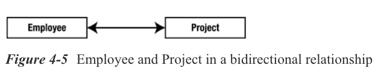

Un `Employee` y su `Address` probablemente se modelarían como una relación unidireccional porque no se espera que la `Address` necesite conocer a su residente. Si lo hiciera, por supuesto, tendría que convertirse en una relación bidireccional. La figura 4-6 muestra esta relación. Debido a que la relación es unidireccional, la flecha apunta del Empleado a la Dirección.

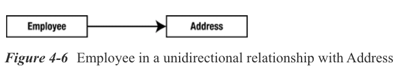

Como verá más adelante en el capítulo, aunque ambos comparten el mismo concepto de direccionalidad, los modelos de objetos y de datos lo ven de manera un poco diferente debido a la diferencia de paradigma. En algunos casos, las relaciones unidireccionales en el modelo de objetos pueden plantear un problema en el modelo de base de datos.

Podemos usar la direccionalidad de una relación para ayudar a describir y explicar un modelo, pero cuando se trata de discutirlo en términos concretos, tiene sentido pensar en cada relación bidireccional como un par de relaciones unidireccionales. En lugar de tener una única relación bidireccional de un `Employee` que trabaja en un `Project`, tendríamos una relación de "proyecto" unidireccional donde el `Employee` apunta al `Project` en el que trabaja y otra relación de "trabajador" unidireccional donde el `Project` apunta al `Employee` que trabaja en eso. Cada una de estas relaciones tiene una entidad que es el rol de origen o de referencia y el lado que es el rol de destino o al que se hace referencia. La belleza de esto es que podemos usar los mismos términos sin importar de qué relación estemos hablando y sin importar qué roles haya en la relación. La Figura 4-7 muestra cómo las dos relaciones tienen entidades de origen y destino, y cómo, desde la perspectiva de cada relación, las entidades de origen y destino son diferentes.

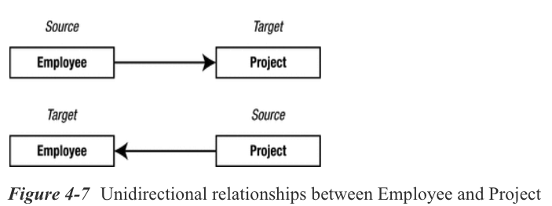

#### ****Cardinalidad***

No es muy frecuente que un proyecto tenga un solo empleado trabajando en él. Nos gustaría poder capturar el aspecto de cuántas entidades existen en cada lado de la misma instancia de relación. Esto se llama cardinalidad de la relación. Cada rol en una relación tendrá su propia cardinalidad, que indica si puede haber solo una instancia de la entidad o muchas instancias.

En nuestro ejemplo de `Employee` y `Department`, primero podríamos decir que un empleado trabaja en un departamento, por lo que la cardinalidad de ambos lados sería uno. Pero lo más probable es que más de un empleado trabaje en el departamento, por lo que haríamos que la relación tenga muchas cardinalidades en el lado del `Employee` o de la fuente, lo que significa que muchas instancias de `Employee` podrían apuntar al mismo `Department`. El lado objetivo o `Department` mantendría su cardinalidad de uno. La figura 4-8 muestra esta relación de muchos a uno. El lado "muchos" está marcado con un asterisco (`*`).

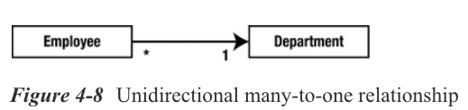

En nuestro ejemplo de `Employee` y `Project`, tenemos una relación bidireccional o dos direcciones de relación. Si un empleado puede trabajar en varios proyectos, y un proyecto puede tener varios empleados trabajando en él, terminaríamos con cardinalidades de "muchos" en las fuentes y objetivos de ambas direcciones. La figura 4-9 muestra el diagrama UML de esta relación.

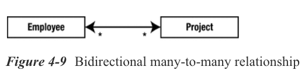

Como dice el refrán, una imagen vale más que mil palabras, y describir estas relaciones en el texto es mucho más difícil que mostrar una imagen. Sin embargo, en palabras, esta imagen indica lo siguiente:

* Cada empleado puede trabajar en varios proyectos.

* Muchos empleados pueden trabajar en el mismo proyecto.

* Cada proyecto puede tener varios empleados trabajando en él.

* Muchos proyectos pueden tener el mismo empleado trabajando en ellos.

Implícito en este modelo está el hecho de que se pueden compartir las instancias de `Employee` y `Project` entre múltiples instancias de relación.

#### ***Ordinalidad***

Un rol se puede especificar más determinando si podría estar presente o no. Esto se llama ***ordinalidad*** y sirve para mostrar si la entidad de destino(target) debe especificarse cuando se crea la entidad de origen(source). Debido a que la ordinalidad es en realidad solo un valor booleano, también se denomina opcionalidad de la relación.

En términos de cardinalidad, la ordinalidad estaría indicada por la cardinalidad como un rango en lugar de un valor simple, y el rango comenzaría con 0 o 1 dependiendo de la ordinalidad. Sin embargo, es más sencillo decir simplemente que la relación es opcional u obligatoria. Si es opcional, es posible que el target no esté presente; si es obligatorio, una entidad source(origen) sin una referencia a su entidad target(destino) asociada se encuentra en un estado no válido.

### DESCRIPCIÓN GENERAL DE MAPPINGS

Ahora que conoce la teoría suficiente y tiene los antecedentes conceptuales para poder discutir las relaciones, podemos continuar explicando y usando los mapeos de relaciones.

Cada una de las asignaciones recibe el nombre de la cardinalidad de los roles de origen y destino (source and target ). Como se muestra en las secciones anteriores, una relación bidireccional puede verse como un par de dos asignaciones unidireccionales. Cada uno de estos mapeos es realmente un mapeo de relación unidireccional, y si tomamos las cardinalidades de la fuente y el destino de la relación y las combinamos en ese orden, permutando con los dos valores posibles de "uno" y "muchos", terminan con los siguientes nombres dados a las asignaciones:

* Many-to-one

* One-to-one

* One-to-many

* Many-to-many

Estos nombres de asignación también son los nombres de las anotaciones que se utilizan para indicar los tipos de relación en los atributos que se asignan. Son la base de las anotaciones de relaciones lógicas y contribuyen a los aspectos de modelado de objetos de la entidad. Al igual que las asignaciones básicas, las asignaciones de relaciones se pueden aplicar a campos o propiedades de la entidad.

### ASOCIACIONES SINGLE-VALUED

Una asociación de una instancia de entidad a otra instancia de entidad (donde la cardinalidad del objetivo es "uno") se denomina asociación de un solo valor (single-valued). Las asignaciones de relaciones many-to-one y de one-to-one se incluyen en esta categoría porque la entidad de origen se refiere como máximo a una entidad de destino. Primero discutimos estas relaciones y algunas de sus variantes.

#### ***Many-to-One Mappings***

En nuestra discusión sobre la cardinalidad de la relación `Employee` y `Department` (que se muestra en la Figura 4-8), primero pensamos en un empleado que trabaja en un departamento, por lo que simplemente asumimos que era una relación uno a uno. Sin embargo, cuando nos dimos cuenta de que más de un empleado trabaja en el mismo departamento, lo cambiamos a un mapeo de relaciones de muchos a uno. Resulta que muchos a uno es el mapeo más común y es el que se usa normalmente al crear una asociación a una entidad.

La figura 4-10 muestra una relación de varios a uno entre `Employee` y `Department`. El `Employee` es el lado "muchos" y el source(origen) de la relación, y el `Department` es el lado "uno" y el target(objetivo). Una vez más, debido a que la flecha apunta en una sola dirección, de `Employee` a `Department`, la relación es unidireccional. Tenga en cuenta que en UML, la clase de origen tiene un atributo implícito del tipo de clase de destino si se puede navegar a él. Por ejemplo, `Employee` tiene un atributo llamado `department` que contendrá una referencia a una única instancia de `Department`. El atributo real no se muestra en la clase `Employee`, pero está implícito en la presencia de la flecha de relación.

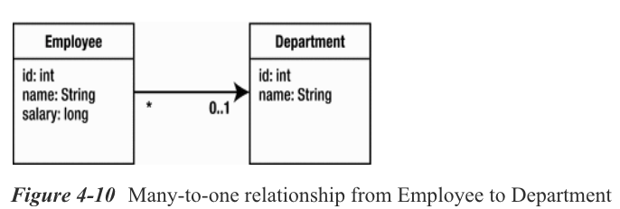

Un mapeo many-to-one se define anotando el atributo en la entidad de origen(source) (el atributo que se refiere a la entidad de destino(target)) con la anotación `@ManyToOne`. El Listado 4-16 muestra cómo se usa la anotación `@ManyToOne` para mapear esta relación. El campo de `department` en `Employee` es el atributo de origen anotado.

***Listado 4-16*** Many-to-One Relationship desde Employee a Department

```java
@Entity
public class Employee {
   // ...
   @ManyToOne
   private Department department;
   // ...
}
```

Hemos incluido solo los segmentos de la clase que son relevantes para nuestra discusión, pero puede ver en el ejemplo anterior que el código fue bastante anticlimático. Una sola anotación era todo lo que se requería para mapear la relación, y resultó ser bastante aburrida, en realidad. Por supuesto, cuando se trata de configuración, lo aburrido es hermoso.

Los mismos tipos de flexibilidad de atributos y requisitos de modificadores que se describieron para las asignaciones básicas también se aplican a las asignaciones de relaciones. La anotación puede estar presente en el campo o en la propiedad, según la estrategia utilizada para la entidad.

#### ***Usar Join Columns***

En la base de datos, un mapeo de relaciones significa que una tabla tiene una referencia a otra tabla. El término de la base de datos para una columna que se refiere a una clave (generalmente la clave principal) en otra tabla es una ***foreign key column (columna de clave externa)***. En JPA, se denominan join columns(columnas de unión), y la anotación `@JoinColumn` es la anotación principal que se utiliza para configurar este tipo de columnas.

**NOTA** ***Más adelante en el capítulo, hablaremos de columnas de combinación que están presentes en otras tablas llamadas tablas de combinación. En el Capítulo 10, cubrimos un caso más avanzado del uso de una tabla de combinación para asociaciones de un solo valor.***

Considere las tablas `EMPLOYEE` y `DEPARTMENT` que se muestran en la Figura 4-11 que corresponden a las entidades `Employee` y `Department`. La tabla `EMPLOYEE` tiene una columna foreign key denominada `DEPT_ID` que hace referencia a la tabla `DEPARTMENT`. Desde la perspectiva de la relación entre entidades, `DEPT_ID` es la columna de combinación que asocia las entidades `Employee` y `Department`.


***En casi todas las relaciones, independientemente de los lados de origen y destino, uno de los dos lados tendrá la join column(columna de combinación) en su tabla***. Ese lado se llama **el lado propietario o el propietario de la relación**. ***El lado que no tiene la columna de unión se denomina lado no propietario o inverso***.

La propiedad es importante para la asignación porque las anotaciones físicas que definen las asignaciones a las columnas en la base de datos (por ejemplo, `@JoinColumn`) siempre se definen en el lado propietario de la relación. Si no están allí, los valores están predeterminados desde la perspectiva del atributo en el lado propietario.

**NOTA**: ***Aunque hemos descrito el lado propietario como determinado por el esquema de datos, el modelo de objeto debe indicar el lado propietario mediante el uso de anotaciones de mapeo de relaciones. La ausencia del elemento `mappedBy` en la anotación de mapeo implica la propiedad de la relación, mientras que la presencia del elemento `mappedBy` significa que la entidad está en el lado inverso de la relación. El elemento `mappedBy` se describe en secciones posteriores.***


Las Many-to-one mappings siempre están en el lado propietario de una relación, por lo que si hay una `@JoinColumn` en la relación que tiene un lado de muchos a uno, ahí es donde se ubicará. Para especificar el nombre de la columna de combinación, se utiliza el elemento `name`. Por ejemplo, la anotación `@JoinColumn(name="DEPT_ID")` significa que la columna `DEPT_ID` en la tabla de la entidad de origen es la clave externa a la tabla de la entidad de destino, cualquiera que sea la entidad de destino de la relación.

Si ninguna anotación `@JoinColumn` acompaña a la many-to-one mapping, se asumirá un nombre de columna predeterminado. El nombre que se utiliza como predeterminado se forma a partir de una combinación de las entidades de origen y de destino. Es el nombre del atributo de relación en la entidad de origen, que es `department` en nuestro ejemplo, más un carácter de subrayado (`_`), más el nombre de la columna de clave principal de la entidad de destino. Por lo tanto, si la entidad `Department` se asignó a una tabla que tenía una columna de clave principal denominada `ID`, se supondría que la columna de combinación en la tabla `EMPLOYEE` se denominaría `DEPARTMENT_ID`. Si este no es realmente el nombre de la columna, se debe definir la anotación `@JoinColumn` para anular la predeterminada.

Volviendo a la Figura 4-11, la columna de foreign key (clave externa) se denomina `DEPT_ID` en lugar del nombre predeterminado de la columna `DEPARTMENT_ID`. El Listado 4-17 muestra la anotación `@JoinColumn` que se usa para override el nombre de la join column(columna de unión) para que sea `DEPT_ID`.

***Listado 4-17*** Many-to-One Relationship Overriding the Join Column

```java
@Entity
public class Employee {
   @Id 
   private long id;
   
   @ManyToOne
   @JoinColumn(name="DEPT_ID")
   private Department department;
   
   // ...
}
```

Las anotaciones nos permiten especificar `@JoinColumn` en la misma línea que `@ManyToOne` o en una línea separada, arriba o abajo. **Por convención, el mapeo lógico debería aparecer primero, seguido del mapeo físico**. Esto aclara el modelo de objetos porque la parte física es menos importante para el modelo de objetos.

#### ***One-to-One Mappings***

Si solo un empleado pudiera trabajar en un departamento, volveríamos a la asociación uno a uno. Sin embargo, un ejemplo más realista de una asociación uno a uno sería un empleado que tiene una plaza de aparcamiento. Suponiendo que a cada empleado se le asignara su propio espacio de estacionamiento, crearíamos una relación uno a uno entre el `Employee` y `ParkingSpace`. La figura 4-12 muestra esta relación.

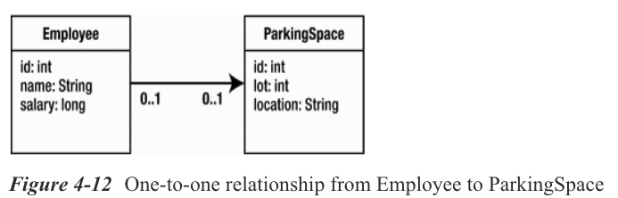

Definimos el mapeo de forma similar a como definimos un mapeo de many-to-one, excepto que usamos la anotación `@OneToOne` en lugar de una anotación `@ManyToOne` en el atributo `parkingSpace`. Al igual que con el mapeo de many-to-one, el mapeo one-to-one tiene una join column(columna de combinación) en la base de datos y debe anular el nombre de la columna en una anotación `@JoinColumn` cuando el nombre predeterminado no se aplica. El nombre predeterminado se compone de la misma manera que para el mapeo de many-to-one utilizando el nombre del atributo de origen y el nombre de la columna de clave principal de destino.

La Figura 4-13 muestra las tablas mapeadas por las entidades `Employee` y `ParkingSpace`. La columna de clave externa en la tabla `EMPLOYEE` se denomina `PSPACE_ID` y hace referencia a la tabla `PARKING_SPACE`.

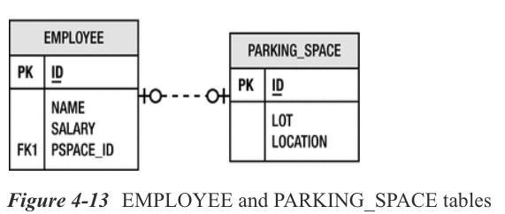

Resulta que el mapeo one-to-one son casi las mismas que el mapeo many-to-one, excepto que solo una instancia de la entidad de origen puede hacer referencia a la misma instancia de entidad de destino. En otras palabras, la instancia de la entidad de destino no se comparte entre las instancias de la entidad de origen. En la base de datos, esto equivale a tener una restricción de unicidad en la columna de la foreign key de origen (es decir, la columna de foreign key en la tabla de entidad de origen). Si hubiera más de un valor de foreign key que fuera el mismo, infringiría la regla de que no más de una instancia de entidad de origen puede hacer referencia a la misma instancia de entidad de destino.

El listado 4-18 muestra el mapeo de esta relación. La anotación `@JoinColumn` se ha utilizado para anular el nombre predeterminado de la columna de unión de `PARKINGSPACE_ID` para que sea `PSPACE_ID`.

***Listado 4-18*** One-to-One Relationship desde Employee a ParkingSpace

```java
@Entity
public class Employee {
   @Id 
   private long id;
   
   private String name;
   
   @OneToOne
   @JoinColumn(name="PSPACE_ID")
   private ParkingSpace parkingSpace;
   // ...
}
```

#### ***Bidirectional One-to-One Mappings***

La entidad de destino de one-to-one a menudo tiene una relación con la entidad de origen; por ejemplo, `ParkingSpace` tiene una referencia al `Employee` que lo usa. Cuando este es el caso, se denomina **relación bidireccional uno a uno**. Como vio anteriormente, en realidad tenemos dos mapeos uno a uno separados, uno en cada dirección, pero la combinación de los dos se llama relación bidireccional uno a uno. Para hacer que nuestro ejemplo de espacio de estacionamiento y empleado individual existente sea bidireccional, solo necesitamos cambiar el `ParkingSpace` para que apunte al `Employee`. La figura 4-14 muestra la relación bidireccional.

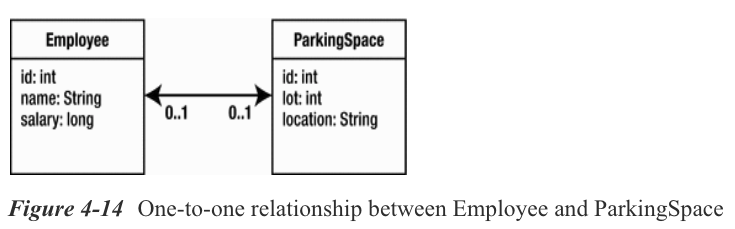

Ya aprendió que la tabla de entidades que contiene la join column(columna de combinación) determina la entidad propietaria de la relación. En una relación bidireccional de uno a uno, ambas asignaciones son asignaciones de uno a uno, y cualquiera de los lados puede ser el propietario, por lo que la join column(columna de unión) puede terminar en un lado o en el otro. Esta sería normalmente una decisión de modelado de datos, no una decisión de programación de Java, y probablemente se tomaría en función de la dirección de recorrido más frecuente.

Considere la clase de entidad `ParkingSpace` que se muestra en el Listado 4-19. Este ejemplo asume el mapeo de la tabla que se muestra en la Figura 4-13 y asume que `Employee` es el lado propietario de la relación. Ahora tenemos que agregar una referencia de `ParkingSpace` a `Employee`. Esto se logra agregando la anotación de relación `@OneToOne` en el campo `employee`. Como parte de la anotación, debemos agregar un elemento `mappedBy` para indicar que el lado propietario es el `Employee`, no el `ParkingSpace`. Dado que `ParkingSpace` es el lado inverso de la relación, no tiene que proporcionar la información de la columna de combinación.

***Listado 4-19*** Inverse Side of a Bidirectional One-to-One Relationship

```java
@Entity
public class ParkingSpace {
   @Id 
   private long id;
   
   private int lot;
   
   private String location;
   
   @OneToOne(mappedBy="parkingSpace")
   private Employee employee;
   // ...
}
```

El elemento `mappedBy` en el mapeo uno a uno del atributo `employee` de `ParkingSpace` es necesario para hacer referencia al atributo `parkingSpace` en la clase `Employee`. El valor de `mappedBy` es el nombre del atributo en la entidad propietaria que apunta a la entidad inversa.

Las dos reglas, entonces, para las asociaciones bidireccionales uno a uno son las siguientes:

* La anotación `@JoinColumn` va en el mapeo de la entidad que está mapeada a la tabla que contiene la join column(columna de unión), o el propietario de la relación. Esto podría estar en cualquier lado de la asociación.

* El elemento `mappedBy` debe especificarse en la anotación `@OneToOne` en la entidad que no define una join column(columna de unión), o el lado inverso de la relación.

No sería legal tener una asociación bidireccional que hubiera `mappedBy` en ambos lados, así como sería incorrecto no tenerla en ninguno de los lados. La diferencia es que si estuviera ausente en ambos lados de la relación, el proveedor trataría a cada lado como una relación unidireccional independiente. Esto estaría bien, excepto que supondría que cada lado es el propietario y que cada uno tiene una columna de unión.

Las relaciones bidireccionales de muchos a uno se explican más adelante como parte de la discusión de las asociaciones bidireccionales multivalor.

### ASOCIACIONES CON COLLECTION-VALUED

Cuando la entidad de origen hace referencia a una o más instancias de la entidad de destino, se utiliza una asociación de muchos valores o una colección asociada. Tanto los mapeos one-to-many y many-to-many se ajustan al criterio de tener muchas entidades de destino, y aunque la asociación de uno a muchos es la que se usa con más frecuencia, las asignaciones de muchos a muchos también son útiles cuando existen está compartiendo en ambas direcciones.

#### ***One-to-Many Mappings***

Cuando una entidad está asociada con una `Collection` de otras entidades, lo más frecuente es que tenga la forma de un mapeo one-to-many. Por ejemplo, un departamento normalmente tendría varios empleados. La Figura 4-15 muestra la relación de `Employee` y `Department` que mostramos anteriormente en la sección “Many-to-One Mappings”, solo que esta vez la relación es de naturaleza bidireccional.

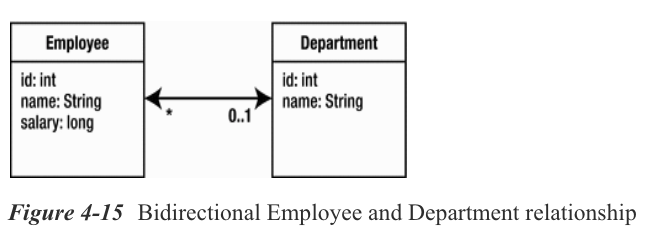

Como se mencionó anteriormente, cuando una relación es bidireccional, en realidad hay dos asignaciones, una para cada dirección. Una relación bidireccional de uno a muchos siempre implica un mapeo de muchos a uno de regreso a la fuente, por lo que en nuestro ejemplo de `Employee` y `Department` hay un mapeo de uno a muchos de `Department` a `Employee` y un mapeo de muchos a uno del `Employee` al `Department`. Podríamos decir con la misma facilidad que la relación es bidireccional de varios a uno si la viéramos desde la perspectiva del `Employee`. Son equivalentes porque las relaciones bidireccionales de varios a uno implican un mapeo de uno a varios desde el destino al origen y viceversa.

Cuando una entidad de origen tiene un número arbitrario de entidades de destino almacenadas en su colección, no existe una forma escalable de almacenar esas referencias en la tabla de la base de datos a la que se asigna. ¿Cómo almacenaría una cantidad arbitraria de claves externas en una sola fila? En su lugar, debe permitir que las tablas de las entidades de la colección tengan claves externas a la tabla de la entidad de origen. **Esta es la razón por la que la asociación de uno a muchos es casi siempre bidireccional y el lado "uno" no es normalmente el lado propietario**.

Además, si las tablas de la entidad de destino tienen foreign keys(claves externas) que apuntan a la tabla de la entidad de origen, las entidades de destino deben tener asociaciones de muchos a uno con el objeto de la entidad de origen. Tener una clave externa en una tabla para la que no hay asociación en el modelo de objeto de entidad correspondiente no es fiel al modelo de datos. No obstante, todavía es posible configurarlo.

Veamos un ejemplo concreto de un mapeo de uno a muchos basado en el ejemplo de `Employee` y `Department` que se muestra en la Figura 4-15. Las tablas para esta relación son exactamente las mismas que las que se muestran en la Figura 4-11, que muestra una relación de muchos a uno. La única diferencia entre el ejemplo de muchos a uno y este es que ahora estamos implementando el lado inverso de la relación. Como `Employee` tiene la join column y es el propietario de la relación, la clase `Employee` no ha cambiado del Listado 4-16.

En el lado del `Department` de la relación, necesitamos mapear la colección de `employees` de las entidades de `Employee` como una asociación de uno a muchos usando la anotación `@OneToMany`. El Listado 4-20 muestra la clase de `Department` que usa esta anotación. Tenga en cuenta que debido a que este es el lado inverso de la relación, debemos incluir el elemento `mappedBy`, tal como hicimos en el ejemplo de relación bidireccional uno a uno.

***Listing 4-20*** One-to-Many Relationship

```java
@Entity
public class Department {
   @Id 
   private long id;
   
   private String name;
    
   @OneToMany(mappedBy="department")
   private Collection<Employee> employees;
   // ...
}
```

Hay un par de puntos dignos de mención sobre esta clase. La primera es que se está utilizando una `Collection` genérica con parámetros de tipo para almacenar las entidades `Employee`. Esto proporciona el tipo estricto que garantiza que solo los objetos de tipo `Employee` existirán en la `Collection`. Esto es bastante útil porque no solo proporciona verificación en tiempo de compilación de nuestro código, sino que también nos ahorra tener que realizar operaciones de conversión cuando recuperamos las instancias de `Employee` de la colección.

JPA asume la disponibilidad de genéricos; sin embargo, sigue siendo perfectamente aceptable utilizar una colección que no tenga parámetros de tipo. También podríamos haber definido la clase `Department` sin usar genéricos pero definiendo solo un tipo de `Collection` simple, como lo hubiéramos hecho en versiones de Java estándar anteriores a Java SE 5 (excepto para JDK 1.0 o 1.1, cuando `java.util.Collection` ¡ni siquiera estaba estandarizado!). Si lo hiciéramos, tendríamos que especificar el tipo de entidad que se almacenará en la `Collection` que necesita el proveedor de persistencia. El código se muestra en el Listado 4-21 y parece casi idéntico, excepto por el elemento `targetEntity` que indica el tipo de entidad.

***Listado 4-21*** Usando targetEntity

```java
@Entity
public class Department {
   @Id 
   private long id;
   
   private String name;
   
   @OneToMany(targetEntity=Employee.class, mappedBy="department")
   private Collection employees;
   // ...
}
```

Hay dos puntos importantes que recordar al definir relaciones bidireccionales one-to-many (o many-to-one) uno a varios (o varios a uno):

* El lado many-to-one debe ser el lado propietario, por lo que la join column debe definirse en ese lado.

* El mapeo one-to-many debe ser el lado inverso, por lo que se debe usar el elemento `mappedBy`.

Si no se especifica el elemento `mappedBy` en la anotación `@OneToMany`, el proveedor lo tratará como una relación unidireccional de uno a muchos que se define para usar una join table(tabla de combinación) (que se describe más adelante). Este es un error fácil de cometer y debería ser lo primero que busque si ve un error de tabla faltante con un nombre que tiene dos nombres de entidad concatenados.

#### ***Many-to-Many Mappings***

Cuando una o más entidades están asociadas con una `Collection` de otras entidades, y las entidades tienen asociaciones superpuestas con las mismas entidades de destino, debemos modelarla como una relación de muchos a muchos. Cada una de las entidades de cada lado de la relación tendrá una asociación de valor de colección que contiene entidades del tipo de destino. La Figura 4-16 muestra una relación many-to-many entre `Employee` y `Project`. Cada empleado puede trabajar en varios proyectos y varios empleados pueden trabajar en cada proyecto.

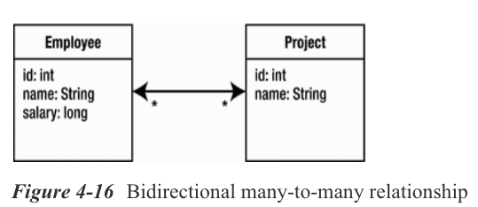

Un mapeo many-to-many (muchos a muchos) se expresa tanto en las entidades de origen como en las de destino como una anotación `@ManyToMany` en los atributos de la colección. Por ejemplo, en el Listado 4-22, el `Employee` tiene un atributo `projects` que se ha anotado con `@ManyToMany`. Asimismo, la entidad `Project` tiene un atributo `employees` que también ha sido anotado con `@ManyToMany`.

***Listado 4-22*** Relación Many-to-Many entre Employee y Project


```java
@Entity
public class Employee {
   @Id 
   private long id;
    
   private String name;
   
   @ManyToMany
   private Collection<Project> projects;
   // ...
}

@Entity
public class Project {
   @Id 
   private long id;
    
   private String name;
   @ManyToMany(mappedBy="projects")
   private Collection<Employee> employees;
   // ...
}
```

Existen algunas diferencias importantes entre esta relación de muchos a muchos y la relación de uno a muchos discutida anteriormente. La primera es una inevitabilidad matemática: cuando una relación de muchos a muchos es bidireccional, ambos lados de la relación son asignaciones de muchos a muchos.

La segunda diferencia es que no hay columnas de combinación en ninguno de los lados de la relación. Verá en la siguiente sección que la única forma de implementar una relación de muchos a muchos es con una join table(tabla de combinación) separada. La consecuencia de no tener columnas de combinación en ninguna de las tablas de entidad es que no hay forma de determinar qué lado es el propietario de la relación. Debido a que toda relación bidireccional debe tener un lado propietario y un lado inverso, debemos elegir una de las dos entidades para que sea el propietario. En este ejemplo, elegimos a `Employee` como propietario de la relación, pero podríamos haber elegido `Project` con la misma facilidad. Como en cualquier otra relación bidireccional, el lado inverso debe usar el elemento `mappedBy` para identificar el atributo propietario.

Tenga en cuenta que no importa qué lado se designe como propietario, el otro lado debe incluir el elemento `mappedBy`; de lo contrario, el proveedor pensará que ambos lados son propietarios y que las asignaciones son relaciones unidireccionales separadas.

#### ***Using Join Tables***

Debido a que la multiplicidad de ambos lados de una relación de muchos a muchos es plural, ninguna de las dos tablas de entidad puede almacenar un conjunto ilimitado de valores de clave externa en una sola fila de entidad. Debemos usar una tercera tabla para asociar los dos tipos de entidad. Esta tabla de asociación se denomina tabla de combinación y cada relación de varios a varios debe tener una. También pueden usarse para los otros tipos de relaciones, pero no son obligatorios y, por lo tanto, son menos comunes.

Una join table consta simplemente de dos claves externas o columnas de combinación para hacer referencia a cada uno de los dos tipos de entidad en la relación. Luego, una colección de entidades se asigna como múltiples filas en la tabla, cada una de las cuales asocia una entidad con otra. El conjunto de filas que contiene un identificador de entidad dado en la columna de clave externa de origen representa la colección de entidades relacionadas con esa entidad dada.

La Figura 4-17 muestra las tablas `EMPLOYEE` y `PROJECT` para las entidades `Employee` y `Project` y la tabla de combinación `EMP_PROJ` que las asocia. La tabla `EMP_PROJ` contiene solo columnas de clave externa que forman su clave primaria compuesta. La columna `EMP_ID` se refiere a la clave primaria `EMPLOYEE`, mientras que la columna `PROJ_ID` se refiere a la clave primaria `PROJECT`.

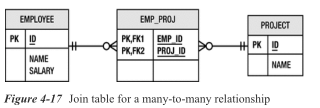

Para mapear las tablas descritas en la Figura 4-17, necesitamos agregar algunos metadatos a la clase `Employee` que hemos designado como propietario de la relación. El Listado 4-23 muestra la relación many-to-many con las anotaciones de la join table adjuntas.

***Listado 4-23*** Usando un Join Table

```java
@Entity
public class Employee {
   @Id 
   private long id;
   
   private String name;
   
   @ManyToMany
   @JoinTable(name="EMP_PROJ",
      joinColumns=@JoinColumn(name="EMP_ID"),
      inverseJoinColumns=@JoinColumn(name="PROJ_ID"))
   
   private Collection<Project> projects;
   // ...
}
```

La anotación `@JoinTable` se usa para configurar la tabla de combinación para la relación. Las dos columnas de combinación en la tabla de combinación se distinguen por el lado propietario y el lado inverso. La columna de unión al lado propietario se describe en el elemento `joinColumns`, mientras que la columna de unión al lado inverso se especifica mediante el elemento `inverseJoinColumns`. Puede ver en el Listado 4-23 que los valores de estos elementos son en realidad anotaciones `@JoinColumn` incrustadas dentro de la anotación `@JoinTable`. Esto proporciona la capacidad de declarar toda la información sobre las columnas de combinación dentro de la tabla que las define. Los nombres están en plural para las ocasiones en las que puede haber varias columnas para cada clave externa (ya sea la entidad propietaria o la entidad inversa tiene una clave primaria multiparte). Este caso más complicado se analiza en el Capítulo 10.

En nuestro ejemplo, especificamos completamente los nombres de la tabla de combinación y sus columnas porque este es el caso más común. Pero si estuviéramos generando el esquema de la base de datos a partir de las entidades, en realidad no necesitaríamos especificar esta información. Podríamos haber confiado en los valores predeterminados que se asumirían y usarían cuando el proveedor de persistencia genera la tabla por nosotros. Cuando no hay una anotación `@JoinTable` presente en el lado propietario, entonces se asume una tabla de unión predeterminada llamada `<Owner>_<Inverse>`, donde `<Owner>` es el nombre de la entidad propietaria y `<Inverse>` es el nombre de la inversa  o entidad no propietaria. Por supuesto, el propietario básicamente es elegido al azar por el desarrollador, por lo que estos valores predeterminados se aplicarán de acuerdo con la forma en que se mapee la relación y la entidad que se designe como propietario.

Las join column se establecerán de forma predeterminada de acuerdo con las reglas predeterminadas de la columna de combinación que se describieron anteriormente en la sección "Uso de join column". El nombre predeterminado de la join column que apunta a la entidad propietaria es el nombre del atributo en la entidad inversa que apunta a la entidad propietaria, adjuntado con un guión bajo y el nombre de la columna de clave principal de la tabla de la entidad propietaria. Entonces, en nuestro ejemplo, el `Employee` es la entidad propietaria y el `Project` tiene un atributo `employees` que contiene la colección de instancias de `Employee`. La entidad `Employee` se asigna a la tabla `EMPLOYEE` y tiene una columna de clave principal de `ID`, por lo que el nombre predeterminado de la columna de unión a la entidad propietaria sería `EMPLOYEES_ID`. La columna de combinación inversa también estaría predeterminada en `PROJECTS_ID`.

Es bastante claro que los nombres predeterminados de una  join table y las join columns dentro de ella probablemente no coincidan con una tabla existente. Es por eso que mencionamos que los valores predeterminados son realmente útiles solo si el esquema de la base de datos que se asigna fue generado por el proveedor.

#### Unidirectional Collection Mappings

Cuando una entidad tiene una asignación de uno a muchos a una entidad de destino, pero la anotación `@OneToMany` no incluye el elemento `mappedBy`, se supone que está en una relación unidireccional con la entidad de destino. Esto significa que la entidad de destino no tiene un mapeo de varios a uno con la entidad de origen. La Figura 4-18 muestra una asociación unidireccional de uno a varios entre `Employee` y `Phone`.

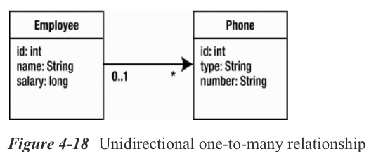

Considere el modelo de datos de la Figura 4-19. No hay una  join column para almacenar la asociación desde el `Phone` al empleado. Por lo tanto, hemos utilizado una join table para asociar la entidad `Phone` con la entidad `Employee`.

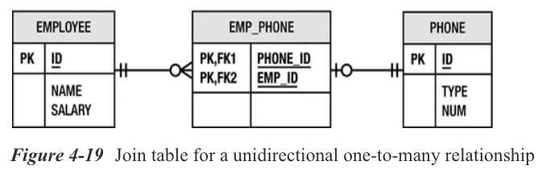

De manera similar, cuando un lado de una relación de muchos a muchos no tiene una correspondencia con el otro, se trata de una relación unidireccional. La tabla de combinación aún debe usarse; la única diferencia es que solo uno de los dos tipos de entidad realmente usa la tabla para cargar sus entidades relacionadas o la actualiza para almacenar asociaciones de entidades adicionales.

En estos dos casos unidireccionales con valor de colección, el código fuente es similar a los ejemplos anteriores, pero no hay ningún atributo en la entidad de destino(target) para hacer referencia a la entidad de origen, y el elemento `mappedBy` no estará presente en la anotación `@OneToMany` en la entidad fuente. La join table ahora debe especificarse como parte del mapeo. El Listado 4-24 muestra al `Employee` con una relación one-to-many con el `Phone` usando una join table.

***Listing 4-24*** Relación unidireccional One-to-Many

```java
@Entity
public class Employee {
   @Id private long id;
   private String name;
   @OneToMany
   @JoinTable(name="EMP_PHONE",
         joinColumns=@JoinColumn(name="EMP_ID"),
         inverseJoinColumns=@JoinColumn(name="PHONE_ID"))
   private Collection<Phone> phones;
   // ...
}
```

Tenga en cuenta que al generar el esquema, el nombre predeterminado de las columnas de combinación es ligeramente diferente en el caso unidireccional porque no hay un atributo inverso. El nombre de la join table sería de forma predeterminada `EMPLOYEE_PHONE` y tendría una columna de combinación denominada `EMPLOYEE_ID` después del nombre de la entidad `Employee` y su columna de clave principal (primary key). La columna de combinación inversa(inverse join column) se llamaría `PHONES_ID`, que es la concatenación del atributo `phones` en la entidad `Employee` y la columna de clave principal `ID` de la tabla `PHONE`.

#### LAZY RELATIONSHIPS (RELACIONES PEREZAS)

Las secciones anteriores mostraron cómo configurar un atributo para que se cargue cuando se accede a él y no necesariamente antes. Aprendió que la carga diferida a nivel de atributo normalmente no es muy beneficiosa.

Sin embargo, a nivel de relación, la carga diferida puede ser una gran ayuda para mejorar el rendimiento. Puede reducir la cantidad de SQL que se ejecuta y acelerar considerablemente las consultas y la carga de objetos.

El modo de búsqueda (fetch mode) se puede especificar en cualquiera de los cuatro tipos de mapeo de relaciones. Cuando no se especifica en una relación de valor único, se garantiza que el objeto relacionado se cargará con entusiasmo (loaded eagerly). Las relaciones con valores de colección se cargan por defecto de forma diferida, pero debido a que la carga diferida es solo una pista para el proveedor, se pueden cargar con entusiasmo (loaded eagerly) si el proveedor decide hacerlo.

En los casos de relaciones bidireccionales, el modo de búsqueda puede ser perezoso (lazy) por un lado pero ansioso (eager) por el otro. Este tipo de configuración es bastante común porque a menudo se accede a las relaciones de diferentes maneras según la dirección desde la que se produce la navegación.

Un ejemplo de cómo anular el modo de recuperación predeterminado es si no queremos cargar el `ParkingSpace` para un `Employee` cada vez que cargamos el `Employee`. El listado 4-25 muestra el atributo `parkingSpace` configurado para usar la carga diferida (lazy loading).

***Listado 4-25*** Cambio del Fetch Mode (modo de búsqueda) en una Relación

```java
@Entity
public class Employee {
   @Id private long id;
   @OneToOne(fetch=FetchType.LAZY)
   private ParkingSpace parkingSpace;
   // ...
}
```

> **TIP** *La relación que se especifica o está predeterminada para cargarse de forma diferida(azily loaded) puede o no causar que el objeto relacionado se cargue cuando se usa el método getter para acceder al objeto. El objeto podría ser un proxy, por lo que podría ser necesario invocar un método en él para provocar una falla.*

### Embedded Objects (Objetos Incrustados)

Un objeto incrustado (Embedded Objects) es aquel que depende de una entidad para su identidad. No tiene identidad propia, sino que es simplemente parte del estado de la entidad que ha sido tallado y almacenado en un objeto Java separado que cuelga de la entidad. En Java, los objetos incrustados parecen similares a las relaciones en el sentido de que son referenciados por una entidad y, en el sentido de Java, parecen ser el objetivo de una asociación. En la base de datos, sin embargo, el estado del objeto incrustado se almacena con el resto del estado de la entidad en la fila de la base de datos, sin distinción entre el estado de la entidad Java y el de su objeto incrustado.

> **TIP** *Aunque las entidades que los poseen hacen referencia a los objetos incrustados, no se dice que estén en relación con las entidades. El término relación solo se puede aplicar cuando ambos lados son entidades.*

**Si la fila(row) de la base de datos contiene todos los datos tanto de la entidad como de su objeto incrustado, ¿por qué tener ese objeto de todos modos? ¿Por qué no simplemente definir los campos de la entidad para hacer referencia a todo su estado de persistencia en lugar de dividirlo en uno o más subobjetos que son objetos persistentes de segunda clase que dependen de la entidad para su existencia?**

*Esto nos lleva de nuevo al desajuste de impedancia relacional de objeto del que hablamos en el Capítulo 1. Debido a que el registro de la base de datos contiene más de un tipo lógico, tiene sentido hacer esa separación explícita en el modelo de objeto de la aplicación aunque la representación física sea diferente. Casi se podría decir que el objeto incrustado es una representación más natural del concepto de dominio que una simple colección de atributos en la entidad. Además, una vez que haya identificado una agrupación de estado de entidad que forma un objeto incrustado, puede compartir el mismo tipo de objeto incrustado con otras entidades que también tienen la misma representación interna.*

Un ejemplo de dicha reutilización es la información de dirección. La Figura 4-20 muestra una tabla de `EMPLOYEE` que contiene una combinación de información básica del empleado, así como columnas que corresponden a la dirección del hogar del empleado.

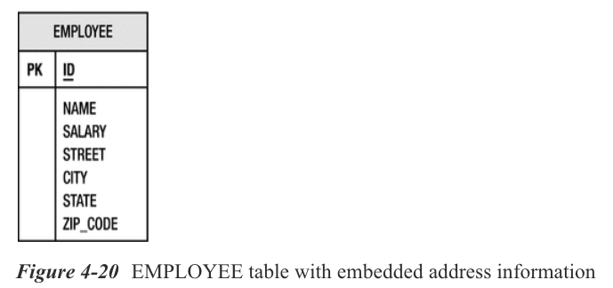

Las columnas `STREET`, `CITY`, `STATE` y `ZIP_CODE` se combinan lógicamente para formar la dirección. En el modelo de objetos, este es un candidato excelente para ser abstraído en un tipo incrustado(embedded) `Address` dirección separado en lugar de enumerar cada atributo en la clase de entidad. La clase de entidad simplemente tendría un atributo `address` apuntando a un objeto incrustado de tipo `Address`. La figura 4-21 muestra cómo el `Employee` y `Address` se relacionan entre sí. La asociación de composición UML se usa para indicar que el `Employee` es el propietario total de `Address` y que una instancia de `Address` no puede ser compartida por ningún otro objeto que no sea la instancia del `Employee` que la posee.

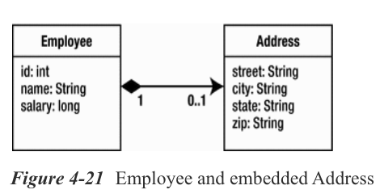

Con esta representación, la información de la dirección no solo está perfectamente encapsulada dentro de un objeto, sino que si otra entidad, como `Company` la Compañía, también tiene información de la dirección, también puede tener un atributo que apunte a su propio objeto `Address` dirección integrado. Describimos este escenario en la siguiente sección.

Un tipo incrustado se marca como tal agregando la anotación `@Embeddable` a la definición de clase. Esta anotación sirve para distinguir la clase de otros tipos regulares de Java. Una vez que una clase se ha designado como embeddable (incrustable), sus campos y propiedades serán persistentes como parte de una entidad. También podríamos querer definir el tipo de acceso del objeto embeddable(incrustable) para que se acceda de la misma manera independientemente de la entidad en la que esté incrustado. El Listado 4-26 muestra la definición del tipo embedded (incrustado) `Address`.

***Listado 4-26*** Tipo Embeddable Address

```java
@Embeddable @Access(AccessType.FIELD)
public class Address {
   private String street;
   private String city;
   private String state;
   @Column(name="ZIP_CODE")
   private String zip;
   // ...
}
```

Para usar esta clase en una entidad, la entidad debe tener solo un atributo del tipo embeddable(incrustable). El atributo se anota opcionalmente con la anotación `@Embedded` para indicar que es un embedded mapping(mapeo integrado). El Listado 4-27 muestra la clase `Employee` usando un objeto `Address` embedded(incrustado).

***Listado 4-27*** Uso de un Embedded Object (Objeto Incrustado)

```java
@Entity
public class Employee {
   @Id private long id;
   private String name;
   private long salary;
   @Embedded private Address address;
    // ...
}
```

Cuando el proveedor persiste en una instancia de `Employee`, accederá a los atributos del objeto `Address` como si estuvieran presentes en la propia instancia de la entidad. Las asignaciones(mappings) de columnas en el tipo `Address` realmente pertenecen a las columnas de la tabla `EMPLOYEE`, aunque se enumeran en un tipo diferente.

La decisión de utilizar entidades o objetos incrustados depende de si cree que alguna vez necesitará crear relaciones con ellos o a partir de ellos. Los objetos incrustados no están destinados a ser entidades, y tan pronto como empiece a tratarlos como entidades, probablemente debería convertirlos en entidades de primera clase en lugar de objetos incrustados si el modelo de datos lo permite.

> **TIP** *No es portátil definir objetos incrustados como parte de las jerarquías de herencia. Una vez que comienzan a extenderse entre sí, la complejidad de incorporarlos aumenta y la relación valor por costo disminuye.*

Antes de llegar a nuestro ejemplo, mencionamos que una clase `Address` podría reutilizarse tanto en las entidades `Employee` como `Company`. Idealmente, nos gustaría la representación que se muestra en la Figura 4-22. Aunque las clases `Employee` y `Company` comprenden la clase `Address`, esto no es un problema porque cada instancia de `Address` será utilizada por una única instancia de `Employee` o `Company`.

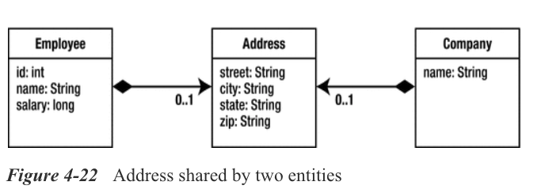

Dado que las asignaciones de columnas(column mappings) del tipo embedded(incrustado) `Address` se aplican a las columnas de la entidad contenedora, es posible que se pregunte cómo es posible compartir si las dos tablas de entidades tienen diferentes nombres de columna para los mismos campos. La figura 4-23 demuestra este problema. La tabla `COMPANY` coincide con los atributos predeterminados y asignados del tipo `Address` definido anteriormente, pero la tabla `EMPLOYEE` de este ejemplo se ha modificado para que coincida con los requisitos de dirección de una persona que vive en Canadá. Necesitamos una forma para que una entidad asigne el objeto incrustado de acuerdo con sus propias necesidades de tabla de entidad, y tenemos una en la anotación `@AttributeOverride`.

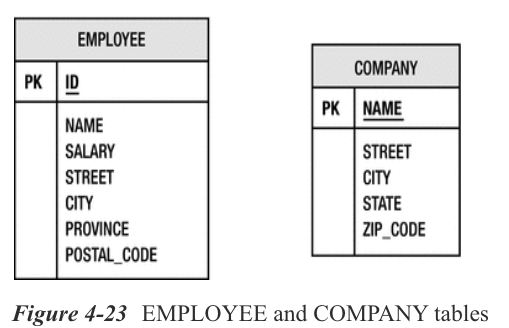

Usamos una anotación `@AttributeOverride` para cada atributo del objeto incrustado que queremos anular en la entidad. Anotamos el campo o propiedad incrustado en la entidad y especificamos en el elemento de nombre el campo o propiedad en el objeto incrustado que estamos anulando(overriding). El elemento `column` nos permite especificar la columna a la que se asigna el atributo en la tabla de la entidad. Lo indicamos en forma de una anotación anidada `@Column`. Si anulamos varios campos o propiedades, podemos usar la anotación `@AttributeOverrides` en plural y anidar varias anotaciones `@AttributeOverride` dentro de ella.

El Listado 4-28 muestra un ejemplo del uso de `Address` tanto en `Employee` como en `Company`. La entidad `Company` usa el tipo `Address` sin cambios, pero la entidad `Employee` especifica dos invalidaciones de atributos para asignar (overrides to map) el `state` y los atributos `zip` de la `Address` a las columnas `PROVINCE` y `POSTAL_CODE` de la tabla `EMPLOYEE`.

***Listado 4-28*** Reutilización de un Embedded Object(objeto incrustado) en varias entidades

```java
@Entity
public class Employee {
   @Id private long id;
   private String name;
   private long salary;
   @Embedded
   @AttributeOverrides({
      @AttributeOverride(name="state", column=@Column(name="PROVINCE")),
      @AttributeOverride(name="zip", column=@Column(name="POSTAL_CODE"))
   })
   private Address address;
   // ...
}
@Entity
public class Company {
   @Id private String name;
   @Embedded
   private Address address;
   // ...
}
```

## Resumen

La asignación de objetos a bases de datos relacionales es de vital importancia para las aplicaciones de persistencia. Lidiar con el desajuste de impedancia requiere un conjunto sofisticado de metadatos. JPA no solo proporciona estos metadatos, sino que también facilita el desarrollo fácil y conveniente.

En este capítulo, analizamos el proceso de mapeo del estado de la entidad que incluía tipos simples de Java, objetos grandes, tipos enumerados y tipos temporales. También usamos los metadatos para hacer un mapeo de encuentro en el medio a nombres de tablas y columnas específicas.

Explicamos cómo se generan los identificadores y describimos cuatro estrategias diferentes de generación. Viste las diferentes estrategias en acción y aprendiste a diferenciarlas unas de otras.

Luego revisamos algunos de los conceptos de relación y los aplicamos a metadatos de mapeo relacional de objetos. Usamos unir columnas y unir tablas para mapear asociaciones de un solo valor y de colección y repasamos algunos ejemplos. También discutimos tipos especiales de objetos llamados incrustables que están mapeados pero no tienen identificadores y solo pueden existir dentro de entidades persistentes.

El próximo capítulo analiza más las complejidades de mapear relaciones valoradas por colecciones, así como también cómo mapear colecciones de objetos que no son entidades. Profundizamos en los diferentes tipos de Colección y las formas en que estos tipos se pueden usar y mapear, y vemos cómo afectan las tablas de la base de datos que se están mapeando.

#### Notas al pie

**1** Aunque los tipos incrustados se pueden compartir o reutilizar, las instancias no. Una instancia de objeto incrustado pertenece a la entidad que hace referencia a ella; y ninguna otra instancia de entidad, de ese tipo de entidad o de cualquier otro, puede hacer referencia a la misma instancia incorporada.
