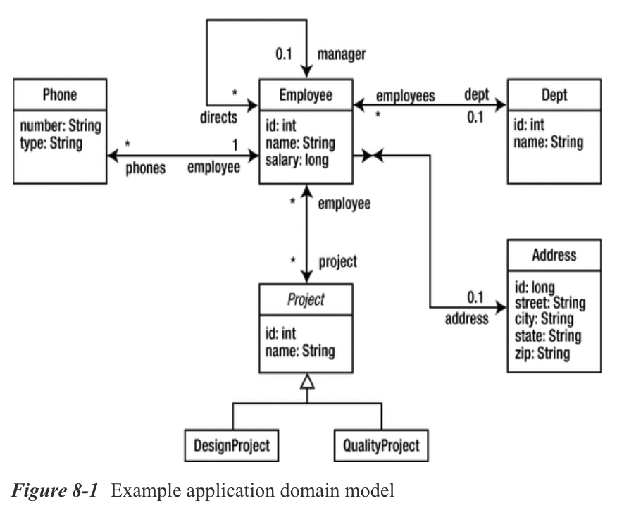

# Chapter 8: Query Language 

* Introducing JP QL
   * Terminology
   * Example Data Model
   * Example Application
* Select Queries
   * SELECT Clause
   * FROM Clause
   * WHERE Clause
   * Inheritance and Polymorphism
   * Scalar Expressions
   * ORDER BY Clause
* Aggregate Queries
   * Aggregate Functions
   * GROUP BY Clause
   * HAVING Clause
* Update Queries
* Delete Queries
* Summary

# Capítulo 8: Lenguaje de Consulta

La API de persistencia de Java proporciona dos métodos para consultar entidades: el lenguaje de consulta de persistencia de Java (JPQL) y la API de criterios.

El lenguaje de consulta de persistencia de Java (JP QL) es el lenguaje de consulta estándar basado en cadenas de JPA. Es un lenguaje de consulta portátil diseñado para combinar la sintaxis y la semántica de consulta simple de SQL con la expresividad de un lenguaje de expresión orientado a objetos. Las consultas escritas con este lenguaje se pueden compilar de forma portátil en SQL en todos los principales servidores de bases de datos.

La API Criteria se utiliza para crear consultas con seguridad de tipos utilizando las API del lenguaje de programación Java cuando se consultan entidades y sus relaciones.

En el último capítulo, analizamos la programación utilizando las interfaces de consulta y presentamos una breve introducción a JP QL para usuarios que ya tienen experiencia con SQL. Este capítulo explora el lenguaje de consulta en detalle, desglosando el lenguaje pieza por pieza con ejemplos para demostrar sus características.

## Introdución JP QL

Para describir qué es JP QL, es importante aclarar qué no es. JP QL no es SQL. A pesar de las similitudes entre los dos idiomas en términos de palabras clave y estructura general, existen diferencias muy importantes. Intentar escribir JP QL como si fuera SQL es la forma más fácil de frustrarse con el lenguaje. Las similitudes entre los dos lenguajes son intencionales (dando a los desarrolladores una idea de lo que JP QL puede lograr), pero la naturaleza orientada a objetos de JP QL requiere un tipo de pensamiento diferente.

Si JP QL no es SQL, ¿qué es? En pocas palabras, JP QL es un lenguaje para consultar entidades. En lugar de tablas y filas, *la moneda del idioma son entidades y objetos*. Nos proporciona una forma de expresar consultas en términos de entidades y sus relaciones, operando en el estado persistente de la entidad como se define en el modelo de objetos, no en el modelo de base de datos física.

Si JPA admite consultas SQL, ¿por qué introducir un nuevo lenguaje de consulta? Hay un par de razones importantes para considerar JP QL sobre SQL. El primero es la portabilidad. ***JP QL se puede traducir a los dialectos SQL de los principales proveedores de bases de datos***. La segunda es que las consultas se escriben en el modelo de dominio de entidades persistentes, sin necesidad de saber exactamente cómo se asignan esas entidades a la base de datos.

Comparemos un poco las API de JPQL y Criteria.

Las consultas JPQL son generalmente más concisas y legibles que las consultas Criteria. JPQL es fácil de aprender para programadores con conocimientos previos de SQL.

Las consultas JPQL no son seguras en los tipos, lo que significa que requieren una conversión al recuperar el resultado de la consulta del Entity Manager. Debido a eso, es posible que los errores de conversión de tipos no se detecten durante la compilación.

Además, las consultas JPQL no admiten parámetros abiertos.

Las consultas de Criteria API son seguras para los tipos y, por lo tanto, no requieren conversión.

Al comparar el rendimiento entre JPQL y Criteria API, las consultas Criteria API proporcionan un mejor rendimiento porque las consultas dinámicas JPQL deben analizarse cada vez que se llaman.

Una de las desventajas comunes de las consultas de Criteria API es que suelen ser más detalladas que las consultas JPQL. Esto significa que requerirán que los programadores creen muchos objetos y realicen operaciones en esos objetos antes de enviar la consulta Criteria API al Entity Manager.

Los ejemplos de este capítulo demuestran el poder presente incluso en las expresiones JP QL más simples.

Adoptar JP QL no significa perder todas las funciones de SQL a las que se ha acostumbrado. Se admite directamente una amplia selección de características SQL, incluidas subconsultas, consultas agregadas, declaraciones UPDATE y DELETE, numerosas funciones SQL y más.

### TERMINOLOGÍA

Las consultas(queries) se dividen en una de cuatro categorías: ***select***, ***aggregate***, ***update*** y ***delete*** (seleccionar, agregar, actualizar y eliminar). Las Select queries recuperan el estado persistente de una o más entidades y filtran los resultados según sea necesario. Las Aggregate queries son variaciones de consultas seleccionadas que agrupan los resultados y producen datos de resumen. En conjunto, las consultas select y aggregate a veces se denominan consultas de informes, ya que se centran principalmente en generar datos para informes. Las consultas de Update y delete (actualización y eliminación) se utilizan para modificar condicionalmente o eliminar conjuntos completos de entidades. Encontrará cada tipo de consulta descrito en detalle en su propia sección de este capítulo.

Las consultas operan en el conjunto de entidades y elementos integrables(embeddables) definidos por una unidad de persistencia. Este conjunto de entidades y elementos integrables(embeddables) se conoce como ***esquema de persistencia abstracto***, cuya colección define el dominio general del que se pueden recuperar los resultados.

> **NOTA** *Para permitir que este capítulo se utilice como complemento del capítulo Lenguaje de consulta de la especificación de la API de persistencia de Java, se utiliza la misma terminología siempre que sea posible.*

En las expresiones de consulta, las entidades se denominan por su nombre. Si una entidad no ha sido nombrada explícitamente (usando el atributo de nombre de la anotación `@Entity`, por ejemplo), el nombre de clase no calificado se usa por defecto. Este nombre es el nombre de esquema abstracto de la entidad en el contexto de una consulta.

Las entidades se componen de una o más propiedades de persistencia implementadas como campos o propiedades JavaBean. El tipo de esquema abstracto de una propiedad persistente en una entidad se refiere a la clase o tipo primitivo utilizado para implementar esa propiedad. Por ejemplo, si la entidad `Employee` tiene una propiedad `name` de tipo `String`, el tipo de esquema abstracto de esa propiedad en las expresiones de consulta también es `String`. Las propiedades persistentes simples sin mapeo de relaciones comprenden el estado persistente de la entidad y se denominan campos de estado(state fields). Las propiedades persistentes que también son relaciones se denominan campos de asociación (association fields).

Como vio en el último capítulo, las consultas se pueden definir de forma dinámica o estática. Los ejemplos de este capítulo consisten en consultas que se pueden utilizar de forma dinámica o estática, según las necesidades de la aplicación.

Finalmente, es importante tener en cuenta que ***las consultas no distinguen entre mayúsculas y minúsculas, excepto en dos casos: los nombres de entidad y los nombres de propiedad deben especificarse exactamente como se nombran***

### EJEMPLO DEL MODELO DE DATOS

La Figura 8-1 muestra el modelo de dominio para las consultas de este capítulo. Continuando con los ejemplos que hemos estado usando a lo largo del libro, demuestra muchos tipos de relaciones diferentes, incluidas las relaciones unidireccionales, bidireccionales y autorreferenciales. Agregamos los nombres de los roles a este diagrama para hacer explícitos los nombres de las propiedades de relación.



Las asignaciones relacionales(relational mappings) de objetos para este modelo no se incluyen en este capítulo, excepto cuando describimos el equivalente SQL de una consulta en particular. No es necesario saber cómo se asigna un objeto para escribir consultas porque el lenguaje de consulta se basa completamente en el modelo de objeto y las relaciones lógicas entre entidades. ***El trabajo del traductor de consultas es tomar las expresiones de consulta orientadas a objetos e interpretar los metadatos de mapeo para producir el SQL necesario para ejecutar la consulta en la base de datos.***

### EJEMPLO DE LA APLICACIÓN

Aprender un nuevo lenguaje puede ser una experiencia desafiante. Una cosa es leer página tras página de texto que describe las características del lenguaje, pero otra cosa es poner en práctica estas características. Para acostumbrarse a escribir consultas, considere usar una aplicación como la que se muestra en el Listado 8-1. Esta sencilla aplicación lee consultas desde la consola y las ejecuta contra las entidades de una unidad de persistencia particular.

***Listado 8-1*** Aplicación para Testing Queries

```java
package persistence;
import java.io.*;
import java.util.*;
import javax.persistence.*;
import org.apache.commons.lang.builder.*;
public class QueryTester {
   public static void main(String[] args) throws Exception {
      String unitName = args[0];
      EntityManagerFactory emf = Persistence.createEntityManagerFactory(unitName);
      EntityManager em = emf.createEntityManager();
      BufferedReader reader = new BufferedReader(new InputStreamReader(System.in));
      for (;;) {
         System.out.print("JP QL> ");
         String query = reader.readLine();
         if (query.equals("quit")) {
            break;
         }
         if (query.length() == 0) {
            continue;
         }
         try {
            List result = em.createQuery(query).getResultList();
            if (result.size() > 0) {
               int count = 0;
               for (Object o : result) {
                  System.out.print(++count + " ");
                  printResult(o);
               }
            } else {
               System.out.println("0 results returned");
            }
         } catch (Exception e) {
            e.printStackTrace();
         }
      }
   }
   private static void printResult(Object result) throws Exception {
      if (result == null) {
         System.out.print("NULL");
      } else if (result instanceof Object[]) {
         Object[] row = (Object[]) result;
         System.out.print("[");
         for (int i = 0; i < row.length; i++) {
            printResult(row[i]);
         }
         System.out.print("]");
      } else if (result instanceof Long ||
         result instanceof Double ||
         result instanceof String) {
         System.out.print(result.getClass().getName() + ": " + result);
      } else {
         System.out.print(ReflectionToStringBuilder.toString(result,
                           ToStringStyle.SHORT_PREFIX_STYLE));
      }
      System.out.println();
   }
}
```

El único requisito para usar esta aplicación es el nombre de una unidad de persistencia que contenga las entidades que desea consultar. La aplicación leerá el nombre de la unidad de persistencia desde la línea de comando e intentará crear una `EntityManagerFactory` para ese nombre. Si la inicialización es exitosa, las consultas se pueden escribir en el indicador `JP QL>`. La consulta se ejecutará y los resultados se imprimirán. El formato de cada resultado es el nombre de la clase seguido de cada una de las propiedades de esa clase. Este ejemplo utiliza la biblioteca ***Apache Jakarta Commons-Lang library*** para generar el resumen del objeto. El Listado 8-2 muestra una sesión de muestra con la aplicación.

***Listado 8-2*** Ejemplo Session con QueryTester
```sh
JP QL> SELECT p FROM Phone p WHERE p.type NOT IN ('office', 'home')
1 Phone[id=5,number=516-555-1234,type=cell,employee=Employee@13c0b53]
2 Phone[id=9,number=650-555-1234,type=cell,employee=Employee@193f6e2]
3 Phone[id=12,number=650-555-1234,type=cell,employee=Employee@36527f]
4 Phone[id=18,number=585-555-1234,type=cell,employee=Employee@bd6a5f]
5 Phone[id=21,number=650-555-1234,type=cell,employee=Employee@979e8b]
JP QL> SELECT d.name, AVG(e.salary) FROM Department d JOIN d.employees e ➥
GROUP BY d.name
1 [java.lang.String: QA
java.lang.Double: 52500.0
]
2 [java.lang.String: Engineering
java.lang.Double: 56833.333333333336
]
JP QL> quit
```

## Select Queries

Las consultas seleccionadas son el tipo de consulta más importante y facilitan la recuperación masiva de datos de la base de datos. No es sorprendente que las consultas seleccionadas sean también la forma más común de consulta utilizada en las aplicaciones. La forma general de una consulta de selección es la siguiente:

```sql
SELECT <select_expression>
FROM <from_clause>
[WHERE <conditional_expression>]
[ORDER BY <order_by_clause>]
```

La forma más simple de una consulta de selección consta de dos partes obligatorias: la cláusula `SELECT` y la cláusula `FROM`. La cláusula `SELECT` define el formato de los resultados de la consulta, mientras que la cláusula `FROM` define la entidad o entidades de las que se obtendrán los resultados. Considere la siguiente consulta completa que recupera a todos los empleados de la empresa:


```sql
SELECT e
FROM Employee e
```

La estructura de esta query es muy similar a una consulta SQL, pero con un par de diferencias importantes. **La primera diferencia es** que el dominio de la consulta definido en la cláusula `FROM` no es una tabla sino una entidad; en este caso, la entidad `Employee`. Como en SQL, se le ha asignado un alias al identificador `e`. Este valor de alias se conoce como una ***variable de identificación*** y es la clave por la cual se hará referencia a la entidad en el resto de la instrucción de selección. A diferencia de las consultas en SQL, donde un alias de tabla es opcional, ***el uso de variables de identificación es obligatorio en JP QL***.

**La segunda diferencia es** que la cláusula `SELECT` en este ejemplo no enumera los campos de la tabla ni usa un comodín para seleccionar todos los campos. En su lugar, solo se enumera la variable de identificación para indicar que el tipo de resultado de la consulta es la entidad `Employee`, no un conjunto tabular de filas.

A medida que el procesador de consultas itera sobre el conjunto de resultados devuelto por la base de datos, convierte los datos de filas y columnas tabulares en un conjunto de instancias de entidad. El método `getResultList()` de la interfaz `Query` devolverá una colección de cero o más objetos `Employee` después de evaluar la consulta. A pesar de las diferencias de estructura y sintaxis, todas las consultas se pueden traducir a SQL.

Para ejecutar una consulta, el motor de consultas primero crea una representación SQL óptima de la consulta JP QL. La consulta SQL resultante es lo que realmente se ejecuta en la base de datos. En este ejemplo simple, el SQL podría verse así, según los metadatos de mapeo para la entidad `Employee`:

```sql
SELECT id, name, salary, manager_id, dept_id, address_id
FROM emp
```

La instrucción SQL debe leer todas las columnas asignadas necesarias para crear la instancia de entidad, incluidas las columnas de clave externa. Incluso si la entidad está almacenada en caché en la memoria, el motor de consultas normalmente leerá todos los datos necesarios para asegurarse de que la versión almacenada en caché esté actualizada. Tenga en cuenta que si las relaciones entre `Employee` y las entidades `Department` o `Address` hubieran requerido una carga eager, la declaración SQL se ampliaría para recuperar los datos adicionales o se habrían agrupado varias declaraciones para construir completamente la entidad `Employee`. Cada proveedor proporcionará algún método para mostrar el SQL que genera al traducir JP QL. Para el ajuste del rendimiento en particular, comprender cómo su proveedor se acerca a la generación de SQL puede ayudarlo a escribir consultas más eficientes.

Ahora que hemos visto una consulta simple y cubierto la terminología básica, las siguientes secciones se moverán a través de cada una de las cláusulas de la consulta de selección, explicando la sintaxis y las funciones disponibles.

> **NOTA** *Como mostramos en el Capítulo 2, la nueva función de transmisión de consultas incluida en JPA 2.2 nos ayudará a evitar obtener demasiados datos y causar errores. Sin embargo, sigue siendo recomendable y más eficaz utilizar el método `Result Set` de paginación.

### CLÁUSULA SELECT

La cláusula `SELECT` de una query puede adoptar varias formas, incluidas expresiones de ruta(path expressions) simples y complejas, expresiones escalares(scalar expressions), expresiones de constructor (constructor expressions), funciones agregadas(aggregate functions) y secuencias de estos tipos de expresión. Las siguientes secciones presentan expresiones de ruta(path expressions) y discuten los diferentes estilos de cláusulas `SELECT` y cómo determinan el tipo de resultado de la consulta. Aplazamos la discusión de las expresiones escalares hasta explorar las expresiones condicionales en la cláusula `WHERE`. Se describen completamente en la sección denominada "Expresiones escalares". Las funciones agregadas se detallan más adelante en el capítulo de la sección denominada "Consultas agregadas".

#### ***Path Expressions***

Las Path Expressions(expresiones de ruta) son los componentes básicos de las consultas. Se utilizan para navegar fuera de una entidad, ya sea a través de una relación con otra entidad (o colección de entidades) o con una de las propiedades persistentes de una entidad. La navegación que da como resultado uno de los campos de estado persistentes (ya sea campo o propiedad) de una entidad se denomina ruta de campo de estado. La navegación que conduce a una única entidad se denomina ruta de asociación(association path) de valor único, mientras que la navegación a una colección de entidades se denomina ruta de asociación con valor de colección.

El operador de punto (.) Significa navegación de ruta(path navigation) en una expresión. Por ejemplo, si la entidad `Employee` se ha asignado a la variable de identificación `e`, `e.name` es una expresión de ruta de campo de estado que se resuelve en el nombre del empleado. Del mismo modo, la expresión de ruta `e.department` es una asociación de valor único del empleado al departamento al que está asignado. Por último, `e.directs` es una asociación de valor de colección que resuelve la colección de empleados que reportan a un empleado que también es gerente(manager).

Lo que hace que las expresiones de ruta sean tan poderosas es que no se limitan a una sola navegación. En su lugar, las expresiones de navegación se pueden encadenar para atravesar gráficos de entidad complejos siempre que la ruta se mueva de izquierda a derecha a través de asociaciones de un solo valor. Una ruta no puede continuar desde un campo de estado o una asociación con valor de colección. Con esta técnica, podemos construir expresiones de ruta como `e.department.name`, que es el nombre del departamento al que pertenece el empleado. Tenga en cuenta que las expresiones de ruta pueden navegar hacia y a través de objetos incrustados, así como entidades normales. La única restricción sobre los objetos incrustados en una expresión de ruta es que la raíz de la expresión de ruta debe comenzar con una entidad.

Las expresiones de ruta se utilizan en cada cláusula de un select query, determinando todo, desde el tipo de resultado de la consulta hasta las condiciones bajo las cuales se deben filtrar los resultados. La experiencia con path expressions(expresiones de ruta) es la clave para escribir consultas efectivas.

#### ***Entities y Objects (Entidades y Objetos)***

La primera y más simple forma de la cláusula `SELECT` es una única variable de identificación. El tipo de resultado para una consulta de este estilo es la entidad a la que está asociada la variable de identificación. Por ejemplo, la siguiente consulta devuelve todos los departamentos de la empresa:


```sql
SELECT d
FROM Department d
```

La palabra clave `OBJECT` se puede utilizar para indicar que el tipo de resultado de la consulta es la entidad vinculada a la variable de identificación. No tiene ningún impacto en la consulta, pero puede usarse como una pista visual.

```sql
SELECT OBJECT(d)
FROM Department d
```

El único problema con el uso de `OBJECT` es que aunque las expresiones de ruta pueden resolverse en un tipo de entidad, la sintaxis de la palabra clave `OBJECT` se limita a las variables de identificación. La expresión `OBJECT(e.department)` es ilegal aunque `Department` es un tipo de entidad. Por esa razón, no recomendamos la sintaxis `OBJECT`. Existe principalmente por compatibilidad con versiones anteriores del lenguaje que requerían la palabra clave `OBJECT` en el supuesto de que una futura revisión de SQL incluiría la misma terminología.

Una path expression(expresión de ruta) que se resuelve en un campo de estado o una asociación de un solo valor también se puede usar en la cláusula `SELECT`. En este caso, el tipo de resultado de la consulta se convierte en el tipo de la path expression(expresión de ruta), ya sea el tipo de campo de estado o el tipo de entidad de una asociación de un solo valor. La siguiente consulta devuelve los nombres de todos los empleados:

```sql
SELECT e.name
FROM Employee e
```

El tipo de resultado de la path expression(expresión de ruta) en la cláusula `SELECT` es `String`, por lo que la ejecución de esta consulta usando `getResultList()` producirá una colección de cero o más objetos `String`. Las path expression(expresión de ruta) que se resuelven en campos de estado también se pueden utilizar como parte de expresiones escalares, lo que permite transformar el campo de estado en los resultados de la consulta. Discutiremos esta técnica más adelante en la sección llamada "Expresiones escalares".

Las entidades a las que se llega desde una path expression(expresión de ruta) también se pueden devolver. La siguiente consulta demuestra la devolución de una entidad diferente como resultado de la path navigation(navegación de ruta):

```sql
SELECT e.department
FROM Employee e
```

El tipo de resultado de esta consulta es la entidad `Department` porque es el resultado de atravesar la relación de `department` de `Employee` a `Department`. Por tanto, la ejecución de la consulta dará como resultado una colección de cero o más objetos `Department`, incluidos los duplicados.

Para eliminar los duplicados, se debe utilizar el operador `DISTINCT`:

```sql
SELECT DISTINCT e.department
FROM Employee e
```

El operador `DISTINCT` es funcionalmente equivalente al operador SQL del mismo nombre. Una vez que se recopila el conjunto de resultados, los valores duplicados (utilizando la identidad de entidad si el tipo de resultado de la consulta es una entidad) se eliminan para que solo se devuelvan resultados únicos.

El tipo de resultado de una consulta de selección es el tipo correspondiente a cada fila en el conjunto de resultados producido al ejecutar la consulta. Esto puede incluir entidades, tipos primitivos y otros tipos de atributos persistentes, pero nunca un tipo de colección. **La siguiente consulta es ilegal**:

```sql
SELECT d.employees
FROM Department d
```

La path expression (expresión de ruta) `d.employees` es una ruta con valor de colección que produce un tipo de colección. Restringir las consultas de esta manera evita que el proveedor tenga que combinar filas sucesivas de la base de datos en un único objeto de resultado.

Es posible seleccionar objetos incrustables(embeddable) a los que se navega en una path expression(expresión de ruta). La siguiente consulta devuelve solo los objetos embeddable `ContactInfo` para todos los empleados:

```sql
SELECT e.contactInfo
FROM Employee e
```

Lo que hay que recordar sobre la selección de elementos embeddables es que los objetos devueltos no se gestionarán. Si emite una consulta para devolver empleados (`select e FROM Employee e`) y luego, desde los resultados, navegue a sus objetos incrustados `ContactInfo`, obtendrá elementos incrustables que fueron administrados. Los cambios en cualquiera de esos objetos se guardarían cuando se confirmara la transacción. Sin embargo, cambiar cualquiera de los resultados del objeto `ContactInfo` devueltos por una consulta que seleccionó `ContactInfo` directamente no tendría un efecto persistente.

#### ***Combinando Expresiones***

Se pueden especificar varias expresiones en la misma cláusula `SELECT` separándolas con comas. El tipo de resultado de la consulta en este caso es un array de tipo Objeto, donde los elementos del array son el resultado de resolver las expresiones en el orden en que aparecieron en la consulta.

Considere la siguiente consulta que devuelve solo el nombre y el salario de un empleado:

```sql
SELECT e.name, e.salary
FROM Employee e
```

Cuando se ejecuta, se devolverá una colección de cero o más instancias de arrays de tipo Object. Cada array en este ejemplo tiene dos elementos, el primero es un `String` que contiene el nombre del empleado y el segundo es un `Double` que contiene el salario del empleado. ***La práctica de informar solo un subconjunto de los state fields(campos de estado) de una entidad se llama proyección*** porque los datos de la entidad se proyectan fuera de la entidad en forma tabular.

La proyección es una técnica útil para aplicaciones web en las que solo se muestran unos pocos datos de un gran conjunto de instancias de entidades. Dependiendo de cómo se haya asignado la entidad, es posible que se requiera una consulta SQL compleja para recuperar completamente el estado de la entidad. Si solo se requieren dos campos, el esfuerzo adicional invertido en la construcción de la instancia de entidad podría haberse desperdiciado. Una consulta de proyección que devuelve solo la cantidad mínima de datos es más útil en estos casos.

#### ***Constructor Expressions***

Una forma más poderosa de la cláusula `SELECT` que involucra múltiples expresiones es la constructor expression(expresión de constructor), que especifica que los resultados de la consulta deben almacenarse utilizando un tipo de objeto especificado por el usuario. Considere la siguiente consulta:

```sql
SELECT NEW example.EmployeeDetails(e.name, e.salary, e.department.name)
FROM Employee e
```

El tipo de resultado de esta consulta es la clase `example.EmployeeDetails Java class`. A medida que el procesador de consultas itera sobre los resultados de la consulta, crea instancias nuevas de `EmployeeDetails` utilizando el constructor que coincide con los tipos de expresión enumerados en la consulta. En este caso, los expression types(tipos de expresión) son `String`, `Double` y `String`, por lo que el query engine(motor de consulta) buscará un constructor con esos tipos de clase para argumentos. Cada fila de la colección de consultas resultante es, por tanto, una instancia de `EmployeeDetails` que contiene el nombre del empleado, el salario y el nombre del departamento.

Se debe hacer referencia al tipo de objeto de resultado mediante el nombre completo del objeto. Sin embargo, la clase no tiene que estar asignada a la base de datos de ninguna manera. Cualquier clase con un constructor compatible con las expresiones enumeradas en la cláusula SELECT se puede usar en una constructor expression(expresión de constructor).

Las constructor expression(expresión de constructor) son herramientas poderosas para construir objetos de transferencia de datos de coarse-grained(grano grueso) u objetos de vista para usar en otros niveles de aplicación. En lugar de construir manualmente estos objetos, se puede utilizar una sola consulta para reunir los objetos de vista listos para su presentación en una página web.

### CLÁUSULA FROM

La cláusula `FROM` se utiliza para declarar una o más variables de identificación, derivadas opcionalmente de relaciones unidas, que forman el dominio sobre el que la consulta debe extraer sus resultados. La sintaxis de la cláusula `FROM` consta de una o más variables de identificación y declaraciones de join clause(cláusula de unión).

#### ***Identification Variables (Variables de identificación)***

La variable de identificación es el punto de partida para todas las query expressions(expresiones de consulta). Cada consulta debe tener al menos una variable de identificación definida en la cláusula `FROM`, y esa variable debe corresponder a un tipo de entidad. Cuando una declaración de variable de identificación no usa una path expression(expresión de ruta) (es decir, cuando es un nombre de entidad única), se denomina declaración de variable de rango(range variable declaration). Esta terminología proviene de la teoría de conjuntos, ya que se dice que la variable abarca la entidad.

Las declaraciones de variables de rango(range variable) utilizan la sintaxis `<entity_name> [AS] <identifier>`. Hemos estado usando esta sintaxis en todos nuestros ejemplos anteriores, pero sin la palabra clave opcional `AS`. El identificador debe seguir las reglas de nomenclatura estándar de Java y se puede hacer referencia a él en toda la consulta sin distinción entre mayúsculas y minúsculas. Se pueden especificar varias declaraciones separándolas con comas.

Las path expressions(expresiones de ruta) también pueden tener un alias para las variables de identificación en el caso de uniones y subconsultas. La sintaxis para las declaraciones de variables de identificación en estos casos se tratará en las dos secciones siguientes.

#### ***Joins (Uniones)***

Un **join** es un query que combina resultados de varias entidades. Los Joins en las consultas JP QL son lógicamente equivalentes a las joins SQL. En última instancia, una vez que la consulta se traduce a SQL, es bastante probable que las combinaciones entre entidades produzcan combinaciones similares entre las tablas a las que se asignan las entidades. Por lo tanto, comprender cuándo se producen los joins es importante para escribir consultas eficaces.

Los Joins se producen siempre que se cumple alguna de las siguientes condiciones en una consulta `SELECT`.

* Dos o más declaraciones de range variable(variable de rango) se enumeran en la cláusula `FROM` y aparecen en la cláusula `SELECT`.

* El operador `JOIN` se usa para extender una identification variable(variable de identificación) usando una path expression(expresión de ruta).

* Una path expression(expresión de ruta) en cualquier parte de la consulta navega a través de un campo de asociación, a la misma entidad o a una diferente.

* Una o más condiciones `WHERE` comparan atributos de diferentes variables de identificación.

La semántica de un join entre entidades es la misma que la de los joins SQL entre tablas. La mayoría de las consultas contienen una serie de condiciones de combinación(join conditions), que son expresiones que definen las reglas para hacer coincidir una entidad con otra. Las  join conditions(condiciones de combinación) se pueden especificar explícitamente, usando el operador `JOIN` en la cláusula `FROM` de un query, o implícitamente como resultado de la path navigation(navegación de ruta).

Una **inner join(unión interna)** entre dos entidades devuelve los objetos de ambos tipos de entidad que satisfacen todas las condiciones de unión. La path navigation (navegación de ruta) de una entidad a otra es una forma de inner join(unión interna). La **outer join (unión externa)** de dos entidades es el conjunto de objetos de ambos tipos de entidad que satisfacen las condiciones de combinación más el conjunto de objetos de un tipo de entidad (designado como left entity(entidad izquierda)) que no tienen una condición de combinación coincidente en el otro.

En ausencia de join conditions(condiciones de unión) entre dos entidades, las consultas producirán un producto cartesiano. Cada objeto del primer tipo de entidad se empareja con cada objeto del segundo tipo de entidad, elevando al cuadrado el número de resultados<sup>1</sup>. Los productos cartesianos son raros con las consultas JP QL dadas las capacidades de navegación del lenguaje, pero son posibles si se especifican dos declaraciones de range variable(variable de rango) en la cláusula `FROM` sin condiciones adicionales especificadas en la cláusula `WHERE`.

En las siguientes secciones se proporcionan más discusiones y ejemplos de cada estilo de combinación.

#### ***Inner Joins***

Todas las consultas de ejemplo hasta ahora han estado utilizando la forma más simple de la cláusula `FROM`, un solo tipo de entidad con alias de una variable de identificación. Sin embargo, como lenguaje relacional, JP QL admite consultas que se basan en múltiples entidades y las relaciones entre ellas.

Los Inner joins(uniones internas) entre dos entidades se pueden especificar de una de las formas que se enumeraron anteriormente. La primera forma preferida, porque es explícito y obvio que se está produciendo una combinación, es el operador `JOIN` en la cláusula `FROM`. Otro formulario requiere varias declaraciones de variable de rango en las condiciones de la cláusula `FROM` y `WHERE` para proporcionar las join conditions(condiciones de combinación).


#### ***JOIN Operator y Collection Association Fields***

La sintaxis de una inner join que utiliza el operador `JOIN` es `[INNER] JOIN <path_expression> [AS] <identifier>`. Considere el siguiente query:

```sql
SELECT p
FROM Employee e JOIN e.phones p
```

Esta consulta utiliza el operador `JOIN` para unir la entidad `Employee` a la entidad `Phone` en la relación de `phones`. La join condition(condición de unión) en esta consulta se define mediante el mapeo relacional de objeto de la relación de `phones`. No es necesario especificar criterios adicionales para vincular las dos entidades. Al unir las dos entidades, esta consulta devuelve todas las instancias de la entidad `Phone` asociadas con los empleados de la empresa.

La sintaxis de los joins es similar a las expresiones `JOIN` compatibles con ANSI SQL. Para los lectores que no estén familiarizados con esta sintaxis, considere la forma SQL equivalente de la consulta anterior escrita con la forma de combinación tradicional:

```sql
SELECT p.id, p.phone_num, p.type, p.emp_id
  FROM emp e, phone p
 WHERE e.id = p.emp_id
```

El mapeo de la tabla para la entidad `Phone` reemplaza la expresión `e.phones`. La cláusula `WHERE` también incluye los criterios necesarios para unir las dos tablas a través de las join columns(columnas de unión) definidas por lel mapping de `phones`.

Tenga en cuenta que la relación de los `phones` se ha asignado a la variable de identificación `p`. Aunque la entidad `Phone` no aparece directamente en el query, el destino de la relación `phones` es la entidad `Phone`, y esto determina el tipo de variable de identificación. Esta determinación implícita del tipo de variable de identificación puede llevar algún tiempo acostumbrarse. Es necesario estar familiarizado con cómo se definen las relaciones en el modelo de objetos para navegar a través de una consulta escrita.

Cada aparición de `p` fuera de la cláusula `FROM` ahora se refiere a un solo teléfono propiedad de un empleado. Aunque se especificó un campo de asociación de colección en la cláusula `JOIN`, ***la variable de identificación en realidad se refiere a las entidades a las que llega esa asociación, no a la colección en sí***. La variable ahora se puede usar como si la entidad `Phone` estuviera listada directamente en la cláusula `FROM`. Por ejemplo, en lugar de devolver instancias de entidad de `Phone`, se pueden devolver números de teléfono.

```sql
SELECT p.number
FROM Employee e JOIN e.phones p
```

En la definición anterior de path expressions(expresiones de ruta), se observó que una ruta no podía continuar desde un state field(campo de estado) o un campo de asociación de colección. Para solucionar esta situación, el campo de asociación de colección debe unirse en la cláusula `FROM` para que se cree una nueva variable de identificación para la ruta, lo que le permite ser la raíz de las nuevas expresiones de ruta.

> **IN VERSUS JOIN**
> EJBQL, según lo definido por las especificaciones EJB 2.0 y EJB 2.1, utilizó un operador especial `IN` en la cláusula `FROM` para asignar asociaciones de colección a variables de identificación. El apoyo a este operador se transfirió a JP QL. La forma equivalente de la consulta utilizada anteriormente en esta sección podría especificarse como:

```sql
SELECT DISTINCT p
FROM Employee e, IN(e.phones) p
```

> El operador `IN` está destinado a indicar que la variable `p` es una enumeración de la colección `phones`. El operador `JOIN` es una forma más poderosa y expresiva de declarar relaciones y es el operador recomendado para consultas.

#### ***JOIN Operator y Single-Valued Association Fields***

El operador `JOIN` funciona tanto con expresiones de ruta de asociación con valores de colección como con expresiones de ruta de asociación con un solo valor. Considere el siguiente ejemplo:

```sql
SELECT d
FROM Employee e JOIN e.department d
```

Esta consulta define una unión de `Employee` a `Department` en toda la relación del `department`. Esto es semánticamente equivalente a usar una path expression(expresión de ruta) en la cláusula `SELECT` para obtener el departamento para el empleado. Por ejemplo, la siguiente consulta debería dar como resultado representaciones SQL similares, si no idénticas, que implican una unión entre las entidades `Employee` y `Department`:

```sql
SELECT e.department
FROM Employee e
```

El caso de uso principal para usar una expresión de ruta de asociación de un solo valor en la cláusula `FROM` (en lugar de simplemente usar una expresión de ruta en la cláusula `SELECT`) es para outer joins(combinaciones externas). La Path navigation(navegación de ruta) es equivalente a la inner join(unión interna) de todas las entidades asociadas atravesadas en la path expression(expresión de ruta).

La posibilidad de inner joins(uniones internas) implícitas resultantes de las (path expressions)expresiones de ruta es algo de lo que hay que estar consciente. Considere el siguiente ejemplo que ***muestra los distintos departamentos con sede en California que participan en el proyecto `Release1`***:


```sql
SELECT DISTINCT e.department
  FROM Project p JOIN p.employees e
 WHERE p.name = 'Release1' 
   AND e.address.state = 'CA'
```

En realidad, hay cuatro joins lógicos aquí, no dos. El traductor tratará la consulta como si se hubiera escrito con joins explícitos entre las distintas entidades. Cubriremos la sintaxis para múltiples combinaciones más adelante en la sección "Múltiples combinaciones", pero por ahora considere la siguiente consulta que es equivalente a la consulta anterior, leyendo las join conditions(condiciones de combinación) de izquierda a derecha:


```sql
SELECT DISTINCT d
  FROM Project p JOIN p.employees e JOIN e.department d JOIN e.address a
 WHERE p.name = 'Release1' AND
       a.state = 'CA'
```

Indicamos cuatro joins lógicos porque el mapeo físico real podría involucrar más tablas. En este caso, las entidades `Employee` y `Project` están relacionadas mediante una asociación de many-to-many mediante una join table(tabla de combinación). Por lo tanto, el SQL real para dicha query utiliza cinco tablas, no cuatro.


```sql
SELECT DISTINCT d.id, d.name
  FROM project p, emp_projects ep, emp e, dept d, address a
 WHERE p.id = ep.project_id 
   AND ep.emp_id = e.id
   AND e.dept_id = d.id
   AND e.address_id = a.id
   AND p.name = 'Release1'
   AND a.state = 'CA'
```

La primera forma de la consulta es ciertamente más fácil de leer y comprender. Sin embargo, durante el ajuste del rendimiento, puede resultar útil comprender cuántas joins pueden producirse como resultado de path expressions(expresiones de ruta) aparentemente triviales.

#### ***Join Conditions en la Cláusula WHERE***

Las consultas SQL tradicionalmente han unido tablas al enumerar las tablas que se unirán en la cláusula `FROM` y proporcionar criterios en la cláusula `WHERE` de la consulta para determinar las join conditions(condiciones de unión). Para unir dos entidades sin usar una relación, use una declaración de range variable(variable de rango) para cada entidad en la cláusula `FROM`.

El ejemplo de join anterior entre las entidades `Employee` y `Department` también podría haberse escrito así:

```sql
SELECT DISTINCT d
  FROM Department d, Employee e
 WHERE d = e.department
```

Este estilo de consulta se usa generalmente para compensar la falta de una relación explícita entre dos entidades en el modelo de dominio. Por ejemplo, no existe asociación entre la entidad `Department` y el `Employee` que es el gerente(manager) del departamento.

Podemos usar una join condition(condición de combinación) en la cláusula `WHERE` para que esto sea posible.

```sql
SELECT d, m
  FROM Department d, Employee m
 WHERE d = m.department 
   AND m.directs IS NOT EMPTY
```

En este ejemplo, estamos usando una de las expresiones de colección especiales, `IS NOT EMPTY`, para verificar que la colección de informes directos(direct reports) al empleado no esté vacía. Cualquier empleado con una colección no vacía de directivas es, por definición, un gerente(manager).

#### ***Multiple Joins***

Se puede conectar en cascada más de una combinación si es necesario. Por ejemplo, la siguiente consulta devuelve el conjunto distinto de proyectos que pertenecen a empleados que pertenecen a un departamento:

```sql
SELECT DISTINCT p
FROM Department d JOIN d.employees e JOIN e.projects p
```

El procesador de consultas interpreta la cláusula `FROM` de izquierda a derecha. Una vez que se ha declarado una variable, otras expresiones `JOIN` pueden hacer referencia a ella posteriormente. En este caso, se navega por la relación de proyectos `projects` de la entidad `Employee` una vez declarada la variable empleado.

#### ***Map Joins***

Una path expression(expresión de ruta) que navega a través de una asociación con valor de colección implementada como un `Map` es un caso especial. A diferencia de una colección normal, cada elemento de un map corresponde a dos piezas de información: la clave y el valor (key/value). Al trabajar con JP QL, es importante tener en cuenta que las variables de identificación basadas en mapas se refieren al valor por defecto. Por ejemplo, considere el caso en el que la relación de teléfonos de la entidad `Employee` se modela como un map, donde la clave es el tipo de número (trabajo, celular, casa, etc.) y el valor es el número de teléfono. La siguiente consulta enumera los números de teléfono de todos los empleados:

```sql
SELECT e.name, p
FROM Employee e JOIN e.phones p
```

Este comportamiento se puede resaltar explícitamente mediante el uso de la palabra clave `VALUE`. Por ejemplo, la consulta anterior es funcionalmente idéntica a la siguiente:

```sql
SELECT e.name, VALUE(p)
FROM Employee e JOIN e.phones p
```

Para acceder a la clave en lugar del valor de un elemento de mapa dado, podemos usar la palabra clave `KEY` para anular el comportamiento predeterminado y devolver el valor de clave para un elemento de mapa dado. El siguiente ejemplo demuestra cómo agregar el tipo de teléfono a la consulta anterior:

```sql
SELECT e.name, KEY(p), VALUE(p)
  FROM Employee e JOIN e.phones p
 WHERE KEY(p) IN ('Work', 'Cell')
```

Finalmente, en el caso de que queramos que la clave y el valor se devuelvan juntos en la forma de un objeto `java.util.Map.Entry`, podemos especificar la palabra clave `ENTRY` de la misma manera. Tenga en cuenta que la palabra clave `ENTRY` solo se puede utilizar en la cláusula `SELECT`. Las palabras clave `KEY` y `VALUE` también se pueden usar como parte de expresiones condicionales en las cláusulas `WHERE` y `HAVING` de la consulta.

Tenga en cuenta que en cada uno de los ejemplos de joined de mapas unimos una entidad con uno de sus atributos de Map y obtuvimos una clave, valor o un par key-value (entrada). Sin embargo, cuando se ve desde la perspectiva de las tablas, el join solo se realiza en el nivel de la clave principal de la entidad de origen y los valores en el Map. Actualmente, no hay ninguna función disponible en JPA para unir la entidad de origen con las claves del Map.

#### ***Outer Joins***

Una outer join entre dos entidades produce un dominio en el que solo se requiere que un lado de la relación esté completo. En otras palabras, la outer join de `Employee` a `Department` en la relación de `department` de empleados devuelve todos los empleados y el departamento al que se ha asignado el empleado, pero el departamento se devuelve solo si está disponible. Esto contrasta con una inner join que devolvería solo a los empleados asignados a un departamento.

Una outer join se especifica utilizando la siguiente sintaxis: `LEFT [OUTER] JOIN <path_expression> [AS] <identifier>`. El siguiente query demuestra una outer join  entre dos entidades:

```sql
SELECT e, d
FROM Employee e LEFT JOIN e.department d
```

Si el empleado no ha sido asignado a un departamento, el objeto del departamento (el segundo elemento del array de `Object`) será nulo.

En una generación típica de SQL de proveedor, verá que la consulta anterior sería equivalente a lo siguiente:

```sql
SELECT e.id, e.name, e.salary, e.manager_id, e.dept_id, e.address_id, d.id, d.name
  FROM employee e LEFT OUTER JOIN department d 
    ON (d.id = e.department_id)
```

El SQL resultante muestra que cuando se genera una outer join a partir de JP QL, siempre especifica una condición `ON` de igualdad entre la join column que mapea la relación que se está joined(uniendo) y la primary key a la que hace referencia.

Se puede proporcionar una expresión `ON` adicional para agregar restricciones(constraints) a los objetos que se devuelven desde el lado derecho de la combinación. Por ejemplo, podemos modificar la consulta JP QL anterior para tener una condición `ON` adicional para limitar los departamentos devueltos solo a aquellos que tienen un prefijo '`QA`':

```sql
SELECT e, d
  FROM Employee e LEFT JOIN e.department d
    ON d.name LIKE 'QA%'
```

Esta consulta aún devuelve todos los empleados, pero los resultados no incluirán ningún departamento que no coincida con la condición `ON` agregada. El SQL generado se vería así:

```sql
SELECT e.id, e.name, e.salary, e.department_id, e.manager_id, e.address_id, 
       d.id, d.name
FROM employee e LEFT OUTER JOIN department d
  ON ((d.id = e.department_id) and (d.name like 'QA%'))
```

Tenga en cuenta que esta consulta es muy diferente de usar una expresión `WHERE`:

```sql
SELECT e, d
  FROM Employee e LEFT JOIN e.department d
 WHERE d.name LIKE 'QA%'
```

La cláusula `WHERE` da como resultado una semántica de inner join entre `Employee` y `Department`, por lo que esta consulta solo devolvería los empleados que estaban en un departamento con un nombre con el prefijo '`QA`'.

> **TIP** *La capacidad de agregar condiciones de outer join con `ON` se agregó en JPA 2.1.*

#### ***Fetch Joins***

Las **Fetch joins(uniones de recuperación)** están destinadas a ayudar a los diseñadores de aplicaciones a optimizar el acceso a la base de datos y preparar los resultados de las consultas para la separación. Permiten que las consultas especifiquen una o más relaciones por las que el motor de consultas debe navegar y buscar previamente para que no se carguen de forma diferida más tarde en tiempo de ejecución.

Por ejemplo, si tenemos una entidad `Employee` con una relación de carga diferida(lazy loading) con su dirección, la siguiente consulta puede usarse para indicar que la relación debe resolverse con eagerly durante la ejecución de la consulta:

```sql
SELECT e
  FROM Employee e JOIN FETCH e.address
```

Tenga en cuenta que no se establece ninguna variable de identificación para la path expression(expresión de ruta) `e.address`. Esto se debe a que, aunque la entidad `Address` se une para resolver la relación, no forma parte del tipo de resultado de la consulta. El resultado de ejecutar la consulta sigue siendo una colección de instancias de entidad de `Employee`, excepto que la relación de `address` en cada entidad no provocará un viaje secundario a la base de datos cuando se acceda a ella. Esto también permite acceder de forma segura a la relación de `address` si la entidad `Employee` se separa(detached). Una fetch join se distingue de una regular join al agregar la palabra clave `FETCH` al operador `JOIN`.

Para implementar las fetch joins, el proveedor debe convertir la asociación obtenida en una combinación regular del tipo apropiado: inner por defecto o outer si se especificó la palabra clave `LEFT`. La expresión `SELECT` de la consulta también debe expandirse para incluir la joined relationship(relación unida). Expresado en JP QL, una interpretación de proveedor equivalente del ejemplo anterior de combinación de búsqueda se vería así:


```sql
SELECT e, a
  FROM Employee e JOIN e.address a
```

La única diferencia es que el proveedor no devuelve las entidades de `Address` al caller(persona que llama). Debido a que los resultados se procesan a partir de esta consulta, el query engine(motor de consultas) crea la entidad `Address` en la memoria y la asigna a la entidad `Employee`, pero luego la elimina de la colección de resultados que crea para el cliente. Esto carga eagerly (con entusiasmo) la relación `address`, a la que luego se puede acceder mediante la navegación desde la entidad `Employee`.

Una consecuencia de implementar las fetch joins de esta manera es que la búsqueda de una asociación de colección da como resultado resultados duplicados. Por ejemplo, considere una consulta de departamento en la que la relación de `employees` de la entidad `Department` se busca con eagerly fetched(entusiasmo). La consulta fetch join, esta vez utilizando una outer join para garantizar que se recuperen los departamentos sin empleados, se escribiría de la siguiente manera:

```sql
SELECT d
FROM Department d LEFT JOIN FETCH d.employees
```

Expresado en JP QL, la interpretación del proveedor reemplazaría la búsqueda con una combinación externa en la relación de los `employees`:

```sql
SELECT d, e
FROM Department d LEFT JOIN d.employees e
```

Una vez más, a medida que se procesan los resultados, la entidad `Employee` se construye en la memoria pero se elimina de la colección de resultados. Cada entidad `Department` ahora tiene una colección de `employees` completamente resuelta, pero el cliente recibe una referencia a cada departamento por empleado. Por ejemplo, si se recuperaran cuatro departamentos con cinco empleados cada uno, el resultado sería una colección de 20 instancias de `Department`, con cada departamento duplicado cinco veces. Todas las instancias de entidad reales apuntan a las mismas versiones administradas, pero los resultados son algo extraños como mínimo.

Para eliminar los valores duplicados, se debe utilizar el operador `DISTINCT` o los resultados se deben colocar en una estructura de datos como un `Set`. Debido a que no es posible escribir una consulta SQL que utilice el operador `DISTINCT` mientras se conserva la semántica de la combinación de recuperación, el proveedor tendrá que eliminar los duplicados en la memoria después de que se hayan obtenido los resultados. Esto podría tener implicaciones de rendimiento para conjuntos de resultados grandes.

Dados los resultados algo peculiares generados a partir de una combinación de búsqueda en una colección, puede que no sea la forma más adecuada de cargar entidades relacionadas con eagerly en todos los casos. Si una colección requiere una eager fetching (búsqueda ansiosa) de manera regular, considere hacer que la relación sea eager de forma predeterminada. Algunos proveedores de persistencia también ofrecen lecturas por lotes como alternativa a la fetch joins(búsqueda de combinaciones) que emiten varias consultas en un solo lote y luego correlacionan los resultados para cargar relaciones con entusiasmo. Otra alternativa es utilizar un entity graph para determinar dinámicamente los atributos de relación que se cargarán mediante una consulta. Los Entity graphs se describen en detalle en el Capítulo 11.

### WHERE Clause

La cláusula `WHERE` de una consulta se usa para especificar condiciones de filtrado para reducir el conjunto de resultados. En esta sección, exploramos las características de la cláusula `WHERE` y los tipos de expresiones que se pueden formar para filtrar los resultados de la consulta.

La definición de la cláusula `WHERE` es engañosamente simple. Es simplemente la palabra clave `WHERE`, seguida de una expresión condicional. Sin embargo, como demuestran las siguientes secciones, JP QL admite un poderoso conjunto de expresiones condicionales para filtrar las consultas más sofisticadas.

#### ***Input Parameters (Parámetros de Entrada)***

Los parámetros de entrada para consultas se pueden especificar usando notación posicional o con nombre. La notación posicional se define anteponiendo el número de variable con un signo de interrogación. Considere la siguiente consulta:

```sql
SELECT e
  FROM Employee e
 WHERE e.salary > ?1
```

Con la interfaz `Query`, cualquier valor double o valor que sea compatible con el tipo de atributo de `salary` se puede vincular al primer parámetro para indicar el límite inferior para los salarios de los empleados en esta consulta. El mismo parámetro posicional puede aparecer más de una vez en la consulta. El valor enlazado en el parámetro se sustituirá por cada una de sus apariciones.

Los Named parameters(parámetros con nombre) se especifican mediante dos puntos seguidos de un identificador. Aquí está la misma consulta, esta vez usando un parámetro con nombre:

```sql
SELECT e
  FROM Employee e
 WHERE e.salary > :sal
```

Los parámetros de entrada se tratan en detalle en el Capítulo 7.

#### ***Basic Expression Form***

Gran parte del soporte de expresión condicional en JP QL se toma prestado directamente de SQL. Esto es intencional y ayuda a facilitar la transición para los desarrolladores que ya están familiarizados con SQL. La diferencia clave entre las expresiones condicionales en JP QL y SQL es que las expresiones JP QL pueden aprovechar las identification variables y path expressions para navegar por las relaciones durante la evaluación de expresiones.

Las expresiones condicionales se construyen con el mismo estilo que las expresiones condicionales SQL, utilizando una combinación de operadores lógicos, expresiones de comparación, operaciones primitivas y de función en campos, etc. Aunque más adelante se proporciona un resumen de los operadores, la gramática de las expresiones condicionales no se repite aquí. La especificación JPA contiene la gramática en formato Backus-Naur (BNF) y es el lugar para buscar las reglas exactas sobre el uso de expresiones básicas. Sin embargo, las siguientes secciones explican los operadores y expresiones de nivel superior, en particular los únicos de JP QL, y proporcionan ejemplos para cada uno.

La sintaxis literal también es similar a SQL (consulte la sección "Literales").

La precedencia del operador es la siguiente.

1. Operador de navegación (.)
2. Unario `+/-`
3. Multiplicación (`*`) y división (`/`)
4. Suma (`+`) y resta (`-`)
5. Operadores de Compraración `=, >, >=, <, <=, <>, [NOT] BETWEEN, [NOT] LIKE, [NOT] IN, IS [NOT] NULL, IS [NOT] EMPTY, [NOT] MEMBER [OF]`
6. Operadores lógicos (`AND`, `OR`, `NOT`)

#### ***BETWEEN Expressions***

El operador `BETWEEN` se puede utilizar en expresiones condicionales para determinar si el resultado de una expresión se encuentra dentro de un rango inclusivo de valores. Las expresiones numéricas, de string y date se pueden evaluar de esta manera. Considere el siguiente ejemplo:

```sql
SELECT e
  FROM Employee e
 WHERE e.salary BETWEEN 40000 AND 45000
```

Cualquier empleado que gane entre $40,000 y $45,000 inclusive se incluye en los resultados. Es idéntica a la siguiente consulta que utiliza operadores de comparación básicos:

```sql
SELECT e
  FROM Employee e
 WHERE e.salary >= 40000 AND e.salary <= 45000
```

El operador `BETWEEN` también se puede negar con el operador `NOT`.

#### ***LIKE Expressions***

JP QL admite la condición SQL `LIKE` para proporcionar una forma limitada de coincidencia de patrones de string. Cada expresión `LIKE` consta de una expresión de cadena que se buscará, una cadena de patrón y una secuencia de escape opcional que define las condiciones de coincidencia. Los caracteres comodín utilizados por la cadena de patrón son el subrayado (`_`) para los comodines de un solo carácter y el signo de porcentaje (`%`) para los comodines de varios caracteres.

```sql
SELECT d
  FROM Department d
 WHERE d.name LIKE '__Eng%'
```

Estamos utilizando un prefijo de dos caracteres de subrayado para utilizar como comodín los dos primeros caracteres de los candidatos de cadena, por lo que los nombres de departamento de ejemplo para coincidir con esta consulta serían `CAEngOtt` o `USEngCal`, pero no `CADocOtt`. Tenga en cuenta que las coincidencias de patrones distinguen entre mayúsculas y minúsculas.

Si la pattern string contiene un guión bajo o un signo de porcentaje que debe coincidir literalmente, la cláusula `ESCAPE` se puede usar para especificar un carácter que, al anteponer un carácter comodín, indica que debe tratarse literalmente:

```sql
SELECT d
  FROM Department d
 WHERE d.name LIKE 'QA\_%' ESCAPE '\'
```

Escapar del subrayado lo convierte en una parte obligatoria de la expresión. Por ejemplo, `QA_East` coincidiría, pero `QANorth` no.

#### ***Subqueries***

Las subconsultas se pueden utilizar en las cláusulas `WHERE` y `HAVING` de una consulta. Una subconsulta es una consulta de selección completa dentro de un par de paréntesis que está incrustada dentro de una expresión condicional. Los resultados de la ejecución de la subconsulta (que será un resultado escalar o una colección de valores) se evalúan luego en el contexto de la expresión condicional. Las subconsultas son una técnica poderosa para resolver los escenarios de consulta más complejos.

Considere la siguiente consulta:

```sql
SELECT e
FROM Employee e
WHERE e.salary = (SELECT MAX(emp.salary)
                  FROM Employee emp)
```

Esta consulta devuelve el empleado con el salario más alto entre todos los empleados. Una subconsulta que consiste en una aggregate query(consulta agregada) (descrita más adelante en este capítulo) se usa para devolver el valor de salario máximo, y luego este resultado se usa como clave para filtrar la lista de empleados por salario. Una subconsulta se puede usar en la mayoría de las expresiones condicionales y puede aparecer en el lado izquierdo o derecho de una expresión.

El alcance de un nombre de identifier variable(variable de identificador) comienza en la consulta donde se define y se extiende hacia las subconsultas. ***Los identificadores de la consulta principal pueden ser referenciados por una subconsulta, y los identificadores introducidos por una subconsulta pueden ser referenciados por cualquier subconsulta que cree***. Si una subconsulta declara una variable identificadora del mismo nombre, anula la declaración principal y evita que la subconsulta haga referencia a la variable principal.

> **NOTA** *No se garantiza que todos los proveedores admitan la Overriding de un nombre de variable de identificación en una subconsulta. Deben utilizarse nombres únicos para garantizar la portabilidad.

La capacidad de hacer referencia a una variable de la consulta principal en la subconsulta permite correlacionar las dos consultas. Considere el siguiente ejemplo:

```sql
SELECT e
FROM Employee e
WHERE EXISTS (SELECT 1
              FROM Phone p
              WHERE p.employee = e AND p.type = 'Cell')
```

Esta consulta devuelve todos los empleados que tienen un número de teléfono celular. Este también es un ejemplo de una subconsulta que devuelve una colección de valores. La expresión `EXISTS` en este ejemplo devuelve verdadero si la subconsulta devuelve algún resultado. Devolver el literal `1` de la subconsulta es una práctica estándar con expresiones `EXISTS` porque los resultados reales seleccionados por la subconsulta no importan; solo el número de resultados es relevante. Tenga en cuenta que la cláusula `WHERE` de la subconsulta hace referencia a la variable de identificador `e` de la consulta principal y la usa para filtrar los resultados de la subconsulta. Conceptualmente, se puede pensar que la subconsulta se ejecuta una vez para cada empleado. En la práctica, muchos servidores de bases de datos optimizarán este tipo de consultas en combinaciones o vistas en línea para maximizar el rendimiento.

Esta consulta también podría haberse escrito utilizando una combinación entre las entidades `Employee` y `Phone` con el operador `DISTINCT` utilizado para filtrar los resultados. La ventaja de utilizar la subconsulta correlacionada es que la consulta principal permanece libre de uniones a otras entidades. Muy a menudo, si una combinación se usa solo para filtrar los resultados, existe una condición de subconsulta equivalente que se puede usar alternativamente para eliminar restricciones en la cláusula de combinación de la consulta principal o incluso para mejorar el rendimiento de la consulta.

La cláusula `FROM` de una subconsulta también puede crear nuevas variables de identificación a partir de path expressions(expresiones de ruta) utilizando una identification variable(variable de identificación) de la consulta principal. Por ejemplo, la consulta anterior también podría haberse escrito de la siguiente manera:


```sql
SELECT e
FROM Employee e
WHERE EXISTS (SELECT 1
              FROM e.phones p
              WHERE p.type = 'Cell')
```

En esta versión de la consulta, la subconsulta usa los `phones` de la ruta de asociación de colección de la variable de identificación `e` de `Employee` en la subconsulta. Luego, esto se asigna a una variable de identificación local `p` que se utiliza para filtrar los resultados por tipo de teléfono. Cada aparición de `p` se refiere a un solo teléfono asociado con el empleado.

Para ilustrar mejor cómo el traductor maneja esta consulta, considere la consulta equivalente escrita en SQL:

```sql
SELECT e.id, e.name, e.salary, e.manager_id, e.dept_id, e.address_id
  FROM emp e
 WHERE EXISTS (SELECT 1
                 FROM phone p
                WHERE p.emp_id = e.id 
                  AND p.type = 'Cell')
```

La expresión `e.phones` se convierte en la tabla asignada por la entidad `Phone`. La cláusula `WHERE` para la subconsulta luego agrega la condición de unión necesaria para correlacionar la subconsulta con la consulta principal, en este caso la expresión `p.emp_id = e.id`. Los criterios de join(unión) aplicados a la tabla `PHONE` dan como resultado todos los teléfonos que pertenecen al empleado relacionado.

#### IN Expressions

La expresión `IN` se puede utilizar para comprobar si una path expression(expresión de ruta) de un solo valor es miembro de una colección. La colección se puede definir en línea como un conjunto de valores literales o se puede derivar de una subconsulta. La siguiente consulta demuestra la notación literal al seleccionar todos los empleados que viven en Nueva York o California:

```sql
SELECT e
  FROM Employee e
 WHERE e.address.state IN ('NY', 'CA')
```

La forma de subconsulta de la expresión es similar, reemplazando la lista literal con una consulta anidada. La siguiente consulta devuelve empleados que trabajan en departamentos que contribuyen a proyectos que comienzan con el prefijo `QA`:

```sql
SELECT e
  FROM Employee e
 WHERE e.department IN (SELECT DISTINCT d
                          FROM Department d JOIN d.employees de JOIN de.projects p
                         WHERE p.name LIKE 'QA%')
```

La expresión `IN` también se puede negar utilizando el operador `NOT`. Por ejemplo, la siguiente consulta devuelve todas las entidades de teléfono que representan números de teléfono distintos a los de la oficina o el hogar:

```sql
SELECT p
  FROM Phone p
 WHERE p.type NOT IN ('Office', 'Home')
```

### Collection Expressions

El operador `IS EMPTY` es el equivalente lógico de `IS NULL`, pero para colecciones. Las consultas pueden usar el operador `IS EMPTY` o su forma negada `IS NOT EMPTY` para verificar si una ruta de asociación de colección se resuelve en una colección vacía o tiene al menos un valor. Por ejemplo, la siguiente consulta devuelve todos los empleados que son gerentes en virtud de tener al menos un subordinado directo:

```sql
SELECT e
  FROM Employee e
 WHERE e.directs IS NOT EMPTY
```

Tenga en cuenta que las expresiones `IS EMPTY` se traducen a SQL como expresiones de subconsulta. La consulta `tqwranslator` puede usar una subconsulta agregada o usar la expresión SQL `EXISTS`. Por tanto, la siguiente consulta es equivalente a la anterior:

```sql
SELECT m
FROM Employee m
WHERE (SELECT COUNT(e)
       FROM Employee e
       WHERE e.manager = m) > 0
```

El operador `MEMBER OF` y su forma negada `NOT MEMBER OF` son una forma abreviada de verificar si una entidad es miembro de una ruta de asociación de colección. La siguiente consulta devuelve todos los administradores que se ingresaron incorrectamente como informantes a sí mismos:

```sql
SELECT e
  FROM Employee e
 WHERE e MEMBER OF e.directs
```

Un uso más típico del operador `MEMBER OF` es junto con un parámetro de entrada. Por ejemplo, la siguiente consulta selecciona a todos los empleados asignados a un proyecto específico:

```sql
SELECT e
  FROM Employee e
 WHERE :project MEMBER OF e.projects
```

Al igual que la expresión `IS EMPTY`, la expresión `MEMBER OF` se traducirá a SQL utilizando una expresión `EXISTS` o la forma de subconsulta de la expresión `IN`. El ejemplo anterior es equivalente a la siguiente consulta:

```sql
SELECT e
FROM Employee e
WHERE :project IN (SELECT p
                   FROM e.projects p)
```

#### EXISTS Expressions

La condición `EXISTS` devuelve `true` si una subconsulta devuelve filas. Los ejemplos de `EXISTS` se demostraron anteriormente en la introducción a las subconsultas. El operador `EXISTS` también se puede negar con el operador `NOT`. La siguiente consulta selecciona a todos los empleados que no tienen teléfono celular:

```sql
SELECT e
FROM Employee e
WHERE NOT EXISTS (SELECT p
                  FROM e.phones p
                  WHERE p.type = 'Cell')
```

#### ANY, ALL, y SOME Expressions

Los operadores `ANY`, `ALL` y `SOME` se pueden utilizar para comparar una expresión con los resultados de una subconsulta. Considere el siguiente ejemplo:

```sql
SELECT e
  FROM Employee e
 WHERE e.directs IS NOT EMPTY AND
       e.salary < ALL (SELECT d.salary
                         FROM e.directs d)
```

Esta consulta devuelve los gerentes a quienes se les paga menos que a todos los empleados que trabajan para ellos. La subconsulta se evalúa y luego cada valor de la subconsulta se compara con la expresión de la izquierda, en este caso el salario del gerente. Cuando se utiliza el operador `ALL`, la comparación entre el lado izquierdo de la ecuación y todos los resultados de la subconsulta debe ser verdadera para que la condición general sea verdadera.

El operador `ANY` se comporta de manera similar, pero la condición general es verdadera siempre que al menos una de las comparaciones entre la expresión y el resultado de la subconsulta sea verdadera. Por ejemplo, si se especificara `ANY` en lugar de `ALL` en el ejemplo anterior, el resultado de la consulta serían todos los gerentes a quienes se les pagó menos que al menos uno de sus empleados. El operador `SOME` es un alias del operador `ANY`.

Existe simetría entre las expresiones `IN` y el operador `ANY`. Considere la siguiente variación del ejemplo del departamento de proyectos utilizado anteriormente, modificado solo ligeramente para usar `ANY` en lugar de `IN`:

```sql
SELECT e
FROM Employee e
WHERE e.department = ANY (SELECT DISTINCT d
                            FROM Department d JOIN d.employees de JOIN de.projects p
                           WHERE p.name LIKE 'QA%')
```

### INHERITANCE y POLYMORPHISM

JPA soporta la herencia entre entidades. Como resultado, el lenguaje de consulta admite resultados polimórficos donde la misma consulta puede devolver múltiples subclases de una entidad.

En el modelo de ejemplo, `Project` es una clase base para `QualityProject` y `DesignProject`. Si se forma una variable de identificación a partir de la entidad `Project`, los resultados de la consulta incluirán una mezcla de objetos `Project`, `QualityProject` y `DesignProject`, y el caller(llamador) puede convertir los resultados a las subclases según sea necesario. La siguiente consulta recupera todos los proyectos con al menos un empleado:

```sql
SELECT p
  FROM Project p
 WHERE p.employees IS NOT EMPTY
```

#### ***Subclass Discrimination***

Si queremos restringir el resultado de la consulta a una subclase en particular, podemos usar esa subclase en particular en la cláusula `FROM` en lugar de la raíz. Sin embargo, si queremos restringir los resultados a más de una subclase en la consulta pero no a todas las subclases, podemos usar una type expression(expresión de tipo) en la cláusula `WHERE` para filtrar los resultados. Una type expression(expresión de tipo) consta de la palabra clave `TYPE` seguida de una expresión entre paréntesis que se resuelve en una entidad. El resultado de una type expression(expresión de tipo) es el nombre de la entidad, que luego se puede utilizar para comparar tipos. La ventaja de una type expression(expresión de tipo) es que podemos distinguir entre tipos sin depender de un mecanismo de discriminación en el propio modelo de dominio.

El siguiente ejemplo demuestra el uso de una expresión `TYPE` para devolver solo proyectos de diseño y calidad:


```sql
SELECT p
  FROM Project p
 WHERE TYPE(p) = DesignProject OR TYPE(p) = QualityProject
```

Tenga en cuenta que no hay comillas en torno a los identificadores `DesignProject` y `QualityProject`. Estos se tratan como nombres de entidad en JP QL, no como cadenas. A pesar de esta distinción, los parámetros de entrada se pueden utilizar en lugar de nombres codificados en cadenas de consulta. La creación de una consulta parametrizada que devuelve instancias de un tipo de subclase determinado es sencilla, como lo ilustra la siguiente consulta:

```sql
SELECT p
  FROM Project p
 WHERE TYPE(p) = :projectType
```

#### ***Downcasting***

En la mayoría de los casos, al menos una de las subclases contiene algún estado adicional, como el atributo `qaRating` en `QualityProject`. Se puede acceder directamente a un atributo de subclase si la consulta se extiende solo a las entidades de subclase, pero cuando la consulta se extiende a lo largo de una superclase, se debe utilizar la conversión descendente. Downcasting es la técnica de hacer que una expresión que se refiere a una superclase se aplique a una subclase específica. Se logra utilizando el operador `TREAT`.

`TREAT` se puede utilizar en la cláusula `WHERE` para filtrar los resultados según el estado de subtipo de las instancias. La siguiente consulta devuelve todos los proyectos de diseño más todos los proyectos de calidad que tienen una calificación de calidad superior a 4:


```sql
SELECT p
  FROM Project p
 WHERE TREAT(p AS QualityProject).qaRating > 4 OR TYPE(p) = DesignProject
```

La sintaxis de la expresión comienza con la palabra clave `TREAT`, seguida de su argumento entre paréntesis. El argumento es una expresión de ruta, seguida de la palabra clave `AS` y luego el nombre de entidad del subtipo de destino. La expresión de la ruta debe resolverse en una superclase del tipo de destino. La expresión reducida resultante se resuelve en el subtipo de destino, por lo que cualquiera de los atributos específicos del subtipo se puede agregar a la expresión de ruta resultante, tal como `qaRating` en el ejemplo.

Se pueden incluir varias expresiones `TREAT` en la cláusula WHERE, cada una de las cuales se rebaja al mismo tipo de entidad o a un tipo diferente.

Normalmente, cuando se realiza un join, incluye todas las subclases del tipo de entidad de destino en la relación que se une. Para limitar la combinación para considerar solo una jerarquía de subclase específica, se puede usar una expresión `TREAT` en la cláusula `FROM`. Asignarle un identificador proporciona la ventaja adicional de que se puede hacer referencia al identificador tanto en la cláusula `WHERE` como en la cláusula `SELECT`. La siguiente consulta devuelve todos los empleados que trabajan en proyectos de calidad con una calificación de calidad superior a 4, más el nombre del proyecto en el que trabajan y su calificación de calidad:

```sql
SELECT e, q.name, q.qaRating
  FROM Employee e JOIN TREAT(e.projects AS QualityProject) q
 WHERE q.qaRating > 4
```

La expresión `TREAT` también se puede utilizar de forma similar para otros tipos de joins, como las outer joins y las fetch joins.

> **TIP** Downcasting con la expresión `TREAT` se agregó en JPA 2.1.

Es importante comprender el impacto que tiene la herencia entre entidades en el SQL generado por razones de rendimiento y se describe en el Capítulo 10.

### SCALAR EXPRESSIONS

Una expresión escalar es un valor literal, secuencia aritmética, expresión de función, expresión de tipo o case expression(expresión de caso) que se resuelve en un solo valor escalar. Se puede utilizar en la cláusula `SELECT` para formatear campos proyectados en consultas de informes o como parte de expresiones condicionales en la cláusula `WHERE` o `HAVING` de una consulta. Las subconsultas que se resuelven en valores escalares también se consideran expresiones escalares, pero solo se pueden usar al redactar criterios en la cláusula `WHERE` de una consulta. Las subconsultas nunca se pueden usar en la cláusula `SELECT`.

#### ***Literales***

Hay varios tipos de literales diferentes que se pueden usar en JP QL, incluidas strings, números, valores booleanos, enumeraciones, tipos de entidad y tipos temporales.

A lo largo de este capítulo, hemos mostrado muchos ejemplos de literales de cadena, enteros y booleanos. Las comillas simples se utilizan para demarcar cadenas literales y se escapan dentro de una cadena anteponiendo la cita con otra comilla simple. Los números exactos y aproximados se pueden definir de acuerdo con las convenciones del lenguaje de programación Java o utilizando la sintaxis estándar SQL-92. Los valores booleanos están representados por los literales `TRUE` y `FALSE`.

Las consultas pueden hacer referencia a tipos de enumeración de Java especificando el nombre completo de la clase de enumeración. El siguiente ejemplo demuestra el uso de una enumeración en una expresión condicional, usando la enumeración `PhoneType` que se muestra en el Listado 5-8 del Capítulo 5:

```sql
SELECT e
  FROM Employee e JOIN e.phoneNumbers p
 WHERE KEY(p) = com.acme.PhoneType.Home
```

Un tipo de entidad es solo el nombre de entidad de alguna entidad definida, y es válido solo cuando se usa con el operador `TYPE`. No se utilizan cotizaciones. Consulte la sección "Herencia y polimorfismo" para ver ejemplos de cuándo utilizar un literal de tipo de entidad.

Los literales temporales se especifican utilizando la sintaxis de escape JDBC, que define que las llaves encierran el literal. El primer carácter de la secuencia es una "d" o una "t" para indicar que el literal es una fecha o una hora, respectivamente. Si el literal representa una marca de tiempo, se usa "ts" en su lugar. A continuación del indicador de tipo hay un separador de espacio y, a continuación, la información de fecha, hora o marca de tiempo real entre comillas simples. Las formas generales de los tres tipos literales temporales, con ejemplos adjuntos, son las siguientes:

```json
{d 'yyyy-mm-dd'}               e.g. {d '2009-11-05'}
{t 'hh-mm-ss'}                 e.g. {t '12-45-52'}
{ts 'yyyy-mm-dd hh-mm-ss.f'}   e.g. {ts '2009-11-05 12-45-52.325'}
```

Toda la información temporal entre comillas simples se expresa como dígitos. La parte fraccionaria de la marca de tiempo (la parte ".f") puede tener varios dígitos y es opcional.

Cuando utilice cualquiera de estos literales temporales, recuerde que solo los interpretan controladores que admiten la sintaxis de escape de JDBC. El proveedor normalmente no intentará traducir o preprocesar literales temporales.


#### ***Function Expressions***

Las expresiones escalares pueden aprovechar las funciones que se pueden utilizar para transformar los resultados de las consultas. La Tabla 8-1 resume la sintaxis de cada una de las expresiones de función admitidas.

***Tabla 8-1*** Expresiones de Funciones Soportadas

FUNCIÓN | DESCRIPCIÓN
`ABS(number)` | Devuelve la versión sin firmar del argumento numérico. El tipo de resultado es el mismo que el tipo de argumento (integer, float, o double).
`CONCAT(string1, string2)` | Devuelve un nuevo string que es la concatenación de sus argumentos, `string1` y `string2`.
`CURRENT_DATE` | Devuelve la fecha actual definida por el servidor de la base de datos.
`CURRENT_ TIME` | Devuelve la hora actual definida por el servidor de la base de datos.
`CURRENT_TIMESTAMP` | Devuelve la timestamp actual definida por el servidor de la base de datos.
`INDEX(identification variable)` | Devuelve la posición de una entidad dentro de una lista ordenada.
`LENGTH(string)` | Devuelve el número de caracteres del argumento de string.
`LOCATE(string1, string2 [, start])` | Devuelve la posición de `string1` en `string2`, comenzando opcionalmente en la posición indicada por `start`. El resultado es cero si no se puede encontrar la cadena.
`LOWER(string)` | Devuelve la forma en minúsculas del argumento de string.
`MOD(number1, number2)` | Devuelve el módulo de los argumentos numéricos `number1` y `number2` como un entero.
`SIZE(collection)` | Devuelve el número de elementos de la colección o cero si la colección está vacía.
`SQRT(number)` | Devuelve la raíz cuadrada del argumento numérico como un doble.
`SUBSTRING(string, start, end)` | Devuelve una parte de la cadena de entrada, comenzando en el índice indicado por `start` hasta la longitud de los caracteres. Los índices de cadena se miden a partir de uno.
`UPPER(string)` | Devuelve la forma en mayúsculas del argumento de string.
`TRIM([[LEADING|TRAILING|BOTH] [char] FROM] string)` | Elimina los caracteres iniciales y/o finales de un string. Si no se utiliza la palabra clave opcional `LEADING`, `TRAILING` o `BOTH`, se eliminan tanto los caracteres iniciales como los finales. El carácter de recorte predeterminado es el carácter de espacio.
AQUIIIIIIII


```sql
```

```sql
```

```sql
```

```sql
```


### ORDER BY Clause
## Aggregate Queries
### Aggregate Functions
### GROUP BY Clause
### HAVING Clause
## Update Queries
## Delete Queries
## Summary

``
```java
```


``
```java
```


``
```java
```


``
```java
```


``
```java
```

``
```java
```

``
```java
```
``
```java
```


``
```java
```

``
```java
```

``
```java
```

``
```java
```

``
```java
```

``
```java
```

``
```java
```

