# 3. Creando su primera API REST de Spring Boot

* El cómo y el por qué de las API
* ¿Qué es REST y por qué es importante?
* Tu API, HTTP Verb Style
   * GET-ting
   * POST-ing
   * PUT-ting
   * DELETE-ing
    * Y más
* Confiar pero verificar
* Resumen

En este capítulo, explico y demuestro cómo desarrollar una aplicación de trabajo básica usando Spring Boot. Dado que la mayoría de las aplicaciones implican exponer a los usuarios los recursos de back-end en la nube, generalmente a través de una interfaz de usuario, una interfaz de programación de aplicaciones (API) es un excelente punto de partida tanto para la comprensión como para la practicidad. Empecemos.

## El cómo y el por qué de las API

La era de la aplicación monolítica que lo hace todo ha terminado.

Esto no quiere decir que los monolitos ya no existan, o que todavía no se crearán en los siglos venideros. En diversas circunstancias, una aplicación monolítica que proporciona numerosas capacidades en un paquete todavía tiene sentido, especialmente en entornos en los que:

* el dominio y por lo tanto los límites del dominio son en gran parte desconocidos;

* siempre que las capacidades estén estrechamente acopladas y el rendimiento absoluto de las interacciones del módulo tenga prioridad sobre la flexibilidad;

* los requisitos de escala para todas las capacidades relacionadas son conocidos y consistentes;

* la funcionalidad no es volátil; el cambio es lento, de alcance limitado o ambos

Para todo lo demás, existen microservicios.

Por supuesto, esta es una simplificación excesiva, pero creo que es un resumen útil. Al dividir las capacidades en "fragmentos" más pequeños y cohesivos, podemos desacoplarlos, lo que da como resultado el potencial para sistemas más flexibles y robustos que se pueden implementar más rápidamente y mantener más fácilmente.

En cualquier sistema distribuido, y no se equivoquen, un sistema que comprende microservicios es exactamente eso: la comunicación es clave. Ningún servicio es una isla. Y aunque existen numerosos mecanismos para conectar aplicaciones/microservicios, a menudo comenzamos nuestro viaje emulando el tejido mismo de nuestra vida cotidiana: Internet.

Internet fue construido para la comunicación. De hecho, los diseñadores de su precursora, la Red de Agencias de Proyectos de Investigación Avanzada (ARPANET), anticiparon la necesidad de mantener la comunicación entre sistemas incluso en el caso de una “interrupción significativa”. Es razonable concluir que un enfoque basado en HTTP similar al que usamos para llevar a cabo gran parte de nuestra vida diaria también podría permitirnos crear, recuperar, actualizar y eliminar varios recursos “por cable”.

Por mucho que me guste la historia, no profundizaré en la historia de las API REST más que para decir que Roy Fielding expuso sus principios en su tesis doctoral de 2000, que se basó en el modelo de objetos HTTP de 1994.

## ¿Qué es REST y por qué es importante?

Como se mencionó anteriormente, una API es la especificación/interfaz en la que escribimos los desarrolladores para que nuestro código pueda usar otro código: bibliotecas, otras aplicaciones o servicios. Pero, ¿qué representa REST en REST API?

REST es un acrónimo de *Representational State Transfer*, que es una forma un tanto críptica de decir que cuando una aplicación se comunica con otra, la Aplicación A trae su estado actual consigo; no espera que la Aplicación B mantenga el estado (información actual y acumulativa basada en procesos) entre las llamadas de comunicación. La aplicación A proporciona una representación de su estado relevante con cada solicitud a la aplicación B. Puede ver fácilmente por qué esto aumenta la capacidad de supervivencia y la resistencia, porque si hay un problema de comunicación o la aplicación B se bloquea y se reinicia, no pierde el estado actual de sus interacciones con la Aplicación A; La aplicación A puede simplemente volver a emitir la solicitud y continuar donde se quedaron las dos aplicaciones.

**NOTA**

Este concepto general a menudo se denomina “stateless” applications/services (aplicaciones/servicios "sin estado"), porque cada servicio mantiene su propio estado actual, incluso dentro de una secuencia de interacciones, y no espera que otros lo hagan en su nombre.

## Tu API, HTTP Verb Style

Ahora, sobre esa API REST, a veces llamada API RESTful, que es una versión agradable y relajante de las cosas, ¿no es así?

Hay una serie de verbos HTTP estandarizados y definidos dentro de un puñado de solicitudes de comentarios (RFC) del Grupo de trabajo de ingeniería de Internet (IETF). De estos, un pequeño número se usa generalmente de manera consistente para crear API, y un par más se usa ocasionalmente. Las API REST se basan principalmente en los siguientes verbos HTTP:

* POST
* GET
* PUT
* PATCH
* DELETE

Estos verbos se corresponden con las operaciones típicas que realizamos sobre los recursos: crear (`POST`), leer (`GET`), actualizar (`PUT` y `PATCH`) y eliminar (`DELETE`).

**NOTA**

Es cierto que estoy difuminando un poco las líneas con la ecuación vaga de `PUT` con la actualización de un recurso, y un poco menos equiparando `POST` con la creación de un recurso. Le pediría al lector que me tenga paciencia mientras paso por la implementación y proporciono aclaraciones.

Ocasionalmente, se emplean los siguientes dos verbos:

* OPTIONS
* HEAD

Estos se pueden utilizar para recuperar las opciones de comunicación disponibles para los pares de request/response (solicitud/respuesta) (`OPTIONS`) y recuperar un encabezado de respuesta menos su cuerpo (`HEAD`).

Para este libro, y de hecho para la mayor parte del uso de producción, me centraré en el primer grupo muy utilizado. Para comenzar (sin juego de palabras), creemos un microservicio simple que implemente una API REST muy básica.

#### DE VUELTA A INITIALIZR

Comenzamos como de costumbre con Spring Initializr, como se muestra en la Figura 3-1. Cambié los campos Group y Artifact para reflejar los detalles que uso (no dude en usar su nomenclatura preferida), seleccioné Java 11 en Opciones (opcional, cualquier versión de la lista funcionará bien) y seleccioné solo la dependencia Spring Web. Como se indica en la descripción mostrada, esta dependencia trae consigo varias capacidades, incluyendo la de “[building] web, including RESTful, applications using Spring MVC” (énfasis agregado). Esto es exactamente lo que necesitamos para la tarea en cuestión.

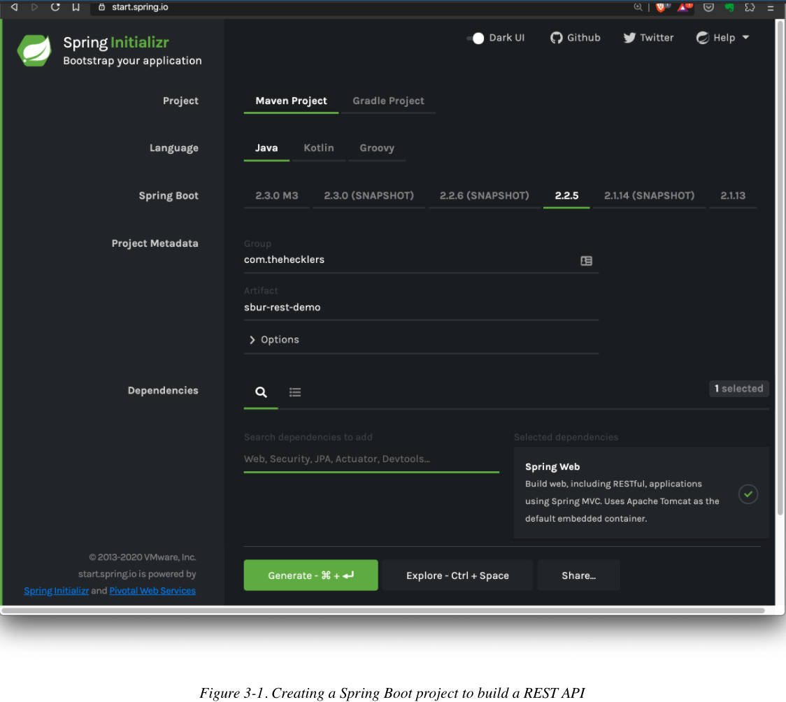

Una vez que hayamos generado el proyecto en Initializr y guardado el archivo .zip resultante localmente, extraeremos los archivos del proyecto comprimidos, normalmente haciendo doble clic en el archivo `sbur-rest-demo.zip` que se descargó en su navegador de archivos o utilizando descomprimir desde una ventana de shell/terminal - y luego abra el proyecto ahora extraído en su IDE o editor de texto elegido para una vista similar a la Figura 3-2.

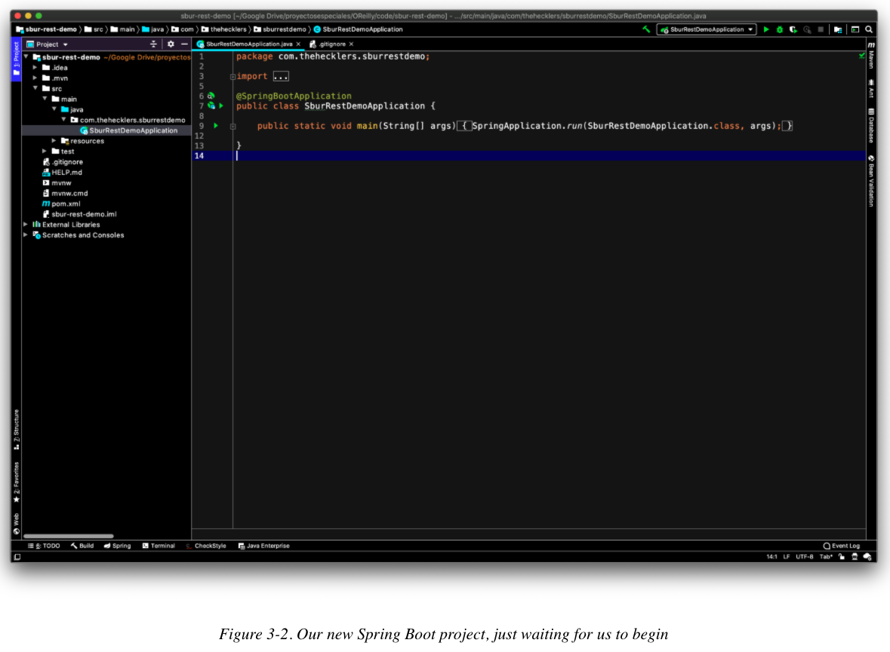

#### CREANDO UN DOMINIO SIMPLE

Para *trabajar con* recursos, necesitaremos escribir código para *acomodar algunos recursos*. Comencemos por crear una clase de dominio muy simple que represente un recurso que queremos administrar.

Soy un aficionado al café, como saben mis buenos amigos, esto ahora te incluye a ti. Con eso en mente, usaré un dominio de café, con una clase que representa un tipo particular de café, como dominio para este ejemplo.

Comencemos por crear la clase `Coffee`. Esto es esencial para el ejemplo, ya que necesitamos un recurso de algún tipo para demostrar cómo administrar los recursos a través de una API REST. Pero la simplicidad o complejidad del dominio es secundaria al ejemplo, así que mantendré la sencillez para centrarme en el objetivo: la API REST resultante.

Como se muestra en la Figura 3-3, la clase `Coffee` tiene dos variables miembro:

* Un campo `id` utilizado para identificar de forma única un tipo particular de café.

* Un campo `name` que describe el café por su nombre.

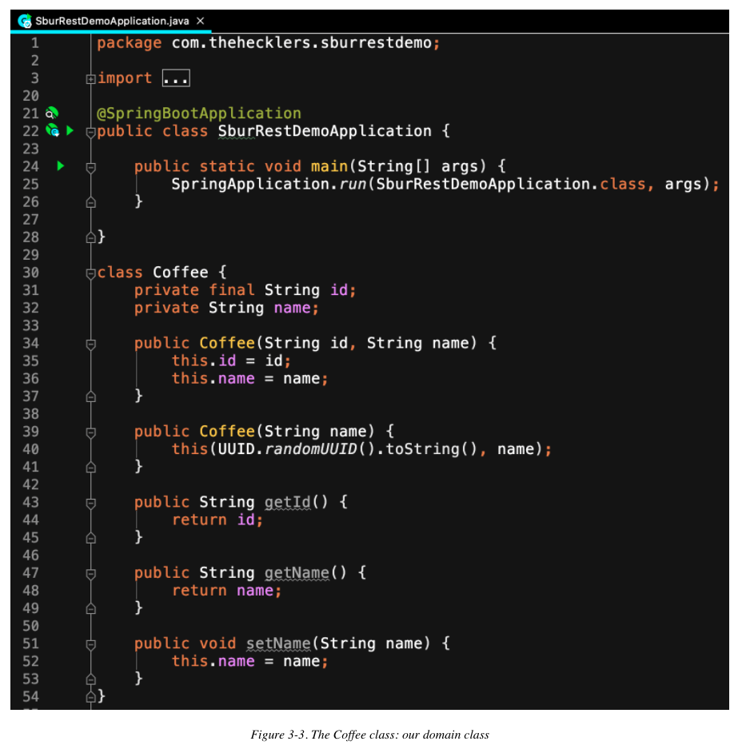

Declaro el campo `id` como `final` para que pueda asignarse solo una vez y nunca modificarse; como tal, esto también requiere que se asigne al crear una instancia de la clase `Coffee` e implica que no tiene un método mutador.

Crearemos métodos de acceso y mutación - o métodos getter y setter, si prefiere llamarlos así, para el campo de `name`, que no se declara `final` y, por lo tanto, es mutable. Esta es una decisión de diseño discutible, pero satisface nuestras necesidades futuras para este ejemplo.

Con eso, ahora tenemos un dominio básico en su lugar. A continuación, es hora de un REST.

### GET-ting

Quizás el más utilizado de los verbos es `GET`. Así que comencemos (*get*) (juego de palabras).

#### `@RESTCONTROLLER` EN POCAS PALABRAS

Sin profundizar demasiado en el rabbithole, Spring MVC (Model-View-Controller) se creó para separar las preocupaciones entre los datos, su entrega y su presentación, asumiendo que las vistas se proporcionarían como una página web renderizada por el servidor. La anotación `@Controller` ayuda a unir las distintas piezas.

`@Controller` es un estereotipo/alias para la anotación `@Component`, lo que significa que al iniciar la aplicación, un Spring Bean, un objeto creado y administrado por el contenedor Spring Inversion of Control (IoC) dentro de la aplicación, se crea a partir de esa clase. Las clases con anotaciones de `@Controller` acomodan un objeto `Model` para proporcionar datos basados en el modelo a la capa de presentación y trabajan con un `ViewResolver` para dirigir la aplicación para que muestre una vista en particular, según lo representa una tecnología de vista.

**NOTA**

Spring admite varias tecnologías de vista y motores de plantillas, que se tratan en un capítulo posterior.

También es posible indicar a una clase `Controller` que devuelva una respuesta formateada como notación de objetos JavaScript (JSON) o como otro formato orientado a datos, como XML, simplemente agregando una anotación `@ResponseBody` a la clase o método (JSON de forma predeterminada). Esto da como resultado que el valor de retorno Objeto/Iterable de un método sea el *entire body* (cuerpo completo) del response a una solicitud web, en lugar de devolverse como parte del `Model`.

La anotación `@RestController` es una anotación de conveniencia que combina `@Controller` con `@ResponseBody` en una sola anotación descriptiva, simplificando su código y haciendo que la intención sea más obvia. Una vez que hemos anotado una clase como `@RestController`, podemos comenzar a crear nuestra API REST.

#### OCUPÉMONOS (LET’S `GET` BUSY)

Las API REST tratan con objetos, y los objetos pueden venir solos o como un grupo de objetos relacionados. Para aprovechar nuestro escenario de café, es posible que desee recuperar un café en particular; en su lugar, es posible que desee recuperar todos los cafés, o todos los que se consideran tostados oscuros, que se encuentren dentro de un rango de identificadores o que incluyan "colombiano" en la descripción, por ejemplo. Para adaptarse a la necesidad de recuperar una instancia o más de una instancia de un objeto, es una buena práctica crear varios métodos en nuestro código.

Comenzaré creando una lista de objetos `Coffee` para admitir el método que devuelve múltiples objetos `Coffee`, como se muestra en la Figura 3-4. Defino la variable que contiene este grupo de cafés como una `List` de objetos `Coffee`. Elijo `List` como la interfaz de nivel superior para mi tipo de variable miembro, pero en realidad asignaré una `ArrayList` vacía para usar dentro de la clase `RestApiDemoController`.

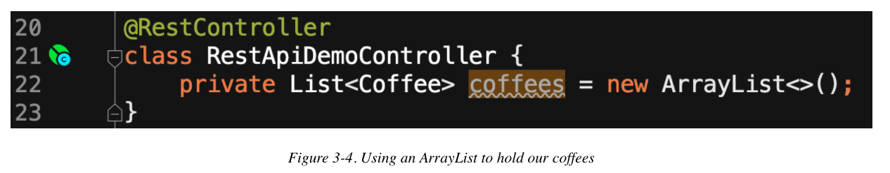

**NOTA**

Es una práctica recomendada adoptar el nivel más alto de tipo (clase, interfaz) que pueda satisfacer limpiamente las API internas y externas. Es posible que no coincidan en todos los casos, ya que no están aquí. Internamente, `List` proporciona el nivel de API que me permite crear la implementación más limpia según mis criterios; externamente, podemos definir una abstracción de nivel incluso superior, como demostraré en breve.

Siempre es una buena idea tener algunos datos para recuperar para confirmar que todo funciona como se esperaba. En la Figura 3-5, creo un constructor para la clase `RestApiDemoController`, agregando código para completar la lista de cafés al crear el objeto.

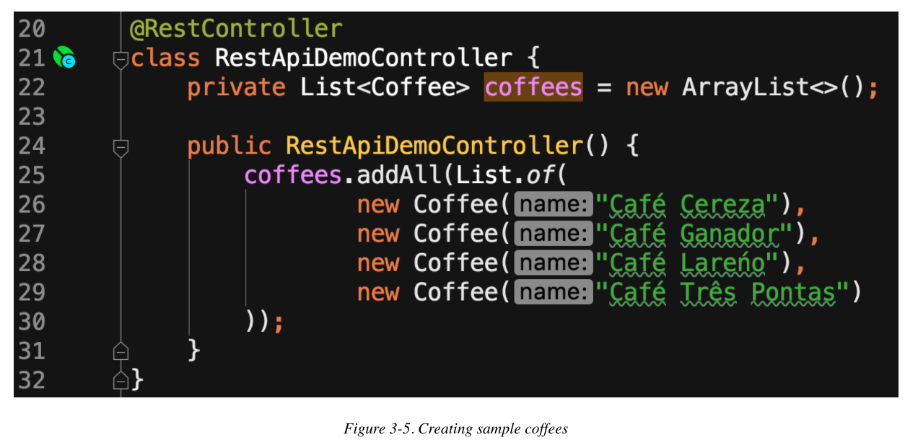

Como se muestra en la Figura 3-6, creo un método que devuelve un grupo iterable de cafés representado por nuestros variables miembro coffees. Elijo usar un `Iterable<Coffee>` porque cualquier tipo iterable proporcionará satisfactoriamente la funcionalidad deseada de esta API.

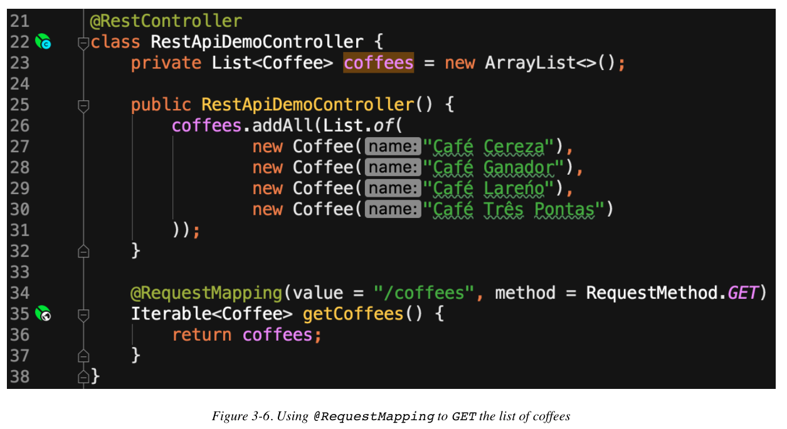

A la anotación `@RequestMapping`, agrego una especificación de ruta de `/coffees` y un tipo de método de `RequestMethod.GET`, lo que indica que el método responderá a las solicitudes con la ruta de `/coffees` y restringirá las solicitudes solo a las solicitudes HTTP GET. Este método maneja la recuperación de datos, pero no las actualizaciones de ningún tipo. Spring Boot, a través de las dependencias de Jackson incluidas en Spring Web, realiza la clasificación y la eliminación de la clasificación de objetos a JSON u otros formatos automáticamente.

Podemos simplificar esto aún más usando otra anotación de conveniencia. El uso de `@GetMapping` incorpora la dirección para permitir solo solicitudes `GET`, lo que reduce el texto estándar y requiere que solo se especifique la ruta, incluso omitiendo la `path =` ya que no se requiere la eliminación de conflictos de parámetros. La Figura 3-7 muestra el resultado de este intercambio de anotaciones.

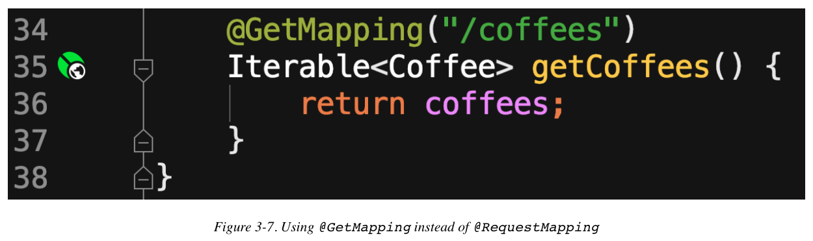

#### CONSEJOS ÚTILES SOBRE `@REQUESTMAPPING`

`@RequestMapping` tiene varias anotaciones de conveniencia especializadas:

* `@GetMapping`
* `@PostMapping`
* `@PutMapping`
* `@PatchMapping`
* `@DeleteMapping`

Cualquiera de estas anotaciones de mapeo se puede aplicar a nivel de clase o método, y las rutas son aditivas. Por ejemplo, si tuviera que anotar el `RestApiDemoController` y su método `getCoffees()` como se muestra en la Figura 3-8, la aplicación respondería exactamente igual que con el código que se muestra en las Figuras 3-6 y 3-7.

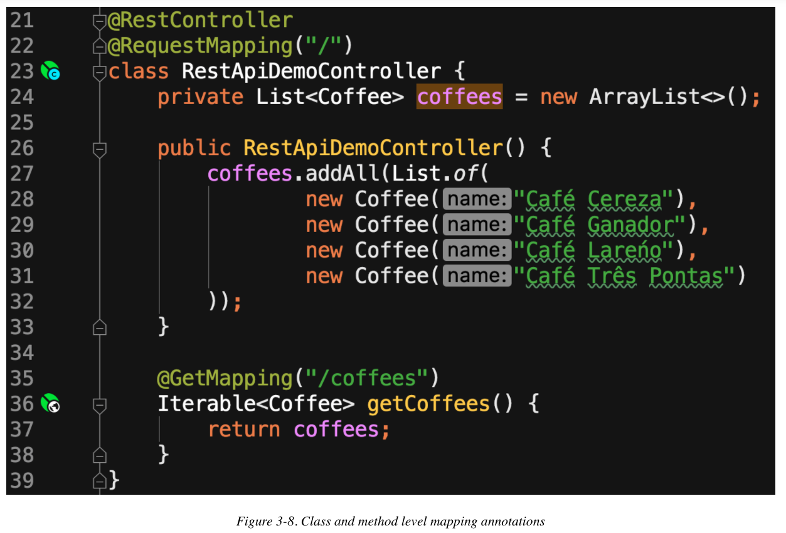

Recuperar todos los cafés de nuestro almacén de datos improvisado es útil, pero no es suficiente. ¿Y si queremos recuperar un café en particular?

Recuperar un solo elemento funciona de manera similar a recuperar varios de ellos. Agregaré otro método llamado `getCoffeeById` para administrar esto por nosotros, como se muestra en la Figura 3-9.

La parte `{id}` de la ruta especificada es una variable URI (Uniform Resource Identifier- Identificador uniforme de recursos), y su valor se pasa al método `getCoffeeById` a través del parámetro del método `id` anotándolo con `@PathVariable`.

Iterando sobre la lista de cafés, el método devuelve un poblado `Optional<Coffee>` si encuentra una coincidencia, o un `Optional<Coffee>` vacío si el `id` solicitada no está presente en nuestro pequeño grupo de cafés.

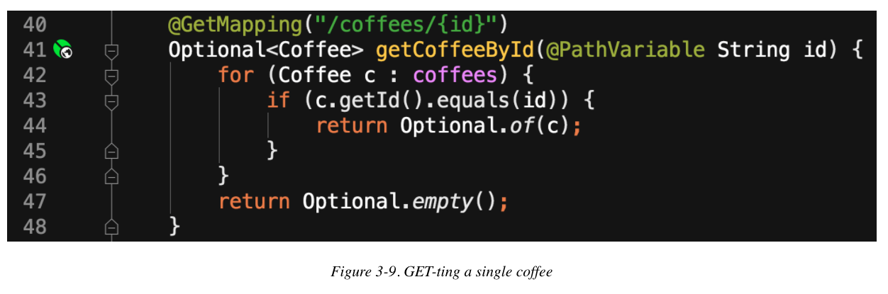

### POST-ing

Para crear recursos, un método `HTTP POST` es la opción preferida.

**NOTA**

Un `POST` proporciona detalles de un recurso, generalmente en formato JSON, y solicita que el servicio de destino cree ese recurso *bajo* el URI especificado.

Como se muestra en la Figura 3-10, un `POST` es un asunto relativamente simple: nuestro servicio recibe los detalles de café especificados como un objeto `Coffee`, gracias a la clasificación automática de Spring Boot, y lo agrega a nuestra lista de cafés. A continuación, devuelve el objeto de café, que Spring Boot no asigna automáticamente a JSON de forma predeterminada, a la aplicación o servicio solicitante.

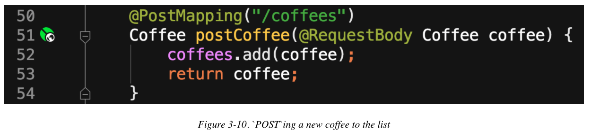

### PUT-ting

En términos generales, las solicitudes `PUT` se utilizan para actualizar recursos existentes con URI conocidos.

**NOTA**

Según el documento del IETF titulado [Hypertext Transfer Protocol (HTTP/1.1): Semantics and Content](https://tools.ietf.org/html/rfc7231), las solicitudes `PUT` deben actualizar el recurso especificado si está presente; si el recurso aún no existe, debe crearse.

La Figura 3-11 funciona de acuerdo con la especificación: busque el café con el identificador especificado y, si lo encuentra, actualícelo. Si no hay tal café en la lista, créelo.

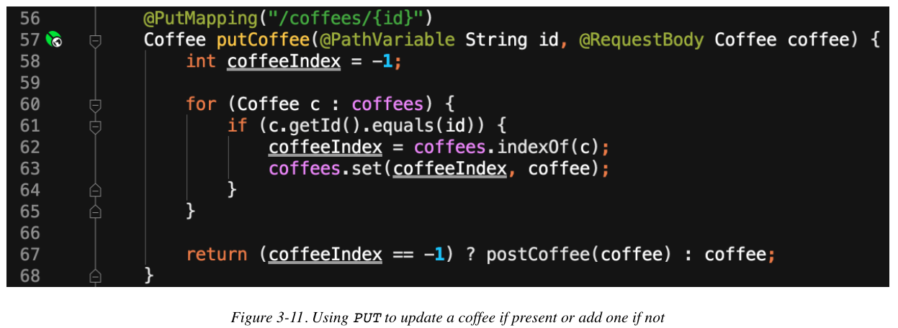

### DELETE-ing

Para eliminar un recurso, usamos una solicitud `HTTP DELETE`. Como se muestra en la Figura 3-12, creamos un método que acepta el identificador de un café como una `@PathVariable` y elimina el café correspondiente de nuestra lista utilizando el método `removeIf Collection`. `removeIf` acepta un `Predicate`, lo que significa que podemos proporcionar una lambda para evaluar que devolverá un valor booleano de `true` para eliminar el café deseado . Agradable y ordenado.

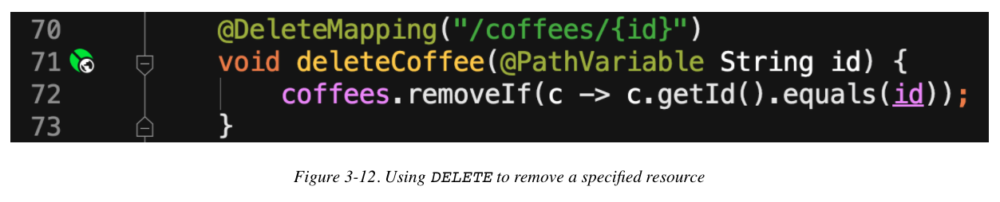

### Y más

Si bien hay muchas más cosas que se podrían hacer para mejorar este escenario, me centraré en dos en particular: reducir la repetición y devolver los códigos de estado HTTP cuando lo requiera la especificación.

Para reducir la repetición en el código, elevaré la parte de la asignación de URI que es común a todos los métodos dentro de la clase `RestApiDemoController` a la anotación `@RequestMapping` de nivel de clase, `"/coffees"`. Luego, podemos eliminar esa misma parte del URI de la especificación del URI de mapeo de cada método, reduciendo un poco el nivel de ruido textual, como muestra el ejemplo abreviado de la Figura 3-13.

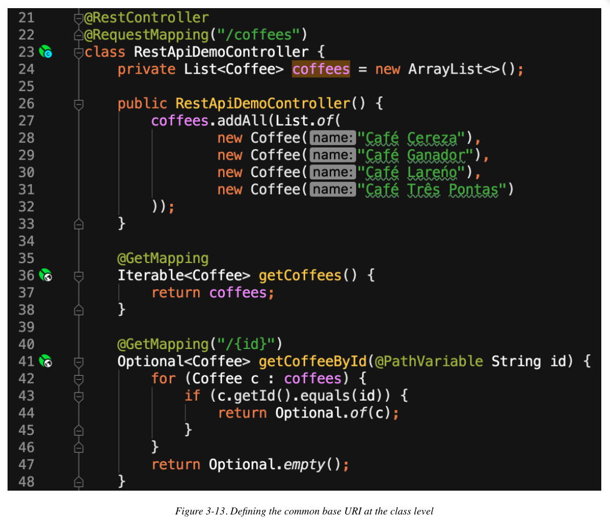

A continuación, consulto el documento IETF al que se hizo referencia anteriormente y observo que, si bien los códigos de estado HTTP no se especifican para `GET` y no se sugieren para los métodos `POST` y `DELETE`, son necesarios para las respuestas del método `POST`. Para lograr esto, modifico el método `putCoffee` como se muestra en la Figura 3-14. En lugar de devolver solo el objeto `Coffee` actualizado o creado, el método `putCoffee` ahora devolverá una `ResponseEntity` que contiene dicho `Coffee` y el código de estado HTTP `status code: 201` (Created) si el `PUT` coffee aún no existía y 200 (OK) si existía y se actualizó. Por supuesto, podríamos hacer más, pero el código de la aplicación actual cumple con los requisitos y representa API internas y externas sencillas y limpias.

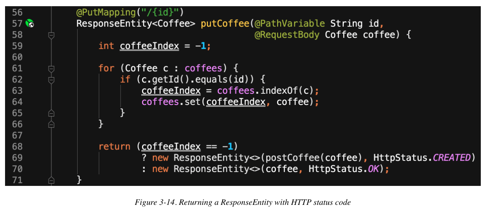

## Confiar pero verificar

Con todo el código en su lugar, pongamos a prueba esta API.

**NOTA**
Utilizo el cliente HTTP de línea de comando [HTTPie](https://httpie.org/) para casi todas mis tareas basadas en HTTP. De vez en cuando también usaré [curl](https://curl.haxx.se/) o [Postman](https://www.postman.com/), pero encuentro que HTTPie es un cliente versátil con una interfaz de línea de comandos optimizada y una utilidad excelente.

Como se muestra en la Figura 3-15, consulto el endpoint `coffees` para recuperar todos los cafés actualmente en nuestra lista. HTTPie toma por defecto una solicitud GET y asume *localhost* si no se proporciona un nombre de host, lo que reduce la escritura innecesaria. Como era de esperar, vemos los cuatro cafés con los que completamos previamente nuestra lista.

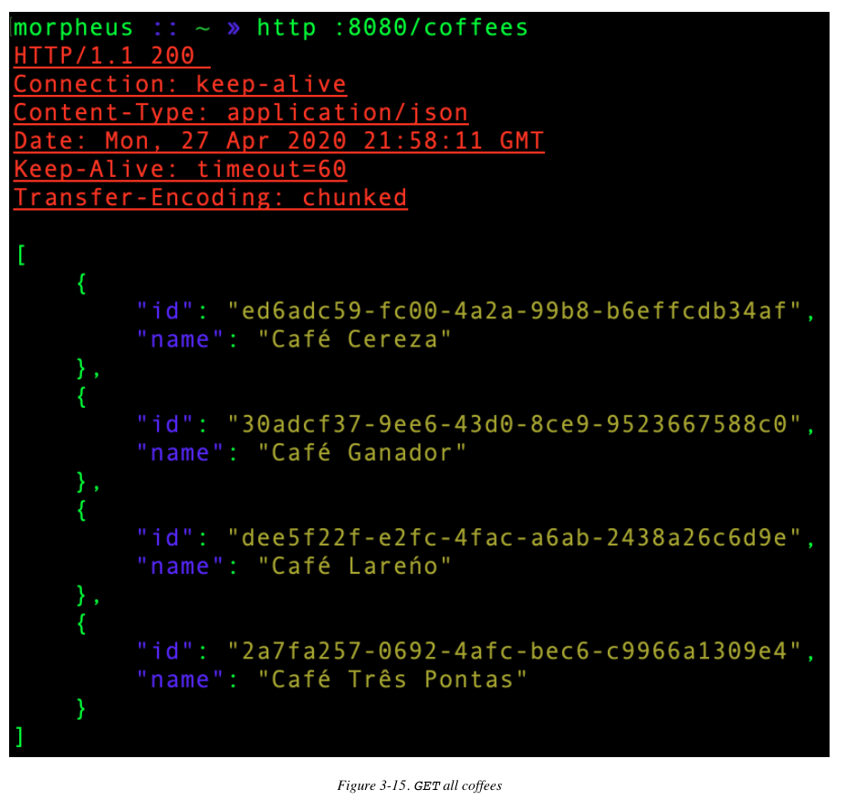

A continuación, copio el campo de identificación de uno de los cafés que acabo de enumerar y lo pego en otra solicitud GET. La Figura 3-16 muestra la respuesta correcta.

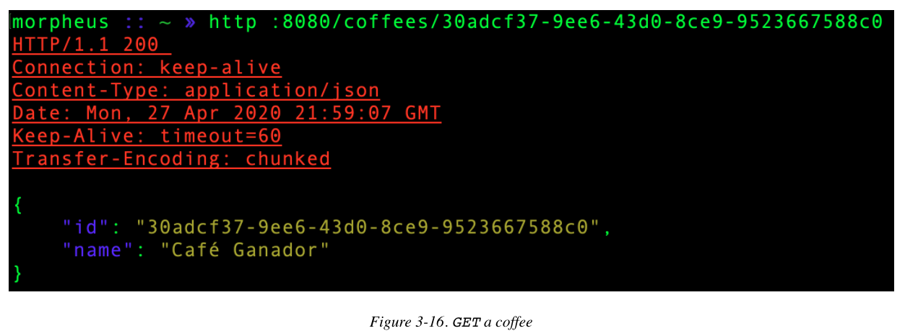

Ejecutar una solicitud `POST` con HTTPie es simple: simplemente canalice un archivo de texto sin formato que contenga una representación JSON de un objeto `Coffee` con campos `id` y `name` y HTTPie asume que una operación POST está en orden. La Figura 3-17 muestra el comando y su resultado exitoso.

Como se mencionó anteriormente, un comando `PUT` debería permitir actualizar un recurso existente o agregar uno nuevo si el recurso solicitado aún no existe. En la Figura 3-18, especifico la identificación del café que acabo de agregar y paso otro objeto JSON con un nombre diferente al comando. El resultado es que el café con la identificación "99999" ahora tiene un `name` de "Caribou Coffee" en lugar de "Kaldi’s Coffee" como antes. El código de retorno es 200 (OK) como se esperaba también.

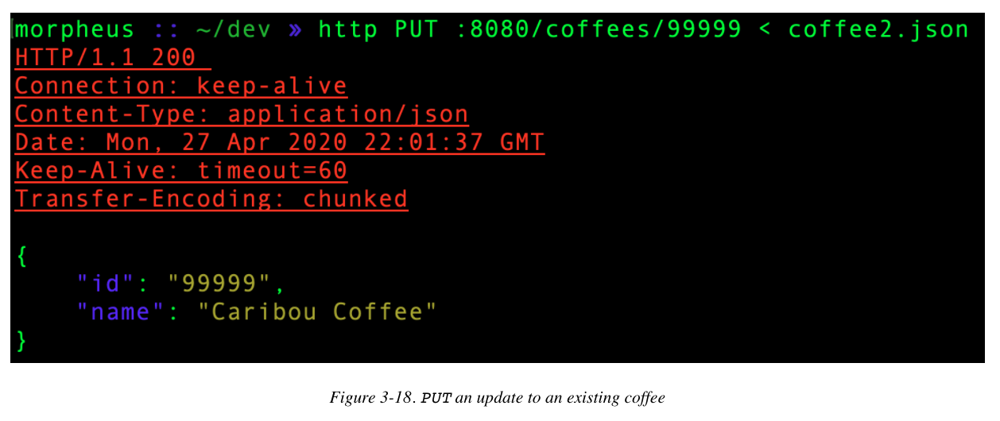

En la Figura 3-19, inicio una solicitud `PUT` de la misma manera, pero hago referencia a una identificación en el URI que no existe. La aplicación lo agrega diligentemente de acuerdo con el comportamiento especificado por IETF y devuelve correctamente un estado HTTP de 201 (Creado).

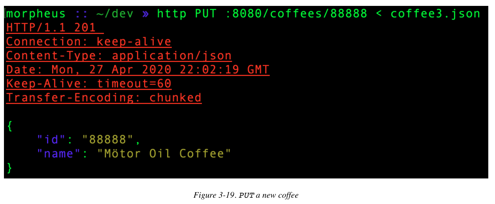

Crear una solicitud `DELETE` con HTTPie es muy similar a crear una solicitud `PUT`: se debe especificar el verbo HTTP y el URI del recurso debe estar completo. La Figura 3-20 muestra el resultado: un código de estado HTTP de 200 (OK) que indica que el recurso se eliminó correctamente y no se muestra ningún valor, ya que el recurso ya no existe.

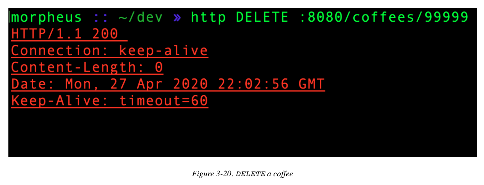

Finalmente, volvemos a consultar nuestra lista completa de cafés para confirmar el estado final esperado. Como lo demuestra la Figura 3-21, ahora tenemos un café adicional que no estaba en nuestra lista antes, como se esperaba: Mötor Oil Coffee. La validación de API es un éxito.

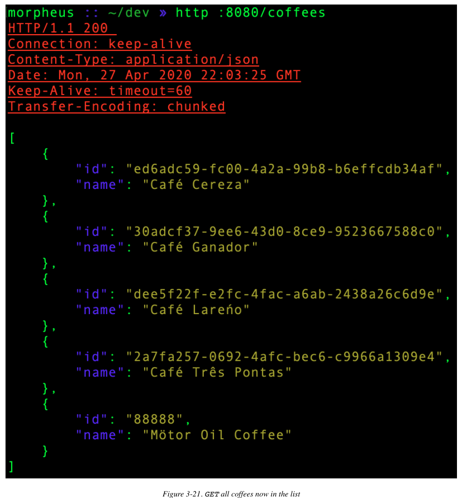

## Resumen

Este capítulo demostró cómo desarrollar una aplicación de trabajo básica usando Spring Boot. Dado que la mayoría de las aplicaciones implican exponer a los usuarios recursos de backend en la nube, generalmente a través de una interfaz de usuario de front-end, mostré cómo crear y desarrollar una API REST útil que se puede consumir de numerosas formas consistentes para proporcionar la funcionalidad necesaria para crear, leer y actualizar y la eliminación de recursos centrales para casi todos los sistemas críticos.

Examiné y expliqué la anotación `@RequestMapping` y sus diversas especializaciones de anotación de conveniencia que se alinean con los verbos HTTP definidos:

* `@GetMapping`
* `@PostMapping`
* `@PutMapping`
* `@PatchMapping`
* `@DeleteMapping`

Después de crear métodos que abordaron muchas de estas anotaciones y sus acciones asociadas, luego refactoré un poco el código para simplificarlo y proporcionar códigos de respuesta HTTP donde sea necesario. Validar la API confirmó su correcto funcionamiento.

En el próximo capítulo, discutiré y demostraré cómo agregar acceso a la base de datos a nuestra aplicación Spring Boot para que sea cada vez más útil y esté lista para la producción.

