# 4. Agregar Acceso a  Base de Datos a su Aplicación Spring Boot

Como se discutió en el capítulo anterior, las aplicaciones a menudo exponen API sin estado por muy buenas razones. Sin embargo, entre bastidores, muy pocas aplicaciones útiles son completamente efímeras; El estado de algún tipo generalmente se almacena para algo. Por ejemplo, cada solicitud al carrito de compras de una tienda en línea puede incluir su estado, pero una vez que se realiza el pedido, se conservan los datos de ese pedido. Hay muchas formas de hacer esto y muchas formas de compartir o enrutar estos datos, pero invariablemente hay una o más bases de datos involucradas en casi todos los sistemas de tamaño suficiente.

En este capítulo, demostraré cómo agregar acceso a la base de datos a la aplicación Spring Boot creada en el último capítulo. Este capítulo está destinado a ser una breve introducción a las capacidades de datos de Spring Boot, y los capítulos siguientes profundizarán mucho más. Pero en muchos casos, los conceptos básicos que se tratan a continuación aún se aplican bien y brindan una solución completamente suficiente. Vamos a profundizar en.

## Preparación Autoconfig para el Acceso a la Base de Datos

Como se demostró anteriormente, Spring Boot tiene como objetivo simplificar en la mayor medida posible el llamado caso de uso del 80-90%: los patrones de código y proceso que los desarrolladores hacen una y otra vez. Una vez que se identifican los patrones, Spring Boot entra en acción (!) para inicializar los beans requeridos automáticamente, con configuraciones predeterminadas sensibles. Personalizar una capacidad es tan simple como proporcionar uno o más valores de propiedad o crear una versión personalizada de uno o más beans; una vez que autoconfig detecta los cambios, retrocede y sigue las instrucciones del desarrollador. El acceso a la base de datos es un ejemplo perfecto.

## ¿Qué esperamos ganar?

En nuestra aplicación de ejemplo anterior, usé un `ArrayList` para almacenar y mantener nuestra lista de cafés. Este enfoque es lo suficientemente sencillo para una sola aplicación, pero tiene sus inconvenientes.

En primer lugar, no es resiliente en absoluto. Si su aplicación o la plataforma que la ejecuta falla, todos los cambios realizados en la lista mientras la aplicación se estaba ejecutando, ya sea por segundos o meses, desaparecen.

En segundo lugar, no escala. Iniciar otra instancia de la aplicación da como resultado que la segunda instancia (o posterior) de la aplicación tenga su propia lista distinta de cafés que mantiene. Los datos no se comparten entre las múltiples instancias, por lo que los cambios en los cafés hechos por una instancia (cafés nuevos, eliminaciones, actualizaciones) no son visibles para cualquiera que acceda a una instancia de aplicación diferente.

Claramente, esta no es una forma de hacer funcionar un ferrocarril.

Cubriré algunas formas diferentes de resolver completamente estos problemas tan reales en los próximos capítulos. Pero por ahora, establezcamos algunas bases que servirán como pasos útiles en el camino hacia allí.

### Agregar una Dependencia a Base de Datos

Para acceder a una base de datos desde su aplicación Spring Boot, necesita algunas cosas:

* Una base de datos en ejecución, ya sea iniciada por/incrustada dentro de su aplicación o simplemente accesible a su aplicación

* Controladores de base de datos que permiten el acceso mediante programación, generalmente proporcionados por el proveedor de la base de datos

* Un módulo Spring Data para acceder a la base de datos de destino

Ciertos módulos de Spring Data incluyen los controladores de base de datos apropiados como una única dependencia seleccionable desde dentro de Spring Initializr. En otros casos, como cuando Spring usa la API de persistencia de Java (JPA) para acceder a almacenes de datos compatibles con JPA, es necesario elegir la dependencia de Spring Data JPA y una dependencia para el controlador específico de la base de datos de destino, p. PostgreSQL.

Para dar el primer paso desde las construcciones de memoria a la base de datos persistente, comenzaré agregando dependencias y, por lo tanto, capacidades al archivo de compilación de nuestro proyecto.

H2 es una base de datos rápida escrita completamente en Java que tiene algunas características interesantes y útiles. Por un lado, es compatible con JPA, por lo que podemos conectar nuestra aplicación a él de la misma manera que lo haríamos con cualquier otra base de datos JPA como Microsoft SQL, MySQL, Oracle o PostgreSQL. También tiene modos en memoria y basados en disco. Esto nos permite algunas opciones útiles después de convertir de nuestra `ArrayList` en memoria a una base de datos en memoria: podemos cambiar H2 a persistencia basada en disco o, dado que ahora estamos usando una base de datos JPA, cambiar a una base de datos JPA diferente . Cualquiera de las opciones se vuelve mucho más simple en ese momento.

Para permitir que nuestra aplicación interactúe con la base de datos H2, agregaré las siguientes dos dependencias a la sección `<dependencies>` del `pom.xml` de nuestro proyecto:

```html
<dependency>
    <groupId>org.springframework.boot</groupId>
    <artifactId>spring-boot-starter-data-jpa</artifactId>
</dependency>
<dependency>
    <groupId>com.h2database</groupId>
    <artifactId>h2</artifactId>
    <scope>runtime</scope>
</dependency>
```

**NOTA**

El alcance del tiempo de ejecución de la dependencia del controlador de la base de datos H2 indica que estará presente en el tiempo de ejecución y en la ruta de clases de prueba, pero no en la ruta de clases de compilación. Esta es una buena práctica para las bibliotecas que no son necesarias para la compilación.

Una vez que guarde su `pom.xml` actualizado y (si es necesario) vuelva a importar/actualizar sus dependencias de Maven, tendrá acceso a la funcionalidad incluida dentro de las dependencias agregadas. A continuación, es hora de escribir un poco de código para usarlo.

### Agregar código

Dado que ya tenemos un código para administrar los cafés de alguna manera, necesitaremos refactorizar un poco mientras agregamos nuestras nuevas capacidades de base de datos. Creo que el mejor lugar para comenzar es con la clase(s) de dominio, en este caso, `Coffee`.

#### LA ENTIDAD

Como se mencionó anteriormente, H2 es una base de datos compatible con JPA, por lo que agregaré anotaciones JPA para conectar los puntos. A la clase `Coffee` en sí agrego una anotación `@Entity` de `javax.persistence` que indica que `Coffee` es una entidad persistente, y a la variable miembro `id` existente, agrego la anotación `@Id` (también de `javax.persistence`) para marcarla como la base de datos campo de ID de la tabla.

**NOTA**

Si el nombre de la clase (`Coffee` en este caso) no coincide con el nombre de la tabla de base de datos deseada, la anotación `@Entity` acepta un parámetro de nombre para especificar el nombre de la tabla de datos con el que hacer coincidir la entidad anotada.

Si su IDE es lo suficientemente útil, puede proporcionarle comentarios de que todavía falta algo en la clase de `Coffee`. Por ejemplo, IntelliJ subraya el nombre de la clase en rojo y proporciona la útil ventana emergente que se muestra en la Figura 4-1.

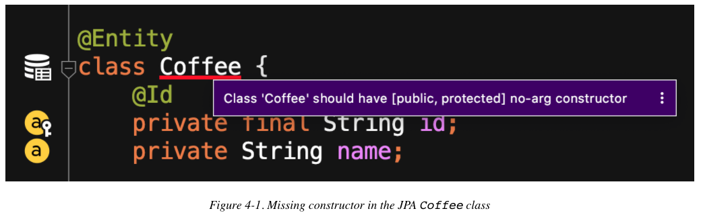

***La API de persistencia de Java requiere un constructor sin argumentos para usar al crear objetos a partir de filas de la tabla de la base de datos***, así que lo agregaré a continuación. Esto da como resultado nuestra próxima advertencia IDE, como se muestra en la Figura 4-2: ***para tener un constructor sin argumentos, debemos hacer que todas las variables miembro sean mutables, es decir, no finales***.

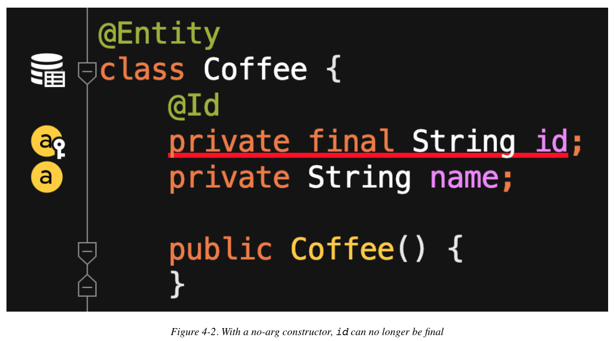

Eliminar la palabra clave `final` de la declaración para la variable miembro `id` resuelve eso. Hacer que `id` sea mutable también requiere que nuestra clase `Coffee` tenga un método de mutación(set) para `id` para que JPA pueda asignar un valor a esa *memvar*, así que agrego el método `setId()` también, como se muestra en la Figura 4-3.

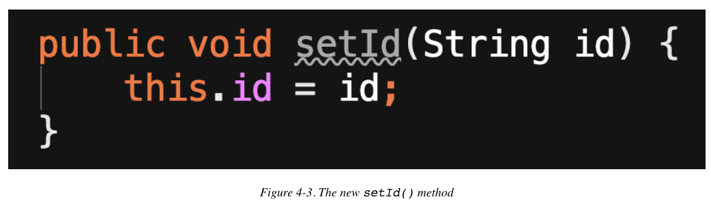

#### EL REPOSITORIO

Ahora que `Coffee` se define como una entidad JPA válida que se puede almacenar y recuperar, es hora de establecer la conexión con la base de datos.

Para un concepto tan simple, configurar y establecer una conexión de base de datos en el ecosistema Java ha sido durante mucho tiempo un asunto bastante complicado. Como se mencionó en el Capítulo 1, el uso de un servidor de aplicaciones para alojar una aplicación Java requería que los desarrolladores realizaran varios pasos tediosos solo para preparar las cosas. Una vez que comenzó a interactuar con la base de datos, o si estaba accediendo a un almacén de datos directamente desde una utilidad de Java o una aplicación cliente, se esperaría que realizara pasos adicionales relacionados con las API de `PersistenceUnit`, `EntityManagerFactory` y `EntityManager` (y posiblemente objetos `DataSource`), abrir y cerrar la base de datos y más. Es una ceremonia muy repetitiva para algo que los desarrolladores hacen con tanta frecuencia.

Spring Data introduce el concepto de repositorios. Un `Repository` es una interfaz definida en Spring Data como una abstracción útil sobre varias bases de datos. Existen otros mecanismos para acceder a las bases de datos de Spring Data que se explicarán en los capítulos siguientes, pero las distintas variantes de `Repository` son posiblemente las más útiles en la mayoría de los casos.

El `Repository` en sí mismo es un simple marcador de posición para los tipos de:  *objeto almacenado en la base de datos* el campo único ID/primary key del objeto

Los repositorios son mucho más, por supuesto, y eso también lo cubriré en algunos capítulos. Por ahora, centrémonos en dos que son directamente relevantes para nuestro ejemplo actual: `CrudRepository` y `JpaRepository`.

¿Recuerda mi mención anterior de la práctica preferida de escribir código para usar la interfaz de más alto nivel adecuada para el propósito?

Si bien `JpaRepository` extiende un puñado de interfaces y, por lo tanto, incorpora una funcionalidad más amplia, `CrudRepository` cubre todas las capacidades clave de CRUD y es suficiente para nuestra (hasta ahora) aplicación simple. Pero no lo usaremos directamente; Después de todo, sigue siendo solo una interfaz genérica.

Lo primero que debe hacer para habilitar el soporte de repositorio para nuestra aplicación es definir una interfaz específica para nuestra aplicación extendiendo una interfaz de Spring Data Repository.

```java
interface CoffeeRepository extends CrudRepository<Coffee, String> {}
```

**NOTA**

Los dos tipos definidos son el tipo de objeto a almacenar y el tipo de su ID único.

Esto representa la expresión más simple de creación de repositorios dentro de una aplicación Spring Boot. Es posible, y muy útil en ocasiones, definir consultas para un repositorio; También me ocuparé de eso en un capítulo futuro. Pero aquí está la parte "mágica": la configuración automática de Spring Boot tiene en cuenta el controlador de la base de datos en la ruta de clase (en este caso, H2), la interfaz del repositorio definida en nuestra aplicación y la definición de la clase `Coffee` de la entidad JPA, y crea un proxy de base de datos bean en nuestro nombre. No es necesario escribir líneas de texto estándar casi idénticas para cada aplicación cuando los patrones son así de claros y consistentes, lo que libera al desarrollador para trabajar en la nueva funcionalidad solicitada.

#### LA UTILIDAD, también conocida como SPRINGING EN ACCIÓN

Ahora para poner ese repositorio a trabajar. Abordaré este paso a paso como en los capítulos anteriores, presentando la funcionalidad primero y puliendo después.

Primero, conectaré/inyectaré automáticamente el bean del repositorio en `RestApiDemoController` para que el controlador pueda acceder a él cuando reciba solicitudes a través de la API externa, como se muestra en la Figura 4-4.

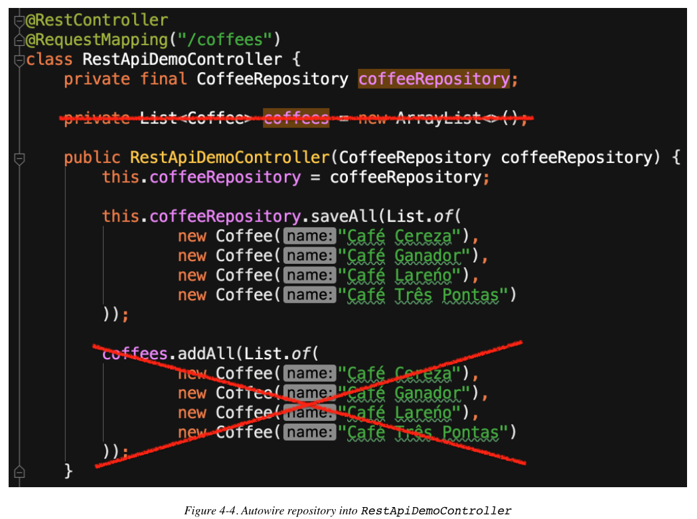

Primero declaro la variable miembro con

```java
private final CoffeeRepository coffeeRepository;
```

A continuación, lo agrego como parámetro al constructor con

```java
public RestApiDemoController(CoffeeRepository coffeeRepository) {
```

**NOTA**

Antes de Spring Framework 4.3, era necesario en todos los casos agregar la anotación `@Autowired` encima del método para indicar cuándo un parámetro representaba un Spring Bean para ser autowired/injected. A partir de la 4.3 en adelante, una clase con un solo constructor no requiere la anotación para los parámetros cableados automáticamente, un ahorro de tiempo útil.

Con el repositorio en su lugar, elimino la memvar `List<Coffee>` y cambio la población inicial de esa lista en el constructor para guardar los mismos cafés en el repositorio, como en la Figura 4-4.

Según la Figura 4-5, la eliminación de la memvar `coffees` marca inmediatamente todas las referencias a ella como símbolos irresolubles, por lo que la siguiente tarea es reemplazarlos con interacciones de repositorio adecuadas.

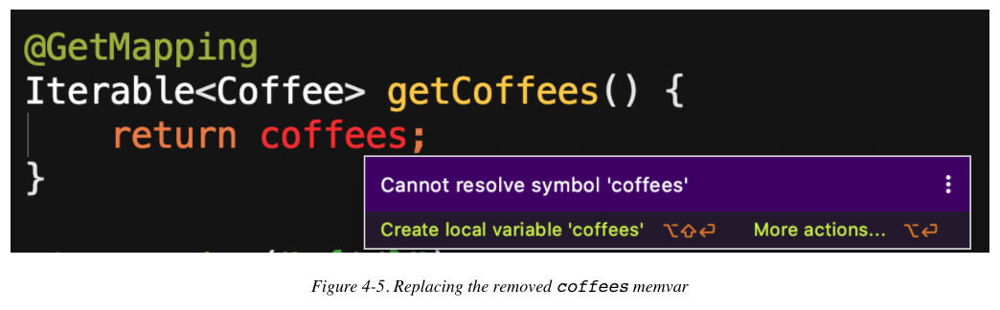

Como una simple recuperación de todos los cafés sin parámetros, el método `getCoffees()` es un gran lugar para comenzar. Usando el método `findAll()` integrado en `CrudRepository`, ni siquiera es necesario cambiar el tipo de retorno de `getCoffees()` ya que también devuelve un tipo `Iterable`; simplemente llamar a `coffeeRepository.findAll()` y devolver su resultado hace el trabajo, como se muestra en la Figura 4-6.

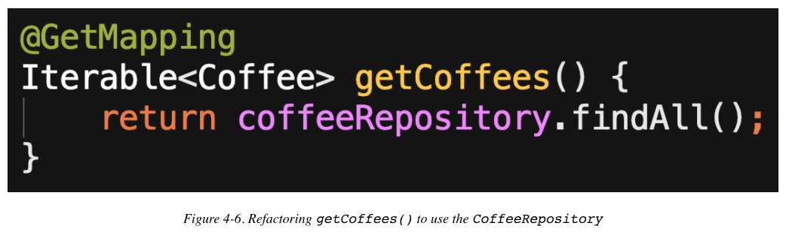

Refactorizar el método `getCoffeeById()` presenta algunas ideas sobre cuánto más simple puede ser su código gracias a la funcionalidad que aportan los repositorios a la mezcla. Ya no tenemos que buscar manualmente en la lista de cafés una identificación que coincida; El método `findById()` de `CrudRepository` lo maneja por nosotros, como se muestra en la Figura 4-7. Y dado que `findById()` devuelve un tipo Opcional, no se requieren cambios de ningún tipo para la firma de nuestro método.

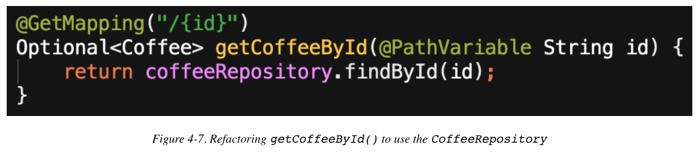

Convertir el método `postCoffee()` para usar el repositorio también es una tarea bastante sencilla, como se muestra en la Figura 4-8.

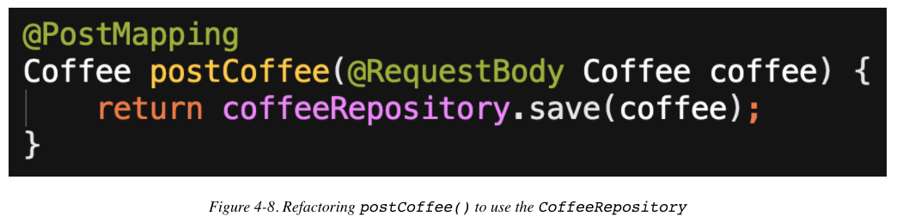

Con el método `putCoffee()`, nuevamente vemos algunas de las funciones sustanciales de ahorro de tiempo y código del `CrudRepository` en exhibición. Utilizo el método de repositorio integrado `existingById()` para determinar si se trata de un `Coffee` nuevo o existente y devuelvo el código de estado HTTP apropiado junto con el `Coffee` guardado, según la Figura 4-9.

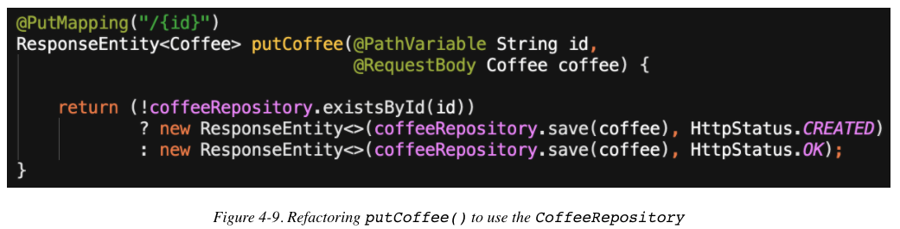

Finalmente, actualizo el método `deleteCoffee()` para usar el método `deleteById()` incorporado de `CrudRepository`, como en la Figura 4-10.

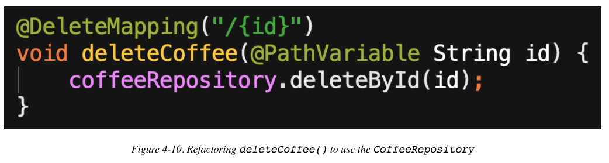

Ahora todo lo que queda es verificar que nuestra aplicación funciona como se esperaba y la funcionalidad externa sigue siendo la misma.

**NOTA**

Un enfoque alternativo para probar la funcionalidad, y una práctica recomendada, es crear primero pruebas unitarias, a la Test Driven Development (TDD). Recomiendo encarecidamente este enfoque en entornos de desarrollo de software del mundo real, pero he descubierto que cuando el objetivo es demostrar y explicar conceptos de desarrollo de software discretos, menos es mejor; mostrar lo menos posible para comunicar claramente los conceptos clave aumenta la señal y disminuye el ruido, incluso si el ruido es útil más adelante. Como tal, cubro las pruebas en un capítulo dedicado más adelante en este libro.

## Guardar y recuperar datos

Una vez más hasta la brecha, queridos amigos, una vez más: accediendo a la API desde la línea de comandos usando HTTPie.

Al consultar el endpoint de los cafés, los mismos cuatro cafés que se devuelven de nuestra base de datos H2 como antes, como se muestra en la Figura 4-11.

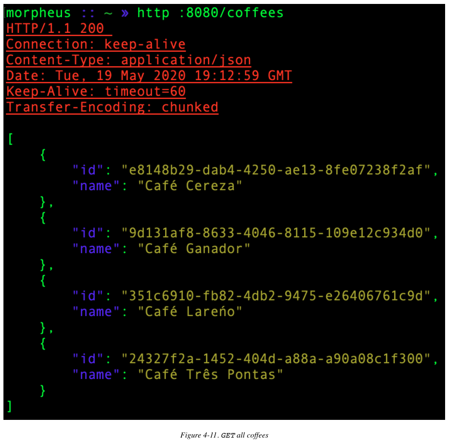

Copiar el campo id de uno de los cafés que se acaban de enumerar y pegarlo en una solicitud `GET` específica de café produce la salida que se muestra en la Figura 4-12.

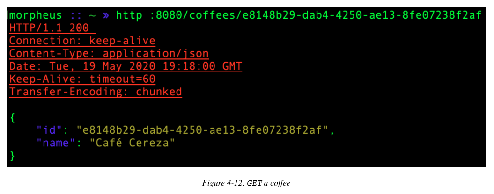

En la Figura 4-13, Posteamos un nuevo café a la aplicación y su base de datos.

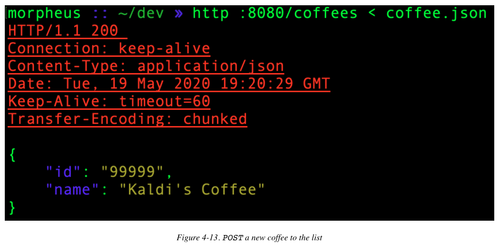

Como se discutió en el capítulo anterior, un comando `PUT` debería permitir actualizar un recurso existente o agregar uno nuevo si el recurso solicitado aún no existe. En la Figura 4-14, especifico el `id` del café que acabo de agregar y paso al comando un objeto JSON con un cambio en el nombre de ese café. Después de la actualización, el café con `id` "99999" ahora tiene un nombre de "Caribou Coffee" en lugar de "Kaldi’s Coffee", y el código de retorno es 200 (OK), como se esperaba.

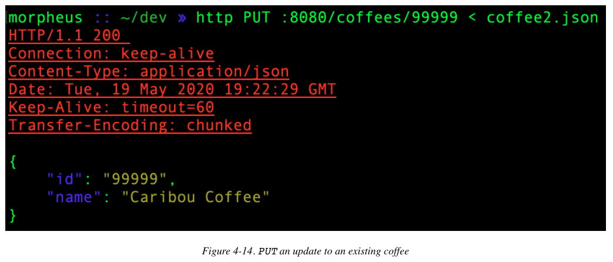

A continuación, inicio una solicitud `PUT` similar, pero especifico un  `id` en el URI que no existe. La aplicación agrega un nuevo café a la base de datos de acuerdo con el comportamiento especificado por IETF y devuelve correctamente un estado HTTP de 201 (Created), como se muestra en la Figura 4-15.


Finalmente, pruebo la eliminación de un café específico emitiendo una solicitud `DELETE`, que devuelve solo un código de estado HTTP de 200 (OK) que indica que el recurso se eliminó con éxito y nada más, ya que el recurso ya no existe, según la Figura 4-16.

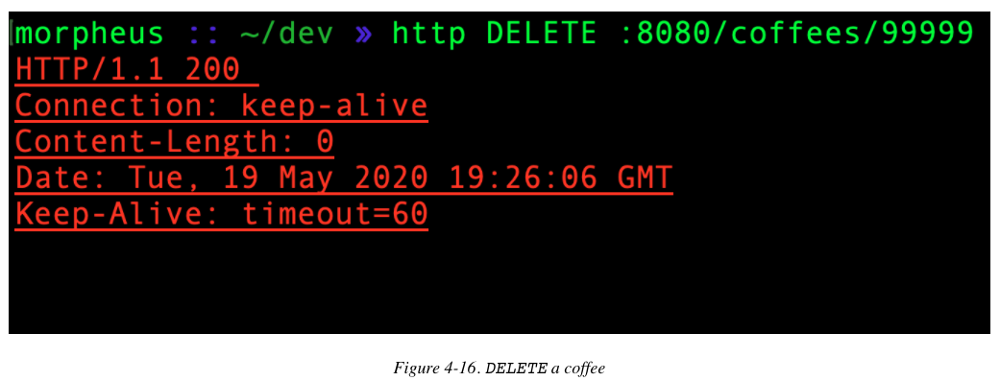

Para comprobar nuestro estado final, consultamos una vez más la lista completa de cafés (Figura 4-17). Como antes, ahora tenemos un café adicional que inicialmente no estaba en nuestro repositorio: Mötor Oil Coffee.

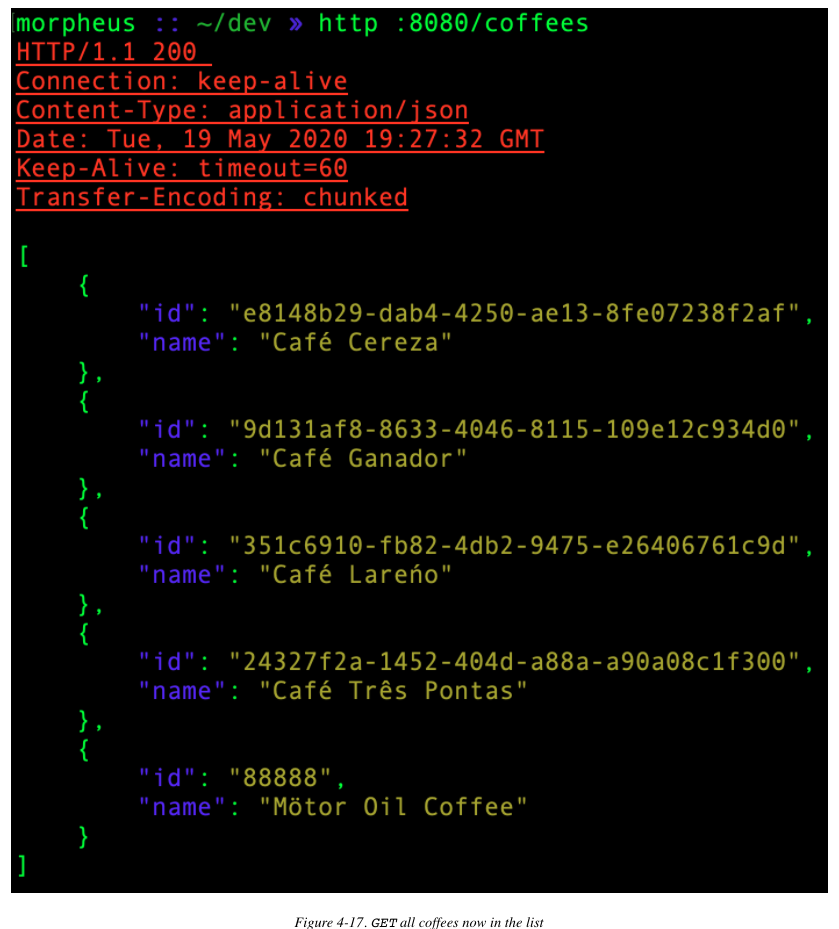

## Un poco de pulido

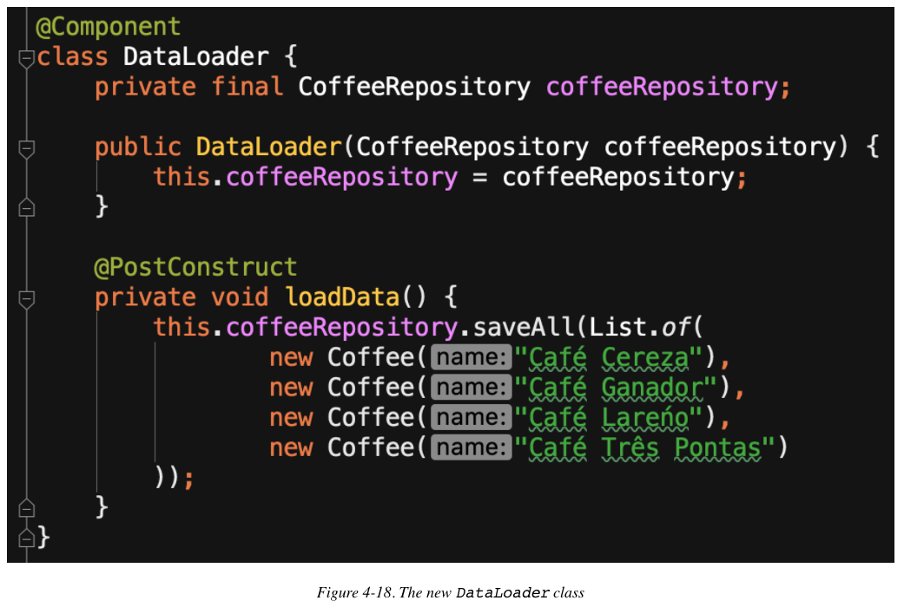

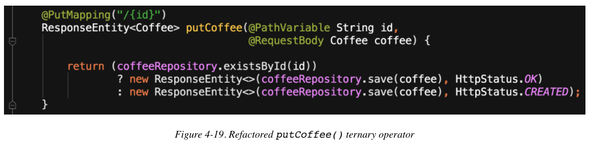

## Resumen


